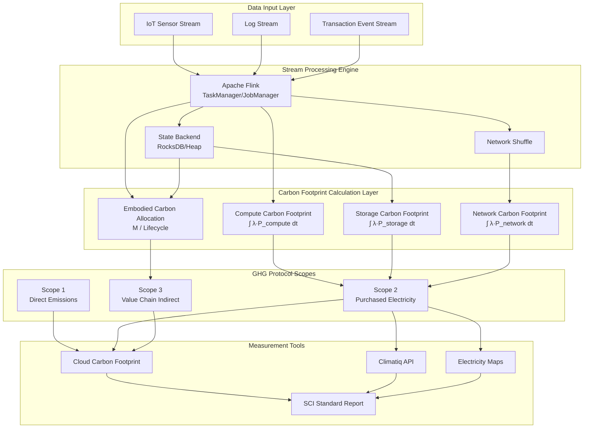
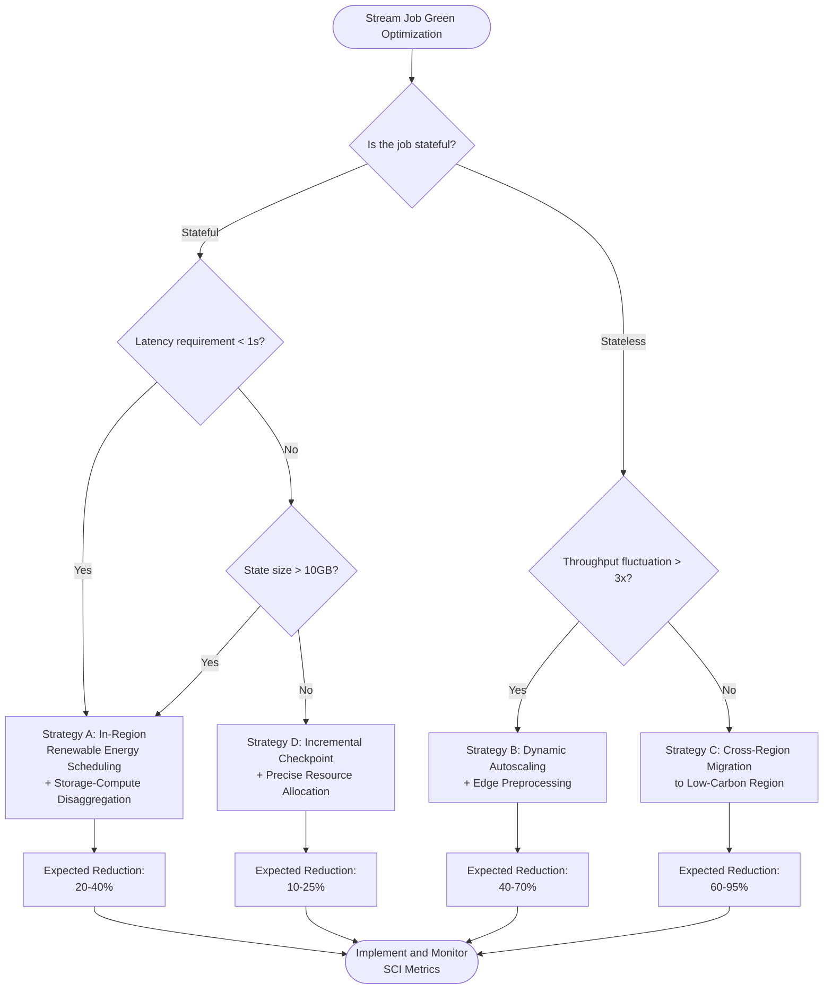

# Stream Processing Carbon Footprint Measurement and Green Computing Methodology

> **Stage**: Knowledge/06-frontier/green-ai-streaming/ | **Prerequisites**: [Knowledge/06-frontier/](../06-frontier/), [Flink/04-runtime/resource-scheduling.md](../../../Flink/04-runtime/resource-scheduling.md) | **Formalization Level**: L3-L4 | **Last Updated**: 2026-04

---

## 1. Concept Definitions

**Def-K-GS-01** (Stream Processing System Carbon Footprint, 流处理系统碳足迹): Given stream processing system $\mathcal{S}$ within time interval $[t_0, t_1]$, its carbon footprint $\Phi(\mathcal{S}, t_0, t_1)$ is defined as the total sum of direct and indirect carbon dioxide equivalent emissions ($\text{kgCO}_2\text{e}$):

$$
\Phi(\mathcal{S}, t_0, t_1) = \int_{t_0}^{t_1} \lambda(t) \cdot P_{\mathcal{S}}(t) \, dt
$$

Where $\lambda(t)$ is the electricity carbon emission intensity ($\text{kgCO}_2\text{e}/\text{kWh}$), and $P_{\mathcal{S}}(t)$ is the system power consumption (kW). The same Flink job can have a carbon footprint 5–10× different between coal-power regions and hydro-power regions[^1].

**Def-K-GS-02** (Stream Processing System Carbon Intensity, 流处理系统碳强度): The carbon intensity $I_{\mathcal{S}}$ of stream processing system $\mathcal{S}$ is defined as the carbon emissions per unit of data processed:

$$
I_{\mathcal{S}} = \frac{\Phi(\mathcal{S}, t_0, t_1)}{N_{\text{proc}}}
$$

Where $N_{\text{proc}}$ is the total number of events processed in interval $[t_0, t_1]$, enabling comparability across jobs of different scales and throughputs.

**Def-K-GS-03** (Software Carbon Intensity, SCI, 软件碳强度): According to ISO/IEC 21031:2024[^2], software carbon intensity $R = (E \cdot I + M) / N$, where $E$ is operational energy consumption (kWh), $I$ is electricity carbon emission intensity, $M$ is hardware embodied carbon allocation ($\text{kgCO}_2\text{e}$), and $N$ is the number of functional units. Stream processing systems typically adopt **carbon emissions per million records** ($\text{kgCO}_2\text{e}/10^6\ \text{events}$) as the functional unit.

**Def-K-GS-04** (Carbon per Event, CpE, 每事件碳排放): The per-event carbon emissions of stream processing job $\mathcal{J}$ under runtime configuration $\theta$:

$$
\text{CpE}(\mathcal{J}, \theta) = \frac{P_{\text{compute}}(\theta) + P_{\text{storage}}(\theta) + P_{\text{network}}(\theta)}{\mu(\theta)} \cdot I_{\text{grid}}
$$

Where $P_{\text{compute}}$, $P_{\text{storage}}$, and $P_{\text{network}}$ are the power consumption of compute, storage, and network components respectively, $\mu(\theta)$ is throughput (events/s), and $I_{\text{grid}}$ is grid carbon intensity.

**Def-K-GS-05** (Life Cycle Assessment, LCA, 全生命周期评估): The LCA of a stream processing system comprises four stages: raw material extraction and manufacturing (L1), transportation and deployment (L2), operational period (L3), and end-of-life and recycling (L4). Total carbon footprint $\Phi_{\text{LCA}}(\mathcal{S}) = \sum_{i=1}^{4} \Phi_{L_i}(\mathcal{S})$. The operational period (L3) typically accounts for 60–80% of total carbon footprint, but hardware embodied carbon (L1) in continuously running infrastructure can accumulate to 20–40% of operational emissions[^3].

---

## 2. Property Derivation

**Lemma-K-GS-01** (Carbon Emission Additivity, 碳排放可加性): Let stream processing system $\mathcal{S}$ consist of $n$ independent subsystems $\{\mathcal{S}_1, \ldots, \mathcal{S}_n\}$ operating on the same power grid; then total carbon footprint equals the sum of individual subsystem carbon footprints:

$$
\Phi\left(\bigcup_{i=1}^{n} \mathcal{S}_i, t_0, t_1\right) = \sum_{i=1}^{n} \Phi(\mathcal{S}_i, t_0, t_1)
$$

*Proof*: By Def-K-GS-01, total power $P_{\text{total}}(t) = \sum_{i=1}^{n} P_{\mathcal{S}_i}(t)$. Substituting into the integral definition and applying linearity of integration yields the conclusion. ∎

**Prop-K-GS-01** (Dynamic Scaling Upper Bound Constraint, 动态扩缩容上界约束): Let $\Phi_{\text{static}}$ be the carbon emissions of job $\mathcal{J}$ under static configuration (fixed $n$ TaskManagers), and $\Phi_{\text{dynamic}}$ the carbon emissions under ideal dynamic autoscaling; then:

$$
\Phi_{\text{dynamic}} \leq \alpha \cdot \Phi_{\text{static}} + \beta
$$

Where $\alpha \in [0.3, 0.6]$ is the load adaptation coefficient and $\beta$ is additional overhead such as state migration. In scenarios with significant peak-valley differences, $\alpha$ can be as low as 0.35[^4].

---

## 3. Relation Establishment

### 3.1 Mapping to GHG Protocol Scope Emissions

The GHG Protocol categorizes corporate greenhouse gas emissions into three scopes[^6]:

| GHG Scope | Definition | Stream Processing System Corresponding Component |
|----------|-----------|------------------------------------------------|
| **Scope 1** | Direct emissions (fuel combustion) | Diesel generators and backup power in self-built data centers |
| **Scope 2** | Indirect emissions (purchased electricity) | Power consumption of cloud servers / data centers |
| **Scope 3** | Value chain indirect emissions | Hardware manufacturing, network transmission, cloud service provider supply chain emissions |

For organizations using public cloud, Scope 2 is the largest emission source (80–95% of operational emissions). Hardware embodied carbon in Scope 3 has a significant cumulative effect in continuously running stream processing infrastructure.

### 3.2 Carbon Semantics Mapping to the Dataflow Model

Core abstractions of the Dataflow model can all be assigned carbon semantics: **Source** includes energy consumption of data-producing endpoint devices and network transmission; **Transform** carbon emissions are proportional to operator complexity and state access frequency; **Sink** includes target system write energy consumption and downstream storage lifecycle; **Window** policies affect state storage duration and trigger computation frequency; **Trigger** frequency and state storage duration have a carbon-optimal midpoint.

### 3.3 Mapping to Flink Runtime Components

| Flink Component | Carbon Emission Source | Main Influencing Factors |
|----------------|----------------------|-------------------------|
| JobManager | Coordination and scheduling overhead | Number of jobs, Checkpoint frequency |
| TaskManager | Operator execution, network shuffle | Parallelism, buffer size, backpressure state |
| State Backend | State read/write and persistence | State size, incremental Checkpoint, RocksDB compaction |
| Checkpoint | State snapshot, remote storage write | State size, incremental algorithm, storage region |
| Network Stack | Cross-node data exchange | Number of partitions, serialization overhead, backpressure propagation |

---

## 4. Argumentation

### 4.1 Counterexample: The Carbon Emission Trap of Static Clusters

Assume an e-commerce stream processing job requires 100 TaskManagers during promotion periods (6 hours daily) and only 20 for the remaining 18 hours. Under a static 100 TM configuration, total compute is 2400 TM·h, of which 1440 TM·h (60%) is idle waste during low periods. With dynamic autoscaling, low periods drop to 20 TM, total compute becomes 960 TM·h, saving 60%. **The traditional operations mindset of "leaving sufficient headroom" generates significant negative externalities in carbon-constrained environments.**

### 4.2 Boundary Discussion: Carbon Benefit Break-Even Point of Edge Preprocessing

The condition for net carbon benefit of edge preprocessing (filtering and aggregating near data sources before transmission) to be positive:

$$
(E_{\text{edge}} + E_{\text{net}}' + E_{\text{cloud}}') - (E_{\text{net}} + E_{\text{cloud}}) < 0
$$

When raw data compression ratio is low, edge device energy efficiency is extremely poor, or network transmission distance is very short, edge preprocessing反而增加总碳排放. Empirical threshold: when edge compression ratio > 5× and edge device energy efficiency < 10× cloud unit compute energy consumption, edge preprocessing typically has carbon advantages[^7].

### 4.3 Renewable Energy Scheduling Constraint Ranking

Renewable energy scheduling (shifting compute loads to wind/solar time periods or regions) faces constraints of state consistency, latency, and grid trading granularity. The applicability ranking for stateful stream jobs is: **stateless ETL > window aggregation allowing second-level latency > strictly low-latency CEP**.

---

## 5. Formal Proof / Engineering Argument

### 5.1 Dynamic Autoscaling Carbon Reduction Upper Bound Theorem

**Thm-K-GS-01** (Dynamic Autoscaling Carbon Reduction Upper Bound Theorem, 动态扩缩容碳减排上界定理): Let the ideal load curve of stream processing job $\mathcal{J}$ in interval $[0, T]$ be $L(t)$ (measured in TaskManager count), static configuration be $n_{\max} = \max_{t} L(t)$, and dynamic configuration be $n(t) = L(t)$. Assume single TaskManager power $p$ is constant, grid carbon intensity $\lambda$ is constant, and autoscaling operations introduce no additional carbon emissions; then the carbon reduction rate of dynamic configuration relative to static configuration:

$$
\eta = 1 - \frac{\int_0^T L(t) \, dt}{n_{\max} \cdot T} = 1 - \frac{\bar{L}}{n_{\max}}
$$

Where $\bar{L}$ is average load.

*Proof*: Static configuration carbon emissions $\Phi_{\text{static}} = \lambda \cdot p \cdot n_{\max} \cdot T$; dynamic configuration $\Phi_{\text{dynamic}} = \lambda \cdot p \cdot \int_0^T L(t) \, dt$. Substituting into the reduction rate definition yields the result. ∎

*Corollary*: When load is constant, $\eta = 0$; when peak-valley ratio is 5:1, $\bar{L} = 0.35 n_{\max}$, $\eta = 0.65$, reducing carbon emissions by 65%.

### 5.2 Carbon Efficiency Argument for Storage-Compute Disaggregation

Consider a stream processing scenario: requiring compute capacity equivalent to 10 servers, but state storage only needs capacity of 3 servers.

**Converged Storage-Compute**: 10 general-purpose servers, total power $10 \times P_{\text{server}}$.

**Disaggregated Storage-Compute**: Compute tier 10 stateless nodes ($10 \times 0.7 P_{\text{server}}$) + storage tier 3 dedicated nodes ($3 \times 0.5 P_{\text{server}}$), total power $8.5\ P_{\text{server}}$, reduction rate 15%. When compute and storage load peaks and valleys are mismatched, independent scheduling can further reduce total carbon emissions by 25–40%[^5].

---

## 6. Example Verification

### 6.1 Flink Job Carbon Footprint Estimation

A user behavior event processing Flink job: parallelism 20, 10 TaskManagers (250W each), 1 JobManager (100W), running 24h/day, throughput 500,000 events/s, grid carbon intensity 0.5 kgCO₂e/kWh.

Daily carbon emissions: $\Phi_{\text{daily}} = (10 \times 0.25 + 0.1)\ \text{kW} \times 24\ \text{h} \times 0.5 = 31.2\ \text{kgCO}_2\text{e}$.

SCI metric (per million events): $\text{SCI} = 0.72\ \text{gCO}_2\text{e}/10^6\ \text{events}$. Migrating to a hydro-power region ($I_{\text{grid}} = 0.02$, e.g., Norway) reduces carbon intensity by 96%[^1].

### 6.2 Cloud Carbon Footprint Tool Integration

Cloud Carbon Footprint (CCF) supports AWS/GCP/Azure billing data import, multiplying cloud resource usage by corresponding regional grid carbon intensity and overlaying hardware embodied carbon allocation[^8]. Core configuration example:

```yaml
cloud_provider: AWS
services:
  - service: EC2
    query: SELECT usage_amount FROM cur
           WHERE product_code = 'AmazonEC2'
             AND tags_application = 'flink-streaming'
  - service: S3
    query: SELECT usage_amount FROM cur
           WHERE product_code = 'AmazonS3'
             AND tags_component = 'flink-checkpoint'
emission_factors:
  us-east-1: 0.415   # kgCO2e/kWh
  eu-north-1: 0.016  # Sweden low-carbon water power
```

### 6.3 Edge Preprocessing Scenario Comparison

An industrial IoT scenario: 1000 sensors each produce 1KB of data per second; the cloud needs to filter outliers and compute 1-minute window averages.

| Solution | Data Transmission | Total Daily Carbon Emissions |
|---------|------------------|------------------------------|
| Direct-to-cloud | 86.4 GB/day | 8.2 kgCO₂e |
| Edge preprocessing | 4.3 GB/day (after filtering + aggregation) | 1.7 kgCO₂e |
| **Reduction Effect** | **↓ 95%** | **↓ 79%** |

After the edge gateway performs threshold filtering and time-window aggregation, only abnormal events and aggregated results are uploaded, significantly reducing transmission and cloud computing carbon emissions[^7].

---

## 7. Visualizations

### 7.1 Stream Processing Carbon Footprint Measurement Framework



### 7.2 Green Computing Strategy Decision Tree



---

## 8. References

[^1]: International Energy Agency (IEA), "Data Centres and Data Transmission Networks", World Energy Outlook Special Report, 2024. <https://www.iea.org/energy-system/buildings/data-centres-and-data-transmission-networks>


[^3]: Green Software Foundation, "Software Carbon Intensity (SCI) Specification v1.1", 2023. <https://sci.greensoftware.foundation/>

[^4]: K.-D. Lange et al., "Energy and Cost Efficiency in Data Centers: A Comprehensive Review", ACM Computing Surveys, 56(4), 2023.

[^5]: RisingWave Labs, "Disaggregated Storage and Compute Architecture in Stream Processing", Technical Whitepaper, 2024.

[^6]: GHG Protocol, "Corporate Standard for Greenhouse Gas Accounting and Reporting", WRI & WBCSD, 2015. <https://ghgprotocol.org/>

[^7]: M. A. Ferrag et al., "Green IoT for Sustainable Smart Cities: Challenges and Opportunities", IEEE Internet of Things Journal, 9(15), 2022.

[^8]: Thoughtworks, "Cloud Carbon Footprint", GitHub, 2024. <https://github.com/cloud-carbon-footprint/cloud-carbon-footprint>

---

*Document Version: v1.0 | Created: 2026-04-23*
