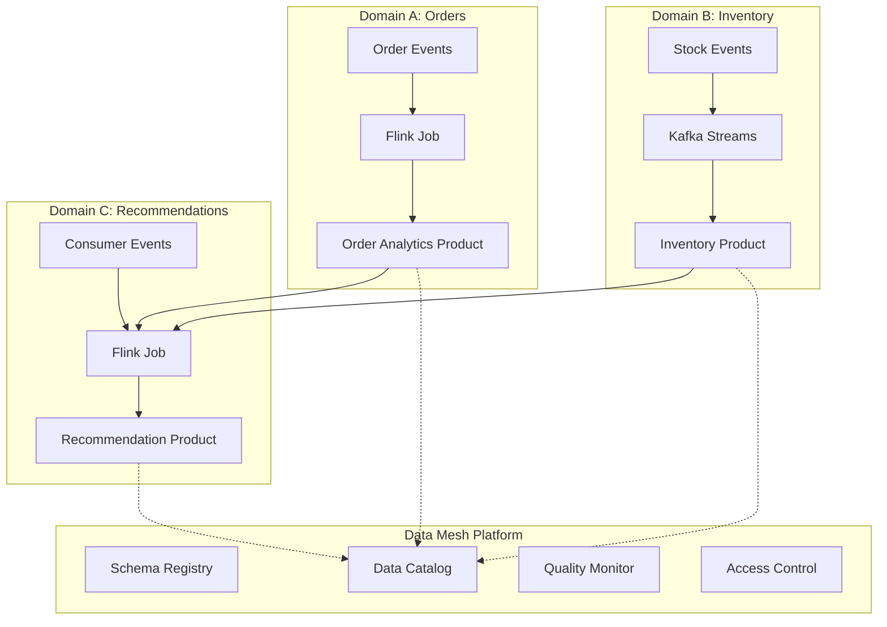

# Streaming Data Mesh Architecture & Real-Time Data Products

> **Language**: English | **Source**: [Knowledge/06-frontier/streaming-data-mesh-architecture.md](../Knowledge/06-frontier/streaming-data-mesh-architecture.md) | **Last Updated**: 2026-04-21

---

## 1. Definitions

### Def-K-06-EN-120: Data Mesh

A **decentralized data architecture paradigm** treating data as products owned and operated by independent domain teams, delivering value at scale through self-serve platforms and federated governance.

**Four Core Principles**:

| Principle | Definition | Key Attribute |
|-----------|-----------|---------------|
| **Domain Ownership** | Data sovereignty $D_S$ belongs to business domain $\mathcal{B}_i$: $\forall d \in D_S, Owner(d) = \mathcal{B}_i$ | End-to-end responsibility |
| **Data as Product** | Data product $\mathcal{P}_d = (Schema, Quality, Meta, Access, SLA)$ is discoverable, addressable, trustworthy | Product thinking |
| **Self-Serve Platform** | Platform $P_f$ abstracts ops: $\forall op \in Ops, Complexity(op) \leq \theta_{domain}$ | Infrastructure as code |
| **Federated Governance** | Global rules $\mathcal{G} = \bigcup_i \mathcal{G}_i \cap \mathcal{G}_{global}$ | Standardization + autonomy |

### Def-K-06-EN-121: Real-Time Data Product

A data product with freshness constraint $T_{latency} \leq T_{SLO}$:

$$
\mathcal{P}_{realtime} = (E_{stream}, \mathcal{T}_{proc}, \mathcal{Q}_{fresh}, SLA_{RT})
$$

where:

- $E_{stream}$: Event stream interface (Kafka Topic, Pulsar Stream)
- $\mathcal{T}_{proc}$: Processing semantics (At-least-once / Exactly-once)
- $\mathcal{Q}_{fresh}$: Freshness metrics (E2E latency, watermark age)
- $SLA_{RT}$: Real-time service level agreement

### Def-K-06-EN-122: Streaming Data Domain

A domain boundary around business event streams:

$$
\mathcal{D}_s = (E_{in}, \mathcal{F}_{proc}, E_{out}, \mathcal{C}_{contract})
$$

where:

- $E_{in}$: Input event streams
- $\mathcal{F}_{proc}$: In-domain stream processing functions
- $E_{out}$: Output event stream products
- $\mathcal{C}_{contract}$: Data contract (schema version, compatibility, SLA)

### Def-K-06-EN-123: Data Contract

Formal protocol between streaming data product and consumers:

$$
\mathcal{C} = (S, V, Q, M, A, L)
$$

| Component | Description | Example |
|-----------|-------------|---------|
| $S$ (Schema) | Formal data structure definition | Avro / Protobuf / JSON Schema |
| $V$ (Versioning) | Semantic versioning strategy | SemVer: major.minor.patch |
| $Q$ (Quality) | Data quality assertions | Null rate, value range, uniqueness |
| $M$ (Metadata) | Discovery and governance metadata | Ownership, lineage, business terms |
| $A$ (Access) | Access patterns and authentication | SASL/SSL, RBAC |
| $L$ (Lifecycle) | Retention policy and SLA | 7-day retention, P99 < 100ms |

## 2. Architecture

## 3. Streaming Data Product Lifecycle

| Phase | Activity | Owner |
|-------|----------|-------|
| **Design** | Define schema, SLA, consumers | Domain team |
| **Implement** | Build Flink job / Kafka Streams app | Domain team |
| **Publish** | Register in catalog, expose contract | Domain team |
| **Consume** | Discover, validate, subscribe | Consumer domain |
| **Evolve** | Version schema, update contract | Domain team |
| **Retire** | Deprecate, migrate consumers | Domain team + governance |

## References
