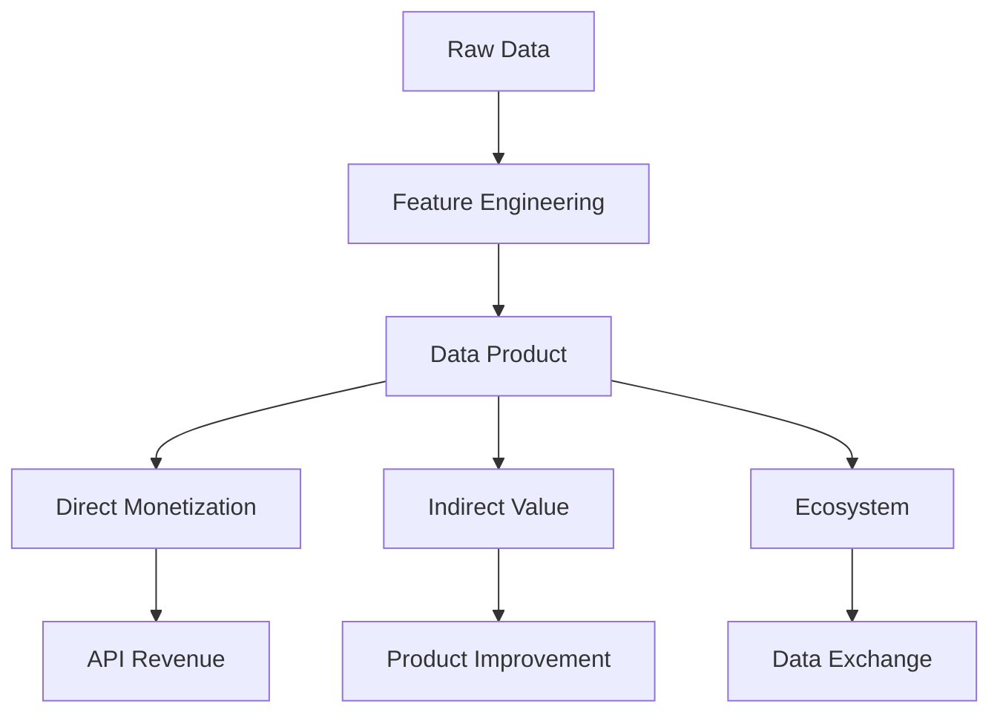

# Streaming Data Product Economics & Monetization

> **Stage**: Knowledge | **Prerequisites**: [Data Mesh](../data-mesh-streaming-architecture.md) | **Formal Level**: L2-L3
>
> Data as an asset: value creation, pricing models, and monetization strategies for streaming data products.

---

## 1. Definitions

**Def-K-03-38: Data Product Economics**

Data value as a function of quality, utility, scarcity, and timeliness:

$$
\text{Data Value} = f(\text{Quality}, \text{Utility}, \text{Scarcity}, \text{Timeliness})
$$

**Streaming Data Properties**:

| Property | Batch | Stream | Value Impact |
|----------|-------|--------|--------------|
| Timeliness | Hours/Days | Milliseconds | **10-100x** |
| Freshness decay | Slow | Exponential | Immediate consumption |
| Processing cost | Low | Higher | ROI optimization |
| Application value | Retrospective | Real-time decisions | Operational value |

**Def-K-03-39: Data Monetization Models**

- **Direct**: Raw data sales, API subscriptions, licensing
- **Indirect**: Product enhancement, operational efficiency, risk reduction
- **Ecosystem**: Data exchange, data coalitions, platform economics

---

## 2. Properties

**Prop-K-03-20: Latency-Price Relationship**

Lower latency commands higher price due to competitive advantage:

$$
\text{Price}(\text{latency}) \propto \frac{1}{\text{latency}}
$$

**Prop-K-03-21: Value Decay**

Stream data value decays exponentially with age:

$$
V(t) = V_0 \cdot e^{-\lambda t}
$$

---

## 3. Relations

- **with Data Mesh**: Data products are the monetizable units in Data Mesh.
- **with Real-Time Recommendation**: Recommendation features are high-value data products.

---

## 4. Argumentation

**Pricing Models**:

| Model | Formula | Example |
|-------|---------|---------|
| Volume-based | $/GB or $/M events | Kafka Cloud |
| Latency-tiered | Low latency = higher price | Financial data |
| Value-based | % of value created | Trading signals |
| Subscription | $/month flat | API packages |

---

## 5. Engineering Argument

**ROI Optimization**: Streaming data products require balancing freshness (value) against processing cost. The optimal point satisfies:

$$
\frac{dV}{dt} = \frac{dC}{dt}
$$

where $V$ = value and $C$ = cost.

---

## 6. Examples

**Real-Time Fraud API Product**:

```yaml
product:
  name: fraud-risk-score
  tiers:
    - name: standard
      latency: < 500ms
      price: $0.001/request
    - name: premium
      latency: < 50ms
      price: $0.01/request
    - name: enterprise
      latency: < 10ms
      price: custom
```

---

## 7. Visualizations

**Data Monetization Framework**:



---

## 8. References
