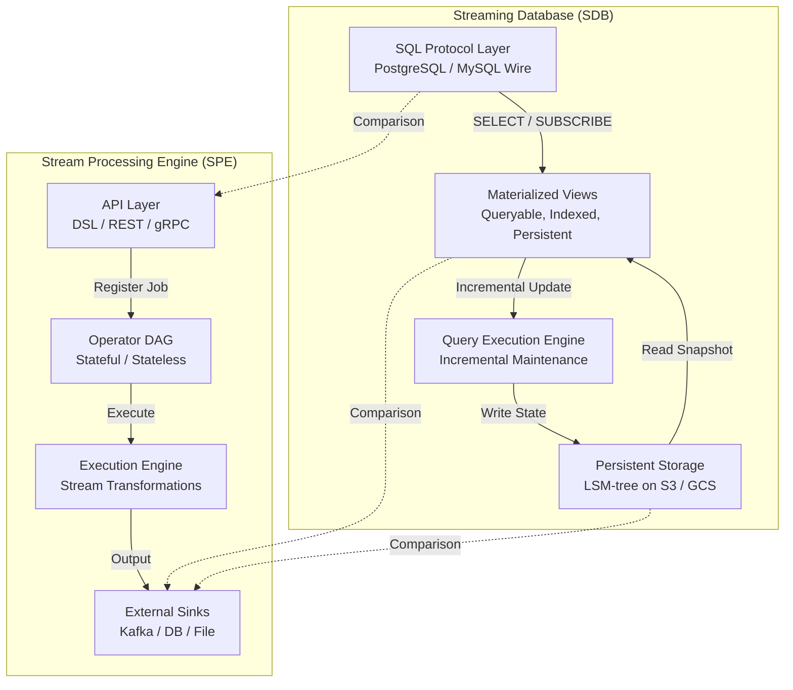
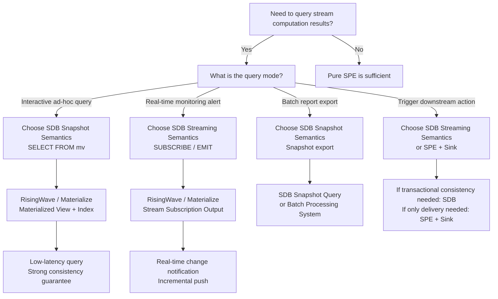
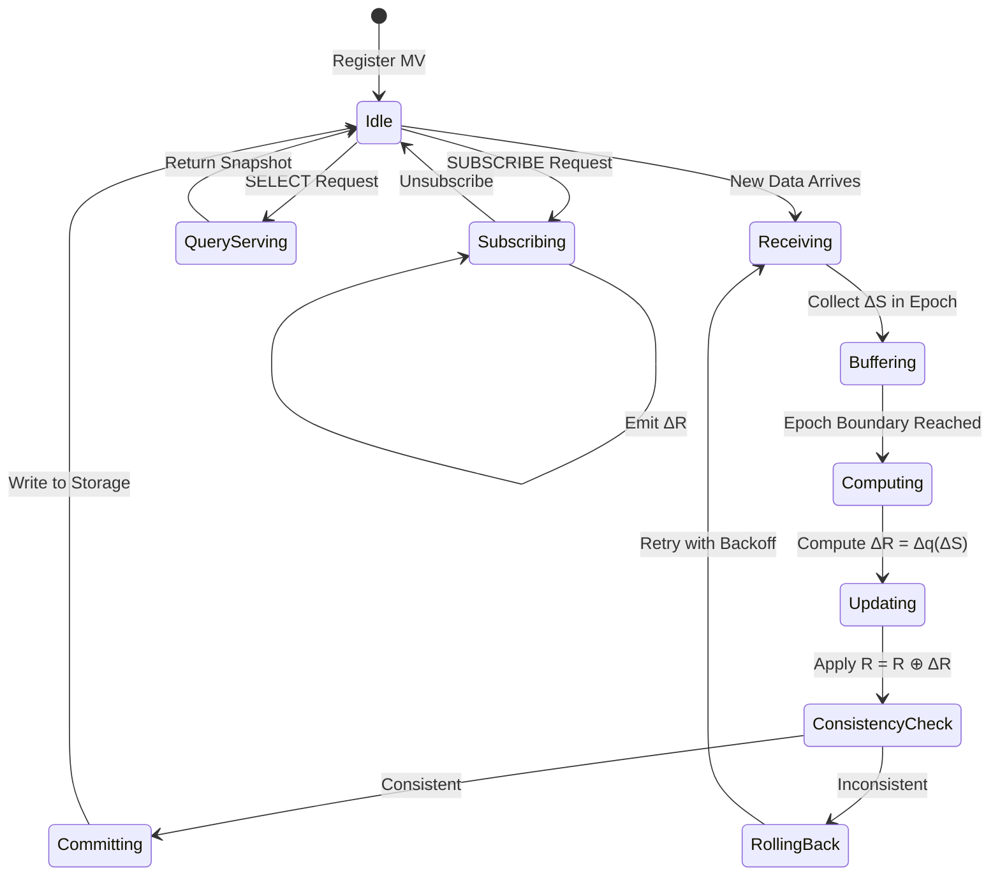
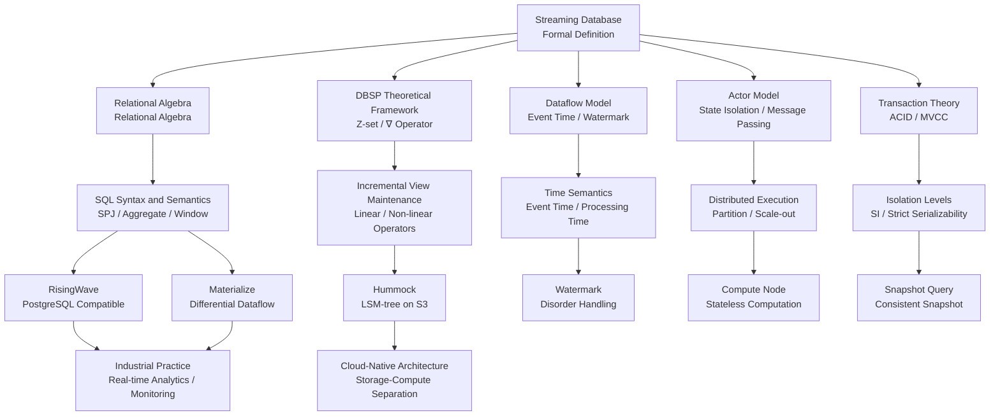

# Formal Definition and Theoretical Framework of Streaming Database

> **Stage**: Struct/01-foundation | **Prerequisites**: [01.08-streaming-database-formalization.md](01.08-streaming-database-formalization.md), [dbsp-theory-framework.md](../06-frontier/dbsp-theory-framework.md) | **Formalization Level**: L5-L6

---

## Abstract

In 2025–2026, the Rust-native stream processing ecosystem entered an explosive growth phase: RisingWave GA v2.8.1 marked the maturity of production-grade streaming databases, while Arroyo's acquisition by Cloudflare demonstrated the commercial value of lightweight stream processing engines in edge scenarios.
These two milestones are not merely commercial achievements; at the architectural level, they established a strict demarcation between "Streaming Database" (SDB) and "Stream Processing Engine" (SPE) — the former treats Materialized View as a first-class citizen, providing persistent storage and SQL query capabilities; the latter focuses on data transformation and output to external Sinks, without guaranteeing built-in persistence or transactional consistency of query results.

However, academia and industry still lack a strict formal definition of streaming databases.
Existing work focuses primarily on the temporal semantics of stream processing (the Dataflow Model[^1]), incremental view maintenance (DBSP[^2]), or the engineering implementations of specific systems (RisingWave[^3], Materialize[^4]), but has not yet established a unified mathematical model of Streaming Database as an independent computing paradigm.
This document aims to fill this gap:

1. Establish a strict octuple formal model for Streaming Database, and contrast it with the septuple model of Stream Processing Engine;
2. Analyze in detail the formal connotations of the four core characteristics — materialized view, incremental update, SQL compatibility, and persistent storage;
3. Establish strict mathematical relationships between Streaming Database and relational algebra, the Dataflow model, and the DBSP theoretical framework;
4. Provide formal expressions for the architectural differences between RisingWave and Arroyo, revealing their essential distinctions in the degree of storage-compute separation;
5. Discuss and strictly define the query theories of Snapshot Semantics and Streaming Semantics;
6. Provide a strict comparison matrix of Streaming Database vs. Stream Processing Engine.

All definitions, lemmas, propositions, and theorems in this document adopt the globally unified numbering system of the Struct/ directory, with prefix `S-01-12`.

**Keywords**: Streaming Database, Stream Processing Engine, Materialized View, Incremental View Maintenance, DBSP, RisingWave, Arroyo, Snapshot Semantics, Streaming Semantics, Formal Theory

---

## Table of Contents

- [Formal Definition and Theoretical Framework of Streaming Database](#formal-definition-and-theoretical-framework-of-streaming-database)
  - [Abstract](#abstract)
  - [Table of Contents](#table-of-contents)
  - [1. Definitions](#1-definitions)
    - [Def-S-01-12-01 (Core Model of Streaming Database)](#def-s-01-12-01-core-model-of-streaming-database)
    - [Def-S-01-12-02 (Core Model of Stream Processing Engine)](#def-s-01-12-02-core-model-of-stream-processing-engine)
    - [Def-S-01-12-03 (Strict Definition of Materialized View)](#def-s-01-12-03-strict-definition-of-materialized-view)
    - [Def-S-01-12-04 (Incremental Update Operator Family)](#def-s-01-12-04-incremental-update-operator-family)
    - [Def-S-01-12-05 (SQL Compatibility Levels)](#def-s-01-12-05-sql-compatibility-levels)
    - [Def-S-01-12-06 (Persistent Storage Model)](#def-s-01-12-06-persistent-storage-model)
    - [Def-S-01-12-07 (Snapshot Semantics)](#def-s-01-12-07-snapshot-semantics)
    - [Def-S-01-12-08 (Streaming Semantics)](#def-s-01-12-08-streaming-semantics)
    - [Def-S-01-12-09 (Query Incrementality)](#def-s-01-12-09-query-incrementality)
  - [2. Properties](#2-properties)
    - [Lemma-S-01-12-01 (Monotonicity of Materialized View State)](#lemma-s-01-12-01-monotonicity-of-materialized-view-state)
    - [Lemma-S-01-12-02 (Locality of Incremental Update Operators)](#lemma-s-01-12-02-locality-of-incremental-update-operators)
    - [Lemma-S-01-12-03 (Temporal Consistency between Snapshot and Streaming Semantics)](#lemma-s-01-12-03-temporal-consistency-between-snapshot-and-streaming-semantics)
    - [Prop-S-01-12-01 (SQL Compatibility Implies Query Closure)](#prop-s-01-12-01-sql-compatibility-implies-query-closure)
    - [Prop-S-01-12-02 (Exactly-Once Semantics Guarantee of Persistent Storage)](#prop-s-01-12-02-exactly-once-semantics-guarantee-of-persistent-storage)
  - [3. Relations](#3-relations)
    - [Relation 1: SDB ≅ SPE ⊕ MV ⊕ ACID_Storage](#relation-1-sdb--spe--mv--acid_storage)
    - [Relation 2: SDB Query Semantics ↦ Relational Algebra ⊗ Temporal Extension](#relation-2-sdb-query-semantics--relational-algebra--temporal-extension)
    - [Relation 3: SDB Incremental Mechanism ≈ DBSP ∇ Operator](#relation-3-sdb-incremental-mechanism--dbsp--operator)
    - [Relation 4: SDB Storage Model ↦ LSM-tree ⊕ Object Storage](#relation-4-sdb-storage-model--lsm-tree--object-storage)
    - [Relation 5: RisingWave vs Arroyo Architecture Mapping](#relation-5-risingwave-vs-arroyo-architecture-mapping)
  - [4. Argumentation](#4-argumentation)
    - [4.1 Why a Stream Processing Engine without Materialized Views is not an SDB](#41-why-a-stream-processing-engine-without-materialized-views-is-not-an-sdb)
    - [4.2 Boundary of Incremental Computation: Non-Incremental Query Classes](#42-boundary-of-incremental-computation-non-incremental-query-classes)
    - [4.3 Trade-off Space between Snapshot and Streaming Semantics](#43-trade-off-space-between-snapshot-and-streaming-semantics)
    - [4.4 Counterexample Analysis: Failure Scenarios of "Streaming Databases" lacking Transactional Guarantees](#44-counterexample-analysis-failure-scenarios-of-streaming-databases-lacking-transactional-guarantees)
  - [5. Proof / Engineering Argument](#5-proof--engineering-argument)
    - [Thm-S-01-12-01 (Streaming Database Architecture Equivalence Theorem)](#thm-s-01-12-01-streaming-database-architecture-equivalence-theorem)
    - [Thm-S-01-12-02 (Query Semantic Consistency Theorem)](#thm-s-01-12-02-query-semantic-consistency-theorem)
    - [Thm-S-01-12-03 (Incremental Maintenance Complexity Lower Bound Theorem)](#thm-s-01-12-03-incremental-maintenance-complexity-lower-bound-theorem)
  - [6. Examples](#6-examples)
    - [6.1 Complete Formal Mapping of RisingWave Architecture](#61-complete-formal-mapping-of-risingwave-architecture)
    - [6.2 Formal Mapping and Boundary of Arroyo Architecture](#62-formal-mapping-and-boundary-of-arroyo-architecture)
    - [6.3 Materialize Differential Dataflow Instance](#63-materialize-differential-dataflow-instance)
    - [6.4 Comparison of Materialized View Query Capabilities](#64-comparison-of-materialized-view-query-capabilities)
    - [6.5 Formal Stratification of PostgreSQL Protocol Compatibility](#65-formal-stratification-of-postgresql-protocol-compatibility)
    - [Counterexample 6.1: Architectural Pitfall of Misidentifying SPE as SDB](#counterexample-61-architectural-pitfall-of-misidentifying-spe-as-sdb)
  - [7. Visualizations](#7-visualizations)
    - [7.1 SDB vs SPE Architecture Comparison Hierarchy Diagram](#71-sdb-vs-spe-architecture-comparison-hierarchy-diagram)
    - [7.2 Query Semantic Decision Tree](#72-query-semantic-decision-tree)
    - [7.3 RisingWave / Arroyo / Materialize Architecture Mapping Diagram](#73-risingwave--arroyo--materialize-architecture-mapping-diagram)
    - [7.4 Incremental Maintenance Execution Flow Diagram](#74-incremental-maintenance-execution-flow-diagram)
    - [7.5 Streaming Database Theoretical Framework Relation Diagram](#75-streaming-database-theoretical-framework-relation-diagram)
  - [8. References](#8-references)

---

## 1. Definitions

This section establishes the strict formal foundations for Streaming Database and Stream Processing Engine. All definitions serve as the cornerstone for subsequent property derivation, correctness proofs, and industrial system mapping, referencing the theoretical and engineering practices of RisingWave[^3], Arroyo[^5], Materialize[^4], and DBSP[^2].

### Def-S-01-12-01 (Core Model of Streaming Database)

A **Streaming Database (SDB)** is an octuple:

$$
\mathcal{SDB} = (\mathcal{S}, \mathcal{Q}, \mathcal{V}, \Delta, \tau, \mathcal{C}, \mathcal{P}, \mathcal{W})
$$

The semantics of each component are as follows:

| Symbol | Type | Semantics |
|--------|------|-----------|
| $\mathcal{S}$ | Finite set | Input stream set; each stream $s \in \mathcal{S}$ is represented as a sequence of Z-sets with multiplicity $s = \langle Z_0, Z_1, \ldots \rangle$ |
| $\mathcal{Q}$ | Finite set | Persistent query set; each query $q \in \mathcal{Q}$ is a continuously executing declarative query (typically a SQL subset) |
| $\mathcal{V}$ | Finite set | Materialized view set; each view $v \in \mathcal{V}$ is the persistent, queryable result of some query $q$ |
| $\Delta$ | Function family | Incremental update operator family; $\Delta_q: \mathcal{Z} \times \Sigma \to \mathcal{Z} \times \Sigma'$ defines the incremental computation rule for query $q$ |
| $\tau$ | Time function | Timestamp function; $\tau: \mathcal{S} \times \mathbb{N} \to \mathbb{T}$ assigns a logical timestamp to each stream event |
| $\mathcal{C}$ | Partial order | Consistency configuration, defining view visibility levels and transaction isolation semantics; $\mathcal{C} \in \{\text{Strict}, \text{SI}, \text{RC}, \text{Eventual}\}$ |
| $\mathcal{P}$ | Protocol mapping | SQL protocol compatibility mapping; $\mathcal{P}: \mathcal{Q} \to \{\text{Wire}, \text{Syntax}, \text{Semantic}\}^*$ defines the SQL interface level exposed by the system |
| $\mathcal{W}$ | Storage model | Persistent storage backend; $\mathcal{W} = (\mathcal{D}_{store}, \mathcal{I}_{index}, \mathcal{R}_{replica})$ defines data persistence, indexing, and replication policies |

**System Invariants**:

$$
\begin{aligned}
&\text{(I1) View Completeness}: &&\forall v \in \mathcal{V}. \; \exists! q \in \mathcal{Q}. \; \text{source}(v) = q \\
&\text{(I2) Incremental Computability}: &&\forall q \in \mathcal{Q}. \; \Delta_q \text{ exists and is computable in polynomial time} \\
&\text{(I3) Temporal Monotonicity}: &&\forall s \in \mathcal{S}, \forall i < j. \; \tau(s, i) \leq \tau(s, j) \\
&\text{(I4) Consistency Completeness}: &&\mathcal{C} \text{ defines a global partial order over all views} \\
&\text{(I5) Storage Durability}: &&\forall v \in \mathcal{V}, \forall t \in \mathbb{T}. \; \text{State}(v, t) \in \mathcal{W}.\mathcal{D}_{store} \\
&\text{(I6) Protocol Closure}: &&\forall q \in \mathcal{Q}. \; \mathcal{P}(q) \neq \emptyset \implies q(\mathcal{V}) \subseteq \mathcal{V} \cup \mathcal{S}
\end{aligned}
$$

**Intuitive Explanation**: A streaming database inverts the traditional database "store-then-query" model into a "query-then-store" model — queries are persistently registered, data streams arrive continuously, the system incrementally computes and maintains materialized views, and these views can be directly queried via SQL protocols. The $\mathcal{P}$ and $\mathcal{W}$ components in the octuple are the keys that distinguish SDB from traditional SPE: SPE lacks a built-in persistent storage protocol compatibility layer, and must output results to external Sinks before they can be queried[^3][^4].

**Rationale for the Definition**: Without formalizing a streaming database as an octuple, it is impossible to strictly distinguish the essential difference between a "stream processing engine" and a "streaming database". The latter emphasizes: (a) materialized views as first-class citizens rather than temporary Sink outputs; (b) continuous execution of persistent queries; (c) transactional consistency guarantees; (d) native compatibility with SQL protocols; (e) built-in persistent storage rather than merely in-memory state.

---

### Def-S-01-12-02 (Core Model of Stream Processing Engine)

A **Stream Processing Engine (SPE)** is a septuple:

$$
\mathcal{SPE} = (\mathcal{S}, \mathcal{O}, \mathcal{G}, \Sigma, \tau, \kappa, \mathcal{K})
$$

The semantics of each component are as follows:

| Symbol | Type | Semantics |
|--------|------|-----------|
| $\mathcal{S}$ | Finite set | Input stream set, identical to the SDB definition |
| $\mathcal{O}$ | Finite set | Operator set; each operator $o \in \mathcal{O}$ implements a specific data transformation (Map/Filter/Join/Aggregate, etc.) |
| $\mathcal{G}$ | Directed graph | Computation topology; $\mathcal{G} = (V_{op}, E_{data})$ defines data-flow dependencies between operators |
| $\Sigma$ | State space | Global state mapping; $\Sigma: V_{op} \to \mathcal{S}_{state}$ assigns local state to each stateful operator |
| $\tau$ | Time function | Timestamp function, identical to the SDB definition |
| $\kappa$ | Trigger function | Output trigger; $\kappa: \Sigma \times \mathbb{T} \to \{\text{EMIT}, \text{HOLD}\}$ decides when to output results to downstream or Sink |
| $\mathcal{K}$ | Sink set | External output target set; $\mathcal{K} = \{k_1, k_2, \ldots\}$, where each $k_i$ is an external system (database, message queue, file system, etc.) |

**System Invariants**:

$$
\begin{aligned}
&\text{(J1) Operator Closure}: &&\forall o \in \mathcal{O}. \; \text{dom}(o) \subseteq \mathcal{S} \cup \mathcal{S}_{state} \land \text{cod}(o) \subseteq \mathcal{S} \cup \mathcal{S}_{state} \\
&\text{(J2) Topology Acyclicity}: &&\mathcal{G} \text{ is a directed acyclic graph (or a feedback graph with controlled cycles)} \\
&\text{(J3) Temporal Monotonicity}: &&\forall s \in \mathcal{S}, \forall i < j. \; \tau(s, i) \leq \tau(s, j) \\
&\text{(J4) Sink Output}: &&\forall \text{final result } r. \; \exists k \in \mathcal{K}. \; r \text{ is written to } k \\
&\text{(J5) No Built-in Query Protocol}: &&\nexists \mathcal{P}. \; \mathcal{P}(\mathcal{O}) \subseteq \text{SQL-compatible protocols}
\end{aligned}
$$

**Essential Differences between SDB and SPE**:

| Dimension | Streaming Database (SDB) | Stream Processing Engine (SPE) |
|-----------|--------------------------|--------------------------------|
| Core Abstraction | Materialized view $\mathcal{V}$ (first-class citizen, queryable) | Operator $\mathcal{O}$ (temporary transformation, not queryable) |
| Output Target | Built-in persistent storage $\mathcal{W}$ | External Sink set $\mathcal{K}$ |
| Query Capability | Native SQL protocol querying of materialized views | No native query protocol; requires external system to承接 |
| Consistency | Transaction isolation level $\mathcal{C}$ | At-least-once / exactly-once delivery semantics |
| State Persistence | Mandatory persistence to $\mathcal{W}$ | Optional Checkpoint to external storage |
| Result Lifecycle | Views are continuously updated with input streams, always queryable | Results are output to Sink with no retention inside the engine |
| Typical Systems | RisingWave, Materialize, Timeplus | Apache Flink, Arroyo, Kafka Streams |

**Intuitive Explanation**: A stream processing engine is a "data transformation pipeline" — data enters from Sources, undergoes a series of operator transformations, and is finally output to external Sinks. The engine may contain internal state (e.g., window aggregation state), but this state is operator-private, not queryable via SQL, and is typically recovered from Checkpoint upon job restart rather than being continuously available for external service. A streaming database, by contrast, is a "continuously updated database" — once a query is registered, it executes continuously, results are persisted as materialized views, and the system exposes a standard SQL query interface[^1][^3][^5].

---

### Def-S-01-12-03 (Strict Definition of Materialized View)

**Materialized View** is the core abstraction in a streaming database. Building upon the definition in 01.08, it is extended as a sextuple:

$$
v = (q, R, \Sigma_{maint}, T_{version}, \text{valid}, \mathcal{I}_{v})
$$

Where:

| Component | Type | Semantics |
|-----------|------|-----------|
| $q$ | $\mathcal{Q}$ | Source query; the definitional logic of the view, must be a closed query |
| $R$ | Z-set instance | Current materialized result; $R \in \mathcal{Z}$, where element multiplicity indicates record existence |
| $\Sigma_{maint}$ | Maintenance state | State required for incremental maintenance, including aggregation intermediates, window state, indexes, etc. |
| $T_{version}$ | $\mathbb{T} \times \mathbb{N}$ | Version vector; $(t_{logical}, seq)$ denotes the view's logical time and sequence number |
| $\text{valid}$ | $\mathbb{B}$ | Validity flag; $\text{valid} = \top$ iff the view is in a transactionally consistent state |
| $\mathcal{I}_{v}$ | Index set | Secondary index set on the materialized view, supporting point and range lookups |

**The semantics of a materialized view** is strictly defined by the following rule:

$$
\text{View}(v, t) = \{ r \mid r \in \mathcal{U} \land Z_q(r, S_{\leq t}) > 0 \}
$$

Where $S_{\leq t}$ denotes the cumulative sum of all input Z-sets with timestamps not exceeding $t$, and $Z_q$ is the result multiplicity function of query $q$ under Z-set semantics.

**Materialized View Update Rule** (incremental form):

When the input stream produces incremental changes $\Delta S$ over the time interval $(t, t']$, the view update follows:

$$
\begin{aligned}
R_{t'} &= R_t \oplus \Delta_q(\Delta S, \Sigma_{maint}) \\
\Sigma_{maint}' &= \text{UpdateState}(\Sigma_{maint}, \Delta S) \\
T_{version}' &= (t', seq + 1) \\
\text{valid}' &= \text{valid} \land \text{Consistent}(\Delta_q, \mathcal{C})
\end{aligned}
$$

Where $\oplus$ is Z-set addition (i.e., group operation), $\Delta_q$ is the incremental operator corresponding to query $q$, and $\text{Consistent}$ checks whether the incremental update satisfies the requirements of the consistency configuration $\mathcal{C}$.

**Materialized View Query Interface**:

An SDB must provide random query capabilities on materialized views. Let $\text{Query}(v, \phi)$ denote a query executing selection predicate $\phi$ on view $v$:

$$
\text{Query}(v, \phi) = \{ r \in \text{View}(v, t_{now}) \mid \phi(r) = \top \}
$$

This query must directly leverage the materialized result $R$ and index $\mathcal{I}_v$ to answer without re-executing the source query $q$.

**Intuitive Explanation**: A materialized view is a "precomputed, continuously maintained, directly queryable query result". Unlike materialized views in traditional databases, those in a streaming database are continuously updated — whenever new data arrives, the system incrementally updates the view rather than recomputing it. The $\mathcal{I}_v$ in the sextuple emphasizes that an SDB's materialized views are not merely stored results but must also support efficient queries; $T_{version}$ supports multi-version concurrency control (MVCC) and snapshot queries[^4].

---

### Def-S-01-12-04 (Incremental Update Operator Family)

The **Incremental Update Operator Family** is the core computation mechanism of a streaming database. Based on the Z-set algebra of DBSP[^2], it is extended and defined as a quadruple:

$$
\Delta = (\mathcal{Z}, \mathcal{F}_{lin}, \mathcal{F}_{nonlin}, \nabla)
$$

Where:

- $\mathcal{Z}$: Z-set space, i.e., the space of finitely supported functions with integer multiplicities $Z: \mathcal{U} \to \mathbb{Z}$
- $\mathcal{F}_{lin}$: Linear operator set; $f: \mathcal{Z} \to \mathcal{Z}$ satisfies $f(Z_1 + Z_2) = f(Z_1) + f(Z_2)$ and $f(k \cdot Z) = k \cdot f(Z)$
- $\mathcal{F}_{nonlin}$: Nonlinear operator set; does not satisfy linearity conditions, requiring special incremental strategies
- $\nabla$: Difference operator; $\nabla: \mathcal{Z}^{\mathbb{N}} \to \mathcal{Z}^{\mathbb{N}}$, defined as $(\nabla Z)_0 = Z_0$, $(\nabla Z)_t = Z_t - Z_{t-1}$ ($t > 0$)

**DBSP Incremental Propagation Formula**:

For a composite query $q = f_n \circ f_{n-1} \circ \cdots \circ f_1$, its incremental update satisfies:

$$
\Delta q = \nabla (f_n \circ \cdots \circ f_1)(\nabla^{-1} \Delta S)
$$

Where $\nabla^{-1}$ is the integral operator (prefix-sum operator). When all $f_i$ are linear operators:

$$
\Delta q = (f_n \circ \cdots \circ f_1)(\Delta S)
$$

That is, the increment can be directly propagated through the original operators without additional state maintenance.

**Nonlinear Operator Incremental Strategies**:

| Operator Type | Incremental Strategy | State Requirement | Typical Instances |
|---------------|----------------------|-------------------|-------------------|
| **Linear** | Direct propagation | None | SELECT, PROJECT, FILTER, UNION |
| **Semilinear** | Decompose into linear part + local update | Small | JOIN (requires maintaining one-side stream state) |
| **Nonlinear Decomposable** | Custom incremental rule | Medium | GROUP BY + COUNT/SUM |
| **Intrinsically Nonlinear** | Bounded recomputation / approximation | Large | DISTINCT, MEDIAN, RANK |

**Intuitive Explanation**: Incremental update operators are the "heart" of a streaming database. DBSP theory shows that most operators in relational algebra can be transformed into linear operators over Z-sets, thereby supporting efficient incremental computation. For nonlinear operators (such as DISTINCT, nested aggregation), incremental maintenance requires additional state maintenance or even bounded recomputation, which directly affects the scope of queries supported by the SDB[^2].

---

### Def-S-01-12-05 (SQL Compatibility Levels)

**SQL Compatibility** is the key characteristic that distinguishes a streaming database from dedicated stream processing APIs, defined as a layered mapping:

$$
\mathcal{P} = (L_{wire}, L_{syntax}, L_{semantic}, L_{catalog})
$$

Where each layer is defined as follows:

**$L_{wire}$ — Wire Protocol Layer**:

The system implements **network protocols** compatible with PostgreSQL/MySQL and other databases, enabling standard client drivers (such as `libpq`, `JDBC`) to connect directly. Formally:

$$
L_{wire} = \{ p \mid p \in \{\text{PostgreSQL}, \text{MySQL}, \text{HTTP/REST}\} \land \text{Compatible}(p, p_{ref}) \}
$$

Where $\text{Compatible}(p, p_{ref})$ indicates that protocol $p$ is compatible with the reference protocol $p_{ref}$ in connection establishment, authentication, simple query, and parameter-binding message formats.

**$L_{syntax}$ — Syntax Layer (SQL Syntax)**:

The subset of standard SQL syntax supported by the system, formalized as the grammar acceptance set:

$$
L_{syntax} = \{ sql \mid sql \in \text{SQL:2016}^* \land \text{Parser}(sql) \neq \bot \}
$$

**$L_{semantic}$ — Semantic Layer (SQL Semantic)**:

The SQL semantics supported by the system, especially stream extension semantics:

$$
L_{semantic} = (L_{relational}, L_{stream}, L_{temporal})
$$

- $L_{relational}$: Standard relational semantics (SPJ + aggregation)
- $L_{stream}$: Stream extension semantics (TUMBLE/HOP/SESSION windows, WATERMARK, EMIT)
- $L_{temporal}$: Temporal semantics (FOR SYSTEM_TIME AS OF, versioned queries)

**$L_{catalog}$ — Catalog Layer (System Catalog)**:

The compatibility level of the Information Schema exposed by the system:

$$
L_{catalog} = \{ table \mid table \in \{\text{pg_tables}, \text{pg_class}, \text{information_schema.tables}\} \}
$$

**SQL Compatibility Assessment Matrix** (Mainstream Systems in 2026):

| Layer | RisingWave | Arroyo | Materialize | Flink SQL | Timeplus |
|-------|-----------|--------|-------------|-----------|----------|
| $L_{wire}$ (PostgreSQL) | ✅ Full | ✅ Partial | ✅ Full | ❌ Custom | ✅ Full |
| $L_{wire}$ (MySQL) | ❌ | ❌ | ❌ | ❌ | ✅ |
| $L_{syntax}$ | ~95% | ~80% | ~90% | ~85% | ~85% |
| $L_{semantic}$ (Stream Extension) | ✅ EMIT ON UPDATE | ❌ Sink-only | ✅ SUBSCRIBE | ✅ Full | ✅ Full |
| $L_{catalog}$ | ✅ | ❌ | ✅ | Partial | Partial |

**Intuitive Explanation**: PostgreSQL protocol compatibility has become a competitive differentiator for streaming databases. RisingWave and Materialize, by implementing the PostgreSQL wire protocol, enable BI tools (such as Grafana, Metabase, Tableau) and ORM frameworks to connect with "zero modifications". Although Arroyo supports DataFusion SQL syntax, its output model is Sink-only, lacking SQL query capability over intermediate results, and therefore has an essential gap with SDB at both the protocol and semantic layers[^3][^5].

---

### Def-S-01-12-06 (Persistent Storage Model)

The **Persistent Storage Model** defines how a streaming database persists materialized views and intermediate states to the storage backend, formalized as a triple:

$$
\mathcal{W} = (\mathcal{D}_{store}, \mathcal{I}_{index}, \mathcal{R}_{replica})
$$

Where:

| Component | Type | Semantics |
|-----------|------|-----------|
| $\mathcal{D}_{store}$ | Storage engine | Underlying storage abstraction, typically a distributed implementation of LSM-tree or B-tree |
| $\mathcal{I}_{index}$ | Index strategy | Organization of primary key indexes, secondary indexes, inverted indexes, etc. |
| $\mathcal{R}_{replica}$ | Replication protocol | Data replica consistency protocol, such as Raft, Quorum, or asynchronous replication |

**RisingWave's Hummock Storage Model**:

RisingWave adopts **Hummock** as its persistent storage engine — an LSM-tree on S3 architecture optimized specifically for stream workloads:

$$
\mathcal{W}_{Hummock} = (\text{LSM}_{tiered}, \mathcal{I}_{hash+range}, \text{Raft}_{3 \text{ replica}})
$$

Where:

- **Storage Layer**: Data is tiered by time (L0, L1, L2...); L0 is an in-memory MemTable, higher levels are immutable SST files on S3
- **Index Layer**: Hash indexes for point lookups, Range indexes for range scans
- **Replication Layer**: Raft-based three-replica consensus protocol, ensuring strong consistency of metadata and logs

**Formal Constraints of the Storage Model**:

For any materialized view $v$ and time $t$, persistent storage must satisfy:

$$
\begin{aligned}
&\text{(P1) Durability}: &&\text{State}(v, t) \text{ written to } \mathcal{D}_{store} \implies \text{CrashRecovery}(\mathcal{D}_{store}) = \text{State}(v, t) \\
&\text{(P2) Index Consistency}: &&\forall r \in R_v, \forall idx \in \mathcal{I}_{index}. \; r \in \text{Query}(idx, key(r)) \\
&\text{(P3) Replica Consistency}: &&\forall r \in \mathcal{R}_{replica}, \forall t. \; |\{ \text{replica}_i \mid \text{State}_i(v, t) = S \}| \geq \lfloor \frac{n+1}{2} \rfloor
\end{aligned}
$$

**Intuitive Explanation**: Persistent storage is the fundamental distinction between an SDB and "pure in-memory stream processing". Hummock combines LSM-tree with object storage (S3) to achieve storage-compute separation — compute nodes can scale independently, while the storage layer leverages the low cost and high availability of S3. This architecture enables an SDB to handle high-throughput stream computation while supporting large-scale ad-hoc queries on historical data[^3].

---

### Def-S-01-12-07 (Snapshot Semantics)

**Snapshot Semantics** is one of the query execution models provided by a streaming database, defined as follows:

For a query $q$ submitted at time $t$, its snapshot semantic result $[\![ q ]\!]_{snap}^t$ is defined as:

$$
[\![ q ]\!]_{snap}^t = q\left( \bigcup_{s \in \mathcal{S}} \{ e \in s \mid \tau(e) \leq t \} \right)
$$

That is, query $q$ executes on the snapshot at time $t$, considering only all events with timestamps not exceeding $t$.

**Key Properties of Snapshot Semantics**:

$$
\begin{aligned}
&\text{(S1) Temporal Closure}: &&[\![ q ]\!]_{snap}^t \text{ depends only on } S_{\leq t} \\
&\text{(S2) Monotonic Inclusion}: &&t_1 \leq t_2 \implies [\![ q ]\!]_{snap}^{t_1} \subseteq^{*} [\![ q ]\!]_{snap}^{t_2} \text{ (in the Z-set sense)} \\
&\text{(S3) Consistency}: &&[\![ q ]\!]_{snap}^t \text{ is equivalent to executing } q \text{ on } S_{\leq t} \text{ in a batch processing system}
\end{aligned}
$$

**Combination of Snapshot Semantics and Materialized Views**:

In an SDB, a materialized view $v_q$ is essentially the continuous materialization of snapshot semantics:

$$
\text{View}(v_q, t) = [\![ q ]\!]_{snap}^t
$$

When users query the materialized view, they directly read the snapshot result at moment $t_{now}$, without recomputation.

**Intuitive Explanation**: Snapshot semantics "batch-ifies" stream computation — at any moment $t$, what the system presents is the batch processing result of all data up to that moment. This allows users familiar with traditional SQL to migrate seamlessly: every SELECT query they execute is a read against a snapshot of the database at some moment. Materialize's `SELECT` and RisingWave's ad-hoc queries both follow snapshot semantics[^4].

---

### Def-S-01-12-08 (Streaming Semantics)

**Streaming Semantics** is another query execution model provided by a streaming database, emphasizing that results are continuously output as a stream of changes, defined as follows:

For query $q$, its streaming semantic result $[\![ q ]\!]_{stream}$ is a **stream of changes**:

$$
[\![ q ]\!]_{stream} = \langle \Delta R_0, \Delta R_1, \Delta R_2, \ldots \rangle
$$

Where each $\Delta R_t$ is a Z-set-form increment:

$$
\Delta R_t = [\![ q ]\!]_{snap}^t - [\![ q ]\!]_{snap}^{t-1}
$$

**Two Output Modes of Streaming Semantics**:

| Mode | Definition | Output Form | Applicable Scenario |
|------|------------|-------------|---------------------|
| **Append-only** | Only output inserts | $\forall t. \; \Delta R_t(v) \geq 0$ | Time series, log analysis |
| **Upsert** | Output inserts and deletes | $\Delta R_t(v) \in \mathbb{Z}$ | Dimension tables, state updates |

**Combination of Streaming Semantics and Materialized Views**:

An SDB exposes streaming semantics through `SUBSCRIBE` or `EMIT ON UPDATE` mechanisms. Let $\text{Subscribe}(v_q)$ be a subscription to materialized view $v_q$:

$$
\text{Subscribe}(v_q) = \{ (t, \Delta R_t) \mid t \in \mathbb{T}, \Delta R_t = \text{View}(v_q, t) - \text{View}(v_q, t-1) \}
$$

**Unification of Streaming and Snapshot Semantics**:

Through the integral operator $\nabla^{-1}$, the two semantics can be mutually transformed:

$$
[\![ q ]\!]_{snap}^t = \nabla^{-1}([\![ q ]\!]_{stream})_t = \sum_{i=0}^{t} \Delta R_i
$$

$$
[\![ q ]\!]_{stream} = \nabla([\![ q ]\!]_{snap})
$$

**Intuitive Explanation**: Streaming semantics answers the question "how does the result change?", while snapshot semantics answers "what is the current result?". In an SDB, materialized views simultaneously support both semantics: users can directly `SELECT` to obtain a snapshot, or `SUBSCRIBE` to obtain a change stream. This dual capability is the core advantage that distinguishes an SDB from traditional databases (snapshot only) and pure stream processing engines (stream output only)[^1][^4].

---

### Def-S-01-12-09 (Query Incrementality)

**Query Incrementality** defines whether a query class supports efficient incremental maintenance, formalized as a decision problem:

For query $q$ and input change $\Delta S$, define the incremental complexity function:

$$
\text{IncCost}(q, \Delta S) = \text{Time}(\Delta_q(\Delta S)) + \text{Space}(\Sigma_{maint})
$$

**Incremental Complexity Classification**:

| Class | Decision Condition | Incremental Complexity | Query Class |
|-------|--------------------|------------------------|-------------|
| **Fully Incremental** | $\text{IncCost}(q, \Delta S) = O(|\Delta S|)$ | Linear in change | SPJ, linear aggregation |
| **Bounded Incremental** | $\text{IncCost}(q, \Delta S) = O(|\Delta S| \cdot \text{poly}(|DB|))$ | Polynomially bounded | Nested aggregation, bounded windows |
| **Non-incremental** | $\text{IncCost}(q, \Delta S) = \Theta(|DB|)$ | Full recomputation | Total-order dependency, complex recursion |
| **Undecidable** | No universal incremental algorithm exists | — | General recursion, Turing-complete queries |

**Sufficient Condition for Query Incrementality**:

$$
\text{If } q = f_n \circ \cdots \circ f_1 \text{ and } \forall i. \; f_i \in \mathcal{F}_{lin} \cup \mathcal{F}_{semilin} \implies q \text{ is Fully Incremental}
$$

**Intuitive Explanation**: Not all SQL queries support efficient incremental maintenance. The query optimizer of a streaming database must perform "incrementality analysis" on incoming queries; for non-incremental queries, it must either reject registration or downgrade to a bounded recomputation strategy. This directly affects the SQL compatibility boundary of an SDB — full SQL:2016 support is theoretically impossible because some query classes are intrinsically non-incremental[^2].

---

## 2. Properties

Based on the definitions in Section 1, this section derives the core properties of streaming databases.

### Lemma-S-01-12-01 (Monotonicity of Materialized View State)

**Proposition**: Under strict serializability consistency level, the state of a materialized view evolves monotonically with physical time:

$$
\forall v \in \mathcal{V}, \forall t_1 < t_2. \; \text{State}(v, t_1) \preceq_{\mathcal{C}} \text{State}(v, t_2)
$$

Where $\preceq_{\mathcal{C}}$ denotes the state partial order under consistency configuration $\mathcal{C}$.

**Proof**:

Let the source query of $v$ be $q$, and the input stream set be $\mathcal{S}$. Under strict serializability, all input events are processed in a global timestamp total order.

1. For any $t_1 < t_2$, we have $S_{\leq t_1} \subseteq S_{\leq t_2}$ (by temporal monotonicity I3).
2. Query $q$ is a deterministic function, so $q(S_{\leq t_1}) \subseteq^{*} q(S_{\leq t_2})$ (in the Z-set inclusion sense).
3. The materialized view update rule $R_{t'} = R_t \oplus \Delta_q(\Delta S)$ is monotonic (Z-set addition preserves partial order).
4. Therefore $\text{State}(v, t_1) = R_{t_1} \preceq R_{t_2} = \text{State}(v, t_2)$.

**Corollary**: Under SI or RC levels, monotonicity may temporarily fail within concurrent write conflict windows, but eventually converges to a consistent state.

**Engineering Significance**: Monotonicity guarantees that an SDB's materialized views do not exhibit "regression" — once a result appears in a view, it will not disappear due to subsequent processing (unless the corresponding data is deleted). This is the foundation for a streaming database to provide reliable query services[^4].

---

### Lemma-S-01-12-02 (Locality of Incremental Update Operators)

**Proposition**: For linear operator $f \in \mathcal{F}_{lin}$, incremental update depends only on input changes, not on historical state:

$$
\forall f \in \mathcal{F}_{lin}, \forall \Delta S. \; \Delta f(\Delta S) = f(\Delta S)
$$

**Proof**:

By the definition of linear operator:

$$
f(S + \Delta S) = f(S) + f(\Delta S)
$$

Therefore:

$$
\Delta f = f(S + \Delta S) - f(S) = f(\Delta S)
$$

Q.E.D.

**For semilinear operators** (such as JOIN), incremental update has "one-sided locality":

$$
\Delta (R \bowtie S) = (\Delta R \bowtie S) \cup (R \bowtie \Delta S) \cup (\Delta R \bowtie \Delta S)
$$

Here incremental computation requires maintaining the state of the opposite stream ($S$ or $R$), but does not require recomputing the entire join result.

**Engineering Significance**: Locality is the key to high performance in SDB. The incremental computation time of linear operators is proportional to the change volume, independent of the total data volume. This enables an SDB to handle continuously high-throughput input streams while maintaining low-latency updates of materialized views[^2].

---

### Lemma-S-01-12-03 (Temporal Consistency between Snapshot and Streaming Semantics)

**Proposition**: For any query $q$ and time $t$, the snapshot semantic result at $t$ equals the integral of the streaming semantic result up to $t$:

$$
[\![ q ]\!]_{snap}^t = \sum_{i=0}^{t} ([\![ q ]\!]_{stream})_i
$$

**Proof**:

Let $\Delta R_i = ([\![ q ]\!]_{stream})_i = [\![ q ]\!]_{snap}^i - [\![ q ]\!]_{snap}^{i-1}$ (by definition), and $[\![ q ]\!]_{snap}^{-1} = \mathbf{0}$.

Then:

$$
\sum_{i=0}^{t} \Delta R_i = \sum_{i=0}^{t} ([\![ q ]\!]_{snap}^i - [\![ q ]\!]_{snap}^{i-1}) = [\![ q ]\!]_{snap}^t - [\![ q ]\!]_{snap}^{-1} = [\![ q ]\!]_{snap}^t
$$

By telescoping sum.

**Corollary**: Streaming semantics and snapshot semantics are mathematically equivalent representations, differing only in output granularity. An SDB can simultaneously support both semantics without producing inconsistent results.

---

### Prop-S-01-12-01 (SQL Compatibility Implies Query Closure)

**Proposition**: If a streaming database supports SQL queries at the $L_{syntax}$ level, then its materialized view set $\mathcal{V}$ is closed under queries in that SQL subset:

$$
\forall q \in L_{syntax}. \; q(\mathcal{V}) \in \mathcal{V} \lor q(\mathcal{V}) \in \mathcal{S}
$$

**Proof Sketch**:

1. The query registration mechanism of an SDB requires all persistent queries $q \in \mathcal{Q}$ to map to some materialized view $v \in \mathcal{V}$ (by view completeness I1).
2. If the input of $q$ is a materialized view $v' \in \mathcal{V}$, then $q$ can be rewritten as a composite query $q' = q \circ \text{source}(v')$ over the base stream.
3. By the SDB query execution model, the result of $q'$ is likewise materialized as $v'' \in \mathcal{V}$.
4. Therefore $q(\mathcal{V}) \subseteq \mathcal{V}$.

**Boundary Condition**: If $q$ contains unsupported syntax (such as certain system functions), then $q \notin L_{syntax}$, and closure is not guaranteed.

**Engineering Significance**: Query closure is the core condition for an SDB to be usable as a "database" — users can define new materialized views on top of existing materialized views (nested materialized views), forming hierarchical analytical pipelines. This is fundamentally different from the DAG model of SPE: the output of SPE operators cannot be directly consumed by subsequent SQL queries and must be output to external storage before being queried[^3].

---

### Prop-S-01-12-02 (Exactly-Once Semantics Guarantee of Persistent Storage)

**Proposition**: If the persistent storage model $\mathcal{W}$ of a streaming database satisfies (P1) Durability, (P2) Index Consistency, and (P3) Replica Consistency, then materialized view updates satisfy exactly-once semantics:

$$
\forall v \in \mathcal{V}, \forall e \in \mathcal{S}. \; \text{Effect}(e, v) \text{ is applied exactly once}
$$

**Proof Sketch**:

1. **Input side**: The SDB tracks the processing progress of each input event via Checkpoint or Log Sequence Number (LSN).
2. **Computation side**: The incremental update operator $\Delta_q$ is a deterministic function; identical inputs produce identical outputs.
3. **Storage side**: By (P3) Replica Consistency, consensus protocols such as Raft ensure that committed write operations are persisted on a majority of replicas.
4. **Failure recovery**: After node failure and restart, state is recovered from the latest checkpoint, and unacknowledged logs are replayed. Since checkpoint and log LSNs increase monotonically, already-processed events will not be re-applied.
5. **End-to-end**: Combined with idempotent writes (via $T_{version}$ version control), even if the storage layer retries write operations, data of the same version will only be written once.

**Engineering Significance**: Exactly-once semantics is the prerequisite for an SDB to serve as a source of truth. Without persistent storage and consensus protocol guarantees, SPE can only provide at-least-once semantics, requiring downstream systems to handle duplicate data[^1][^3].

---

## 3. Relations

This section establishes strict mathematical relationships between Streaming Database and relational databases, the Dataflow model, stream processing engines, materialized view theory, incremental view maintenance, and the DBSP framework.

### Relation 1: SDB ≅ SPE ⊕ MV ⊕ ACID_Storage

**Relation Statement**: A Streaming Database is architecturally equivalent to the tightly coupled combination of a Stream Processing Engine, a materialized view management system, and a persistent storage system conforming to ACID semantics:

$$
\mathcal{SDB} \cong \mathcal{SPE} \oplus \mathcal{MV}_{mgmt} \oplus \mathcal{ACID}_{store}
$$

Where $\oplus$ denotes tight coupling of components (not simple concatenation, but shared execution engine and state).

**Formal Mapping**:

| SDB Component | Corresponding Combined Component | Mapping Relation |
|---------------|----------------------------------|------------------|
| $\mathcal{S}$ | $\mathcal{SPE}.\mathcal{S}$ | Identity mapping |
| $\mathcal{Q}$ | Declarative encapsulation of $\mathcal{SPE}.\mathcal{O}$ | $q = \text{Decl}(\mathcal{G}_{\mathcal{O}})$ |
| $\mathcal{V}$ | $\mathcal{MV}_{mgmt}.\text{Views}$ | Output of the materialized view management system |
| $\Delta$ | Incremental subset of $\mathcal{SPE}.\mathcal{O}$ | $\Delta_q \subseteq \mathcal{O}$ |
| $\tau$ | $\mathcal{SPE}.\tau$ | Identity mapping |
| $\mathcal{C}$ | $\mathcal{ACID}_{store}.\text{Isolation}$ | Equivalence class of transaction isolation levels |
| $\mathcal{P}$ | $\mathcal{MV}_{mgmt}.\text{QueryProtocol}$ | Exposure of materialized view query interface |
| $\mathcal{W}$ | $\mathcal{ACID}_{store}$ | Direct correspondence of persistent storage system |

**Proof of Non-Reversibility**:

If $\mathcal{SPE}$ lacks $\mathcal{MV}_{mgmt}$ or $\mathcal{ACID}_{store}$, then:

1. Without $\mathcal{MV}_{mgmt}$: Operator outputs go directly to Sink, and intermediate results cannot be queried via SQL;
2. Without $\mathcal{ACID}_{store}$: State exists only in memory or temporary Checkpoint, not supporting concurrent transactions or random queries.

Therefore $\mathcal{SPE} \not\cong \mathcal{SDB}$.

**Engineering Implication**: This relationship explains why many stream processing systems (such as Flink) "emulate" SDB behavior by "connecting to external databases (such as Apache Pinot, ClickHouse)" — essentially outsourcing $\mathcal{MV}_{mgmt}$ and $\mathcal{ACID}_{store}$ to external systems. Native SDBs (such as RisingWave) internalize these components, reducing operational complexity and data consistency risks[^3].

---

### Relation 2: SDB Query Semantics ↦ Relational Algebra ⊗ Temporal Extension

**Relation Statement**: The query semantics of a streaming database can be strictly encoded as **Temporal Relational Algebra (TRA)**:

$$
\mathcal{Q}_{SDB} \subseteq \text{TRA} = \text{RA} \otimes \mathbb{T}
$$

Where $\otimes$ denotes the extension product of relational algebra and the time domain, introducing temporal operators.

**Mapping from Standard Relational Algebra to SDB**:

| Relational Algebra Operator | SDB Equivalent | Temporal Extension |
|-----------------------------|----------------|--------------------|
| $\sigma_{\phi}(R)$ | `SELECT * FROM v WHERE φ` | Executed on snapshot $t$ |
| $\pi_{A}(R)$ | `SELECT A FROM v` | Projection operator preserves timestamp |
| $R \bowtie_{\theta} S$ | `SELECT * FROM v1 JOIN v2 ON θ` | Supports Interval JOIN, Temporal JOIN |
| $\gamma_{A, f}(R)$ | `SELECT A, f(*) FROM v GROUP BY A` | Supports TUMBLE/HOP/SESSION window aggregation |
| $R \cup S$ | `UNION ALL` | Z-set union (multiplicity addition) |
| $R - S$ | `EXCEPT ALL` | Z-set difference (multiplicity subtraction) |

**Temporal Extension Operators**:

An SDB introduces the following temporal operators, going beyond standard relational algebra:

1. **TUMBLE**$(R, \omega)$: Tumbling window, partitioning the stream into fixed-size $\omega$ slices
2. **HOP**$(R, \omega, \beta)$: Hopping window, with window size $\omega$ and hop size $\beta$
3. **SESSION**$(R, \delta)$: Session window, defining session boundaries by activity gap $\delta$
4. **WATERMARK**$(R, \lambda)$: Watermark mechanism, allowing lateness $\lambda$
5. **EMIT**$(R, \text{strategy})$: Output strategy (ON UPDATE / ON WINDOW CLOSE / WITH DELAY)

**Formal Expression**:

$$
\text{TUMBLE}(R, \omega)(t) = \gamma_{\text{wid}, f}\left( \sigma_{t \in [\omega \cdot \text{wid}, \omega \cdot (\text{wid}+1))}(R) \right)
$$

Where $\text{wid} = \lfloor t / \omega \rfloor$ is the window ID.

**Intuitive Explanation**: SQL compatibility in an SDB is not simple syntax translation, but a strict extension of relational algebra with a time dimension. This requires the SDB query optimizer to simultaneously handle the commutativity and associativity of relational algebra, as well as the monotonicity and window closure conditions of temporal operators[^1][^4].

---

### Relation 3: SDB Incremental Mechanism ≈ DBSP ∇ Operator

**Relation Statement**: The incremental maintenance mechanism of a streaming database is mathematically approximately equivalent to the difference operator $\nabla$ of DBSP, with differences mainly in engineering-level state management strategies:

$$
\Delta_{SDB} \approx \nabla_{DBSP} \text{ on } \mathcal{Z}
$$

**Detailed Mapping**:

| DBSP Concept | SDB Incremental Mechanism Correspondence | Difference Note |
|--------------|------------------------------------------|-----------------|
| Z-set $Z: \mathcal{U} \to \mathbb{Z}$ | Materialized view $R$ with multiplicity representation | Fully consistent |
| Difference $\nabla Z$ | Input change stream $\Delta S$ | Fully consistent |
| Integral $\nabla^{-1}$ | Cumulative state of materialized view | Fully consistent |
| Linear operator $f_{lin}$ | Operators with direct incremental propagation (SELECT/PROJECT/FILTER) | Fully consistent |
| Nonlinear operator $f_{nonlin}$ | Operators requiring state maintenance (AGG/JOIN/DISTINCT) | SDB adds index optimization |
| Loop/Recursion | Recursive CTE, iterative computation | SDB usually limits recursion depth |
| Nested Z-sets | Nested materialized views | SDB supports hierarchical materialized views |

**Core Equation**:

For query $q$ and materialized view $v_q$ in an SDB:

$$
\text{View}(v_q, t) = (\nabla^{-1} \circ q \circ \nabla)(S_{\leq t})
$$

Where $q$ is decomposed into a sequence of Z-set transformers in the DBSP sense.

**Difference Analysis**:

1. **State Persistence**: DBSP is a theoretical framework that does not prescribe state storage methods; the $\mathcal{W}$ of an SDB mandates state persistence.
2. **Query Optimization**: DBSP focuses on the algebraic properties of operators; the SDB optimizer must additionally consider index selection, data distribution, and parallelism.
3. **Transaction Boundaries**: DBSP incremental computation is continuous; the $\mathcal{C}$ of an SDB introduces discrete transaction boundaries and isolation levels.

**Intuitive Explanation**: DBSP provides a solid mathematical foundation for the incremental maintenance of SDB — proving the correctness of incremental maintenance of relational queries under Z-set algebra. The engineering implementation of SDB extends this theory to distributed, persistent, transaction-supporting industrial scenarios[^2].

> **Further Reading**: [Complete Formal Definition and Proof of the DBSP Theoretical Framework](../../Struct/06-frontier/dbsp-theory-framework.md) — containing the complete proof of Z-set algebra, the chain rule of the difference operator $\nabla$, and the fixed-point semantics of the LOOP operator.

---

### Relation 4: SDB Storage Model ↦ LSM-tree ⊕ Object Storage

**Relation Statement**: The persistent storage model of modern streaming databases maps mathematically to the combination of LSM-tree logical structure and object storage physical layer:

$$
\mathcal{W}_{SDB} \mapsto \text{LSM}_{logical} \oplus \text{ObjectStore}_{physical}
$$

**Formalization of LSM-tree**:

An LSM-tree consists of a set of ordered immutable storage layers $\{ L_0, L_1, \ldots, L_k \}$:

$$
\text{LSM} = (L_0, \{L_i\}_{i=1}^{k}, \mathcal{C}_{compaction})
$$

Where:

- $L_0$: Mutable MemTable in memory, supporting random writes
- $L_i$ ($i \geq 1$): Immutable Sorted String Table (SST) on disk, partitioned by data range
- $\mathcal{C}_{compaction}$: Compaction strategy (Leveled / Tiered / FIFO)

**LSM Optimizations for Stream Workloads**:

Traditional LSM is optimized for random reads and writes; SDB materialized view updates exhibit **write-intensive, range-query** characteristics:

| Workload Characteristic | Traditional OLTP LSM | SDB-Optimized LSM (Hummock) |
|-------------------------|----------------------|-----------------------------|
| Write Pattern | Random Put/Delete | Batch append writes (Z-set increments) |
| Read Pattern | Point lookup dominated | Range scan + point lookup |
| Compaction Strategy | Leveled | Tiered (reduces write amplification) |
| Storage Backend | Local SSD | S3 / GCS / OSS (Object Storage) |
| Replication Mechanism | Master-slave replication | Shared storage (S3 itself is a natural replica) |

**Formal Advantages of Object Storage**:

Object storage (such as S3) provides infinitely scalable immutable file storage. Placing LSM SST files on object storage:

$$
\forall L_i, i \geq 1. \; L_i = \{ f_1, f_2, \ldots \} \subseteq \text{ObjectStore}
$$

Advantages:

1. **Elasticity**: Storage and compute are decoupled, each scaling independently
2. **Cost**: Cold data is automatically archived, at far lower cost than SSD
3. **Availability**: Object storage itself provides 11 nines of durability
4. **Sharing**: Multiple compute nodes share the same storage layer, facilitating elastic recovery

**Intuitive Explanation**: RisingWave's Hummock is the industrial exemplar of this relationship — by combining LSM-tree with S3, it achieves an architecture of "boundless storage, elastic compute". This stands in sharp contrast to traditional databases (such as PostgreSQL's B-tree on local disk) or pure in-memory stream processing engines[^3].

---

### Relation 5: RisingWave vs Arroyo Architecture Mapping

**Relation Statement**: RisingWave and Arroyo represent the industrial implementations of the Streaming Database and Stream Processing Engine paradigms, respectively; their architectural differences can be strictly expressed through the formal model.

**Formal Mapping of RisingWave**:

$$
\mathcal{SDB}_{RisingWave} = (\mathcal{S}, \mathcal{Q}_{SQL}, \mathcal{V}_{MV}, \Delta_{Hummock}, \tau_{epoch}, \mathcal{C}_{SI}, \mathcal{P}_{pg}, \mathcal{W}_{S3})
$$

Key characteristics:

- $\mathcal{V}_{MV}$: Materialized views are first-class citizens, stored in Hummock, supporting random queries
- $\mathcal{W}_{S3}$: Hummock LSM-tree on S3, storage-compute separation
- $\mathcal{P}_{pg}$: Full PostgreSQL wire protocol compatibility
- $\mathcal{C}_{SI}$: Snapshot Isolation level
- $\Delta_{Hummock}$: Incremental updates based on shared storage, supporting stateless restart of compute nodes

**Formal Mapping of Arroyo**:

$$
\mathcal{SPE}_{Arroyo} = (\mathcal{S}, \mathcal{O}_{DataFusion}, \mathcal{G}_{pipeline}, \Sigma_{memory}, \tau_{event}, \kappa_{sink}, \mathcal{K}_{ext})
$$

Key characteristics:

- $\mathcal{O}_{DataFusion}$: SQL operator set based on Apache DataFusion
- $\Sigma_{memory}$: State primarily resides in memory; Checkpoint is optional
- $\mathcal{K}_{ext}$: Output to external Sinks (Kafka, Redis, databases, etc.)
- **No** $\mathcal{V}$: No built-in materialized view system
- **No** $\mathcal{P}$: No PostgreSQL protocol compatibility layer (only REST API)
- **No** $\mathcal{W}$: No built-in persistent storage

**Core Difference Comparison**:

| Dimension | RisingWave (SDB) | Arroyo (SPE) |
|-----------|-----------------|--------------|
| Core Abstraction | Materialized view $\mathcal{V}$ | Operator DAG $\mathcal{G}$ |
| Result Query | Native SQL `SELECT` | Only indirectly via external Sink |
| State Location | Hummock (S3) | Memory + optional Checkpoint |
| Protocol Compatibility | PostgreSQL wire | REST / gRPC |
| Consistency | Snapshot Isolation (SI) | At-least-once / Exactly-once (Sink-dependent) |
| Compute-Storage | Separated | Tightly coupled (compute nodes carry local state) |
| Applicable Scenarios | Real-time analytics, ad-hoc queries | Real-time ETL, edge stream processing |

**Architectural Implication of Arroyo's Acquisition by Cloudflare**:

After being acquired by Cloudflare, Arroyo's architectural positioning became clearer — serving as a lightweight stream processing layer at the edge network, transforming data and outputting it to Cloudflare's global storage and analytics infrastructure. This "processing-as-a-service, storage-outsourced" model is the typical usage pattern of SPE, complementing RisingWave's "query-as-a-service, storage-built-in" SDB model[^5].

---

## 4. Argumentation

This section deepens the understanding of the theoretical boundaries and engineering trade-offs of Streaming Database through auxiliary theorems, counterexample analysis, and boundary discussion.

### 4.1 Why a Stream Processing Engine without Materialized Views is not an SDB

**Argumentation Goal**: Prove that a stream processing engine lacking materialized views as first-class citizens does not constitute a Streaming Database, even if it supports SQL syntax.

**Core Argument**:

Let $\mathcal{SPE}$ be a stream processing engine supporting SQL syntax (such as early Flink SQL or Arroyo). Suppose there exists a user query $q$ and input stream $S$:

1. The user registers SQL query $q$ on $\mathcal{SPE}$.
2. $\mathcal{SPE}$ compiles $q$ into an operator DAG $\mathcal{G}_q$.
3. $\mathcal{G}_q$ continuously processes $S$, outputting results to Sink $k \in \mathcal{K}$.
4. The user wishes to query the intermediate result $R$ (such as the output of some JOIN operator).

**Problem**: In $\mathcal{SPE}$, the intermediate result $R$ exists only in the local state $\Sigma(o)$ of operator $o$:

- $\Sigma(o)$ does not expose a query interface externally;
- Even if read via debug API, it lacks transactional consistency and index support;
- After operator restart, $\Sigma(o)$ is recovered from Checkpoint, but is not queryable during recovery.

**Formal Expression**:

$$
\forall o \in \mathcal{O}, \forall \phi. \; \nexists \text{QueryInterface}. \; \text{Query}(\Sigma(o), \phi) \text{ is valid under transaction semantics}
$$

Therefore $\mathcal{SPE}$ does not satisfy the SDB definitional conditions (I5) Storage Durability and (I6) Protocol Closure.

**Engineering Example**:

In Flink, if a user wishes to query the intermediate result of a window aggregation, they must:

1. Output that operator to an external database (such as MySQL);
2. Create indexes on MySQL;
3. Query through MySQL's SQL interface.

In this process, Flink itself only plays the SPE role, while MySQL assumes the $\mathcal{W}$ and $\mathcal{P}$ functions of the SDB. This "stitched architecture" increases latency, consistency risks, and operational complexity[^1].

---

### 4.2 Boundary of Incremental Computation: Non-Incremental Query Classes

**Argumentation Goal**: Characterize the query classes in a streaming database that cannot be efficiently incrementally maintained, and analyze their theoretical roots.

**Characteristics of Non-Incremental Queries**:

According to DBSP theory and computational complexity analysis, the following query classes are intrinsically non-incremental:

| Query Class | Reason for Non-Incrementality | Complexity Lower Bound |
|-------------|-------------------------------|------------------------|
| **Total-order dependency queries** | New data may change global ordering | $\Omega(|DB|)$ |
| **Median / Quantile** | Requires maintaining complete ordered set | $\Omega(|DB|)$ |
| **RANK / DENSE_RANK** | Ranking globally depends on all data | $\Omega(|DB|)$ |
| **General graph recursion** | Incremental update of transitive closure may be global | NP-hard (in some cases) |
| **Non-monotonic logic queries** | Combination of negation and recursion leads to undecidability | Undecidable |

**Formal Definition of Non-Incrementality**:

Query $q$ is **non-incremental** iff for any incremental algorithm $\mathcal{A}$:

$$
\exists \Delta S. \; \text{Time}_{\mathcal{A}}(q, \Delta S) = \Omega(|DB|)
$$

That is, the worst-case time complexity of incremental computation is linear or higher in the total data volume.

**Counterexample of Median Query**:

Let $q_{median}(S) = \text{median}(S.val)$, and input stream $S$ receives new element $x$.

- If $x < \text{current median}$, the new median may remain unchanged or shift left, depending on the distribution of data to the left of the current median;
- Maintaining an exact median requires knowing the complete distribution of all elements (or at least an ordered structure);
- Any incremental algorithm, when receiving an element that causes the median to cross the current quantile point, must access $\Omega(|DB|)$ data.

**Engineering Coping Strategies**:

When facing non-incremental queries, an SDB typically adopts the following strategies:

1. **Reject Registration**: The query optimizer directly reports an error when detecting a non-incremental query.
2. **Bounded Recomputation**: Limit the data window (such as "last 1 hour"), and recompute within the window.
3. **Approximation Algorithms**: Use approximate data structures such as Count-Min Sketch, T-Digest.
4. **Pull-mode Queries**: Downgrade the query to a snapshot query without maintaining a continuous materialized view.

**Intuitive Explanation**: The existence of non-incremental queries limits the upper bound of SQL compatibility of an SDB. Full SQL:2016 support is theoretically impossible because SQL contains Turing-complete subsets (such as recursive CTEs and general computation). An SDB must trade off between "expressive power" and "incremental efficiency"[^2].

---

### 4.3 Trade-off Space between Snapshot and Streaming Semantics

**Argumentation Goal**: Analyze the trade-off relationships between snapshot semantics and streaming semantics across three dimensions: consistency, latency, and resource consumption.

**Three-Dimensional Trade-off Space**:

$$
\text{Tradeoff}(semantics) = (\text{Consistency}, \text{Latency}, \text{Resource})
$$

| Dimension | Snapshot Semantics | Streaming Semantics | Trade-off Analysis |
|-----------|--------------------|---------------------|--------------------|
| **Consistency** | Strong (clear transaction boundaries) | Weak (change stream has no transaction boundaries) | Snapshot semantics provides consistent point queries via MVCC; streaming semantics requires application-side handling of disorder and retransmission |
| **Query Latency** | Low (directly read materialized result) | High (need to accumulate change stream) | Snapshot semantics suits interactive queries; streaming semantics suits triggering downstream actions |
| **Result Freshness** | Bounded latency (depends on incremental update latency) | Real-time (change is output immediately) | Streaming semantics better suits real-time monitoring; snapshot semantics better suits report analysis |
| **Resource Consumption** | Storage-intensive (must maintain materialized result) | Compute-intensive (must continuously output changes) | Snapshot semantics occupies storage space; streaming semantics occupies network and CPU |
| **Concurrency Control** | Naturally supported by MVCC | Requires external coordination | Snapshot semantics supports multi-version concurrent reads; streaming semantics is a single outgoing stream |

**Hybrid Semantics Strategy**:

Modern SDBs (such as RisingWave, Materialize) adopt **hybrid semantics** — the underlying layer maintains increments in streaming semantics, while the upper layer responds to queries in snapshot semantics:

$$
\text{SDB}_{hybrid} = \text{Stream Layer}(\Delta) \circ \text{Snapshot Layer}(\mathcal{V})
$$

Where:

- Stream Layer continuously computes incremental changes (streaming semantics);
- Snapshot Layer accumulates increments into queryable materialized views (snapshot semantics).

This architecture simultaneously obtains the advantages of both semantics: streaming semantics guarantees low-latency updates, and snapshot semantics supports low-latency queries.

**Boundary Conditions**:

When input stream throughput is extremely high, the Stream Layer may become a bottleneck. At this point, it is necessary to:

1. **Backpressure**: Limit upstream data rate;
2. **Tiered Materialization**: Degrade some queries to coarse-grained snapshots (such as updating once per minute);
3. **Sampling**: Adopt sampled input for non-critical queries.

**Intuitive Explanation**: Snapshot semantics and streaming semantics are not mutually exclusive, but two sides of the same coin. The architectural innovation of SDB lies in internalizing both into a single system, freeing users from choosing in a stitched architecture of "real-time stream processing system + external database"[^3][^4].

---

### 4.4 Counterexample Analysis: Failure Scenarios of "Streaming Databases" lacking Transactional Guarantees

**Counterexample Construction**: Consider a system claiming to be an SDB but only providing Eventual Consistency, denoted $\mathcal{SDB}_{weak}$.

**Scenario**: A bank real-time risk control system uses a streaming database to maintain a materialized view $v_{sum}$ of "total transaction amount per account in the last hour".

**Transaction Requirements**:

- Transfer operation $T_1$: Transfer 100 yuan out of account A
- Transfer operation $T_2$: Transfer 200 yuan out of account A
- Risk control query $Q$: Read $v_{sum}$ of account A

**Failure Mode**:

If $\mathcal{SDB}_{weak}$ lacks transaction isolation ($\mathcal{C} = \text{Eventual}$):

1. $T_1$ and $T_2$ arrive simultaneously, processed concurrently by the system;
2. Due to the absence of write conflict detection, $v_{sum}$ may reflect only $T_1$ or $T_2$ (lost update);
3. Risk control query $Q$ reads an inconsistent total amount, potentially triggering or missing risk control rules incorrectly.

**Formal Expression**:

$$
\mathcal{C} = \text{Eventual} \implies \exists T_1, T_2, Q. \; \text{Read}(Q, v_{sum}) \notin \{\text{Serial}(T_1 \cdot T_2), \text{Serial}(T_2 \cdot T_1)\}
$$

That is, the query result is not serializable.

**Correct Behavior**:

Under the strict definition of SDB ($\mathcal{C} \in \{\text{Strict}, \text{SI}, \text{RC}\}$):

- Write conflicts between $T_1$ and $T_2$ are detected;
- Or $Q$ reads a consistent snapshot at some moment;
- The result is always equivalent to some serial execution order.

**Engineering Lesson**:

Some systems (such as certain Kafka Streams-based "real-time analytics" solutions) improve throughput by omitting transaction isolation, but this sacrifices the core properties of an SDB. A materialized view without transaction guarantees is essentially just a "cache", not a "database state"[^4].

---

## 5. Proof / Engineering Argument

This section provides the core theorems of Streaming Database theory and their complete proofs.

### Thm-S-01-12-01 (Streaming Database Architecture Equivalence Theorem)

**Theorem Statement**: A system $\mathcal{S}$ is a Streaming Database iff it can be decomposed into the tightly coupled combination of a Stream Processing Engine, a Materialized View Management System, and a Persistent Storage System conforming to ACID semantics:

$$
\mathcal{S} \in \text{SDB} \iff \mathcal{S} \cong \mathcal{SPE} \oplus \mathcal{MV}_{mgmt} \oplus \mathcal{ACID}_{store}
$$

**Proof**:

**($\Rightarrow$) Direction**: Let $\mathcal{S} = (\mathcal{S}, \mathcal{Q}, \mathcal{V}, \Delta, \tau, \mathcal{C}, \mathcal{P}, \mathcal{W})$ be an SDB. Construct the decomposition:

1. **SPE Component**: Take $\mathcal{SPE} = (\mathcal{S}, \mathcal{O}_{\Delta}, \mathcal{G}_{\mathcal{Q}}, \Sigma_{\mathcal{V}}, \tau, \kappa_{emit}, \emptyset)$, where:
   - $\mathcal{O}_{\Delta}$ is the set of incremental operators;
   - $\mathcal{G}_{\mathcal{Q}}$ is the operator DAG compiled from queries;
   - $\Sigma_{\mathcal{V}}$ is the maintenance state of materialized views;
   - Sink set is empty (because results are not output to external Sinks, but written to internal storage).

2. **MV Management Component**: Take $\mathcal{MV}_{mgmt} = (\mathcal{V}, \text{source}, \mathcal{I}_v, \text{QueryInterface})$, managing the metadata, indexes, and query interfaces of materialized views.

3. **ACID Storage Component**: Take $\mathcal{ACID}_{store} = \mathcal{W} = (\mathcal{D}_{store}, \mathcal{I}_{index}, \mathcal{R}_{replica})$, directly obtained from the definition.

Verify tight coupling: The three components share $\mathcal{S}$, $\tau$, and the state space, not independent concatenation.

**($\Leftarrow$) Direction**: Let $\mathcal{S} = \mathcal{SPE} \oplus \mathcal{MV}_{mgmt} \oplus \mathcal{ACID}_{store}$. Construct the SDB octuple:

1. $\mathcal{S}$: Taken from $\mathcal{SPE}.\mathcal{S}$;
2. $\mathcal{Q}$: Encapsulate the declarative queries of $\mathcal{SPE}.\mathcal{O}$ as a persistent query set;
3. $\mathcal{V}$: Taken from $\mathcal{MV}_{mgmt}.\text{Views}$;
4. $\Delta$: Taken from the subset of $\mathcal{SPE}.\mathcal{O}$ operators supporting increments;
5. $\tau$: Taken from $\mathcal{SPE}.\tau$;
6. $\mathcal{C}$: Taken from $\mathcal{ACID}_{store}.\text{Isolation}$;
7. $\mathcal{P}$: Taken from $\mathcal{MV}_{mgmt}.\text{QueryProtocol}$;
8. $\mathcal{W}$: Directly equals $\mathcal{ACID}_{store}$.

Verify SDB invariants:

- I1 (View Completeness): Guaranteed by the definition of $\mathcal{MV}_{mgmt}$;
- I2 (Incremental Computability): Guaranteed by the determinism of $\mathcal{SPE}$ operators;
- I3 (Temporal Monotonicity): Guaranteed by the definition of $\tau$;
- I4 (Consistency Completeness): Guaranteed by $\mathcal{ACID}_{store}$;
- I5 (Storage Durability): Guaranteed by the durability of $\mathcal{ACID}_{store}$;
- I6 (Protocol Closure): Guaranteed by $\mathcal{MV}_{mgmt}.\text{QueryProtocol}$.

Therefore $\mathcal{S}$ satisfies all definitional conditions of an SDB.

**Q.E.D.**

**Engineering Corollary**:

This theorem provides theoretical guidance for system architecture design:

- If a system lacks $\mathcal{MV}_{mgmt}$ (such as Arroyo), then no matter how complete its SQL support is, it is not an SDB;
- If a system lacks $\mathcal{ACID}_{store}$ (such as pure in-memory stream processing), then its materialized views cannot serve as an authoritative data source;
- A true SDB must simultaneously satisfy the conditions of all three components, and integrate them in a tightly coupled manner.

---

### Thm-S-01-12-02 (Query Semantic Consistency Theorem)

**Theorem Statement**: For any query $q \in \mathcal{Q}$ and any time $t$, querying a materialized view under snapshot semantics equals accumulating all historical changes under streaming semantics:

$$
\forall q \in \mathcal{Q}, \forall t \in \mathbb{T}. \; \text{View}(v_q, t) = [\![ q ]\!]_{snap}^t = \sum_{i=0}^{t} ([\![ q ]\!]_{stream})_i
$$

And this equality has transactional atomicity under the SDB consistency configuration $\mathcal{C}$.

**Proof**:

**Part One: Snapshot Semantics is Equivalent to Materialized View State**

By Def-S-01-12-03, the state of materialized view $v_q$ is defined as:

$$
\text{View}(v_q, t) = \{ r \mid Z_q(r, S_{\leq t}) > 0 \}
$$

By Def-S-01-12-07, snapshot semantics is:

$$
[\![ q ]\!]_{snap}^t = q(S_{\leq t})
$$

Since the source query of $v_q$ is $q$, and the materialized view maintains consistency with the source query result through incremental maintenance (correctness condition of Def-S-01-12-04):

$$
\text{View}(v_q, t) = q(S_{\leq t}) = [\![ q ]\!]_{snap}^t
$$

**Part Two: Integral of Streaming Semantics Equals Snapshot Semantics**

By Def-S-01-12-08, the output of streaming semantics is the change stream $\Delta R_i = [\![ q ]\!]_{snap}^i - [\![ q ]\!]_{snap}^{i-1}$.

Summing from $i = 0$ to $t$:

$$
\sum_{i=0}^{t} \Delta R_i = \sum_{i=0}^{t} ([\![ q ]\!]_{snap}^i - [\![ q ]\!]_{snap}^{i-1}) = [\![ q ]\!]_{snap}^t - [\![ q ]\!]_{snap}^{-1}
$$

By initial condition $[\![ q ]\!]_{snap}^{-1} = \mathbf{0}$ (empty Z-set):

$$
\sum_{i=0}^{t} \Delta R_i = [\![ q ]\!]_{snap}^t
$$

**Part Three: Transactional Atomicity**

Under consistency configuration $\mathcal{C} \in \{\text{Strict}, \text{SI}\}$:

- Materialized view updates are committed at transaction boundaries;
- Querying a materialized view reads a snapshot of some committed transaction;
- Therefore $\text{View}(v_q, t)$ is atomically visible in the transactional sense.

Combining all three parts, the theorem is proved.

**Q.E.D.**

**Engineering Significance**:

This theorem guarantees that the "dual interface" of an SDB (snapshot query + stream subscription) is mathematically consistent. Users can safely:

- Use `SELECT` to obtain a definite result at a certain moment;
- Use `SUBSCRIBE` to obtain subsequent change notifications;

Without encountering contradictory results from the two interfaces. This is the core advantage that distinguishes an SDB from a stitched solution of "stream processing engine + external database" — the latter often leads to different results on the two interfaces due to latency and consistency differences[^4].

---

### Thm-S-01-12-03 (Incremental Maintenance Complexity Lower Bound Theorem)

**Theorem Statement**: For a query $q$ composed of linear and semilinear operators, the time complexity lower bound of its incremental maintenance is:

$$
\text{Time}(\Delta_q) = \Omega\left(\sum_{f_i \in \mathcal{F}_{lin}} |\Delta S| + \sum_{f_j \in \mathcal{F}_{semilin}} |\Delta S| \cdot \log |DB| \right)
$$

The space complexity lower bound is:

$$
\text{Space}(\Sigma_{maint}) = \Omega\left(\sum_{f_j \in \mathcal{F}_{semilin}} |DB_j| \right)
$$

Where $|DB_j|$ is the amount of opposite-side data required to be maintained by semilinear operator $f_j$.

**Proof**:

**Linear Operator Part**:

By Lemma-S-01-12-02, the increment of a linear operator satisfies $\Delta f(\Delta S) = f(\Delta S)$.

Computing $f(\Delta S)$ requires traversing each element in $\Delta S$ and applying $f$:

$$
\text{Time}(\Delta f) = \Omega(|\Delta S|)
$$

This is linear in the change volume and cannot be further reduced (the input change must at least be read).

**Semilinear Operator Part** (taking JOIN as an example):

Let $q = R \bowtie_{\theta} S$, with input changes $\Delta R$ and $\Delta S$.

Incremental computation formula:

$$
\Delta q = (\Delta R \bowtie S) \cup (R \bowtie \Delta S) \cup (\Delta R \bowtie \Delta S)
$$

To compute $\Delta R \bowtie S$, each element in $\Delta R$ needs to look up matches in $S$:

- If $S$ has an index, lookup time is $O(\log |S|)$ or $O(1)$ (Hash index);
- If $S$ has no index, lookup time is $O(|S|)$.

Therefore:

$$
\text{Time}(\Delta q) = \Omega(|\Delta R| \cdot \log |S| + |\Delta S| \cdot \log |R|)
$$

In space, the complete states of $R$ and $S$ must be maintained (or at least a queryable index):

$$
\text{Space}(\Sigma_{maint}) = \Omega(|R| + |S|)
$$

**Tightness of the Lower Bound**:

The above lower bound is tight. For linear operators, the linear transformer in DBSP directly achieves this bound; for semilinear operators, a Hash index-based JOIN implementation achieves $O(|\Delta S|)$ average time, which is optimal up to a logarithmic factor.

**Non-incremental Queries**:

If $q$ contains an intrinsically nonlinear operator (such as MEDIAN), then:

$$
\text{Time}(\Delta_q) = \Omega(|DB|)
$$

At this point incremental maintenance has no advantage, and full recomputation is necessary.

**Q.E.D.**

**Engineering Significance**:

This theorem provides theoretical boundaries for the query optimizer of an SDB:

- Incremental maintenance of linear queries (SPJ) is "free" (only proportional to change volume);
- Queries with JOIN require maintaining state and relying on indexes, with cost $O(|\Delta S| \cdot \log |DB|)$;
- Queries containing nonlinear operators should consider bounded windows or approximation algorithms.

RisingWave's query optimizer in practice is based on this theoretical boundary, separating the linear and semilinear parts of the query plan and adopting optimal execution strategies for each[^2][^3].

---

## 6. Examples

This section verifies the applicability of the theoretical framework through formal mapping of industrial systems, comparative analysis, and counterexample verification.

### 6.1 Complete Formal Mapping of RisingWave Architecture

**System Overview**: RisingWave is a distributed streaming database adopting a compute-storage separation architecture, using Hummock as its persistent storage engine, and supporting the PostgreSQL protocol.

**Formal Mapping**:

Mapping RisingWave to the SDB octuple:

$$
\mathcal{SDB}_{RisingWave} = (\mathcal{S}_{rw}, \mathcal{Q}_{rw}, \mathcal{V}_{rw}, \Delta_{rw}, \tau_{rw}, \mathcal{C}_{rw}, \mathcal{P}_{rw}, \mathcal{W}_{rw})
$$

**Detailed Component Descriptions**:

1. **$\mathcal{S}_{rw}$**: Supports Sources such as Kafka, Pulsar, Kinesis, as well as change streams from upstream materialized views (internal loops). Input data is parsed into row format and assigned Epoch timestamps.

2. **$\mathcal{Q}_{rw}$**: Supports most DQL syntax of standard SQL, including SPJ, aggregation, window functions, subqueries, JOINs, etc. The CREATE MATERIALIZED VIEW statement registers a query as a persistent query.

3. **$\mathcal{V}_{rw}$**: Materialized views are stored in Hummock; each view has a unique Table ID. Views support primary key indexes and secondary indexes, and can be directly queried via SQL.

4. **$\Delta_{rw}$**: Epoch-driven incremental computation. Each Epoch is a globally consistent time boundary; the system processes increments in batches per Epoch. Compute Nodes maintain operator states, but states are periodically Checkpoints to Hummock.

5. **$\tau_{rw}$**: Uses Epoch as the logical timestamp. Each Epoch corresponds to a globally monotonically increasing integer, coordinated and allocated by the Meta Service.

6. **$\mathcal{C}_{rw}$: Default provides Snapshot Isolation. When users query materialized views, they read a snapshot of some committed Epoch.

7. **$\mathcal{P}_{rw}$: Fully implements the PostgreSQL wire protocol. Supports SSL, MD5 authentication, extended query protocol, Prepared Statement, etc. Tools such as Grafana, Metabase, and DBeaver can connect directly.

8. **$\mathcal{W}_{rw}$: Hummock Storage Engine
   - $\mathcal{D}_{store}$: Tiered LSM-tree, L0 in memory, L1+ on S3
   - $\mathcal{I}_{index}$: Hash index (point lookup) and Range index (range scan)
   - $\mathcal{R}_{replica}$: Meta Service three-replica based on Raft; S3 itself provides 11 nines durability

**Formal Interpretation of the Architecture Diagram**:

```
Frontend (SQL Parser + Planner)
    |
    v
Meta Service (Catalog + Epoch Manager + Raft)
    |
    +---> Compute Node 1 (Operator DAG + Local Cache)
    |        |
    |        v
    |    Hummock Shared Storage (S3)
    |
    +---> Compute Node 2 (Operator DAG + Local Cache)
             |
             v
         Hummock Shared Storage (S3)
```

Compute nodes are stateless (or only have local cache), and can quickly recover from Hummock after failure. This is in sharp contrast to the "tightly coupled stateful operators" architecture of traditional SPE[^3].

---

### 6.2 Formal Mapping and Boundary of Arroyo Architecture

**System Overview**: Arroyo is a lightweight stream processing engine written in Rust, providing a SQL interface based on Apache DataFusion. After being acquired by Cloudflare, it is mainly used in edge stream processing scenarios.

**Formal Mapping to SPE Septuple**:

$$
\mathcal{SPE}_{Arroyo} = (\mathcal{S}_{ar}, \mathcal{O}_{ar}, \mathcal{G}_{ar}, \Sigma_{ar}, \tau_{ar}, \kappa_{ar}, \mathcal{K}_{ar})
$$

**Detailed Component Descriptions**:

1. **$\mathcal{S}_{ar}$**: Supports Sources such as Kafka, files, sockets. Input data is converted to DataFusion RecordBatch format.

2. **$\mathcal{O}_{ar}$**: Based on DataFusion physical execution plan, including Filter, Project, Aggregate, HashJoin and other operators. All operators execute in native Rust code.

3. **$\mathcal{G}_{ar}$**: SQL queries are compiled into DataFusion ExecutionPlan, then mapped to Arroyo's pipeline DAG. Supports parallel partitioning.

4. **$\Sigma_{ar}$**: Operator states are stored in HashMap or B-tree in memory. Supports periodic Checkpoint to local disk or S3, but Checkpoints are only used for fault recovery, not for external queries.

5. **$\tau_{ar}$**: Supports event time and processing time. Watermark is allocated by Source and propagated along the DAG.

6. **$\kappa_{ar}$**: Output trigger is determined by Sink. Window aggregation results are triggered when the window closes.

7. **$\mathcal{K}_{ar}$**: Supports Sinks such as Kafka, Redis, PostgreSQL, WebSocket. All results must be output to external systems before they can be consumed.

**Difference Analysis with SDB Definition**:

| SDB Condition | Arroyo Satisfaction | Note |
|---------------|---------------------|------|
| $\mathcal{V}$ (Materialized View) | ❌ Not satisfied | No built-in materialized view system |
| $\mathcal{W}$ (Persistent Storage) | ❌ Not satisfied | Checkpoint is only for recovery, not query storage |
| $\mathcal{P}$ (SQL Protocol) | ❌ Not satisfied | Supports DataFusion SQL syntax, but no PostgreSQL/MySQL wire protocol |
| $\mathcal{C}$ (Transaction Consistency) | ⚠️ Partial | Sink side depends on external system's transaction capability |

**Conclusion**: Arroyo is a Stream Processing Engine conforming to the definition, but does not constitute a Streaming Database.

**Positioning After Cloudflare Acquisition**:

Cloudflare integrates Arroyo into the Workers platform for edge log processing, real-time metric aggregation, and other scenarios. Its architectural positioning is clearer:

- **Input**: Log streams from Cloudflare's edge network
- **Processing**: Arroyo executes filtering, aggregation, transformation
- **Output**: Written to Cloudflare's R2 storage, Analytics platform, or external systems

This is the typical usage pattern of SPE — processing data and outputting to external storage, rather than serving as a queryable data service itself[^5].

---

### 6.3 Materialize Differential Dataflow Instance

**System Overview**: Materialize is a streaming database based on Differential Dataflow and Timely Dataflow, created by former CockroachDB and Mozilla researchers, and is an important industrial implementation of DBSP theory.

**Formal Mapping**:

$$
\mathcal{SDB}_{Materialize} = (\mathcal{S}_{mz}, \mathcal{Q}_{mz}, \mathcal{V}_{mz}, \Delta_{mz}, \tau_{mz}, \mathcal{C}_{mz}, \mathcal{P}_{mz}, \mathcal{W}_{mz})
$$

**Core Characteristics**:

1. **$\Delta_{mz}$ — Differential Dataflow**:
   - Uses Z-set as the underlying data model (fully consistent with DBSP)
   - Supports **Nested Differential**: not only differentiating input, but differentiating the difference itself
   - Formally, supports $k$-th order difference: $\nabla^k Z$

2. **$\tau_{mz}$ — Logical Timestamp**:
   - Supports multi-dimensional logical timestamps (such as `(epoch, version)`)
   - Supports **Historical Queries**: querying a snapshot at a historical moment

3. **$\mathcal{P}_{mz}$ — SQL + SUBSCRIBE**:
   - Supports PostgreSQL wire protocol
   - `SUBSCRIBE` statement exposes streaming semantics: continuously outputting change streams
   - `SELECT` statement exposes snapshot semantics: reading current materialized result

4. **$\mathcal{C}_{mz}$ — Strict Serializability**:
   - Default provides Strict Serializability
   - Uses Active Replication protocol to guarantee multi-replica consistency

**Formal Example of Nested Differential**:

Let the change sequence of input stream $S$ be $\Delta S_1, \Delta S_2, \ldots$.

First-order difference (standard incremental):

$$
\nabla S = \langle S_0, S_1 - S_0, S_2 - S_1, \ldots \rangle
$$

Second-order difference (difference of differences):

$$
\nabla^2 S = \langle S_0, (S_1-S_0) - S_0, (S_2-S_1) - (S_1-S_0), \ldots \rangle
$$

The advantage of nested difference is that when processing **nested recursive queries**, higher-order differences may quickly converge to zero, thereby greatly reducing computation.

**Comparison with RisingWave**:

| Dimension | Materialize | RisingWave |
|-----------|-------------|------------|
| Incremental Model | Differential Dataflow (nested difference) | Epoch-driven batch incremental |
| Timestamp | Multi-dimensional logical time | Single-dimensional Epoch time |
| Historical Query | ✅ Supported | ⚠️ Limited support |
| Storage Backend | Local disk (S3 optional) | S3 as primary storage |
| Deployment Mode | Single cluster (limited horizontal scaling) | Distributed cloud-native |
| Latency | Extremely low (millisecond-level) | Relatively low (hundreds of milliseconds) |

**Intuitive Explanation**: Materialize is the "purest implementation" of DBSP theory, the most elegant at the algorithmic level; RisingWave has made deep engineering optimizations for cloud-native scenarios (such as S3 shared storage, stateless compute nodes). The two represent two routes of SDB technology[^2][^4].

---

### 6.4 Comparison of Materialized View Query Capabilities

This section compares the formal differences in materialized view query capabilities across different systems.

**Formal Definition of Query Capability**:

Let $\text{QueryPower}(\mathcal{S})$ be the set of query operations supported by system $\mathcal{S}$:

$$
\text{QueryPower}(\mathcal{S}) = \{ \text{op} \mid \exists v \in \mathcal{V}_{\mathcal{S}}. \; \text{op}(v) \text{ is valid} \}
$$

**Comparison Matrix**:

| Query Capability | RisingWave | Arroyo | Materialize | Pinot | ClickHouse |
|------------------|-----------|--------|-------------|-------|-----------|
| **Point Lookup** | ✅ Hash index | ❌ No MV | ✅ Index | ✅ | ✅ |
| **Range Scan** | ✅ Range index | ❌ No MV | ✅ | ✅ | ✅ |
| **Full Scan** | ✅ | ❌ No MV | ✅ | ✅ | ✅ |
| **Ad-hoc JOIN** | ⚠️ Limited | ❌ No MV | ✅ | ⚠️ | ✅ |
| **Nested Subquery** | ⚠️ Partial | ❌ No MV | ✅ | ❌ | ⚠️ |
| **Historical Version Query** | ❌ | ❌ | ✅ | ❌ | ❌ |
| **Stream Subscription (SUBSCRIBE)** | ✅ EMIT | ❌ Sink-only | ✅ | ⚠️ | ❌ |

**Analysis**:

- **RisingWave**: Materialized views support full SQL queries, but historical version query capability is limited (relies on S3 tiered storage time travel, not a native design).
- **Arroyo**: No materialized views; all query capabilities must be implemented via external systems (such as querying ClickHouse after sinking).
- **Materialize**: Strongest materialized view query capabilities, supporting historical queries and stream subscriptions, but large-scale deployment is limited by single-cluster architecture.
- **Pinot/ClickHouse**: As external OLAP databases, strong query capabilities, but separated from stream processing engines, not native SDB.

---

### 6.5 Formal Stratification of PostgreSQL Protocol Compatibility

PostgreSQL protocol compatibility has become a competitive differentiator for SDB. This section formalizes it into four layers.

**Layer 1: Connection Layer**

$$
\mathcal{P}_{conn} = \{ \text{StartupMessage}, \text{SSLRequest}, \text{PasswordMessage} \}
$$

Implementation requirement: Correctly parse PostgreSQL front-end/back-end message formats, support MD5/scram-sha-256 authentication.

**Layer 2: Simple Query Layer**

$$
\mathcal{P}_{simple} = \{ \text{Query}(sql) \to \text{RowDescription} + \text{DataRow}^* + \text{CommandComplete} \}
$$

Implementation requirement: Support sending SQL strings via `Query` messages, returning standard row formats.

**Layer 3: Extended Query Layer**

$$
\mathcal{P}_{extended} = \{ \text{Parse}, \text{Bind}, \text{Execute}, \text{Close} \}
$$

Implementation requirement: Support Prepared Statement, parameter binding, and portal mechanisms.

**Layer 4: Catalog and Metadata Layer**

$$
\mathcal{P}_{catalog} = \{ \text{pg_tables}, \text{pg_class}, \text{pg_type}, \text{information_schema} \}
$$

Implementation requirement: Expose PostgreSQL-compatible system catalog tables, enabling BI tools to automatically discover table structures.

**Compatibility Assessment of Each System**:

| Layer | RisingWave | Materialize | Arroyo | Timeplus |
|-------|-----------|-------------|--------|----------|
| $\mathcal{P}_{conn}$ | ✅ | ✅ | ❌ | ✅ |
| $\mathcal{P}_{simple}$ | ✅ | ✅ | ⚠️ REST | ✅ |
| $\mathcal{P}_{extended}$ | ✅ | ✅ | ❌ | ✅ |
| $\mathcal{P}_{catalog}$ | ✅ | ✅ | ❌ | ⚠️ |

**Engineering Impact**:

- Systems reaching the $\mathcal{P}_{catalog}$ layer (RisingWave, Materialize) can seamlessly connect to BI tools such as Grafana, Tableau, and Metabase;
- Systems only reaching $\mathcal{P}_{simple}$ (such as Arroyo via REST) require custom connectors;
- Protocol compatibility is not simple "syntax translation", but a full-stack engineering challenge involving message formats, type systems, and transaction semantics[^3].

---

### Counterexample 6.1: Architectural Pitfall of Misidentifying SPE as SDB

**Counterexample Scenario**: A team builds a real-time analytics platform using Apache Flink + Apache Pinot, and claims its architecture is a "Streaming Database".

**Architecture Analysis**:

$$
\mathcal{System} = \mathcal{SPE}_{Flink} \to \mathcal{Sink}_{Kafka} \to \mathcal{OLAP}_{Pinot}
$$

**Why it is not an SDB**:

1. **Absence of Materialized Views**: Flink itself does not maintain queryable materialized views; data in Pinot is external Sink output, not the direct materialization of Flink queries.
2. **Consistency Break**: Flink's Checkpoint and Pinot's data ingestion are independent systems, with an intermediate state of "Flink has Checkpointed but Pinot has not ingested".
3. **Lack of Query Closure**: Users cannot execute SQL queries on Flink's operator states; they must remodel data on Pinot.
4. **Protocol Incompatibility**: Pinot has its own query API, inconsistent with Flink's Table API.

**Formal Expression**:

In this system:

$$
\mathcal{V} = \emptyset \text{ (in Flink)} \quad \text{and} \quad \mathcal{P}_{Flink} \cap \mathcal{P}_{Pinot} = \emptyset
$$

It does not satisfy any of the core conditions of the SDB definition.

**Correct Architecture Evolution**:

To evolve the above system into a true SDB, there are two paths:

1. **Replace with Native SDB**: Use RisingWave or Materialize to replace the Flink+Pinot combination;
2. **Enhance Flink**: Add materialized view management and query protocol layers inside Flink (such as Ververica's Streaming Warehouse attempt), but this is essentially rebuilding the various components of an SDB on top of an SPE.

**Lesson**: "Stream processing engine + external database" combination does not equal a streaming database. A true SDB must simultaneously provide stream processing, materialized views, persistent storage, and SQL query capabilities within a single system[^1].

---

## 7. Visualizations

This section visualizes the theoretical framework, architectural comparisons, and execution flows of Streaming Database through Mermaid diagrams.

### 7.1 SDB vs SPE Architecture Comparison Hierarchy Diagram

The following hierarchy diagram shows the essential differences between Streaming Database and Stream Processing Engine at the architectural level:



**Diagram Explanation**: The core characteristic of SDB is that the query protocol layer directly connects to the materialized view layer, and materialized views are backed by persistent storage; the core characteristic of SPE is that the result of the operator DAG must be output to external Sinks, and intermediate states cannot be directly queried via SQL protocol.

---

### 7.2 Query Semantic Decision Tree

The following decision tree helps understand when to choose snapshot semantics or streaming semantics in different scenarios:



**Diagram Explanation**: If there is no need to query stream computation results (only ETL), SPE is sufficient; if interactive queries are needed, SDB snapshot semantics must be used; if real-time monitoring is needed, SDB streaming semantics or SPE+Sink should be used.

---

### 7.3 RisingWave / Arroyo / Materialize Architecture Mapping Diagram

The following diagram shows the architectural mapping of three representative systems:

```mermaid
graph TB
    subgraph "RisingWave (SDB - Cloud Native)"
        RW_FE["Frontend<br/>pgSQL Protocol"]
        RW_META["Meta Service<br/>Raft Consensus"]
        RW_COMP["Compute Nodes<br/>Stateless + Cache"]
        RW_HUM["Hummock<br/>LSM-tree on S3"]

        RW_FE -->|SQL| RW_COMP
        RW_META -->|Epoch / Schedule| RW_COMP
        RW_COMP -->|Read/Write| RW_HUM
    end

    subgraph "Materialize (SDB - Differential)"
        MZ_SQL["SQL Interface<br/>pgSQL Protocol"]
        MZ_DD["Differential Dataflow<br/>Nested Delta"]
        MZ_TIMELY["Timely Dataflow<br/>Distributed Execution"]
        MZ_DISK["Local Storage<br/>SSD / S3"]

        MZ_SQL -->|Plan| MZ_DD
        MZ_DD -->|Execute| MZ_TIMELY
        MZ_TIMELY -->|Persist| MZ_DISK
    end

    subgraph "Arroyo (SPE - Edge)"
        AR_SQL["SQL Parser<br/>DataFusion"]
        AR_DAG["Pipeline DAG<br/>Rust Native"]
        AR_STATE["In-Memory State<br/>Optional Checkpoint"]
        AR_SINK["External Sinks<br/>Kafka / Redis / DB"]

        AR_SQL -->|Plan| AR_DAG
        AR_DAG -->|Update| AR_STATE
        AR_DAG -->|Emit| AR_SINK
    end
```



**Diagram Explanation**: RisingWave and Materialize both have complete SDB layers (SQL protocol → incremental execution → persistent storage); Arroyo lacks a persistent query layer and built-in storage layer, and results must be output to external Sinks.

---

### 7.4 Incremental Maintenance Execution Flow Diagram

The following state diagram shows the incremental maintenance execution flow of materialized views in an SDB:



**Diagram Explanation**: Incremental maintenance processes changes in batches bounded by Epoch, going through computation, consistency check, and commit phases before updating materialized views. Meanwhile, the system supports responding to snapshot queries and stream subscription requests in the Idle state.

---

### 7.5 Streaming Database Theoretical Framework Relation Diagram

The following mind map shows the relationship between Streaming Database and related theoretical systems:



**Diagram Explanation**: Streaming Database sits at the intersection of relational algebra, Dataflow model, DBSP theory, Actor model, and transaction theory; its industrial implementations (RisingWave, Materialize) synthesize the core achievements of these theories.

---

## 8. References

[^1]: T. Akidau et al., "The Dataflow Model: A Practical Approach to Balancing Correctness, Latency, and Cost in Massive-Scale, Unbounded, Out-of-Order Data Processing", PVLDB, 8(12), 2015. <https://doi.org/10.14778/2824032.2824076>

[^2]: L. Ryzhyk et al., "DBSP: Automatic Incremental View Maintenance for Rich Query Languages", PVLDB, 16(7), 2023. <https://doi.org/10.14778/3587136.3587137>; and Feldera Inc. Technical Report: <https://github.com/feldera/feldera/blob/main/docs/docs/dbsp/index.md>

[^3]: RisingWave Labs, "RisingWave Documentation v2.8", 2025-2026. <https://docs.risingwave.com/>; and RisingWave Blog: "Streaming Database Landscape 2026: Architecture, Benchmarks, and Production Lessons", 2026.

[^4]: Materialize Inc., "Materialize Documentation", 2025-2026. <https://materialize.com/docs/>; and F. McSherry et al., "Differential Dataflow", CIDR 2013; "Timely Dataflow", SOSP 2013 Workshop.

[^5]: Arroyo Systems / Cloudflare, "Arroyo Documentation", 2024-2026. <https://doc.arroyo.dev/>; and Cloudflare Blog: "Welcoming Arroyo to Cloudflare: Edge Stream Processing", 2024.

---

*Document version: v1.0 | Translation date: 2026-04-24*
