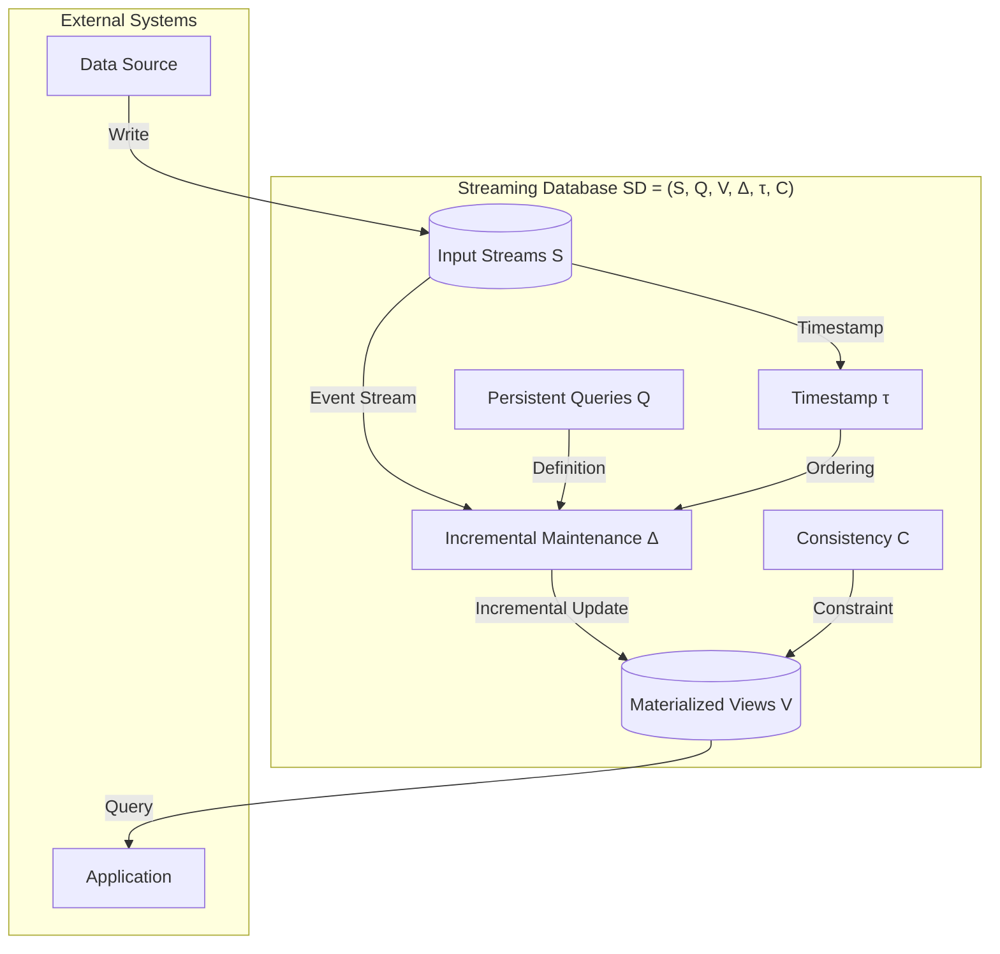
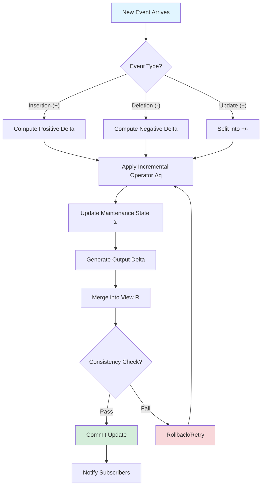
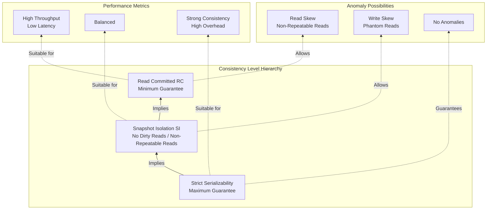

# Streaming Database Formalization

> Stage: Struct/01-foundation | Prerequisites: [01.04-dataflow-model-formalization](./01.04-dataflow-model-formalization.md) | Formalization Level: L5

---

## Table of Contents

- [Streaming Database Formalization](#streaming-database-formalization)
  - [Table of Contents](#table-of-contents)
  - [1. Definitions](#1-definitions)
    - [Def-S-01-80 (Streaming Database Core Model)](#def-s-01-80-streaming-database-core-model)
    - [Def-S-01-81 (Materialized View)](#def-s-01-81-materialized-view)
    - [Def-S-01-82 (Incremental Maintenance)](#def-s-01-82-incremental-maintenance)
    - [Def-S-01-83 (Consistency Level: Strict Serializability)](#def-s-01-83-consistency-level-strict-serializability)
    - [Def-S-01-84 (Consistency Level: Snapshot Isolation)](#def-s-01-84-consistency-level-snapshot-isolation)
    - [Def-S-01-85 (Consistency Level: Read Committed)](#def-s-01-85-consistency-level-read-committed)
    - [Def-S-01-86 (Stream SQL Query Semantics)](#def-s-01-86-stream-sql-query-semantics)
  - [2. Properties](#2-properties)
    - [Lemma-S-01-80 (Materialized View Update Monotonicity)](#lemma-s-01-80-materialized-view-update-monotonicity)
    - [Lemma-S-01-81 (Incremental Maintenance Correctness Condition)](#lemma-s-01-81-incremental-maintenance-correctness-condition)
    - [Lemma-S-01-82 (Consistency Level Implication)](#lemma-s-01-82-consistency-level-implication)
    - [Prop-S-01-80 (Materialized View Commutativity Condition)](#prop-s-01-80-materialized-view-commutativity-condition)
  - [3. Relations](#3-relations)
    - [Relation 1: Streaming Database `↦` Dataflow Model](#relation-1-streaming-database--dataflow-model)
    - [Relation 2: Materialized View `≅` Stream Computation Result Materialization](#relation-2-materialized-view--stream-computation-result-materialization)
    - [Relation 3: Incremental Maintenance `≈` Differential Dataflow](#relation-3-incremental-maintenance--differential-dataflow)
    - [Relation 4: Streaming Database `⊃` Traditional OLTP + OLAP](#relation-4-streaming-database--traditional-oltp--olap)
  - [4. Argumentation](#4-argumentation)
    - [4.1 Coordinating Materialized Views and Stream Semantics](#41-coordinating-materialized-views-and-stream-semantics)
    - [4.2 Boundary Conditions of Incremental Computation](#42-boundary-conditions-of-incremental-computation)
    - [4.3 Trade-off Space of Consistency Levels](#43-trade-off-space-of-consistency-levels)
  - [5. Formal Proof / Engineering Argument](#5-formal-proof--engineering-argument)
    - [Thm-S-01-80 (Streaming Database Consistency Equivalence Theorem)](#thm-s-01-80-streaming-database-consistency-equivalence-theorem)
  - [6. Examples](#6-examples)
    - [Example 6.1: RisingWave Architecture Formalization Mapping](#example-61-risingwave-architecture-formalization-mapping)
    - [Example 6.2: Materialize Differential Dataflow Instance](#example-62-materialize-differential-dataflow-instance)
    - [Counterexample 6.1: Non-Deterministic Update Materialized View Failure](#counterexample-61-non-deterministic-update-materialized-view-failure)
  - [7. Visualizations](#7-visualizations)
    - [Streaming Database Architecture Concept Diagram](#streaming-database-architecture-concept-diagram)
    - [Materialized View Incremental Maintenance Flow](#materialized-view-incremental-maintenance-flow)
    - [Consistency Level Hierarchy Diagram](#consistency-level-hierarchy-diagram)
  - [8. References](#8-references)

---

## 1. Definitions

This section establishes the rigorous formal foundation of streaming databases, covering the core streaming database model, materialized views, incremental maintenance mechanisms, and consistency levels. All definitions serve as the cornerstone for subsequent property derivations and correctness proofs, and draw upon industrial practices from RisingWave[^1] and Materialize[^2].

### Def-S-01-80 (Streaming Database Core Model)

A **Streaming Database** is a sextuple:

$$
\mathcal{SD} = (\mathcal{S}, \mathcal{Q}, \mathcal{V}, \Delta, \tau, \mathcal{C})
$$

The semantics of each component are as follows:

| Symbol | Type | Semantics |
|--------|------|-----------|
| $\mathcal{S}$ | Finite set | Input stream set; each stream $s \in \mathcal{S}$ is represented as an event sequence $s = \langle e_1, e_2, \ldots \rangle$ |
| $\mathcal{Q}$ | Finite set | Persistent query set; each query $q \in \mathcal{Q}$ is a continuously executing SQL query |
| $\mathcal{V}$ | Finite set | Materialized view set; each view $v \in \mathcal{V}$ is the materialized result of some query $q$ |
| $\Delta$ | Family of functions | Incremental update operator family; $\Delta_q: \Delta S \to \Delta V$ defines the incremental computation rule for query $q$ |
| $\tau$ | Time function | Timestamp function; $\tau: \mathcal{S} \times \mathbb{N} \to \mathbb{T}$ assigns a timestamp to each stream event |
| $\mathcal{C}$ | Partial order | Consistency configuration; defines view visibility levels and transaction isolation semantics |

**System Invariants**:

$$
\begin{aligned}
&\text{(I1) View Completeness}: &&\forall v \in \mathcal{V}. \; \exists q \in \mathcal{Q}. \; \text{source}(v) = q \\
&\text{(I2) Incremental Computability}: &&\forall q \in \mathcal{Q}. \; \Delta_q \text{ exists and is efficiently computable} \\
&\text{(I3) Time Monotonicity}: &&\forall s \in \mathcal{S}, \forall i < j. \; \tau(s, i) \leq \tau(s, j) \\
&\text{(I4) Consistency Completeness}: &&\mathcal{C} \in \{\text{Strict}, \text{SI}, \text{RC}\}
\end{aligned}
$$

**Intuitive Explanation**: The streaming database inverts the traditional database's "store-then-query" paradigm into a "query-then-store" paradigm—queries are persistently registered, data streams arrive continuously, and the system incrementally computes and maintains materialized views. This architecture eliminates ETL latency and makes real-time analytics possible[^1][^2].

**Definition Motivation**: Without formalizing the streaming database as a sextuple, it would be impossible to strictly distinguish the essential difference between a "stream processing engine" and a "streaming database": the latter emphasizes persistent queries, materialized views as first-class citizens, and transactional consistency guarantees.

---

### Def-S-01-81 (Materialized View)

A **Materialized View** is the core abstraction in a streaming database, defined as a quintuple:

$$
v = (q, R, \Sigma, T_{last}, \text{valid})
$$

Where:

| Component | Type | Semantics |
|-----------|------|-----------|
| $q$ | $\mathcal{Q}$ | Source query; the defining logic of the view |
| $R$ | Relation instance | Current materialized result; $R \subseteq \mathcal{D}^{arity(q)}$ |
| $\Sigma$ | State summary | Maintenance state; may contain aggregation intermediate results, window states, etc. |
| $T_{last}$ | $\mathbb{T}$ | Last update timestamp |
| $\text{valid}$ | $\mathbb{B}$ | Validity flag; indicates whether the view is in a consistent state |

The **semantics of a materialized view** are defined by the following rule:

$$
\text{View}(v, t) = \{ r \mid r \in \mathcal{D}^* \land q(r, S_{\leq t}) = \text{true} \}
$$

Where $S_{\leq t}$ denotes the set of all input events with timestamp no later than $t$.

**Materialized View Update Rule**:

When the input stream $\mathcal{S}$ produces an incremental change $\Delta S$ at time $t$, the view update follows:

$$
R_{new} = R_{old} \oplus \Delta_q(\Delta S, \Sigma_{old})
$$

Where $\oplus$ is the result merge operator (usually union or replacement), and $\Delta_q$ is the incremental operator corresponding to query $q$.

**Intuitive Explanation**: A materialized view is a "pre-computed and stored query result." Unlike traditional databases, materialized views in a streaming database are continuously maintained—whenever new data arrives, the system incrementally updates the view rather than recomputing it. This is the key to the high performance of streaming databases[^1][^4].

---

### Def-S-01-82 (Incremental Maintenance)

**Incremental Maintenance** is the core mechanism of a streaming database, defined as a triple:

$$
\mathcal{IM} = (\Delta_{in}, f_{\Delta}, \Delta_{out})
$$

Where:

- $\Delta_{in}$: Input delta; represented as a change stream of $(+, e)$ (insertion) or $(-, e)$ (deletion)
- $f_{\Delta}: \Delta_{in} \times \Sigma \to \Delta_{out} \times \Sigma'$: Incremental computation function
- $\Delta_{out}$: Output delta; the change stream of the view

**Incremental Maintenance Classification**:

| Type | Definition | Applicable Scenarios |
|------|------------|----------------------|
| **Full Incremental** | $\forall q. \; \Delta_q$ can be decomposed into local operations | SPJ queries, simple aggregations |
| **Partial Incremental** | Some operators support incrementality; periodic recomputation required | Complex windows, nested aggregations |
| **Non-incremental** | Must recompute the entire view | Complex sorting, full-order dependency operations |

**Incremental Maintenance Correctness Condition**:

For any query $q$ and input change $\Delta_{in}$, incremental maintenance must satisfy:

$$
\text{View}(q, S \cup \Delta_{in}) = \text{View}(q, S) \oplus \Delta_q(\Delta_{in})
$$

**Intuitive Explanation**: Incremental maintenance is the "heart" of a streaming database. It avoids re-executing the full query on every data change; instead, it efficiently updates results by computing the "change of changes." This requires query operators to be decomposable[^2][^5].

---

### Def-S-01-83 (Consistency Level: Strict Serializability)

**Strict Serializability** is the highest consistency level in a streaming database, defined as:

A transaction schedule $H$ is strictly serializable if and only if:

$$
\exists S \in \text{Serial}. \; H \equiv_{conflict} S \land \forall T_i, T_j. \; (T_i \prec_H^{real} T_j \implies T_i \prec_S T_j)
$$

Where:

- $\equiv_{conflict}$ denotes conflict equivalence
- $\prec_H^{real}$ denotes the real-time precedence relation
- $\prec_S$ denotes the precedence order in the serial schedule

In the context of streaming databases, strict serializability requires:

$$
\forall v \in \mathcal{V}, \forall t_1 < t_2. \; \text{State}(v, t_1) \preceq \text{State}(v, t_2)
$$

That is, the view state evolves monotonically with physical time, with no causal inversion.

---

### Def-S-01-84 (Consistency Level: Snapshot Isolation)

**Snapshot Isolation (SI)** is the intermediate consistency level in a streaming database, defined as:

Transaction $T$ executes under snapshot isolation when the following holds:

$$
\begin{aligned}
&\text{(SI1) Snapshot Read}: &&\text{ReadSet}(T) \subseteq \text{DatabaseSnapshot}(\text{StartTime}(T)) \\
&\text{(SI2) Write Conflict Detection}: &&\forall T_i, T_j. \; (\text{WriteSet}(T_i) \cap \text{WriteSet}(T_j) \neq \emptyset \implies \text{Abort}(T_i) \lor \text{Abort}(T_j))
\end{aligned}
$$

In streaming databases, snapshot isolation extends to materialized views:

$$
\forall v \in \mathcal{V}, \forall T. \; \text{Read}(T, v) \in \text{ConsistentCut}(v, t_{start}(T))
$$

Where $\text{ConsistentCut}$ denotes a consistent cut of the stream at time $t$.

**Intuitive Explanation**: Snapshot isolation allows a transaction to see the database state "at some past moment" rather than the latest state. This avoids read-write conflicts but may produce write skew anomalies[^6].

---

### Def-S-01-85 (Consistency Level: Read Committed)

**Read Committed (RC)** is the basic consistency level in a streaming database, defined as:

$$
\forall T, \forall x \in \text{ReadSet}(T). \; \exists T'. \; (\text{Write}(T', x) \in \text{Committed} \land T' \prec T)
$$

That is, a transaction only reads data written by committed transactions.

In streaming databases, read committed has a weakened form for materialized views:

$$
\forall v \in \mathcal{V}, \forall T. \; \neg \exists \Delta. \; (\Delta \in \text{Uncommitted}(v) \land \text{Read}(T, \Delta))
$$

**Consistency Level Strength Relation**:

$$
\text{StrictSerializability} \implies \text{SnapshotIsolation} \implies \text{ReadCommitted}
$$

---

### Def-S-01-86 (Stream SQL Query Semantics)

**Stream SQL queries** are an extension of traditional SQL to streaming data, with semantics defined as the mapping:

$$
\text{StreamSQL}: \mathcal{S}^* \times \mathcal{T} \to \mathcal{R}^*
$$

Formal semantics of stream SQL operators:

| Operator | Semantic Definition | Output Type |
|----------|---------------------|-------------|
| **SELECT** | $\sigma_\phi(S) = \{ e \in S \mid \phi(e) = \text{true} \}$ | Stream |
| **PROJECT** | $\pi_A(S) = \{ e[A] \mid e \in S \}$ | Stream |
| **JOIN** | $S_1 \bowtie_\theta S_2 = \{ (e_1, e_2) \mid e_1 \in S_1, e_2 \in S_2, \theta(e_1, e_2) \}$ | Stream |
| **AGGREGATE** | $\gamma_{G,agg}(S) = \{ (g, \text{agg}(S_g)) \mid g \in G \}$ | Relation/View |
| **WINDOW** | $\omega_{w,slide}(S) = \{ W_i = S_{[t_i, t_i+w)} \}$ | Windowed Stream |

**Stream SQL Time Semantics**:

Stream SQL introduces special time semantics to handle unbounded streams:

$$
\text{EventTime}(e) = e.t_{event}, \quad \text{ProcessingTime}(e) = e.t_{proc}
$$

Queries may define window boundaries based on event time or processing time.

---

## 2. Properties

### Lemma-S-01-80 (Materialized View Update Monotonicity)

**Lemma Statement**: For any materialized view $v$ and input stream $s$, if append semantics are used (insertions only), then the view size is monotonically non-decreasing:

$$
\forall t_1 < t_2. \; |\text{View}(v, t_1)| \leq |\text{View}(v, t_2)|
$$

**Proof**:

1. Let $\Delta S = S_{(t_1, t_2]}$ be the set of events arriving in the time interval $(t_1, t_2]$
2. According to Def-S-01-82, the incremental update satisfies: $R_{t_2} = R_{t_1} \oplus \Delta_q(\Delta S)$
3. For append semantics, $\oplus$ is the union operation, and $\Delta_q$ returns positive deltas
4. Therefore $R_{t_2} = R_{t_1} \cup \Delta_q(\Delta S)$
5. Set union satisfies $|R_{t_2}| = |R_{t_1}| + |\Delta_q(\Delta S)| \geq |R_{t_1}|$
6. Q.E.D.

**Engineering Significance**: This lemma guarantees that under append-only scenarios, materialized views do not shrink, simplifying storage management and caching strategies.

---

### Lemma-S-01-81 (Incremental Maintenance Correctness Condition)

**Lemma Statement**: The necessary and sufficient condition for incremental maintenance $\mathcal{IM}$ to be correct is that the incremental operator $\Delta_q$ satisfies the distributive law:

$$
\forall S_1, S_2. \; q(S_1 \cup S_2) = q(S_1) \oplus \Delta_q(S_2, \Sigma(S_1))
$$

**Proof** (Necessity):

1. Assume $\mathcal{IM}$ is correct; then for any input sequence $S$, the final view equals the batch computation result
2. Let $S = S_1 \cup S_2$; batch computation yields $q(S)$
3. Incremental computation: first compute $q(S_1)$, then apply $\Delta_q(S_2, \Sigma(S_1))$
4. Correctness requires: $q(S_1) \oplus \Delta_q(S_2, \Sigma(S_1)) = q(S_1 \cup S_2)$
5. The distributive law is proven.

**Proof** (Sufficiency):

1. Assume the distributive law holds; use induction to prove incremental maintenance is correct for any event sequence
2. Base case: single event $S = \{e\}$; incremental maintenance directly computes $\Delta_q(\{e\}, \Sigma_0) = q(\{e\})$, which is correct
3. Inductive hypothesis: incremental maintenance is correct for the first $n$ events
4. Inductive step: for the $(n+1)$-th event $e_{n+1}$, by the distributive law
   $$q(S_n \cup \{e_{n+1}\}) = q(S_n) \oplus \Delta_q(\{e_{n+1}\}, \Sigma(S_n))$$
5. By the inductive hypothesis, $q(S_n)$ equals the incremental maintenance result; therefore the updated result is correct
6. Q.E.D.

---

### Lemma-S-01-82 (Consistency Level Implication)

**Lemma Statement**: Strict serializability implies snapshot isolation, and snapshot isolation implies read committed:

$$
\text{Strict} \implies \text{SI} \implies \text{RC}
$$

**Proof**:

**Strict $\implies$ SI**:

1. Strict serializability requires the transaction schedule to be equivalent to some serial schedule while preserving real-time order
2. Therefore, what a transaction sees must be a snapshot at some moment (corresponding to the state at the start of that transaction in the serial schedule)
3. Strict serializability prohibits all anomalies, including write conflicts, thus satisfying SI2
4. Strict implies SI is proven.

**SI $\implies$ RC**:

1. Snapshot isolation requires transactions to read from a snapshot
2. A snapshot only contains writes from committed transactions (uncommitted modifications do not affect the snapshot)
3. Therefore, transactions under snapshot isolation necessarily only read committed data
4. SI implies RC is proven.

---

### Prop-S-01-80 (Materialized View Commutativity Condition)

**Proposition Statement**: If all operators in query $q$ satisfy commutativity and associativity, then materialized view updates are independent of event processing order.

Formalization:

$$
\forall \pi \in \text{Perm}(S). \; \text{View}(q, S) = \text{View}(q, \pi(S))
$$

**Conditions**:

1. No time-window operators, or window operators use event time with correctly advancing watermarks
2. All aggregation operators satisfy associativity: $agg(a, b), c) = agg(a, agg(b, c))$
3. No operators dependent on processing-time order (e.g., processing-time windows)

**Engineering Significance**: This proposition specifies when a streaming database can provide deterministic materialized views, and is the theoretical foundation for systems like RisingWave's "no-disorder assumption"[^1].

---

## 3. Relations

### Relation 1: Streaming Database `↦` Dataflow Model

A streaming database $\mathcal{SD}$ can be mapped to the Dataflow model $\mathcal{G}$:

$$
\Phi_{SD \to DF}: \mathcal{SD} \mapsto \mathcal{G}
$$

**Mapping Definition**:

| $\mathcal{SD}$ Component | $\mathcal{G}$ Component | Description |
|--------------------------|------------------------|-------------|
| $\mathcal{S}$ | $V_{src}$ | Input streams mapped to data source vertices |
| $\mathcal{Q}$ | $V_{op}$ subgraph | Each query compiled into an operator subgraph |
| $\mathcal{V}$ | $V_{sink}$ | Materialized views mapped to data sinks with storage |
| $\Delta$ | Incremental data flow on edges $E$ | Incremental updates propagate along edges |
| $\tau$ | $\mathbb{T}$ | Timestamps mapped to the event time domain |

**Property Preservation**:

- Incremental maintenance $\Delta$ corresponds to incremental operator propagation in Dataflow
- Materialized view consistency $\mathcal{C}$ corresponds to checkpoint semantics in Dataflow

---

### Relation 2: Materialized View `≅` Stream Computation Result Materialization

Materialized views in a streaming database are essentially isomorphic to "result materialization" in traditional stream computing:

$$
v \cong \text{Materialize}(\text{StreamCompute}(q, \mathcal{S}))
$$

**Differences**:

| Aspect | Traditional Stream Computing | Streaming Database Materialized View |
|--------|------------------------------|--------------------------------------|
| Triggering mechanism | Event-driven | Query-registration-driven |
| Result access | Pushed to external systems | Internal storage; supports random queries |
| Consistency guarantee | Relies on external systems | Built-in transaction support |
| Query capability | Limited | Full SQL support |

---

### Relation 3: Incremental Maintenance `≈` Differential Dataflow

The Differential Dataflow[^5] adopted by Materialize is approximately equivalent to incremental maintenance in streaming databases:

$$
\Delta_q \approx \text{DifferentialOperator}(q)
$$

**Correspondences**:

- The "difference" $(\delta)$ in Differential Dataflow corresponds to the incremental $\Delta_{in}/\Delta_{out}$ in streaming databases
- The "nested iteration" in Differential Dataflow corresponds to nested materialized views in streaming databases
- The "time dimension" in Differential Dataflow corresponds to event time/version time in streaming databases

**Difference**: Differential Dataflow supports nested recursion, whereas streaming databases are typically restricted to non-recursive SPJ + aggregation queries.

---

### Relation 4: Streaming Database `⊃` Traditional OLTP + OLAP

The expressive power of streaming databases strictly subsumes traditional OLTP and OLAP systems:

$$
\text{StreamingDB} \supset \text{OLTP} \cup \text{OLAP}
$$

**Containment Explanation**:

1. **Contains OLTP**: Streaming databases can handle point queries and point updates (via streamified changelog)
2. **Contains OLAP**: Materialized views provide pre-aggregated analytical capabilities
3. **Surpasses both**: Streaming databases support continuous queries and real-time incremental updates, which traditional systems' batch processing models cannot provide

---

## 4. Argumentation

### 4.1 Coordinating Materialized Views and Stream Semantics

The core challenge of streaming databases lies in coordinating the "unboundedness of streams" with the "bounded representation of materialized views."

**Argument**: Materialized views must handle unbounded streams through the following mechanisms:

1. **Time windows**: Divide unbounded streams into bounded windows; views aggregate by window
2. **Incremental trimming**: Only maintain aggregation results, discarding original events (lossy compression)
3. **Version control**: Retain multiple time versions; support time-travel queries

**Boundary Condition**: If a query contains a full-order dependency (e.g., Top-K global sorting), the materialized view cannot be maintained in bounded space and must degenerate to approximate results or external storage.

---

### 4.2 Boundary Conditions of Incremental Computation

Not all queries support efficient incremental maintenance.

**Characteristics of Non-Incrementable Queries**:

1. **Non-monotonic aggregations**: Such as median, percentiles (unless approximate algorithms are used)
2. **Recursive queries**: Transitive closures, etc., require iteration to a fixed point
3. **Full-order dependencies**: Global sorting, distinct counting (exact implementation)
4. **Nested subqueries**: Correlated subqueries may involve full-table scans

**Argument**: The practicality of a streaming database depends on the query optimizer's ability to recognize non-incrementable queries and fall back to recomputation strategies.

---

### 4.3 Trade-off Space of Consistency Levels

Different consistency levels involve trade-offs between performance and semantic guarantees:

| Consistency Level | Latency Overhead | Throughput | Possible Anomalies |
|-------------------|------------------|------------|--------------------|
| Strict | High (synchronous barrier) | Low | None |
| SI | Medium (version management) | Medium | Write skew |
| RC | Low (no coordination) | High | Read skew, non-repeatable reads |

**Argumentation Recommendation**: Streaming databases should select consistency levels based on workload:

- Financial transactions: Strict
- Real-time reporting: SI
- Monitoring dashboards: RC

---

## 5. Formal Proof / Engineering Argument

### Thm-S-01-80 (Streaming Database Consistency Equivalence Theorem)

**Theorem Statement**: In a streaming database $\mathcal{SD}$, the following three conditions are equivalent:

1. Materialized views satisfy strict serializability consistency
2. The partial order of incremental maintenance is consistent with the event-time partial order
3. The visible order of all materialized view updates is the same as the physical commit order

Formalization:

$$
\begin{aligned}
&\forall v \in \mathcal{V}, \forall e_i, e_j \in \mathcal{S}. \\
&(t_{commit}(e_i) < t_{commit}(e_j)) \iff (e_i \prec_v e_j)
\end{aligned}
$$

Where $\prec_v$ denotes the precedence relation in the update sequence of view $v$.

**Proof**:

**(1 $\implies$ 2)**:

Assume materialized views satisfy strict serializability. According to Def-S-01-83, strict serializability requires the transaction schedule to be equivalent to a serial schedule that preserves real-time order.
The partial order $\prec_{\Delta}$ of incremental maintenance defines the order in which updates are applied.
Since strict serializability prohibits causal inversion, incremental maintenance must apply updates in event-time order; that is, $\prec_{\Delta}$ is consistent with the event-time partial order.

**(2 $\implies$ 3)**:

Assume the partial order of incremental maintenance is consistent with the event-time partial order. Let $e_i, e_j$ be two events with $t_{commit}(e_i) < t_{commit}(e_j)$.
By the definition of event time, $t_{event}(e_i) \leq t_{commit}(e_i) < t_{commit}(e_j)$.
By assumption, incremental maintenance applies updates in event-time order; therefore, the update for $e_i$ is applied to the view before that for $e_j$.
This precisely matches the description of condition 3.

**(3 $\implies$ 1)**:

Assume the visible order of all view updates is the same as the physical commit order.
Consider any two transactions $T_i, T_j$; if $T_i$ commits before $T_j$ in physical time, then all writes of $T_i$ are visible to all subsequent transactions.
This satisfies the definition of strict serializability: there exists an equivalent serial schedule whose order is consistent with the physical commit order.
Therefore, materialized views satisfy strict serializability.

In summary, the three conditions mutually imply each other; the theorem is proven. $\square$

**Engineering Corollary**: RisingWave's barrier mechanism[^1] and Materialize's timestamp ordering[^2] are both engineering implementations of this theorem—global ordering points are introduced to guarantee the consistency of materialized views.

---

## 6. Examples

### Example 6.1: RisingWave Architecture Formalization Mapping

RisingWave is an open-source distributed streaming database; its architecture can be mapped to our formal model.

**Architecture Component Mapping**:

| RisingWave Component | Formalization Mapping |
|----------------------|-----------------------|
| Frontend | SQL parser; compiles $\mathcal{Q}$ into execution plans |
| Compute Node | Operator instances executing $\Delta_q$; maintains $\Sigma$ |
| Compactor | Storage layer optimization; manages persistence of $\Sigma$ |
| Hummock Storage | Persistent storage $R$ for materialized views |

**RisingWave Consistency Implementation**:

RisingWave uses a **Barrier** mechanism to implement snapshot isolation:

```
Input Stream:  [e1]--[e2]--[B1]--[e3]--[e4]--[B2]-->
Barrier:        |           |
                v           v
View State:  R0  ->  R1      ->  R2
             t=0   t=B1       t=B2
```

Barrier $B_i$ serves as a consistency cut point, ensuring that all updates from events before the Barrier are visible to queries after the Barrier.

---

### Example 6.2: Materialize Differential Dataflow Instance

Materialize implements incremental maintenance based on Differential Dataflow[^5].

**Differential Dataflow Example**: Compute real-time order total for each user

```sql
-- Materialized view definition
CREATE MATERIALIZED VIEW user_order_total AS
SELECT user_id, SUM(amount) as total
FROM orders
GROUP BY user_id;
```

**Incremental Maintenance Process**:

1. Initial state: $R = \emptyset$, $\Sigma = \emptyset$
2. Event arrives: $(+, \text{order}_1: \{user=U1, amount=100\})$
3. Incremental computation: $\Delta_q(+) = \{U1 \to 100\}$
4. View update: $R = R \oplus \Delta_q = \{U1 \to 100\}$
5. Next event: $(+, \text{order}_2: \{user=U1, amount=50\})$
6. Incremental computation: $\Delta_q(+) = \{U1 \to +50\}$ (delta rather than absolute value)
7. View update: $R = \{U1 \to 150\}$

**Differential Dataflow Nested Time**: Materialize supports nested time dimensions, allowing recursive queries to be defined over streams.

---

### Counterexample 6.1: Non-Deterministic Update Materialized View Failure

**Scenario**: A materialized view contains a non-deterministic function

```sql
CREATE MATERIALIZED VIEW random_sample AS
SELECT * FROM events
WHERE random() < 0.1;  -- non-deterministic filter
```

**Problem Analysis**:

1. Let event $e_1$ arrive; the first random() returns 0.05 (< 0.1, selected)
2. System failure occurs; event is replayed after restart
3. On replay, random() returns 0.2 (> 0.1, not selected)
4. Result: the same input leads to different view states, violating consistency

**Conclusion**: Non-deterministic functions are prohibited in materialized view definitions unless deterministic seeds or external deterministic sources are used.

---

## 7. Visualizations

### Streaming Database Architecture Concept Diagram

Conceptual diagram of the sextuple structure of a streaming database and its relationships:



This diagram illustrates the core data flow of a streaming database: input streams are transformed into materialized view updates through the incremental maintenance mechanism; timestamps provide the ordering foundation, and consistency levels constrain the visibility semantics of views.

---

### Materialized View Incremental Maintenance Flow

Detailed flowchart of incremental maintenance:



This flowchart shows the complete incremental maintenance process from event arrival to view update, including error handling and consistency check stages.

---

### Consistency Level Hierarchy Diagram

Hierarchy of consistency levels and their relationships:



This diagram illustrates the implication relationships among the three consistency levels, the types of anomalies they permit, and the performance scenarios for which they are suitable.

---

## 8. References

[^1]: RisingWave Labs, "RisingWave: A Cloud-Native Streaming Database", SIGMOD 2024 Industrial Track. <https://www.risingwave.dev/>

[^2]: Materialize Inc., "Materialize Documentation: SQL and Architecture", 2024. <https://materialize.com/docs/>

[^4]: R. Motwani et al., "Query Processing, Approximation, and Resource Management in a Data Stream Management System", CIDR 2003.

[^5]: M. Zaharia et al., "Discretized Streams: Fault-Tolerant Streaming Computation at Scale", SOSP 2013.

[^6]: H. Berenson et al., "A Critique of ANSI SQL Isolation Levels", SIGMOD 1995.

---

*Document version: v1.0 | Translation date: 2026-04-24*
