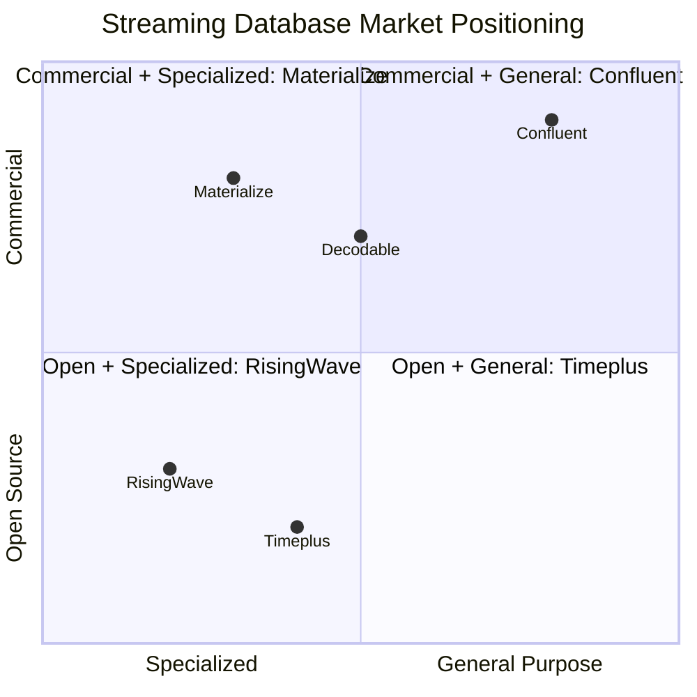

# Streaming Database Market Analysis

> **Language**: English | **Source**: [Knowledge/06-frontier/streaming-databases-market-analysis-supplement.md](../Knowledge/06-frontier/streaming-databases-market-analysis-supplement.md) | **Last Updated**: 2026-04-21

---

## Version Tracking

| Product | Document Version | Latest Market Version | Gap |
|---------|-----------------|----------------------|-----|
| RisingWave | v2.6-v2.7 | **v2.8.0** (2026-03) | Missing v2.8 features |
| Materialize | Not specified | **v26.18.0** (2026-04) | Full doc needed |
| Timeplus | v2.6-v2.7 | **v2.9.0** (Preview) | Missing v2.8/v2.9 |

## Feature Coverage Matrix

| Feature Area | Doc Coverage | Market Report | Action |
|-------------|-------------|---------------|--------|
| Core architecture | ✓ Complete | ✓ Complete | Keep |
| Iceberg integration | ✗ Missing | ✓ Complete | Sync to main doc |
| License model | △ Partial | ✓ Complete | Add BSL explanation |
| Performance benchmarks | ✗ Missing | ✓ Complete | Sync |
| AI/ML scenarios | ✗ Missing | △ Partial | Expand |
| Developer tools | ✗ Missing | △ Partial | Add new |
| Cost analysis | ✗ Missing | △ Partial | Add new |

## RisingWave Key Features (v2.8)

| Feature | Status | Impact |
|---------|--------|--------|
| Nimtable | Released 2024-11 | **High** - Iceberg control plane |
| Iceberg Table Engine | Released 2024-11 | **High** - Core differentiator |
| CoW Mode | Supported 2025-09 | **Medium** - Storage optimization |
| VACUUM | Supported 2025-10 | **Medium** - Operations |
| Memory-Only Mode | v2.6+ | **Medium** - Performance |

## Materialize Key Features (v26.18)

| Feature | Status | Impact |
|---------|--------|--------|
| Iceberg Sink | v26.13 Preview | **High** - Market trend |
| COPY FROM S3 | v26.14+ CSV/Parquet | **Medium** - Data integration |
| SQL Server Source | v26.5+ enhanced | **Medium** - Enterprise |
| Replacement MV | v26.10 Preview | **Medium** - Operations |

## Timeplus Key Features (v2.9 Preview)

| Feature | Status | Impact |
|---------|--------|--------|
| Streaming SQL enhancements | v2.8+ | **High** |
| Proton engine improvements | v2.9 Preview | **High** |
| Kubernetes operator | v2.8+ | **Medium** |

## Market Positioning

## References
