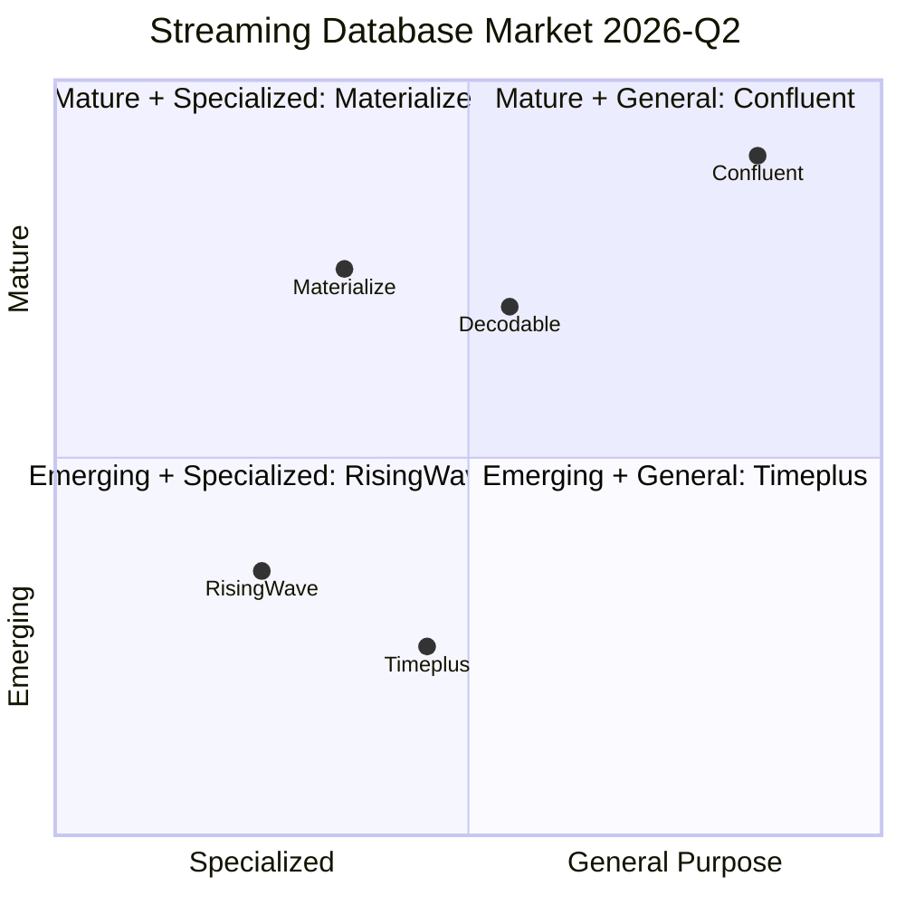

# Streaming Database Market Report 2026-Q2

> **Language**: English | **Source**: [Knowledge/06-frontier/streaming-databases-market-report-2026-Q2.md](../Knowledge/06-frontier/streaming-databases-market-report-2026-Q2.md) | **Last Updated**: 2026-04-21

---

## Executive Summary

Q1-Q2 2026 shows three major trends in the streaming database market: **rapid iteration**, **feature convergence**, and **ecosystem expansion**.
RisingWave, Materialize, and Timeplus all prioritize **Apache Iceberg integration** as their core strategy, while differentiating on AI adaptation, cloud-native capabilities, and developer experience.

## RisingWave (v2.8.0, 2026-03-02)

### Iceberg Ecosystem Integration

| Date | Feature |
|------|---------|
| 2025-04 | AWS S3 Tables, Snowflake/Databricks Catalog |
| 2025-05 | Iceberg writer with exactly-once semantics |
| 2025-09 | CoW (Copy-on-Write) mode support |
| 2025-10 | VACUUM; Lakekeeper REST catalog |
| 2025-12 | Refreshable Iceberg batch tables |
| 2026-02 | Configurable Parquet writer properties |

**Key features**:

- **Nimtable**: Iceberg control plane (Nov 2024)
- **Rust-based Iceberg engine**: Migrated from Java for better performance

### Performance Enhancements

| Feature | Description | Version |
|---------|-------------|---------|
| Memory-Only Mode | Operator state fully in-memory for lower latency | v2.6+ |
| Adaptive parallelism | String-based configuration | v2.7+ |
| Join encoding optimization | `streaming_join_encoding` variable | v2.6+ |
| Watermark derivation | AsOf Join watermark propagation | v2.7+ |

## Materialize (v26.18.0, 2026-04-02)

| Feature | Status | Impact |
|---------|--------|--------|
| Iceberg Sink | v26.13 Preview | **High** — Market convergence |
| COPY FROM S3 | v26.14+ CSV/Parquet | **Medium** — Data integration |
| SQL Server Source | v26.5+ enhanced | **Medium** — Enterprise |
| Replacement MV | v26.10 Preview | **Medium** — Operations |

## Timeplus (v2.9.0 Preview)

| Feature | Status | Impact |
|---------|--------|--------|
| Streaming SQL enhancements | v2.8+ | **High** |
| Proton engine improvements | v2.9 Preview | **High** |
| Kubernetes operator | v2.8+ | **Medium** |

## Market Trends

## References
