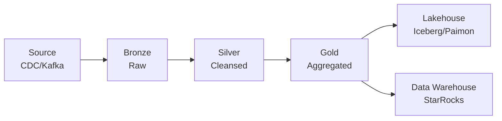

# Streaming ETL Best Practices & Design Patterns

> **Stage**: Flink Core | **Prerequisites**: [Exactly-Once](../exactly-once-end-to-end.md), [Time Semantics](../flink-time-semantics-watermark.md) | **Formal Level**: L4
>
> End-to-end streaming ETL: ingestion patterns, transformation modes, loading strategies, and data governance.

---

## 1. Definitions

**Def-F-02-59: ETL Formal Definition**

$$
\text{ETL} = (E_{extract}, T_{transform}, L_{load})
$$

where $E$ = data ingestion, $T$ = stream transformations, $L$ = sink loading.

**Def-F-02-60: Medallion Architecture**

| Layer | Quality | Purpose |
|-------|---------|---------|
| Bronze | Raw | Ingestion, schema validation |
| Silver | Cleansed | Deduplication, enrichment |
| Gold | Aggregated | Business metrics, features |

**Def-F-02-61: Zero-ETL**

Direct query on source systems without explicit ETL pipeline, enabled by query federation.

---

## 2. Properties

**Prop-F-02-09: Throughput Boundary**

Maximum throughput is bounded by the minimum of source production rate, processing capacity, and sink ingestion rate.

**Prop-F-02-10: Latency Guarantee**

End-to-end latency = ingestion latency + processing latency + sink latency + network overhead.

---

## 3. Relations

- **with Data Mesh**: ETL pipelines produce streaming data products.
- **with Lakehouse**: Streaming ETL feeds lakehouse tables (Iceberg, Paimon, Delta Lake).

---

## 4. Argumentation

**ETL vs ELT vs EtLT**:

| Pattern | Transform Location | Use Case |
|---------|-------------------|----------|
| ETL | Stream engine | Complex transformations |
| ELT | Target warehouse | Simple ingestion |
| EtLT | Stream + Target | Mixed complexity |

**Ingestion Patterns**:

| Pattern | Latency | Complexity | Use Case |
|---------|---------|------------|----------|
| CDC | Low | Medium | Database replication |
| Event-driven | Very low | Low | Microservices |
| Micro-batch | Medium | Low | Log aggregation |

---

## 5. Engineering Argument

**Idempotent Writes**: For Exactly-Once ETL, sinks must be idempotent or transactional. Idempotent sinks use deterministic IDs; transactional sinks use 2PC.

---

## 6. Examples

```java
// Bronze to Silver transformation
stream
    .map(new RawParser())           // Bronze
    .filter(new QualityCheck())     // Validation
    .keyBy(Event::getUserId)
    .window(TumblingEventTimeWindows.of(Time.minutes(5)))
    .aggregate(new SessionEnrich()) // Silver
    .addSink(new IcebergSink());    // Lakehouse
```

---

## 7. Visualizations

**Streaming ETL Pipeline**:



---

## 8. References
