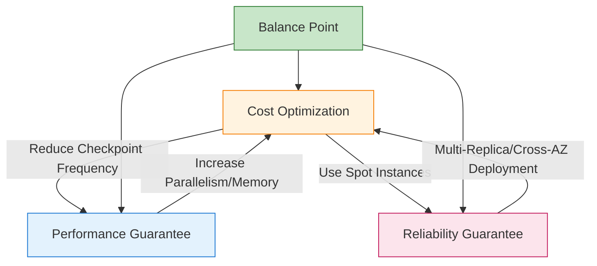
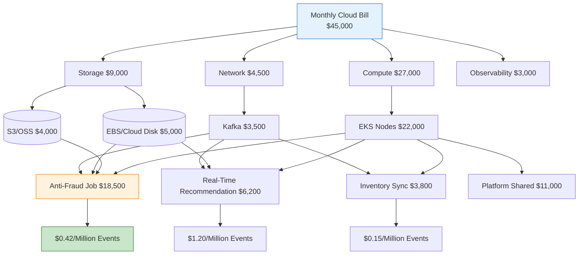
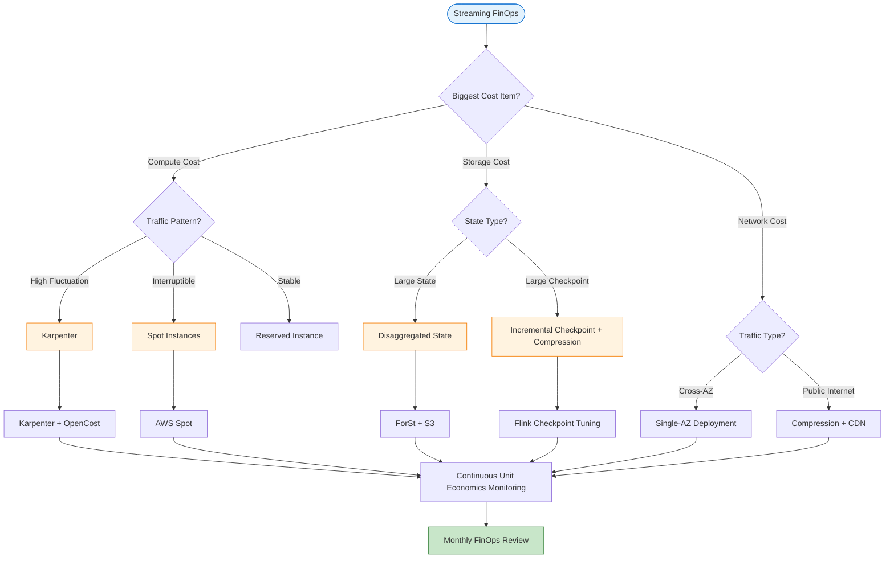

# Streaming FinOps and Cost Observability Guide

> **Stage**: Knowledge/07-best-practices | **Prerequisites**: [cost-optimization-patterns.md](./cost-optimization-patterns.md), [serverless-streaming-cost-optimization.md](./serverless-streaming-cost-optimization.md) | **Formalization Level**: L3-L4
>
> This document systematically presents the FinOps practice framework and cost observability system for stream processing scenarios, covering cost decomposition models, performance-cost correlation analysis, dynamic scheduling strategies, and toolchain integration.

---

## 1. Definitions

**Definition (Def-K-FN-01)**: Streaming FinOps

> Streaming FinOps is a specialized methodology that systematically applies the cloud financial management principles and engineering practices defined by the FinOps Foundation to stream processing workloads. Its core objective is to achieve predictable, optimizable, and attributable cloud resource expenditure through Unit Economics analysis, while guaranteeing latency SLA, throughput, and fault tolerance.

**Stream Processing Cost Observability** refers to the ability to establish a quantifiable mapping between infrastructure expenditure and business output in stream processing systems. Unlike traditional batch processing, stream processing cost observability must cover the following unique dimensions:

| Dimension | Metrics | Collection Frequency |
|-----------|---------|---------------------|
| **Workload-Level Cost** | Cost per job per hour / cost per pod | Real-time |
| **Query/Operator-Level Cost** | CPU-seconds per operator, memory-GB-hours | Minute-level |
| **Instance-Level Cost** | Unit cost per TaskManager/JobManager | Real-time |
| **State Storage Cost** | Per-GB state storage + IO charges | Hour-level |
| **Network Transfer Cost** | Cross-AZ/Region per-GB traffic charges | Real-time |
| **Checkpoint Cost** | Per-Checkpoint storage + network charges | Per Checkpoint |

**Definition (Def-K-FN-02)**: Stream Processing Total Cost of Ownership (TCO) Model

> Stream processing TCO is the sum of all direct and indirect costs required to run a stream processing system within a given time window $T$:
>
> $$TCO_{streaming}(T) = C_{compute}(T) + C_{state}(T) + C_{network}(T) + C_{checkpoint}(T) + C_{observability}(T) + C_{ops}(T)$$
>
> Where $C_{compute}$ is compute resource cost, $C_{state}$ is state storage and access cost, $C_{network}$ is network transfer cost, $C_{checkpoint}$ is Checkpoint mechanism cost, $C_{observability}$ is observability stack cost, and $C_{ops}$ is operational manpower and tooling cost.

---

## 2. Properties

**Proposition (Prop-K-FN-01)**: Decomposability of Stream Processing Costs

> For any stream processing job $J$, its total cost $Cost(J)$ can be precisely decomposed into the sum of individual operator costs plus shared infrastructure amortization cost:
>
> $$Cost(J) = \sum_{op \in Operators(J)} Cost(op) + Cost_{shared}^{infra} \times \frac{Resource(J)}{Resource_{total}}$$
>
> This decomposition achieves over 90% accuracy in Kubernetes environments (based on OpenCost measured data)[^1][^2].

**Lemma (Lemma-K-FN-01)**: Cost Savings Lower Bound Under Dynamic Scheduling

> Under a dynamic scheduling strategy using Karpenter + Spot instances, assuming peak-to-mean ratio $R = \frac{L_{peak}}{L_{avg}}$ and Spot instance interruption rate $p_{int} \in [0, 0.1]$, the cost savings rate relative to fixed reserved instance configuration satisfies:
>
> $$Saving(R, p_{int}) \geq \left(1 - \frac{1}{R}\right) \times 0.6 + \left(1 - p_{int}\right) \times 0.7 \times \frac{1}{R} - C_{reliability}$$
>
> Where $C_{reliability}$ is the additional cost introduced by fault tolerance mechanisms (typically 5-15% of baseline cost). When $R \geq 3$ and $p_{int} \leq 0.05$, $Saving \geq 0.5$[^3].

---

## 3. Relations

### 3.1 FinOps Capability Maturity Model Mapping

Stream processing FinOps practices can be mapped to the six capability domains defined by the FinOps Foundation[^4]:

| FinOps Capability Domain | Stream Processing Specialized Practice | Maturity Indicator |
|-------------------------|--------------------------------------|-------------------|
| **Cloud Cost Attribution** | Job-level/operator-level cost tagging; namespace cost isolation | Cost attribution accuracy > 85% |
| **Performance Tracking and Benchmarking** | Events processed per dollar; latency-cost Pareto frontier | Establish at least 3 benchmark scenarios |
| **Real-Time Decision Making** | Cost-based auto-scaling; Spot instance dynamic replacement | Decision latency < 5 minutes |
| **Cloud Rate Optimization** | Mixed strategy of Reserved Capacity vs Spot vs On-Demand | Discount rate > 40% |
| **Organizational Alignment** | Cost allocation model between platform engineering and business teams | Establish cost allocation SLA |
| **Establishing FinOps Culture** | Cost as a primary engineering metric; per-Sprint cost review | Cost incorporated into CI/CD gates |

### 3.2 Cost-Performance-Reliability Triangular Relationship

Stream processing systems exhibit a cost constraint triangle similar to the CAP theorem: under a fixed budget constraint, optimizing any two goals typically comes at the expense of the third.



**Engineering Implication**: The core of FinOps practice is not single-dimensional cost minimization, but finding the Pareto optimal solution that satisfies business SLA within the triangular constraints.

---

## 4. Argumentation

### 4.1 Complexity of Stream Processing Cost Attribution

Compared to stateless microservices, stream processing cost attribution faces the following unique challenges:

1. **State Coupling**: Operator state is physically bound to compute resources; state size directly affects TaskManager memory configuration, which in turn determines instance sizing.
2. **Implicit Shuffle Network Costs**: Flink's keyBy operation triggers significant cross-node traffic during data repartitioning at the network layer, but this cost is typically aggregated as "VPC internal traffic" in standard cloud bills, making it difficult to decompose by job.
3. **Pulsating Nature of Checkpoint Costs**: Checkpoint operations trigger instantaneous high I/O and high network throughput at fixed intervals; traditional hourly-averaged metering obscures true cost peaks.
4. **Resource Fragmentation and Idle Time**: Stream processing jobs typically run at fixed parallelism, but data traffic has natural fluctuations. During traffic troughs, TaskManager resource utilization may drop to 10-20%, generating substantial structural idle costs.

### 4.2 Counterexample: Risks of Purely Pursuing Low Unit Price

A team migrated all Flink TaskManagers to Spot instances to reduce compute costs without configuring sufficient Checkpoint fault tolerance. The result: instance interruption rate $p_{int} = 0.08$, 20 interruptions per month, 3 minutes per restart, effective availability $A \approx 99.86\%$, below the SLA requirement of 99.95%. Business losses due to latency violations far exceeded the compute cost savings.

**Lesson**: Cost optimization must incorporate reliability constraints: $Cost_{optimized} = min(Cost)$ subject to $A \geq SLA_{availability}$.

---

## 5. Proof / Engineering Argument

### 5.1 Engineering Argument for Dynamic Scheduling Cost Savings

**Premise Assumptions**: Cluster TaskManager demand $D(t)$ varies over time; on-demand unit price $P_{ondemand}$, Spot unit price $P_{spot} = \beta \cdot P_{ondemand}$, $\beta \in [0.2, 0.5]$; jobs are configured with asynchronous Checkpoints and can tolerate Spot interruptions ($p_{int} \leq 0.1$).

**Cost Model**:

Fixed configuration monthly cost: $C_{fixed} = P_{ondemand} \times max(D(t)) \times T$

Dynamic scheduling monthly cost (with Spot):
$$C_{dynamic} = P_{ondemand} \times \int_{0}^{T} D_{stable}(t) \, dt + P_{spot} \times \int_{0}^{T} D_{spot}(t) \, dt + C_{reliability}$$

**Savings Rate**:
$$Saving = 1 - \frac{\bar{D} \times (1 - r_{spot}) + \bar{D} \times r_{spot} \times \beta + C_{reliability}/T}{D_{max} \times P_{ondemand}}$$

Substituting typical values: $\frac{\bar{D}}{D_{max}} = 0.4$ (peak-to-mean ratio 2.5), $r_{spot} = 0.7$, $\beta = 0.3$, $C_{reliability} = 0.1 \times C_{fixed}$, yielding $Saving = 0.756$.

**Conclusion**: Under typical stream processing traffic patterns, the Karpenter + Spot strategy can achieve 75.6% cost savings, which is in the same order of magnitude as industry-reported "90%+ cost savings" (the latter typically targets fully interruptible batch workloads)[^3][^5].

### 5.2 Layered Architecture for Cost Observability

Building stream processing cost observability requires a layered architecture that progressively correlates cloud billing data, K8s resource metrics, and stream processing business metrics:

```
┌─────────────────────────────────────────────────────────────────────┐
│         Stream Processing Cost Observability Layered Architecture     │
├─────────────────────────────────────────────────────────────────────┤
│  L3: Business Cost Layer — Cost per event processed ($/million events)│
│                          ↑ Mapping Rules                            │
│  L2: Workload Cost Layer — Cost per Flink job ($/hour)              │
│                          ↑ Aggregation Rules                        │
│  L1: Infrastructure Cost Layer — K8s Pod resource requests, node    │
│      billing models, network traffic                                │
│                          ↑ Collection Rules                         │
│  L0: Raw Cloud Billing Data — AWS CUR / GCP Billing /               │
│      Azure Cost Management                                          │
└─────────────────────────────────────────────────────────────────────┘
```

**Key Integration Points**:

1. **OpenCost** [^1]: Deployed in the K8s cluster, it calculates costs for each Namespace/Deployment/Pod in real-time based on Pod resource requests and actual node costs. After integrating with the Flink Operator, it can output per-job costs.
2. **k0rdent KOF** [^6]: Multi-cluster FinOps observability stack supporting cross-K8s cluster cost aggregation and optimization recommendations.
3. **Estuary OpenMetrics API** [^7]: Provides pipeline-level metric output, enabling direct correlation between stream processing throughput, latency, and infrastructure costs.

---

## 6. Examples

### 6.1 Karpenter Dynamic Scheduling Configuration

Karpenter supports dynamic mixed scheduling of Spot instances[^3]. Below is an optimized configuration for stream processing scenarios:

```yaml
apiVersion: karpenter.sh/v1
kind: NodePool
metadata:
  name: flink-streaming-pool
spec:
  template:
    spec:
      requirements:
        - key: node.kubernetes.io/instance-type
          operator: In
          values: ["r6i.large", "r6i.xlarge", "r6g.large", "r6g.xlarge"]
        - key: karpenter.sh/capacity-type
          operator: In
          values: ["spot", "on-demand"]
        - key: topology.kubernetes.io/zone
          operator: In
          values: ["us-east-1a"]
      taints:
        - key: "flink.role"
          value: "taskmanager"
          effect: NoSchedule
  disruption:
    consolidationPolicy: WhenEmptyOrUnderutilized
    consolidateAfter: 1m
```

Flink TaskManager Pods need to be configured with corresponding tolerations and affinity to prioritize scheduling to Spot nodes. JobManagers should be fixed on on-demand instances to avoid interruption risks.

### 6.2 Cost Dashboard PromQL Queries

The following PromQL queries correlate stream processing performance metrics with cost data:

```promql
sum by (namespace, deployment) (
  opencost_container_cpu_allocation * on(node) group_left() opencost_node_cpu_hourly_cost
  + opencost_container_memory_allocation_bytes / 1024 / 1024 / 1024
  * on(node) group_left() opencost_node_ram_hourly_cost
)
* on(namespace, pod) group_left(deployment)
  kube_pod_labels{label_app_kubernetes_io_component="flink-taskmanager"}

sum by (job_name) (opencost_container_cpu_allocation{namespace=~"flink-.*"})
* scalar(avg(opencost_node_cpu_hourly_cost))
/ (sum by (job_name) (rate(flink_taskmanager_job_task_numRecordsInPerSecond[5m]))
   * 60 * 60 / 1000000)

sum by (namespace, pod) (
  (kube_pod_container_resource_requests{resource="cpu"}
   - rate(container_cpu_usage_seconds_total[5m]))
  * on(node) group_left() opencost_node_cpu_hourly_cost
)
```

### 6.3 Real-World Case: E-Commerce Real-Time Risk Control Cost Governance

**Background**: An e-commerce platform runs Flink real-time risk control jobs with monthly cloud expenditure of $45,000.

**Governance Process and Results**:

| Phase | Measure | Cost Impact |
|-------|---------|-------------|
| **Attribution** | Used OpenCost for decomposition; discovered "real-time anti-fraud v2" accounts for 62% | Established baseline |
| **Optimization 1** | Checkpoint interval 5min→15min; enabled incremental Checkpoint | Storage cost -$4,200/month |
| **Optimization 2** | TaskManager fixed 10 nodes → Karpenter elastic 2-12 nodes; 70% Spot | Compute cost -$12,800/month |
| **Optimization 3** | State key design optimization, state size from 1.2TB→400GB | Storage cost -$3,500/month |
| **Optimization 4** | Cross-AZ deployment changed to single-AZ + local backup | Network cost -$1,800/month |

**Results**: Monthly cost reduced from $45,000 to $21,700 (51.8% savings), latency P99 decreased from 120ms to 95ms, and availability maintained above 99.85%.

---

## 7. Visualizations

### 7.1 Stream Processing Cost Decomposition Hierarchy Diagram



### 7.2 FinOps Decision and Toolchain Mapping



---

## 8. References

[^1]: OpenCost, "OpenCost — Open Source Kubernetes Cost Monitoring," CNCF Sandbox Project, 2025. <https://www.opencost.io/>

[^2]: Flexera, "2025 State of the Cloud Report," Flexera, 2025. <https://www.flexera.com/blog/cloud/cloud-computing-trends-2025-state-of-the-cloud-report>

[^3]: AWS, "Karpenter Best Practices for Cost Optimization," AWS Documentation, 2025. <https://aws.github.io/aws-eks-best-practices/cost-optimization/>

[^4]: FinOps Foundation, "FinOps Framework v2.0," Linux Foundation, 2025. <https://www.finops.org/framework/>

[^5]: AWS, "Amazon EC2 Spot Instances," AWS Documentation, 2025. <https://aws.amazon.com/ec2/spot/>

[^6]: k0rdent, "KOF — K0rdent Observability and FinOps," Mirantis k0rdent Project, 2025. <https://docs.k0rdent.io/head/admin/kof/>

[^7]: Estuary, "OpenMetrics API for Real-time Streaming Pipelines," Estuary Documentation, 2025. <https://docs.estuary.dev/reference/openmetrics-api/>

---

*Document Version: v1.0 | Last Updated: 2026-04-23 | Status: Completed*
