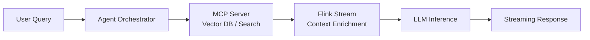
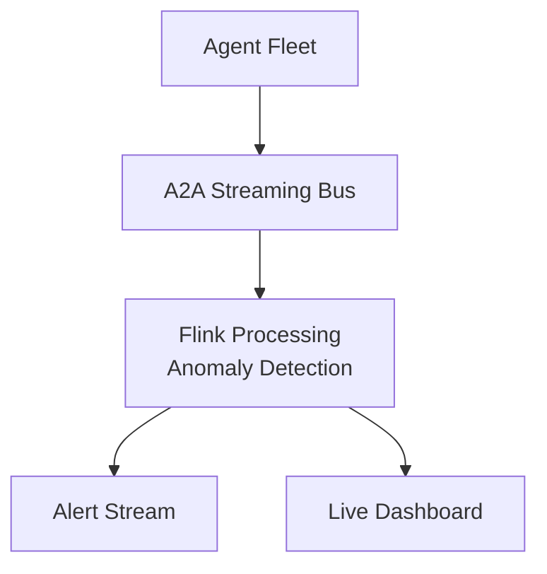

# Streaming + MCP/A2A Protocol Integration

> **Language**: English | **Source**: [Knowledge/06-frontier/streaming-mcp-a2a-integration.md](../Knowledge/06-frontier/streaming-mcp-a2a-integration.md) | **Last Updated**: 2026-04-21

---

## 1. Definitions

### Def-K-06-EN-250: MCP-Streaming Bridge

A bidirectional adaptation layer between the Model Context Protocol and stream processing systems:

$$
\text{Bridge} = (S_{mcp}, S_{flink}, \phi_{in}, \phi_{out})
$$

where:

- $S_{mcp} = (\text{Tools}, \text{Resources}, \text{Prompts})$: MCP capability space
- $S_{flink} = (\text{DataStream}, \text{KeyedStream}, \text{BroadcastStream})$: Flink stream abstractions
- $\phi_{in}: S_{mcp} \to S_{flink}$: MCP → Flink encoding
- $\phi_{out}: S_{flink} \to S_{mcp}$: Flink → MCP decoding

**Components**:

- **MCP Source Connector**: Subscribe to MCP Server resource changes, stream tool call results into DataStream
- **MCP Sink Connector**: Write stream aggregation results to MCP Resource, trigger prompt template updates

**Protocol Mapping**:

| MCP Concept | Flink Equivalent |
|-------------|-----------------|
| MCP Resource | Flink Source (unbounded stream) |
| MCP Tool Call | Flink AsyncFunction (enrichment) |
| MCP Prompt | Flink Broadcast Stream (config) |

### Def-K-06-EN-251: A2A-Streaming Agent Bus

An Agent-to-Agent communication bus based on stream processing engines:

**Architecture**:

- **Transport Layer**: Flink DataStream for Agent Message transport, keyed partitioning by conversation/agent ID, backpressure-aware flow control
- **Protocol Layer**: Agent Card registry → Flink MapState; Task lifecycle → Flink Event Time; Streaming Artifacts → Flink SideOutput
- **Application Layer**: Multi-agent coordination topologies (Star/Tree/Mesh), dynamic task routing, progressive artifact collection

## 2. Properties

### Prop-K-06-EN-250: Exactly-Once Agent Messaging

When A2A messages are transported over Flink's exactly-once checkpointing:

$$
\forall m \in \text{Messages}: \text{delivered}(m) \iff \text{sent}(m) \land \neg\text{duplicated}(m)
$$

### Prop-K-06-EN-251: Latency Bounds for Agent Coordination

| Topology | Messages | Latency Bound | Throughput |
|----------|----------|---------------|------------|
| Star (central broker) | $O(n)$ | $< 100$ms | Medium |
| Tree (hierarchical) | $O(\log n)$ | $< 200$ms | High |
| Mesh (direct) | $O(n^2)$ | $< 50$ms | Low |

## 3. Integration Patterns

### Pattern 1: Streaming RAG Pipeline



### Pattern 2: Real-Time Agent Monitoring



## 4. Implementation Sketch

```java
// MCP Source: Subscribe to resource changes
DataStream<ResourceUpdate> mcpSource = env
    .addSource(new MCPResourceSource("server-url", "resource-name"))
    .assignTimestampsAndWatermarks(
        WatermarkStrategy.<ResourceUpdate>forMonotonousTimestamps()
    );

// A2A Message Bus: Keyed by conversation
DataStream<A2AMessage> agentBus = env
    .addSource(new A2AMessageSource("agent-card-registry"))
    .keyBy(msg -> msg.getConversationId())
    .process(new TaskLifecycleHandler());
```

## References
