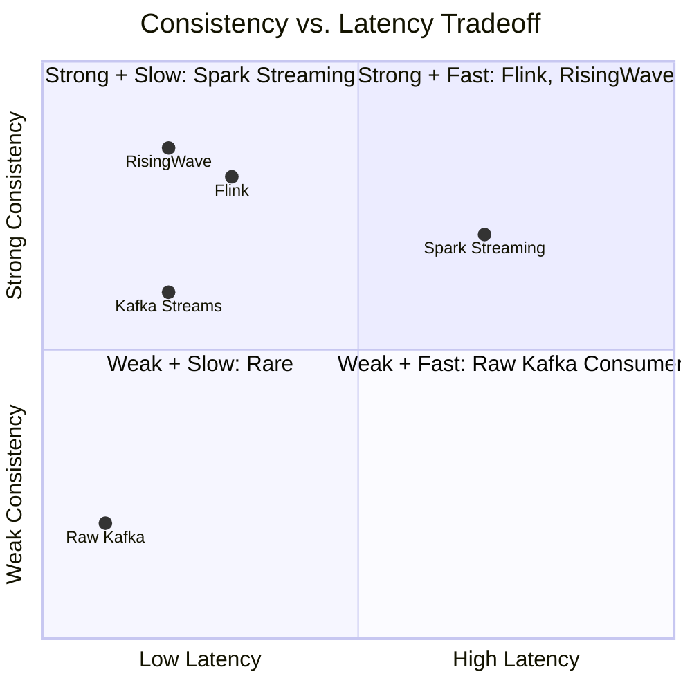

# Streaming Processing Decision Matrix

> **Language**: English | **Last Updated**: 2026-04-21

---

## 1. Engine Selection

| Requirement | Flink | Spark Streaming | Kafka Streams | RisingWave | Materialize |
|-------------|-------|-----------------|---------------|------------|-------------|
| **Latency < 100ms** | ✅ | ❌ | ✅ | ✅ | ✅ |
| **Throughput > 1M eps** | ✅ | ✅ | ⚠️ | ✅ | ⚠️ |
| **Exactly-Once** | ✅ | ✅ | ✅ | ✅ | ✅ |
| **SQL API** | ✅ | ✅ | ❌ | ✅ | ✅ |
| **CEP** | ✅ | ❌ | ❌ | ❌ | ❌ |
| **Custom Operators** | ✅ | ✅ | ⚠️ | ❌ | ❌ |
| **State > 1TB** | ✅ | ⚠️ | ⚠️ | ✅ | ⚠️ |
| **Low Ops Overhead** | ⚠️ | ⚠️ | ✅ | ✅ | ✅ |

## 2. State Backend Selection

| State Size | Access Pattern | Backend | Snapshot Mode |
|------------|---------------|---------|---------------|
| < 100MB | Heap access | MemoryStateBackend | Full |
| 100MB - 10GB | Heap + spill | FsStateBackend | Incremental |
| > 10GB | Disk-optimized | RocksDBStateBackend | Incremental |
| > 1TB | Remote disaggregated | ForStateBackend / RisingWave | Async remote |

## 3. Deployment Mode Selection

| Scenario | Mode | Platform | Reason |
|----------|------|----------|--------|
| Dev / Multi-tenant platform | Session | K8s / YARN | Fast startup, resource sharing |
| Production batch | Per-Job | YARN | High isolation |
| Long-running streaming | Application | K8s | Proper main() isolation |
| Edge / IoT | Application | Standalone | Minimal infrastructure |

## 4. Consistency vs. Latency Tradeoff

## 5. Checkpoint Interval Guidance

| Tolerance | Interval | Max State Size | Backend |
|-----------|----------|----------------|---------|
| Zero data loss | 10s | < 100GB | RocksDB |
| < 1 min replay | 60s | < 500GB | RocksDB |
| < 5 min replay | 300s | < 2TB | RocksDB + Incremental |
| Best effort | 600s+ | > 2TB | ForStateBackend |

## 6. Security Model by Data Sensitivity

| Sensitivity | Authentication | Encryption | Audit | Model |
|-------------|---------------|------------|-------|-------|
| Public | Basic TLS | In-flight | Basic | RBAC |
| Internal | OAuth2 / Kerberos | In-flight + At-rest | Standard | ABAC |
| Confidential | ZeroTrust + MFA | Field-level | Comprehensive | ZeroTrust |
| Restricted | ZeroTrust + TEE | Homomorphic / TEE | Immutable | TEE + HE |

## References
