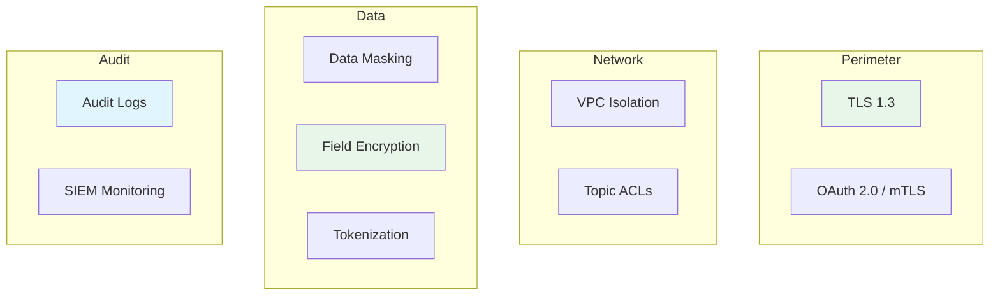

# Streaming Data Security & Compliance

> **Stage**: Knowledge/08-standards | **Prerequisites**: [Streaming Data Governance](streaming-data-governance.md) | **Formalization Level**: L4
> **Translation Date**: 2026-04-21

## Abstract

This document formalizes the threat model, encryption hierarchy, and compliance framework for streaming data systems, adapting STRIDE methodology for real-time contexts.

---

## 1. Definitions

### Def-K-08-30 (Streaming Data Threat Model)

The **streaming data threat model** follows STRIDE adapted for streaming:

$$\text{ThreatModel}_{stream} = \langle A, V, T, I, R \rangle$$

where:

- $A$: attacker capabilities
- $V$: vulnerabilities
- $T$: threat types
- $I$: impact assessment
- $R$: risk mitigation

**STRIDE-for-Streaming**:

| Threat | Streaming Scenario | Risk |
|--------|-------------------|------|
| **S**poofing | Fake producer identity injecting malicious events | High |
| **T**ampering | Man-in-the-middle modifying stream data | High |
| **R**epudiation | Operator denying send/receive | Medium |
| **I**nformation Disclosure | Unauthorized access to sensitive streams | High |
| **D**enial of Service | Traffic flooding causing delays/crashes | High |
| **E**levation of Privilege | Breaking ACLs to access restricted topics | Medium |

### Def-K-08-31 (Data Encryption Hierarchy)

**Encryption in Transit**:

$$\text{Enc}_{transit}: \text{Plaintext} \times K_{session} \to \text{Ciphertext}$$

**Encryption at Rest**:

$$\text{Enc}_{rest}: \text{Plaintext} \times K_{storage} \to \text{Ciphertext}$$

**Field-Level Encryption**:

$$\text{Enc}_{field}: \text{PII}_i \times K_{field} \to \text{Ciphertext}_i$$

---

## 2. Compliance Frameworks

| Regulation | Streaming Requirements | Implementation |
|------------|----------------------|----------------|
| GDPR | Data minimization, right to deletion | TTL + deletion sink |
| CCPA | Consumer data access/ deletion | Audit log + API |
| HIPAA | PHI encryption, access logging | Field encryption + audit |
| PCI-DSS | Card data tokenization | Tokenization service |
| SOX | Financial data integrity | Immutable log + checksum |

---

## 3. Security Architecture

---

## 4. References
