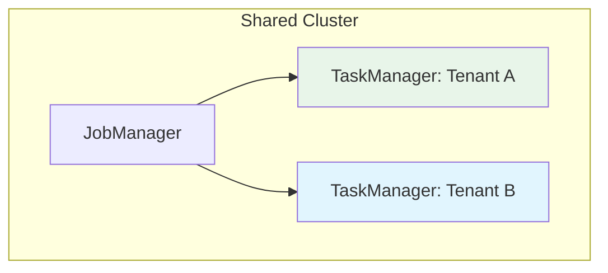

# Streaming Security Model Comparison

> **Stage**: Knowledge/04-technology-selection | **Prerequisites**: [Security Hardening Guide](security-hardening-guide.md) | **Formalization Level**: L3-L4
> **Translation Date**: 2026-04-21

## Abstract

Stream processing security requires balancing low-latency constraints with strong protection. This document compares RBAC, ABAC, Zero Trust, Homomorphic Encryption (HE), and Trusted Execution Environments (TEE) for streaming workloads.

---

## 1. Definitions

### Def-K-04-60-01 (Streaming Security Posture)

A **streaming security posture** $\mathcal{S}_{stream}$ is a 7-tuple:

$$\mathcal{S}_{stream} = \langle \mathcal{A}, \mathcal{T}, \mathcal{D}, \mathcal{C}, \mathcal{I}, \mathcal{E}, \mathcal{R} \rangle$$

where:

- $\mathcal{A}$: Authentication & Authorization
- $\mathcal{T}$: Transport Security
- $\mathcal{D}$: Data Protection (encryption at rest, masking in transit)
- $\mathcal{C}$: Computation Security
- $\mathcal{I}$: Infrastructure Security
- $\mathcal{E}$: Audit & Compliance
- $\mathcal{R}$: Resilience

**Streaming-specific challenges**:

1. Low latency: security must not add significant end-to-end delay
2. Continuous data flow: no clear "processing complete" boundary
3. Multi-tenancy: strong isolation on shared clusters
4. Edge deployment: some operators run in untrusted environments

### Def-K-04-60-02 (Security Model Spectrum)

The **security model spectrum** $\mathcal{M}_{sec}$ is a partially ordered set:

$$\mathcal{M}_{sec} = \langle \{\text{RBAC}, \text{ABAC}, \text{ZeroTrust}, \text{HE}, \text{TEE}\}, \sqsubseteq \rangle$$

where $M_1 \sqsubseteq M_2$ means $M_2$ defends all threats $M_1$ defends and more:

$$\text{RBAC} \sqsubseteq \text{ABAC} \sqsubseteq \text{ZeroTrust} \sqsubseteq \text{TEE}$$

(HE is a lateral enhancement, orthogonal to the trust chain)

| Model | Core Mechanism | Trust Boundary | Overhead |
|-------|---------------|----------------|----------|
| RBAC | Role-based static permissions | System boundary | Low |
| ABAC | Attribute-based dynamic policy | Resource-level | Medium |
| ZeroTrust | Continuous verification, least privilege | Every access | Medium-High |
| HE | Computation on ciphertext | None (always encrypted) | Extremely High |
| TEE | Hardware trusted execution | CPU chip-level | Medium |

---

## 2. Streaming-Specific Considerations

### 2.1 Latency Impact

| Security Layer | Latency Overhead | Mitigation |
|---------------|------------------|------------|
| TLS 1.3 | ~1ms | Session resumption |
| OAuth 2.0 token validation | ~5-10ms | Local JWT verification |
| Field-level encryption | ~0.1ms/field | Hardware AES-NI |
| TEE (SGX) | ~10-50% | Enclave batching |
| HE (BFV scheme) | ~1000x | Pre-computation, approximation |

### 2.2 Multi-Tenant Isolation

**Isolation levels**:

- **Process-level**: Separate TM processes per tenant (strongest)
- **Slot-level**: Slot sharing within shared TM (weaker, resource-guaranteed)
- **Network-level**: VPC peering, firewall rules

---

## 3. Recommendations

| Scenario | Recommended Model | Rationale |
|----------|------------------|-----------|
| Internal analytics | RBAC + TLS | Low overhead, sufficient for trusted networks |
| Financial streaming | ABAC + ZeroTrust + field encryption | Dynamic policies, sensitive data |
| Cross-org data sharing | TEE + attestation | Verifiable execution on untrusted infrastructure |
| Privacy-preserving ML | HE (approximate) | Train on encrypted data |
| Edge IoT processing | ZeroTrust + lightweight TLS | Untrusted networks, constrained devices |

---

## 4. References
