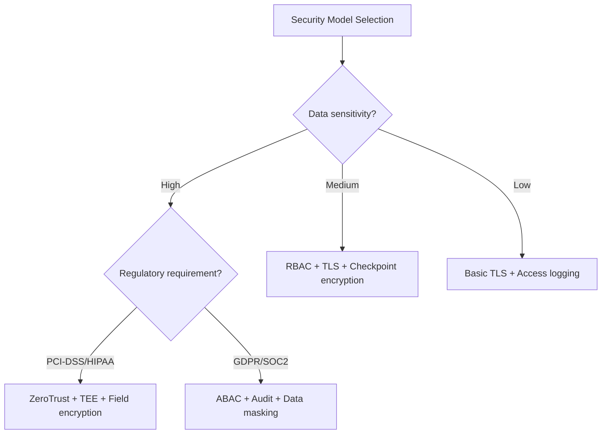

# Streaming Security Model Comparison

> **Language**: English | **Source**: [Knowledge/04-technology-selection/streaming-security-model-comparison.md](../Knowledge/04-technology-selection/streaming-security-model-comparison.md) | **Last Updated**: 2026-04-21

---

## 1. Definitions

### Def-K-04-EN-60-01: Streaming Security Posture

Streaming security posture $\mathcal{S}_{stream}$ is a 7-tuple:

$$
\mathcal{S}_{stream} = \langle \mathcal{A}, \mathcal{T}, \mathcal{D}, \mathcal{C}, \mathcal{I}, \mathcal{E}, \mathcal{R} \rangle
$$

where:

- $\mathcal{A}$: Authentication & Authorization
- $\mathcal{T}$: Transport Security
- $\mathcal{D}$: Data Protection (at-rest + in-transit)
- $\mathcal{C}$: Computation Security
- $\mathcal{I}$: Infrastructure Security
- $\mathcal{E}$: Audit & Compliance
- $\mathcal{R}$: Resilience

**Streaming-specific challenges**:

1. Low-latency constraint: security must not add significant latency
2. Continuous data flow: no clear "processing complete" boundary
3. Multi-tenant sharing: strong isolation required
4. Edge deployment: some operators run in untrusted environments

### Def-K-04-EN-60-02: Security Model Spectrum

Security model spectrum $\mathcal{M}_{sec}$ is a poset:

$$
\mathcal{M}_{sec} = \langle \{\text{RBAC}, \text{ABAC}, \text{ZeroTrust}, \text{HE}, \text{TEE}\}, \sqsubseteq \rangle
$$

where $M_1 \sqsubseteq M_2$ iff $M_2$ defends all threats $M_1$ defends and more.

| Model | Core Mechanism | Trust Boundary | Overhead |
|-------|---------------|----------------|----------|
| RBAC | Static role-based permissions | System boundary | Low |
| ABAC | Dynamic attribute-based policy | Resource-level | Medium |
| ZeroTrust | Continuous verification, least privilege | Every access | Medium-High |
| HE | Computation on ciphertext | None (always encrypted) | Extremely high |
| TEE | Hardware trusted execution | CPU chip-level | Medium |

## 2. Properties

### Prop-K-04-EN-60-01: Security-Performance Tradeoff

Security strength $S$ and processing latency $L$ satisfy:

$$
L \geq L_0 + \sum_{i} \alpha_i \cdot S_i
$$

where $\alpha_i$ is the latency coefficient of security mechanism $i$.

## 3. Engine Security Comparison

| Dimension | Flink | Kafka Streams | RisingWave | Spark |
|-----------|-------|---------------|------------|-------|
| **AuthN** | Kerberos / OAuth2 | SASL/SSL | PostgreSQL protocol | Kerberos |
| **AuthZ** | ACL on state | ACL on topics | RBAC | ACL on tables |
| **Encryption** | TLS (in-flight) + at-rest | TLS (in-flight) | TLS + TDE | TLS + at-rest |
| **Audit** | Checkpoint logs | Kafka audit log | Query audit | Spark history |
| **Isolation** | Task slot + K8s namespace | Process-level | Tenant-level | Executor-level |

## 4. Decision Framework

## References
