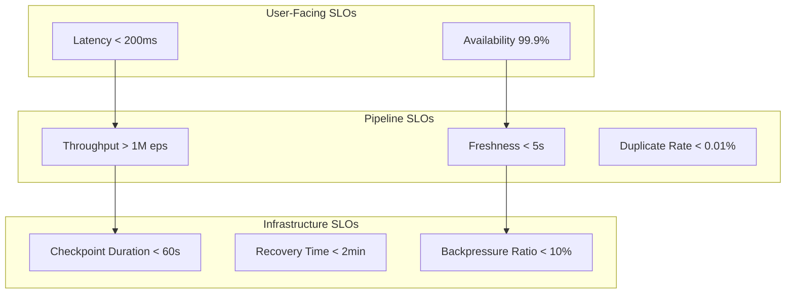

# Streaming SLO/SLI Definition & Reliability Engineering

> **Language**: English | **Source**: [Knowledge/06-frontier/streaming-slo-definition.md](../Knowledge/06-frontier/streaming-slo-definition.md) | **Last Updated**: 2026-04-21

---

## 1. Definitions

### Def-K-06-EN-19: Service Level Indicator (SLI)

A quantitative measure of service quality over observation window $T$:

$$
\text{SLI}_S: T \times \Omega \to \mathbb{R}^+
$$

**Streaming-specific SLIs**:

| SLI | Formula | Target |
|-----|---------|--------|
| **Availability** | $A = \frac{\text{uptime}}{\text{total time}}$ | > 99.9% |
| **Latency** | $L_p = p\text{-th percentile processing latency}$ | p99 < 200ms |
| **Throughput** | $T = \frac{\text{actual records/sec}}{\text{target throughput}}$ | > 95% |
| **Freshness** | $F = t_{now} - t_{last\_event}$ | < 5s |

### Def-K-06-EN-20: Service Level Objective (SLO)

A target value for an SLI over a compliance period:

$$
\text{SLO}: \text{SLI} \geq \theta \quad \text{(or } \leq \theta\text{)}
$$

Example: "99.9% of records are processed within 200ms over a 30-day window."

### Def-K-06-EN-21: Error Budget

The allowable deviation from 100% compliance:

$$
\text{ErrorBudget} = 1 - \text{SLO}_{target}
$$

For a 99.9% SLO, the error budget is 0.1% = 43.2 minutes/month.

## 2. Properties

### Prop-K-06-EN-01: SLI Selection Criteria

Good SLIs must be:

1. **Measurable** — Automated collection without manual intervention
2. **Actionable** — Teams can respond when SLI degrades
3. **Representative** — Correlates with user experience
4. **Understandable** — Stakeholders grasp meaning without deep technical knowledge

### Lemma-K-06-EN-01: Error Budget Exhaustion Theorem

If error budget is exhausted before the compliance period ends, no further risky deployments should be made:

$$
\text{ConsumedBudget}(t) \geq \text{TotalBudget} \Rightarrow \text{FreezeDeployments}(t, T_{end})
$$

## 3. Streaming-Specific SLO Hierarchy

## 4. Example SLOs

### E-commerce Real-Time Recommendation

| SLI | SLO | Measurement |
|-----|-----|-------------|
| p99 latency | < 150ms | Flink metrics API |
| Availability | 99.95% | Health check endpoint |
| Feature freshness | < 3s | Watermark lag metric |
| Recommendation CTR | Baseline ± 5% | A/B testing pipeline |

### Financial Risk Control

| SLI | SLO | Measurement |
|-----|-----|-------------|
| Detection latency | < 50ms | End-to-end tracing |
| False negative rate | < 0.1% | Audit log analysis |
| Rule update propagation | < 30s | Broadcast state metric |
| System availability | 99.99% | Multi-region health checks |

## 5. Error Budget Policy

| Budget Consumption | Action |
|-------------------|--------|
| < 50% | Normal operations, standard deployment velocity |
| 50-75% | Reduce risky changes; increase monitoring |
| 75-100% | Freeze feature deployments; bug fixes only |
| > 100% | Emergency review; SLO renegotiation if needed |

## References
