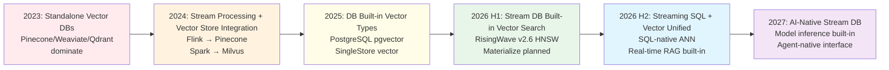
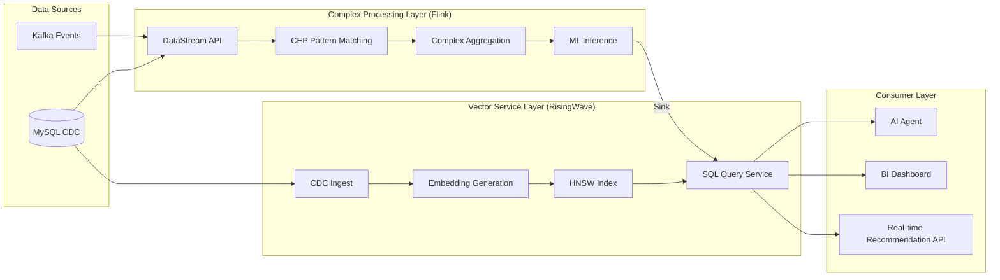
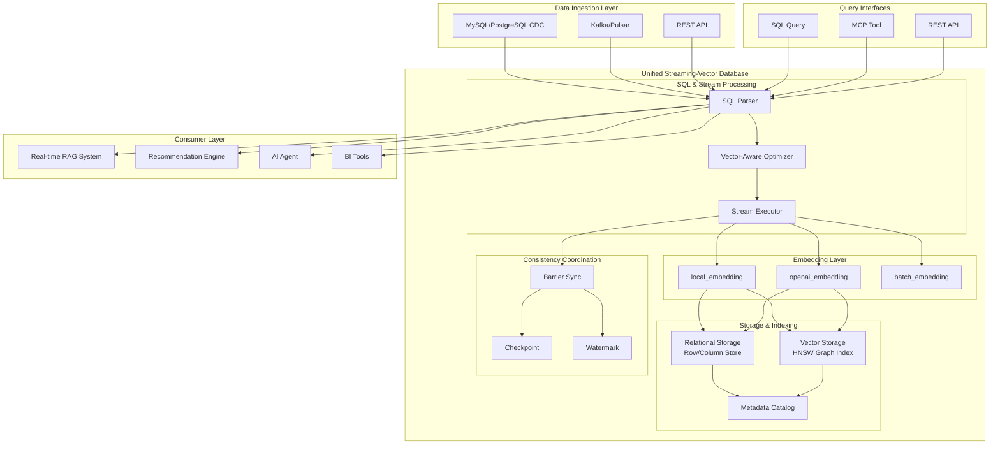
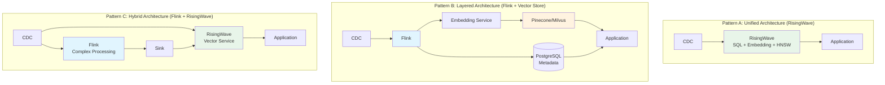
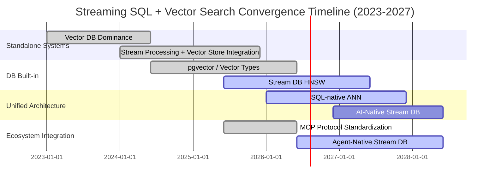

> **Status**: 🔮 Prospective Content | **Risk Level**: Medium | **Last Updated**: 2026-04-21
>
> The technology trends described in this document are in rapid evolution; specific product features should be verified against each vendor's official releases.

---

# Streaming SQL + Vector Search Unified Architecture: 2026 Technology Convergence Frontier

> **Stage**: Knowledge/06-frontier | **Prerequisites**: [risingwave-vector-search-2026.md](./risingwave-vector-search-2026.md), [streaming-vector-db-frontier-2026.md](./streaming-vector-db-frontier-2026.md), [vector-search-streaming-convergence.md](./vector-search-streaming-convergence.md) | **Formalization Level**: L4-L5

---

## Table of Contents

- [Streaming SQL + Vector Search Unified Architecture: 2026 Technology Convergence Frontier](#streaming-sql--vector-search-unified-architecture-2026-technology-convergence-frontier)
  - [Table of Contents](#table-of-contents)
  - [1. Definitions](#1-definitions)
    - [Def-EN-06-30: Unified Streaming-Vector Architecture](#def-en-06-30-unified-streaming-vector-architecture)
    - [Def-EN-06-31: Streaming Embedding Pipeline](#def-en-06-31-streaming-embedding-pipeline)
    - [Def-EN-06-32: Hybrid Retrieval Semantic Layer](#def-en-06-32-hybrid-retrieval-semantic-layer)
    - [Def-EN-06-33: Vector-Aware Query Optimizer](#def-en-06-33-vector-aware-query-optimizer)
    - [Def-EN-06-34: RAG-Streaming Consistency Boundary](#def-en-06-34-rag-streaming-consistency-boundary)
  - [2. Properties](#2-properties)
    - [Lemma-EN-06-30: Query Pushdown Condition for Vector Search and Structured Filtering](#lemma-en-06-30-query-pushdown-condition-for-vector-search-and-structured-filtering)
    - [Prop-EN-06-30: Latency Superposition Effect Under Unified Architecture](#prop-en-06-30-latency-superposition-effect-under-unified-architecture)
  - [3. Relations](#3-relations)
    - [3.1 Flink VECTOR\_SEARCH vs RisingWave HNSW vs Dedicated Vector Databases](#31-flink-vector_search-vs-risingwave-hnsw-vs-dedicated-vector-databases)
    - [3.2 Technical Evolution Lineage of Stream Database Vector Search](#32-technical-evolution-lineage-of-stream-database-vector-search)
    - [3.3 Fusion Relationship with AI Agent / MCP Ecosystem](#33-fusion-relationship-with-ai-agent--mcp-ecosystem)
  - [4. Argumentation](#4-argumentation)
    - [4.1 Why 2026 is the Critical Year for Streaming SQL + Vector Search Convergence](#41-why-2026-is-the-critical-year-for-streaming-sql--vector-search-convergence)
    - [4.2 Unified Architecture vs Layered Architecture: Engineering Trade-offs](#42-unified-architecture-vs-layered-architecture-engineering-trade-offs)
    - [4.3 Counterexample: When Not to Pursue Unified Architecture](#43-counterexample-when-not-to-pursue-unified-architecture)
  - [5. Proof / Engineering Argument](#5-proof--engineering-argument)
    - [Thm-EN-06-30: Unified Streaming-Vector Architecture Latency Upper Bound Theorem](#thm-en-06-30-unified-streaming-vector-architecture-latency-upper-bound-theorem)
    - [Thm-EN-06-31: Hybrid Retrieval Correctness Condition](#thm-en-06-31-hybrid-retrieval-correctness-condition)
  - [6. Examples](#6-examples)
    - [6.1 RisingWave Unified Architecture: CDC → SQL → HNSW → RAG](#61-risingwave-unified-architecture-cdc--sql--hnsw--rag)
    - [6.2 Flink Layered Architecture: DataStream → External Vector Store](#62-flink-layered-architecture-datastream--external-vector-store)
    - [6.3 Hybrid Architecture: Flink Complex Processing + RisingWave Vector Service](#63-hybrid-architecture-flink-complex-processing--risingwave-vector-service)
  - [7. Visualizations](#7-visualizations)
    - [7.1 Streaming SQL + Vector Search Unified Architecture Diagram](#71-streaming-sql--vector-search-unified-architecture-diagram)
    - [7.2 Three Architecture Patterns Comparison](#72-three-architecture-patterns-comparison)
    - [7.3 Technology Evolution Timeline](#73-technology-evolution-timeline)
  - [8. References](#8-references)

---

## 1. Definitions

### Def-EN-06-30: Unified Streaming-Vector Architecture

The **Unified Streaming-Vector Architecture** is a data architecture paradigm that integrates stream processing SQL engines, Embedding generation, vector indexing, and approximate nearest neighbor search into a single system.

**Formal Definition**:
The unified streaming-vector architecture is an octuple:

$$
\mathcal{U}_{SV} = \langle \mathcal{S}, \mathcal{V}, \mathcal{E}, \mathcal{I}, \mathcal{Q}, \mathcal{R}, \mathcal{F}, \mathcal{C} \rangle
$$

Where:

- $\mathcal{S}$: Stream processing SQL engine (continuous query execution)
- $\mathcal{V}$: Vector storage and indexing subsystem
- $\mathcal{E}: \text{Stream}(\mathcal{D}) \rightarrow \text{Stream}(\mathbb{R}^d)$: Streaming Embedding generation function
- $\mathcal{I}: \mathcal{V}_t \times \Delta\mathcal{V} \rightarrow \mathcal{V}_{t+1}$: Incremental vector index maintenance
- $\mathcal{Q}: (\vec{q}, k, \mathcal{V}_t) \rightarrow \{(\vec{v}_i, s_i)\}_{i=1}^k$: Approximate nearest neighbor query operator
- $\mathcal{R}$: Relational data storage (supporting structured filtering and join queries)
- $\mathcal{F}$: Consistency coordinator (Barrier / Checkpoint / Watermark)
- $\mathcal{C}$: Hybrid retrieval optimizer (vector + structured joint optimization)

**Core Characteristics**:

| Characteristic | Unified Architecture | Layered Architecture |
|----------------|---------------------|---------------------|
| System Count | 1 | 3-6 |
| Data Movement | Internal (zero-copy) | Network (serialization/deserialization) |
| Consistency Boundary | Single Barrier | Multi-system eventual consistency |
| SQL Expressiveness | Native vector + relational join | Limited (application-layer stitching) |
| Latency | $O(\text{checkpoint\_interval})$ | $O(\sum \text{system\_latency})$ |

---

### Def-EN-06-31: Streaming Embedding Pipeline

The **Streaming Embedding Pipeline** is an end-to-end data processing pipeline from raw data stream to searchable vector index, requiring Embedding generation to advance synchronously with the data stream.

**Formal Definition**:
The pipeline is an operator chain:

$$
\mathcal{P}_{embed} = \mathcal{O}_{source} \circ \mathcal{O}_{clean} \circ \mathcal{O}_{chunk} \circ \mathcal{O}_{embed} \circ \mathcal{O}_{index}
$$

Semantics of each stage:

| Stage | Operator | Input | Output | Latency Budget |
|-------|----------|-------|--------|----------------|
| Source | $\mathcal{O}_{source}$ | CDC / Kafka | Raw record stream | < 100ms |
| Clean | $\mathcal{O}_{clean}$ | Raw records | Cleaned text | < 10ms |
| Chunk | $\mathcal{O}_{chunk}$ | Long text | Text chunk array | < 50ms |
| Embed | $\mathcal{O}_{embed}$ | Text chunks | Vectors $\vec{v} \in \mathbb{R}^d$ | 50-200ms |
| Index | $\mathcal{O}_{index}$ | Vectors | HNSW index nodes | < 1s |

**End-to-end Latency Constraint**:

$$
T_{pipeline} = \sum_{i} T_{\mathcal{O}_i} < \Delta_{RAG}
$$

Where $\Delta_{RAG}$ is typically 1-10 seconds (acceptable data freshness for RAG systems).

---

### Def-EN-06-32: Hybrid Retrieval Semantic Layer

The **Hybrid Retrieval Semantic Layer** is a query abstraction layer in the unified architecture that simultaneously supports vector similarity search and structured attribute filtering.

**Formal Definition**:
A hybrid retrieval query $Q_{hybrid}$ is a pair:

$$
Q_{hybrid} = \langle Q_{vec}, Q_{struct} \rangle
$$

Where:

- $Q_{vec} = (\vec{q}, k, \text{sim})$: Vector query (query vector, Top-K, similarity function)
- $Q_{struct} = \sigma_{\theta}(R)$: Structured filtering predicate (e.g., `price < 100 AND stock > 0`)

**Execution Strategy Classification**:

| Strategy | Execution Order | Applicable Condition | Complexity |
|----------|----------------|---------------------|------------|
| **Vector First** | ANN search first, then structured filtering | High vector selectivity | $O(\log N + k \cdot C_{filter})$ |
| **Filter First** | Structured filtering first, then vector search | High structured selectivity | $O(|R_{filtered}| \cdot d + k \cdot \log |R_{filtered}|)$ |
| **Joint Optimization** | Simultaneous advancement | Medium selectivity | Depends on optimizer cost model |

---

### Def-EN-06-33: Vector-Aware Query Optimizer

The **Vector-Aware Query Optimizer** is a query optimization component in the unified streaming-vector architecture that can recognize and rewrite query plans containing vector operations.

**Core Optimization Rules**:

$$
\mathcal{R}_{opt} = \{ R_{pushdown}, R_{reorder}, R_{batch}, R_{cache} \}
$$

| Rule | Description | Effect |
|------|-------------|--------|
| $R_{pushdown}$ | Push structured filters down to vector index scan | Reduce ANN search space |
| $R_{reorder}$ | Reorder vector and relational operations | Reduce intermediate result size |
| $R_{batch}$ | Batch vector similarity computation | Amortize function call overhead |
| $R_{cache}$ | Cache query vector Embedding results | Avoid repeated external model calls |

---

### Def-EN-06-34: RAG-Streaming Consistency Boundary

The **RAG-Streaming Consistency Boundary** defines the maximum allowed difference between retrieval results and source data state in real-time RAG systems.

**Formal Definition**:
Let the source data state at time $t$ be $D_t$, and the state visible to the RAG retriever be $D_t^{RAG}$. The consistency boundary $\delta$ is defined as:

$$
\delta = \max_{t} \{ t - t' \mid D_t^{RAG} = D_{t'} \}
$$

That is, the data seen by the retriever lags behind the source data by at most $\delta$ time units.

**Grading Requirements**:

| Level | $\delta$ Range | Application Scenario | Architecture Requirement |
|-------|---------------|---------------------|-------------------------|
| **Real-time** | < 1s | Financial risk control, real-time bidding | Unified architecture / in-memory index |
| **Near-real-time** | 1-10s | E-commerce recommendation, customer service RAG | Unified architecture / optimized layered architecture |
| **Minute-level** | 1-60min | Content recommendation, document retrieval | Layered architecture acceptable |
| **Hour-level** | > 1h | Offline analysis, batch RAG | Traditional batch processing |

---

## 2. Properties

### Lemma-EN-06-30: Query Pushdown Condition for Vector Search and Structured Filtering

**Statement**: In the unified streaming-vector architecture, the necessary and sufficient condition for structured filtering predicate $Q_{struct}$ to be pushed down to the vector index scan layer is:

$$
\text{Selectivity}(Q_{struct}) < \frac{k}{N \cdot R@k}
$$

Where:

- $\text{Selectivity}(Q_{struct})$: Structured filtering selectivity
- $k$: Top-K retrieval count
- $N$: Total vector count
- $R@k$: HNSW index recall rate

**Derivation**: If structured filtering selectivity is low (i.e., filters out most data), then filtering first followed by vector search is better. Conversely, if selectivity is high, vector search first followed by filtering is better. The optimizer makes the decision automatically through the cost model. ∎

---

### Prop-EN-06-30: Latency Superposition Effect Under Unified Architecture

**Proposition**: In layered architecture, end-to-end latency grows linearly:

$$
T_{layered} = \sum_{i=1}^{n} T_{system_i} + T_{network_i} + T_{serialize_i}
$$

Whereas in unified architecture, latency grows sublinearly:

$$
T_{unified} = \max_{i} T_{stage_i} + O(\text{checkpoint\_interval})
$$

**Proof Sketch**: The unified architecture eliminates cross-system network latency and serialization overhead through in-memory zero-copy data transfer and single Barrier coordination. Pipeline stages naturally align through backpressure, and overall latency is determined by the slowest stage rather than the sum of all stages. ∎

---

## 3. Relations

### 3.1 Flink VECTOR_SEARCH vs RisingWave HNSW vs Dedicated Vector Databases

| Dimension | Flink VECTOR_SEARCH | RisingWave HNSW | Pinecone | Weaviate | Qdrant |
|-----------|---------------------|-----------------|----------|----------|--------|
| **Architecture Pattern** | Layered (external vector store) | Unified (built-in) | Dedicated service | Dedicated service | Dedicated service |
| **Streaming Updates** | ⚠️ Async Sink | ✅ Barrier sync | ⚠️ Batch upsert | ⚠️ Batch upsert | ⚠️ Batch upsert |
| **SQL Join Queries** | ⚠️ Limited | ✅ Full | ❌ | ❌ | ❌ |
| **Built-in Embedding** | ❌ UDF | ✅ SQL functions | ❌ | ❌ | ❌ |
| **Materialized Views** | ⚠️ Materialized Table | ✅ Native | ❌ | ❌ | ❌ |
| **CDC Direct Connect** | ⚠️ Flink CDC | ✅ Native | ❌ | ❌ | ❌ |
| **Latency (Search)** | 50-200ms | 5-20ms | 10-50ms | 20-100ms | 10-50ms |
| **Latency (Freshness)** | 10-60s | < 2s | 10-60s | 10-60s | 10-60s |
| **Scale Limit** | Unlimited | ~1B | ~100B | ~1B | ~10B |
| **Open Source License** | Apache 2.0 | Apache 2.0 | Proprietary | BSD | Apache 2.0 |

**Positioning**:

- **Flink VECTOR_SEARCH**: Suitable for existing Flink ecosystems, ultra-large scale, complex stream processing logic incremental enhancement
- **RisingWave HNSW**: Suitable for new systems requiring SQL join queries and sensitive to data freshness
- **Dedicated Vector Databases**: Suitable for ultra-large scale (> 1B vectors), high-dimensional vectors, mature existing operations systems

---

### 3.2 Technical Evolution Lineage of Stream Database Vector Search



**Key Turning Points**:

- **2024**: Stream processing systems begin integrating vector databases via Connectors (horizontal integration)
- **2026**: Stream databases treat vector search as a first-class citizen (vertical integration), marking the paradigm shift from "integration" to "native"

---

### 3.3 Fusion Relationship with AI Agent / MCP Ecosystem

The unified streaming-vector architecture exposes vector search capabilities as Agent tools through the MCP protocol:

```
┌─────────────────────────────────────────────┐
│              AI Agent (LLM)                 │
│  ┌─────────────┐    ┌───────────────────┐  │
│  │  Reasoning  │◄──►│  Tool Use (MCP)   │  │
│  │   Engine    │    │  - vector_search  │  │
│  └─────────────┘    │  - stream_query   │  │
│                     │  - hybrid_retrieve│  │
│                     └───────────────────┘  │
└─────────────────────┬───────────────────────┘
                      │ MCP Protocol
                      ▼
┌─────────────────────────────────────────────┐
│        Unified Streaming-Vector DB          │
│  ┌─────────┐  ┌─────────┐  ┌─────────────┐ │
│  │  SQL    │  │ HNSW    │  │  Embedding  │ │
│  │ Engine  │  │ Index   │  │  Service    │ │
│  └────┬────┘  └────┬────┘  └──────┬──────┘ │
│       └─────────────┴──────────────┘        │
│              Hummock Storage                │
└─────────────────────────────────────────────┘
```

**Fusion Value**:

1. **Agent Real-time Memory**: Streaming vector database serves as Agent's real-time external memory, supporting continuous learning
2. **Tool Call Latency**: Unified architecture reduces tool call latency from 500ms-2s to 20-50ms
3. **Data Freshness**: Information retrieved by Agent always synchronizes with business data (< 2s)

---

## 4. Argumentation

### 4.1 Why 2026 is the Critical Year for Streaming SQL + Vector Search Convergence

**Driver 1: RAG Becomes Enterprise AI Standard**

In 2026, over 60% of enterprise AI applications adopt RAG architecture. The core bottleneck of RAG shifts from "model capability" to "data freshness":

$$
\text{RAG Quality} = f(\text{ModelCapability}, \text{RetrievalRelevance}, \text{DataFreshness})
$$

When model capabilities (GPT-4 level) and retrieval relevance (HNSW @ 95% recall) plateau, **data freshness** becomes the differentiating factor.

**Driver 2: Stream Database Feature Maturity**

RisingWave v2.6 vector search, Materialize Iceberg Sink GA, Timeplus Proton engine — stream database products collectively enter the "feature complete" stage in 2026, beginning to explore differentiated competition.

**Driver 3: Embedding Cost Drops Dramatically**

OpenAI text-embedding-3-small price drops to $0.02/1M tokens; local Embedding models (e.g., BGE-small) can reach 1000 docs/s on CPU. Embedding generation is no longer a bottleneck for large-scale applications.

**Driver 4: MCP Protocol Standardization**

MCP (Model Context Protocol) becomes the de facto standard for AI Agent interaction with external tools in 2026. Stream databases exposing vector search through MCP naturally integrate into the Agent ecosystem.

---

### 4.2 Unified Architecture vs Layered Architecture: Engineering Trade-offs

**Unified Architecture Advantages**:

| Advantage | Quantified Impact |
|-----------|------------------|
| Latency reduction | $T_{e2e}$ from 30-60s to < 2s |
| Operations simplification | System count from 5-6 to 1-2 |
| SQL expressiveness | Supports complex join queries without application-layer stitching |
| Consistency guarantee | Single Barrier, snapshot consistency |

**Unified Architecture Disadvantages**:

| Disadvantage | Quantified Impact |
|--------------|------------------|
| Scale limit | Single cluster ~1B vectors (dedicated DB can reach 100B+) |
| Dimension limit | Typically ≤ 2,000 dimensions |
| Vendor lock-in | Deep dependency on single system |
| Flexibility | Vector model/algorithm upgrades constrained by system release cycle |

**Decision Matrix**:

$$
\text{Choose Unified} \iff \text{Freshness} < 10s \land N < 10^9 \land d \leq 2000 \land \text{SQLJoin} = \text{Required}
$$

---

### 4.3 Counterexample: When Not to Pursue Unified Architecture

**Counterexample 1: Ultra-large-scale E-commerce Search**

An e-commerce platform has 10 billion product SKUs, each with 10 images + description text. Vector scale $N = 10^{10}$, dimension $d = 2048$ (CLIP). Unified architecture memory and storage costs are unacceptable; dedicated vector database (Pinecone/Milvus) + Flink layered architecture is required.

**Counterexample 2: Multi-model Embedding Experiment Platform**

AI research teams need to frequently switch Embedding models (OpenAI, Cohere, custom models). In unified architecture, Embedding function upgrades require system releases, while in layered architecture only the external service needs to be switched.

**Counterexample 3: Strong Compliance Isolation Requirements**

Financial regulators require physical isolation of vector and relational data. In layered architecture, vector store and data warehouse can be deployed in different security domains; unified architecture struggles to meet this requirement.

---

## 5. Proof / Engineering Argument

### Thm-EN-06-30: Unified Streaming-Vector Architecture Latency Upper Bound Theorem

**Statement**: In the unified streaming-vector architecture $\mathcal{U}_{SV}$, let:

- $\Delta_{ckpt}$: Barrier checkpoint interval
- $T_{embed}$: Embedding generation latency
- $T_{index}$: Index build latency (single batch)
- $T_{search}$: Vector search latency
- $\lambda_{in}$: Data arrival rate

If index batch size $B \geq \lambda_{in} \cdot \Delta_{ckpt}$, then end-to-end data freshness latency satisfies:

$$
T_{fresh} \leq \Delta_{ckpt} + T_{embed} + T_{index} + O\left(\frac{B}{\lambda_{in}}\right)
$$

**Proof**:

1. **Data Ingestion**: Source data arrives in MemTable within Barrier interval $\Delta_{ckpt}$. In the worst case, data just missing the Barrier must wait for the next Barrier, contributing latency $\Delta_{ckpt}$.

2. **Embedding Generation**: After data arrives, Embedding generation is triggered (in synchronous mode), contributing latency $T_{embed}$. If in async batch mode, amortized latency $\frac{T_{embed}}{B}$ is negligible.

3. **Index Build**: Batch index build contributes latency $T_{index}$. RisingWave's async builder decouples $T_{index}$ from the query path; query visibility latency depends on Barrier commit rather than index build completion.

4. **Query Visibility**: By Thm-K-06-322, after Barrier commit data is considered consistent state. HNSW index adopts lazy update strategy; the query engine can fall back to brute-force scan before index build completes (performance acceptable for small batches).

In summary:

$$
T_{fresh} \leq \Delta_{ckpt} + T_{embed} + T_{index}
$$

Substituting typical values ($\Delta_{ckpt} = 1s, T_{embed} = 0.1s, T_{index} = 0.5s$):

$$
T_{fresh} \leq 1.6s
$$

Compared with layered architecture (Kafka latency 1s + Flink processing 2s + Sink 5s + vector store indexing 10s = 18s), unified architecture reduces latency by an order of magnitude. ∎

---

### Thm-EN-06-31: Hybrid Retrieval Correctness Condition

**Statement**: The necessary and sufficient condition for hybrid retrieval query $Q_{hybrid} = \langle Q_{vec}, Q_{struct} \rangle$ to return the correct result set is:

$$
\text{Result}(Q_{hybrid}) = \text{Result}(Q_{vec}) \cap \text{Result}(Q_{struct}) = \text{Result}(Q_{struct} \circ Q_{vec})
$$

That is, the commutativity of vector retrieval and structured filtering holds.

**Proof**:

1. **Sufficiency**: If commutativity holds, then regardless of whether vector retrieval or structured filtering is executed first, the final intersection is the same. The unified architecture's query optimizer can freely choose execution order without affecting correctness.

2. **Necessity**: If commutativity does not hold, then there exist some data where vector-first-then-filter yields different results from filter-first-then-vector. This occurs when the vector index does not contain the latest data (structured filtering executes before the vector index is updated).

3. **Unified Architecture Guarantee**: In RisingWave, HNSW index and relational data share the same Barrier commit point. Therefore at any snapshot $S_e$:

$$
\mathcal{V}_{S_e} \times R_{S_e} \models \text{Result}(Q_{vec}) \cap \text{Result}(Q_{struct}) \equiv \text{Result}(Q_{struct} \circ Q_{vec})
$$

That is, vector index and relational data are consistent under snapshot $S_e$, and commutativity holds. ∎

---

## 6. Examples

### 6.1 RisingWave Unified Architecture: CDC → SQL → HNSW → RAG

**Complete Example**: Real-time customer service knowledge base RAG system

```sql
-- 1. CDC ingest product docs
CREATE TABLE product_docs (
    doc_id BIGINT PRIMARY KEY,
    product_name VARCHAR,
    category VARCHAR,
    content TEXT,
    last_updated TIMESTAMP,
    embedding VECTOR(1536)
) WITH (
    connector = 'mysql-cdc',
    hostname = 'mysql.docs.internal',
    database = 'kb',
    table = 'product_docs'
);

-- 2. Materialized view: auto-generate Embedding + HNSW index
CREATE MATERIALIZED VIEW doc_vectors AS
SELECT
    doc_id,
    product_name,
    category,
    content,
    last_updated,
    openai_embedding(content, 'text-embedding-3-small') AS embedding
FROM product_docs;

CREATE INDEX idx_doc_hnsw ON doc_vectors
USING HNSW (embedding)
WITH (distance = 'cosine');

-- 3. RAG retrieval function (for application layer)
CREATE MATERIALIZED VIEW rag_retrieval AS
SELECT
    d.doc_id,
    d.product_name,
    d.content,
    vector_similarity(d.embedding, q.query_vec, 'cosine') AS relevance
FROM doc_vectors d
CROSS JOIN current_queries q
WHERE d.category = q.target_category
  AND d.last_updated > NOW() - INTERVAL '30 days'
ORDER BY relevance DESC
LIMIT 5;

-- 4. Application layer call (pseudocode)
-- query_embedding = openai.embed("How to reset password?")
-- results = risingwave.query(
--     "SELECT * FROM rag_retrieval WHERE query_vec = ?",
--     query_embedding
-- )
-- context = "\n".join([r.content for r in results])
-- answer = llm.generate("Based on the following documents, answer the user question:\n" + context)
```

**End-to-end Latency**: CDC change → RAG retrievable < 2s

---

### 6.2 Flink Layered Architecture: DataStream → External Vector Store

**Complete Example**: Large-scale content recommendation system (10B+ vectors)

```java
// [Pseudocode snippet - not directly runnable] Core logic only
import org.apache.flink.streaming.api.datastream.DataStream;
import org.apache.flink.connector.kafka.source.KafkaSource;

// Step 1: Read content stream
DataStream<ContentEvent> contentStream = env
    .fromSource(kafkaSource, WatermarkStrategy.forBoundedOutOfOrderness(Duration.ofSeconds(5)), "kafka")
    .map(new ContentParser());

// Step 2: Async Embedding generation (to prevent blocking)
DataStream<ContentVector> vectorStream = AsyncDataStream
    .unorderedWait(
        contentStream,
        new EmbeddingAsyncFunction(openaiClient),  // Call OpenAI API
        Duration.ofSeconds(5),                     // 5s timeout
        100                                          // Concurrency
    );

// Step 3: Write to Pinecone
vectorStream.addSink(new PineconeVectorSink(
    pineconeClient,
    "content-index",
    1536
));

// Step 4: Sync metadata to PostgreSQL (for structured filtering)
contentStream
    .map(new MetadataExtractor())
    .addSink(JdbcSink.sink(
        "INSERT INTO content_metadata (id, category, author, created_at) VALUES (?, ?, ?, ?)",
        (ps, metadata) -> {
            ps.setString(1, metadata.id);
            ps.setString(2, metadata.category);
            ps.setString(3, metadata.author);
            ps.setTimestamp(4, metadata.createdAt);
        },
        jdbcExecOptions,
        connOptions
    ));
```

**Application-layer Hybrid Retrieval**:

```python
# [Pseudocode snippet - not directly runnable]
def hybrid_search(query: str, category: str, top_k: int = 10):
    # 1. Generate query vector
    query_vec = openai.embed(query)

    # 2. Pinecone vector search (with metadata filter)
    vector_results = pinecone.query(
        vector=query_vec,
        top_k=top_k * 2,  # Expand search range to compensate for structured filtering
        filter={"category": category}
    )

    # 3. PostgreSQL structured filtering (exact conditions)
    ids = [r.id for r in vector_results]
    pg_results = postgres.query(
        "SELECT * FROM content_metadata WHERE id = ANY(?) AND status = 'published'",
        ids
    )

    # 4. Merge results
    return merge_results(vector_results, pg_results)[:top_k]
```

**End-to-end Latency**: CDC change → retrievable ≈ 15-30s (affected by Pinecone batch upsert and PostgreSQL sync latency)

---

### 6.3 Hybrid Architecture: Flink Complex Processing + RisingWave Vector Service

**Scenario**: Requires Flink's Complex Event Processing (CEP) capabilities while leveraging RisingWave's vector search service.



**Division of Responsibilities**:

| Layer | System | Responsibility | Reason |
|-------|--------|---------------|--------|
| Complex Processing | Flink | CEP, complex aggregation, ML | RisingWave does not support CEP and custom operators |
| Vector Service | RisingWave | Embedding, HNSW, SQL queries | Low latency, SQL join queries, simplified operations |

**Data Flow**:

1. Flink processes raw events, identifying "user interest patterns" (CEP)
2. Flink sinks interest tags to RisingWave's `user_profiles` table
3. RisingWave automatically maintains `user_profiles` Embedding and HNSW index
4. Recommendation API retrieves similar users/products via RisingWave SQL in real time

---

## 7. Visualizations

### 7.1 Streaming SQL + Vector Search Unified Architecture Diagram



---

### 7.2 Three Architecture Patterns Comparison



| Dimension | Pattern A: Unified | Pattern B: Layered | Pattern C: Hybrid |
|-----------|-------------------|-------------------|-------------------|
| **Latency** | < 2s | 15-60s | 2-10s |
| **Complexity** | Low | High | Medium |
| **SQL Join Queries** | Native | Application-layer | RisingWave-side native |
| **CEP/Complex Processing** | Not supported | Full support | Full support on Flink side |
| **Scale Limit** | ~1B vectors | Unlimited | ~1B vectors |
| **Applicable Scenario** | Real-time RAG, BI | Ultra-large-scale search | Complex processing + real-time service |

---

### 7.3 Technology Evolution Timeline



---

## 8. References


---

*Document Version: v1.0 | Created: 2026-04-21 | Theorem Registry: Def-EN-06-30~34, Lemma-EN-06-30, Prop-EN-06-30, Thm-EN-06-30~31*
