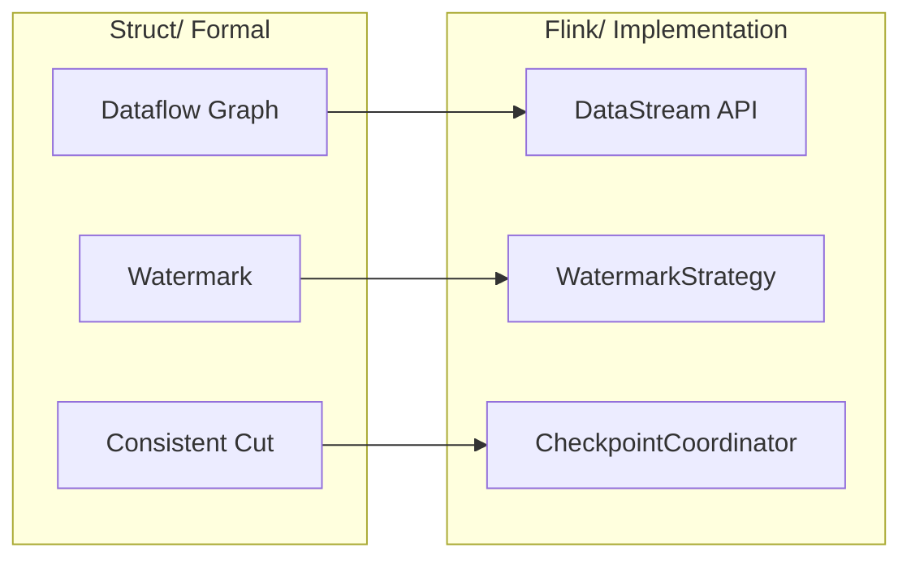

# Struct to Flink Formal Mapping Guide

> **Stage**: Knowledge/05-mapping-guides | **Prerequisites**: [Struct/01-foundation], [Flink/02-core-mechanisms] | **Formal Level**: L4-L5
>
> Mapping from formal theory (Struct/) to Flink implementation: semantic preservation and approximation gaps.

---

## 1. Definitions

**Def-K-05-01: Formal-to-Implementation Mapping**

Partial function from formal domain $\mathcal{F}$ to implementation domain $\mathcal{I}$:

$$
\mathcal{M}: \mathcal{F} \rightharpoonup \mathcal{I}, \quad \mathcal{M}(f) = i
$$

**Def-K-05-02: Semantic Preservation**

Mapping preserves semantics if formal properties hold in implementation:

$$
\forall P \in \text{Properties}(f): P(f) \implies P'(\mathcal{M}(f))
$$

**Def-K-05-03: Implementation Approximation**

Implementation approximates formal model within bounded error:

$$
| \text{behavior}(i) - \text{behavior}(f) | < \epsilon
$$

---

## 2. Properties

**Lemma-K-05-01: Mapping Transitivity**

If $\mathcal{M}_1: A \to B$ and $\mathcal{M}_2: B \to C$ preserve semantics, then $\mathcal{M}_2 \circ \mathcal{M}_1$ preserves semantics.

**Lemma-K-05-02: Theory Preservation**

Core theorems in Struct/ have corresponding guarantees in Flink/.

---

## 3. Relations

**Key Mappings**:

| Formal Concept | Flink Implementation |
|----------------|---------------------|
| Dataflow Graph | DataStream API |
| Watermark Monotonicity | WatermarkStrategy |
| Checkpoint Barrier | CheckpointCoordinator |
| Consistent Cut | Global Snapshot |
| Exactly-Once | 2PC + Replayable Source |
| Actor Model | Flink Actor Runtime |
| Type Safety | TypeInformation System |

---

## 4. Argumentation

**Correctness of Mappings**:

| Mapping | Preserved? | Gap |
|---------|-----------|-----|
| Dataflow → DataStream | ✓ | None |
| Watermark → Strategy | ✓ | Clock skew |
| Checkpoint → Coordinator | ✓ | Network delay |
| Exactly-Once → 2PC | Approximate | Timeout edge case |

**Approximation Gaps**:

- Formal model assumes synchronous communication; Flink is async
- Formal model has infinite precision; Flink uses floating-point
- Formal model assumes perfect clocks; Flink handles clock skew

---

## 5. Engineering Argument

**Thm-K-05-01 (Core Mapping Semantic Preservation)**: The seven core mappings from Struct/ to Flink/ preserve semantics modulo implementation approximation bounds.

---

## 6. Examples

**WordCount Mapping**:

```
Formal:    map(split) → groupBy(word) → count
Flink:     flatMap(tokenize) → keyBy(word) → sum(1)
```

**Event Time Window Mapping**:

```
Formal:    Window_{[t, t+T)}(S) = {e ∈ S | t ≤ t_event(e) < t+T}
Flink:     .window(TumblingEventTimeWindows.of(Time.minutes(5)))
```

---

## 7. Visualizations

**Mapping Overview**:



---

## 8. References
