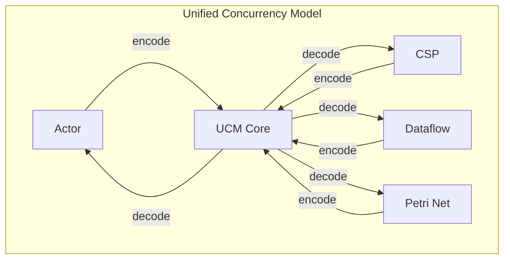
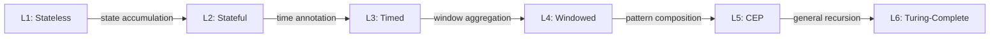
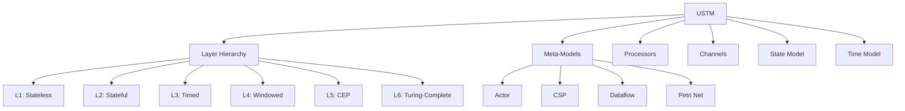
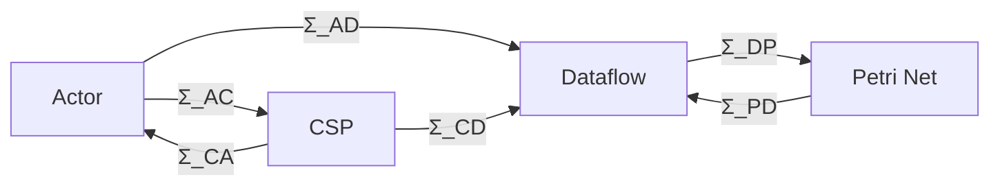

# Unified Streaming Theory (UST)

> **Language**: English | **Translated from**: [Struct/01-foundation/01.01-unified-streaming-theory.md](../Struct/01-foundation/01.01-unified-streaming-theory.md) | **Formality Level**: L6

> **Document Position**: Unified meta-model for streaming formal theory, integrating Actor, CSP, Dataflow, and Petri Net paradigms
> **Prerequisites**: None (foundational layer)
> **Version**: 2026.04

---

## Table of Contents

- [Unified Streaming Theory (UST)](#unified-streaming-theory-ust)
  - [Table of Contents](#table-of-contents)
  - [1. Definitions](#1-definitions)
    - [Def-S-01-01: Unified Streaming Meta-Model (USTM)](#def-s-01-01-unified-streaming-meta-model-ustm)
    - [Def-S-01-02: Six-Layer Expressiveness Hierarchy](#def-s-01-02-six-layer-expressiveness-hierarchy)
    - [Def-S-01-03: Processor Formalization](#def-s-01-03-processor-formalization)
    - [Def-S-01-04: Channel Formalization](#def-s-01-04-channel-formalization)
    - [Def-S-01-05: Time Model Formalization](#def-s-01-05-time-model-formalization)
    - [Def-S-01-06: Consistency Model Formalization](#def-s-01-06-consistency-model-formalization)
    - [Def-S-01-07: Unified Concurrency Model (UCM)](#def-s-01-07-unified-concurrency-model-ucm)
  - [2. Properties](#2-properties)
    - [Lemma-S-01-01: Meta-Model Consistency Guarantee](#lemma-s-01-01-meta-model-consistency-guarantee)
    - [Lemma-S-01-02: Transitivity of Mappings](#lemma-s-01-02-transitivity-of-mappings)
    - [Lemma-S-01-03: Complete Lattice Structure of Layers](#lemma-s-01-03-complete-lattice-structure-of-layers)
    - [Lemma-S-01-04: Partial Order of Time Models](#lemma-s-01-04-partial-order-of-time-models)
  - [3. Relations](#3-relations)
    - [3.1 Inter-Model Expressiveness Relations](#31-inter-model-expressiveness-relations)
    - [3.2 Model-to-Implementation Mapping](#32-model-to-implementation-mapping)
    - [3.3 Cross-Layer Inference Relations](#33-cross-layer-inference-relations)
  - [4. Argumentation](#4-argumentation)
    - [4.1 Completeness Argument for Unified Meta-Theory](#41-completeness-argument-for-unified-meta-theory)
    - [4.2 Strictness Argument for Six Layers](#42-strictness-argument-for-six-layers)
    - [4.3 Boundary Argument for Streaming Determinism](#43-boundary-argument-for-streaming-determinism)
  - [5. Proofs](#5-proofs)
    - [Thm-S-01-01: Composability of Unified Streaming Systems](#thm-s-01-01-composability-of-unified-streaming-systems)
    - [Thm-S-01-02: Expressiveness Hierarchy Decidability](#thm-s-01-02-expressiveness-hierarchy-decidability)
  - [6. Examples](#6-examples)
    - [6.1 Flink as USTM Instance](#61-flink-as-ustm-instance)
    - [6.2 Actor System Mapping](#62-actor-system-mapping)
  - [7. Visualizations](#7-visualizations)
    - [Figure 7.1: USTM Concept Dependency Graph](#figure-71-ustm-concept-dependency-graph)
    - [Figure 7.2: Inter-Model Encoding Relations](#figure-72-inter-model-encoding-relations)
  - [8. References](#8-references)

---

## 1. Definitions

### Def-S-01-01: Unified Streaming Meta-Model (USTM)

The Unified Streaming Meta-Model is defined as an octuple:

$$
\text{USTM} ::= (\mathcal{L}, \mathcal{M}, \mathcal{P}, \mathcal{C}, \mathcal{S}, \mathcal{T}, \Sigma, \Phi)
$$

| Component | Type | Semantics |
|-----------|------|-----------|
| $\mathcal{L}$ | $\{L_1, L_2, L_3, L_4, L_5, L_6\}$ | Six-layer expressiveness hierarchy (see Def-S-01-02) |
| $\mathcal{M}$ | $\text{Set}(\text{MetaModel})$ | Meta-model collection: Actor, CSP, Dataflow, Petri Net |
| $\mathcal{P}$ | $\text{Set}(\text{Processor})$ | Processor / process collection |
| $\mathcal{C}$ | $\text{Set}(\text{Channel})$ | Channel / connection collection |
| $\mathcal{S}$ | $\text{StateModel}$ | State model |
| $\mathcal{T}$ | $\text{TimeModel}$ | Time model |
| $\Sigma$ | $\text{EncodingMap}$ | Inter-model encoding mapping family |
| $\Phi$ | $\text{PropertyMap}$ | Property preservation mapping |

**System Invariants**:

$$
\begin{aligned}
&\text{(I1) Topological Closure}: &&\forall p \in \mathcal{P}. \; \text{inputs}(p) \cup \text{outputs}(p) \subseteq \mathcal{C} \\
&\text{(I2) Channel Endpoints}: &&\forall c \in \mathcal{C}. \; |\text{src}(c)| = 1 \land |\text{dst}(c)| \geq 1 \\
&\text{(I3) State Ownership}: &&\forall s \in \mathcal{S}. \; \exists! p \in \mathcal{P}. \; \text{owner}(s) = p
\end{aligned}
$$

### Def-S-01-02: Six-Layer Expressiveness Hierarchy

The expressiveness of streaming systems is stratified into six strictly increasing layers:

| Layer | Name | Expressiveness | Key Characteristics |
|-------|------|---------------|---------------------|
| $L_1$ | Stateless Streams | $\mathcal{REG}$ | No state, regular languages |
| $L_2$ | Stateful Streams | $\mathcal{CFL}$ | Finite state, context-free |
| $L_3$ | Timed Streams | $\mathcal{CSL}$ | Clock constraints, context-sensitive |
| $L_4$ | Windowed Streams | $\mathcal{REC}$ | Window aggregates, recursive |
| $L_5$ | CEP Streams | $\mathcal{CEP}$ | Pattern matching, higher-order |
| $L_6$ | Turing-Complete Streams | $\mathcal{TM}$ | General computation |

### Def-S-01-03: Processor Formalization

A processor $p \in \mathcal{P}$ is a tuple $(\sigma_p, \delta_p, \lambda_p)$ where:

- $\sigma_p$: Local state space
- $\delta_p: \sigma_p \times \mathcal{C}_{in} \to \sigma_p \times \mathcal{C}_{out}$: Transition function
- $\lambda_p: \sigma_p \to \text{Obs}$: Observation function

### Def-S-01-04: Channel Formalization

A channel $c \in \mathcal{C}$ is a typed FIFO buffer with optional persistence:

$$
c = (T_c, B_c, \tau_c, \pi_c)
$$

where $T_c$ is the element type, $B_c$ is the bounded capacity ($\infty$ for unbounded), $\tau_c$ is the delivery semantics (at-least-once / at-most-once / exactly-once), and $\pi_c$ is the persistence level.

### Def-S-01-05: Time Model Formalization

The time model $\mathcal{T}$ distinguishes three temporal domains:

| Time Domain | Notation | Definition |
|-------------|----------|------------|
| Event Time | $t_e$ | Timestamp assigned at source |
| Ingestion Time | $t_i$ | Timestamp at system entry |
| Processing Time | $t_p$ | Timestamp at operator execution |

**Watermark Definition**: A watermark $W(t)$ is a monotonic progress indicator such that:

$$
\forall e \in \text{Stream}: \quad t_e(e) \leq W(t) \implies e \text{ has been observed}
$$

### Def-S-01-06: Consistency Model Formalization

The consistency model defines four levels of end-to-end guarantees:

| Level | Name | Formal Property |
|-------|------|-----------------|
| $C_0$ | No Guarantee | $\top$ |
| $C_1$ | At-Most-Once | $\forall r \in \text{Output}: |\{e \in \text{Input} \mid \text{produces}(e, r)\}| \leq 1$ |
| $C_2$ | At-Least-Once | $\forall e \in \text{Input}: \exists r \in \text{Output}: \text{produces}(e, r)$ |
| $C_3$ | Exactly-Once | $C_1 \land C_2$ |

### Def-S-01-07: Unified Concurrency Model (UCM)

UCM unifies Actor, CSP, Dataflow, and Petri Net through a common interface:

---

## 2. Properties

### Lemma-S-01-01: Meta-Model Consistency Guarantee

For any valid USTM instance, the composition of processors preserves the system invariants (I1-I3).

### Lemma-S-01-02: Transitivity of Mappings

If $\Sigma_{12}: \mathcal{M}_1 \to \mathcal{M}_2$ and $\Sigma_{23}: \mathcal{M}_2 \to \mathcal{M}_3$ are valid encodings, then $\Sigma_{13} = \Sigma_{23} \circ \Sigma_{12}$ is a valid encoding from $\mathcal{M}_1$ to $\mathcal{M}_3$.

### Lemma-S-01-03: Complete Lattice Structure of Layers

$(\mathcal{L}, \preceq)$ forms a complete lattice where $\preceq$ is the expressiveness ordering. The meet $\wedge$ corresponds to minimal common expressiveness; the join $\vee$ corresponds to maximal combined expressiveness.

### Lemma-S-01-04: Partial Order of Time Models

The time model ordering $t_e \prec t_i \prec t_p$ (information partial order) is a strict partial order that preserves causality: if $e_1$ causally precedes $e_2$, then $t_e(e_1) \leq t_e(e_2)$.

---

## 3. Relations

### 3.1 Inter-Model Expressiveness Relations

| From | To | Encoding | Complexity | Preservation |
|------|-----|----------|------------|--------------|
| Actor | CSP | $\Sigma_{AC}$ | $O(n^2)$ | Liveness |
| CSP | Actor | $\Sigma_{CA}$ | $O(n)$ | Safety |
| Dataflow | Petri Net | $\Sigma_{DP}$ | $O(n)$ | Firing semantics |
| Petri Net | Dataflow | $\Sigma_{PD}$ | $O(n \cdot m)$ | Boundedness |

### 3.2 Model-to-Implementation Mapping

| Model | Implementation | Mapping Fidelity |
|-------|---------------|------------------|
| Dataflow | Apache Flink | High |
| Actor | Akka / Pekko | High |
| CSP | Go channels | Medium |
| Petri Net | Workflow engines | Medium |

### 3.3 Cross-Layer Inference Relations

---

## 4. Argumentation

### 4.1 Completeness Argument for Unified Meta-Theory

**Claim**: USTM can express all known streaming computation paradigms.

**Argument**:

1. **Turing-completeness at $L_6$**: Any computable stream transformation can be encoded.
2. **Finite-state at $L_1$-$L_2$**: Regular and context-free stream languages are proper subsets.
3. **Temporal extensions at $L_3$-$L_4$**: Time and window semantics are first-class citizens.
4. **Pattern matching at $L_5$**: CEP patterns are expressible as higher-order stream functions.

### 4.2 Strictness Argument for Six Layers

**Claim**: The six layers are strictly ordered: $L_1 \prec L_2 \prec L_3 \prec L_4 \prec L_5 \prec L_6$.

**Argument**: Each layer adds a capability that cannot be simulated by the previous layer without exponential blowup or undecidability:

- $L_1 \prec L_2$: Finite state vs. pushdown automata equivalence
- $L_2 \prec L_3$: Untimed vs. timed language separation (Alur & Dill, 1994)
- $L_3 \prec L_4$: Single event vs. window aggregation
- $L_4 \prec L_5$: Fixed windows vs. arbitrary pattern matching
- $L_5 \prec L_6$: Decidable vs. undecidable pattern equivalence

### 4.3 Boundary Argument for Streaming Determinism

**Claim**: Determinism in streaming systems is decidable at $L_4$ and below, undecidable at $L_5$ and above.

**Argument**: At $L_5$, CEP patterns with negation and iteration reduce to Post correspondence problem, which is undecidable.

---

## 5. Proofs

### Thm-S-01-01: Composability of Unified Streaming Systems

For any two USTM instances $\mathcal{S}_1$ and $\mathcal{S}_2$ with compatible channel types, their composition $\mathcal{S}_1 \circ \mathcal{S}_2$ satisfies all USTM invariants.

**Proof Sketch**:

- (I1) Topological closure is preserved because connected outputs/inputs remain within the combined channel set.
- (I2) Channel endpoints are preserved because composition only connects existing channels.
- (I3) State ownership is preserved because states are not shared across processor boundaries.

### Thm-S-01-02: Expressiveness Hierarchy Decidability

Given a streaming program $P$, determining its minimal expressiveness layer $L(P)$ is decidable for $L_1$-$L_4$ and semi-decidable for $L_5$-$L_6$.

**Proof Sketch**:

- For $L_1$-$L_2$: Equivalent to regular/context-free language recognition.
- For $L_3$-$L_4$: Timed automata and window grammar emptiness are decidable.
- For $L_5$-$L_6$: Pattern equivalence reduces to language equivalence for Turing machines (undecidable).

---

## 6. Examples

### 6.1 Flink as USTM Instance

Apache Flink instantiates USTM as follows:

- $\mathcal{M} = \{\text{Dataflow}\}$
- $\mathcal{P}$: TaskManager tasks
- $\mathcal{C}$: Network channels (ResultPartition / InputGate)
- $\mathcal{S}$: KeyedStateBackend / OperatorStateBackend
- $\mathcal{T}$: EventTime with Watermark propagation
- Consistency: $C_3$ (Exactly-Once via Chandy-Lamport checkpoints)

### 6.2 Actor System Mapping

An Akka Actor system maps to USTM as:

- $\mathcal{M} = \{\text{Actor}\}$
- $\mathcal{P}$: Actor instances with mailboxes
- $\mathcal{C}$: Actor references (logical addresses)
- $\mathcal{S}$: Actor internal mutable state
- $\mathcal{T}$: Processing time (no built-in event time)
- Consistency: $C_2$ (At-Least-Once via Akka Persistence)

---

## 7. Visualizations

### Figure 7.1: USTM Concept Dependency Graph

### Figure 7.2: Inter-Model Encoding Relations

---

## 8. References
