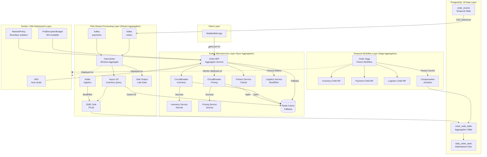
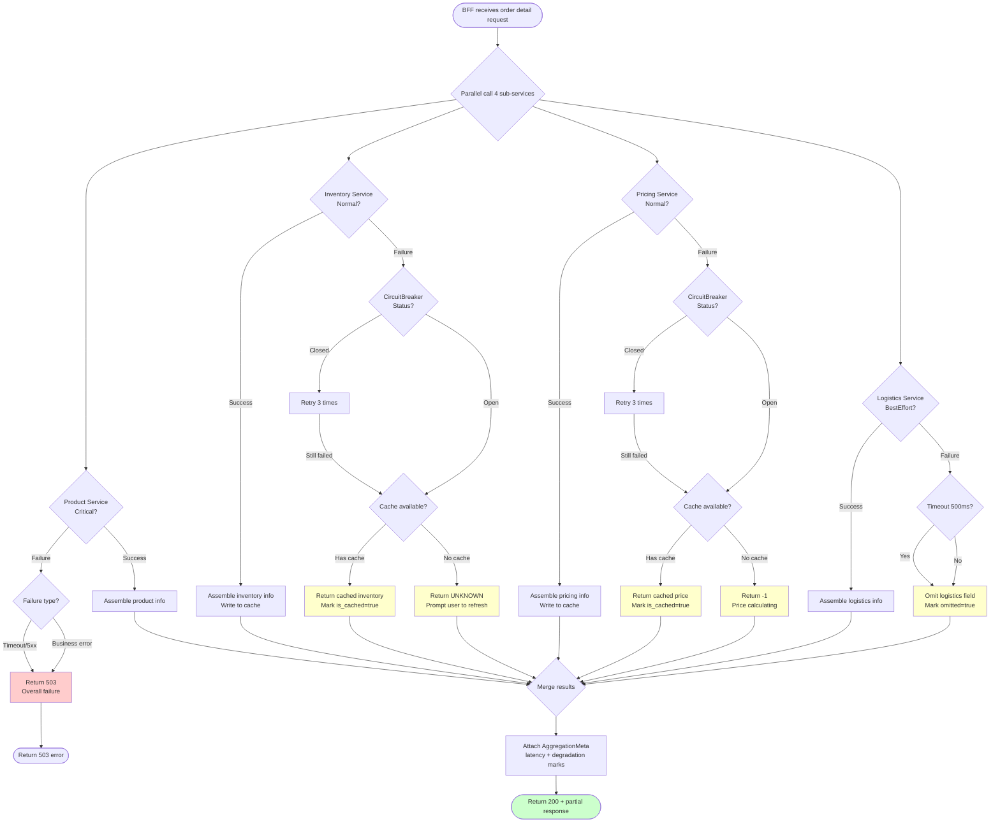

# Aggregator / Composite Pattern Design and Resilience in the Five-Technology Stack

> **Stage**: TECH-STACK | **Prerequisites**: [Chinese source](../TECH-STACK-STREAMING-POSTGRES-TEMPORAL-KRATOS/01-system-composition/01.04-aggregation-patterns.md) | **Formalization Level**: L4 | **Last Updated**: 2026-04-22

## 1. Definitions

In the Streaming × PostgreSQL 18 × Temporal × Kratos × Docker/K8s five-technology stack combination, the Aggregator Pattern and Composite Pattern are the core constructs connecting atomic components and building high-level business semantics. The following definitions are strictly limited to the context of this combined technology stack.

**Def-TS-01-04-01 (Aggregator Service)**

> An aggregator service is a service component located upstream in the call chain, whose responsibility is to issue concurrent or serial requests to one or more downstream atomic services (or data sources), and fuse multiple partial result sets into a single, complete business response according to predefined combination rules (Combinator). In the five-technology stack, an Aggregator can be implemented by Kratos BFF layer for synchronous aggregation, by Flink operators for stream aggregation, or by Temporal Workflow for asynchronous Saga result consolidation.

Intuitively, the Aggregator is the logical vertex of a "fan-in" structure: it converges multi-channel information from the distributed system into a unified view required by the client. Unlike a simple Proxy, the Aggregator must understand business semantics and bear the responsibilities of result filtering, field mapping, conflict resolution, and consistency reconciliation.

**Def-TS-01-04-02 (Composite Service)**

> A composite service is a logical unit composed of two or more atomic services through explicit composition relationships, exposing a single service contract externally. Composite services emphasize a "whole-part" hierarchical structure: a composite service itself can become a component of a larger composite service (recursive composition). In the five-technology stack, a Composite can be an aggregated facade of a Kratos microservice cluster, a parent workflow composed of multiple Child Workflows in Temporal, or a virtual reporting layer jointly composed of multiple materialized views in PostgreSQL 18.

The key difference between Aggregator and Composite is: Aggregator emphasizes **runtime request merging and response assembly**; Composite emphasizes **design-time service unit hierarchical encapsulation and contract abstraction**. The two often coexist in practice: a Composite service may contain multiple Aggregator nodes internally.

**Def-TS-01-04-03 (Aggregation Boundary)**

> The aggregation boundary is an explicit interface and contract collection that delimits the scope of aggregator service responsibilities and the set of sub-services it depends on. The aggregation boundary contains three elements: (1) Input contract—the API specification exposed by the Aggregator upstream; (2) Output contract—the call specification of the Aggregator to downstream sub-services; (3) Consistency contract—the result quality level promised by the Aggregator when partial sub-services are unavailable or delayed (complete response / partial response / degraded response / failure response).

In the five-technology stack, aggregation boundaries take various forms: in Kratos, boundaries are delineated through Protobuf/gRPC `service` definitions and `middleware` chains; in Flink, through `DataStream`'s `keyBy` and `window` operators delineating time-space boundaries; in Temporal, through Workflow interface definitions and Query Handlers delineating logical boundaries; in PostgreSQL 18, through `SECURITY DEFINER` views and row-level security policies (RLS) delineating data boundaries; in Docker/K8s, through `NetworkPolicy` and `Service` resources delineating network boundaries.

**Def-TS-01-04-04 (Aggregation Consistency)**

> Aggregation consistency is the property that aggregated results still satisfy business semantic correctness in scenarios of partial sub-service failure, network partition, or data delay. Formally, let aggregator service $A$ depend on sub-service set $S = \{s_1, s_2, \ldots, s_n\}$, and $A$'s response be $R_A = f(R_{s_1}, R_{s_2}, \ldots, R_{s_n})$, where $f$ is the combination function. If subset $S_{fail} \subset S$ is unavailable, the Aggregator returns $R'_A = f(R_{s_i} | s_i \in S \setminus S_{fail}, d_j | s_j \in S_{fail})$, where $d_j$ is degraded data (cache/default/empty). Aggregation consistency requires $R'_A$ to satisfy business invariant $Inv(R'_A)$, and deviation measure $Dev(R'_A, R_A) \leq \epsilon_{biz}$, where $\epsilon_{biz}$ is the business tolerance threshold.

Aggregation consistency is not the strong consistency in the CAP theorem, but rather a **business-oriented weak consistency guarantee**. In e-commerce scenarios, aggregation consistency allows the product detail page to display "inventory unknown" rather than directly returning 503 when the inventory service is temporarily unavailable, provided the frontend UI can gracefully handle this state.

## 2. Properties

From the above definitions, the following key resilience properties of aggregator services in distributed environments can be directly derived.

**Prop-TS-01-04-01 (Aggregator Single Point of Failure Risk)**

> Let aggregator service $A$ synchronously depend on $n$ independent sub-services $s_1, \ldots, s_n$, each with availability $p_i$. If $A$ is not configured with any degradation strategy (i.e., all sub-services must return successfully), then $A$'s availability $P_A$ satisfies:
> $$P_A = \prod_{i=1}^{n} p_i$$
> In particular, if all $p_i = p$, then $P_A = p^n$. When $n \geq 3$ and $p = 0.999$ ("three nines"), $P_A \approx 0.997$, making the Aggregator a de facto availability bottleneck.

*Engineering Corollary*: Before introducing circuit breaker, degradation, or caching mechanisms, the Aggregator is an "amplifier of the shortest board" of system availability. Each additional synchronous dependency causes overall availability to decay exponentially. This property is the theoretical basis for why all Aggregator implementations in the five-technology stack must be configured with resilience mechanisms.

**Lemma-TS-01-04-01 (Timeout Cascade Effect)**

> Let aggregator service $A$ call $n$ sub-services in parallel, each with timeout $T_i$. If $A$'s upstream timeout is $T_{upstream}$ and $A$'s own processing overhead is $\delta$ (including serialization, deserialization, combination logic), then a necessary condition for $A$ to successfully complete a full response is:
> $$\max_{i \in [1,n]} T_i + \delta \leq T_{upstream}$$
> Furthermore, if any sub-service $s_k$ has no explicit timeout configured (i.e., $T_k \to \infty$), then $A$'s expected response time $E[T_A]$ is unbounded:
> $$E[T_A] \geq P(s_k\ \text{hangs}) \cdot \infty = \infty$$
> Even if the probability of $s_k$ hanging is extremely small, the expected response time still diverges.

*Engineering Corollary*: Timeout cascade is one of the most insidious failure patterns in microservice systems. In the five-technology stack, Kratos must configure gRPC/HTTP client timeouts; Temporal Workflow must set `StartToCloseTimeout`; Flink operators must configure `AsyncFunction` timeout and capacity limits; PostgreSQL connections must set `statement_timeout`; K8s probes must set reasonable `timeoutSeconds`. Missing timeout configuration on any link will cause the aggregator service to become a "waiting black hole."

**Prop-TS-01-04-02 (Aggregation Consistency Preservation Under Partial Response)**

> Let aggregator service $A$ adopt degradation strategy $d_j$ (cache value $c_j$ or default value $def_j$) for failed sub-service $s_j$. Define data freshness measure $\phi(c_j) = 1 - e^{-\lambda (t_{now} - t_{cache})}$, where $\lambda$ is the business timeliness decay coefficient. Then the degraded response $R'_A$ satisfies aggregation consistency iff:
> $$\forall s_j \in S_{fail}:\ \phi(c_j) \geq \phi_{min} \quad \text{or} \quad Inv(R'_A, def_j) = \text{true}$$
> where $Inv$ is the business invariant judgment function and $\phi_{min}$ is the minimum acceptable freshness threshold.

*Engineering Corollary*: Partial response is not a "second-best option," but rather a **quantifiable quality guarantee**. In the five-technology stack, PostgreSQL 18's materialized views can serve as an aggregation cache layer; Kratos's `middleware` can inject Redis cache fallback; Flink's `AsyncLookupFunction` can configure `maxRetry` and `cache`; Temporal's Query Handler can return Workflow state snapshots. All degradation strategies must explicitly declare their consistency level and data timeliness boundary.

## 3. Relations

### 3.1 Aggregator and Kratos Microservices Architecture Relationship

In the Kratos microservices framework, the Aggregator typically exists as a **BFF (Backend for Frontend)** layer or **API Gateway** extension. Its relationship characteristics are:

- **Call relationship**: The Aggregator initiates calls to multiple downstream `service`s through Kratos `transport/grpc` or `transport/http` clients.
- **Middleware chain relationship**: Kratos's `middleware` mechanism (e.g., `logging`, `metrics`, `validate`, `circuit breaker`) naturally constitutes cross-cutting concerns of the aggregation boundary.
- **Service discovery relationship**: The Aggregator depends on Kratos's built-in `registry` (etcd/Consul/Nacos) to dynamically resolve downstream service addresses, and the aggregation boundary dynamically scales with the service registry changes.

### 3.2 Aggregator and Flink Stream Processing Relationship

At the stream computing layer, the Aggregator is not an independent service, but a logical combination of a set of **distributed operators**:

- **Window Aggregation**: `keyBy → window → aggregate` aggregates multiple records of the same key within a time dimension into a single result.
- **Stream Join**: `DataStream.join(DataStream)` or `coGroup` implements association aggregation of dual/multi-streams.
- **Async I/O**: `AsyncFunction` allows operators to asynchronously query external services (e.g., Kratos gRPC services), embedding request-response patterns into the stream processing topology.

Flink's Aggregator and Kratos's Aggregator have a **hierarchical mapping**: the former handles time-window aggregation of unbounded data streams, while the latter handles service call aggregation of bounded request-response. The two can be bridged through Async I/O.

### 3.3 Aggregator and Temporal Workflow Relationship

Aggregation in Temporal is achieved through **Workflow Composition**:

- **Child Workflow**: Parent Workflow launches multiple Child Workflows, waiting for results to converge through `Promise.all` or `Promise.any`.
- **Saga Aggregation**: Compensation results of long-transaction Saga need to be consolidated at the Aggregator layer to determine the overall transaction state (commit/rollback/partial commit).
- **Query Handler**: Temporal Workflow's Query Handler can expose aggregated state snapshots externally, achieving visibility of the "aggregation in progress" intermediate state.

The key difference between Temporal Aggregator and Kratos/Flink Aggregator is **time scale**: Temporal aggregation may span seconds, minutes, or even hours, while Kratos/Flink aggregation is typically completed within milliseconds to seconds.

### 3.4 Aggregator and PostgreSQL 18 Relationship

PostgreSQL 18 plays the role of **persistent cache and state anchor** in the aggregation pattern:

- **Materialized View**: Pre-aggregates query results as a degraded data source for the Aggregator.
- **Logical Replication**: CDC streams synchronize aggregation results to Kafka/Flink, forming a closed loop of "write-time aggregation, read-time streaming distribution."
- **RETURNING OLD/NEW**: Single-statement retrieval of UPDATE before/after values simplifies aggregation incremental computation.
- **Temporal WITHOUT OVERLAPS**: Temporal table constraints ensure time disjointness of aggregation historical records, preventing duplicate counting caused by time window overlaps.

### 3.5 Aggregator and Docker/K8s Deployment Layer Relationship

At the deployment layer, Aggregator resilience is guaranteed through container orchestration mechanisms:

- **HPA (Horizontal Pod Autoscaler)**: Automatically scales Aggregator Pod replicas based on CPU/custom metrics (e.g., pending request queue length).
- **Pod Disruption Budget**: Ensures the aggregation service maintains minimum available replicas during rolling updates.
- **NetworkPolicy**: Restricts the Aggregator to only access downstream services within its aggregation boundary, preventing network-level out-of-bound dependencies.

## 4. Argumentation

### 4.1 Multi-Kratos Microservice Result Aggregation Pattern

In Kratos, multi-service aggregation typically adopts the **parallel scatter-gather** pattern. The following analyzes its typical implementation paths:

**Pattern A: BFF Layer Synchronous Aggregation**

The BFF service receives frontend requests and concurrently calls multiple downstream Kratos services through `errgroup` or `ant` concurrency libraries:

```go
func (s *OrderAggregator) GetOrderDetail(ctx context.Context, req *pb.OrderRequest) (*pb.OrderDetail, error) {
    g, ctx := errgroup.WithContext(ctx)

    var product *pb.ProductInfo
    var inventory *pb.InventoryStatus
    var pricing *pb.PriceInfo
    var logistics *pb.LogisticsStatus

    g.Go(func() error {
        var err error
        product, err = s.productClient.GetProduct(ctx, req.ProductId)
        return err
    })
    g.Go(func() error {
        var err error
        inventory, err = s.inventoryClient.CheckStock(ctx, req.ProductId)
        return err
    })
    g.Go(func() error {
        var err error
        pricing, err = s.pricingClient.GetPrice(ctx, req.ProductId, req.UserId)
        return err
    })
    g.Go(func() error {
        var err error
        logistics, err = s.logisticsClient.GetStatus(ctx, req.OrderId)
        return err
    })

    if err := g.Wait(); err != nil {
        return nil, err // Hard failure: any service error causes overall failure
    }

    return composeOrderDetail(product, inventory, pricing, logistics), nil
}
```

The above implementation is a "hard aggregation": failure of any sub-service causes overall failure, and its availability satisfies $P_A = p^4$ (Prop-TS-01-04-01), which is unacceptable in production environments.

**Pattern B: Resilient Aggregation with Circuit Breaker and Degradation**

After introducing Resilience4j (or Kratos ecosystem's `middleware/circuitbreaker`), the aggregation logic evolves to:

```go
func (s *OrderAggregator) GetOrderDetailResilient(ctx context.Context, req *pb.OrderRequest) (*pb.OrderDetail, error) {
    detail := &pb.OrderDetail{OrderId: req.OrderId}

    // Product info: core dependency, failure causes overall failure
    product, err := s.productClient.GetProduct(ctx, req.ProductId)
    if err != nil {
        return nil, fmt.Errorf("product service unavailable: %w", err)
    }
    detail.Product = product

    // Inventory info: non-core, degrade to "unknown"
    inventory, err := s.inventoryClient.CheckStock(ctx, req.ProductId)
    if err != nil {
        s.metrics.IncFallback("inventory")
        detail.Inventory = &pb.InventoryStatus{Status: pb.StockStatus_STOCK_UNKNOWN}
    } else {
        detail.Inventory = inventory
    }

    // Pricing info: non-core, degrade to cached price
    pricing, err := s.circuitBreaker.Execute(func() (interface{}, error) {
        return s.pricingClient.GetPrice(ctx, req.ProductId, req.UserId)
    })
    if err != nil {
        cached, _ := s.priceCache.Get(req.ProductId)
        detail.Pricing = cached.(*pb.PriceInfo)
        detail.Pricing.IsCached = true
    } else {
        detail.Pricing = pricing.(*pb.PriceInfo)
        s.priceCache.Set(req.ProductId, detail.Pricing, cache.DefaultExpiration)
    }

    // Logistics info: non-core, degrade to empty list
    logistics, err := s.logisticsClient.GetStatus(ctx, req.OrderId)
    if err != nil {
        detail.Logistics = &pb.LogisticsStatus{Events: []*pb.LogEvent{}}
    } else {
        detail.Logistics = logistics
    }

    return detail, nil
}
```

Under this mode, the availability model changes: let product service availability be $p_{product}$, and other services' virtual availability is boosted to $p' \approx 1$ through degradation strategies. Then overall availability $P_A \approx p_{product}$, and the aggregator no longer becomes a global bottleneck.

### 4.2 Multi-Flink Stream Join / Union Aggregation

At the stream computing layer, the aggregation pattern manifests as operator-level data fusion. Flink provides three core aggregation mechanisms:

**Window Join**

Applicable to dual-stream aggregation with time alignment requirements, such as order stream and payment stream association within a 5-minute window:

```java
DataStream<Order> orders = ...;
DataStream<Payment> payments = ...;

DataStream<EnrichedOrder> enriched = orders
    .keyBy(Order::getOrderId)
    .intervalJoin(payments.keyBy(Payment::getOrderId))
    .between(Time.minutes(-2), Time.minutes(5))
    .process(new EnrichmentProcessFunction());
```

Window Join's aggregation consistency is guaranteed by the Watermark mechanism: if a payment event delay exceeds the Watermark boundary, that record enters the side output stream (Side Output), and needs to be separately aggregated by a downstream Late Data Handler.

**Union + Keyed Aggregation**

Applicable to merged statistics of homogeneous data streams, such as multi-Kafka Topic log convergence:

```java
DataStream<LogEvent> appLogs = ...;
DataStream<LogEvent> sysLogs = ...;

DataStream<LogEvent> allLogs = appLogs.union(sysLogs);

DataStream<LogStats> stats = allLogs
    .keyBy(LogEvent::getServiceName)
    .window(TumblingEventTimeWindows.of(Time.minutes(1)))
    .aggregate(new LogCountAggregate());
```

**Async I/O Query Aggregation**

When stream processing needs to associate external services (e.g., Kratos microservices or PostgreSQL dimension tables), Async I/O is used to avoid blocking:

```java
AsyncFunction<String, EnrichedEvent> asyncQuery = new AsyncFunction<>() {
    @Override
    public void asyncInvoke(String key, ResultFuture<EnrichedEvent> resultFuture) {
        ListenableFuture<EnrichedEvent> future = kratosClient.asyncQuery(key);
        Futures.addCallback(future, new FutureCallback<>() {
            @Override
            public void onSuccess(EnrichedEvent result) {
                resultFuture.complete(Collections.singletonList(result));
            }
            @Override
            public void onFailure(Throwable t) {
                // Degradation: return EnrichedEvent with default values
                resultFuture.complete(Collections.singletonList(
                    EnrichedEvent.fallback(key)
                ));
            }
        }, executor);
    }
};

DataStream<EnrichedEvent> enriched = AsyncDataStream.unorderedWait(
    stream, asyncQuery, 1000, TimeUnit.MILLISECONDS, 100
);
```

The capacity limit of Async I/O (`capacity` parameter) is essentially a **backpressure-aware aggregation boundary**: when external service response slows down, Flink automatically backpressures upstream to prevent memory overflow.

### 4.3 Multi-Temporal Saga Result Consolidation Pattern

Temporal Workflow aggregation is **state convergence under long-transaction semantics**. A typical scenario: order creation Saga involves inventory deduction, payment, and logistics creation three sub-transactions, and the final result needs to be consolidated in the parent Workflow.

**Pattern: Child Workflow + Promise.all**

```go
func OrderSagaWorkflow(ctx workflow.Context, order Order) error {
    ao := workflow.ActivityOptions{
        StartToCloseTimeout: 30 * time.Second,
        RetryPolicy: &temporal.RetryPolicy{
            InitialInterval: time.Second,
            MaximumAttempts: 3,
        },
    }
    ctx = workflow.WithActivityOptions(ctx, ao)

    // Launch three Child Workflows in parallel
    cwo := workflow.ChildWorkflowOptions{WorkflowExecutionTimeout: 5 * time.Minute}

    inventoryFuture := workflow.ExecuteChildWorkflow(
        workflow.WithChildOptions(ctx, cwo), InventoryDeductionWorkflow, order.Items)
    paymentFuture := workflow.ExecuteChildWorkflow(
        workflow.WithChildOptions(ctx, cwo), PaymentWorkflow, order.Amount)
    logisticsFuture := workflow.ExecuteChildWorkflow(
        workflow.WithChildOptions(ctx, cwo), LogisticsCreationWorkflow, order.Address)

    // Wait for all to complete (aggregation point)
    var inventoryResult InventoryResult
    var paymentResult PaymentResult
    var logisticsResult LogisticsResult

    err1 := inventoryFuture.Get(ctx, &inventoryResult)
    err2 := paymentFuture.Get(ctx, &paymentResult)
    err3 := logisticsFuture.Get(ctx, &logisticsResult)

    // Saga compensation logic: any failure triggers rollback
    if err1 != nil || err2 != nil || err3 != nil {
        return compensate(ctx, order, err1, err2, err3)
    }

    // Consolidate results into order aggregate state
    return workflow.ExecuteActivity(ctx, SaveOrderAggregate, OrderAggregate{
        OrderId:     order.ID,
        Inventory:   inventoryResult,
        Payment:     paymentResult,
        Logistics:   logisticsResult,
        Status:      OrderStatus_CONFIRMED,
        UpdatedAt:   workflow.Now(ctx),
    }).Get(ctx, nil)
}
```

Temporal Saga aggregation resilience is guaranteed by the Workflow engine: even if the Aggregator Worker crashes, Workflow state is automatically recovered on a new Worker, and the "aggregation in progress" intermediate state is not lost.

**Partial Response Pattern: CQRS Read Model Aggregation**

For scenarios not requiring strong Saga consistency, the Temporal Workflow can write each sub-transaction result to a PostgreSQL 18 event table, which is captured by Flink CDC and materialized into a Read Model. At this point the Aggregator is not in Temporal, but in the **streaming materialized view**:

```sql
-- PostgreSQL 18 temporal event table
CREATE TABLE order_events (
    order_id UUID,
    event_type VARCHAR(32),
    payload JSONB,
    valid_period DATERANGE,
    EXCLUDE USING GIST (order_id WITH =, valid_period WITH &&)
);

-- Logical replication to Kafka → Flink aggregates into Read Model
```

### 4.4 Aggregator Service Resilience Design Matrix

| Resilience Mechanism | Kratos Implementation | Flink Implementation | Temporal Implementation | PostgreSQL Implementation | K8s Deployment Layer |
|----------------------|-----------------------|----------------------|------------------------|---------------------------|----------------------|
| **Circuit Breaker** | Resilience4j / Kratos middleware | Async I/O timeout + exception count | Workflow retry policy + timeout | Connection pool circuit breaker (pgbouncer) | Service Mesh (Istio) |
| **Timeout** | gRPC/HTTP client timeout | Async I/O `timeout` | `StartToCloseTimeout` | `statement_timeout` | `timeoutSeconds` (probe) |
| **Fallback** | Cache / default value / partial response | Side Output / default record | Query Handler returns snapshot | Materialized view STALE read | None |
| **Cache** | Redis / local Cache | StateBackend cache | Workflow Memo / Search Attributes | `MATERIALIZED VIEW` | None |
| **Bulkhead** | Connection pool isolation | Task Slot isolation | Task Queue isolation | Connection pool grouping | Pod resource limits |

## 5. Proof / Engineering Argument

### 5.1 Problem Formalization

**Theorem (Partial Failure Degradation Strategy Correctness)**: Let aggregator service $A$ depend on $n$ independent sub-services $S = \{s_1, \ldots, s_n\}$. Define service importance level $L: S \to \{Critical, Normal, BestEffort\}$. $A$'s degradation strategy $\mathcal{D}$ is defined as the mapping:

$$\mathcal{D}(s_i, err) = \begin{cases}
\text{FailFast} & \text{if } L(s_i) = Critical \\
\text{CacheFallback} & \text{if } L(s_i) = Normal \land cache\ valid \\
\text{DefaultValue} & \text{if } L(s_i) = Normal \land cache\ invalid \\
\text{PartialOmit} & \text{if } L(s_i) = BestEffort
\end{cases}$$

We need to prove: under strategy $\mathcal{D}$, $A$ satisfies availability lower bound $P_A \geq p_{min}$ and aggregation consistency deviation $Dev(R'_A, R_A) \leq \epsilon_{biz}$.

### 5.2 Availability Argument

**Argument 1: Availability Lower Bound**

Partition $S$ by importance into $S_{crit}, S_{norm}, S_{be}$. According to $\mathcal{D}$:

- Services in $S_{crit}$ must succeed, contributing availability factor $\prod_{s_i \in S_{crit}} p_i$.
- Services in $S_{norm}$ can degrade via cache or default value upon failure, with virtual availability $p'_i \approx 1$ (as long as cache infrastructure is available).
- Services in $S_{be}$ are directly omitted upon failure, not affecting $A$'s successful response.

Therefore:

$$P_A \geq \left(\prod_{s_i \in S_{crit}} p_i\right) \cdot p_{cache}$$

where $p_{cache}$ is cache system availability. If $|S_{crit}| \ll n$ and $p_{cache} \approx 1$, then $P_A$ is significantly higher than $p^n$ without degradation strategy.

**Argument 2: Consistency Deviation Upper Bound**

Let normal response $R_A = f(\{r_i\})$ and degraded response $R'_A = f(\{r_i | s_i \in S_{ok}\} \cup \{d_j | s_j \in S_{fail}\})$.

Define per-component deviation:

$$Dev(R'_A, R_A) = \sum_{s_j \in S_{fail}} w_j \cdot \delta(r_j, d_j)$$

where $w_j$ is the weight of sub-service $s_j$ on the aggregation result, and $\delta$ is a distance function.

For CacheFallback: $\delta(r_j, c_j) \leq \Delta_{cache}$, where $\Delta_{cache}$ is determined by cache TTL and business data change rate.

For DefaultValue: $\delta(r_j, def_j) \leq \Delta_{def}$, guaranteed by business default value design (e.g., "inventory unknown" will not lead to overselling decisions).

For PartialOmit: $\delta = 0$ (this field is removed from the response, and the client handles it as missing).

If the degradation strategy design satisfies $\forall s_j \in S_{norm}:\ w_j \cdot \Delta_{cache} \leq \epsilon_j$ and $\forall s_j \in S_{be}:\ w_j \cdot \Delta_{def} \leq \epsilon_j$, then overall deviation satisfies:

$$Dev(R'_A, R_A) = \sum_{s_j \in S_{fail}} \epsilon_j \leq \epsilon_{biz}$$

### 5.3 Five-Technology Stack Degradation Strategy Consistency Verification

| Technology Stack | Degraded Data $d_j$ | Deviation Source | Deviation Control Means |
|------------------|---------------------|------------------|------------------------|
| **Kratos** | Redis cache value | Cache TTL, data change frequency | Set tiered TTL (hot data 30s, cold data 5min); subscribe CDC for proactive invalidation |
| **Flink** | Side Output + default record | Watermark delay, window boundary | Set `allowedLateness`; Late Data separate window recalculation |
| **Temporal** | Query Handler snapshot / Memo | Workflow execution progress | Snapshot causal consistency guaranteed by Workflow state machine |
| **PostgreSQL** | Materialized view STALE read | Refresh interval | `REFRESH MATERIALIZED VIEW CONCURRENTLY` + trigger incremental refresh |
| **K8s** | None (infrastructure layer has no business semantics) | — | Avoid degradation scenarios through HPA + PDB |

**Engineering Conclusion**: The correctness of degradation strategies is not a pure mathematical proposition, but rather a **systematic engineering constraint collection**. In the five-technology stack, cross-layer SLA contracts must be established: Kratos declares API P99 latency and error rate; Flink declares Watermark delay and state size; Temporal declares Workflow execution timeout; PostgreSQL declares replication delay; K8s declares Pod startup time and rolling update window. Only when uncertainties at all layers are quantified and incorporated into $\epsilon_{biz}$ calculation can aggregation consistency be engineering-guaranteed.

## 6. Examples

### 6.1 Scenario: E-commerce Order Detail Aggregation

An e-commerce platform order detail page needs to aggregate the following information:
- **Product Info** (Critical): Product name, image, specifications. Source: Kratos product service.
- **Inventory Status** (Normal): Real-time inventory, estimated shipping time. Source: Kratos inventory service.
- **Pricing Info** (Normal): Real-time price, promotional discount, member price. Source: Kratos pricing service.
- **Logistics Track** (BestEffort): Express status, current location. Source: Kratos logistics service.

### 6.2 Kratos BFF Resilient Aggregation Implementation

```protobuf
// api/order/v1/order.proto
service OrderAggregator {
    rpc GetOrderDetail (OrderRequest) returns (OrderDetailResponse);
}

message OrderDetailResponse {
    ProductInfo product = 1;
    InventoryInfo inventory = 2;
    PricingInfo pricing = 3;
    LogisticsInfo logistics = 4;
    AggregationMeta meta = 5; // Aggregation metadata: which fields were degraded
}

message AggregationMeta {
    bool inventory_from_cache = 1;
    bool pricing_from_cache = 2;
    bool logistics_omitted = 3;
    int64 aggregation_latency_ms = 4;
}
```

```go
// internal/service/order_aggregator.go
package service

import (
    "context"
    "fmt"
    "time"

    "github.com/go-kratos/kratos/v2/log"
    "github.com/go-kratos/kratos/v2/middleware"
    "github.com/go-kratos/kratos/v2/transport/grpc"
    "github.com/resilience4j/resilience4j-go/circuitbreaker"
    "github.com/patrickmn/go-cache"
    "golang.org/x/sync/errgroup"

    pb "github.com/example/shop/api/order/v1"
)

type OrderAggregatorService struct {
    pb.UnimplementedOrderAggregatorServer

    productClient   pb.ProductServiceClient
    inventoryClient pb.InventoryServiceClient
    pricingClient   pb.PricingServiceClient
    logisticsClient pb.LogisticsServiceClient

    priceCache      *cache.Cache
    inventoryCache  *cache.Cache
    cbPricing       *circuitbreaker.CircuitBreaker
    cbInventory     *circuitbreaker.CircuitBreaker

    logger log.Logger
}

func (s *OrderAggregatorService) GetOrderDetail(ctx context.Context, req *pb.OrderRequest) (*pb.OrderDetailResponse, error) {
    start := time.Now()
    resp := &pb.OrderDetailResponse{
        Meta: &pb.AggregationMeta{},
    }

    // ---- Critical: Product info, failure causes overall failure ----
    product, err := s.productClient.GetProduct(ctx, &pb.ProductRequest{Id: req.ProductId})
    if err != nil {
        return nil, fmt.Errorf("critical dependency failed [product]: %w", err)
    }
    resp.Product = product

    // ---- Normal: Inventory info, with circuit breaker + cache fallback ----
    inventory, err := s.cbInventory.Execute(func() (interface{}, error) {
        return s.inventoryClient.CheckStock(ctx, &pb.StockRequest{ProductId: req.ProductId})
    })
    if err != nil {
        s.logger.Log(log.LevelWarn, "msg", "inventory service degraded", "error", err)
        if cached, found := s.inventoryCache.Get(req.ProductId); found {
            resp.Inventory = cached.(*pb.InventoryInfo)
            resp.Meta.InventoryFromCache = true
        } else {
            resp.Inventory = &pb.InventoryInfo{
                Status: pb.StockStatus_UNKNOWN,
                Message: "Inventory info temporarily unavailable, please refresh later",
            }
        }
    } else {
        resp.Inventory = inventory.(*pb.InventoryInfo)
        s.inventoryCache.Set(req.ProductId, resp.Inventory, 30*time.Second)
    }

    // ---- Normal: Pricing info, with circuit breaker + cache fallback ----
    pricing, err := s.cbPricing.Execute(func() (interface{}, error) {
        return s.pricingClient.GetPrice(ctx, &pb.PriceRequest{
            ProductId: req.ProductId,
            UserId:    req.UserId,
        })
    })
    if err != nil {
        s.logger.Log(log.LevelWarn, "msg", "pricing service degraded", "error", err)
        if cached, found := s.priceCache.Get(fmt.Sprintf("%s:%s", req.ProductId, req.UserId)); found {
            resp.Pricing = cached.(*pb.PricingInfo)
            resp.Meta.PricingFromCache = true
        } else {
            resp.Pricing = &pb.PricingInfo{
                CurrentPrice: -1, // Client recognizes as "price calculating"
                Currency:     "CNY",
            }
        }
    } else {
        resp.Pricing = pricing.(*pb.PricingInfo)
        s.priceCache.Set(
            fmt.Sprintf("%s:%s", req.ProductId, req.UserId),
            resp.Pricing,
            60*time.Second,
        )
    }

    // ---- BestEffort: Logistics info, omitted upon failure ----
    logisticsCtx, cancel := context.WithTimeout(ctx, 500*time.Millisecond)
    defer cancel()
    logistics, err := s.logisticsClient.GetTracking(logisticsCtx, &pb.TrackingRequest{OrderId: req.OrderId})
    if err != nil {
        s.logger.Log(log.LevelInfo, "msg", "logistics service omitted", "error", err)
        resp.Logistics = nil
        resp.Meta.LogisticsOmitted = true
    } else {
        resp.Logistics = logistics
    }

    resp.Meta.AggregationLatencyMs = time.Since(start).Milliseconds()
    return resp, nil
}
```

### 6.3 Flink Real-time Order Wide Table Aggregation Implementation

```java
// Flink job: aggregate order stream, payment stream, and logistics stream into order wide table
public class OrderEnrichmentJob {
    public static void main(String[] args) throws Exception {
        StreamExecutionEnvironment env = StreamExecutionEnvironment.getExecutionEnvironment();

        DataStream<OrderEvent> orderStream = env
            .fromSource(KafkaSource.<OrderEvent>builder()
                .setTopics("orders")
                .setGroupId("order-enrichment")
                .setStartingOffsets(OffsetsInitializer.earliest())
                .build(), WatermarkStrategy.<OrderEvent>forBoundedOutOfOrderness(Duration.ofSeconds(30))
                    .withTimestampAssigner((event, ts) -> event.getEventTime()), "orders")
            .keyBy(OrderEvent::getOrderId);

        DataStream<PaymentEvent> paymentStream = env
            .fromSource(KafkaSource.<PaymentEvent>builder()
                .setTopics("payments")
                .build(), WatermarkStrategy.<PaymentEvent>forBoundedOutOfOrderness(Duration.ofSeconds(30))
                    .withTimestampAssigner((event, ts) -> event.getEventTime()), "payments")
            .keyBy(PaymentEvent::getOrderId);

        // 1. Order and payment association within 10-minute window (Critical)
        DataStream<OrderWithPayment> orderPayment = orderStream
            .intervalJoin(paymentStream)
            .between(Time.minutes(-5), Time.minutes(10))
            .process(new ProcessJoinFunction<OrderEvent, PaymentEvent, OrderWithPayment>() {
                @Override
                public void processElement(OrderEvent order, PaymentEvent payment,
                        Context ctx, Collector<OrderWithPayment> out) {
                    out.collect(new OrderWithPayment(order, payment));
                }
            });

        // 2. Enriched stream asynchronously queries inventory service (Normal, with degradation)
        DataStream<EnrichedOrder> enriched = AsyncDataStream.unorderedWait(
            orderPayment,
            new AsyncInventoryQueryFunction(new KratosInventoryClient()),
            1000, TimeUnit.MILLISECONDS, 100
        );

        // 3. Logistics stream BestEffort association (allows missing)
        DataStream<LogisticsEvent> logisticsStream = env
            .fromSource(KafkaSource.<LogisticsEvent>builder()
                .setTopics("logistics")
                .build(), WatermarkStrategy.<LogisticsEvent>forBoundedOutOfOrderness(Duration.ofMinutes(5))
                    .withTimestampAssigner((event, ts) -> event.getEventTime()), "logistics")
            .keyBy(LogisticsEvent::getOrderId);

        DataStream<OrderWideTable> wideTable = enriched
            .keyBy(OrderWithPayment::getOrderId)
            .connect(logisticsStream)
            .process(new CoProcessFunction<OrderWithPayment, LogisticsEvent, OrderWideTable>() {
                private ValueState<OrderWithPayment> orderState;
                private ValueState<LogisticsEvent> logisticsState;

                @Override
                public void open(Configuration parameters) {
                    orderState = getRuntimeContext().getState(
                        new ValueStateDescriptor<>("order", OrderWithPayment.class));
                    logisticsState = getRuntimeContext().getState(
                        new ValueStateDescriptor<>("logistics", LogisticsEvent.class));
                }

                @Override
                public void processElement1(OrderWithPayment order, Context ctx, Collector<OrderWideTable> out) {
                    orderState.update(order);
                    LogisticsEvent logistics = logisticsState.value();
                    if (logistics != null) {
                        out.collect(new OrderWideTable(order, logistics));
                    } else {
                        // Logistics not yet arrived, output partial wide table (BestEffort degradation)
                        out.collect(new OrderWideTable(order, null));
                    }
                }

                @Override
                public void processElement2(LogisticsEvent logistics, Context ctx, Collector<OrderWideTable> out) {
                    logisticsState.update(logistics);
                    OrderWithPayment order = orderState.value();
                    if (order != null) {
                        out.collect(new OrderWideTable(order, logistics));
                    }
                }
            });

        // 4. Write to PostgreSQL 18 aggregation table (via JDBC Sink)
        wideTable.addSink(JdbcSink.sink(
            "INSERT INTO order_wide_table (order_id, product_id, amount, payment_status, logistics_status, updated_at) " +
            "VALUES (?, ?, ?, ?, ?, ?) " +
            "ON CONFLICT (order_id) DO UPDATE SET amount=EXCLUDED.amount, payment_status=EXCLUDED.payment_status, " +
            "logistics_status=EXCLUDED.logistics_status, updated_at=EXCLUDED.updated_at",
            (ps, order) -> {
                ps.setString(1, order.getOrderId());
                ps.setString(2, order.getProductId());
                ps.setBigDecimal(3, order.getAmount());
                ps.setString(4, order.getPaymentStatus());
                ps.setString(5, order.getLogisticsStatus() != null ? order.getLogisticsStatus() : "PENDING");
                ps.setTimestamp(6, Timestamp.from(Instant.now()));
            },
            JdbcExecutionOptions.builder()
                .withBatchSize(100)
                .withBatchIntervalMs(200)
                .build(),
            new JdbcConnectionOptions.JdbcConnectionOptionsBuilder()
                .withUrl("jdbc:postgresql://pg18:5432/shop")
                .withDriverName("org.postgresql.Driver")
                .build()
        ));

        env.execute("Order Enrichment Aggregation");
    }
}

// Async inventory query (with degradation)
class AsyncInventoryQueryFunction implements AsyncFunction<OrderWithPayment, EnrichedOrder> {
    private transient KratosInventoryClient client;
    private transient Cache<String, InventoryInfo> localCache;

    @Override
    public void open(Configuration parameters) {
        client = new KratosInventoryClient();
        localCache = Caffeine.newBuilder().expireAfterWrite(30, TimeUnit.SECONDS).build();
    }

    @Override
    public void asyncInvoke(OrderWithPayment order, ResultFuture<EnrichedOrder> resultFuture) {
        String productId = order.getProductId();
        InventoryInfo cached = localCache.getIfPresent(productId);

        ListenableFuture<InventoryInfo> future = client.asyncQuery(productId);
        Futures.addCallback(future, new FutureCallback<>() {
            @Override
            public void onSuccess(InventoryInfo inventory) {
                localCache.put(productId, inventory);
                resultFuture.complete(Collections.singletonList(
                    new EnrichedOrder(order, inventory, false)));
            }

            @Override
            public void onFailure(Throwable t) {
                InventoryInfo fallback = cached != null ? cached
                    : new InventoryInfo(productId, -1, "UNKNOWN");
                resultFuture.complete(Collections.singletonList(
                    new EnrichedOrder(order, fallback, true)));
            }
        }, Executors.newSingleThreadExecutor());
    }
}
```

### 6.4 Temporal Saga Aggregation and Compensation Implementation

```go
// internal/temporal/order_saga.go
package temporal

import (
    "fmt"
    "time"

    "go.temporal.io/sdk/workflow"
)

// OrderSagaWorkflow aggregates results from inventory, payment, and logistics sub-workflows
type OrderSagaWorkflow struct{}

func (w *OrderSagaWorkflow) Execute(ctx workflow.Context, order Order) (*OrderAggregate, error) {
    // Configure activity options: retry + timeout
    ao := workflow.ActivityOptions{
        StartToCloseTimeout: 30 * time.Second,
        RetryPolicy: &temporal.RetryPolicy{
            InitialInterval:    time.Second,
            BackoffCoefficient: 2.0,
            MaximumAttempts:    3,
            NonRetryableErrorTypes: []string{"InvalidArgument", "InsufficientStock"},
        },
    }
    ctx = workflow.WithActivityOptions(ctx, ao)

    // Child workflow options
    cwo := workflow.ChildWorkflowOptions{
        WorkflowExecutionTimeout: 10 * time.Minute,
        RetryPolicy: &temporal.RetryPolicy{MaximumAttempts: 2},
    }

    // ---- Parallel aggregation of three sub-workflows ----
    inventoryFuture := workflow.ExecuteChildWorkflow(
        workflow.WithChildOptions(ctx, cwo),
        InventoryWorkflow.Execute,
        InventoryInput{Items: order.Items, OrderId: order.ID},
    )

    paymentFuture := workflow.ExecuteChildWorkflow(
        workflow.WithChildOptions(ctx, cwo),
        PaymentWorkflow.Execute,
        PaymentInput{Amount: order.TotalAmount, OrderId: order.ID, UserId: order.UserId},
    )

    logisticsFuture := workflow.ExecuteChildWorkflow(
        workflow.WithChildOptions(ctx, cwo),
        LogisticsWorkflow.Execute,
        LogisticsInput{Address: order.ShippingAddress, OrderId: order.ID},
    )

    var inventoryResult InventoryResult
    var paymentResult PaymentResult
    var logisticsResult LogisticsResult

    errI := inventoryFuture.Get(ctx, &inventoryResult)
    errP := paymentFuture.Get(ctx, &paymentResult)
    errL := logisticsFuture.Get(ctx, &logisticsResult)

    // ---- Aggregation results and compensation decision ----
    aggregate := &OrderAggregate{
        OrderId: order.ID,
        CreatedAt: workflow.Now(ctx),
    }

    // Inventory: Critical, failure causes overall rollback
    if errI != nil {
        _ = w.compensate(ctx, order, aggregate, "inventory_failed")
        return nil, fmt.Errorf("inventory deduction failed: %w", errI)
    }
    aggregate.Inventory = &inventoryResult

    // Payment: Critical, failure causes compensation of inventory and rollback
    if errP != nil {
        _ = w.compensate(ctx, order, aggregate, "payment_failed")
        return nil, fmt.Errorf("payment failed: %w", errP)
    }
    aggregate.Payment = &paymentResult

    // Logistics: BestEffort, failure logs alert but does not rollback (partial commit)
    if errL != nil {
        workflow.GetLogger(ctx).Error("Logistics creation failed", "error", errL)
        aggregate.Logistics = nil
        aggregate.Status = OrderStatus_PENDING_LOGISTICS
    } else {
        aggregate.Logistics = &logisticsResult
        aggregate.Status = OrderStatus_CONFIRMED
    }

    // Persist aggregation result
    if err := workflow.ExecuteActivity(ctx, SaveOrderAggregate, aggregate).Get(ctx, nil); err != nil {
        return nil, fmt.Errorf("failed to save aggregate: %w", err)
    }

    return aggregate, nil
}

func (w *OrderSagaWorkflow) compensate(ctx workflow.Context, order Order,
        agg *OrderAggregate, reason string) error {
    if agg.Inventory != nil {
        _ = workflow.ExecuteActivity(ctx, ReleaseInventory,
            InventoryInput{Items: order.Items, OrderId: order.ID}).Get(ctx, nil)
    }
    _ = workflow.ExecuteActivity(ctx, RecordCompensation,
        CompensationRecord{OrderId: order.ID, Reason: reason, At: workflow.Now(ctx)}).Get(ctx, nil)
    return nil
}

// QueryHandler allows external queries of aggregation intermediate state
func (w *OrderSagaWorkflow) QueryState(ctx workflow.Context) (*OrderAggregate, error) {
    // Injected by Temporal runtime with current Workflow state
    return w.currentState, nil
}
```

### 6.5 PostgreSQL 18 Aggregation Table Design

```sql
-- Order wide table: final landing point of stream aggregation, also BFF degraded query source
CREATE TABLE order_wide_table (
    order_id UUID PRIMARY KEY,
    user_id UUID NOT NULL,
    product_id UUID NOT NULL,
    amount DECIMAL(18,2) NOT NULL,
    payment_status VARCHAR(32) NOT NULL,
    inventory_status VARCHAR(32),
    logistics_status VARCHAR(32),
    price_cached_at TIMESTAMPTZ,
    inventory_cached_at TIMESTAMPTZ,
    valid_period DATERANGE NOT NULL,
    updated_at TIMESTAMPTZ DEFAULT now(),

    -- PostgreSQL 18: temporal constraint, prevents aggregation window overlap
    EXCLUDE USING GIST (order_id WITH =, valid_period WITH &&)
);

-- Materialized view: pre-aggregated daily order statistics (as degraded source for reporting layer Aggregator)
CREATE MATERIALIZED VIEW daily_order_stats AS
SELECT
    date_trunc('day', updated_at) as day,
    payment_status,
    COUNT(*) as order_count,
    SUM(amount) as total_amount
FROM order_wide_table
GROUP BY 1, 2;

-- PostgreSQL 18: concurrent refresh without locking table
CREATE UNIQUE INDEX idx_daily_stats_pk ON daily_order_stats(day, payment_status);
-- Scheduled job or trigger executes: REFRESH MATERIALIZED VIEW CONCURRENTLY daily_order_stats;
```

## 7. Visualizations

### 7.1 Aggregator Pattern Five-Technology Stack Architecture Diagram

The following architecture diagram shows the complete mapping of the aggregation pattern in the five-technology stack: Kratos BFF as synchronous Aggregator, Flink as stream Aggregator, Temporal as Saga Aggregator, PostgreSQL 18 as aggregation state persistence and degraded cache layer, and Docker/K8s as the elastic deployment base.



### 7.2 Aggregator Service Fault Degradation Flowchart

The following flowchart shows the decision path and degradation strategy of the Kratos BFF aggregation service when facing sub-service failures of different importance levels.



## 8. References

[^1]: Richardson, C. *Microservices Patterns*. Manning Publications, 2018. Chapter 7 "Implementing queries in a microservice architecture" (API Composition / CQRS).

[^2]: Microsoft Azure Architecture Center. "Aggregator microservice design pattern". https://learn.microsoft.com/en-us/azure/architecture/patterns/aggregator-microservices

[^3]: Newman, S. *Building Microservices* (2nd Edition). O'Reilly Media, 2021. Chapter 11 "Resiliency" (Circuit Breaker, Timeout, Bulkhead).

[^4]: Resilience4j Documentation. "CircuitBreaker and Fallback patterns". https://resilience4j.readme.io/docs/circuitbreaker

[^5]: Akidau, T. et al. "The Dataflow Model: A Practical Approach to Balancing Correctness, Latency, and Cost in Massive-Scale, Unbounded, Out-of-Order Data Processing". PVLDB, 8(12), 2015.

[^6]: Apache Flink Documentation. "Window Joins" and "Interval Joins". https://nightlies.apache.org/flink/flink-docs-stable/docs/dev/datastream/operators/joining/

[^7]: Temporal Technologies. "Workflow composition patterns: Child Workflows and Promises". https://docs.temporal.io/workflows#child-workflow

[^8]: PostgreSQL 18 Documentation. "Logical Replication" and "CREATE MATERIALIZED VIEW". https://www.postgresql.org/docs/18/logical-replication.html

[^9]: Garcia, A. et al. "Resilient Microservices: A Systematic Review of Recovery Patterns". arXiv:2512.16959v1, 2025.

[^10]: Nygard, M. T. *Release It!* (2nd Edition). Pragmatic Bookshelf, 2018. Part I "Creating Stability" (Timeouts, Circuit Breakers, Bulkheads).

[^11]: Go-Kratos Documentation. "Middleware design and circuit breaker integration". https://go-kratos.dev/en/docs/component/middleware/

[^12]: Kleppmann, M. *Designing Data-Intensive Applications*. O'Reilly Media, 2017. Chapter 11 "Stream Processing" (Joins, Fault Tolerance, Exactly-Once).

---

### 3.3 Project Knowledge Base Cross-References

The aggregation pattern described in this document has the following associations with the project's existing knowledge base:

- [Flink State Management Complete Guide](../Flink/02-core/flink-state-management-complete-guide.md) — Engineering implementation of Flink incremental aggregation and window state
- [Data Mesh Streaming Integration](../Knowledge/03-business-patterns/data-mesh-streaming-integration.md) — Boundary definition of aggregation results as data products
- [Streaming Databases Frontier](../Knowledge/06-frontier/streaming-databases.md) — Technical selection comparison of stream aggregation and materialized views
- [Performance Tuning Patterns](../Knowledge/07-best-practices/07.02-performance-tuning-patterns.md) — Performance tuning and resource optimization of aggregation patterns

---

*Document version: v1.0 | Creation date: 2026-04-22 | Formal elements: 4 definitions, 2 propositions/lemmas | Tech Stack: Flink / PostgreSQL 18 / Temporal / Kratos / Docker-K8s*
