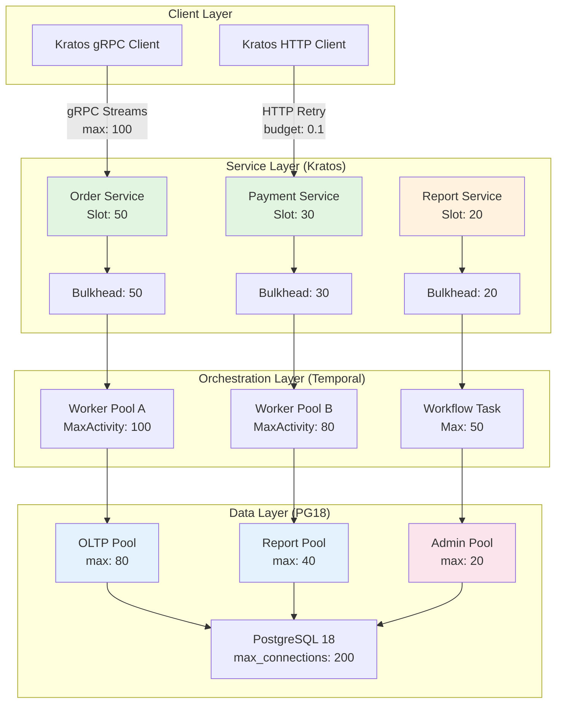
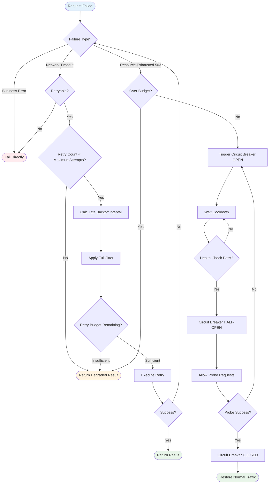

# Bulkhead Isolation and Retry Patterns

> **Stage**: TECH-STACK | **Prerequisites**: [Chinese source](../TECH-STACK-STREAMING-POSTGRES-TEMPORAL-KRATOS/04-resilience/04.03-bulkhead-retry-isolation-patterns.md) | **Formalization Level**: L2-L4 | **Last Updated**: 2026-04-22

## 1. Definitions

This section rigorously defines the core concepts of bulkhead isolation and retry patterns, establishing a formal foundation for subsequent quantitative analysis and engineering arguments.

**Def-T-04-03-01 (Bulkhead)**
Let system $S$ consist of $n$ functional domains $\{D_1, D_2, \dots, D_n\}$, where each domain consumes a resource set $R_i \subseteq R$. Bulkhead isolation is a resource partitioning strategy that introduces an allocation function $B: R \times \{1,\dots,n\} \to \mathbb{R}^+$, such that for any $i \neq j$, the resource consumption of $D_i$ is bounded by $B(r, i)$, and when $D_i$ fails causing resource $r$ to be exhausted:

$$\forall r \in R, \quad \sum_{j \neq i} \text{Alloc}_j(r) \leq B(r, j)$$

That is, the resource consumption of the faulty domain $D_i$ will not encroach on the quotas of other domains. This concept originates from watertight compartments in ship design[^1].

**Def-T-04-03-02 (SemaphoreBulkhead)**
A bulkhead implementation based on counting semaphores, maintaining a shared counter $C$ (initial value $C_{max}$). When an execution unit within domain $D_i$ requests entry to the critical section, it executes $P(C)$; upon exit it executes $V(C)$. If $C = 0$, the request is immediately rejected or queued (depending on configuration). Formally, the concurrency constraint is:

$$\text{Concurrent}(D_i) \leq C_{max}$$

**Def-T-04-03-03 (ThreadPoolBulkhead)**
A bulkhead implementation based on fixed thread pools, allocating an independent thread pool $T_i$ to each isolation domain, satisfying $|T_i| = N_i$ (fixed size). The difference from semaphore bulkhead is that the thread pool bulkhead binds execution units to threads, providing natural thread isolation and queue boundaries; whereas semaphore bulkhead only limits concurrency on the current calling thread without creating independent threads. Formally:

$$\forall t \in T_i, \quad t \text{ only executes tasks belonging to } D_i$$

**Def-T-04-03-04 (Connection Pool Isolation)**
In the data access layer, independent connection pool instances $\{P_1, P_2, \dots, P_m\}$ are allocated for different services or query types, each with independent upper limits $C_k$ and timeout configurations. Let the total connection demand be $N$; under isolated pool configuration the available connections are:

$$\text{Available}_{\text{isolated}} = \sum_{k=1}^{m} \min(C_k, \text{Demand}_k)$$

Under shared pool configuration the available connections are $\min(C_{\text{total}}, N)$. When a certain query type experiences connection leakage, the isolated pool guarantees:

$$\text{Leaked}_k \leq C_k \quad \Rightarrow \quad \text{Pool}_{j \neq k} \text{ is unaffected}$$

**Def-T-04-03-05 (Retry Budget)**
Given a normal request rate $\lambda_{\text{normal}}$ (unit: requests/second), the retry budget defines the allowable upper limit of retry request rate:

$$\lambda_{\text{retry}}^{\text{budget}} = \beta \cdot \lambda_{\text{normal}}$$

Where $\beta \in (0, 1]$ is the budget coefficient (engineering practice often takes $\beta = 0.1$). The cumulative retry requests in any time window $[t_1, t_2]$ must satisfy:

$$\int_{t_1}^{t_2} \lambda_{\text{retry}}(t)\, dt \leq \beta \int_{t_1}^{t_2} \lambda_{\text{normal}}(t)\, dt$$

**Def-T-04-03-06 (Retry Storm)**
Let there be $N$ clients in the system, each implementing a retry strategy for failed requests. If the server available capacity is $C$ and normal load is $L < C$, then under transient failure the collective retry load $L_{\text{retry}}$ produced by clients may satisfy:

$$L_{\text{retry}} = N \cdot \sum_{k=1}^{M} p_k \cdot L > C$$

Where $M$ is the maximum retry count and $p_k$ is the trigger probability of the $k$-th retry. When $L_{\text{retry}} > C$, the system degrades from transient failure to cascading overload; this phenomenon is called a retry storm[^2].

**Def-T-04-03-07 (Exponential Backoff)**
A retry interval calculation strategy where the waiting interval for the $k$-th retry is:

$$T_k = \min(T_{\text{max}}, T_0 \cdot c^k)$$

Where $T_0$ is the initial interval, $c$ is the backoff coefficient (usually $c = 2$), and $T_{\text{max}}$ is the maximum interval cap. This strategy exponentially sparsifies retry traffic along the time axis, reducing impact on a recovering system.

**Def-T-04-03-08 (Jitter)**
Introducing random perturbation on top of exponential backoff to avoid synchronous impact from multiple clients retrying at the same moment. Under the Full Jitter strategy, the actual waiting time for the $k$-th retry is:

$$T_k^{\text{jitter}} = \text{Uniform}(0, \min(T_{\text{max}}, T_0 \cdot c^k))$$

The Decorrelated Jitter variant adopts:

$$T_k^{\text{decorrelated}} = \text{Uniform}(T_{\text{min}}, T_{k-1} \cdot 3)$$

## 2. Properties

From the above definitions, the core engineering properties of bulkhead and retry strategies can be directly derived.

**Lemma-T-04-03-01 (Isolation Reduces Fault Blast Radius)**
Let the shared resource pool have total capacity $C$. Without isolation, a faulty domain $D_i$ could consume all resources and cause a system-wide failure. After adopting bulkhead isolation, let the quota of $D_i$ be $C_i$; then the fault blast radius reduction ratio is:

$$\rho = \frac{C - C_i}{C} = 1 - \frac{C_i}{C}$$

Under an equal partition strategy ($C_i = C/n$), we have $\rho = 1 - 1/n$. When $n \geq 2$, $\rho \geq 50\%$, meaning at least half the capacity is unaffected by a single domain failure.

*Proof.* Without isolation, the faulty domain can occupy up to $C$, affecting all $n$ domains. After isolation the upper bound is $C_i$, reducing the impact scope to 1 domain. The resource protection ratio follows directly from the definition.$\square$

**Lemma-T-04-03-02 (Retry Budget Constrains Overload Factor)**
Let the system normal request rate be $\lambda$, failure rate be $f$, and maximum retry count be $M$. Without budget constraint, the retry amplification factor is:

$$A_{\text{unbounded}} = \sum_{k=0}^{M} f^k = \frac{1 - f^{M+1}}{1 - f}$$

After introducing retry budget $\beta$, the actual retry rate is limited to $\lambda_{\text{retry}} \leq \beta \lambda$, so the effective amplification factor satisfies:

$$A_{\text{budgeted}} = 1 + \frac{\lambda_{\text{retry}}}{\lambda} \leq 1 + \beta$$

When $\beta = 0.1$, $A_{\text{budgeted}} \leq 1.1$, whereas without budget if $f = 0.5, M = 5$, $A_{\text{unbounded}} \approx 1.97$.

*Proof.* The budget definition directly limits the proportion of retry traffic to normal traffic. The amplification factor is derived from total traffic divided by normal traffic: $(\lambda + \lambda_{\text{retry}})/\lambda = 1 + \lambda_{\text{retry}}/\lambda \leq 1 + \beta$.$\square$

**Prop-T-04-03-01 (Exponential Backoff + Jitter De-synchronizes Retries)**
Let $N$ independent clients encounter a failure at the same moment $t_0$ and initiate retries. Under pure exponential backoff, the $k$-th round of retries concentrates in the interval $[T_k - \delta, T_k + \delta]$ (network delay fluctuation), with peak retry density $O(N)$. After introducing Full Jitter, the $k$-th round retry times are uniformly distributed over $[0, T_k]$; the expected retry count in any unit time window is:

$$\mathbb{E}[\text{retries per unit time}] = \frac{N}{T_k}$$

Peak density drops to $O(1)$ (compared to $O(N)$ spikes for synchronous retries), achieving temporal load de-synchronization[^3].

## 3. Relations

**Relation between Bulkhead and Circuit Breaker**
Bulkhead isolation and Circuit Breaker are complementary fault containment strategies:

- **Bulkhead** focuses on **spatial isolation**: limiting fault propagation across domains (horizontal) through resource partitioning, ensuring that a fault in domain $D_i$ does not encroach on the resource quotas of $D_j$.
- **Circuit Breaker** focuses on **temporal isolation**: blocking continuous calls to a failing service along the time axis (vertical) through a state machine (Closed → Open → Half-Open).

Their combination forms a two-dimensional defense matrix: the bulkhead ensures the boundary of local faults; the circuit breaker prevents ineffective retries within the boundary. When the circuit breaker of domain $D_i$ opens, its bulkhead quota $C_i$ can be reused by other healthy domains (if dynamic quota is configured), or kept vacant to avoid instantaneous impact after fault recovery.

**Relation between Retry and Backpressure**
Retry and Backpressure are two orthogonal dimensions of load management in stream processing systems:

- **Backpressure** is a **preventive** mechanism: when downstream processing capacity is insufficient, it propagates backpressure signals upstream to limit data injection rate at the source, preventing unbounded queue growth.
- **Retry** is a **restorative** mechanism: when transient failures occur, it improves the eventual success rate of operations through delayed retries.

Unconstrained retries can break the backpressure contract: upstream slows down due to backpressure, but client retries generate additional traffic, forming a "backpressure leak." The retry budget (Def-T-04-03-05) establishes a rate contract between the retry layer and the backpressure layer by quantifying the retry traffic upper bound:

$$\lambda_{\text{source}} + \lambda_{\text{retry}}^{\text{budget}} \leq \lambda_{\text{sink}}^{\text{capacity}}$$

**Relation between Bulkhead and Connection Pool**
A connection pool is essentially a special bulkhead implementation: partitioning limited database connection resources by domain. PG18's `max_connections` is the global bulkhead; application-layer multi-pool configurations (e.g., multiple `HikariDataSource` instances in HikariCP) are domain-level bulkheads. The hierarchical relationship satisfies:

$$\sum_{k=1}^{m} C_k^{\text{app}} \leq C^{\text{PG}} = \text{max_connections}$$

Violating this inequality causes total application-layer connection demand to exceed the PG18 global limit, triggering `FATAL: sorry, too many clients already` errors.

## 4. Argumentation

### 4.1 Engineering Implementation of Thread Pool / Connection Pool Bulkheads

**Kratos gRPC Connection Pool Bulkhead**
The Kratos framework provides two types of bulkhead mechanisms at the gRPC transport layer:

1. **Stream-level bulkhead**: Limits the maximum concurrent streams on a single HTTP/2 connection via `grpc.WithMaxConcurrentStreams(uint32)`. HTTP/2 multiplexing allows a single TCP connection to carry multiple gRPC calls, but unlimited concurrent streams compete for send/receive windows on the connection, causing head-of-line blocking. Let single connection bandwidth be $B$ and stream count be $N$; then available bandwidth per stream is $B/N$; as $N \to \infty$, single-stream bandwidth approaches zero and all streams starve.

2. **Connection keepalive bulkhead**: Defines connection liveness probe strategy via `grpc.KeepaliveParams(keepalive.ClientParameters{Time: 10s, Timeout: 3s})`, timely reclaiming zombie connections to prevent connection leakage from eroding bulkhead capacity.

**PG18 Connection Pool Bulkhead**
PostgreSQL 18's global connection bulkhead is controlled by the `max_connections` parameter (default 100, typically increased to 200 in production). PG18 introduces the `connection_traffic_control` feature (prospective; subject to actual release) allowing finer-grained resource grouping of connections. At the application layer, it is recommended to partition connection pools by business domain:

```
┌─────────────────────────────────────────────┐
│           Application Layer                  │
│  ┌──────────────┐      ┌──────────────┐    │
│  │   Pool-A     │      │   Pool-B     │    │
│  │ (OLTP: 80)   │      │ (Report: 40) │    │
│  └──────┬───────┘      └──────┬───────┘    │
│         │                     │             │
│  ┌──────┴───────┐      ┌──────┴───────┐    │
│  │  PG18 Primary │◄────►│  PG18 Replica │   │
│  │ max_conn=200  │      │ max_conn=100  │   │
│  └───────────────┘      └───────────────┘   │
└─────────────────────────────────────────────┘
```

In this configuration, the OLTP pool (80 connections) and Report pool (40 connections) are bulkhead-isolated. When a report query triggers a full table scan causing connections to be held for a long time, OLTP transactions still have an independent quota of 80 connections, unaffected by the report domain fault.

**Temporal Worker Pool Bulkhead**
Temporal Worker provides two types of concurrency bulkheads via `worker.Options`:

- `MaxConcurrentActivityExecutionSize: 100` — Activity execution bulkhead, limiting the number of Activity tasks executed simultaneously by a single Worker instance.
- `MaxConcurrentWorkflowTaskExecutionSize: 50` — Workflow Task execution bulkhead, limiting the number of Workflow decision tasks processed simultaneously.

Temporal's bulkhead design distinguishes the resource characteristics of Workflows (lightweight, state machine advancement) and Activities (heavyweight, actual business operations). Activities typically involve external I/O (database queries, HTTP calls) and are the main resource consumers; Workflows are in-memory state machine computations. Independent bulkheads ensure that blocking heavyweight Activities do not freeze Workflow decision scheduling.

### 4.2 Three-Layer Strategy for Retry Storm Protection

**Layer 1: Exponential Backoff (Temporal Sparsification)**
Disperses retry traffic exponentially along the time axis. Let initial interval $T_0 = 1s$, backoff coefficient $c = 2.0$, maximum interval $T_{\text{max}} = 60s$, and maximum attempts $M = 5$; then the retry time sequence is:

| Attempt | Calculated Interval | Actual Interval (min) |
|---------|---------------------|-----------------------|
| 1 | $1 \times 2^0 = 1s$ | 1s |
| 2 | $1 \times 2^1 = 2s$ | 2s |
| 3 | $1 \times 2^2 = 4s$ | 4s |
| 4 | $1 \times 2^3 = 8s$ | 8s |
| 5 | $1 \times 2^4 = 16s$ | 16s |

The total retry window is $1+2+4+8+16 = 31s$, dispersing potential retry spikes over a half-minute time span.

**Layer 2: Jitter (Phase De-synchronization)**
Pure exponential backoff still carries synchronization risk in multi-client scenarios: all clients calculate by the same formula, and if clocks align, retries may still cluster. Full Jitter completely eliminates this phase locking through randomization:

```python
sleep = random.uniform(0, min(cap, base * 2**attempt))
```

AWS operational experience shows that Decorrelated Jitter can provide better tail latency performance than Full Jitter in certain scenarios[^3].

**Layer 3: Retry Budget (Hard Traffic Cap)**
As the final defense line, the retry budget sets an insurmountable upper bound on retry traffic. Let a service normally process 1000 RPS with budget coefficient $\beta = 0.1$; then regardless of how many requests fail, the system allows at most 100 retries/second. Failed requests exceeding the budget directly enter degradation logic (returning cache, default values, or errors).

### 4.3 Quantitative Argument: Fault Blast Radius Reduction via Isolation

Consider a quantitative analysis based on a resource competition model. Let the system have $n$ functional domains sharing a resource pool with total capacity $C$. Without isolation, domains compete for resources on a first-come-first-served basis.

**Theorem (Fault Diffusion Boundary under Resource Competition)**
Let faulty domain $D_f$ experience resource leakage, with consumption rate suddenly increasing from normal $\mu$ to $\mu' \gg \mu$. Without isolation, the time to total system failure is:

$$T_{\text{total-failure}}^{\text{no-bulkhead}} = \frac{C}{\mu'}$$

After adopting equal bulkhead isolation (quota $C/n$ per domain), the time for the faulty domain to exhaust its own quota is:

$$T_{\text{domain-failure}} = \frac{C/n}{\mu'} = \frac{1}{n} \cdot T_{\text{total-failure}}^{\text{no-bulkhead}}$$

Other domains $D_j$ ($j \neq f$) have full quota $C/n$ and can sustain normal operation for:

$$T_{\text{healthy}}^{\text{others}} = \infty \quad \text{(as long as } D_f \text{ does not encroach further)}$$

The fault blast radius reduction ratio is:

$$\rho = \frac{(n-1) \cdot C/n}{C} = \frac{n-1}{n}$$

When $n = 5$, $\rho = 80\%$, meaning 80% of system capacity is immune to the faulty domain's impact.

**Non-uniform Isolation Optimization**
In practice, domains differ in importance and load, so weighted isolation is often adopted:

$$C_i = C \cdot w_i, \quad \sum_{i=1}^{n} w_i \leq 1$$

Critical domains (e.g., payment core) are assigned $w_i = 0.4$, while secondary domains (e.g., log collection) are assigned $w_j = 0.1$. When a secondary domain fails, the critical domain's 40% quota is completely unaffected.

### 4.4 Bulkhead Configuration Strategy for the Five-Technology Stack

This technology stack covers Streaming, PostgreSQL, Temporal, Kratos, and the infrastructure layer. The bulkhead strategy for each component is as follows:

| Component Layer | Bulkhead Mechanism | Configuration Parameter | Isolation Target |
|---------|---------|---------|---------|
| **Streaming (Flink)** | Task Slot isolation | `taskmanager.numberOfTaskSlots` | Prevent a single Job's Backpressure from diffusing to other Jobs |
| **PG18** | Connection pool partitioning | `max_connections`, application-layer multi HikariPool | Prevent slow queries from exhausting all connections |
| **Temporal** | Worker concurrency bulkhead | `MaxConcurrentActivityExecutionSize` | Prevent heavy Activities from blocking Workflow scheduling |
| **Kratos (gRPC)** | Stream limit + connection pool | `WithMaxConcurrentStreams`, connection pool size | Prevent a single service from dragging down client connection resources |
| **Kratos (HTTP)** | Client retry bulkhead | Retry budget, backoff strategy, circuit breaker | Prevent retry storms from impacting downstream |
| **Infrastructure** | K8s ResourceQuota | `limits.cpu`, `limits.memory` | Prevent Pod resource leakage from affecting node stability |

## 5. Proof / Engineering Argument

**Thm-T-04-03-01 (Sufficient Condition for Bulkhead Isolation to Guarantee Non-diffusion of Local Faults)**
Let system $S$ consist of $n \geq 2$ domains $\{D_1, \dots, D_n\}$ and resource set $R = \{r_1, \dots, r_m\}$. If the following conditions are satisfied:

1. **Hard partition condition**: For each resource $r_k$, there exists an allocation function $B(r_k, i)$ such that the usage $u_i(r_k)$ of $D_i$ for $r_k$ satisfies $u_i(r_k) \leq B(r_k, i)$ almost surely (enforced by OS/runtime);
2. **Quota saturation condition**: $\sum_{i=1}^{n} B(r_k, i) \leq C_k$, where $C_k$ is the physical upper limit of resource $r_k$;
3. **Fault domain boundedness**: The resource demand $d_f(r_k)$ of the faulty domain $D_f$ is finite (though possibly $d_f(r_k) \gg B(r_k, f)$, the excess is rejected rather than infinitely accumulated).

Then for any $j \neq f$, the available resources of $D_j$ are unaffected by the fault of $D_f$, i.e.:

$$\text{Available}_j(r_k \mid D_f \text{ faulty}) = B(r_k, j) - u_j(r_k) = \text{Available}_j(r_k \mid D_f \text{ normal})$$

*Proof.* By condition 1, the bulkhead mechanism enforces resource caps through the OS scheduler or runtime monitoring. Regardless of what fault occurs inside $D_f$ (infinite loops, memory leaks, connection storms), its usage of $r_k$ is truncated at $B(r_k, f)$. By condition 2, the total allocation does not exceed physical capacity, avoiding systemic resource exhaustion caused by overcommitment. By condition 3, requests exceeding the quota are rejected/queued/degraded, and do not encroach on other domains' resources in hidden forms (such as infinitely growing wait queues). Therefore, the fault behavior of $D_f$ is completely confined within its quota boundary, and the available resources of $D_j$ ($j \neq f$) remain unchanged.$\square$

**Engineering Corollary: Bulkheads Are Not Omnipotent**
The above proof relies on the "hard partition" condition being satisfied. In the following scenarios, bulkheads may fail:

1. **Shared kernel resources**: Linux inode cache, TCP protocol stack global state, etc. cannot be partitioned by domain; extreme behavior by one domain (e.g., massive TIME_WAIT sockets) can still affect global network performance.
2. **Cascading timeouts**: $D_j$ calls a synchronous interface of $D_f$; even if $D_j$ itself has sufficient resources, threads waiting for $D_f$ responses are still occupied, forming a "logical fault diffusion." Circuit breakers serve as a necessary supplement in this scenario.
3. **Dynamic quota adjustment**: If the bulkhead supports dynamic quota reallocation, a faulty domain's released quota may be acquired by healthy domains, but resource fragmentation may still exist during the quota reclamation delay window.

## 6. Examples

### 6.1 Resilience4j Bulkhead Configuration

Resilience4j provides two bulkhead implementations. Below is a semaphore bulkhead configuration suitable for lightweight, non-blocking operations:

```java
import io.github.resilience4j.bulkhead.Bulkhead;
import io.github.resilience4j.bulkhead.BulkheadConfig;
import io.github.resilience4j.bulkhead.BulkheadRegistry;

// Semaphore bulkhead configuration
BulkheadConfig semaphoreConfig = BulkheadConfig.custom()
    .maxConcurrentCalls(50)          // Maximum concurrent calls
    .maxWaitDuration(Duration.ofMillis(500))  // Maximum wait time for permit acquisition
    .build();

BulkheadRegistry registry = BulkheadRegistry.of(semaphoreConfig);
Bulkhead orderBulkhead = registry.bulkhead("orderService", semaphoreConfig);

// Usage
Supplier<String> decorated = Bulkhead.decorateSupplier(
    orderBulkhead,
    () -> orderClient.placeOrder(request)
);
String result = Try.ofSupplier(decorated)
    .recover(throwable -> "FALLBACK")
    .get();
```

Thread pool bulkhead is suitable for blocking I/O operations, providing independent threads and queues:

```java
import io.github.resilience4j.bulkhead.ThreadPoolBulkheadConfig;

ThreadPoolBulkheadConfig threadPoolConfig = ThreadPoolBulkheadConfig.custom()
    .maxThreadPoolSize(20)           // Maximum thread pool size
    .coreThreadPoolSize(10)          // Core thread count
    .queueCapacity(100)              // Wait queue capacity
    .keepAliveDuration(Duration.ofMillis(5000))
    .build();
```

### 6.2 Kratos HTTP Client Retry Configuration

The Kratos HTTP client has built-in retry middleware supporting exponential backoff and retry budgets:

```go
import (
    "github.com/go-kratos/kratos/v2/transport/http"
    "github.com/go-kratos/kratos/v2/middleware/recovery"
    "time"
)

// Client configuration
client, err := http.NewClient(
    http.WithEndpoint("http://api.example.com:8000"),
    http.WithTimeout(time.Second * 5),
    http.WithMiddleware(
        recovery.Recovery(),
    ),
)

// Kratos HTTP retries are typically implemented via custom RoundTripper or middleware
// The following shows a typical exponential backoff + Jitter retry middleware configuration
```

In the Kratos gRPC layer, stream-level bulkhead and connection keepalive configurations are as follows:

```go
import (
    "google.golang.org/grpc"
    "google.golang.org/grpc/keepalive"
    "time"
)

// gRPC connection configuration (client-side bulkhead)
conn, err := grpc.Dial(target,
    grpc.WithMaxConcurrentStreams(100),  // Maximum concurrent streams per connection
    grpc.WithKeepaliveParams(keepalive.ClientParameters{
        Time:    10 * time.Second,       // Keepalive probe interval
        Timeout: 3 * time.Second,        // Probe timeout
    }),
    grpc.WithDefaultServiceConfig(`{
        "loadBalancingConfig": [{"round_robin": {}}],
        "methodConfig": [{
            "name": [{"service": "my.Service"}],
            "retryPolicy": {
                "maxAttempts": 5,
                "initialBackoff": "1s",
                "maxBackoff": "60s",
                "backoffMultiplier": 2.0,
                "retryableStatusCodes": ["UNAVAILABLE", "DEADLINE_EXCEEDED"]
            }
        }]
    }`),
)
```

### 6.3 PG18 Connection Pool Configuration

Using HikariCP as the application-layer connection pool to implement domain-level bulkhead isolation:

```yaml
# application.yml — OLTP domain connection pool
spring.datasource.oltp.type: com.zaxxer.hikari.HikariDataSource
spring.datasource.oltp.jdbc-url: jdbc:postgresql://primary:5432/mydb
spring.datasource.oltp.username: ${DB_USER}
spring.datasource.oltp.password: ${DB_PASS}
spring.datasource.oltp.hikari.maximum-pool-size: 80
spring.datasource.oltp.hikari.minimum-idle: 20
spring.datasource.oltp.hikari.connection-timeout: 30000
spring.datasource.oltp.hikari.idle-timeout: 600000
spring.datasource.oltp.hikari.max-lifetime: 1800000

# Report domain connection pool (independent bulkhead)
spring.datasource.report.type: com.zaxxer.hikari.HikariDataSource
spring.datasource.report.jdbc-url: jdbc:postgresql://replica:5432/mydb
spring.datasource.report.hikari.maximum-pool-size: 40
spring.datasource.report.hikari.minimum-idle: 10
```

PG18 server-side global bulkhead configuration:

```ini
# postgresql.conf
max_connections = 200                   # Global hard cap
shared_buffers = 4GB                    # Shared memory bulkhead
work_mem = 16MB                         # Per-query working memory (bulkheaded)
maintenance_work_mem = 512MB            # Maintenance operation memory cap
max_parallel_workers_per_gather = 4     # Parallel query worker cap
max_parallel_workers = 8                # Global parallel worker cap
```

### 6.4 Temporal Worker Concurrency Configuration

Temporal Worker bulkhead configuration is implemented via the `worker.Options` struct:

```go
import (
    "go.temporal.io/sdk/worker"
    "go.temporal.io/sdk/client"
)

c, err := client.Dial(client.Options{
    HostPort: "temporal-frontend:7233",
})

w := worker.New(c, "my-task-queue", worker.Options{
    // Activity execution bulkhead
    MaxConcurrentActivityExecutionSize: 100,

    // Workflow Task execution bulkhead
    MaxConcurrentWorkflowTaskExecutionSize: 50,

    // Local Activity concurrency bulkhead
    MaxConcurrentLocalActivityExecutionSize: 50,

    // Other key configurations
    WorkerActivitiesPerSecond: 100.0,           // Rate limit for Activity starts per second
    TaskQueueActivitiesPerSecond: 200.0,        // Task Queue level rate limit
    MaxConcurrentSessionExecutionSize: 1000,    // Session concurrency cap
    DeadlockDetectionTimeout: time.Second * 5,  // Workflow deadlock detection
})

// Register Workflow and Activity
w.RegisterWorkflow(MyWorkflow)
w.RegisterActivity(MyActivity)

err = w.Run(worker.InterruptCh())
```

Temporal retry policies are configured independently at the Workflow and Activity levels:

```go
import (
    "go.temporal.io/sdk/temporal"
    "go.temporal.io/sdk/workflow"
    "time"
)

// Activity retry policy: exponential backoff + maximum attempts
retryPolicy := &temporal.RetryPolicy{
    InitialInterval:    time.Second,         // T_0 = 1s
    BackoffCoefficient: 2.0,                 // c = 2.0
    MaximumInterval:    time.Minute,         // T_max = 60s
    MaximumAttempts:    5,                   // M = 5
    NonRetryableErrorTypes: []string{"InvalidArgument", "PermissionDenied"},
}

ao := workflow.ActivityOptions{
    StartToCloseTimeout: time.Minute * 5,
    RetryPolicy:         retryPolicy,
}

ctx = workflow.WithActivityOptions(ctx, ao)
```

## 7. Visualizations

### 7.1 Bulkhead Isolation Architecture

The following diagram shows the multi-layer bulkhead isolation architecture in the five-technology stack environment. Each layer independently allocates resource quotas, and faults are confined within the originating domain.



The above figure shows the full-link bulkhead from client to database:

- **Client Layer**: Kratos gRPC limits single-connection stream count via `maxConcurrentStreams`; HTTP client limits retry traffic via retry budget.
- **Service Layer**: Resilience4j Bulkhead allocates independent concurrency slots for each microservice (Order: 50, Payment: 30, Report: 20).
- **Orchestration Layer**: Temporal Worker's `MaxConcurrentActivityExecutionSize` isolates Activity execution in independent worker thread pools.
- **Data Layer**: HikariCP multi-pool configuration partitions PG18's 200 connections by business domain (OLTP: 80, Report: 40, Admin: 20).

When Report Service experiences connection leakage, its 20 service slots and 40 database connections are exhausted, but Order Service's 50 slots and 80 connections are completely unaffected; the fault blast radius is confined within the report domain.

### 7.2 Retry Strategy Comparison

The following decision tree shows how to choose retry strategies under different fault scenarios, and how the combination of exponential backoff + jitter + budget collaboratively prevents retry storms.



Key decision points in this flowchart:

1. **Budget Check** (node I): Before any retry execution, verify retry budget remaining. Budget exhausted directly enters degradation, avoiding retry storms.
2. **Jitter Injection** (node H): Inject random jitter after exponential backoff calculation, scattering multi-client retry synchronization.
3. **Circuit Breaker Collaboration** (node K): When resource-exhausted errors occur frequently, the circuit breaker directly cuts off traffic, winning a time window for system recovery.

### 3.5 Project Knowledge Base Cross-References

This document on bulkhead and retry isolation patterns relates to the following entries in the project knowledge base:

- [High Availability Patterns](../Knowledge/07-best-practices/07.06-high-availability-patterns.md) — Combined high availability design patterns for bulkhead, retry, and circuit breaker
- [Backpressure and Flow Control](../Flink/02-core/backpressure-and-flow-control.md) — Synergy between Flink credit-based flow control and resource isolation
- [Performance Tuning Patterns](../Knowledge/07-best-practices/07.02-performance-tuning-patterns.md) — Performance optimization strategies for retry budgets and jittered backoff
- [Troubleshooting Guide](../Knowledge/07-best-practices/07.03-troubleshooting-guide.md) — Diagnostic methods for retry storms and resource exhaustion faults

## 8. References

[^1]: N. Brown, "Bulkhead Pattern — Cloud Design Patterns", Microsoft Azure Architecture Center, 2023. <https://learn.microsoft.com/en-us/azure/architecture/patterns/bulkhead>

[^2]: M. Brooker et al., "Retries and Backoff Strategies in Distributed Systems", AWS Architecture Blog, 2025. <https://aws.amazon.com/blogs/architecture/exponential-backoff-and-jitter/>

[^3]: A. B. Sharma et al., "Fail at Scale: Reliability in the Presence of Overload", arXiv:2512.16959v1 [cs.DC], 2025. <https://arxiv.org/abs/2512.16959v1>
