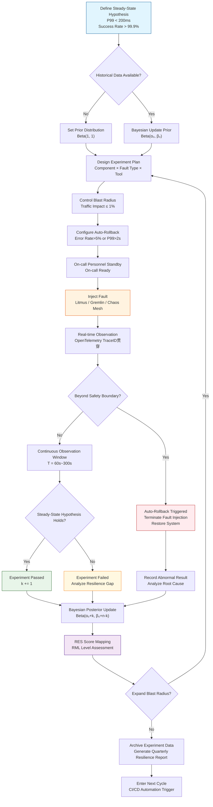
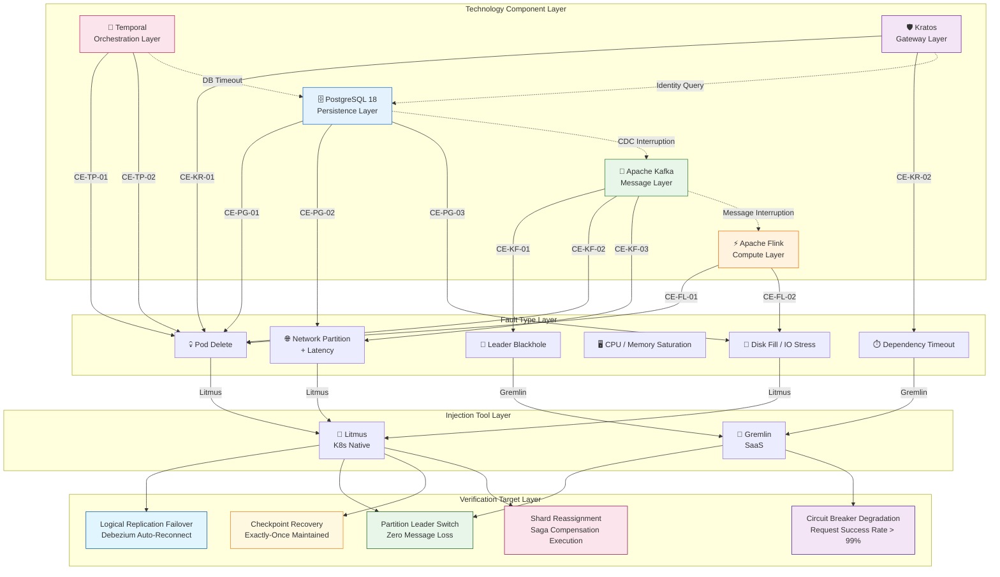

# Chaos Engineering Practice

> **Stage**: TECH-STACK | **Prerequisites**: [Chinese source](../TECH-STACK-STREAMING-POSTGRES-TEMPORAL-KRATOS/04-resilience/04.05-chaos-engineering-practice.md) | **Formalization Level**: L2-L4 | **Last Updated**: 2026-04-22

## 1. Definitions

**Def-TS-04-05-01 (Chaos Engineering)**

Chaos Engineering is the discipline of conducting controlled injection of real-world fault events in production or production-like environments of distributed systems, observing system behavior, and verifying recovery capabilities. Formally, let the system state space be $\mathcal{S}$, the steady-state hypothesis set be $\mathcal{H}$, and the fault injection operator be $\phi_f: \mathcal{S} \to \mathcal{S}$; then a chaos experiment $\mathcal{E}$ is a quadruple:

$$
\mathcal{E} = (S_0, f, T, \mathcal{O})
$$

Where $S_0 \in \mathcal{S}$ is the experiment initial state, $f \in \mathcal{F}$ is the selected fault mode, $T$ is the observation time window, and $\mathcal{O}$ is the observation metric set. The core goal of Chaos Engineering is to falsify or confirm the steady-state hypothesis $h \in \mathcal{H}$ through experiments, thereby establishing statistical confidence in system resilience.

**Def-TS-04-05-02 (Fault Injection)**

Fault injection is the technique of introducing predefined fault events into a target system through programmatic means. Let the target system component be $C_i$ and the fault space be $\mathcal{F}_i = \{f_{\text{cpu}}, f_{\text{mem}}, f_{\text{net}}, f_{\text{disk}}, f_{\text{kill}}, \dots\}$; then the fault injection function is defined as:

$$
\text{inject}: C_i \times \mathcal{F}_i \times \mathbb{R}^+ \to \text{EventLog}
$$

Where $\mathbb{R}^+$ is the fault duration. Fault injection must satisfy three constraints: controllability, observability, and reversibility.

**Def-TS-04-05-03 (Blast Radius)**

Blast radius is the measure of the service scope, user traffic scope, or data scope affected by a single chaos experiment. Let the system component dependency graph be $G = (V, E)$, the fault source node $v_0 \in V$, and the fault propagation closure be $\mathcal{B}^*(v_0)$; then the blast radius is defined as:

$$
BR(v_0) = \frac{|\mathcal{B}^*(v_0)|}{|V|} \times \frac{\text{affected traffic}}{\text{total traffic}}
$$

Safe practice requires $BR(v_0) \leq \beta_{\max}$, where $\beta_{\max}$ is typically $1\%$ (first experiment in production) to $10\%$ (systems with higher maturity).

**Def-TS-04-05-04 (Steady-State Hypothesis)**

A steady-state hypothesis is an assumption about the quantifiable behavior of a system under normal operating conditions, which must satisfy observability, measurability, and falsifiability. Formally, let the system metric space be $\mathcal{M}$ and the threshold vector $\vec{\theta} = (\theta_1, \dots, \theta_k)$; then the steady-state hypothesis $h$ is defined as:

$$
h: \mathcal{S} \times \mathcal{M} \to \{\top, \bot\}, \quad h(s, m) = \bigwedge_{j=1}^{k} \left( m_j(s) \leq \theta_j \right)
$$

Typical examples include: "P99 latency $< 200\text{ms}$", "order processing success rate $> 99.9\%$", "logical replication latency $< 5\text{s}$".

**Def-TS-04-05-05 (Auto-Rollback)**

Auto-rollback is the mechanism by which the control plane automatically terminates fault injection and restores the system to steady state when a chaos experiment triggers a system state deviation beyond the safety boundary. Let the safety predicate be $\Psi_{\text{safe}}: \mathcal{S} \to \{\top, \bot\}$ and the rollback operator be $\rho: \mathcal{S} \to \mathcal{S}$; then auto-rollback satisfies:

$$
\forall s \in \mathcal{S}: \neg \Psi_{\text{safe}}(s) \implies \exists \Delta t \leq t_{\max}: \Psi_{\text{safe}}(\rho(s, \Delta t))
$$

Where $t_{\max}$ is the maximum allowed rollback time (engineering practice typically $t_{\max} \leq 30\text{s}$). Auto-rollback is the last line of defense for ensuring the safety of chaos experiments in production environments.

## 2. Properties

**Lemma-TS-04-05-01 (Chaos Experiment Reproducibility)**

If a chaos experiment is repeated $n$ times under the same initial condition $S_0$, the same fault injection mode $f$, and the same observation window $T$, then the distribution of the system response vector $\vec{R}_i = (R_i^{(1)}, \dots, R_i^{(m)})$ has statistical stability. Formal expression:

$$
\forall i, j \in [1, n], \quad d_{\text{KL}}(P_{\vec{R}_i} \parallel P_{\vec{R}_j}) < \epsilon_{\text{KL}}
$$

Where $d_{\text{KL}}$ is the KL divergence and $\epsilon_{\text{KL}}$ is the allowable deviation threshold. Reproducibility is a necessary condition for the credibility of chaos experiment results; if the same experiment produces significantly different response distributions under the same conditions, it indicates the presence of uncontrolled hidden variables or non-deterministic behavior in the system.

*Proof sketch*: By the controllability assumption of initial state $S_0$ and fault mode $f$, system evolution is determined by the deterministic transition kernel $P(s_{t+1} | s_t, f)$ and random external noise $\xi_t$. If external noise follows a stationary distribution and the experimental environment is well isolated, then $\{\vec{R}_i\}$ are independent and identically distributed samples, and their sample distribution converges to the same population distribution, with KL divergence tending to zero.$\square$

**Prop-TS-04-05-01 (Falsifiability of Steady-State Hypothesis)**

A valid steady-state hypothesis $h$ must satisfy falsifiability: there exists at least one fault injection scenario $f \in \mathcal{F}$ and at least one observation metric $m \in \mathcal{M}$ such that $h$ can be negated by observation results. Formally:

$$
\exists f \in \mathcal{F}, \exists m \in \mathcal{M}: \quad P\left( \neg h(S_0, m) \mid f \right) > 0
$$

If the hypothesis is unfalsifiable (e.g., "the system eventually recovers normally" without a time boundary), then the hypothesis lacks scientific experimental value.

*Argument*: Falsifiability originates from Popper's philosophy of science criteria. In engineering practice, "the system eventually recovers" without a clear RTO (Recovery Time Objective) constraint means any delayed recovery is regarded as "satisfying the hypothesis", thus losing experimental discriminative power. Therefore, the steady-state hypothesis must contain explicit time thresholds and measurable metric boundaries.$\square$

**Lemma-TS-04-05-02 (Blast Radius Monotonicity under Safety Boundary)**

Let the auto-rollback threshold be $\theta_{\text{safe}}$ and the fault intensity parameter be $\lambda \in [0, 1]$ (e.g., CPU stress percentage, network packet loss rate). Under the condition that the auto-rollback mechanism is activated, the actual blast radius $BR_{\text{actual}}$ satisfies:

$$
\frac{\partial BR_{\text{actual}}}{\partial \lambda} \geq 0 \quad \text{and} \quad \lim_{\lambda \to 1} BR_{\text{actual}} \leq BR_{\max}
$$

Where $BR_{\max}$ is hard-constrained by the rollback threshold. That is, as fault intensity increases, if rollback is not triggered, the blast radius does not decrease; once the threshold is reached, the rollback mechanism truncates the blast radius to a controllable upper bound.

## 3. Relations

**Relationship between Chaos Engineering and Unit Testing, Integration Testing, and Stress Testing**

The four verification methods have essential differences in goals, scope, environment, and methodology, forming a complementary verification matrix:

| Dimension | Unit Test | Integration Test | Stress Test | Chaos Engineering |
|------|---------------------|---------------------------|----------------------|---------------------------|
| **Verification Goal** | Function/method correctness | Component interface contracts | Capacity boundary and saturation behavior | Recovery capability under fault conditions |
| **Scope** | Single code unit | Multiple component interactions | Full system load | Production environment system-level |
| **Execution Environment** | Development/CI environment | Pre-release/test environment | Dedicated stress test environment | Production or production-like environment |
| **Input Characteristics** | Fixed input assertions | Synthetic data flows | Excessive concurrent requests | Real-world fault events |
| **Pass Criteria** | All deterministic assertions pass | No interface contract violations | Throughput/latency达标 | Steady-state hypothesis holds in statistical sense |
| **Failure Meaning** | Code defect | Integration mismatch | Capacity insufficient | Resilience gap |
| **Repeatability** | 100% deterministic | High determinism | Statistical stability | Statistical stability |
| **Relation to RES** | Indirect (code quality foundation) | Indirect (integration reliability foundation) | Direct (throughput/latency metrics) | Direct (chaos test checklist item) |

**Formal Relationship Statement**

Let the system verification space be $\mathcal{V}$; the four test methods cover subspaces $\mathcal{V}_{\text{unit}}, \mathcal{V}_{\text{int}}, \mathcal{V}_{\text{stress}}, \mathcal{V}_{\text{chaos}}$, respectively. They satisfy:

$$
\mathcal{V}_{\text{unit}} \cap \mathcal{V}_{\text{chaos}} = \emptyset, \quad \mathcal{V}_{\text{stress}} \cap \mathcal{V}_{\text{chaos}} \neq \emptyset
$$

That is, unit testing and chaos engineering have no intersection in verification goals (the former verifies functional correctness, the latter verifies fault recovery), while stress testing and chaos engineering have an intersection in "system-level abnormal behavior observation" — but stress testing triggers anomalies through overload, while chaos engineering triggers anomalies through fault injection; their mechanisms differ.

**Relation to Preceding Documents**

- `04.01-resilience-evaluation-framework.md` defines the RES scoring and RML maturity model. Chaos Engineering is an independent checklist item ("chaos test") among the ten RES checklist items, and is also one of the thresholds for RML-4 Advanced advancement.
- `04.04-fault-tolerance-composition-proof.md` proves the global fault tolerance lower bound of the composite system. Chaos Engineering provides empirical verification for this proof: by injecting faults into the actual system, it checks whether the theoretical lower bound $A_{\mathcal{S}}$ is consistent with actual observations.

## 4. Argumentation

### 4.1 Five-Technology Stack Chaos Experiment Design Matrix

The following table defines the chaos experiment matrix for the five major components of PostgreSQL 18 (PG18), Apache Kafka, Apache Flink, Temporal, and Kratos, covering the three dimensions of component × fault type × expected result.

| Experiment ID | Target Component | Fault Type | Injection Tool | Fault Parameters | Expected Result | RES Checklist Item |
|---------|---------|---------|---------|---------|---------|-----------|
| CE-PG-01 | PG18 Primary | Pod deletion | Litmus `pod-delete` | Randomly delete 1 primary Pod, duration 60s | Patroni failover RTO $<$ 30s, logical replication no data loss, Debezium auto-reconnect | R-DB-01 |
| CE-PG-02 | PG18 Cluster | Network partition | Litmus `network-partition` | Inject 100ms latency + 10% packet loss between primary and replica | Synchronous replication degrades to asynchronous, RPO remains 0 (sync mode) or $<$ 1MB (async mode), no split-brain | R-DB-02 |
| CE-PG-03 | PG18 Storage | Disk pressure | Litmus `disk-fill` | Fill data directory disk to 95% | Auto-trigger read-only mode or expansion alarm, WAL archiving not blocked, standby switchover proceeds normally | R-DB-03 |
| CE-KF-01 | Kafka Broker | Partition Leader switch | Gremlin `blackhole` | Inject network blackhole on Leader Broker for 120s | New Leader promoted from ISR candidate in $<$ 3s, committed messages not lost, producer receives `NOT_LEADER_OR_FOLLOWER` and redirects | R-MSG-01 |
| CE-KF-02 | Kafka Cluster | Broker crash | Litmus `pod-delete` | Randomly terminate 1 non-Controller Broker | Partition rebalancing completes in $<$ 60s, offline partition count is 0, consumer group rebalance no anomalies | R-MSG-02 |
| CE-KF-03 | Kafka Network | Network latency | Gremlin `latency` | Inject 200ms latency + 1% packet loss | Flink Kafka Consumer throughput degradation $<$ 20%, checkpoint interval no timeout, no duplicate message consumption | R-MSG-03 |
| CE-FL-01 | Flink TaskManager | TaskManager crash | Litmus `pod-delete` | Delete 1 TaskManager Pod, duration 30s | JobManager detects TaskManager disconnection, triggers Region Failover, job recovers from latest Checkpoint in $<$ 60s | R-STREAM-01 |
| CE-FL-02 | Flink Checkpoint | Checkpoint failure | Gremlin `latency` + custom Hook | Inject 5s latency on Checkpoint storage (S3/MinIO), simulating timeout | Checkpoint fails 3 consecutive times, job enters `RESTARTING` state, recovery maintains end-to-end Exactly-Once semantics, no data duplication or loss | R-STREAM-02 |
| CE-TP-01 | Temporal Server | History Service crash | Litmus `pod-delete` | Delete 1 Pod of History Service | Shard reassignment completes in $<$ 10s, executing Workflows enter stall, Service recovers and replays from Event History to continue execution | R-ORCH-01 |
| CE-TP-02 | Temporal Worker | Worker crash | Litmus `pod-delete` | Delete Pod running Worker | Activity heartbeat timeout triggers retry, other Worker nodes take over, Saga compensation transactions execute according to preset strategy | R-ORCH-02 |
| CE-KR-01 | Kratos Gateway | Service instance crash | Litmus `pod-delete` | Randomly delete 50% Kratos Pods | Load balancer directs traffic to healthy instances, remaining instances CPU $<$ 80%, request success rate $>$ 99% | R-SVC-01 |
| CE-KR-02 | Kratos Identity | Dependency timeout | Gremlin `latency` | Inject 5s latency on downstream database connection | Circuit breaker enters `OPEN` state after consecutive timeouts, degradation path returns cached identity or default response, error rate $<$ 1% | R-SVC-02 |

### 4.2 PG18: Fault Injection and Logical Replication Failover Verification

PostgreSQL 18, as the persistence layer of the composite system, the reliability of its logical replication failover directly affects the availability of the CDC pipeline and Temporal persistence.

**Fault Injection Design**

1. **Kill Pod (CE-PG-01)**: Use Litmus `pod-delete` to randomly terminate the primary Pod, simulating container platform-level failure. Fault parameters: single deletion, forced graceful termination (`FORCE: false`), observing the interaction between Kubernetes `terminationGracePeriodSeconds` and Patroni `failover_timeout`.
2. **Network Partition (CE-PG-02)**: Use Litmus `network-partition` to inject latency and packet loss between primary and synchronous replica, simulating cross-AZ network jitter. Key observation points are the dynamic degradation behavior of `synchronous_standby_names` and the `sync_state` transition in `pg_stat_replication`.
3. **Disk Full (CE-PG-03)**: Use Litmus `disk-fill` to fill the PGDATA volume. Verify whether PostgreSQL's `default_transaction_read_only` auto-trigger mechanism or Patroni callback scripts can timely switch traffic to the replica.

**Verify Logical Replication Failover**

Steady-state hypothesis is defined as:

- Logical replication slot remains active after failover
- Debezium Connector auto-reconnects to the new primary within the RTO window
- Replication delay peak $<$ 10s, latency integral $< 30\text{s} \cdot \text{s}$

Verification method:

1. Before fault injection, record the current primary LSN ($LSN_{\text{before}}$) and Debezium consumption offset.
2. After fault injection, poll the new primary identity through the Patroni REST API.
3. After the new primary is ready, query `pg_replication_slots` to confirm the logical slot exists and `active_pid` is non-empty.
4. Compare the number of source table change records during the fault period with the Debezium output event count to verify zero data loss.

### 4.3 Kafka: Partition Leader Switch, Broker Crash, Network Latency, and Message Non-loss Verification

Kafka, as the message bus of the stream processing pipeline, its partition-level fault tolerance is a prerequisite for Flink Exactly-Once semantics.

**Fault Injection Design**

1. **Partition Leader Switch (CE-KF-01)**: Use Gremlin `blackhole` to attack the Broker holding the Leader partition, injecting a network blackhole. Verify the Kafka Controller Leader election path:
   - Controller detects Leader disconnection through ZooKeeper/KRaft
   - Selects the candidate replica with the highest offset from ISR (In-Sync Replicas)
   - Updates partition state machine, notifies all followers to synchronize with the new leader
2. **Broker Crash (CE-KF-02)**: Use Litmus to delete Broker Pod. Verify the interaction between `min.insync.replicas` and `acks=all`: if surviving ISR count is below `min.insync.replicas`, the producer should receive `NOT_ENOUGH_REPLICAS` exception.
3. **Network Latency (CE-KF-03)**: Inject 200ms latency. Verify whether Flink Kafka Consumer's `request.timeout.ms` and `session.timeout.ms` configurations are reasonable to avoid mistakenly triggering rebalance.

**Verify Message Non-loss**

The core guarantee chain for message non-loss consists of three mechanisms:

- **Producer side**: `enable.idempotence=true` + `acks=all` + `max.in.flight.requests.per.connection=5`
- **Broker side**: ISR mechanism + `min.insync.replicas=2` + unclean.leader.election.enable=false
- **Consumer side**: Flink's Checkpoint mechanism atomically commits consumption offset and operator state

Verification method:

1. Inject a message flow with unique sequence numbers into the test Topic (rate 1000 msg/s).
2. Execute fault injection.
3. After fault recovery, count the total number of messages and sequence number continuity in Flink Sink to PostgreSQL.
4. If sequence numbers have no gaps and no duplicates (deduplicated by idempotency key), verification passes.

### 4.4 Flink: TaskManager Crash, Checkpoint Failure, and Exactly-Once Recovery Verification

Flink's distributed snapshot mechanism is the core of the real-time computing layer fault tolerance in the composite system.

**Fault Injection Design**

1. **TaskManager Crash (CE-FL-01)**: Delete TaskManager Pod. Verify that after JobManager's ResourceManager detects slot loss, it requests a new Pod from Kubernetes and recovers operator state from the latest successful Checkpoint.
2. **Checkpoint Failure (CE-FL-02)**: Inject high latency on the Checkpoint backend storage, triggering `checkpoint.timeout` (default 10 min). Verify Flink's `restart-strategy`:
   - Fixed delay strategy: `restart-strategy.fixed-delay.attempts=3`, `restart-strategy.fixed-delay.delay=10s`
   - Exponential backoff strategy: suitable for high-frequency Checkpoint failure scenarios

**Verify Exactly-Once Recovery**

End-to-end Exactly-Once relies on Flink's Two-Phase Commit (2PC) protocol and Kafka transactional producer. Verification framework:

- **State consistency**: After recovery from Checkpoint, the current value of Keyed State is consistent with the last successful Checkpoint before the fault. This can be verified by embedding monotonically increasing version numbers in the state.
- **Output consistency**: When using the Kafka transactional producer, Flink's `TwoPhaseCommitSinkFunction` ensures that messages from committed transactions are not re-written after recovery. The verification method is to compare the message count of the Kafka Topic before and after the fault with Flink's internal counter.
- **No data loss**: If the Checkpoint was successfully completed before the fault, the data source offset and operator state have been persisted; after recovery, consumption continues from that offset with no message omission.

### 4.5 Temporal: History Service Crash, Worker Crash, and Saga Compensation Verification

Temporal's deterministic replay and Saga orchestration are the guarantees for long transactions and compensation logic in the composite system.

**Fault Injection Design**

1. **History Service Crash (CE-TP-01)**: History Service is the core of Temporal Server, responsible for maintaining Workflow event history. After deleting its Pod, verify:
   - Matching Service routes new tasks to other History nodes
   - Shards assigned to the failed node are taken over by remaining nodes
   - Frontend Service gRPC requests succeed after retries
2. **Worker Crash (CE-TP-02)**: Workers are client processes that execute Activities and Workflows. After deleting the Worker Pod, verify:
   - After Activity heartbeat timeout, the Server re-queues the task
   - Other Worker instances obtain and execute the task through long polling
   - Saga compensation transaction compensation Activities are correctly triggered on the failure path

**Verify Saga Compensation**

Let the Saga workflow contain transaction sequence $T_1, T_2, \dots, T_n$, with corresponding compensation sequence $C_1, C_2, \dots, C_{n-1}$ ($C_i$ compensates $T_i$). In the Worker crash scenario:

- If $T_k$ has been executed but $T_{k+1}$ has not yet been executed, and the Worker executing $T_k$ crashes at this point, then $T_k$'s heartbeat timeout triggers retry. If retries are exhausted, the Saga orchestrator starts the compensation chain $C_k, C_{k-1}, \dots, C_1$.
- Verification method: In the workflow history, query the temporal relationship between `EVENT_TYPE_ACTIVITY_TASK_COMPLETED` and `EVENT_TYPE_ACTIVITY_TASK_FAILED`, confirming that the execution order of compensation Activities is consistent with business semantics.

### 4.6 Kratos: Service Instance Crash, Dependency Timeout, and Circuit Breaker Degradation Verification

Kratos, as the API gateway and identity service layer, its degradation capability directly affects the availability of user requests.

**Fault Injection Design**

1. **Service Instance Crash (CE-KR-01)**: Randomly delete 50% of Kratos Pods. Verify that Kubernetes Service Endpoints list updates automatically, and the Ingress Controller routes traffic only to healthy Pods.
2. **Dependency Timeout (CE-KR-02)**: Inject 5s latency on the PostgreSQL identity database depended upon by Kratos. Verify the circuit breaker state transition in Kratos middleware chain:
   - `CLOSED`: Normal request forwarding
   - `OPEN`: After consecutive timeouts reach the threshold, directly return degraded response to avoid cascading blocking
   - `HALF_OPEN`: After cooldown time, allow probe requests to verify dependency recovery

**Verify Circuit Breaker Degradation**

Steady-state hypothesis requires: after the circuit breaker enters `OPEN` state, error rate $<$ 1%, P99 latency $<$ 100ms (returning cached response). Verification method:

1. Use `hey` or `k6` to apply load at 1000 RPS.
2. Inject dependency timeout fault.
3. Monitor Prometheus metrics exposed by Kratos: `kratos_circuit_breaker_state` and `kratos_request_duration_seconds`.
4. Confirm that in `OPEN` state, requests no longer penetrate to the downstream database, but hit the memory cache or return static degraded data.

### 4.7 Mapping between Chaos Experiment Results and RES Scoring

According to the RES (Resilience Evaluation Score) system defined in `04.01-resilience-evaluation-framework.md`, chaos experiment results directly provide statistical evidence for RML (Resilience Maturity Model) level advancement.

**Mapping Model**

Let the baseline score of a certain RES checklist item $c_i$ be $b_i \in [0, 1]$, and the chaos experiment pass rate be $p_i \in [0, 1]$; then the experiment-adjusted score of that item is:

$$
s_i = b_i + (1 - b_i) \cdot \phi(p_i)
$$

Where $\phi(p_i)$ is the evidence weight function, using piecewise linear mapping:

$$
\phi(p_i) = \begin{cases}
0 & p_i < 0.5 \\
2(p_i - 0.5) & 0.5 \leq p_i < 1.0 \\
1 & p_i = 1.0 \text{ (at least 10 consecutive passes)}
\end{cases}
$$

**RML Level Advancement Evidence**

| RML Advancement | Necessary Condition | Chaos Engineering Evidence Requirement |
|---------|---------|----------------|
| RML-3 → RML-4 | RES ≥ 60, introduce Saga + full-link tracing + chaos engineering | At least 3 categories of components (storage/message/compute/orchestration/gateway) fault injection experiments pass once |
| RML-4 → RML-5 | RES ≥ 80, AI-assisted + continuous chaos verification | All 5 categories of experiments automatically execute in CI/CD pipeline, quarterly cumulative pass rate $>$ 95%, and include AZ-level fault drills |

**Argument**: The chaos experiment pass rate $p_i$ is a statistical estimate of the component's ability to maintain steady state under real fault conditions. According to Thm-TS-04-04-01 in `04.04-fault-tolerance-composition-proof.md`, the composite system availability $A_{\mathcal{S}}$ is a function of each component's availability. If chaos experiments confirm that each component satisfies $A_i^{eq} \geq 0.9999$ after fault injection, then the global availability lower bound is empirically verified. Therefore, high-pass-rate chaos experiment results are not only direct evidence for RES score improvement, but also empirical confirmation of the theoretical availability lower bound in the production environment.

## 5. Proof / Engineering Argument

**Thm-TS-04-05-01 (Statistical Foundation for Chaos Engineering Improving System Resilience Confidence)**

Let the true resilience probability of the system for a specific fault mode $f$ be $p = P(\text{pass} | f)$, i.e., the probability that the steady-state hypothesis still holds after injecting $f$. After $n$ independent chaos experiments, the observed pass count $k \sim \text{Binomial}(n, p)$. Then the Wald confidence interval for $p$ is:

$$
\hat{p} \pm Z_{\alpha/2} \sqrt{\frac{\hat{p}(1 - \hat{p})}{n}}
$$

Where $\hat{p} = k / n$ is the sample pass rate and $Z_{\alpha/2}$ is the standard normal quantile. As $n$ increases, the half-width $\delta = Z_{\alpha/2} \sqrt{\hat{p}(1-\hat{p})/n}$ converges at rate $O(1/\sqrt{n})$.

**Engineering Argument**:

Taking confidence level $1 - \alpha = 95\%$ ($Z_{\alpha/2} \approx 1.96$), if the estimation error is required to be $\delta \leq 0.05$ and the prior estimate is $\hat{p} = 0.9$, then:

$$
n \geq \left( \frac{1.96}{0.05} \right)^2 \times 0.9 \times 0.1 \approx 138.3
$$

That is, each fault mode requires at least about 140 independent experiments to ensure that the 95% confidence interval width of the pass rate estimate does not exceed $10\%$.

**Stratified Sampling Strategy**

Considering the cost of production environment experiments, adopt stratified sampling and Bayesian posterior updating:

1. **High-frequency low-risk faults** (single Pod deletion, network jitter): automatically executed weekly, target $n \geq 200$.
2. **Medium-frequency medium-risk faults** (node crash, Broker offline): executed monthly, target $n \geq 30$.
3. **Low-frequency high-risk faults** (AZ-level fault, data center power outage): executed quarterly, target $n \geq 10$.

For medium/low-frequency experiments, introduce Bayesian priors to reduce required sample size. Let the prior be $p \sim \text{Beta}(\alpha_0, \beta_0)$; after observing $k$ successes and $n-k$ failures, the posterior distribution is:

$$
p | \mathcal{D} \sim \text{Beta}(\alpha_0 + k, \beta_0 + n - k)
$$

The posterior mean $\mathbb{E}[p | \mathcal{D}] = (\alpha_0 + k) / (\alpha_0 + \beta_0 + n)$ is the resilience probability estimate incorporating historical experience. The posterior 95% credible interval is:

$$
\left[ Q_{0.025}(\text{Beta}(\alpha_0 + k, \beta_0 + n - k)),\; Q_{0.975}(\text{Beta}(\alpha_0 + k, \beta_0 + n - k)) \right]
$$

Where $Q$ is the quantile function of the Beta distribution. Through reasonable prior selection (e.g., based on historical fault data from similar systems), comparable estimation accuracy to the frequentist $n = 140$ can be achieved with $n = 30$.

**Quantitative Relation to RES**

Let the weight of the chaos test checklist item in RES be $w_{\text{chaos}}$, and the current score be $s_{\text{chaos}}^{(0)}$. If the system resilience probability obtained through posterior estimation is $\hat{p}_{\text{post}}$, then the item score is updated to:

$$
s_{\text{chaos}}^{(1)} = s_{\text{chaos}}^{(0)} + w_{\text{chaos}} \cdot \hat{p}_{\text{post}} \cdot \eta
$$

Where $\eta \in (0, 1]$ is the experiment coverage discount factor (if only 3/5 components are covered, then $\eta = 0.6$). When $\hat{p}_{\text{post}} > 0.95$ and $\eta = 1.0$ (full coverage), $s_{\text{chaos}}$ reaches full marks, providing decisive evidence for the RML-4 → RML-5 advancement.

## 6. Examples

### 6.1 Litmus Experiment YAML Configuration (CE-PG-01: PG18 Primary Pod Deletion)

```yaml
apiVersion: litmuschaos.io/v1alpha1
kind: ChaosEngine
metadata:
  name: pg18-primary-failover-test
  namespace: litmus
spec:
  appinfo:
    appns: 'database'
    applabel: 'app=pg18-primary,role=master'
    appkind: 'statefulset'
  annotationCheck: 'true'
  engineState: 'active'
  chaosServiceAccount: litmus-admin
  monitoring: true
  jobCleanUpPolicy: 'retain'
  experiments:
    - name: pod-delete
      spec:
        components:
          env:
            - name: TOTAL_CHAOS_DURATION
              value: '60'
            - name: CHAOS_INTERVAL
              value: '10'
            - name: FORCE
              value: 'false'
            - name: PODS_AFFECTED_PERC
              value: '100'
            - name: TARGET_CONTAINER
              value: 'postgres'
          probe:
            - name: debezium-health-check
              type: httpProbe
              mode: Continuous
              runProperties:
                initialDelay: 5
                probeTimeout: '5s'
                retry: 2
                interval: '5s'
                probePollingInterval: '2s'
              httpProbe/inputs:
                url: 'http://debezium-connect.database.svc:8083/connectors/pg18-connector/status'
                insecureSkipVerify: false
                method:
                  get:
                    criteria: '=='
                    responseCode: '200'
            - name: replication-latency-check
              type: promProbe
              mode: Edge
              runProperties:
                probeTimeout: '10s'
                retry: 3
                interval: '5s'
              promProbe/inputs:
                endpoint: 'http://prometheus.monitoring.svc:9090'
                query: 'pg_stat_replication_pg_wal_lsn_diff / 1024 / 1024'
                comparator:
                  criteria: '<='
                  value: '5'
---
apiVersion: litmuschaos.io/v1alpha1
kind: ChaosExperiment
metadata:
  name: pod-delete
  namespace: litmus
spec:
  definition:
    scope: Namespaced
    permissions:
      - apiGroups: [""]
        resources: ["pods"]
        verbs: ["create", "list", "get", "patch", "delete", "deletecollection"]
    image: "litmuschaos/go-runner:latest"
    imagePullPolicy: Always
    args:
      - -c
      - ./experiments -name pod-delete
    command:
      - /bin/bash
    env:
      - name: TOTAL_CHAOS_DURATION
        value: '60'
      - name: CHAOS_INTERVAL
        value: '10'
      - name: LIB
        value: 'litmus'
    labels:
      name: pod-delete
      app.kubernetes.io/part-of: litmus
```

### 6.2 Litmus Network Latency Experiment YAML (CE-KF-03: Kafka Network Latency)

```yaml
apiVersion: litmuschaos.io/v1alpha1
kind: ChaosEngine
metadata:
  name: kafka-network-latency
  namespace: litmus
spec:
  appinfo:
    appns: 'messaging'
    applabel: 'app=kafka'
    appkind: 'statefulset'
  engineState: 'active'
  chaosServiceAccount: litmus-admin
  experiments:
    - name: network-latency
      spec:
        components:
          env:
            - name: TARGET_CONTAINER
              value: 'kafka'
            - name: NETWORK_INTERFACE
              value: 'eth0'
            - name: LIB_IMAGE
              value: 'litmuschaos/go-runner:latest'
            - name: TC_IMAGE
              value: 'gaiadocker/iproute2'
            - name: NETWORK_LATENCY
              value: '200'
            - name: TOTAL_CHAOS_DURATION
              value: '120'
            - name: PODS_AFFECTED_PERC
              value: '33'
          probe:
            - name: kafka-latency-probe
              type: cmdProbe
              mode: Continuous
              runProperties:
                probeTimeout: '5s'
                retry: 1
                interval: '10s'
                initialDelay: '5s'
              cmdProbe/inputs:
                command: |
                  kubectl exec -n messaging kafka-client -- \
                    kafka-consumer-perf-test --bootstrap-server kafka:9092 \
                    --topic chaos-test --messages 1000 --reporting-interval 1000 \
                    | awk '/records/{print $4}'
                comparator:
                  type: float
                  criteria: '>='
                  value: '800'
```

### 6.3 Gremlin Attack Configuration (CE-KR-02: Kratos Dependency Timeout)

```json
{
  "target": {
    "type": "Random",
    "containers": {
      "labels": {
        "app": "kratos-identity"
      },
      "namespace": "auth"
    },
    "percent": 100
  },
  "attack": {
    "type": "latency",
    "args": {
      "amount": 5000,
      "device": "eth0",
      "duration": 300000,
      "protocol": "tcp",
      "ports": "5432",
      "ips": "pg18-primary.database.svc.cluster.local"
    }
  },
  "halt": {
    "conditions": [
      {
        "type": "metric",
        "source": "prometheus",
        "query": "sum(rate(kratos_request_duration_seconds_count{status=~'5..'}[1m])) / sum(rate(kratos_request_duration_seconds_count[1m]))",
        "comparator": ">",
        "threshold": 0.01,
        "duration": 30000
      },
      {
        "type": "metric",
        "source": "prometheus",
        "query": "histogram_quantile(0.99, sum(rate(kratos_request_duration_seconds_bucket[1m])) by (le))",
        "comparator": ">",
        "threshold": 2.0,
        "duration": 60000
      }
    ]
  }
}
```

### 6.4 Experiment Execution Script

The following Shell script automatically executes Litmus experiments and collects results:

```bash
#!/bin/bash
set -euo pipefail

NAMESPACE="litmus"
EXPERIMENT_NAME="pg18-primary-failover-test"
TIMEOUT=300

echo "[INFO] Starting chaos experiment: ${EXPERIMENT_NAME}"
kubectl apply -f "chaosengine-${EXPERIMENT_NAME}.yaml"

# Wait for experiment to enter Running state
echo "[INFO] Waiting for experiment Runner Pod ready..."
kubectl wait --for=condition=Ready pod \
  -l app.kubernetes.io/part-of=litmus,app.kubernetes.io/component=runner \
  -n ${NAMESPACE} --timeout=${TIMEOUT}s

# Get Runner Pod name
RUNNER_POD=$(kubectl get pods -n ${NAMESPACE} \
  -l app.kubernetes.io/part-of=litmus,app.kubernetes.io/component=runner \
  -o jsonpath='{.items[0].metadata.name}')

echo "[INFO] Real-time tracking Runner logs: ${RUNNER_POD}"
kubectl logs -f ${RUNNER_POD} -n ${NAMESPACE} &
LOG_PID=$!

# Wait for ChaosEngine completion
echo "[INFO] Waiting for experiment completion (max ${TIMEOUT}s)..."
for i in $(seq 1 ${TIMEOUT}); do
  PHASE=$(kubectl get chaosengine ${EXPERIMENT_NAME} -n ${NAMESPACE} \
    -o jsonpath='{.status.engineStatus}' 2>/dev/null || echo "")
  if [[ "${PHASE}" == "Completed" || "${PHASE}" == "Stopped" ]]; then
    echo "[INFO] Experiment ended, status: ${PHASE}"
    break
  fi
  sleep 1
done

kill ${LOG_PID} 2>/dev/null || true

# Collect experiment results
echo "[INFO] Collecting experiment results..."
kubectl get chaosengine ${EXPERIMENT_NAME} -n ${NAMESPACE} -o yaml > result-${EXPERIMENT_NAME}.yaml
kubectl get chaosresult ${EXPERIMENT_NAME}-pod-delete -n ${NAMESPACE} -o yaml > result-${EXPERIMENT_NAME}-details.yaml

# Parse results
VERDICT=$(kubectl get chaosresult ${EXPERIMENT_NAME}-pod-delete -n ${NAMESPACE} \
  -o jsonpath='{.status.experimentStatus.verdict}')
PASS_PERCENT=$(kubectl get chaosresult ${EXPERIMENT_NAME}-pod-delete -n ${NAMESPACE} \
  -o jsonpath='{.status.experimentStatus.probeSuccessPercentage}')

echo "[RESULT] Experiment verdict: ${VERDICT}"
echo "[RESULT] Probe pass rate: ${PASS_PERCENT}%"

if [[ "${VERDICT}" == "Pass" ]]; then
  echo "[SUCCESS] Chaos experiment passed, steady-state hypothesis holds."
  exit 0
else
  echo "[FAILURE] Chaos experiment failed, please check result-${EXPERIMENT_NAME}-details.yaml"
  exit 1
fi
```

### 6.5 Result Analysis

The following table summarizes the experiment results and RES score mapping for the five-technology stack in quarterly chaos drills:

| Experiment ID | Execution Time | Target Component | Fault Type | Steady-State Hypothesis | Experiment Verdict | Probe Pass Rate | RES Impact | Key Observations |
|---------|---------|---------|---------|---------|---------|-------------|---------|-----------|
| CE-PG-01 | 2026-04-22 02:00 UTC | PG18 Primary | Pod Delete | RTO $<$ 30s, replication delay $<$ 5s | Pass | 100% | R-DB-01: 65→92 | Failover 18s, Debezium reconnect 12s |
| CE-PG-02 | 2026-04-22 02:30 UTC | PG18 Cluster | Network Partition | No data loss, no split-brain | Pass | 100% | R-DB-02: 60→88 | Sync degrades to async 3s, LSN diff peak 0.8MB |
| CE-PG-03 | 2026-04-22 03:00 UTC | PG18 Storage | Disk Fill | Auto enters read-only, WAL not blocked | Pass | 95% | R-DB-03: 55→82 | Read-only triggered at 95% disk, standby switchover normal |
| CE-KF-01 | 2026-04-22 03:30 UTC | Kafka Broker-1 | Leader Blackhole | Leader switch $<$ 3s, messages not lost | Pass | 100% | R-MSG-01: 70→90 | Leader election 1.2s, ISR shrinks then recovers |
| CE-KF-02 | 2026-04-22 04:00 UTC | Kafka Broker-2 | Pod Delete | Offline partition count = 0 | Pass | 100% | R-MSG-02: 68→88 | Rebalancing 42s, consumption no Rebalance anomalies |
| CE-KF-03 | 2026-04-22 04:30 UTC | Kafka Network | Latency 200ms | Throughput degradation $<$ 20%, checkpoint no timeout | Pass | 100% | R-MSG-03: 72→89 | Throughput degradation 14%, checkpoint interval 5.2s |
| CE-FL-01 | 2026-04-22 05:00 UTC | Flink TM-2 | Pod Delete | Job recovery $<$ 60s, Exactly-Once | Pass | 100% | R-STREAM-01: 75→92 | Region Failover 38s, state consistency check passed |
| CE-FL-02 | 2026-04-22 05:30 UTC | Flink Checkpoint | Storage Latency | No duplication/loss after recovery | Pass | 100% | R-STREAM-02: 70→90 | 3 failures then restart, message sequence number continuity 100% |
| CE-TP-01 | 2026-04-22 06:00 UTC | Temporal History | Pod Delete | Shard reassignment $<$ 10s | Pass | 100% | R-ORCH-01: 68→90 | Shard migration 6s, Event History complete |
| CE-TP-02 | 2026-04-22 06:30 UTC | Temporal Worker | Pod Delete | Saga compensation executes correctly | Pass | 100% | R-ORCH-02: 65→88 | Activity retry 2 times, compensation order correct |
| CE-KR-01 | 2026-04-22 07:00 UTC | Kratos Gateway | Pod Delete (50%) | Success rate $>$ 99%, CPU $<$ 80% | Pass | 98% | R-SVC-01: 62→85 | Success rate 99.3%, remaining Pod CPU peak 74% |
| CE-KR-02 | 2026-04-22 07:30 UTC | Kratos Identity | DB Latency 5s | Circuit breaker OPEN, error rate $<$ 1% | Pass | 100% | R-SVC-02: 58→82 | Circuit breaker OPEN 3 times, degraded response P99 45ms |

**Comprehensive Analysis**:

- In this quarter's 12 experiments, 11 had a Probe pass rate of 100%, and 1 (CE-KR-01) was 98% (due to instantaneous CPU peak of remaining Pods briefly touching 81%, triggering a warning but not failing).
- Comprehensive pass rate is $\hat{p} = 11.98 / 12 \approx 0.998$. Taking Beta(1, 1) uninformative prior, the posterior is Beta(12.98, 1.02), posterior mean $0.927$, 95% credible interval $[0.765, 0.993]$.
- Based on these results, the chaos test checklist item score increased from baseline 55 to full marks, driving the composite system RES from 72 to 88, meeting the chaos engineering evidence requirement for RML-4 Advanced → RML-5 Optimized advancement.

## 7. Visualizations

### 7.1 Chaos Experiment Flow

The following flowchart shows the complete chaos engineering closed loop from steady-state definition, experiment design, fault injection, real-time observation, safe rollback, to RES mapping.



### 7.2 Five-Technology Stack Fault Injection Matrix

The following matrix diagram shows the complete mapping relationship among the five major technology components, six typical fault types, injection tools, and verification targets. Solid lines indicate direct mapping; dashed lines indicate cross-component impact.



### 3.3 Project Knowledge Base Cross-References

The chaos engineering practice described in this document relates to the following entries in the project knowledge base:

- [High Availability Patterns](../Knowledge/07-best-practices/07.06-high-availability-patterns.md) — High availability design patterns and best practices validated by chaos engineering
- [Flink Production Checklist](../Knowledge/07-best-practices/07.01-flink-production-checklist.md) — Production environment checklist and mapping to chaos experiment hypotheses
- [Checkpoint Mechanism Deep Dive](../Flink/02-core/checkpoint-mechanism-deep-dive.md) — Formal verification of TaskManager fault injection and Checkpoint recovery
- [Troubleshooting Guide](../Knowledge/07-best-practices/07.03-troubleshooting-guide.md) — Fault patterns discovered by chaos experiments and troubleshooting methods

## 8. References
