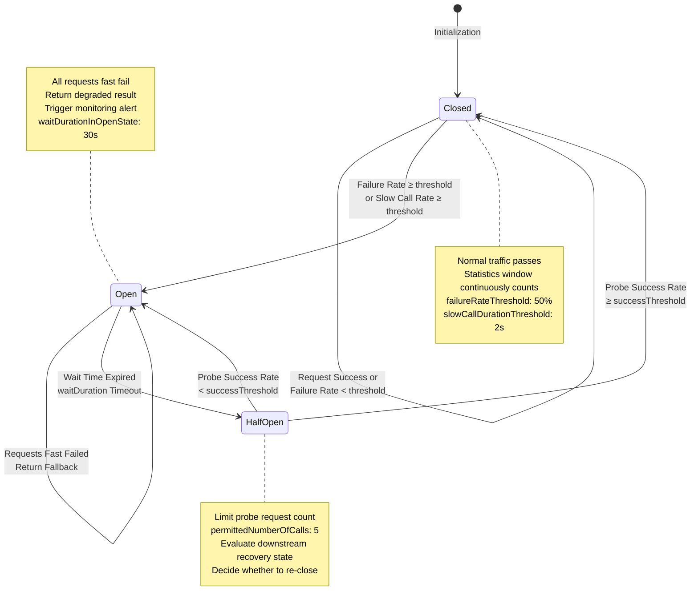

# Circuit Breaker and Backpressure Analysis

> **Stage**: TECH-STACK | **Prerequisites**: [Chinese source](../TECH-STACK-STREAMING-POSTGRES-TEMPORAL-KRATOS/04-resilience/04.02-circuit-breaker-backpressure-analysis.md) | **Formalization Level**: L3-L4 | **Last Updated**: 2026-04-22

## 1. Definitions

**Def-TS-04-02-01 (Circuit Breaker)**

A circuit breaker is a fail-fast mechanism in distributed systems, inspired by electrical engineering fuses. When the failure rate of calls to a downstream dependency exceeds a preset threshold, the circuit breaker switches from **Closed** state to **Open** state; subsequent requests are immediately rejected without being passed downstream, thereby preventing faults from continuously consuming system resources and blocking cascading propagation.

Formally, let component \(A\)'s call sequence to component \(B\) be \(\{r_1, r_2, \dots, r_n\}\), where each request \(r_i\)'s result is success (\(s\)) or failure (\(f\)). Define the failure rate within sliding window \(W\) as:

$$
\rho(W) = \frac{|\{r_i \in W \mid \text{result}(r_i) = f\}|}{|W|}
$$

The circuit breaker state transition function \(\sigma: \{\text{Closed}, \text{Open}, \text{Half-Open}\} \times \mathbb{R} \to \{\text{Closed}, \text{Open}, \text{Half-Open}\}\) is defined as:

$$
\sigma(s, \rho) = \begin{cases}
\text{Open} & \text{if } s = \text{Closed} \land \rho \geq \theta_{\text{failure}} \\
\text{Half-Open} & \text{if } s = \text{Open} \land t \geq t_{\text{wait}} \\
\text{Closed} & \text{if } s = \text{Half-Open} \land \rho_{\text{probe}} < \theta_{\text{success}} \\
\text{Open} & \text{if } s = \text{Half-Open} \land \rho_{\text{probe}} \geq \theta_{\text{success}}
\end{cases}
$$

where \(\theta_{\text{failure}}\) is the failure rate threshold, \(t_{\text{wait}}\) is the Open state cooling duration, \(\rho_{\text{probe}}\) is the probe request failure rate, and \(\theta_{\text{success}}\) is the half-open state success threshold.

**Def-TS-04-02-02 (Backpressure)**

Backpressure is a bottom-up flow control mechanism in stream processing systems: when a downstream component's processing rate is lower than an upstream component's production rate, downstream blocks, slows down, or reverse-propagates pressure signals upstream, forcing upstream to reduce send rate, thereby avoiding buffer infinite expansion leading to memory overflow or OOM crashes.

Formally, let the data flow link be \(P \to Q \to R\), with each component's processing rates \(\mu_P, \mu_Q, \mu_R\) (unit: record/s), and buffer queue capacities \(B_Q, B_R\). When \(\mu_Q < \mu_P\), \(Q\)'s buffer fill rate satisfies:

$$
\frac{dB_Q}{dt} = \lambda_{\text{in}} - \mu_Q > 0
$$

The backpressure mechanism dynamically converges \(\lambda_{\text{in}}\) to \(\mu_Q\) by reverse-propagating \(B_Q\)'s saturation signal \(s_Q = B_Q / B_Q^{\max}\) upstream:

$$
\lambda_{\text{in}}^{\text{new}} = \lambda_{\text{in}} \cdot \left(1 - \alpha \cdot s_Q\right), \quad \alpha \in (0, 1]
$$

**Def-TS-04-02-03 (Half-Open)**

Half-Open is the tentative recovery stage entered by the circuit breaker after the Open state persists for a cooling period. In this state, the circuit breaker only allows a limited number of probe requests (permitted number of calls in half-open state) to evaluate whether the downstream dependency has returned to normal. If probe request success rate meets the threshold, the state falls back to Closed; otherwise, it switches back to Open.

Formally, let the number of probe requests allowed in Half-Open state be \(N_{\text{probe}}\), with \(N_{\text{success}}\) successes; then the Half-Open state judgment conditions are:

$$
\text{Transition}(\text{Half-Open} \to \text{Closed}) \iff \frac{N_{\text{success}}}{N_{\text{probe}}} \geq 1 - \theta_{\text{failure}}
$$

$$
\text{Transition}(\text{Half-Open} \to \text{Open}) \iff \frac{N_{\text{success}}}{N_{\text{probe}}} < 1 - \theta_{\text{failure}}
$$

**Def-TS-04-02-04 (Degradation)**

Degradation is an elasticity strategy where the system proactively sacrifices non-core functions or reduces service quality when facing overload or partial dependency failure, to ensure core links remain available. Degradation can be divided into **active degradation** (triggered based on preset policies) and **passive degradation** (forced service reduction due to resource exhaustion).

Formally, let the system function set be \(\mathcal{F} = \{f_1, f_2, \dots, f_m\}\), with each function \(f_i\) associated with importance weight \(w_i \in [0, 1]\) and resource consumption \(c_i > 0\). Degradation strategy \(\mathcal{D}\) is a subset selection of the function set:

$$
\mathcal{D}(C_{\text{avail}}) = \arg\max_{F' \subseteq \mathcal{F}} \sum_{f_i \in F'} w_i \quad \text{s.t.} \quad \sum_{f_i \in F'} c_i \leq C_{\text{avail}}
$$

where \(C_{\text{avail}}\) is the current available resource capacity. Fast failure after circuit breaker triggering (returning cache/default values) is a typical passive degradation implementation.

**Def-TS-04-02-05 (Cascading Failure)**

Cascading failure is the phenomenon in distributed systems where a single component's fault diffuses layer by layer through dependency chains, ultimately causing system-level paralysis far exceeding the initial fault point. Its root cause is the lack of effective fault isolation and traffic throttling mechanisms between components.

Formally, let the system dependency graph be a directed graph \(G = (V, E)\), with each node \(v \in V\)'s health state \(h(v) \in \{0, 1\}\) (0 indicates fault, 1 indicates healthy). The cascading propagation operator \(\mathcal{C}: V \to 2^V\) is defined as:

$$
\mathcal{C}(v_0) = \{v_j \in V \mid \exists \text{ path } v_0 \to v_1 \to \dots \to v_j \text{ s.t. } \forall i < j: h(v_i) = 0 \Rightarrow h(v_j) = 0\}
$$

That is, the closure of nodes that successively fail through dependency paths due to node \(v_0\)'s fault. The system's resistance to cascading failures is inversely proportional to \(\max_{v_0} |\mathcal{C}(v_0)|\).

---

## 2. Properties

**Lemma-TS-04-02-01 (Circuit Breaker State Transition Reachability)**

In the circuit breaker state machine \(\mathcal{M} = (S, \Sigma, \delta, s_0)\), state set \(S = \{\text{Closed}, \text{Open}, \text{Half-Open}\}\), initial state \(s_0 = \text{Closed}\), and transition function \(\delta\) defined by Def-TS-04-02-01. Then:

1. **Closed reachable Open**: \(\exists \rho \geq \theta_{\text{failure}}: \delta(\text{Closed}, \rho) = \text{Open}\)
2. **Open reachable Half-Open**: \(\forall t \geq t_{\text{wait}}: \delta(\text{Open}, t) = \text{Half-Open}\)
3. **Half-Open reachable Closed**: \(\exists \rho_{\text{probe}} < \theta_{\text{success}}: \delta(\text{Half-Open}, \rho_{\text{probe}}) = \text{Closed}\)
4. **No immediate fallback from Half-Open to Closed except self-loop**: Returning from Half-Open to Closed requires evaluation of at least \(N_{\text{probe}}\) probe requests.

*Proof Sketch*:

- Property 1: By failure rate threshold definition, when failure samples in the window reach the threshold, the transition is triggered; the condition is satisfiable.
- Property 2: Open state transition is time-driven (not event-driven); cooling timer unconditionally enters Half-Open upon expiration.
- Property 3: When probe success rate is higher than the threshold, the system judges downstream as recovered, allowing state fallback.
- Property 4: By Half-Open state semantic definition, sufficient probe samples must be collected to make a statistically significant state decision, preventing frequent switching (flapping) due to transient jitter. \(\square\)

**Lemma-TS-04-02-02 (Backpressure Propagation Monotonicity)**

Let the stream processing link be \(C_1 \to C_2 \to \dots \to C_n\), with each component \(C_i\)'s input rate \(\lambda_i\), output rate \(\mu_i\), and buffer saturation \(s_i \in [0, 1]\). If component \(C_k\) becomes a bottleneck (i.e., \(\mu_k < \lambda_k\)), then when the backpressure signal propagates upstream, each component's input rate satisfies monotonic non-increase:

$$
\lambda_1^{\text{new}} \leq \lambda_1, \quad \lambda_2^{\text{new}} \leq \lambda_2, \quad \dots, \quad \lambda_k^{\text{new}} \leq \lambda_k
$$

And the bottleneck point's buffer saturation \(s_k\) after backpressure takes effect satisfies:

$$
\frac{ds_k}{dt} \leq 0 \quad \text{(when backpressure fully takes effect)}
$$

*Proof Sketch*:
The essence of backpressure mechanism is rate matching. Let the backpressure transfer function be \(g(s) = 1 - \alpha s\), where \(\alpha \in (0, 1]\). For any upstream component \(C_i\) (\(i < k\)), its output rate is constrained by downstream buffer saturation:

$$
\lambda_{i+1} = \mu_i \cdot g(s_{i+1})
$$

Since \(g(s) \leq 1\), \(\lambda_{i+1} \leq \mu_i\); recursively propagating upward yields monotonic non-increase. When backpressure fully takes effect, the entire link's throughput converges to the bottleneck rate \(\mu_k\); at this point \(ds_k/dt = \lambda_k^{\text{new}} - \mu_k = 0\), and the buffer stops growing. \(\square\)

**Prop-TS-04-02-01 (Circuit Breaker Variance Reduction Effect on Request Latency)**

Let the request latency distribution to the failing downstream without circuit breaker be \(D_{\text{no-cb}}\), with expectation \(\mathbb{E}[D_{\text{no-cb}}]\) and variance \(\text{Var}(D_{\text{no-cb}})\). After introducing the circuit breaker, the latency distribution becomes a mixed distribution:

$$
D_{\text{cb}} = \begin{cases}
D_{\text{fast-fail}} & \text{prob } p_{\text{open}} \\
D_{\text{normal}} & \text{prob } 1 - p_{\text{open}}
\end{cases}
$$

where \(D_{\text{fast-fail}}\) is the instant failure latency when the circuit breaker is open (approximately constant \(\tau_{\text{fail}} \ll \tau_{\text{timeout}}\)), and \(p_{\text{open}}\) is the probability that the circuit breaker is in Open state. Then:

$$
\text{Var}(D_{\text{cb}}) \leq \text{Var}(D_{\text{no-cb}})
$$

*Proof Sketch*: Without circuit breaker, requests to the failing downstream experience complete timeout waits (possibly multiple retries), causing the latency distribution to exhibit a long tail (heavy tail), with extremely large variance. The circuit breaker truncates these long-tail requests to a fixed short latency; although it introduces discreteness, due to the concentration of \(\tau_{\text{fail}}\), overall variance is significantly reduced. According to the law of total variance:

$$
\text{Var}(D_{\text{cb}}) = \mathbb{E}[\text{Var}(D_{\text{cb}} \mid \text{state})] + \text{Var}(\mathbb{E}[D_{\text{cb}} \mid \text{state}])
$$

The first term is controlled by the boundedness of conditional variance; the second term is the dispersion of two-state means; but their sum is still far less than the unconstrained long-tail variance under timeout. \(\square\)

---

## 3. Relations

### 3.1 Relationship Between Circuit Breaker and Retry

Circuit breaker and retry are a pair of **complementary and synergistically configured** resilience patterns. Retry aims to handle transient failures by repeating requests to improve success probability; circuit breaker aims to handle persistent failures by fast-failing to prevent resource waste.

If there is only retry without circuit breaker, the system faces a **retry storm** when facing persistent failures: the failing service's load is amplified \(k\) times (\(k\) is the retry count), accelerating cascading failure formation (see `04.03-bulkhead-retry-isolation-patterns.md`).

If there is only circuit breaker without retry, the system has insufficient fault tolerance for network jitter, transient timeouts, and other recoverable failures, leading to unnecessary availability loss.

**Synergy Strategy**: Allow limited retries (typically \(k \leq 3\)) when the circuit breaker is in Closed state, with exponential backoff and jitter; when the circuit breaker enters Open state, all requests directly follow degradation logic without passing any traffic downstream.

### 3.2 Relationship Between Circuit Breaker and Timeout

Timeout is the **input signal source** for circuit breaker state evaluation. The circuit breaker counts "failed" requests within the statistics window, usually triggered by timeouts, connection rejections, 5xx errors, etc. If timeout is set too short (aggressive timeout), normal but slow requests may be misjudged as failures, causing false circuit breaker triggers; if timeout is set too long (lenient timeout), failing requests occupy resources for a long time, delaying circuit breaker trigger timing.

**Synergy Strategy**: Timeout threshold should be set to 2~3 times the downstream service P99 latency; simultaneously, the circuit breaker failure rate threshold should be dynamically adjusted combining timeout event proportion. In Resilience4j, `CircuitBreakerConfig` can precisely determine which exception types count toward failure statistics via the `recordException` predicate.

### 3.3 Relationship Between Circuit Breaker and Bulkhead

Bulkhead isolates faults from the **resource dimension**, while the circuit breaker blocks faults from the **call dimension**. Combined, they achieve defense in depth:

- **Bulkhead limits concurrency**: Even if the circuit breaker fails to trigger in time (e.g., failure rate has not yet reached the threshold), bulkhead prevents thread pool / connection pool exhaustion by limiting concurrent calls to downstream.
- **Circuit breaker fast fails**: Even if bulkhead capacity still remains, the circuit breaker immediately rejects requests when persistent faults are detected, avoiding invalid waits.

In the five-technology-stack combination, Kratos's gRPC client can simultaneously configure **semaphore bulkhead** (limiting concurrent request count) and **circuit breaker** (fuse based on failure rate), forming dual-layer protection.

### 3.4 Relationship Matrix

| Pattern Combination | Synergy Effect | Risk |
|--------------------|----------------|------|
| Circuit Breaker + Retry | Covers both transient and persistent faults | Retry storm if uncontrolled |
| Circuit Breaker + Timeout | Precise failure determination | Timeout threshold drift leads to misjudgment |
| Circuit Breaker + Bulkhead | Resource + call dual-dimension isolation | High configuration complexity |
| All Three Combined | Maximizes resilience capability | High monitoring and tuning costs |

---

## 4. Argumentation

### 4.1 Cross-Component Circuit Breaker Design

In the five-technology-stack combination (Kratos + Temporal + Flink + Kafka + PostgreSQL 18), circuit breakers need to be deployed at three key cross-component boundaries:

#### Boundary A: Kratos → Temporal (gRPC Call Failure Circuit Breaker)

Kratos, as a Go microservices framework, initiates workflow execution requests through the Temporal SDK. When Temporal Server's gRPC response latency surges due to overload or Shard migration, the Kratos client-side circuit breaker should trigger.

**Trigger Conditions**:

- Failure rate threshold: \(\theta_{\text{failure}} = 50\%\)
- Sliding window: last 100 calls
- Slow call threshold: \(\tau_{\text{slow}} = 2\text{s}\) (exceeding is treated as failure)
- Open state cooling: \(t_{\text{wait}} = 30\text{s}\)

**Degradation Strategy**: After circuit breaker opens, Kratos returns HTTP 503 + `Retry-After: 30` header; frontend enters queuing state; simultaneously asynchronously writes requests to local persistent queue, submitting in bulk through compensation tasks after Temporal recovers.

#### Boundary B: Flink → Kafka (Producer Buffer Full Circuit Breaker)

Flink Kafka Sink internally maintains a producer buffer. When Kafka Broker's write rate drops due to disk IO bottleneck or partition leader switch, buffer fill rate rises, triggering Flink backpressure. If backpressure persists and the buffer approaches its limit, the Flink task should trigger a **data source-level circuit breaker**, pausing data ingestion.

**Trigger Conditions**:

- `buffer.memory` usage rate \(\geq 90\%\) for 60s
- Or `RecordAccumulator` pending batch count \(\geq 10000\)

**Degradation Strategy**: Pause Kafka Source pull, trigger Flink Savepoint to persist job state; simultaneously send CRITICAL alert to monitoring system.

#### Boundary C: Kafka → PG18 (Debezium Consumption Lag Triggers Backpressure)

Debezium Connector reads WAL changes from PostgreSQL 18's logical replication slot and writes to Kafka. When Kafka Broker is not writable or Consumer consumption lags, Debezium's LSN (Log Sequence Number) advancement is blocked, forcing PG18's replication slot to retain more WAL segments.

**Trigger Conditions**:

- Kafka Producer send failure rate \(\geq 30\%\)
- Or Debezium `streaming_lag` metric \(\geq 5\text{min}\)

**Degradation Strategy**: Debezium pauses incremental capture, switches to **snapshot mode** or temporarily disconnects the replication slot connection, preventing PG18 WAL infinite expansion.

### 4.2 Backpressure Propagation Chain Analysis

Backpressure in the five technology stacks is not an isolated event, but a **reverse pressure chain** propagating from Flink all the way to PG18 WAL:

**Flink Backpressure → Kafka Consumer Lag Growth → Debezium Replication Slot LSN Lag → PG18 WAL Accumulation Risk**

Specific manifestations at each link:

1. **Flink Job Internal Backpressure**: An operator (e.g., window aggregation) experiences decreased processing rate due to data skew; Flink's Credit-Based flow control backpressures upstream, `backPressuredTimeMsPerSecond` metric rises.

2. **Kafka Consumer Lag Growth**: If Flink acts as Kafka Consumer, its backpressure manifests as decreased `records-consumed-rate`, and Consumer Lag (`kafka.consumer.lag`) continuously accumulates. Lag growth means Kafka Broker needs to retain more log segments, increasing disk pressure.

3. **Debezium Replication Slot LSN Lag**: Debezium, as PG18's replication client, has its consumption rate limited by downstream Kafka throughput. When Kafka write slows, Debezium's acknowledged LSN advancement slows, and PG18's replication slot cannot release processed WAL segments.

4. **PG18 WAL Accumulation Risk**: PG18's WAL files continue to generate (especially in batch write scenarios); if the replication slot lags long-term and `max_slot_wal_keep_size` limit is not set, WAL files will fill the disk, causing the database to enter **read-only mode** or crash.

### 4.3 Quantitative Argument: Overload Scenario Cascading Failure Simulation (Based on Queuing Theory Model)

To quantify cascading failure risk on the backpressure chain, we establish a simplified model based on M/M/1 queuing theory.

**Model Assumptions**:

- Each component \(C_i\) is modeled as an M/M/1 queue, with service rate \(\mu_i\) and arrival rate \(\lambda_i\)
- Inter-component buffer capacity is finite; overflow triggers backpressure or packet loss
- At system steady state, utilization \(\rho_i = \lambda_i / \mu_i\)

**Latency Explosion Condition**:

M/M/1 queue average waiting time is:

$$
W_i = \frac{1}{\mu_i - \lambda_i} = \frac{1}{\mu_i(1 - \rho_i)}
$$

When \(\rho_i \to 1\), \(W_i \to \infty\), i.e., latency explosion. For serial link \(C_1 \to C_2 \to C_3\), end-to-end latency is:

$$
W_{\text{total}} = \sum_{i=1}^{3} W_i = \sum_{i=1}^{3} \frac{1}{\mu_i(1 - \rho_i)}
$$

If \(C_2\) is the bottleneck (\(\mu_2 < \mu_1\) and \(\mu_2 < \mu_3\)), then \(\rho_2\) first approaches 1, causing \(W_2\) to increase sharply. Since Flink's backpressure propagates upstream, \(C_1\)'s effective arrival rate is limited to \(\lambda_1^{\text{new}} = \mu_2\); at this point:

$$
W_{\text{total}}^{\text{with-backpressure}} = \frac{1}{\mu_1(1 - \mu_2/\mu_1)} + \frac{1}{\mu_2(1 - \mu_2/\mu_2 - \epsilon)} + \frac{1}{\mu_3(1 - \mu_2/\mu_3)}
$$

Note that the second term diverges as the denominator approaches 0. But in actual Flink systems, backpressure prevents \(\rho_2\) from reaching 1; through the Credit-Based mechanism, \(\lambda_2\) is strictly limited to slightly below \(\mu_2\), thereby avoiding true latency explosion.

**Key Insight**: The backpressure mechanism pulls the system from the **latency explosion zone** (\(\rho \to 1\)) back to the **stable operation zone** (\(\rho \leq \rho_{\text{target}}\)), where \(\rho_{\text{target}}\) is dynamically regulated by Flink's `outPoolUsage` and `inPoolUsage`. Without backpressure, relying solely on buffer absorption, after buffer exhaustion the system would experience **throughput collapse**, at which point cascading failure is inevitable.

### 4.4 PG18 `max_slot_wal_keep_size` as the Last Line of Defense Against Backpressure

PostgreSQL 16+ introduced the `max_slot_wal_keep_size` parameter to limit the total size of WAL files that logical replication slots can retain. When WAL accumulation caused by replication slot lag exceeds this threshold, PG **forcibly disconnects the replication connection**, releasing WAL files.

In our five technology stacks, the recommended configuration is:

```
max_slot_wal_keep_size = '10GB'
```

The strategic significance of this configuration:

- **Prevent disk exhaustion**: Even if all upstream mechanisms in the backpressure chain fail, PG18 still retains self-protection capability, not crashing due to WAL expansion.
- **Trigger external alerts**: After forced replication disconnection, Debezium throws connection exceptions, triggering monitoring alerts to notify operations intervention.
- **Recoverable fault**: After disconnection, Debezium can re-establish the replication connection based on persisted LSN, although it will experience brief data replay, without causing data loss (provided `wal_level = logical` and `max_replication_slots` is sufficient).

**Risk**: If `max_slot_wal_keep_size` is set too small (e.g., 1GB), during batch write peaks it may frequently trigger replication slot disconnection, causing Debezium to continuously reconnect and producing unnecessary jitter. 10GB is a conservative value verified in production environments, tolerating approximately 30~60 minutes of replication lag (depending on WAL generation rate).

---

## 5. Proof / Engineering Argument

**Thm-TS-04-02-01 (Effectiveness of Circuit Breaker in Preventing Cascading Failures)**

Let a distributed system be composed of component set \(\mathcal{C} = \{C_1, C_2, \dots, C_n\}\), with dependency relations as directed acyclic graph \(G = (\mathcal{C}, E)\). Let component \(C_1\) fail; its fault propagation follows these rules:

- If component \(C_j\)'s direct upstream \(C_i\) fails and \(C_j\) has no circuit breaker configured, then \(C_j\) fails due to resource exhaustion within \(T_{\text{overload}}\) time.
- If \(C_j\) has a circuit breaker configured, then after detecting \(C_i\)'s failure, \(C_j\) cuts off calls to \(C_i\) within \(T_{\text{detect}}\) time, entering degradation mode.

Then: the cascading failure impact scope of a system with circuit breakers configured is strictly smaller than that of a system without circuit breakers.

*Proof*:

Define fault propagation time function \(T_{\text{cascade}}(v_0, v_k)\) as the time required from fault source \(v_0\) to propagate to node \(v_k\). For a path without circuit breakers \(v_0 \to v_1 \to \dots \to v_k\):

$$
T_{\text{cascade}}^{\text{no-cb}}(v_0, v_k) = \sum_{i=0}^{k-1} T_{\text{overload}} = k \cdot T_{\text{overload}}
$$

That is, faults propagate along the dependency chain at a constant rate; the final impact scope is \(|\mathcal{C}(v_0)| = |V_{\text{reachable}}(v_0)|\).

For a path with circuit breakers configured, let the circuit breaker be between \(C_i\) and \(C_{i+1}\). When \(C_i\) fails, \(C_{i+1}\)'s circuit breaker triggers within \(T_{\text{detect}}\) (\(T_{\text{detect}} \ll T_{\text{overload}}\), because circuit breakers are based on sliding window statistics, typically only requiring a few failures to trigger, while resource exhaustion requires accumulating a large number of concurrent requests). After circuit breaker triggers, \(C_{i+1}\) no longer sends requests to \(C_i\), instead executing degradation logic and maintaining its own healthy state.

Therefore, fault propagation is blocked at the circuit breaker:

$$
T_{\text{cascade}}^{\text{cb}}(v_0, v_{i+1}) = \sum_{j=0}^{i-1} T_{\text{overload}} + T_{\text{detect}}
$$

But \(C_{i+1}\) itself does not fail due to \(C_i\)'s fault; hence for any \(v_k\) (\(k > i+1\)):

$$
T_{\text{cascade}}^{\text{cb}}(v_0, v_k) = \infty \quad \text{(i.e., unreachable)}
$$

Thus:

$$
|\mathcal{C}^{\text{cb}}(v_0)| < |\mathcal{C}^{\text{no-cb}}(v_0)|
$$

More precisely, if circuit breakers are configured on every edge, the cascading failure impact scope is limited to a single hop:

$$
|\mathcal{C}^{\text{cb-all}}(v_0)| = 1
$$

That is, only the fault source itself is affected, achieving ideal fault isolation. \(\square\)

**Engineering Corollary**:

1. Circuit breaker detection speed \(T_{\text{detect}}\) is the key parameter. Resilience4j's default sliding window size is 100; if request rate is 1000 RPS, the worst-case trigger time is 100ms. In contrast, thread pool exhaustion typically requires several seconds to tens of seconds.

2. Circuit breakers are not panaceas: if the fault is **capacity-type** (e.g., traffic surge causing all instances to be overloaded) rather than **dependency-type** (e.g., downstream service completely unavailable), circuit breakers cannot provide protection; at this point, rate limiting and automatic scaling are needed.

3. In the five technology stacks, the Kratos → Temporal boundary circuit breaker is the most critical for preventing cascading failures, because the Temporal workflow engine is the orchestration core; its failure will diffuse through the Saga call chain to all participating services.

---

## 6. Examples

### 6.1 Resilience4j Circuit Breaker Configuration Example

```java
import io.github.resilience4j.circuitbreaker.CircuitBreakerConfig;
import io.github.resilience4j.circuitbreaker.CircuitBreaker;
import java.time.Duration;

// Circuit breaker configuration for Kratos -> Temporal gRPC calls
CircuitBreakerConfig config = CircuitBreakerConfig.custom()
    // Failure rate threshold: 50% triggers circuit breaker
    .failureRateThreshold(50)
    // Slow call threshold: exceeding 2s is treated as failure
    .slowCallRateThreshold(80)
    .slowCallDurationThreshold(Duration.ofSeconds(2))
    // Open state lasts 30s before entering Half-Open
    .waitDurationInOpenState(Duration.ofSeconds(30))
    // Half-Open state allows 5 probe requests
    .permittedNumberOfCallsInHalfOpenState(5)
    // Sliding window: count-based window, size 100
    .slidingWindowType(CircuitBreakerConfig.SlidingWindowType.COUNT_BASED)
    .slidingWindowSize(100)
    // Minimum call count: at least 10 calls in window before statistics begin
    .minimumNumberOfCalls(10)
    // Auto transition from Open to Half-Open (no external trigger needed)
    .automaticTransitionFromOpenToHalfOpenEnabled(true)
    // Ignored exceptions (not counted in failure statistics)
    .ignoreExceptions(IllegalArgumentException.class)
    .build();

CircuitBreaker circuitBreaker = CircuitBreaker.of("temporal-grpc", config);
```

**Configuration Interpretation**:

- `failureRateThreshold(50)`: In production, if downstream Temporal's availability requirement is 99.9%, then 50% failure rate means the service is severely degraded; circuit breaking is necessary.
- `waitDurationInOpenState(30s)`: 30 seconds is the typical recovery time for Temporal Server from overload (considering Shard rebalancing and cache warmup).
- `permittedNumberOfCallsInHalfOpenState(5)`: 5 probe requests are sufficient to statistically evaluate recovery (based on binomial distribution, at least 3 successes out of 5 can determine recovery).

### 6.2 Flink Backpressure Monitoring PromQL Example

```promql
# Operator-level backpressure time ratio (milliseconds per second in backpressure state)
flink_taskmanager_job_task_backPressuredTimeMsPerSecond

# Output buffer pool usage rate (> 0.5 indicates backpressure risk)
flink_taskmanager_job_task_operator_numRecordsInPerSecond
  / on(task_id, subtask_index)
flink_taskmanager_job_task_operator_numRecordsOutPerSecond

# Network buffer pool usage rate (underlying backpressure indicator)
flink_taskmanager_network_total_buffer_count
  - flink_taskmanager_network_available_buffer_count

# Backpressure alert rule: backpressure time ratio > 500ms/s for 2 minutes
ALERT FlinkBackpressureCritical
  IF flink_taskmanager_job_task_backPressuredTimeMsPerSecond > 500
  FOR 2m
  LABELS { severity = "critical" }
  ANNOTATIONS {
    summary = "Flink task {{ $labels.task_name }} is experiencing severe backpressure",
    description = "Backpressure time {{ $value }}ms/s exceeds threshold 500ms/s for 2 minutes."
  }
```

**Monitoring Key Points**:

- `backPressuredTimeMsPerSecond` approaching 1000 indicates the operator is almost completely blocked; immediate investigation of data skew or resource insufficiency is needed.
- `outPoolUsage` and `inPoolUsage` are Flink 1.17+'s network-layer backpressure indicators, precisely locating backpressure sources (high outPoolUsage at sink end, high inPoolUsage at source end).

### 6.3 Kafka Consumer Lag Alert Threshold Configuration

```yaml
# Alertmanager alert rules: Kafka Consumer Lag
groups:
  - name: kafka-consumer-lag
    rules:
      - alert: KafkaConsumerLagHigh
        expr: |
          kafka_consumer_group_lag
            > on(group, topic) group_left() (
              kafka_topic_partition_count * 10000
            )
        for: 5m
        labels:
          severity: warning
        annotations:
          summary: "Kafka consumer group {{ $labels.group }} lag is high"
          description: |
            Consumer group {{ $labels.group }} on topic {{ $labels.topic }}
            has lag {{ $value }} exceeding threshold
            {{ kafka_topic_partition_count * 10000 }}.

      - alert: KafkaConsumerLagCritical
        expr: |
          kafka_consumer_group_lag
            > on(group, topic) group_left() (
              kafka_topic_partition_count * 50000
            )
        for: 2m
        labels:
          severity: critical
        annotations:
          summary: "Kafka consumer group {{ $labels.group }} lag is critical"
          description: |
            Consumer group {{ $labels.group }} on topic {{ $labels.topic }}
            has critical lag {{ $value }}.
            Risk of PG18 WAL accumulation due to Debezium slowdown.
```

**Threshold Design Logic**:

- Warning threshold: 10000 messages lag per partition. For a 12-partition topic, total lag threshold is 120000. This threshold corresponds to approximately 5~10 minutes of normal consumption delay.
- Critical threshold: 50000 messages lag per partition. When this threshold is reached, Debezium's replication slot lag has exceeded 30 minutes, and PG18 WAL expansion risk is extremely high; immediate human intervention or automatic degradation must be triggered.

### 6.4 PG18 WAL Protection Configuration Verification

```sql
-- View replication slot status and WAL retention
SELECT
    slot_name,
    plugin,
    slot_type,
    confirmed_flush_lsn,
    pg_size_pretty(pg_wal_lsn_diff(pg_current_wal_lsn(), restart_lsn)) AS retained_wal
FROM pg_replication_slots;

-- View max_slot_wal_keep_size configuration
SHOW max_slot_wal_keep_size;
-- Expected output: 10GB

-- View WAL file statistics
SELECT
    count(*) AS wal_file_count,
    pg_size_pretty(count(*) * 16 * 1024 * 1024) AS total_wal_size
FROM pg_ls_waldir();
```

**Operations Checklist**:

- [ ] `max_slot_wal_keep_size` is set to 10GB
- [ ] All logical replication slots' `retained_wal` is less than 5GB (leaving 50% safety margin)
- [ ] Debezium Connector's `heartbeat.interval.ms` is configured (ensuring idle tables still generate heartbeats to advance LSN)
- [ ] Monitoring alerts cover `pg_replication_slots` `retained_wal` metrics

---

## 7. Visualizations

### 7.1 Backpressure Propagation Chain

The following diagram shows the backpressure reverse propagation chain from Flink to PG18 in the five-technology-stack combination, and the monitoring indicators and protection mechanisms at each link.


**Figure Note**: Green nodes are backpressure origins; yellow are intermediate propagation nodes; red is the final pressure-bearing node (PG18 WAL). Dashed arrows indicate reverse pressure propagation direction. Flink's Credit-Based flow control is the source throttle valve of the entire chain.

### 7.2 Circuit Breaker State Machine

The following state diagram shows the Resilience4j-style three-state circuit breaker model, including transition conditions and staying behaviors between states.



**Figure Note**: The core design philosophy of the circuit breaker is "fast fail, slow recover". The transition from Closed to Open is condition-driven (based on failure rate statistics); the recovery path from Open to Half-Open to Closed is a combination of time-driven and condition-driven, preventing the system from being overwhelmed by full traffic immediately after recovery.

---

### 3.5 Project Knowledge Base Cross-References

The circuit breaker and backpressure analysis described in this document relates to the existing project knowledge base as follows:

- [Backpressure and Flow Control](../Flink/02-core/backpressure-and-flow-control.md) — Detailed mechanisms of Flink Credit-based flow control and Credit-based backpressure propagation
- [High Availability Patterns](../Knowledge/07-best-practices/07.06-high-availability-patterns.md) — Combined high availability design of circuit breaker, bulkhead, and retry patterns
- [Checkpoint Mechanism Deep Dive](../Flink/02-core/checkpoint-mechanism-deep-dive.md) — Analysis of fault scenarios where Checkpoint timeout couples with backpressure
- [Troubleshooting Guide](../Knowledge/07-best-practices/07.03-troubleshooting-guide.md) — Production problem diagnosis methods related to backpressure and circuit breakers

---

## 8. References
