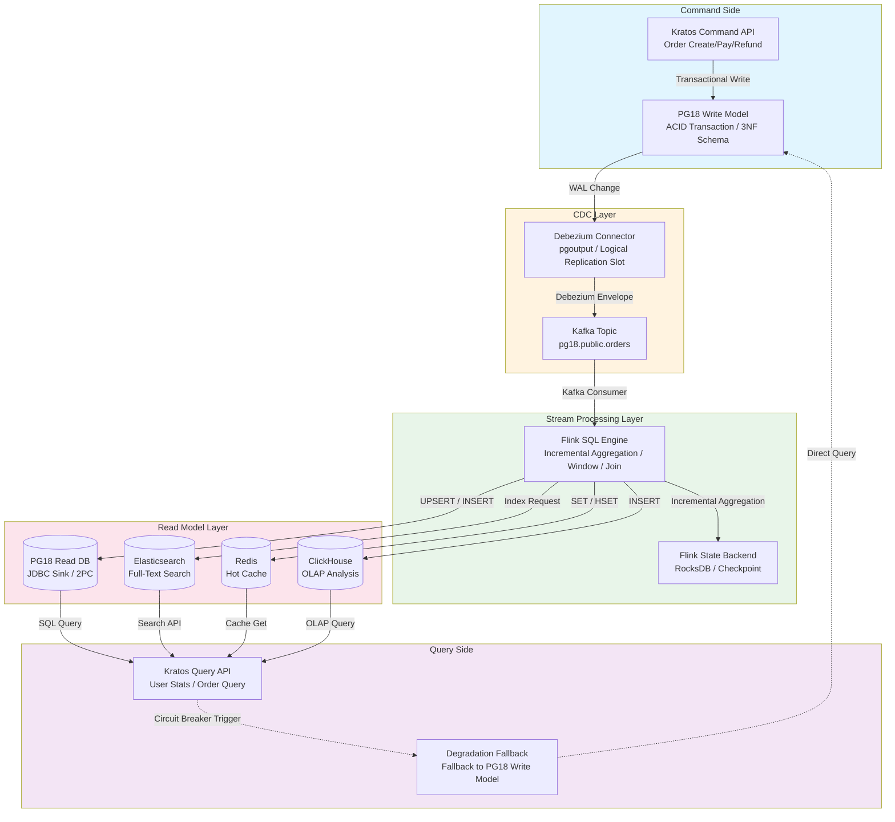

# CQRS + Streaming Read Model Construction

> **Stage**: TECH-STACK | **Prerequisites**: [Chinese source](../TECH-STACK-STREAMING-POSTGRES-TEMPORAL-KRATOS/03-integration/03.05-cqrs-streaming-read-model.md) | **Formalization Level**: L3-L4 | **Last Updated**: 2026-04-22

## 1. Definitions

**Def-T-03-05-01 (CQRS)**. **Command Query Responsibility Segregation (CQRS)** is an architectural pattern that explicitly separates the model and processing paths for data modification operations (Commands) and data read operations (Queries). Let system state be \(S\), command set be \(C\), and query set be \(Q\). Then CQRS requires two independent projection functions:

\[
\begin{aligned}
\text{write}: S \times C &\to S' \\
\text{read}: S_{\text{read}} \times Q &\to R
\end{aligned}
\]

where \(S_{\text{read}}\) is the read model state, usually \(S_{\text{read}} \neq S\) (i.e., read model and write model are decoupled in physical storage or logical structure).

**Def-T-03-05-02 (Command and Query)**. **Command** is an operation that causes system side effects, with semantics \(c: S \to S'\); after execution, it does not directly return business data, only execution results (success/failure/transaction ID). **Query** is a side-effect-free read-only operation, with semantics \(q: S_{\text{read}} \to R\), satisfying idempotency \(q(s) = q(s)\) (multiple queries on the same state yield consistent results).

**Def-T-03-05-03 (Materialized View)**. **Materialized View** is a persistent cache of query results on physical storage. Let base table be \(T\) and query be \(Q\). Then materialized view \(MV_Q\) satisfies:

\[
MV_Q(t) = Q(T(t))
\]

where \(t\) is the timestamp. In streaming scenarios, \(MV_Q\) is incrementally updated with \(T\)'s change stream, rather than fully recalculated.

**Def-T-03-05-04 (Read Model)**. **Read Model** is a data projection built specifically for query optimization; its schema is driven by query patterns and decoupled from the write model's (command model's) normalized schema. The read model allows redundancy, denormalization, and pre-aggregation to trade for query performance. In streaming CQRS architecture, the read model is continuously maintained by stream processing engines such as Flink.

**Def-T-03-05-05 (Streaming Read Model)**. **Streaming Read Model** refers to a materialized view that is incrementally updated through an event stream (Event Stream); its update latency is limited by the stream processing system's throughput and fault-tolerance mechanisms. Let the change event stream be \(E = \{e_1, e_2, \ldots\}\) and the read model update function be \(f\). Then the read model state at time \(t\) is:

\[
R(t) = f\left(R(t_0), \{e_i \mid t_0 < \text{ts}(e_i) \leq t\}\right)
\]

where \(f\) is typically implemented by Flink's `CREATE TABLE ... AS SELECT` (CTAS) or `INSERT INTO` statements.

## 2. Properties

**Lemma-T-03-05-01 (Consistency Delay Upper Bound After Read-Write Separation)**. In streaming CQRS architecture, let the write model transaction commit time be \(t_w\), the time when Debezium captures and emits CDC events to Kafka be \(t_c\), and the time when Flink consumes events and updates the read model be \(t_r\). Then the read model consistency delay \(\Delta\) satisfies:

\[
\Delta = t_r - t_w \leq \Delta_{\text{pg}} + \Delta_{\text{debezium}} + \Delta_{\text{kafka}} + \Delta_{\text{flink}}
\]

where:

- \(\Delta_{\text{pg}}\): PG18 transaction commit to WAL write delay (microsecond-level)
- \(\Delta_{\text{debezium}}\): Debezium polling or streaming WAL read delay (millisecond-level)
- \(\Delta_{\text{kafka}}\): Kafka end-to-end transmission delay (millisecond-level, affected by `linger.ms` and network)
- \(\Delta_{\text{flink}}\): Flink processing delay (millisecond to second-level, affected by checkpoint period and backpressure)

**Proof Sketch**. Each stage is a serial pipeline; total delay is the sum of each stage's delay upper bound. Since each component runs independently with no negative feedback loop, the upper bound can be directly summed. \(\square\)

**Prop-T-03-05-01 (Eventual Consistency Guarantee)**. If the write model PG18 satisfies ACID, Debezium precisely captures all changes (no loss, no duplication), Kafka provides at-least-once delivery, and Flink enables checkpoint with two-phase commit (2PC) or idempotent writing, then the read model and write model satisfy **eventual consistency**:

\[
\forall t. \exists T \geq t. \quad R(T) = Q(S(T))
\]

That is, for any time \(t\), there exists finite time \(T\) such that read model state \(R(T)\) equals the write model state projected through query \(Q\).

## 3. Relations

### 3.1 CQRS and Event Sourcing

CQRS is often combined with **Event Sourcing**, but the two are orthogonal:

- **Event Sourcing** determines the persistence form of the write model (event sequence instead of state snapshots).
- **CQRS** determines the separation of read and write paths.

In this architecture, the write model adopts **state storage** (PG18 tables), not Event Sourcing. CDC (Debezium) plays the role of "state → event" converter, equivalent to deriving an event stream from state storage. Therefore, this architecture is a combination of **CQRS + state storage + CDC**, and the write side does not need to explicitly generate domain events.

### 3.2 CQRS and CDC

CDC is the "nerve bundle" between CQRS read and write models. Debezium captures PG18's WAL changes, converting row-level `INSERT`/`UPDATE`/`DELETE` into Kafka messages, thereby asynchronously synchronizing the read model without intruding into the write model's business logic. CDC enables the CQRS read model to "listen" to the write model rather than polling.

### 3.3 CQRS and Flink

Flink, as the stream processing engine, assumes the read model's "computation layer":

- **Incremental Aggregation**: Operations such as `COUNT`, `SUM`, `AVG` are incrementally maintained through the state backend (RocksDB).
- **Window Computation**: Tumble/Session/Slide windows support time-dimension read model slicing.
- **Multi-stream Join**: Uses Flink SQL's Temporal Join or Interval Join to build read models with multi-table associations.
- **CTAS Semantics**: Flink's `CREATE TABLE user_stats AS SELECT ...` continuously executes queries and writes results to downstream storage, semantically equivalent to a continuously maintained materialized view.

## 4. Argumentation

### 4.1 PG18 as Write Model (Transactional Writes)

PG18 (PostgreSQL 18) serves as the write model storage, bearing the full transaction load of the command side. Its key characteristics include:

- **ACID Transactions**: Commands such as order creation, inventory deduction, and payment status transitions are guaranteed atomicity and durability through PG18's MVCC and WAL.
- **Logical Replication Slot**: PG18's `pgoutput` plugin provides a stable event stream interface for Debezium, ensuring continuity of change capture.
- **Schema Normalization**: The write model follows Third Normal Form (3NF), reducing data redundancy and anomaly risks during writes.

The write model's performance bottleneck is typically not the write itself, but complex queries (e.g., aggregation, Join). CQRS offloads complex queries to the read model built by Flink, thereby protecting the write model's write throughput.

### 4.2 Debezium CDC Captures Write Model Changes

Debezium PostgreSQL Connector configuration example:

```json
{
  "name": "pg18-orders-connector",
  "config": {
    "connector.class": "io.debezium.connector.postgresql.PostgresConnector",
    "database.hostname": "pg18-primary",
    "database.dbname": "ecommerce",
    "database.server.name": "pg18",
    "table.include.list": "public.orders,public.order_items",
    "plugin.name": "pgoutput",
    "slot.name": "debezium_orders_slot",
    "publication.name": "dbz_publication",
    "snapshot.mode": "initial"
  }
}
```

Debezium converts each row change to a Kafka message in Debezium Envelope format:

```json
{
  "before": null,
  "after": {"id": 1001, "user_id": 42, "amount": 299.00, "status": "PAID", "created_at": "2026-04-22T09:15:00Z"},
  "source": {"version": "2.7", "connector": "postgresql", "ts_ms": 1745282100000},
  "op": "c",
  "ts_ms": 1745282100156
}
```

This message is delivered to Flink via Kafka Topic `pg18.public.orders`.

### 4.3 Flink Real-Time Materialized View Construction

Flink SQL definitions for write model source table and read model target table:

```sql
-- Write model CDC source table
CREATE TABLE orders (
  id BIGINT,
  user_id BIGINT,
  amount DECIMAL(10,2),
  status STRING,
  created_at TIMESTAMP(3),
  PRIMARY KEY (id) NOT ENFORCED
) WITH (
  'connector' = 'kafka',
  'topic' = 'pg18.public.orders',
  'format' = 'debezium-json',
  'properties.bootstrap.servers' = 'kafka:9092',
  'scan.startup.mode' = 'earliest-offset'
);

-- Read model target table: PostgreSQL JDBC Sink (for Kratos queries)
CREATE TABLE user_order_stats (
  user_id BIGINT PRIMARY KEY NOT ENFORCED,
  order_count BIGINT,
  total_amount DECIMAL(16,2),
  last_order_at TIMESTAMP(3)
) WITH (
  'connector' = 'jdbc',
  'url' = 'jdbc:postgresql://pg18-read:5432/readmodel',
  'table-name' = 'user_order_stats',
  'driver' = 'org.postgresql.Driver',
  'username' = 'flink',
  'password' = '***'
);

-- Continuous materialized view: real-time aggregation of user order statistics
INSERT INTO user_order_stats
SELECT
  user_id,
  COUNT(*) AS order_count,
  SUM(amount) AS total_amount,
  MAX(created_at) AS last_order_at
FROM orders
GROUP BY user_id;
```

Flink internally maintains aggregation state for each `user_id` through the `GroupAggregate` operator (stored in RocksDB), achieving incremental updates. When an order CDC event arrives, Flink reads the current state, updates `COUNT` and `SUM`, and outputs the updated row to the downstream JDBC Sink.

For more complex read models, Flink supports:

- **Multi-stream Join**: Associates `orders` with `order_items` to calculate user consumption distribution by category.
- **Window Aggregation**: Calculates platform GMV by day, outputting to ClickHouse for time-series analysis.
- **Lookup Join**: Associates `user_id` with user profiles from MySQL/Dimension tables to enrich read model fields.

### 4.4 Kratos Query Service Directly Reads Materialized View

Kratos (Go microservices framework) builds query services that directly access the read model storage output by Flink:

```go
// Kratos query service: user order statistics
func (s *UserStatsService) GetUserOrderStats(ctx context.Context, req *v1.GetUserOrderStatsRequest) (*v1.GetUserOrderStatsReply, error) {
    // Prefer reading Flink materialized view (PostgreSQL read replica)
    stats, err := s.readModelRepo.GetUserStats(ctx, req.UserId)
    if err != nil {
        // Degradation: fallback to write model PG18 when read model is unavailable
        return s.fallbackQueryFromWriteModel(ctx, req.UserId)
    }

    return &v1.GetUserOrderStatsReply{
        UserId:       stats.UserID,
        OrderCount:   stats.OrderCount,
        TotalAmount:  stats.TotalAmount,
        LastOrderAt:  stats.LastOrderAt.Format(time.RFC3339),
        StaleWarning: false,
    }, nil
}
```

Read model storage selection comparison:

| Storage | Applicable Scenario | Consistency Level | Latency |
|---------|--------------------|--------------------|---------|
| PostgreSQL (JDBC Sink) | Transactional read model, small-to-medium scale aggregation | Exact consistency (2PC) | Low |
| Elasticsearch | Full-text search, complex filtering | Eventual consistency | Medium |
| Redis | Hot data cache, extremely high QPS | Eventual consistency | Extremely low |
| ClickHouse | OLAP analysis, time-series aggregation | Eventual consistency | Medium |

### 4.5 Composite Resilience: Read Model Latency Degradation Strategy

When Flink job failures, Kafka consumption lag, or read model storage unavailability occur, the query service must be resilient:

**Def-T-03-05-06 (Degradation Strategy)**. **Degradation Strategy** is a compensation mechanism that sacrifices non-core attributes (e.g., consistency, latency) to maintain core functionality (availability) when some system components fail.

**Stale Data Return + Hint**:

- If read model update delay exceeds threshold (e.g., 30 seconds), Kratos query service still returns data from the read model, but attaches `X-Read-Model-Lag: 12.5s` or `X-Data-Staleness-Warning: true` in the response header.
- Clients (e.g., frontend pages) can prompt users accordingly that "data may be delayed".

**Fallback to Write Model Query**:

- If read model storage is completely unavailable, the query service falls back to directly querying the PG18 write model. Since the write model is not optimized for queries, this path may trigger full table scans or complex aggregation, causing performance degradation, but guarantees functional availability.
- The fallback path must set a circuit breaker to prevent the write model from being overwhelmed by query traffic.

**Latency Threshold Configuration**:

```yaml
# Kratos service configuration
read_model:
  max_acceptable_lag: 30s
  stale_data_warning_threshold: 10s
  fallback:
    enabled: true
    target: "write_model"  # Fallback to PG18
    circuit_breaker:
      error_threshold: 50%
      slow_call_threshold: 5s
```

### 4.6 Flink State Reconstruction After Loss

If a Flink job needs to rebuild state due to severe failures (e.g., RocksDB state corruption), it can recover via **Kafka Replay**:

1. **Reset consumer group offset**: Reset Flink Kafka Source's offset to a historical time point (e.g., 7 days ago).
2. **Full recalculation**: Flink re-consumes CDC events from that offset, rebuilding aggregation state record by record.
3. **Snapshot recovery**: If periodic Savepoints are enabled, prefer recovery from Savepoint to reduce replay data volume.

Reconstruction time \(T_{\text{replay}}\) estimation:

\[
T_{\text{replay}} = \frac{N_{\text{events}}}{R_{\text{throughput}}} + T_{\text{checkpoint}} \cdot \left\lceil \frac{N_{\text{events}}}{B_{\text{checkpoint}}} \right\rceil
\]

where \(N_{\text{events}}\) is the number of events to replay, \(R_{\text{throughput}}\) is Flink processing throughput, and \(B_{\text{checkpoint}}\) is the number of events processed per checkpoint cycle.

### 4.7 Read Model and Write Model Eventual Consistency Monitoring

The monitoring system covers every link of the latency chain:

- **Kafka Consumer Lag**: Through Kafka Consumer Group Lag metrics, measures queue backlog between Debezium and Flink. Alert thresholds are typically set to `lag > 10000` or `lag_duration > 60s`.
- **Flink Checkpoint Duration**: Monitors `lastCheckpointDuration`; if it consistently exceeds 80% of the checkpoint interval, there is backpressure or oversized state risk.
- **Read Model vs Write Model Comparison Check**: Periodically (e.g., every minute) sample and compare PG18 raw data with read model aggregation results to detect data drift. For example:

```sql
-- Consistency check query
SELECT
  (SELECT COUNT(*) FROM pg18.orders WHERE created_at > NOW() - INTERVAL '1 hour') AS write_count,
  (SELECT SUM(order_count) FROM readmodel.user_order_stats) AS read_count;
```

- **End-to-End Latency Metrics**: Inject `source.ts_ms` in Debezium event metadata; compare current timestamp at Flink Sink to calculate end-to-end latency and report to Prometheus.

## 5. Proof / Engineering Argument

**Thm-T-03-05-01 (Streaming CQRS Eventual Consistency Latency Upper Bound)**. Under standard configuration, the eventual consistency latency \(L\) between read model and write model in streaming CQRS architecture satisfies the following engineering upper bound:

\[
L \leq T_{\text{checkpoint}} + L_{\text{kafka}} + T_{\text{debezium}} + T_{\text{pg}}
\]

The meanings and typical values of each parameter are as follows:

| Parameter | Meaning | Typical Value |
|-----------|---------|---------------|
| \(T_{\text{checkpoint}}\) | Flink Checkpoint interval | 10s ~ 60s |
| \(L_{\text{kafka}}\) | Kafka Consumer Lag duration | 0s ~ 30s (normal), >60s (alert) |
| \(T_{\text{debezium}}\) | Debezium capture to event emission delay | 10ms ~ 500ms |
| \(T_{\text{pg}}\) | PG18 transaction commit to WAL readable delay | 1ms ~ 10ms |

**Engineering Argument**.

1. **PG18 Write to WAL Visibility**: When PG18 transaction commits, WAL records are already force-flushed to disk (`synchronous_commit = on`); delay \(T_{\text{pg}}\) is disk fsync time, typically <10ms.

2. **Debezium Capture Delay**: Debezium reads WAL through logical replication slot streaming; delay \(T_{\text{debezium}}\) from WAL generation to entering Kafka mainly depends on network round-trip and Kafka `linger.ms`. Under batch send configuration (`linger.ms=50`), this delay is typically <500ms.

3. **Kafka Transmission and Consumption Delay**: Kafka provides low-latency message delivery (end-to-end <100ms), but Flink Consumer delay is mainly determined by **Consumer Lag**. Let lag be the number of unconsumed messages and Flink throughput be \(\mu\) msg/s; then lag clearing time \(L_{\text{kafka}} = \text{lag} / \mu\). Under normal load \(L_{\text{kafka}} \approx 0\); during backpressure or fault recovery, lag may accumulate to second-level or even minute-level.

4. **Flink Processing and Checkpoint Delay**: Flink's incremental aggregation operator processes single-record delay at the microsecond level, negligible. However, read model "visibility" delay is constrained by the checkpoint cycle: if Flink uses JDBC Sink's 2PC commit, the read model only sees committed data when the checkpoint completes. Therefore, the worst-case read model update delay is \(T_{\text{checkpoint}}\). If using idempotent writing (e.g., UPSERT semantics), there is no need to wait for 2PC; delay can be reduced to millisecond-level, but transient intermediate states may be briefly readable.

5. **Upper Bound Summation**: Each stage is serially dependent with no parallel optimization space; therefore total delay upper bound is the sum of each stage's worst case. Under normal conditions (no lag, no backpressure), \(L \approx T_{\text{checkpoint}} + T_{\text{debezium}} + T_{\text{pg}} \approx 10s\); during fault recovery, \(L\) may reach minute-level, but remains a finite value, satisfying the eventual consistency definition.

\(\square\)

## 6. Examples

### 6.1 E-commerce Scenario: Order Write → Real-Time Statistics → API Query

**Scenario Description**: An e-commerce platform needs to real-time display user order statistics (total order count, cumulative consumption amount, last order time), while supporting high-concurrency queries (e.g., user center homepage). The write model PG18's `orders` table adds millions of orders daily.

**Step 1: Command Side — Order Write to PG18**

```sql
-- PG18 write model: orders table
CREATE TABLE orders (
  id BIGSERIAL PRIMARY KEY,
  user_id BIGINT NOT NULL,
  amount NUMERIC(10,2) NOT NULL,
  status VARCHAR(20) NOT NULL,
  created_at TIMESTAMPTZ DEFAULT NOW()
);

-- Order creation transaction
BEGIN;
INSERT INTO orders (user_id, amount, status)
VALUES (42, 299.00, 'PAID');
COMMIT;
```

**Step 2: CDC Capture — Debezium Pushes to Kafka**

Debezium captures the above `INSERT` operation, generating a Kafka message to `pg18.public.orders` Topic.

**Step 3: Flink Real-Time Aggregation — Build Read Model**

```sql
-- Flink SQL: continuously maintain user order statistics read model
CREATE TABLE user_stats (
  user_id BIGINT PRIMARY KEY NOT ENFORCED,
  order_count BIGINT,
  total_spent DECIMAL(16,2),
  last_order_time TIMESTAMP(3)
) WITH (
  'connector' = 'jdbc',
  'url' = 'jdbc:postgresql://pg18-read:5432/readmodel',
  'table-name' = 'user_stats'
);

INSERT INTO user_stats
SELECT
  user_id,
  COUNT(*) AS order_count,
  SUM(amount) AS total_spent,
  MAX(created_at) AS last_order_time
FROM orders
GROUP BY user_id;
```

After Flink job deployment, the `user_stats` table will be updated in real time as each order arrives.

**Step 4: Kratos Query API**

```protobuf
// api/user/v1/user.proto
service UserStatsService {
  rpc GetUserStats (GetUserStatsRequest) returns (GetUserStatsReply);
}

message GetUserStatsRequest {
  int64 user_id = 1;
}

message GetUserStatsReply {
  int64 user_id = 1;
  int64 order_count = 2;
  double total_spent = 3;
  string last_order_time = 4;
  bool is_stale = 5;  // Whether data may be lagged
}
```

```go
// internal/data/user_stats.go
func (r *userStatsRepo) GetUserStats(ctx context.Context, userID int64) (*biz.UserStats, error) {
    // Directly query Flink-maintained read model
    row := r.data.readDB.QueryRowContext(ctx,
        "SELECT order_count, total_spent, last_order_time FROM user_stats WHERE user_id = $1",
        userID,
    )
    // ...
}
```

**Step 5: Degradation Verification**

Simulate read model database failure:

```bash
# Disconnect Flink Sink target database
$ docker stop pg18-read
```

Kratos query service detects connection timeout, triggering circuit breaker fallback:

```go
func (s *UserStatsService) fallbackQuery(ctx context.Context, userID int64) (*v1.GetUserStatsReply, error) {
    // Directly query PG18 write model (poorer performance, but available)
    var count int64
    var total float64
    var lastTime time.Time
    err := s.writeDB.QueryRowContext(ctx,
        "SELECT COUNT(*), COALESCE(SUM(amount),0), MAX(created_at) FROM orders WHERE user_id = $1",
        userID,
    ).Scan(&count, &total, &lastTime)
    // ...
    return &v1.GetUserStatsReply{
        OrderCount:   count,
        TotalSpent:   total,
        LastOrderTime: lastTime.Format(time.RFC3339),
        IsStale:      false,
        FallbackNote: "queried_from_write_model",
    }, nil
}
```

The response attaches `FallbackNote`; the frontend prompts accordingly that "query mode has degraded, response time may be extended".

**Step 6: Consistency Monitoring Verification**

Monitor the following metrics through Prometheus + Grafana:

- `kafka_consumer_lag{group="flink-cqrs-consumer"}`: Continuously < 100 is normal.
- `flink_checkpoint_duration`: Continuously < 30s is normal.
- `cqrs_end_to_end_latency_seconds`: P99 < 15s is normal.

## 7. Visualizations

### 7.1 CQRS Architecture Diagram

The following Mermaid diagram shows the complete layering of streaming CQRS architecture, from write model to read model data flow, and the degradation fallback path.



### 7.2 Read-Write Separation Data Flow

The following Mermaid diagram shows the complete data flow of a single order from write to read model visibility, annotating each link's latency source and typical magnitude.

```mermaid
graph LR
    A[Client<br/>Submit Order] -->|HTTP/gRPC| B[Kratos<br/>Command API]
    B -->|BEGIN ... COMMIT| C[PG18 Write Model<br/>orders table]
    C -->|WAL fsync<br/>~1-10ms| D[Debezium<br/>Connector]
    D -->|Serialize + linger.ms<br/>~10-500ms| E[Kafka<br/>Broker]
    E -->|Consumer Poll<br/>~0-30s| F[Flink<br/>Source]
    F -->|Incremental Aggregation<br/>~μs-ms| G[Flink<br/>Sink]
    G -->|JDBC 2PC / UPSERT<br/>~10-60s| H[(Read Model Storage<br/>user_stats)]
    H -->|SQL Query<br/>~1-10ms| I[Kratos<br/>Query API]
    I -->|HTTP/gRPC + StaleHeader| J[Client<br/>View Stats]

    style C fill:#ffebee
    style H fill:#e8f5e9
    style F fill:#e3f2fd
```



### 3.4 Project Knowledge Base Cross-References

The CQRS + streaming read model described in this document relates to the existing project knowledge base as follows:

- [Streaming Databases Frontier](../Knowledge/06-frontier/streaming-databases.md) — Technical selection reference for streaming materialized views and read models
- [Flink State Management Complete Guide](../Flink/02-core/flink-state-management-complete-guide.md) — Engineering details of Flink incremental aggregation and state backends
- [Data Mesh Streaming Integration](../Knowledge/03-business-patterns/data-mesh-streaming-integration.md) — CQRS read-write separation and data mesh layered mapping
- [Real-Time Data Mesh Practice](../Knowledge/06-frontier/realtime-data-mesh-practice.md) — Engineering practice of read models as data products

## 8. References
