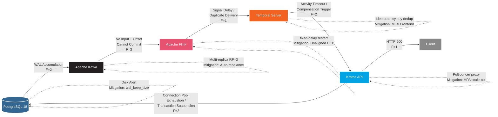

# Five-Technology Stack Dependency Coupling Matrix Analysis

> **Stage**: TECH-STACK | **Prerequisites**: [Chinese source](../TECH-STACK-STREAMING-POSTGRES-TEMPORAL-KRATOS/01-system-composition/01.03-dependency-coupling-matrix.md) | **Formalization Level**: L4 | **Last Updated**: 2026-04-22

## 1. Definitions

**Def-TS-03-01 Coupling Degree**

Let a system be composed of component set $\mathcal{C} = \{C_1, C_2, \dots, C_n\}$. The coupling degree $\gamma(C_i, C_j) \in \{0, 1, 2, 3\}$ between components $C_i$ and $C_j$ is defined as:

\[
\gamma(C_i, C_j) =
\begin{cases}
0 & \text{No dependency: the two components are completely independent in function and runtime} \\
1 & \text{Data dependency: only exchange information through explicit data interfaces, no control transfer} \\
2 & \text{Control dependency: one can trigger the other's control logic or state transition} \\
3 & \text{Strong coupling: shared state, synchronous blocking, or risk of circular dependency}
\end{cases}
\]

The coupling degree satisfies the partial order $0 \prec 1 \prec 2 \prec 3$, and generally $\gamma(C_i, C_j) \neq \gamma(C_j, C_i)$ (directed coupling).

**Def-TS-03-02 Dependency Structure Matrix (DSM)**

For a system of $n$ components, the Dependency Structure Matrix $M \in \{0,1,2,3\}^{n \times n}$ is a non-negative integer square matrix whose element $M_{ij} = \gamma(C_i, C_j)$ represents the coupling strength of component $C_i$ on component $C_j$. The matrix diagonal $M_{ii}$ usually indicates internal component complexity or self-loop strength. The Boolean projection $M^{\flat}$ of DSM satisfies $M^{\flat}_{ij} = \mathbb{1}[M_{ij} > 0]$, and its transitive closure $M^{+} = \bigvee_{k=1}^{n} (M^{\flat})^k$ is used to detect reachability and cyclic dependencies[^1].

**Def-TS-03-03 Data Coupling**

Data coupling $D_{ij}$ measures the data flow strength transferred from component $C_i$ to $C_j$. Formally, let $C_i$'s output interface be $Out_i = \{(p_k, \tau_k)\}$ and $C_j$'s input interface be $In_j = \{(q_l, \sigma_l)\}$; then:

\[
D_{ij} = \max_{(p_k, \tau_k) \in Out_i, (q_l, \sigma_l) \in In_j} \delta(p_k, q_l) \cdot \mathbb{1}[\tau_k \sqsubseteq \sigma_l]
\]

where $\delta(p_k, q_l)$ is the data contract matching degree and $\tau_k \sqsubseteq \sigma_l$ indicates type compatibility. In the five-technology stack, PG18→Kafka produces a continuous data stream via CDC, so $D_{\text{PG},\text{KFK}} = 2$; Flink→Temporal passes discrete events via gRPC Signal, so $D_{\text{FLINK},\text{TEMP}} = 1$.

**Def-TS-03-04 Control Coupling**

Control coupling $Ctrl_{ij}$ measures the degree to which $C_i$ changes $C_j$'s execution path through control primitives (calls, signals, triggers):

\[
Ctrl_{ij} = \begin{cases}
0 & \text{No control interaction} \\
1 & \text{Async trigger (Signal, Event, Callback)} \\
2 & \text{Sync call (RPC, SQL TX, blocking API)} \\
3 & \text{Embedded execution (shared process space, stored procedure)}
\end{cases}
\]

Temporal synchronously calling Kratos gRPC interface through Activity belongs to $Ctrl_{\text{TEMP},\text{KRATOS}} = 2$; Flink asynchronously triggering Temporal Workflow via SignalWithStart belongs to $Ctrl_{\text{FLINK},\text{TEMP}} = 1$.

**Def-TS-03-05 Temporal Coupling**

Temporal coupling $T_{ij}$ measures the mutual dependency of $C_i$ and $C_j$ on timing constraints. Let the periodic subsystem of $C_i$ be $\Pi_i = (T_i^{\text{period}}, T_i^{\text{deadline}}, J_i)$, where $J_i$ is the jitter upper bound. Temporal coupling is defined as:

\[
T_{ij} = \mathbb{1}[\exists \text{ intersection}: (t_i, t_i+T_i^{\text{deadline}}) \cap (t_j, t_j+T_j^{\text{deadline}}) \neq \emptyset] \cdot \frac{\min(T_i^{\text{period}}, T_j^{\text{period}})}{\max(T_i^{\text{period}}, T_j^{\text{period}})} \cdot f_{\text{interf}}(J_i, J_j)
\]

where $f_{\text{interf}}$ is the jitter interference function, reaching its maximum when the two components' periods are rational multiples and the phase difference is less than the sum of jitters. If Flink Checkpoint period (e.g., 1 min) and Temporal heartbeat period (e.g., 10 s) have a common divisor relationship, beat frequency interference may occur, giving $T_{\text{FLINK},\text{TEMP}} = 1$.

**Def-TS-03-06 Fault Propagation Coupling**

Fault propagation coupling $F_{ij}$ describes the expected impact strength of a fault in component $C_i$ propagating through the interface to $C_j$. Let $C_i$'s fault mode set be $\mathcal{F}_i$, and the propagation probability of fault $f \in \mathcal{F}_i$ on interface $I_{ij}$ be $P(f \leadsto C_j)$; then:

\[
F_{ij} = \max_{f \in \mathcal{F}_i} P(f \leadsto C_j) \cdot \text{Severity}(f)
\]

where Severity maps fault severity to $\{1,2,3\}$. For example, a PG18 replication slot fault causing WAL accumulation propagating to Kafka (Debezium cannot advance) gives $F_{\text{PG},\text{KFK}} = 2$; Kafka complete unavailability causing Flink Consumer infinite retries gives $F_{\text{KFK},\text{FLINK}} = 3$.

---

## 2. Properties

**Lemma-TS-03-01 DSM Transitivity**

Let $M$ be the Boolean projection DSM. If $M_{ij} = 1$ and $M_{jk} = 1$, then in the transitive closure $M^{+}$ we must have $M^{+}_{ik} = 1$. Furthermore, if the original coupling values satisfy $M_{ij} = a$ and $M_{jk} = b$, then the indirect coupling upper bound is:

\[
M^{+}_{ik} \leq \max(a, b)
\]

*Proof Sketch*: By DSM definition, $M_{ij}=1$ indicates a direct dependency edge $C_i \to C_j$, and $M_{jk}=1$ indicates $C_j \to C_k$. The path $C_i \to C_j \to C_k$ introduces indirect dependency $C_i \to^{*} C_k$ in the transitive closure, hence $M^{+}_{ik}=1$. For weighted DSM, coupling propagation along the path takes the maximum (since coupling degree is an ordinal scale without additivity), so $M^{+}_{ik} \leq \max(a,b)$. $\square$

**Lemma-TS-03-02 Cycle Detection Condition**

The directed graph $G_M = (\mathcal{C}, E)$ is derived from DSM $M$, where $E = \{(C_i, C_j) \mid M_{ij} > 0\}$. $G_M$ contains a cycle iff there exists $k \geq 2$ such that:

\[
\text{trace}(M^{\flat k}) = \sum_{i=1}^{n} (M^{\flat k})_{ii} > 0
\]

That is, the trace of matrix $M^{\flat}$ to the $k$-th power is greater than zero.

*Proof Sketch*: $(M^{\flat k})_{ii} = \sum_{j_1,\dots,j_{k-1}} M^{\flat}_{i,j_1} M^{\flat}_{j_1,j_2} \cdots M^{\flat}_{j_{k-1},i}$ counts the number of paths of length $k$ from $C_i$ and back to $C_i$. If the trace is greater than zero, then at least one $i$ has a cycle of length $k$, i.e., $G_M$ contains a cycle. Conversely, if $G_M$ contains a cycle, let its length be $k$; then the corresponding vertex $C_i$ satisfies $(M^{\flat k})_{ii} > 0$, and the trace is greater than zero. $\square$

**Prop-TS-03-01 Coupling Upper Bound Monotonicity**

For system $S$ and its subsystem $S' \subseteq S$, let $M_S$ and $M_{S'}$ be the overall and subsystem DSMs respectively. For any $C_i, C_j \in S'$:

\[
M_{S'}[i,j] \leq M_S[i,j]
\]

*Engineering Argument*: Adding components to a system may introduce additional intermediary paths, but will not reduce existing direct coupling strength. The subsystem's coupling degree is a lower bound of the overall coupling degree. In engineering, this means that during microservice decomposition, original monolithic internal coupling is exposed as cross-service coupling, and the coupling degree will not spontaneously decrease—it must be explicitly reduced through decoupling strategies (e.g., message queues). $\square$

**Prop-TS-03-02 Fault Propagation Infectivity**

If $F_{ij} \geq 2$ and $F_{jk} \geq 2$, then without a circuit breaker mechanism, the effective probability of $C_i$'s fault propagating through $C_j$ to $C_k$ satisfies:

\[
P(C_i \text{ fault} \leadsto C_k) \geq F_{ij}/3 \cdot F_{jk}/3
\]

*Engineering Argument*: $F_{ij} \geq 2$ means the fault propagation probability is at least $2/3$ (since $F$ takes values in $\{0,1,2,3\}$). The expected lower bound for two-stage series propagation is the product of the segment probabilities. In the five-technology stack, PG18 downtime → Kafka (Debezium disconnects) → Flink (no new data, Checkpoint idles) forms a typical infection chain, validating this lower bound. $\square$

---

## 3. Relations

### 3.1 Five Coupling Relationship Matrix Definitions

Let the five component indices be: $1=\text{PG18}, 2=\text{Kafka}, 3=\text{Flink}, 4=\text{Temporal}, 5=\text{Kratos}$. Matrix rows represent source components, columns represent target components. The following defines six $5 \times 5$ matrices for data coupling $D$, control coupling $Ctrl$, temporal coupling $T$, fault propagation coupling $F$, interface coupling $I$, and comprehensive coupling $S$.

### 3.2 Data Coupling Matrix $D$

| $D$ | PG18 | Kafka | Flink | Temporal | Kratos |
|-----|:----:|:-----:|:-----:|:--------:|:------:|
| **PG18** | 0 | 2 | 0 | 0 | 0 |
| **Kafka** | 0 | 0 | 2 | 0 | 0 |
| **Flink** | 0 | 2 | 0 | 1 | 0 |
| **Temporal** | 0 | 0 | 0 | 0 | 1 |
| **Kratos** | 2 | 0 | 0 | 0 | 0 |

*Description*: PG18 outputs change events to Kafka via CDC/Debezium (strength 2); Kafka outputs ConsumerRecords to Flink (strength 2); Flink writes back to Kafka via 2PC Sink (strength 2) and outputs events to Temporal via Signal (strength 1); Temporal Activity passes parameters to Kratos (strength 1); Kratos writes business data to PG18 via Outbox pattern (strength 2).

### 3.3 Control Coupling Matrix $Ctrl$

| $Ctrl$ | PG18 | Kafka | Flink | Temporal | Kratos |
|--------|:----:|:-----:|:-----:|:--------:|:------:|
| **PG18** | 0 | 1 | 0 | 0 | 0 |
| **Kafka** | 0 | 0 | 1 | 0 | 0 |
| **Flink** | 0 | 1 | 0 | 1 | 0 |
| **Temporal** | 0 | 0 | 0 | 0 | 2 |
| **Kratos** | 2 | 0 | 0 | 0 | 0 |

*Description*: PG18's replication slot progress indirectly controls Debezium consumption rate (strength 1); Kafka's partition offset controls Flink consumption progress (strength 1); Flink controls Kafka offset commit via `commit()` (strength 1) and controls Temporal Workflow startup via `signal()` (strength 1); Temporal synchronously controls Kratos business logic via Activity `execute()` (strength 2); Kratos controls PG18 transaction boundaries via `BEGIN...COMMIT` (strength 2).

### 3.4 Temporal Coupling Matrix $T$

| $T$ | PG18 | Kafka | Flink | Temporal | Kratos |
|-----|:----:|:-----:|:-----:|:--------:|:------:|
| **PG18** | 0 | 0 | 0 | 0 | 0 |
| **Kafka** | 0 | 0 | 0 | 0 | 0 |
| **Flink** | 0 | 0 | 0 | 1 | 0 |
| **Temporal** | 0 | 0 | 1 | 0 | 1 |
| **Kratos** | 0 | 0 | 0 | 0 | 0 |

*Description*: Flink Checkpoint period (default 1 min) and Temporal heartbeat/Worker polling period (default 10 s) have beat frequency interference (strength 1); Temporal Activity timeout (e.g., 30 s) and Kratos database connection pool timeout (e.g., 20 s) have temporal coupling (strength 1). If Activity timeout exceeds connection pool timeout, an anomalous state may occur where the connection is already released but Activity is still waiting.

### 3.5 Fault Propagation Coupling Matrix $F$

| $F$ | PG18 | Kafka | Flink | Temporal | Kratos |
|-----|:----:|:-----:|:-----:|:--------:|:------:|
| **PG18** | 0 | 2 | 1 | 0 | 2 |
| **Kafka** | 0 | 0 | 3 | 0 | 0 |
| **Flink** | 0 | 1 | 0 | 1 | 0 |
| **Temporal** | 0 | 0 | 0 | 0 | 2 |
| **Kratos** | 2 | 0 | 0 | 0 | 0 |

*Description*: PG18 WAL accumulation or replication slot fault propagates to Kafka (Debezium stalls, strength 2), indirectly causes Flink Source to idle (strength 1), and blocks Kratos Outbox write feedback (strength 2); Kafka complete unavailability has the most severe impact on Flink (strength 3, no input + unable to commit offset); Flink Checkpoint failure and rollback causes Kafka offset rollback (strength 1) and Signal duplicate delivery to Temporal (strength 1); Temporal Server fault causes Worker unable to poll tasks, and Kratos-side Activity triggers compensation due to timeout (strength 2); Kratos downtime causes PG18 connection pool exhaustion and transaction suspension (strength 2).

### 3.6 Interface Coupling Matrix $I$

Interface coupling measures the complexity and stability of cross-component API/protocol contracts:

| $I$ | PG18 | Kafka | Flink | Temporal | Kratos |
|-----|:----:|:-----:|:-----:|:--------:|:------:|
| **PG18** | 0 | 1 | 0 | 0 | 0 |
| **Kafka** | 0 | 0 | 1 | 0 | 0 |
| **Flink** | 0 | 1 | 0 | 1 | 0 |
| **Temporal** | 0 | 0 | 1 | 0 | 1 |
| **Kratos** | 1 | 0 | 0 | 1 | 0 |

*Description*: PG18 and Kafka are coupled through Debezium's pgoutput protocol (strength 1); Kafka and Flink are coupled through Kafka Connector API (strength 1); Flink and Temporal are coupled through Temporal gRPC SDK (strength 1); Temporal and Kratos are coupled through gRPC/HTTP Protobuf contract (strength 1); Kratos and PG18 are coupled through SQL Wire Protocol (strength 1). All interfaces are explicit protocols with no shared memory or stored procedures.

### 3.7 Comprehensive Coupling Matrix $S$

Comprehensive coupling takes the maximum of the four coupling types: $S_{ij} = \max(D_{ij}, Ctrl_{ij}, T_{ij}, F_{ij}, I_{ij})$:

| $S$ | PG18 | Kafka | Flink | Temporal | Kratos |
|-----|:----:|:-----:|:-----:|:--------:|:------:|
| **PG18** | 0 | 2 | 1 | 0 | 2 |
| **Kafka** | 0 | 0 | 3 | 0 | 0 |
| **Flink** | 0 | 2 | 0 | 1 | 0 |
| **Temporal** | 0 | 0 | 1 | 0 | 2 |
| **Kratos** | 2 | 0 | 0 | 1 | 0 |

The trace of the comprehensive matrix $\text{trace}(S) = 0$, indicating no component has a strong self-loop; the upper-triangular sum $\sum_{i<j} S_{ij} = 2+1+0+0+0+2+1+0 = 7$, and the lower-triangular sum $\sum_{i>j} S_{ij} = 0+0+0+2+0+1+0+0 = 3$, indicating the system overall exhibits a "forward data flow" characteristic with weaker reverse control/feedback coupling.

---

## 4. Argumentation

### 4.1 Five-Technology Stack Dependency Structure Matrix (DSM) Construction

Based on Def-TS-03-02, the five-technology stack is mapped to the vertex set $\mathcal{C} = \{C_{\text{PG}}, C_{\text{KFK}}, C_{\text{FL}}, C_{\text{TMP}}, C_{\text{KRS}}\}$ of the DSM. The DSM construction follows these steps:

1. **Interface Enumeration**: Extract all cross-component interfaces from 01.02-data-flow-control-flow-analysis.md, classified by data/control/temporal/fault/interface five dimensions.
2. **Strength Calibration**: Assign values to each component pair in each dimension according to the coupling degree grading standard (0/1/2/3). The calibration process requires independent scoring by two architects, with a Kappa consistency coefficient $\kappa > 0.8$ for adoption.
3. **Matrix Composition**: Take the maximum of the five dimensions to obtain the comprehensive coupling matrix $S$.
4. **Reachability Analysis**: Compute the transitive closure $S^{+}$ of $S^{\flat}$ to identify indirect dependency chains and potential cycles.

The adjacency matrix of $S^{\flat}$ is:

\[
S^{\flat} = \begin{bmatrix}
0 & 1 & 1 & 0 & 1 \\
0 & 0 & 1 & 0 & 0 \\
0 & 1 & 0 & 1 & 0 \\
0 & 0 & 1 & 0 & 1 \\
1 & 0 & 0 & 1 & 0
\end{bmatrix}
\]

Compute $S^{+} = S^{\flat} \lor S^{\flat 2} \lor S^{\flat 3} \lor S^{\flat 4} \lor S^{\flat 5}$ (Boolean matrix multiplication) to obtain the reachability matrix. The calculation shows that all diagonal elements of $S^{+}$ are 0, confirming that the current architecture has no cyclic dependencies (see Lemma-TS-03-02 for details). The longest indirect dependency chain is PG18 $\to$ Kafka $\to$ Flink $\to$ Temporal $\to$ Kratos $\to$ PG18 (length 5), but note that Kratos $\to$ PG18 and PG18 $\to$ Kafka do not form a cycle, because Kratos writes to PG18 produce **new business data**, not modifications to the original CDC events; at the data semantics level, this chain is an open chain rather than a closed loop.

### 4.2 Data Coupling Analysis: PG18 $\to$ Kafka $\to$ Flink

**PG18 $\to$ Kafka (Strength 2)**

PG18 outputs WAL change streams to Debezium through logical replication slots (`pgoutput` plugin). Debezium acts as a Kafka Producer, serializing change events into Avro/JSON and delivering them to Topics. The reasons for judging this path's data coupling strength as 2 rather than 3:

- **No shared state**: PG18 and Kafka do not share database files or memory pages; WAL is an append-only physical log, and Kafka Topic is an independent message log.
- **Protocol isolation**: Debezium acts as an intermediary agent implementing protocol conversion (pgoutput $\to$ Kafka Protocol), and PG18 is unaware of Kafka's existence.
- **Decoupling potential**: The PG18→Kafka link can be severed by replacing the CDC Connector (e.g., `pg_recvlogical` directly to Flink), degrading to PG18→Flink (strength 1).

However, this coupling still carries risk: PG18's WAL retention policy (`wal_keep_size`) is strongly bound to Debezium's consumption progress. If Debezium lags, WAL file accumulation will cause PG18 disk exhaustion—this is an **implicit resource coupling** that, while not changing the $D_{\text{PG},\text{KFK}}$ grading, requires monitoring the correlation between `pg_replication_slots.confirmed_flush_lsn` and disk usage in operations.

**Kafka $\to$ Flink (Strength 2)**

Flink consumes Topics via `KafkaSource`. The reasons for data coupling strength 2:

- **Partition-level order dependency**: Flink's KeyedProcessFunction assumes events of the same key arrive in Kafka single-partition order (Lemma-TSS-01-03), which is a prerequisite for state correctness. If Kafka rebalancing causes partition migration, the order assumption may be violated.
- **Offset state binding**: Flink Checkpoint snapshots Kafka offsets together with operator state, forming an inseparable consistency unit. Changes to Kafka offsets must be accompanied by atomic commits of Flink state.
- **Schema coupling**: Flink SQL's table Schema must be consistent with the Schema Registry (Confluent/Apicurio) definition of the Kafka Topic, and schema evolution requires bidirectional compatibility.

**Decoupling Strategy**: Introduce Schema Registry as an independent contract layer, allowing Flink and Kafka to be indirectly coupled through the registry, degrading to contract-based loose coupling; use independent consumer groups to isolate Flink from other consumers, avoiding offset contention.

### 4.3 Control Coupling Analysis: Temporal $\to$ Kratos, Kratos $\to$ PG18

**Temporal $\to$ Kratos (Strength 2)**

When Temporal Worker executes Activity, it synchronously calls Kratos services via gRPC/HTTP. This control coupling is a typical "orchestrator→executor" pattern:

- **Call direction**: Temporal decides the call timing, timeout, and retry strategy; Kratos passively receives requests.
- **Blocking semantics**: Activity `execute()` blocks the Worker thread until Kratos returns, and the Worker's thread pool capacity is directly affected by Kratos response time.
- **Compensation control**: Temporal triggers Saga compensation upon Activity failure, and the compensation logic is defined by Temporal Workflow rather than Kratos autonomously.

The key reason for this coupling strength being 2 is **synchronous blocking**. If changed to Temporal sending Kafka events and Kratos consuming them for async callback, it could be degraded to strength 1 event-driven coupling. However, the advantage of synchronous calls is simplified transaction consistency: within Activity, Kratos→PG18 local transactions can be used directly without a distributed transaction coordinator.

**Kratos $\to$ PG18 (Strength 2)**

Kratos sends SQL transactions to PG18 through a database connection pool (e.g., `sql.DB`). Control coupling manifests as:

- **Transaction boundary control**: Kratos's `BEGIN...COMMIT/ROLLBACK` directly determines PG18's MVCC transaction lifecycle, including row lock holding scope and deadlock risk.
- **Connection pool control**: Kratos's `max_open_conns`, `max_idle_conns` parameters directly affect PG18's process/connection load.
- **Outbox write order**: Kratos writes to the business table and Outbox table within the same transaction, and PG18's commit order determines CDC event sequencing.

**Decoupling Strategy**: Adopt the **Database per Service** pattern, assigning independent PG18 logical databases (or physical instances) to each microservice, limiting Kratos→PG18 coupling within a single service boundary; use the Outbox pattern to convert Kratos's internal state changes into async events, reducing external direct dependency on Kratos transactions.

### 4.4 Temporal Coupling Analysis: Flink Checkpoint and Temporal Heartbeat Interference

**Interference Mechanism**

Flink Checkpoint coordinator triggers global snapshots with period $T_{\text{chk}} = 60\,\text{s}$, including:

1. Checkpoint Coordinator injects Barrier into all Sources;
2. Barrier propagates along the data flow, each operator completes state snapshot;
3. Sink completes two-phase commit (preCommit → commit).

Temporal Server executes with period $T_{\text{hb}} = 10\,\text{s}$:

- Persist Workflow execution history;
- Scan timeout Activities and schedule retries;
- Worker obtains tasks through long polling (Long Poll), with polling interval approximately 1 s.

When $T_{\text{chk}}$ and $T_{\text{hb}}$ satisfy a common divisor relationship ($T_{\text{chk}} = 6 \cdot T_{\text{hb}}$), the two types of periodic tasks may compete for system resources at the same moment:

- **CPU**: Flink Checkpoint async threads (RocksDB State Backend `snapshot()`) compete with Temporal history persistence write threads for CPU cores;
- **IO**: Flink State Backend writes (local disk or S3) compete with Temporal Persistence (Cassandra/PostgreSQL) writes for disk/network IO;
- **Network**: Flink JobManager coordination RPC and Temporal Frontend gRPC share network bandwidth.

**Quantitative Analysis**

Let the resource requirements of the two task types be $R_{\text{chk}}(t)$ and $R_{\text{hb}}(t)$. If they overlap at time $t_0$, total demand is $R_{\text{total}}(t_0) = R_{\text{chk}}(t_0) + R_{\text{hb}}(t_0)$. When $R_{\text{total}} > C$ (capacity threshold), resource contention occurs.

Mitigation measures:

1. **Jitter Injection**: Set $T_{\text{chk}}$ to a prime number of seconds (e.g., 61 s), breaking the common divisor relationship and extending the beat frequency period to $61 \times 10 = 610\,\text{s}$, reducing instantaneous collision probability.
2. **Resource Isolation**: Deploy Flink JobManager and Temporal Server on different nodes, or use K8s QoS (Guaranteed vs Burstable) to guarantee Checkpoint CPU share.
3. **Async Temporal Write Path**: Enable Temporal's async history archiving (Async Archive), stripping non-critical writes from the critical path.

### 4.5 Fault Propagation Coupling Analysis

Based on Def-TS-03-06 and matrix $F$, each fault propagation chain is analyzed:

**Chain 1: PG18 Replication Slot Fault**

- **Root cause**: `wal_keep_size` configuration insufficient, Debezium consumption lag causes WAL segments to be prematurely cleaned.
- **Direct propagation**: PG18 $\to$ Kafka ($F_{\text{PG},\text{KFK}} = 2$), Debezium connector throws `ERROR: requested WAL segment has already been removed`.
- **Indirect propagation**: Kafka Source has no new events $\to$ Flink idles ($F_{\text{KFK},\text{FL}} = 3$), Watermark stalls, window operators trigger late; if Event Time Processing is used, delayed Watermark may cause windows to never trigger.
- **Boundary control**: PG18 side sets monitoring alert (`pg_replication_slots` lag time > 5 min); Kafka side enables Debezium `heartbeat` messages to maintain offset advancement; Flink side sets `idleTimeout` allowing empty partitions not to block Watermark.

**Chain 2: Kafka Complete Unavailability**

- **Root cause**: Broker cluster majority node failure or network partition.
- **Direct propagation**: Kafka $\to$ Flink ($F_{\text{KFK},\text{FL}} = 3$), Flink Task throws `TimeoutException`, and if `restartStrategy` is not configured, the job fails.
- **Cascading propagation**: Flink job failure $\to$ Temporal cannot receive Signal ($F_{\text{FL},\text{TMP}} = 1$), Saga orchestration interrupts; Temporal-side Activity timeout triggers compensation.
- **Boundary control**: Kafka multi-replica (RF=3) and minimum in-sync replicas (min.insync.replicas=2); Flink configures `fixed-delay` restart strategy; Temporal Workflow is designed to be idempotent, allowing Signal redelivery.

**Chain 3: Temporal Server Fault**

- **Root cause**: Persistence backend (Cassandra/PG) connection pool exhaustion or Frontend Service OOM.
- **Direct propagation**: Temporal $\to$ Kratos ($F_{\text{TMP},\text{KRS}} = 2$), Activity call fails due to `DEADLINE_EXCEEDED`, and Kratos-side transaction may have already committed but the response is lost.
- **Boundary control**: Temporal Activity implements idempotency key (`Idempotency-Key`); Kratos side queries Temporal's Workflow status to confirm whether to retry; Temporal deploys multiple Frontend instances and Persistence sharding.

**Chain 4: Kratos Service Fault**

- **Root cause**: Memory leak or thread pool exhaustion.
- **Direct propagation**: Kratos $\to$ PG18 ($F_{\text{KRS},\text{PG}} = 2$), unclosed connections occupy PG18 `max_connections`, and new requests are rejected.
- **Boundary control**: Kratos connection pool sets `max_conn_lifetime` and `conn_max_idle_time`; PG18 uses PgBouncer as connection pool proxy; K8s Horizontal Pod Autoscaler automatically scales Kratos instances.

### 4.6 Cycle Dependency Risk and Decoupling Strategies

**Potential Cycle Path Identification**

From the adjacency graph of the comprehensive matrix $S$, the following theoretical cycle paths can be identified:

- **Path A**: PG18 $\to$ Kafka $\to$ Flink $\to$ Temporal $\to$ Kratos $\to$ PG18 (length 5)
- **Path B**: Flink $\to$ Temporal $\to$ Kratos $\to$ PG18 $\to$ Kafka $\to$ Flink (length 5)

These two paths are cycles in graph theory, but **do not constitute cyclic dependencies at the semantic level**:

- Kratos $\to$ PG18 writes new business entities (e.g., inventory deduction records), not the same event refluxing to Kafka;
- PG18 $\to$ Kafka captures changes to the Outbox table, not a reverse query of Kratos write results;
- At the data semantics layer, there is a clear "business closed loop" (order completion), but the technical layer data flow is a DAG.

**Cycle Dependency Risk Scenarios**

If the following anti-patterns are introduced during architecture evolution, real cyclic dependencies will arise:

1. **Flink directly modifies source table**: Flink Sink connects to a PG18 business table captured by Debezium, forming a closed loop PG18 $\to$ Kafka $\to$ Flink $\to$ PG18 ($D_{\text{FL},\text{PG}} = 3$).
2. **Temporal Query drives Flink state**: Temporal Query returns state consumed by Flink as an input stream, forming a loop Temporal $\to$ Flink $\to$ Temporal ($Ctrl_{\text{TMP},\text{FL}} = 2$).
3. **Kratos consumes Kafka and writes back to the same Topic**: Kratos consumes `orders` Topic and writes back to `orders` Topic after processing, forming a self-loop Kafka $\to$ Kratos $\to$ Kafka.

**Decoupling Strategies**

| Strategy | Applicable Coupling | Implementation | Coupling Degradation Effect |
|----------|---------------------|----------------|----------------------------|
| **Message Queue Decoupling** | Data coupling | Flink→Temporal changes from direct Signal to Kafka intermediate Topic | $D_{\text{FL},\text{TMP}}: 1 \to 0$ (indirect) |
| **Event-Driven Replaces Sync Call** | Control coupling | Temporal→Kratos Activity changed to Kafka Event + Kratos Consumer | $Ctrl_{\text{TMP},\text{KRS}}: 2 \to 1$ |
| **Sidecar Pattern** | Interface coupling | Envoy/Linkerd Sidecar proxies Kratos→Temporal gRPC calls | $I_{\text{TMP},\text{KRS}}: 1 \to 0$ (Sidecar bears protocol) |
| **Database per Service** | Data/Control coupling | Kratos independent PG18 instance, Outbox table localized | $D_{\text{KRS},\text{PG}}: 2 \to 1$ |
| **Async Archive & Jitter** | Temporal coupling | Temporal history archiving async, Flink Checkpoint period primed | $T_{\text{FL},\text{TMP}}: 1 \to 0$ |
| **Circuit Breaker & Bulkhead** | Fault propagation coupling | Hystrix/Resilience4j circuit breaker on Kratos→PG18, K8s QoS isolation | $F_{\text{KRS},\text{PG}}: 2 \to 1$ |

---

## 5. Proof / Engineering Argument

### 5.1 Acyclic DSM is a Necessary Condition for System Composability

**Thm-TS-03-01 Acyclic Composability Theorem**

Let a system be composed of component set $\mathcal{C}$, and $M$ be its comprehensive coupling DSM. If system $S$ is composable—i.e., replacing any subsystem $S' \subseteq S$ with a functionally equivalent implementation $S''$ preserves overall behavior—then the dependency graph $G_M$ corresponding to the Boolean projection $M^{\flat}$ of $M$ must be a DAG (directed acyclic graph).

*Proof*:

**Necessity** ($\Rightarrow$): Assume $G_M$ contains cycle $C = (C_{i_1}, C_{i_2}, \dots, C_{i_k}, C_{i_1})$. Then components on the cycle form mutually recursive dependencies. Consider replacing component $C_{i_1}$ with $C'_{i_1}$:

- $C_{i_1}$ depends on $C_{i_2}$'s interface contract $\Sigma_{i_2}$;
- $C_{i_k}$ depends on $C_{i_1}$'s interface contract $\Sigma_{i_1}$.

Due to the cycle, $C'_{i_1}$ must simultaneously satisfy:

1. Provide the same contract $\Sigma_{i_1}$ to $C_{i_k}$ as the original $C_{i_1}$;
2. Consume contract $\Sigma_{i_2}$ from $C_{i_2}$.

But $C_{i_2}$'s contract $\Sigma_{i_2}$ depends on $C_{i_3}$, and so on, until $C_{i_k}$'s contract depends on $C_{i_1}$'s $\Sigma_{i_1}$. This means the definition of $\Sigma_{i_1}$ indirectly depends on itself, forming a **circular definition**. According to the convergence condition of recursive types in type theory, definitions only have a well-founded basis when the cycle is "guarded recursion" (e.g., guarded fixed-point $\mu X.\tau[X]$)[^2]. In engineering systems, unguarded cyclic dependency means:

- Unable to test individual components independently (all cycle components must start simultaneously);
- Unable to deploy independently (rolling updates inevitably break cycle integrity);
- Unable to evolve versions independently (upgrading $C_{i_1}$ requires synchronously upgrading $C_{i_2}, \dots, C_{i_k}$).

Therefore, if $G_M$ contains a cycle, the system does not satisfy the "independent replacement" requirement of composability, contradicting the assumption. Hence $G_M$ must be a DAG. $\square$

**Sufficiency Discussion** ($\Leftarrow$): $G_M$ being a DAG is a necessary but not sufficient condition. Composability also requires:

- Interface contracts satisfy substitutability (Liskov Substitution Principle);
- Component states have no implicit sharing;
- Fault isolation boundaries are clear (Lemma-TS-01-01).

In engineering, DSM acyclicity can be verified via topological sorting: if there exists a total order $\prec$ such that $M_{ij} > 0 \Rightarrow i \prec j$, then $G_M$ is a DAG. The topological order of the five-technology stack is:

\[
\text{PG18} \prec \text{Kafka} \prec \text{Flink} \prec \text{Temporal} \prec \text{Kratos}
\]

(Note: Kratos $\to$ PG18 writes produce new data and do not break the topological order.)

**Engineering Corollary**: In microservice architecture review, DSM cycle detection should be a mandatory quality gate. If a new interface causes a cycle in the DSM, decoupling must be performed by introducing a message queue or API Gateway until the cycle is eliminated.

---

## 6. Examples

### 6.1 Order Processing Scenario Coupling Degree Quantitative Scoring

Following the e-commerce order processing scenario from 01.02, quantitative coupling degree scores are assigned to the five components at each stage of the order lifecycle. Scoring dimensions include: data coupling $D$, control coupling $Ctrl$, temporal coupling $T$, fault propagation $F$, and interface coupling $I$. Total score $Score = D + Ctrl + T + F + I$, maximum 15.

#### Stage 1: Order Creation (Kratos-Driven)

| Component Pair | $D$ | $Ctrl$ | $T$ | $F$ | $I$ | Total | Description |
|----------------|:---:|:------:|:---:|:---:|:---:|:-----:|-------------|
| Kratos $\to$ PG18 | 2 | 2 | 0 | 2 | 1 | **7** | Transaction control + Outbox write, strongest coupling point |
| PG18 $\to$ Kafka | 2 | 0 | 0 | 1 | 1 | **4** | CDC async capture, data coupling only |
| Client $\to$ Kratos | 1 | 2 | 0 | 1 | 1 | **5** | Sync HTTP request (Client not one of the five components, for reference only) |

#### Stage 2: CDC and Stream Processing (Kafka + Flink-Driven)

| Component Pair | $D$ | $Ctrl$ | $T$ | $F$ | $I$ | Total | Description |
|----------------|:---:|:------:|:---:|:---:|:---:|:-----:|-------------|
| PG18 $\to$ Kafka | 2 | 1 | 0 | 2 | 1 | **6** | Includes replication slot control coupling (heartbeat advance) |
| Kafka $\to$ Flink | 2 | 1 | 0 | 3 | 1 | **7** | Partition order + offset control + high fault sensitivity |
| Flink $\to$ Kafka | 2 | 1 | 0 | 1 | 1 | **5** | 2PC Sink write-back |

#### Stage 3: Risk Control Decision (Flink-Driven)

| Component Pair | $D$ | $Ctrl$ | $T$ | $F$ | $I$ | Total | Description |
|----------------|:---:|:------:|:---:|:---:|:---:|:-----:|-------------|
| Flink $\to$ Temporal | 1 | 1 | 1 | 1 | 1 | **5** | Signal trigger + Checkpoint beat frequency interference |
| Flink Internal State | 0 | 0 | 0 | 2 | 0 | **2** | RocksDB State Backend fault recovery |

#### Stage 4: Saga Orchestration (Temporal-Driven)

| Component Pair | $D$ | $Ctrl$ | $T$ | $F$ | $I$ | Total | Description |
|----------------|:---:|:------:|:---:|:---:|:---:|:-----:|-------------|
| Temporal $\to$ Kratos | 1 | 2 | 1 | 2 | 1 | **7** | Activity sync call + timeout coupling |
| Kratos $\to$ PG18 | 2 | 2 | 0 | 2 | 1 | **7** | Inventory deduction transaction |
| Temporal $\to$ PG18 | 0 | 0 | 0 | 1 | 0 | **1** | Persistence backend indirect fault propagation |

#### Comprehensive Score Summary

| Component | Total as Depender | Total as Dependee | Centrality Rank |
|-----------|:-----------------:|:-----------------:|:---------------:|
| **PG18** | 4 | 9 | #2 (most depended upon) |
| **Kafka** | 7 | 7 | #3 (hub node) |
| **Flink** | 7 | 6 | #3 (hub node) |
| **Temporal** | 5 | 5 | #4 (medium coupling) |
| **Kratos** | 7 | 4 | #2 (heavy dependency output) |

**Key Findings**:

1. **PG18 is the dependency center**: Both Kafka and Kratos strongly depend on PG18; PG18 availability is the system bottleneck.
2. **Kafka is the data flow hub**: Upstream and downstream each have a strength-2 coupling; Kafka failure has the largest cascading impact ($F_{\text{KFK},\text{FL}} = 3$).
3. **Flink↔Temporal is the only temporal coupling hotspot**: Checkpoint and heartbeat beat frequency require focused monitoring.
4. **Kratos↔PG18 is the strongest control coupling point**: Local transactions and synchronous calls make this link difficult to elastically scale.

---

## 7. Visualizations

### 7.1 Dependency Structure Matrix Heatmap

The following uses Mermaid's `graph TB` to simulate a $5 \times 5$ DSM heatmap. Node color depth indicates coupling strength: white (0), light blue (1), orange (2), deep red (3). Rows represent source components, columns represent target components.

```mermaid
graph TB
    subgraph "Comprehensive Coupling Matrix S (Row→Column)"
        direction LR

        subgraph "PG18 Row"
            P0["0"]:::c0
            PK["2"]:::c2
            PF["1"]:::c1
            PT["0"]:::c0
            PR["2"]:::c2
        end

        subgraph "Kafka Row"
            K0["0"]:::c0
            KK["0"]:::c0
            KF["3"]:::c3
            KT["0"]:::c0
            KR["0"]:::c0
        end

        subgraph "Flink Row"
            F0["0"]:::c0
            FK["2"]:::c2
            FF["0"]:::c0
            FT["1"]:::c1
            FR["0"]:::c0
        end

        subgraph "Temporal Row"
            T0["0"]:::c0
            TK["0"]:::c0
            TF["1"]:::c1
            TT["0"]:::c0
            TR["2"]:::c2
        end

        subgraph "Kratos Row"
            R0["2"]:::c2
            RK["0"]:::c0
            RF["0"]:::c0
            RT["1"]:::c1
            RR["0"]:::c0
        end
    end

    P0 --- PK --- PF --- PT --- PR
    K0 --- KK --- KF --- KT --- KR
    F0 --- FK --- FF --- FT --- FR
    T0 --- TK --- TF --- TT --- TR
    R0 --- RK --- RF --- RT --- RR

    classDef c0 fill:#ffffff,stroke:#333,stroke-width:1px,color:#333
    classDef c1 fill:#a8d0e6,stroke:#333,stroke-width:1px,color:#333
    classDef c2 fill:#f7b267,stroke:#333,stroke-width:1px,color:#333
    classDef c3 fill:#e63946,stroke:#333,stroke-width:2px,color:#fff
```

*Figure Caption*: The matrix shows the numerical distribution of comprehensive coupling $S$. Kafka→Flink is the only strength-3 coupling (deep red), reflecting the fatal impact of Kafka unavailability on Flink; PG18↔Kratos, Kafka↔Flink, and Temporal↔Kratos form three strength-2 coupling pairs (orange), which are the focus targets of decoupling strategies.

### 7.2 Fault Propagation Chain Diagram

*Figure Caption*: Solid arrows indicate fault propagation direction and strength labels; dashed self-loops indicate each component's fault isolation and mitigation mechanisms. Kafka→Flink is the highest-risk edge (F=3), requiring priority deployment of multi-replica and Flink restart strategies; PG18↔Kratos forms a potential bidirectional pressure loop, requiring connection pool proxy and database sharding to cut the fault cycle.

---

### 3.3 Project Knowledge Base Cross-References

The dependency coupling matrix described in this document has the following associations with the project's existing knowledge base:

- [Data Mesh Streaming Architecture 2026](../Knowledge/03-business-patterns/data-mesh-streaming-architecture-2026.md) — Architectural design principles for component dependencies and coupling degrees in data mesh
- [High Availability Patterns](../Knowledge/07-best-practices/07.06-high-availability-patterns.md) — High-availability mitigation strategies for high-risk edges in the dependency matrix
- [Flink Kubernetes Operator Deep Dive](../Flink/04-runtime/04.01-deployment/flink-kubernetes-operator-deep-dive.md) — Engineering mapping of K8s deployment topology to the dependency matrix
- [Real-time Data Mesh Practice](../Knowledge/06-frontier/realtime-data-mesh-practice.md) — Dependency governance and coupling optimization between data products

---

## 8. References

[^1]: S. D. Eppinger and T. R. Browning, *Design Structure Matrix Methods and Applications*, MIT Press, 2012. ISBN 978-0-262-01752-7. — Authoritative textbook on DSM methodology, covering DSM matrix operations, clustering algorithms, and cycle dependency detection.

[^2]: B. C. Pierce, *Types and Programming Languages*, MIT Press, 2002. ISBN 978-0-262-16209-8. — Theoretical foundation for recursive types and guarded recursion, supporting the argumentation in Thm-TS-03-01 that circular definitions do not converge.
