# Docker Containerization and Kubernetes Deployment Foundation

> **Stage**: TECH-STACK | **Prerequisites**: [Chinese source](../TECH-STACK-STREAMING-POSTGRES-TEMPORAL-KRATOS/02-component-deep-dive/02.05-docker-kubernetes-deployment-base.md) | **Formalization Level**: L3-L4 | **Last Updated**: 2026-04-22

## 1. Definitions

**Def-T-02-05-01 (Containerization)**
Containerization is a technical paradigm that packages an application and its dependencies (runtime, libraries, configuration) into independent, portable execution units — container images. Containers achieve process isolation through OS-level virtualization (e.g., Linux cgroups and namespaces), sharing the host kernel and avoiding the full OS overhead of traditional virtual machines. Docker, as the de-facto standard Container Runtime Interface (CRI) implementation, provides a complete toolchain for image building, distribution, and execution.

**Def-T-02-05-02 (Pod)**
Pod is the smallest schedulable compute unit in Kubernetes, encapsulating one or more tightly coupled containers (typically 1 main container + several Sidecars). Containers within a Pod share the network namespace (IP address and port space), storage volumes, and IPC namespace. A Pod has a lifecycle: Pending → Running → Succeeded/Failed/Unknown, and its status is continuously maintained by the kubelet on the node.

**Def-T-02-05-03 (StatefulSet)**
StatefulSet is a Kubernetes workload API object for managing stateful distributed applications. It provides each Pod replica with stable, unique network identifiers (via Headless Service, enabling `<pod-name>.<svc-name>` DNS resolution) and stable persistent storage (via `volumeClaimTemplates`, independently allocating a PVC for each Pod). StatefulSet guarantees that Pod startup, termination, and rolling updates are executed in strict ordinal index order.

**Def-T-02-05-04 (Deployment)**
Deployment is a Kubernetes controller for declaratively managing stateless application replica sets. It manages the underlying ReplicaSet to achieve Pod scaling and rolling updates. Deployment supports `maxSurge` and `maxUnavailable` parameters to control update rate, and records version history to support rollback. Deployment does not guarantee stability of Pod network identity or storage; any Pod can be replaced by a homogeneous replica at any time.

**Def-T-02-05-05 (PodDisruptionBudget, PDB)**
PodDisruptionBudget is a Kubernetes policy object used to ensure applications maintain a minimum number of available replicas in the face of voluntary disruptions (e.g., node maintenance, cluster upgrades, manual scaling). Through `minAvailable` or `maxUnavailable` constraints, PDB declares the upper limit of Pods that can be safely removed to the Eviction API and Cluster Autoscaler, preventing operational actions from causing service unavailability.

**Def-T-02-05-06 (Affinity / Anti-Affinity)**
Affinity and Anti-Affinity are Kubernetes scheduler constraints used to control placement relationships between Pods and nodes (Node Affinity) or between Pods (Pod Affinity/Anti-Affinity):

- **Node Affinity**: Schedules Pods onto nodes with specific labels (e.g., `disktype=ssd`).
- **Pod Affinity**: Places Pods near other Pods satisfying specific label selectors (same node/availability zone).
- **Pod Anti-Affinity**: Places Pods away from other Pods satisfying specific label selectors, commonly used to ensure multiple replicas of the same service are distributed across different nodes or availability zones to improve fault tolerance.

**Def-T-02-05-07 (LimitRange & ResourceQuota)**

- **LimitRange**: At the namespace level, sets default/minimum/maximum resource requests and limits for individual containers or Pods, preventing a single abnormal container from exhausting node resources.
- **ResourceQuota**: At the namespace level, limits total resource consumption (CPU, memory, Pod count, PVC count, etc.), achieving resource isolation and capacity planning in multi-tenant environments.

---

## 2. Properties

**Lemma-T-02-05-01 (StatefulSet Ordering Lemma)**
Given a StatefulSet \(S\) with replica count \(N\), its Pod collection is \(\{P_0, P_1, \dots, P_{N-1}\}\). The StatefulSet controller guarantees:

1. **Startup Ordering**: \(P_{i+1}\) is only created after \(P_i\) enters Running and Ready state. Formally, \(\forall i \in [0, N-2], \text{Ready}(P_i) \Rightarrow \text{Create}(P_{i+1})\).
2. **Termination Ordering**: During scale-down or deletion, \(P_i\) only receives termination signal after \(P_{i+1}\) is fully terminated. Formally, \(\forall i \in [0, N-2], \text{Terminated}(P_{i+1}) \Rightarrow \text{Delete}(P_i)\).
3. **Identity Stability**: \(P_i\)'s ordinal index \(i\) remains unchanged during its lifecycle; if \(P_i\) is rebuilt due to node failure, the new Pod still inherits the original ordinal and PVC binding.

*Derivation Basis*: StatefulSet controller's `getPodsToDelete` and `updateStatefulSet` logic in `pkg/controller/statefulset`, managing Pod creation and deletion queues through `ordinal` index.

**Prop-T-02-05-01 (Deployment Rolling Update Invariance Proposition)**
Given a Deployment \(D\), target replica count \(R\), and rolling update strategy parameters `maxSurge` \(\= \Delta_{surge}\), `maxUnavailable` \(\= \Delta_{unavail}\). During rolling update, at any time \(t\):

$$\max(0, R - \Delta_{unavail}) \le |\text{Running Pods}_t| \le R + \Delta_{surge}$$

That is: the number of available Pods is never lower than \(R - \Delta_{unavail}\), and the total number of running Pods (old version + new version) does not exceed \(R + \Delta_{surge}\). This invariant guarantees controlled capacity fluctuation during updates.

*Derivation Basis*: Deployment controller computes `desiredReplicas` before creating a new ReplicaSet, ensuring the sum of new and old ReplicaSet sizes satisfies the above constraints (see `scale` logic in `pkg/controller/deployment/rolling.go`).

---

## 3. Relations

Docker images and Kubernetes resource objects have clear hierarchical mapping and lifecycle relationships:

| Docker Layer | Kubernetes Resource Object | Relationship Description |
|--------------|---------------------------|--------------------------|
| Image | Pod.spec.containers[].image | Pod references Docker image via image pull policy (`IfNotPresent`/`Always`); node kubelet invokes CRI (containerd/cri-o) to pull and unpack the image. |
| Dockerfile / Build Context | ConfigMap / Secret | Environment variables and secrets injected at build time are mounted into containers via ConfigMap (non-sensitive) and Secret (sensitive data, e.g., TLS certificates, DB passwords) in K8s. |
| Volume | PVC / PV / emptyDir / hostPath | Docker's anonymous/named volumes correspond to PersistentVolumeClaim (stateful persistence) or emptyDir (temporary cache) in K8s. |
| Network | Service / Ingress / NetworkPolicy | Docker's bridge network is implemented via Service (ClusterIP/NodePort/LoadBalancer) for service discovery and load balancing; Ingress provides L7 routing; NetworkPolicy provides L3/L4 isolation. |
| Compose Service | Deployment / StatefulSet / DaemonSet | Docker Compose service definitions map to Deployment (stateless), StatefulSet (stateful), or DaemonSet (node-level daemon) in K8s based on state characteristics. |

In the five-technology stack covered by this document, the above mapping specifically manifests as:

- **PostgreSQL 18**: Docker image `postgres:18` → StatefulSet Pod Template; data dir `/var/lib/postgresql/data` → PVC template mount; port `5432` → Headless Service exposure.
- **Flink**: JobManager/TaskManager images → Deployment; `flink-conf.yaml` → ConfigMap volume mount; Web UI `8081` → Service + Ingress.
- **Kratos**: Microservice images → Deployment; Ory Kratos config → ConfigMap + Secret; public API → Ingress rules.
- **Temporal**: Server image → StatefulSet (persistent history) or Deployment (stateless Frontend); Worker image → Deployment; dynamic config → ConfigMap.
- **Kafka**: Broker image → StatefulSet (managed automatically by Strimzi Operator) or native StatefulSet; `server.properties` → ConfigMap/Operator-generated config.

---

## 4. Argumentation

### 4.1 Containerization Strategy for the Five Technology Stacks (Stateful vs Stateless Components)

In the five-technology-stack composite architecture, components are divided into two categories by state characteristics, corresponding to K8s workload selection:

**Stateful Components (StatefulSet + PVC)**

1. **PostgreSQL 18**: As a relational database, it must guarantee data persistence and stable instance identity. Adopt StatefulSet + `volumeClaimTemplates` to allocate independent PVCs for each replica; provide stable DNS names via Headless Service (e.g., `postgres-0.pg-svc.default.svc.cluster.local`), facilitating node discovery in primary-replica replication (Patroni/streaming replication).
2. **Kafka (Broker)**: Kafka's log partitioning and replica mechanism rely on stable broker IDs and persistent log directories. Use Strimzi Kafka Operator or native StatefulSet, with each broker bound to an independent PVC, ensuring partition data is not lost after Pod reconstruction.
3. **Temporal Server (History & Matching Services)**: Temporal's History Service needs to persist workflow execution history to backend storage (PostgreSQL/MySQL/Cassandra), but the service instance itself is stateless. When using embedded persistence (e.g., test environment), History Service runs as StatefulSet; in production environments relying on external databases, Temporal Server Frontend/History/Matching can all be Deployments.

**Stateless Components (Deployment)**

1. **Flink JobManager / TaskManager**: JobManager is responsible for task scheduling and coordination; TaskManager is responsible for task execution. Neither directly persists business state to local disk (state is written to external storage such as S3/HDFS via Checkpoint). Therefore, they adopt Deployment (or Deployment resources automatically generated by Flink Kubernetes Operator) for management, supporting rapid horizontal scaling.
2. **Kratos Microservices**: Ory Kratos, as an identity and user management service, stores all its business state in PostgreSQL; the instance itself is stateless. Deployed via Deployment + Service + Ingress pattern, supporting multi-replica load balancing.
3. **Temporal Worker**: Worker is the process that executes business tasks (Activity/Workflow) in Temporal, completely stateless. Deployed via Deployment based on task workload, and configured with HPA for elastic scaling.

### 4.2 Health Probe Configuration Strategy

Kubernetes provides three probes to ensure refined container lifecycle management:

- **Liveness Probe**: Detects whether the container is in a *living but deadlocked* state. If the probe fails, kubelet restarts the container. Suitable for troubleshooting deadlocks, memory leaks, and other scenarios causing unresponsiveness. For example, if Flink JobManager's REST API `/overview` continuously returns non-200, a restart is triggered.
- **Readiness Probe**: Detects whether the container is *ready to receive traffic*. If the probe fails, the Pod is removed from the Service endpoint list but is not restarted. Suitable for application startup loading, database connection pool warmup, dependent services not ready, etc. For example, Kratos should not receive registration requests before database migration completes.
- **Startup Probe**: Used to protect slow-starting containers, preventing Liveness/Readiness Probes from triggering prematurely during startup. After Startup Probe succeeds, Liveness and Readiness begin to work. Suitable for JVM applications (e.g., Flink, Kafka) or services requiring complex initialization.

**Configuration Strategy Matrix**:

| Component | Liveness | Readiness | Startup | Notes |
|-----------|----------|-----------|---------|-------|
| PostgreSQL 18 | `exec: pg_isready` | `exec: pg_isready` | — | Database ready satisfies both liveness and readiness |
| Flink JM | `httpGet: /overview` | `httpGet: /overview` | `tcpSocket: 8081` | JM starts slowly; Startup Probe protects |
| Flink TM | `httpGet: /metrics` | `httpGet: /metrics` | `tcpSocket: 6122` | TM depends on JM registration; Readiness controls traffic |
| Kratos | `httpGet: /health/alive` | `httpGet: /health/ready` | — | Separate endpoints for alive and ready checks |
| Temporal Worker | `exec: tctl` | — | — | Worker has no external traffic; Liveness only is sufficient |

### 4.3 Resource Limits: Reasonable Settings for CPU/Memory Requests & Limits

In container scheduling and runtime resource management, `requests` and `limits` play different roles:

- **Requests**: Used by the Scheduler to decide which node to place a Pod; the sum of all Pods' requests on a node must not exceed the node's allocable capacity. Also, CPU request determines the container's relative weight (shares) in CPU contention.
- **Limits**: Enforced at runtime by CRI/Cgroup. CPU limit restricts available time slices within a period via CFS quota; Memory limit restricts via `memory.limit_in_bytes`, and exceeding it triggers OOM Killer.

**Five-Technology-Stack Resource Strategy**:

| Component | CPU Request | CPU Limit | Memory Request | Memory Limit | Rationale |
|-----------|-------------|-----------|----------------|--------------|-----------|
| PostgreSQL 18 | 1 | 4 | 2Gi | 8Gi | Database is CPU/memory-intensive; high limit to handle peak queries |
| Kafka Broker | 2 | 4 | 4Gi | 8Gi | Disk I/O-intensive; CPU used for compression and protocol parsing |
| Flink JM | 0.5 | 1 | 1Gi | 2Gi | Coordination role; relatively stable resource consumption |
| Flink TM | 2 | 4 | 4Gi | 8Gi | Task execution scales with parallelism; memory needed for network buffers and state backend |
| Kratos | 0.25 | 1 | 256Mi | 512Mi | Lightweight microservice; can scale horizontally based on QPS |
| Temporal Worker | 0.5 | 2 | 512Mi | 2Gi | Business logic determines resource consumption; Worker should be lightweight and scalable |

Additionally, `LimitRange` and `ResourceQuota` should be configured at the namespace level:

- **LimitRange**: Sets default values for containers without explicit resource declarations (e.g., default request CPU 100m, memory 128Mi), preventing "unlimited resource" containers from squeezing the node.
- **ResourceQuota**: Limits total resource consumption for the entire namespace, e.g., `requests.cpu: 20`, `requests.memory: 40Gi`, ensuring multi-tenant isolation.

### 4.4 Elastic Mechanisms: Pod Fault Auto-Restart, HPA, PDB

1. **Pod Fault Auto-Restart**: kubelet's `containerRestartPolicy` and controller (Deployment/StatefulSet) `restartPolicy: Always` ensure automatic container reconstruction after abnormal exit. For node unavailability (NodeNotReady), the controller reschedules the Pod to a healthy node after the default 5 minutes (`pod-eviction-timeout`).

2. **HPA (Horizontal Pod Autoscaler)**: Automatically adjusts Deployment replica count based on CPU utilization, memory utilization, or custom metrics (e.g., Kafka consumer lag, Flink task backpressure degree). HPA's calculation formula is:
   $$\text{Desired Replicas} = \lceil \text{Current Replicas} \times \frac{\text{Current Metric Value}}{\text{Target Metric Value}} \rceil$$
   For example, Kratos microservices can be configured: when average CPU utilization exceeds 70%, scale out to at most 10 replicas; when below 30%, scale in to at least 2 replicas.

3. **PDB (PodDisruptionBudget)**: Guarantees minimum availability during voluntary disruptions. For example, configure `minAvailable: 1` for PostgreSQL primary-replica architecture to ensure at least one replica is available during maintenance windows; configure `maxUnavailable: 25%` for Kratos to allow batch replacement during rolling updates without service interruption.

---

## 5. Proof / Engineering Argument

**Argument Goal**: Kubernetes control loops guarantee that cluster state eventually converges to the user-declared desired state.

**Argument Framework**: Model K8s control loops as a discrete-event system, proving it has **asymptotic stability**.

**Define System State**:

- Let global cluster state be \(S_t = \langle O_t, N_t, P_t \rangle\), where \(O_t\) is the object collection in API Server (Deployment, StatefulSet, Pod, etc.), \(N_t\) is the node state collection, and \(P_t\) is the physical Pod instance collection.
- Let user-declared desired state be \(S^*= \langle O^*, N^*, P^* \rangle\), defined by Spec fields of Deployment/StatefulSet and other objects.
- Define state difference function \(\Delta(S_t, S^*) = |P_t \setminus P^*| + |P^*\setminus P_t| + \sum_{p \in P_t \cap P^*} \mathbf{1}[\text{phase}(p) \neq \text{Running}]\), i.e., the sum of Pods not in desired state, missing Pods, and unhealthy Pods.

**Control Loop Observe-Diff-Act Model**:
Each controller (e.g., Deployment Controller, StatefulSet Controller, kubelet) executes the following three steps with period \(T\):

1. **Observe**: Obtains a local view of current state \(S_t\) from API Server via List-Watch mechanism.
2. **Diff**: Computes the difference between current state and desired state \(\delta = \Delta(S_t, S^*)\).
3. **Act**: If \(\delta > 0\), generates and executes control action \(a_t\) (e.g., create Pod, delete Pod, update container image, mount volume), such that \(\Delta(S_{t+1}, S^*) < \Delta(S_t, S^*)\).

**Convergence Argument**:

*Lemma 1 (Action Effectiveness)*: For any controller, the action \(a_t\) it generates, under the premise that API Server and kubelet work normally, necessarily reduces the target difference \(\delta\). For example:

- If \(\delta\) stems from insufficient Pod count (\(|P^*\setminus P_t| > 0\)), ReplicaSet controller submits Pod creation request to API Server, kube-scheduler binds Pod to a node with sufficient resources, kubelet pulls the image and starts the container, ultimately \(|P^* \setminus P_{t+1}| < |P^* \setminus P_t|\).
- If \(\delta\) stems from unhealthy Pod state, Liveness Probe triggers kubelet restart or controller rebuilds Pod, eventually bringing the Pod into Running state or removing it from the collection and replacing it with a new instance.

*Lemma 2 (Difference Lower Bound)*: \(\Delta(S_t, S^*) \ge 0\), and \(\Delta = 0\) if and only if \(S_t = S^*\) (equivalent in Pod collection and phase sense).

*Theorem (Desired State Convergence Theorem)*: Under the premise of no external continuous disturbance (i.e., user does not frequently modify \(S^*\) causing the system to be unable to stabilize) and sufficient cluster resources, K8s control loops guarantee \(\lim_{t \to \infty} \Delta(S_t, S^*) = 0\).

*Engineering Argument*:

1. **Controller Idempotency**: All K8s core controllers are designed to be idempotent — applying the same desired state multiple times does not produce additional side effects. This avoids oscillation.
2. **Optimistic Concurrency Control**: API Server implements optimistic locking via ResourceVersion, preventing controllers from making conflicting decisions based on stale states.
3. **Eventual Consistency**: etcd as persistent storage provides linearizable read operations; List-Watch mechanism guarantees controllers receive events within \(\le\) 1s after state changes (default watch timeout reconnection), ensuring timeliness of Diff computation.
4. **Boundary Condition Handling**: When cluster resources are insufficient (e.g., node CPU/memory exhausted, PVC cannot be satisfied), \(\Delta\) cannot converge to 0; controllers enter Backoff retry and continue convergence after resources are released. At this point the system is in a **partially converged** state, but controllers still guarantee not to deviate from the "nearest reachable subset" of the desired state.

---

## 6. Examples

### 6.1 PostgreSQL 18 StatefulSet + PVC + Headless Service YAML

The following example demonstrates production-grade PostgreSQL 18 deployment configuration on Kubernetes, including Headless Service (for stable DNS and primary-replica discovery), StatefulSet (ordered deployment and persistent storage), and resource limits.

```yaml
---
apiVersion: v1
kind: Service
metadata:
  name: postgres-svc
  namespace: data-platform
  labels:
    app: postgres
spec:
  ports:
    - port: 5432
      name: postgres
  clusterIP: None          # Headless Service, provides independent DNS for each Pod
  selector:
    app: postgres
---
apiVersion: apps/v1
kind: StatefulSet
metadata:
  name: postgres
  namespace: data-platform
spec:
  serviceName: "postgres-svc"
  replicas: 3              # 1 primary + 2 replicas (managed by Patroni)
  selector:
    matchLabels:
      app: postgres
  template:
    metadata:
      labels:
        app: postgres
        version: "18"
    spec:
      containers:
        - name: postgres
          image: postgres:18-alpine
          ports:
            - containerPort: 5432
              name: postgres
          env:
            - name: POSTGRES_USER
              valueFrom:
                secretKeyRef:
                  name: postgres-secret
                  key: username
            - name: POSTGRES_PASSWORD
              valueFrom:
                secretKeyRef:
                  name: postgres-secret
                  key: password
            - name: POSTGRES_DB
              value: "streaming_platform"
            - name: PGDATA
              value: /var/lib/postgresql/data/pgdata
          volumeMounts:
            - name: postgres-data
              mountPath: /var/lib/postgresql/data
          resources:
            requests:
              cpu: "1"
              memory: "2Gi"
            limits:
              cpu: "4"
              memory: "8Gi"
          livenessProbe:
            exec:
              command:
                - pg_isready
                - -U
                - $(POSTGRES_USER)
            initialDelaySeconds: 30
            periodSeconds: 10
          readinessProbe:
            exec:
              command:
                - pg_isready
                - -U
                - $(POSTGRES_USER)
            initialDelaySeconds: 5
            periodSeconds: 5
      # Anti-affinity: ensure PostgreSQL replicas are distributed across different nodes
      affinity:
        podAntiAffinity:
          requiredDuringSchedulingIgnoredDuringExecution:
            - labelSelector:
                matchExpressions:
                  - key: app
                    operator: In
                    values:
                      - postgres
              topologyKey: kubernetes.io/hostname
  volumeClaimTemplates:
    - metadata:
        name: postgres-data
      spec:
        accessModes: ["ReadWriteOnce"]
        storageClassName: fast-ssd   # Requires SSD backend to ensure IOPS
        resources:
          requests:
            storage: 50Gi
```

### 6.2 Flink JobManager Deployment + ConfigMap YAML

The following example demonstrates the basic deployment foundation of Flink JobManager as a stateless Deployment; ConfigMap is used to externalize `flink-conf.yaml` configuration; Deployment supports rolling updates and resource limits.

```yaml
---
apiVersion: v1
kind: ConfigMap
metadata:
  name: flink-config
  namespace: data-platform
data:
  flink-conf.yaml: |
    jobmanager.rpc.address: flink-jobmanager
    jobmanager.rpc.port: 6123
    jobmanager.memory.process.size: 1600m
    rest.port: 8081
    parallelism.default: 4
    state.backend: rocksdb
    state.checkpoints.dir: s3p://flink-checkpoints/prod
    execution.checkpointing.interval: 60s
---
apiVersion: apps/v1
kind: Deployment
metadata:
  name: flink-jobmanager
  namespace: data-platform
  labels:
    app: flink
    component: jobmanager
spec:
  replicas: 1              # JobManager is typically single-instance (HA mode can achieve multi-JM via embedded Journal)
  selector:
    matchLabels:
      app: flink
      component: jobmanager
  strategy:
    type: RollingUpdate
    rollingUpdate:
      maxSurge: 1
      maxUnavailable: 0    # Ensure JM is not interrupted during updates
  template:
    metadata:
      labels:
        app: flink
        component: jobmanager
    spec:
      containers:
        - name: jobmanager
          image: flink:1.20-scala_2.12
          args: ["jobmanager"]
          ports:
            - containerPort: 6123
              name: rpc
            - containerPort: 8081
              name: webui
          env:
            - name: JOB_MANAGER_RPC_ADDRESS
              value: flink-jobmanager
          volumeMounts:
            - name: flink-config-volume
              mountPath: /opt/flink/conf
          resources:
            requests:
              cpu: "500m"
              memory: "1Gi"
            limits:
              cpu: "1"
              memory: "2Gi"
          livenessProbe:
            httpGet:
              path: /overview
              port: 8081
            initialDelaySeconds: 30
            periodSeconds: 10
          readinessProbe:
            httpGet:
              path: /overview
              port: 8081
            initialDelaySeconds: 10
            periodSeconds: 5
          startupProbe:
            tcpSocket:
              port: 8081
            initialDelaySeconds: 10
            periodSeconds: 5
            failureThreshold: 12   # Allow maximum 60s startup time
      volumes:
        - name: flink-config-volume
          configMap:
            name: flink-config
---
apiVersion: v1
kind: Service
metadata:
  name: flink-jobmanager
  namespace: data-platform
spec:
  type: ClusterIP
  ports:
    - port: 6123
      name: rpc
    - port: 8081
      name: webui
  selector:
    app: flink
    component: jobmanager
---
# PodDisruptionBudget: ensure JM availability during maintenance
apiVersion: policy/v1
kind: PodDisruptionBudget
metadata:
  name: flink-jobmanager-pdb
  namespace: data-platform
spec:
  minAvailable: 1
  selector:
    matchLabels:
      app: flink
      component: jobmanager
```

---

## 7. Visualizations

The following Mermaid diagram shows the core resource object relationships of the five technology stacks in Kubernetes, covering the complete topology of image sources, workload types, service exposure, storage mounting, and elastic policies.

```mermaid
graph TB
    subgraph "Container Registry"
        IMG_PG["postgres:18-alpine"]
        IMG_FL["flink:1.20-scala_2.12"]
        IMG_KR["oryd/kratos:latest"]
        IMG_TP["temporalio/server:latest"]
        IMG_KF["strimzi/kafka:0.45.0-kafka-3.9.0"]
    end

    subgraph "Kubernetes Namespace: data-platform"
        subgraph "Workloads"
            STS_PG["StatefulSet: postgres<br/>replicas=3, ordinal"]
            STS_KF["StatefulSet: kafka<br/>Strimzi Operator"]
            STS_TP["StatefulSet: temporal-server<br/>History/Matching"]
            DEP_FL_JM["Deployment: flink-jobmanager<br/>replicas=1"]
            DEP_FL_TM["Deployment: flink-taskmanager<br/>replicas=4, HPA"]
            DEP_KR["Deployment: kratos<br/>replicas=3, HPA"]
            DEP_TP_W["Deployment: temporal-worker<br/>replicas=5, HPA"]
        end

        subgraph "Configuration"
            CM_FL["ConfigMap: flink-config"]
            CM_KR["ConfigMap: kratos-config"]
            SEC_PG["Secret: postgres-secret"]
            SEC_KR["Secret: kratos-secrets"]
        end

        subgraph "Services & Ingress"
            SVC_PG["Headless Service: postgres-svc<br/>ClusterIP=None"]
            SVC_FL["ClusterIP: flink-jobmanager"]
            SVC_KR["ClusterIP: kratos-svc"]
            ING_KR["Ingress: kratos.example.com"]
        end

        subgraph "Storage"
            PVC_PG["PVC: postgres-data<br/>50Gi, fast-ssd"]
            PVC_KF["PVC: kafka-data<br/>100Gi, fast-ssd"]
        end

        subgraph "Policies"
            LR["LimitRange<br/>default CPU/Mem"]
            RQ["ResourceQuota<br/>ns-level cap"]
            PDB_PG["PDB: postgres<br/>minAvailable=1"]
            PDB_FL["PDB: flink-jm<br/>minAvailable=1"]
            PDB_KR["PDB: kratos<br/>maxUnavailable=25%"]
        end
    end

    IMG_PG --> STS_PG
    IMG_FL --> DEP_FL_JM
    IMG_FL --> DEP_FL_TM
    IMG_KR --> DEP_KR
    IMG_TP --> STS_TP
    IMG_TP --> DEP_TP_W
    IMG_KF --> STS_KF

    STS_PG --> SVC_PG
    STS_PG --> PVC_PG
    STS_KF --> PVC_KF
    DEP_FL_JM --> SVC_FL
    DEP_KR --> SVC_KR
    SVC_KR --> ING_KR

    CM_FL -.-> DEP_FL_JM
    CM_FL -.-> DEP_FL_TM
    CM_KR -.-> DEP_KR
    SEC_PG -.-> STS_PG
    SEC_KR -.-> DEP_KR

    PDB_PG -.-> STS_PG
    PDB_FL -.-> DEP_FL_JM
    PDB_KR -.-> DEP_KR
    LR -.-> STS_PG
    LR -.-> DEP_FL_JM
    LR -.-> DEP_KR
    RQ -.-> STS_PG
    RQ -.-> DEP_FL_JM
    RQ -.-> DEP_KR
```



---

### 3.2 Project Knowledge Base Cross-References

The K8s deployment foundation described in this document relates to the existing project knowledge base as follows:

- [Flink Kubernetes Deployment Guide](../Flink/04-runtime/04.01-deployment/kubernetes-deployment.md) — Flink's native deployment modes and configuration on K8s
- [Flink Kubernetes Operator Deep Dive](../Flink/04-runtime/04.01-deployment/flink-kubernetes-operator-deep-dive.md) — Architecture and operations of production-grade Flink K8s Operator
- [Kubernetes Production Deployment Guide](../Flink/04-runtime/04.01-deployment/kubernetes-deployment-production-guide.md) — Engineering best practices for K8s deployment
- [High Availability Patterns](../Knowledge/07-best-practices/07.06-high-availability-patterns.md) — High availability design patterns for the five technology stacks on K8s

---

## 8. References
