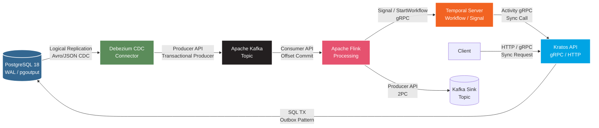
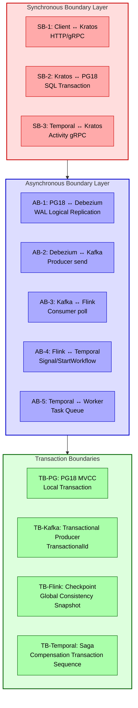

# Five-Technology Stack Data Flow and Control Flow Analysis

> **Stage**: TECH-STACK | **Prerequisites**: [Chinese source](../TECH-STACK-STREAMING-POSTGRES-TEMPORAL-KRATOS/01-system-composition/01.02-data-flow-control-flow-analysis.md) | **Formalization Level**: L4 | **Last Updated**: 2026-04-22

## 1. Definitions

**Def-TSS-01-01 Data Flow**

In system $S = (V, E, \delta)$, data flow is defined as a labeled directed edge sequence $DF = \langle (v_i, v_{i+1}, d_i) \rangle_{i=0}^{n-1}$, where $V = \{PG18, Debezium, Kafka, Flink, Temporal, Kratos\}$ are processing nodes, $d_i \in \mathcal{D}$ are data items, and $\delta: V \times \mathcal{D} \to V \times \mathcal{D}$ is the transition function. In the five-technology stack, $\mathcal{D}$ is the union of CDC events, Kafka messages, Temporal Signal/Query payloads, and gRPC/HTTP packets.

**Def-TSS-01-02 Control Flow**

Control flow $CF = \langle (v_i, v_{i+1}, c_i, \tau_i) \rangle$ is a directed relation with additional control semantics, where $c_i \in \mathcal{C}$ are control instructions (`COMMIT`, `SIGNAL`, `CALLBACK`, etc.), and $\tau_i \in \{\text{sync}, \text{async}\}$ marks synchronous or asynchronous semantics. Control flow determines *when* and *by whom* state transitions are triggered.

**Def-TSS-01-03 Transaction Boundary**

Transaction boundary $TB = (A, \prec, ACID)$ encapsulates the atomic operation set $A$, where the partial order $\prec$ describes precedence constraints. The five-technology stack exhibits hierarchical nesting:

- $TB_{PG}$: PostgreSQL local MVCC transaction;
- $TB_{Kafka}$: Kafka transactional producer (TransactionalId + PID);
- $TB_{Flink}$: Flink Checkpoint global consistency boundary (Chandy-Lamport snapshot);
- $TB_{Temporal}$: Temporal Saga compensation transaction boundary.

**Def-TSS-01-04 Synchronous Boundary**

Synchronous boundary $SB = (v_s, v_t, t_{timeout})$ requires the caller $v_s$ to suspend until receiving a response from $v_t$. Formally, $v_s$ blocks during $[t_{req}, \min(t_{resp}, t_{timeout})]$.

**Def-TSS-01-05 Asynchronous Boundary**

Asynchronous boundary $AB = (v_s, v_t, M, ack)$, where $v_s$ releases control immediately after delivering the message to the intermediate medium. $ack$ only confirms medium receipt, not business processing completion.

**Def-TSS-01-06 CDC Change Event**

CDC event $e_{cdc} = (op, t_x, k, v_{before}, v_{after}, lsn)$, where $op \in \{INSERT, UPDATE, DELETE\}$, $t_x$ is the source transaction ID, $k$ is the primary key, and $lsn$ is the PostgreSQL WAL logical position number.

**Def-TSS-01-07 Outbox Pattern**

Within $TB_{PG}$, business data is written to table $T_{biz}$ while the event is simultaneously written to the Outbox table $T_{outbox}$ in the same database; the CDC Connector captures $T_{outbox}$ changes and publishes them to the message bus. Formal guarantee: $\forall e \in T_{outbox}, \exists t \in TB_{PG}: e \prec_{tb} commit(t)$.

**Def-TSS-01-08 Temporal Signal & Query**

Temporal Signal is an asynchronous non-blocking primitive: $Signal(wid, name, payload)$ is appended to the Workflow historical event stream $H_{wid}$. Temporal Query is a synchronous read-only primitive that returns a Workflow state snapshot without modifying $H_{wid}$.

---

## 2. Properties

**Lemma-TSS-01-01 Acyclicity of Data Flow**

Let the data flow graph be $G_{DF} = (V, E_{DF})$. If the system satisfies the Outbox pattern and has no explicit reverse CDC link, then $G_{DF}$ is a DAG.

*Proof Sketch*: Vertices can be topologically sorted to obtain a total order $PG18 \prec Debezium \prec Kafka \prec Flink \prec \{Temporal, Kratos\}$. Assume for contradiction that a cycle exists; then there exists at least one reverse edge $(v_j, v_i), j > i$. In standard deployment, Kratos does not directly write to the WAL replication slot captured by Debezium, and Temporal does not directly produce WAL records captured by CDC; reverse control is accomplished through independent APIs and does not enter the CDC link. Hence reverse edges $\notin E_{DF}$, contradiction. $\square$

**Lemma-TSS-01-02 Termination of Control Flow**

If each component satisfies: (T1) PG18 transactions commit/rollback in finite steps; (T2) Kafka consumer groups have no messages infinitely retained; (T3) Flink enables Checkpoint; (T4) Temporal Workflow has no infinitely recursive Child Workflow; then any control flow instance $CF_i$ reaches a terminal state in finite time.

*Proof Sketch*: Model control flow as a finite positive-weight directed graph, where edge weights are processing delays. By (T1)-(T4), all edge weights are finite and positive. By Lemma-TSS-01-01 acyclicity, path length is finite and total delay has an upper bound, hence termination. $\square$

**Prop-TSS-01-01 Nested Transaction Boundary Consistency**

Let $TB_{outer}$ and $TB_{inner}$ be nested. If $TB_{outer}$'s commit semantics cover all side effects of $TB_{inner}$, and external failure allows internal side effects to be rolled back through compensation $C$, then the whole satisfies Saga consistency. Formally: $\sigma_0 \xrightarrow{TB_{inner}} \sigma_1 \xrightarrow{TB_{outer}\setminus TB_{inner}} \sigma_2$, and upon failure there exists $C$ such that $\sigma_1 \xrightarrow{C} \sigma_0' \approx \sigma_0$.

In the five-technology stack, $TB_{PG} \subset TB_{Kafka} \subset TB_{Flink} \subset TB_{Temporal}$, forming progressively strengthened consistency guarantees.

**Prop-TSS-01-02 Cascading Latency Bound of Synchronous Boundaries**

Let the synchronous boundary chain be $SB_1 \to \dots \to SB_n$, with each boundary latency $L_i$, expectation $E[L_i] = \mu_i$, and variance $Var[L_i] = \sigma_i^2$. If independent, then $E[L_{total}] = \sum \mu_i$ and $Var[L_{total}] = \sum \sigma_i^2$. By Chebyshev's inequality, $P(L_{total} > \sum \mu_i + k\sqrt{\sum \sigma_i^2}) \le 1/k^2$. Engineering-wise, minimizing synchronous boundaries is key to reducing tail latency.

**Lemma-TSS-01-03 Kafka Per-Partition Order Preservation**

Let Kafka Topic $T$ have $p$ partitions, and Debezium routes by primary key $k$ hash. For the CDC event sequence of the same $k$, if Debezium delivers in monotonically increasing $lsn$ order, then $\forall i < j: partition(e_i) = partition(e_j) \implies e_i$ is consumed by Flink before $e_j$.

*Proof Sketch*: Kafka guarantees single-partition message order; Debezium maps the same $k$ to the same partition and delivers in $lsn$ order. Consumers naturally preserve order when consuming by offset. $\square$

---

## 3. Relations

### 3.1 Data Interface and Control Interface Matrix

| Source Layer | Target Layer | Interface Protocol | Data Format | Transfer Semantics | Control Primitive | Synchronicity |
|--------------|--------------|--------------------|-------------|--------------------|-------------------|---------------|
| PG18 WAL | Debezium | pgoutput logical replication | Logical decoding message | Streaming push, replication slot | Heartbeat advance | Async |
| Debezium | Kafka | Producer API | JSON/Avro/Protobuf | ALO / EO (transaction) | `send()` | Async |
| Kafka | Flink | Source Connector | ConsumerRecord | Partition-level order | `poll()` | Async |
| Flink | Kafka | Sink Connector | ProducerRecord | Two-phase commit EO | `commit()` | Async |
| Flink | Temporal | gRPC SDK | Signal/StartWorkflow | Delivery-only, no processing guarantee | `signal()` | Async |
| Temporal | Kratos | gRPC / HTTP | Protobuf/JSON | Sync within Activity | `execute()` | Sync |
| Kratos | PG18 | Wire Protocol | SQL + Parameters | Local transaction | `BEGIN...COMMIT` | Sync |
| Kratos | Client | HTTP/gRPC | Response Body | Request-Response | `reply()` | Sync |

### 3.2 QoS Evolution Relationship

Data flow $qos$ is monotonically strengthened: PG18→Debezium is ALO; Debezium→Kafka can be upgraded to EO via transactional producer; Kafka→Flink→Kafka achieves EO through Flink two-phase commit; Flink→Temporal is ALO (Signal has no transaction rollback); Temporal→Kratos is synchronous EO within Activity (PG local transaction + idempotency key).

---

## 4. Argumentation

### 4.1 End-to-End Data Flow Analysis

**Stage 1: PG18 WAL → Debezium**

PG18 enables logical replication slot (`pg_create_logical_replication_slot`, `plugin = 'pgoutput'`). After transaction commit, WAL is decoded into a logical message stream:

$$WAL_{physical} \xrightarrow{\text{logical decoding}} \langle e_{cdc}^{(1)}, e_{cdc}^{(2)}, \dots \rangle$$

Debezium maintains a streaming replication connection. Key parameters: `snapshot.mode = initial`, `heartbeat.interval.ms = 10000`, `slot.name = debezium`.

**Stage 2: Debezium → Kafka**

Debezium serializes $e_{cdc}$ into `SourceRecord` and delivers it to Topic `{database}.{schema}.{table}`. When Kafka transactional producer is enabled, `read_committed` isolation is satisfied.

**Stage 3: Kafka → Flink**

Flink consumes via `KafkaSource`, configuring `isolation.level = read_committed` to ignore uncommitted transactional messages. Processing logic typically includes: deserialization → KeyedProcessFunction state computation → window operation → side output (Dead Letter Topic).

**Stage 4: Flink → Temporal / Kafka Sink**

Processing results have three paths: Path A writes to Kafka Sink Topic; Path B sends Signal or starts Workflow via Temporal SDK; Path C directly calls Kratos API (not recommended, introduces synchronous boundary).

### 4.2 Control Flow Analysis

**Forward Control Flow**:

```
Client --(sync)--> Kratos --(sync)--> PG18 --(async)--> Debezium
  --(async)--> Kafka --(async)--> Flink --(async)--> Temporal
  --(async)--> Worker --(sync)--> Kratos --(sync)--> Temporal
  --(async)--> Completion Notification --> Client
```

**Callback Relationships**:

1. Kratos → Client: Synchronous request-response is inherently a callback;
2. Temporal → External: Upon Workflow completion, Activity calls Webhook or sends Kafka message to achieve async callback, which does not enter the CDC link and does not constitute a control loop.

**Blocking / Non-Blocking Points**:

| Position | Type | Blocking Magnitude | Risk |
|----------|------|--------------------|------|
| Client→Kratos | Sync | 10ms~1s | Thread pool exhaustion |
| Kratos→PG18 | Sync | 1ms~100ms | Connection pool exhaustion |
| PG18→Debezium | Async | Seconds-level | Replication slot accumulation, disk bloat |
| Debezium→Kafka | Async | 10ms~100ms | Producer backpressure |
| Kafka→Flink | Async | Milliseconds | Rebalance pause |
| Flink→Temporal | Async | Milliseconds | gRPC connection pool exhaustion |
| Temporal→Kratos | Sync | 10ms~1s | Activity timeout triggering compensation |

### 4.3 Potential Risks and Mitigations

1. **Replication Slot Accumulation**: Debezium downtime causes WAL accumulation. Mitigation: `wal_sender_timeout` + heartbeat monitoring + disk alerting.
2. **Kafka Consumption Lag**: Flink processing delay. Mitigation: Parallelism $\ge$ Topic partition count.
3. **Saga Hanging**: Activity call succeeds but network times out, Temporal retry causes duplicate call. Mitigation: Kratos API implements idempotency key `Idempotency-Key`.
4. **Checkpoint Failure**: Backpressure causes timeout. Mitigation: Enable Unaligned Checkpoint.

---

## 5. Proof / Engineering Argument

### 5.1 Data Flow Acyclicity

**Thm-TSS-01-01 Data Flow Acyclicity**

Under standard deployment, $G_{DF} = (V, E_{DF})$ is a DAG.

*Proof*: Define topological order $\phi: V \to \{1,\dots,6\}$: $\phi(PG18)=1, \phi(Debezium)=2, \phi(Kafka)=3, \phi(Flink)=4, \phi(Temporal)=5, \phi(Kratos)=6$. In standard deployment, every $(u,v) \in E_{DF}$ satisfies $\phi(u) < \phi(v)$:

- WAL replication is only PG18→Debezium;
- Debezium is Producer, Kafka is Broker;
- Flink is Consumer and Sink Producer;
- Flink sends Signal to Temporal;
- Temporal Activity calls Kratos;
- Kratos writes to PG18 as *new* business write, not reflux of already processed data.

Assume for contradiction that cycle $C$ exists; then along the cycle $\phi(v_0) < \phi(v_1) < \dots < \phi(v_n) = \phi(v_0)$, strict transitivity requires $\phi(v_0) < \phi(v_0)$, contradiction. $\square$

*Engineering Constraint*: Flink Sink is prohibited from directly modifying the source table captured by CDC; it must write to an independent result table or Topic.

### 5.2 Control Flow Deadlock Freedom

**Thm-TSS-01-02 Control Flow Deadlock Freedom**

If each component follows standard timeout and retry strategies, and Temporal Saga compensation has no cyclic dependencies, then control flow will not deadlock.

*Proof*: The four necessary conditions for deadlock (Coffman) are eliminated one by one:

1. **Mutual Exclusion**: PG18 row locks, Kafka partition locks, and Temporal Workflow ID exclusive execution have finite hold times (released upon transaction/processing completion).
2. **Hold and Wait**: Kratos holds PG18 connection waiting for commit, but does not wait for Temporal response (async decoupling); Temporal Worker waits for Kratos response, but Kratos does not depend on other resources from that Worker; Flink commit offset is the final step.
3. **No Preemption**: PG18 transactions can be interrupted by `statement_timeout`; Temporal Activities can be cancelled by `StartToCloseTimeout`; Flink Tasks can be interrupted and recovered by the Checkpoint coordinator.
4. **Circular Wait**: Control flow topology is chain-like; what Kratos receives from Temporal is a *new request*, not a resource request previously held; Client and Kratos are request-response rather than resource dependency cycle. The resource dependency graph $G_{res}$ has no bidirectional wait edges.

At least one of the four conditions is not satisfied, hence no deadlock. $\square$

*Engineering Constraint*: Temporal Worker and Kratos API servers use independent thread pools and connection pools to avoid thread-exhaustion livelock.

### 5.3 End-to-End Exactly-Once Semantic Conditions

**Prop-TSS-01-03 End-to-End EO Conditions**

End-to-end Exactly-Once holds under the following conditions:

- (C1) Debezium uses Kafka transactional producer (`read_committed`);
- (C2) Flink enables Checkpoint, Kafka Source/Sink configures two-phase commit;
- (C3) Temporal Signal consumption is idempotent (deduplicated by event ID);
- (C4) Kratos business interface implements idempotency key.

*Argument*: (C1) guarantees Debezium→Kafka is EO; (C2) guarantees Kafka→Flink→Kafka is EO (Checkpoint atomically commits offset and state, Sink transaction commits upon Checkpoint completion); (C3) deduplicates duplicate Signals on the Temporal side; (C4) deduplicates duplicate requests on the Kratos side. The four conditions串联 form an end-to-end EO pipeline. $\square$

---

## 6. Examples

### 6.1 Scenario: E-commerce Order Processing

Order state machine: `CREATED` → `PAID` → `INVENTORY_RESERVED` → `SHIPPED` → `COMPLETED`. Payment callback is triggered by the external gateway, inventory reservation is triggered by Flink risk-control decision, and shipping is orchestrated by Temporal Saga.

**Data Flow Walkthrough**:

1. **Order Creation**: Client `POST /orders` → Kratos opens PG18 transaction → `INSERT orders` + `INSERT outbox` → `COMMIT`.
2. **CDC Capture**: PG18 WAL → Debezium decodes → generates CDC event → Avro serialization → Kafka Topic `dbserver1.public.outbox`.
3. **Flink Processing**: Flink Source consumes Outbox Topic → `KeyedProcessFunction` (keyBy `order_id`) maintains state machine → risk-control scoring → approved writes to `orders.approved`, rejected writes to `orders.rejected` + DLQ.
4. **Saga Orchestration**: Flink consumes `orders.approved` → `SignalWithStart` to `OrderSaga-ORD-0001` → Temporal Worker executes `ReserveInventory` Activity → calls Kratos Inventory gRPC → PG18 reserves inventory + Outbox `INVENTORY_RESERVED` → Activity succeeds → Workflow advances to `INVENTORY_RESERVED`.
5. **Compensation Path**: If `ShipOrder` fails → Temporal triggers `ReleaseInventory` → Kratos releases inventory + Outbox `INVENTORY_RELEASED` → Workflow enters `COMPENSATED`.

**Control Flow and Timeout Strategy**:

| Step | Control Primitive | Synchronicity | Timeout | Retry |
|------|-------------------|---------------|---------|-------|
| User places order | Kratos HTTP POST | Sync | 30s | Client-side |
| Order write | PG18 `BEGIN...COMMIT` | Sync | 5s | None, returns 500 |
| CDC push | WAL replication | Async | Heartbeat 10s | Debezium auto-reconnect |
| Risk-control compute | Flink ProcessFunction | Async | Window 60s | Flink auto-recovery |
| Saga trigger | `signalWithStart` | Async | gRPC 10s | Sink retry |
| Inventory reservation | Kratos gRPC | Sync | Activity 30s | Exponential backoff |
| Logistics order | Kratos HTTP | Sync | Activity 60s | Compensate after 3 retries |
| Result notification | Webhook | Async | 10s | Independent retry queue |

**Key Observation**: The same order event is ordered at the Kafka partition level; Flink processes by event time; Temporal Signal appends to the historical sequence; the overall state machine has no out-of-order. End-to-end latency is approximately 2–3s (PG18 ~10ms + Debezium→Kafka ~100ms + Flink ~200ms + Temporal Saga ~2s). When Flink Checkpoint fails, it rolls back to the last successful point, Kafka offset rolls back synchronously, and Temporal idempotency deduplication avoids duplicate side effects.

---

## 7. Visualizations

### 7.1 End-to-End Data Flow Diagram



### 7.2 Control Flow Sequence Diagram

```mermaid
sequenceDiagram
    autonumber
    participant C as Client
    participant K as Kratos API
    participant P as PG18
    participant D as Debezium
    participant Ka as Kafka
    participant F as Flink
    participant T as Temporal
    participant KW as Kratos (Webhook)

    rect rgb(230, 245, 255)
        Note over C,P: Sync Boundary SB-1: User Request
        C->>+K: POST /orders (30s timeout)
        K->>+P: BEGIN; INSERT orders+outbox
        P-->>-K: COMMIT OK
        K-->>-C: 201 Created
    end

    rect rgb(255, 245, 230)
        Note over P,Ka: Async Boundary AB-1: CDC Capture
        P->>D: WAL logical replication (stream)
        D->>Ka: producer.send(record) (async)
        Ka-->>D: ack (leader replica)
    end

    rect rgb(240, 255, 240)
        Note over Ka,F: Async Boundary AB-2: Stream Processing
        Ka->>F: poll() (consumer)
        F->>F: KeyedProcessFunction<br/>stateful computation
    end

    rect rgb(255, 240, 245)
        Note over F,T: Async Boundary AB-3: Saga Trigger
        F->>T: SignalWithStart(order_id)
        T-->>F: gRPC OK (signal accepted)
        T->>T: Task Queue dispatch
    end

    rect rgb(245, 240, 255)
        Note over T,KW: Sync Boundary SB-2: Activity Execution
        T->>+K: Activity: ReserveInventory<br/>(StartToClose=30s)
        K->>+P: BEGIN; UPDATE inventory
        P-->>-K: COMMIT OK
        K-->>-T: gRPC OK (reserved)
    end

    rect rgb(255, 255, 240)
        Note over T,C: Async Boundary AB-4: Result Notification
        T->>KW: POST /webhook/order-status<br/>(async callback)
        KW-->>T: 202 Accepted
    end
```

### 7.3 Synchronous / Asynchronous Boundary Marker Diagram



---

### 3.3 Project Knowledge Base Cross-References

The data flow and control flow analysis described in this document has the following associations with the project's existing knowledge base:

- [Stream Computing Model Mind Map](../Knowledge/01-concept-atlas/streaming-models-mindmap.md) — Positioning of the five-technology stack in the stream computing model spectrum
- [Data Mesh Streaming Integration](../Knowledge/03-business-patterns/data-mesh-streaming-integration.md) — Mapping of data flow boundaries and data product autonomy
- [Flink State Management Complete Guide](../Flink/02-core/flink-state-management-complete-guide.md) — Engineering implementation of Flink internal data flow and state transfer
- [Temporal + Flink Layered Architecture](../Knowledge/06-frontier/temporal-flink-layered-architecture.md) — Architectural argumentation for the orthogonal complementarity of control flow and data flow

---

## 8. References
