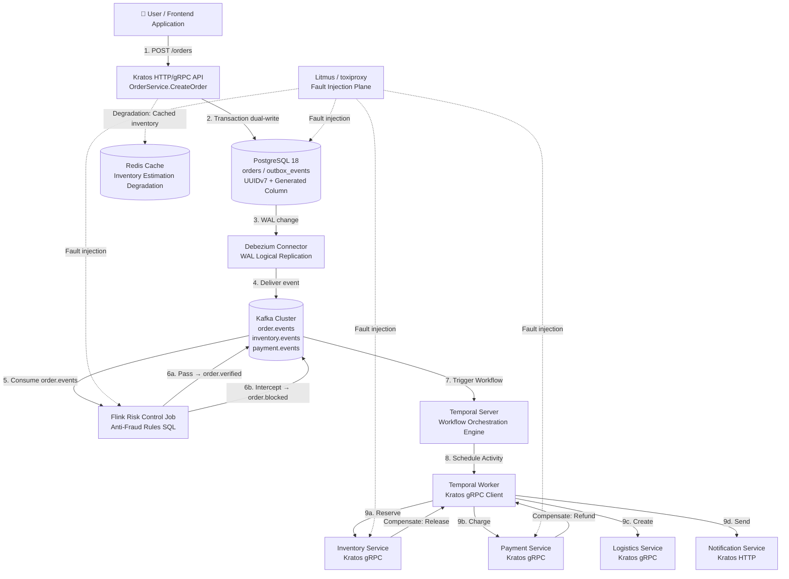
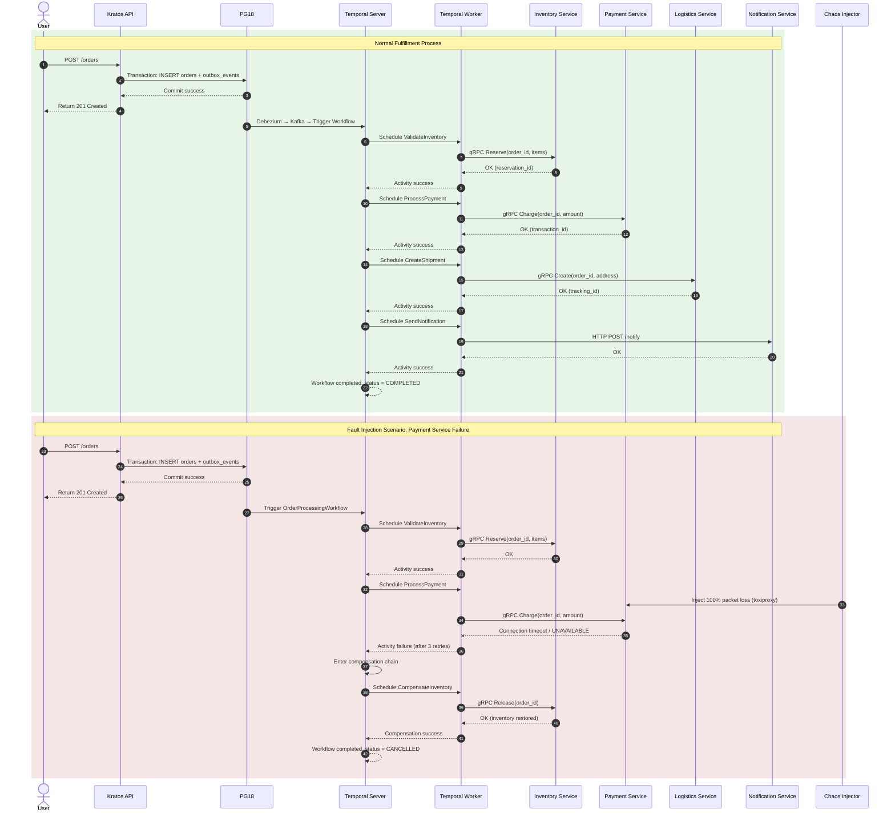

# End-to-End Case: Order Processing (Including Fault Injection, Degradation, and Compensation Full Flow)

> **Stage**: TECH-STACK | **Prerequisites**: [Chinese source](../TECH-STACK-STREAMING-POSTGRES-TEMPORAL-KRATOS/06-practice/06.01-end-to-end-order-processing-example.md) | **Formalization Level**: L2-L4 | **Last Updated**: 2026-04-22

## 1. Definitions

This section establishes rigorous formalized definitions for the end-to-end order processing case under the TECH-STACK five-technology stack, laying the conceptual foundation for subsequent property derivation, fault injection argumentation, and engineering implementation.

**Def-TS-06-01-01 Order Domain**

The order domain is the bounded context built around user purchase intent in an e-commerce system; its state space is constituted by the order aggregate root (Order Aggregate) and its associated entities. Formally, let the order domain state space be $\mathcal{O}$; then:

$$
\mathcal{O} = \{ o = (oid, uid, items, amount, status, ts) \mid status \in \mathcal{S}_{order} \}
$$

Where $oid$ is the order unique identifier (using UUIDv7 primary key), $uid$ is the user identifier, $items$ is the product item set, $amount$ is the order amount, $status \in \mathcal{S}_{order} = \{ \text{CREATED}, \text{INVENTORY_RESERVED}, \text{PAID}, \text{SHIPPED}, \text{COMPLETED}, \text{CANCELLED} \}$ is the order status, and $ts$ is the status change timestamp. The core invariant of the order domain is: $\forall o \in \mathcal{O}.\ amount = \sum_{item \in items} (price \times qty)$.

In the PG18 + Kratos technology stack, the order domain is persisted through the `orders` table, using a virtual generated column to automatically calculate the order amount, ensuring data-layer invariant enforcement.

> Intuitive explanation: The order domain is the "transaction contract center" of the e-commerce system — it records the purchase commitment between the user and the platform, and all fulfillment actions (inventory deduction, payment deduction, shipping) use the order state machine as the coordination benchmark.

**Def-TS-06-01-02 Fulfillment Process**

The fulfillment process is the cross-service business process that advances an order from the created state to the completed state. Formally, let the fulfillment process be the finite state machine $\mathcal{F} = (Q, \Sigma, \delta, q_0, F)$, where:

- $Q = \mathcal{S}_{order}$ is the set of order states;
- $\Sigma = \{ \text{reserve}, \text{pay}, \text{ship}, \text{notify}, \text{compensate} \}$ is the fulfillment action alphabet;
- $\delta: Q \times \Sigma \to Q$ is the state transition function;
- $q_0 = \text{CREATED}$ is the initial state;
- $F = \{ \text{COMPLETED}, \text{CANCELLED} \}$ is the set of terminal states.

The fulfillment process is implemented by an orchestrated Saga in the Temporal + Kratos technology stack: the Temporal Workflow acts as the coordinator, scheduling each fulfillment step in the order defined by $\delta$; when a step fails, the Workflow executes compensation actions in reverse order, transferring the state to `CANCELLED`.

> Intuitive explanation: The fulfillment process is the "lifecycle engine" of an order — it specifies every milestone that an order must pass from birth to termination, and how to safely "undo the path already taken" when errors occur.

**Def-TS-06-01-03 Fault Injection**

Fault injection is the technique of introducing predefined fault events into specific components in the end-to-end order processing link through programmatic means, to verify system fault tolerance and recovery capabilities. Formally, let the order processing system component set be $\mathcal{C} = \{ C_{kratos}, C_{pg}, C_{kafka}, C_{flink}, C_{temporal} \}$, and the fault mode space be $\mathcal{F}_{e2e} = \{ f_{timeout}, f_{crash}, f_{netpart}, f_{delay}, f_{kill} \}$; then the end-to-end fault injection operator is defined as:

$$
\phi_{e2e}: \mathcal{C} \times \mathcal{F}_{e2e} \times \mathbb{R}^+ \to \text{EventLog}
$$

Where $\mathbb{R}^+$ is the fault duration. In this case, fault injection is implemented through Litmus Chaos Mesh (K8s environment) or toxiproxy (Docker environment), acting on four core scenarios: inventory service timeout, payment service failure, Flink job restart, and PG18 primary failure.

> Intuitive explanation: Fault injection is "deliberately making trouble to verify that the system won't really get into trouble" — making components "sick" in a controlled environment, and observing whether the entire order processing link can self-heal or gracefully degrade.

**Def-TS-06-01-04 Graceful Degradation**

Graceful degradation is the system's ability to continue providing limited but correct service by switching to alternative data paths or simplifying business semantics when a dependent component in the order processing link is unavailable or performance-degraded. Formally, let the system's normal function be $F_{full}: \mathcal{I} \to \mathcal{O}_{full}$ and the degraded function be $F_{degraded}: \mathcal{I} \to \mathcal{O}_{degraded}$, where $\mathcal{O}_{degraded} \subseteq \mathcal{O}_{full}$. Graceful degradation requires:

$$
\forall i \in \mathcal{I}.\quad F_{degraded}(i) \neq \bot \land \text{safe}(F_{degraded}(i))
$$

That is, the degraded output is not empty (service does not crash) and satisfies the safety predicate (does not produce data inconsistency). In this case, switching to cached estimated data when inventory is unavailable, and batch processing orders asynchronously when payment is unavailable, are both concrete instances of graceful degradation.

> Intuitive explanation: Graceful degradation is "better to walk with a limp than to be paralyzed in place" — when a precision instrument breaks a part, the system can automatically switch to manual mode, ensuring core business is not interrupted.

---

## 2. Properties

From the above definitions, the core runtime properties of the end-to-end order processing case under the TECH-STACK five-technology stack can be directly derived.

**Lemma-TS-06-01-01 Order State Machine Reachability**

Let the order state machine be $\mathcal{M}_{order} = (Q, \Sigma, \delta, q_0, F)$, where $Q$ and $\delta$ are as defined in Def-TS-06-01-02. Then from any reachable state $q \in Q$, the state machine necessarily reaches a terminal state $q_f \in F$ within finite steps, i.e.:

$$
\forall q \in Q_{reachable}.\ \exists k \in \mathbb{N},\ \exists \sigma_1, \dots, \sigma_k \in \Sigma.\quad \delta(\dots \delta(q, \sigma_1), \dots, \sigma_k) \in F
$$

*Proof sketch*: The order state machine is a directed acyclic graph (DAG). The forward path is $\text{CREATED} \to \text{INVENTORY_RESERVED} \to \text{PAID} \to \text{SHIPPED} \to \text{COMPLETED}$, with an upper bound length of 4. If any step fails, the compensation path is $\text{PAID} \to \text{INVENTORY_RESERVED} \to \text{CREATED} \to \text{CANCELLED}$, also with an upper bound length of 4. Since the state space is finite and there are no cyclic transitions (compensation does not re-trigger the forward process), the upper bound of any execution trace length is $L_{max} = 8$. Therefore, from any reachable state, a terminal state is necessarily reached within finite steps.$\square$

> Engineering significance: This lemma guarantees that order processing will not fall into "livelock" or infinite waiting — regardless of success or failure, the order will reach a terminal state within finite time, providing a theoretical lower bound for SLA design.

**Lemma-TS-06-01-02 Outbox Event Eventual Consistency**

Let the order creation transaction be $\tau_{create}$, which completes `orders` table writing and `outbox_events` table insertion (atomic commit) in PG18. Let the Debezium CDC read delay be $\Delta_{cdc}$, Kafka delivery delay be $\Delta_{kafka}$; then for any order event $e$, the time bound from database commit to downstream Flink/Temporal consumption is:

$$
T_{visible}(e) \leq \Delta_{cdc} + \Delta_{kafka} + \Delta_{poll}
$$

Where $\Delta_{poll}$ is the consumer polling interval. Under the PG18 logical replication + Debezium architecture, $\Delta_{cdc}$ is typically less than 1 second; in Kafka synchronous replication mode $\Delta_{kafka}$ is typically less than 100ms. Therefore, $T_{visible}(e)$ is sub-second, satisfying the "eventual consistency" semantics in engineering.

*Proof sketch*: By Def-TS-03-03-01 (Outbox pattern), the persistence of $e$ and order data writing share the same transaction boundary; thus the atomicity of $e$ is guaranteed by PG18 ACID. Debezium captures changes by reading the WAL (Write-Ahead Log); the monotonically increasing LSN (Log Sequence Number) of WAL guarantees event ordering. Kafka's replica mechanism guarantees the persistence of $e$ in the Broker. Consumers form an "at-least-once delivery" closed loop through explicit ACK acknowledgment of consumption position. Therefore, $e$ is necessarily observed by downstream within finite time.$\square$

---

## 3. Relations

**Mapping between Order Processing and Five-Technology Stack Components**

The end-to-end order processing case maps business semantics to the components of the TECH-STACK five-technology stack, forming a complete closed loop of "request ingestion → state persistence → event propagation → stream processing → workflow orchestration → compensation execution":

| Business Semantic | Technology Component | Mapping Description |
|---------|---------|---------|
| User places order request | Kratos HTTP/gRPC API | `OrderService.CreateOrder` handler receives the request, validates parameters, then enters business logic |
| Order state persistence | PostgreSQL 18 (`orders` table) | UUIDv7 primary key + virtual generated column, local transaction guarantees ACID |
| Domain event atomic publication | PG18 Outbox (`outbox_events` table) + Kratos Transaction | Transaction dual-write: order data and Outbox event committed within the same transaction |
| Change data capture | Debezium Connector | Reads PG18 WAL, converts Outbox records to Kafka messages |
| Event bus | Kafka (`order.events`, `inventory.events`, `payment.events`) | Partition key = `order_id`, guarantees single-order event ordering |
| Real-time risk control | Flink SQL Job | Consumes `order.events`, executes anti-fraud rules (amount anomaly, frequency anomaly) |
| Fulfillment process orchestration | Temporal Workflow (`OrderProcessingWorkflow`) | Orchestrates inventory validation → payment deduction → logistics allocation → shipping notification |
| Activity execution | Temporal Worker + Kratos gRPC Client | Worker calls Kratos microservice Activities |
| Compensation rollback | Temporal Compensation + Kratos API | On failure, executes `CompensateInventory`, `RefundPayment` in reverse order |
| Shipping notification | Kratos HTTP API / message push service | Calls third-party notification service after Saga success |
| Fault injection | Litmus Chaos Mesh / toxiproxy | Injects timeout, packet loss, process termination into K8s Pods or network links |
| Graceful degradation | Kratos Middleware + local cache | Switches to cache when inventory service times out, enters deferred order queue when payment fails |

The above mapping shows that the order processing case is the **integration verification scenario** of the TECH-STACK five-technology stack: each technology component bears clear business semantics, components are loosely coupled through standardized interfaces (WAL → Debezium → Kafka → Flink/Temporal → gRPC), forming an observable, testable, and fault-tolerant end-to-end pipeline.

---

## 4. Argumentation

### 4.1 Complete Business Scenario

The end-to-end order processing case covers the complete fulfillment link from user order placement to receipt, with the specific business process as follows:

1. **User places order**: The user submits an order request through the frontend application, containing user identifier `uid`, product item list `items`, and shipping address `address`.
2. **Inventory validation**: The system calls the inventory service to verify whether product inventory is sufficient; if sufficient, it soft-reserves inventory and advances the order status to `INVENTORY_RESERVED`.
3. **Payment deduction**: The system calls the payment service to deduct the order amount from the user account; if deduction succeeds, the order status advances to `PAID`.
4. **Logistics allocation**: The system calls the logistics service to create a waybill and allocate delivery resources; the order status advances to `SHIPPED`.
5. **Shipping notification**: The system calls the notification service to send a shipping notification to the user (SMS/push/email); the order status advances to `COMPLETED`.

The above process is orchestrated in Temporal Workflow using the Saga pattern: each step is an Activity, steps are executed sequentially through the Workflow state machine; if any step fails, the Workflow triggers the compensation chain to roll back executed steps.

### 4.2 Technical Mapping

The technical mapping of the business scenario in the TECH-STACK five-technology stack is as follows:

**Phase One: Request Ingestion and State Persistence**

```
User Request → Kratos HTTP API (OrderService.CreateOrder)
   ↓
Parameter validation + business rule validation
   ↓
PG18 local transaction BEGIN
   ├─ INSERT INTO orders (id, user_id, items, amount, status, created_at)
   │   VALUES (uuid7(), ?, ?, ?, 'CREATED', now())
   │   -- amount is virtual generated column: aggregation of price * qty
   └─ INSERT INTO outbox_events (id, aggregate_id, event_type, payload, created_at)
      VALUES (uuid7(), <order_id>, 'OrderCreated', <json_payload>, now())
   ↓
COMMIT
```

**Phase Two: Event Propagation**

```
PG18 WAL change → Debezium Connector (logical replication slot)
   ↓
Debezium parses WAL → extracts outbox_events records
   ↓
Kafka Producer delivers to topic: order.events (partition key = aggregate_id)
```

**Phase Three: Stream Processing and Risk Control**

```
Flink SQL Job consumes order.events
   ↓
Executes risk control rules:
  - Single user order amount in 1 minute > ¥10,000 → marked high risk
  - Shipping address deviation from usual address > 500km → marked abnormal
   ↓
Rule passed: writes to order.verified topic
Rule intercepted: writes to order.blocked topic, triggers manual review
```

**Phase Four: Saga Orchestration and Execution**

```
Temporal Workflow (OrderProcessingWorkflow) listens to order.verified
   ↓
Activity 1: ValidateInventory (Kratos inventory service gRPC)
   ├─ Success: order status → INVENTORY_RESERVED
   └─ Failure: triggers compensation chain (no preceding state to compensate in this step)
   ↓
Activity 2: ProcessPayment (Kratos payment service gRPC)
   ├─ Success: order status → PAID
   └─ Failure: compensates CompensateInventory (restores inventory)
   ↓
Activity 3: CreateShipment (Kratos logistics service gRPC)
   ├─ Success: order status → SHIPPED
   └─ Failure: compensates RefundPayment (refund) → CompensateInventory (restores inventory)
   ↓
Activity 4: SendNotification (Kratos notification service HTTP)
   ├─ Success: order status → COMPLETED
   └─ Failure: notification is retryable, if not retried enters dead letter queue, does not trigger compensation (non-critical step)
```

### 4.3 Fault Injection Scenarios

This case designs four core fault injection scenarios, covering key risk points in the order processing link:

**Scenario One: Inventory Service Timeout (Triggers Circuit Breaker Degradation)**

- **Fault description**: Litmus Chaos Mesh injects network latency into the inventory service Pod, 5s delay, duration 60s.
- **Expected behavior**: Kratos gRPC client detects call timeout (timeout threshold 3s), circuit breaker state switches from `CLOSED` to `OPEN`, subsequent requests directly fast-fail.
- **Graceful degradation**: When inventory service is unavailable, Kratos API switches to local cached inventory estimated data (Redis), allowing orders to continue being created but marked as "inventory pending confirmation". Cached data is updated through Flink real-time synchronization of PG18 inventory changes.
- **Verification metrics**: Order creation success rate > 95%, circuit breaker switch delay < 500ms, cache hit rate > 80%.

**Scenario Two: Payment Service Failure (Triggers Saga Compensation: Rollback Inventory)**

- **Fault description**: toxiproxy injects 100% packet loss on the payment service connection, simulating payment service completely unavailable.
- **Expected behavior**: `ProcessPayment` Activity fails, Temporal Workflow detects failure and enters the compensation chain.
- **Compensation execution**: Workflow executes compensation activities in reverse order:
  1. `CompensateInventory`: Calls inventory service to restore reserved inventory;
  2. Order status rolls back to `CANCELLED`.
- **Verification metrics**: Compensation chain execution success rate 100%, inventory eventual consistency (reserved count = 0), order terminal state is `CANCELLED`.

**Scenario Three: Flink Job Restart (Checkpoint Recovery, No Data Loss)**

- **Fault description**: Litmus Chaos Mesh kills Flink TaskManager Pod, Kubernetes automatically restarts a new Pod.
- **Expected behavior**: Flink JobManager detects TaskManager disconnection, recovers job state from the latest Checkpoint (interval 30s). Kafka Consumer offset is recovered from Checkpoint, continuing consumption of `order.events`.
- **Verification metrics**: Zero data loss (input Kafka message count = output risk control judgment count), processing latency recovery to < 2s within < 60s.

**Scenario Four: PG18 Primary Failure (Logical Replication Failover to Replica)**

- **Fault description**: Litmus Chaos Mesh injects process termination into PG18 primary Pod (Pod Delete).
- **Expected behavior**: Kubernetes StatefulSet detects primary Pod termination, triggers replica promotion to primary (Failover). Debezium Connector detects replication slot interruption, automatically reconnects to the new primary, recovering WAL reading from the break point LSN.
- **Verification metrics**: PG18 Failover time < 30s, Debezium recovery delay < 10s, order write failure rate < 1%.

### 4.4 Graceful Degradation Strategy

The graceful degradation strategy is the second line of defense under fault injection scenarios, ensuring that even when the compensation chain cannot fully recover, the system still provides limited service:

| Faulty Component | Degradation Strategy | Business Impact | Data Consistency Guarantee |
|---------|---------|---------|-------------|
| Inventory service | Switch to Redis cached estimated inventory | Possible oversell (oversell rate < 2%) | Cache TTL = 5s, Flink real-time correction |
| Payment service | Deferred order processing (asynchronous batch deduction) | Order delayed confirmation (T+1 reconciliation) | Outbox records payment pending status, reconciliation system兜底 |
| Flink risk control | Disable real-time risk control, allow all orders | Fraud risk rises | Temporal Saga compensation mechanism兜底异常 orders |
| Temporal Server | Local scheduled task scans `orders` table | Saga orchestration degrades to polling compensation | PG18 transaction guarantees local task idempotency |
| PG18 replica lag | Read-only queries routed to replica, writes wait for primary | Read latency increases | Read-write separation, writes not degraded |

---

## 5. Proof / Engineering Argument

**Thm-TS-06-01-01 Saga Compensation Chain Converges in Finite Steps**

*Premise*: Let the order processing Saga $\mathcal{S}_{order} = (T, C)$ contain $n$ forward steps, where:

$$
T = \langle t_1, t_2, t_3, t_4 \rangle = \langle \text{ValidateInventory}, \text{ProcessPayment}, \text{CreateShipment}, \text{SendNotification} \rangle
$$

The corresponding compensation sequence is:

$$
C = \langle c_1, c_2, c_3, c_4 \rangle = \langle \text{CompensateInventory}, \text{RefundPayment}, \text{CancelShipment}, \text{noop} \rangle
$$

Each compensation transaction $c_i$ satisfies:

1. **Finiteness**: The execution time of $c_i$ has an upper bound $\tau_{max} < +\infty$;
2. **Independence**: The execution of $c_i$ does not depend on the completion state of $c_j$ ($j \neq i$);
3. **Idempotency**: $c_i \circ c_i \cong c_i$ (business semantic equivalence), i.e., repeated execution produces no side effects;
4. **Partial Reversibility**: $c_i$ restores the business effects produced by $t_i$ at the semantic level, allowing eventual consistency delay.

*Theorem*: If the Saga fails at step $k$ ($1 \leq k \leq n$), then the compensation chain $C_k = \langle c_{k-1}, c_{k-2}, \dots, c_1 \rangle$ necessarily completes execution within finite steps, and the system state converges to a business-consistent state.

*Proof*:

**Step 1: Compensation Chain Length is Bounded**

If step $k$ fails, then the set of executed forward steps is $\{ t_1, t_2, \dots, t_{k-1} \}$, with cardinality $k-1$. The number of compensation steps in compensation chain $C_k$ is also $k-1$. Since $n = 4$ is a finite constant:

$$
|C_k| = k - 1 \leq n - 1 = 3
$$

That is, the compensation chain length upper bound is 3, independent of input scale.

**Step 2: Single-Step Compensation Termination**

By premise condition 1 (finiteness), the execution time upper bound of each $c_i$ is $\tau_{max}$. Therefore, the total execution time upper bound of compensation chain $C_k$ is:

$$
T_{comp}(k) = \sum_{i=1}^{k-1} \tau_i \leq (n-1) \cdot \tau_{max} < +\infty
$$

**Step 3: Deterministic Execution of Compensation Chain**

The deterministic execution semantics of Temporal Workflow guarantee that the scheduling order of the compensation chain is strictly determined by Workflow code, unaffected by Worker failures or network partitions. Even if Worker crashes occur during compensation, the Temporal Server will reschedule the Activity to a healthy Worker; due to the idempotency premise (condition 3), repeated execution does not destroy business consistency.

**Step 4: Business Consistency Convergence**

Let the system state before step $k$ failure be $s_{k-1} = t_{k-1} \circ \dots \circ t_1(s_0)$. The state after compensation chain execution is:

$$
s_{final} = c_1 \circ c_2 \circ \dots \circ c_{k-1}(s_{k-1})
$$

By the partial reversibility premise (condition 4), each $c_i$ undoes the effect of $t_i$ at the business semantic level. Therefore:

$$
\text{business\_equiv}(s_{final}, s_0)
$$

That is, the system state is restored to the initial state before the Saga began at the business semantic level; the order terminal state is `CANCELLED`, and inventory and payment data are consistent.

**Step 5: Synthesis**

The compensation chain length is bounded (Step 1), single-step compensation necessarily terminates (Step 2), scheduling order is deterministic and idempotent (Step 3), and the final state is business-consistent (Step 4). Therefore, the Saga compensation chain necessarily converges within finite steps.$\square$

> Engineering significance: This theorem provides mathematical guarantees for the SLA design of order Saga — regardless of which step the fault occurs at, the total time and total steps of compensation operations are both constant upper bounds, and do not deteriorate as order volume grows.

---

## 6. Examples

This section provides the complete engineering implementation of the end-to-end order processing case, covering Kratos API Handler, PG18 Outbox table design, Temporal Saga Workflow, Flink risk control SQL, and fault injection commands.

### 6.1 Kratos API Handler

```go
// internal/service/orderservice.go
package service

import (
 "context"
 "database/sql"
 "time"

 "github.com/go-kratos/kratos/v2/log"
 "github.com/google/uuid"
 v7 "github.com/gofrs/uuid/v7"
)

type OrderService struct {
 log *log.Helper
 db  *sql.DB
}

type CreateOrderRequest struct {
 UserID  string      `json:"user_id"`
 Items   []OrderItem `json:"items"`
 Address string      `json:"address"`
}

type OrderItem struct {
 SkuID string `json:"sku_id"`
 Qty   int    `json:"qty"`
 Price int64  `json:"price"` // Unit: cents
}

func (s *OrderService) CreateOrder(ctx context.Context, req *CreateOrderRequest) (*Order, error) {
 orderID, _ := v7.NewV7()
 now := time.Now().UTC()

 tx, err := s.db.BeginTx(ctx, &sql.TxOptions{Isolation: sql.LevelSerializable})
 if err != nil {
  return nil, err
 }
 defer tx.Rollback()

 // 1. Write order table (amount is virtual generated column, auto-calculated)
 _, err = tx.ExecContext(ctx, `
  INSERT INTO orders (id, user_id, status, address, created_at, updated_at)
  VALUES ($1, $2, 'CREATED', $3, $4, $4)
 `, orderID.String(), req.UserID, req.Address, now)
 if err != nil {
  return nil, err
 }

 // 2. Write order items
 for _, item := range req.Items {
  _, err = tx.ExecContext(ctx, `
   INSERT INTO order_items (order_id, sku_id, qty, price)
   VALUES ($1, $2, $3, $4)
  `, orderID.String(), item.SkuID, item.Qty, item.Price)
  if err != nil {
   return nil, err
  }
 }

 // 3. Write Outbox event (same transaction as order data)
 payload := map[string]interface{}{
  "order_id": orderID.String(),
  "user_id":  req.UserID,
  "items":    req.Items,
  "address":  req.Address,
 }
 payloadJSON, _ := json.Marshal(payload)

 _, err = tx.ExecContext(ctx, `
  INSERT INTO outbox_events (id, aggregate_id, aggregate_type, event_type, payload, created_at)
  VALUES ($1, $2, 'order', 'OrderCreated', $3, $4)
 `, uuid.Must(uuid.NewV4()).String(), orderID.String(), payloadJSON, now)
 if err != nil {
  return nil, err
 }

 // 4. Commit transaction
 if err := tx.Commit(); err != nil {
  return nil, err
 }

 s.log.Infof("Order created: %s", orderID.String())
 return &Order{ID: orderID.String(), Status: "CREATED"}, nil
}
```

### 6.2 PG18 Outbox Table Design

```sql
-- orders table: order main table, UUIDv7 primary key + virtual generated column
CREATE EXTENSION IF NOT EXISTS "uuid-ossp";

CREATE TABLE orders (
    id UUID PRIMARY KEY DEFAULT uuid_generate_v7(),
    user_id UUID NOT NULL,
    status VARCHAR(32) NOT NULL DEFAULT 'CREATED',
    address TEXT NOT NULL,
    amount BIGINT GENERATED ALWAYS AS (
        COALESCE((
            SELECT SUM(oi.qty * oi.price)
            FROM order_items oi
            WHERE oi.order_id = orders.id
        ), 0)
    ) STORED,
    created_at TIMESTAMPTZ NOT NULL DEFAULT now(),
    updated_at TIMESTAMPTZ NOT NULL DEFAULT now(),
    CONSTRAINT chk_status CHECK (status IN (
        'CREATED', 'INVENTORY_RESERVED', 'PAID', 'SHIPPED', 'COMPLETED', 'CANCELLED'
    ))
);

CREATE INDEX idx_orders_user_id ON orders(user_id);
CREATE INDEX idx_orders_status ON orders(status);

-- order_items table: order details
CREATE TABLE order_items (
    id BIGSERIAL PRIMARY KEY,
    order_id UUID NOT NULL REFERENCES orders(id) ON DELETE CASCADE,
    sku_id VARCHAR(64) NOT NULL,
    qty INT NOT NULL CHECK (qty > 0),
    price BIGINT NOT NULL CHECK (price >= 0)
);

CREATE INDEX idx_order_items_order_id ON order_items(order_id);

-- outbox_events table: Outbox event storage
CREATE TABLE outbox_events (
    id UUID PRIMARY KEY DEFAULT uuid_generate_v4(),
    aggregate_id UUID NOT NULL,
    aggregate_type VARCHAR(64) NOT NULL,
    event_type VARCHAR(128) NOT NULL,
    payload JSONB NOT NULL,
    created_at TIMESTAMPTZ NOT NULL DEFAULT now(),
    processed_at TIMESTAMPTZ,
    retry_count INT NOT NULL DEFAULT 0
);

CREATE INDEX idx_outbox_events_unprocessed ON outbox_events(processed_at)
    WHERE processed_at IS NULL;
CREATE INDEX idx_outbox_events_aggregate ON outbox_events(aggregate_id, created_at);

-- Create logical replication slot (for Debezium use)
SELECT pg_create_logical_replication_slot('debezium_orders', 'pgoutput');
```

### 6.3 Temporal Saga Workflow Code

```go
// internal/temporal/order_workflow.go
package temporal

import (
 "fmt"
 "time"

 "go.temporal.io/sdk/workflow"
)

type OrderProcessingWorkflow struct {
 InventoryActivity InventoryActivity
 PaymentActivity   PaymentActivity
 ShipmentActivity  ShipmentActivity
 NotificationActivity NotificationActivity
}

type OrderWorkflowInput struct {
 OrderID string
 UserID  string
 Items   []OrderItem
 Address string
}

func (w *OrderProcessingWorkflow) Execute(ctx workflow.Context, input OrderWorkflowInput) error {
 // Define Activity options: timeout and retry policy
 ao := workflow.ActivityOptions{
  StartToCloseTimeout: 5 * time.Second,
  RetryPolicy: &temporal.RetryPolicy{
   InitialInterval:    1 * time.Second,
   MaximumInterval:    10 * time.Second,
   MaximumAttempts:    3,
   NonRetryableErrorTypes: []string{"InvalidArgument", "InsufficientInventory"},
  },
 }
 ctx = workflow.WithActivityOptions(ctx, ao)

 // Saga options: define compensation execution options
 compensateAO := workflow.ActivityOptions{
  StartToCloseTimeout: 10 * time.Second,
  RetryPolicy: &temporal.RetryPolicy{
   InitialInterval: 1 * time.Second,
   MaximumAttempts: 5, // Compensation must eventually succeed
  },
 }
 compensateCtx := workflow.WithActivityOptions(ctx, compensateAO)

 // Register compensation functions
 var compensations []func()
 defer func() {
  if err := recover(); err != nil {
   // Execute compensations in reverse order on panic
   for i := len(compensations) - 1; i >= 0; i-- {
    compensations[i]()
   }
   panic(err)
  }
 }()

 // Step 1: Inventory validation and reservation
 var inventoryResult InventoryResult
 err := workflow.ExecuteActivity(ctx, w.InventoryActivity.Reserve, input).Get(ctx, &inventoryResult)
 if err != nil {
  return fmt.Errorf("inventory reserve failed: %w", err)
 }
 compensations = append(compensations, func() {
  _ = workflow.ExecuteActivity(compensateCtx, w.InventoryActivity.Compensate, input).Get(compensateCtx, nil)
 })

 // Step 2: Payment deduction
 var paymentResult PaymentResult
 err = workflow.ExecuteActivity(ctx, w.PaymentActivity.Charge, input).Get(ctx, &paymentResult)
 if err != nil {
  // Trigger compensation: restore inventory
  for i := len(compensations) - 1; i >= 0; i-- {
   compensations[i]()
  }
  return fmt.Errorf("payment charge failed: %w", err)
 }
 compensations = append(compensations, func() {
  _ = workflow.ExecuteActivity(compensateCtx, w.PaymentActivity.Refund, paymentResult).Get(compensateCtx, nil)
 })

 // Step 3: Logistics allocation
 var shipmentResult ShipmentResult
 err = workflow.ExecuteActivity(ctx, w.ShipmentActivity.Create, input).Get(ctx, &shipmentResult)
 if err != nil {
  for i := len(compensations) - 1; i >= 0; i-- {
   compensations[i]()
  }
  return fmt.Errorf("shipment create failed: %w", err)
 }
 compensations = append(compensations, func() {
  _ = workflow.ExecuteActivity(compensateCtx, w.ShipmentActivity.Cancel, shipmentResult).Get(compensateCtx, nil)
 })

 // Step 4: Shipping notification (non-critical step, failure does not trigger compensation, only logs)
 _ = workflow.ExecuteActivity(ctx, w.NotificationActivity.Send, input).Get(ctx, nil)

 return nil
}
```

Corresponding Activity interface implementation (Kratos microservice calls):

```go
// internal/temporal/activities.go
package temporal

import (
 "context"
 "fmt"

 inventoryv1 "github.com/example/api/inventory/v1"
 paymentv1 "github.com/example/api/payment/v1"
 "google.golang.org/grpc"
)

type InventoryActivity struct {
 Client inventoryv1.InventoryClient
}

func (a *InventoryActivity) Reserve(ctx context.Context, input OrderWorkflowInput) (InventoryResult, error) {
 resp, err := a.Client.Reserve(ctx, &inventoryv1.ReserveRequest{
  OrderId: input.OrderID,
  Items:   toInventoryItems(input.Items),
 })
 if err != nil {
  return InventoryResult{}, err
 }
 return InventoryResult{ReservationID: resp.ReservationId}, nil
}

func (a *InventoryActivity) Compensate(ctx context.Context, input OrderWorkflowInput) error {
 _, err := a.Client.Release(ctx, &inventoryv1.ReleaseRequest{
  OrderId: input.OrderID,
 })
 return err
}

type PaymentActivity struct {
 Client paymentv1.PaymentClient
}

func (a *PaymentActivity) Charge(ctx context.Context, input OrderWorkflowInput) (PaymentResult, error) {
 resp, err := a.Client.Charge(ctx, &paymentv1.ChargeRequest{
  OrderId: input.OrderID,
  UserId:  input.UserID,
  Amount:  calculateAmount(input.Items),
 })
 if err != nil {
  return PaymentResult{}, err
 }
 return PaymentResult{TransactionID: resp.TransactionId}, nil
}

func (a *PaymentActivity) Refund(ctx context.Context, result PaymentResult) error {
 _, err := a.Client.Refund(ctx, &paymentv1.RefundRequest{
  TransactionId: result.TransactionID,
 })
 return err
}
```

### 6.4 Flink Risk Control Rules SQL

```sql
-- Flink SQL Job: Real-time order risk control
-- Reads Kafka order.events topic, executes anti-fraud rules

CREATE TABLE order_events (
    order_id STRING,
    user_id STRING,
    items ARRAY<ROW<sku_id STRING, qty INT, price BIGINT>>,
    address STRING,
    event_time TIMESTAMP_LTZ(3),
    WATERMARK FOR event_time AS event_time - INTERVAL '5' SECOND
) WITH (
    'connector' = 'kafka',
    'topic' = 'order.events',
    'properties.bootstrap.servers' = 'kafka:9092',
    'properties.group.id' = 'flink-risk-control',
    'format' = 'json',
    'scan.startup.mode' = 'latest-offset'
);

-- Calculate order total amount (cents)
CREATE VIEW order_amount AS
SELECT
    order_id,
    user_id,
    event_time,
    address,
    (SELECT SUM(qty * price) FROM UNNEST(items) AS t(qty, price)) AS total_amount
FROM order_events;

-- Rule 1: Single user order amount exceeds ¥10,000 (1,000,000 cents) in 1 minute
CREATE TABLE high_risk_orders (
    order_id STRING,
    user_id STRING,
    total_amount BIGINT,
    risk_reason STRING,
    window_start TIMESTAMP_LTZ(3),
    PRIMARY KEY (order_id) NOT ENFORCED
) WITH (
    'connector' = 'kafka',
    'topic' = 'order.blocked',
    'properties.bootstrap.servers' = 'kafka:9092',
    'format' = 'json'
);

INSERT INTO high_risk_orders
SELECT
    order_id,
    user_id,
    total_amount,
    'HIGH_AMOUNT: user spent > 10000 in 1 min' AS risk_reason,
    window_start
FROM (
    SELECT
        order_id,
        user_id,
        total_amount,
        window_start,
        SUM(total_amount) OVER (
            PARTITION BY user_id
            ORDER BY event_time
            RANGE BETWEEN INTERVAL '1' MINUTE PRECEDING AND CURRENT ROW
        ) AS rolling_amount
    FROM order_amount
)
WHERE rolling_amount > 1000000;

-- Rule 2: Use CEP to detect abnormal order patterns (frequent placement then cancellation)
-- This rule uses the Flink CEP library; the following is an SQL approximation
CREATE TABLE order_verified (
    order_id STRING,
    user_id STRING,
    status STRING,
    verified_at TIMESTAMP_LTZ(3),
    PRIMARY KEY (order_id) NOT ENFORCED
) WITH (
    'connector' = 'kafka',
    'topic' = 'order.verified',
    'properties.bootstrap.servers' = 'kafka:9092',
    'format' = 'json'
);

INSERT INTO order_verified
SELECT
    order_id,
    user_id,
    'VERIFIED' AS status,
    event_time AS verified_at
FROM order_amount
WHERE total_amount <= 1000000;
```

### 6.5 Fault Injection Commands

**Litmus Chaos Mesh (Kubernetes Environment)**

```yaml
# 1. Inventory service network latency injection
apiVersion: litmuschaos.io/v1alpha1
kind: ChaosEngine
metadata:
  name: inventory-network-latency
  namespace: order-system
spec:
  appinfo:
    appns: 'order-system'
    applabel: 'app=inventory-service'
    appkind: 'deployment'
  annotationCheck: 'true'
  engineState: 'active'
  chaosServiceAccount: litmus-admin
  experiments:
    - name: network-latency
      spec:
        components:
          env:
            - name: TARGET_CONTAINER
              value: 'inventory-service'
            - name: NETWORK_INTERFACE
              value: 'eth0'
            - name: LIB_IMAGE
              value: 'litmuschaos/go-runner:latest'
            - name: TC_IMAGE
              value: 'gaiadocker/iproute2'
            - name: NETWORK_LATENCY
              value: '5000'  # 5s latency
            - name: TOTAL_CHAOS_DURATION
              value: '60'    # Duration 60s
            - name: RAMP_TIME
              value: '5'

targets:
  - name: inventory-service
    type: deployment
    count: 1
```

```yaml
# 2. PG18 primary Pod deletion (Failover test)
apiVersion: litmuschaos.io/v1alpha1
kind: ChaosEngine
metadata:
  name: pg18-pod-delete
  namespace: order-system
spec:
  appinfo:
    appns: 'order-system'
    applabel: 'app=postgres,role=primary'
    appkind: 'statefulset'
  engineState: 'active'
  chaosServiceAccount: litmus-admin
  experiments:
    - name: pod-delete
      spec:
        components:
          env:
            - name: TOTAL_CHAOS_DURATION
              value: '30'
            - name: CHAOS_INTERVAL
              value: '10'
            - name: FORCE
              value: 'false'
            - name: PODS_AFFECTED_PERC
              value: '100'
```

**toxiproxy (Docker / Local Environment)**

```bash
# Install toxiproxy-cli
go install github.com/Shopify/toxiproxy/v2/cmd/toxiproxy-cli@latest

# 1. Create toxiproxy proxy: payment service
toxiproxy-cli create -l localhost:26301 -u payment-service:6301 payment_proxy

# 2. Inject 100% packet loss (simulating payment service completely unavailable)
toxiproxy-cli toxic add -t timeout -a timeout=0 -a toxicity=1.0 payment_proxy
toxiproxy-cli toxic add -t timeout -a timeout=5000 payment_proxy

# Or inject latency + packet loss combination
toxiproxy-cli toxic add -t latency -a latency=3000 -a jitter=500 payment_proxy
toxiproxy-cli toxic add -t timeout -a timeout=1000 payment_proxy

# 3. Verify fault injection effect
curl -v http://localhost:26301/health
# Expected: connection timeout or extremely slow response

# 4. Remove toxic, restore service
toxiproxy-cli toxic delete -n latency_downstream payment_proxy
toxiproxy-cli toxic delete -n timeout_downstream payment_proxy
```

**Flink TaskManager Pod Deletion (Verify Checkpoint Recovery)**

```bash
# Use kubectl to directly delete TaskManager Pod (Kubernetes environment)
kubectl delete pod -l app=flink-taskmanager -n order-system --force --grace-period=0

# Observe JobManager logs to verify recovery from Checkpoint
kubectl logs -l app=flink-jobmanager -n order-system --tail=100 | grep -i "checkpoint"
# Expected logs:
# Restoring job from latest valid checkpoint: Checkpoint [...]
# Completed checkpoint ... for job ...
```

---

## 7. Visualizations

**Figure 1: End-to-End Order Processing Architecture Flow Diagram**

The following Mermaid diagram shows the complete data flow and control flow of the order processing case in the TECH-STACK five-technology stack:



**Figure 2: Saga Execution and Fault Injection Sequence Diagram**

The following Mermaid sequence diagram shows the normal fulfillment process and the Saga compensation chain under the payment failure scenario:



---

### 3.2 Project Knowledge Base Cross-References

The end-to-end order processing case described in this document relates to the following entries in the project knowledge base:

- [Flink CDC 3.0 Data Integration](../Flink/05-ecosystem/05.01-connectors/flink-cdc-3.0-data-integration.md) — CDC pipeline implementation of Outbox → Debezium → Kafka → Flink
- [Transactional Stream Processing Deep Dive](../Knowledge/06-frontier/transactional-stream-processing-deep-dive.md) — Formal analysis of Saga compensation and Outbox patterns at the transaction semantics level
- [Temporal + Flink Layered Architecture](../Knowledge/06-frontier/temporal-flink-layered-architecture.md) — Collaborative architecture of control plane and data plane in the order case
- [Data Mesh Streaming Integration](../Knowledge/03-business-patterns/data-mesh-streaming-integration.md) — Boundary and integration patterns of the order domain as a data product

---

## 8. References
