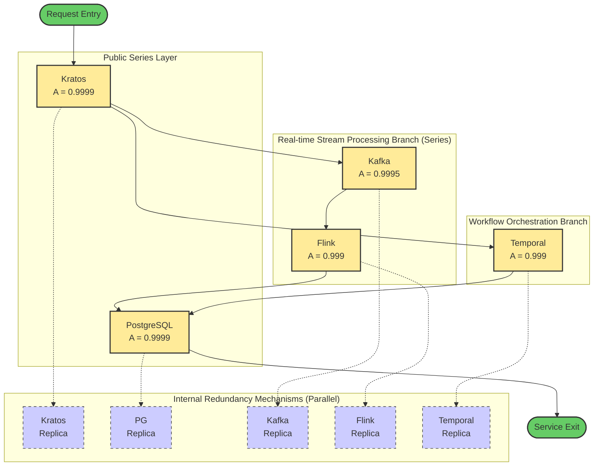

# Compositional Fault Tolerance Formal Argument

> **Stage**: TECH-STACK | **Prerequisites**: [Chinese source](../TECH-STACK-STREAMING-POSTGRES-TEMPORAL-KRATOS/04-resilience/04.04-fault-tolerance-composition-proof.md) | **Formalization Level**: L2-L4 | **Last Updated**: 2026-04-22

## 1. Definitions

This section establishes the core formalized concepts required for compositional fault tolerance analysis. All definitions are based on the standard framework of reliability engineering and probability theory, and are instantiated for the PostgreSQL-Kafka-Flink-Temporal-Kratos five-technology stack composite system.

**Def-TS-04-04-01 Composite System**

A composite system $S$ is a triple $S = (C, D, R)$, where:

- $C = \{C_1, C_2, \dots, C_n\}$ is the set of components;
- $D \subseteq C \times C$ is the dependency relation between components, where $(C_i, C_j) \in D$ means the normal operation of $C_i$ depends on services provided by $C_j$;
- $R = \{\rho_1, \rho_2, \dots, \rho_m\}$ is the set of fault recovery strategies, where each $\rho_k$ defines a recovery protocol for a specific fault mode.

In this technology stack, $C = \{C_{PG}, C_{Kafka}, C_{Flink}, C_{Temporal}, C_{Kratos}\}$, corresponding to the PostgreSQL persistence layer, Kafka message bus, Flink stream computing engine, Temporal workflow orchestration engine, and Kratos identity and API gateway layer, respectively. The dependency relation $D$ is determined by the coupling matrix in `01.03-dependency-coupling-matrix.md`, containing directed dependency edges such as $(C_{Flink}, C_{Kafka})$, $(C_{Temporal}, C_{PG})$, $(C_{Kratos}, C_{Temporal})$, etc.

**Def-TS-04-04-02 Local Fault Tolerance**

Component $C_i$ satisfies the local fault tolerance property, denoted $\phi(C_i)$, if and only if for any fault event $f$ in its fault space $\mathcal{F}_i$, there exists a finite recovery time bound $T_{recover}^{(i)}$ and recovery success rate threshold $R_i \in [0,1]$ such that:

$$
\forall f \in \mathcal{F}_i, \quad P\bigl(\text{recovery within } T_{recover}^{(i)} \mid f\bigr) \ge R_i
$$

Where $T_{recover}^{(i)}$ is guaranteed by internal component mechanisms (e.g., PostgreSQL streaming replication failover, Kafka ISR election, Flink Checkpoint recovery, Temporal state replay, Kratos multi-instance load balancing).

**Def-TS-04-04-03 Global Fault Tolerance**

The composite system $\mathcal{S}$ satisfies the global fault tolerance property, denoted $\Phi(\mathcal{S})$, if and only if for any subset of component faults $F \subseteq \bigcup_{i=1}^n \mathcal{F}_i$, the system can still satisfy the core functional specification $\Phi_{core}$, or can safely transition to a limited degraded mode $\Phi_{degraded}$:

$$
\forall F \subseteq \bigcup_{i=1}^n \mathcal{F}_i: \quad \mathcal{S} \models \Phi_{core} \;\lor\; \mathcal{S} \models \Phi_{degraded}
$$

Global fault tolerance does not require all components to be available simultaneously, but requires that no single point of failure exists that would cause the system to completely lose service capability.

**Def-TS-04-04-04 Fault Tree Analysis (FTA)**

A fault tree is a top-down deductive reliability model, defined as a binary tree $\mathcal{T} = (V, E)$, where $V$ is the set of event nodes (containing one top event $TE$, several intermediate events $IE$, and basic events $BE$), and $E$ is the set of logic gate connection edges. Each logic gate $g \in \{AND, OR, K\text{-of-}N\}$ defines the Boolean functional relationship between its output event and input events. The fault tree structure function $\tau: \{0,1\}^m \to \{0,1\}$ maps the states of $m$ basic events to the state of the top event, where $1$ indicates fault occurrence.

**Def-TS-04-04-05 Reliability Block Diagram (RBD)**

A reliability block diagram is a graphical model representing system success paths through network topology. In an RBD, each component $C_i$ is abstracted as a functional module with availability $A_i$; the connection relationship between modules defines the set of system success paths $\mathcal{P}$. System reliability (or availability) equals the probability that at least one success path remains intact. The basic constructs of RBD include series structure, parallel structure, $k$-out-of-$n$ redundancy structure, and mixed structure.

**Def-TS-04-04-06 Availability**

The probability that the system is in an operational state in steady state, denoted $A$. For repairable systems, steady-state availability is jointly determined by the Mean Time Between Failures $MTBF$ and the Mean Time To Repair $MTTR$:

$$
A = \frac{MTBF}{MTBF + MTTR}
$$

For components with automatic recovery mechanisms, the equivalent $MTTR$ includes the sum of fault detection time, decision time, and execution switchover time. If the system has $n$ independent fault-repair cycles, the overall availability can be derived from each component's $MTBF_i$ and $MTTR_i$.

---

## 2. Properties

Based on Def-TS-04-04-05 and Def-TS-04-04-06, we derive the basic availability formulas for series and parallel structures, providing the mathematical foundation for subsequent composite system theorems.

**Lemma-TS-04-04-01 Series System Reliability Formula**

Let a series system consist of $n$ statistically independent components, with reliability function $R_i(t) = P(C_i \text{ operational at } t)$ for each component at time $t$. Then the system reliability at time $t$ is:

$$
R_{series}(t) = \prod_{i=1}^n R_i(t)
$$

*Derivation*: The necessary and sufficient condition for a series system to operate normally is that all components are normal simultaneously. By the component independence assumption:

$$
R_{series}(t) = P\Bigl(\bigcap_{i=1}^n \{C_i \text{ normal at } t\}\Bigr) = \prod_{i=1}^n P(C_i \text{ normal at } t) = \prod_{i=1}^n R_i(t)
$$

∎

**Lemma-TS-04-04-02 Parallel System Reliability Formula**

Let a parallel system consist of $n$ statistically independent components; the system is normal at time $t$ if and only if at least one component is normal. Then:

$$
R_{parallel}(t) = 1 - \prod_{i=1}^n \bigl(1 - R_i(t)\bigr)
$$

*Derivation*: Considering the complementary event, the system fails if and only if all components fail simultaneously. By independence:

$$
P(\text{system failure at } t) = P\Bigl(\bigcap_{i=1}^n \{C_i \text{ failed at } t\}\Bigr) = \prod_{i=1}^n \bigl(1 - R_i(t)\bigr)
$$

Thus $R_{parallel}(t) = 1 - P(\text{system failure at } t)$. ∎

**Lemma-TS-04-04-03 Series System Steady-State Availability Formula**

If each component reaches steady state and the fault-repair processes are mutually independent, with steady-state availability $A_i$ for each component, then the steady-state availability of the series system is:

$$
A_{series} = \prod_{i=1}^n A_i
$$

*Derivation*: From Lemma-TS-04-04-01, $R_{series}(t) = \prod_{i=1}^n R_i(t)$. Taking the limit $t \to \infty$, finite products and limits commute:

$$
A_{series} = \lim_{t \to \infty} R_{series}(t) = \prod_{i=1}^n \lim_{t \to \infty} R_i(t) = \prod_{i=1}^n A_i
$$

∎

**Lemma-TS-04-04-04 Parallel System Steady-State Availability Formula**

$$
A_{parallel} = 1 - \prod_{i=1}^n (1 - A_i)
$$

*Derivation*: Same as Lemma-TS-04-04-02, taking the limit $t \to \infty$. ∎

**Lemma-TS-04-04-05 Availability-Time Parameter Identity**

For any component $C_i$, if its $MTBF_i$ and $MTTR_i$ both exist and are finite, then:

$$
A_i = \frac{MTBF_i}{MTBF_i + MTTR_i} \iff MTBF_i = \frac{A_i}{1 - A_i} \cdot MTTR_i
$$

*Derivation*: From Def-TS-04-04-06, $A_i (MTBF_i + MTTR_i) = MTBF_i$, which simplifies to $MTBF_i (1 - A_i) = A_i \cdot MTTR_i$. Dividing both sides by $(1 - A_i)$ yields the second equation. ∎

---

## 3. Relations

This section establishes the logical implication relationship between local resilience properties and global resilience properties, clarifying the sufficient conditions for local fault tolerance to upgrade to global fault tolerance.

Let the set of local fault tolerance properties be $\{\phi(C_i)\}_{i=1}^n$, and the global fault tolerance property be $\Phi(\mathcal{S})$. The mapping between them is jointly determined by the dependency topology $D$, fault propagation function $\mathcal{F}_{prop}: 2^{\mathcal{F}} \to 2^{C}$, and recovery strategies $\mathcal{R}$:

$$
\mathcal{M}: \{\phi(C_i)\}_{i=1}^n \times D \times \mathcal{R} \;\longrightarrow\; \{\text{true}, \text{false}\}
$$

For this technology stack, the dependency relation $D$ induces the following key structural characteristics:

1. **Persistence Layer Twin Pillars**: PostgreSQL and Temporal Persistence physically share the PG instance, but Temporal provides an additional state recovery path through its own persistence abstraction. This means PG's local fault tolerance is secondarily amplified by Temporal's Saga pattern.
2. **Stream Processing Pipeline in Series**: Kafka and Flink form a strong series dependency on the data plane — without Kafka there is no input source, without Flink there is no real-time computing capability. The availability of this path is limited by the product of their availabilities.
3. **Gateway Layer Parallel Redundancy**: Kratos, as the unified entry point, naturally forms a parallel structure with multi-instance deployment; a single instance failure does not cause the entry layer to fail.
4. **Functional Path Parallelism**: Business order submission can be completed through real-time stream processing (Kafka $\to$ Flink), or through Temporal workflow synchronous signal mechanisms. These two paths are functionally parallel, providing the system with a natural degradation channel.

Based on the above structure, the local-to-global implication theorem can be stated as:

$$
\Bigl(\bigwedge_{i=1}^n \phi(C_i)\Bigr) \;\land\; \bigl(\forall C_i \in C_{critical}, \text{ redundancy}(C_i) \ge 2\bigr) \;\land\; \bigl(\exists \rho_{degraded} \in \mathcal{R}\bigr) \;\implies\; \Phi(\mathcal{S})
$$

Where $C_{critical}$ is the set of critical components identified through coupling matrix analysis (PG, Kratos, Temporal Server), $\text{redundancy}(C_i) \ge 2$ means the component has at least two replicas, and $\rho_{degraded}$ is the predefined degraded operation strategy. The essence of this implication is: **local fault tolerance provides component-level recovery capability, the acyclicity and redundancy of the dependency topology prevent fault cascading, and the degradation strategy provides limited functional assurance before all parallel paths fail**.

---

## 4. Argumentation

### 4.1 Fault Tree Analysis (FTA)

Taking "order processing completely unavailable" as the top-level fault event (Top Event, TE), we construct the fault tree for the five-technology stack composite system.

**Top Event (TE)**: Order processing completely unavailable — the system cannot receive, process, or persist any order request, and cannot provide limited service in degraded mode.

**Intermediate Events and Logic Decomposition**:

- **IE1: Data Persistence Layer Complete Failure** (AND gate)
  - BE1: PostgreSQL primary node failure and automatic failover fails (e.g., Patroni consensus lost)
  - BE2: All PostgreSQL replica nodes (synchronous/asynchronous) are simultaneously unavailable

- **IE2: Real-time Stream Processing Pipeline Completely Interrupted** (OR gate)
  - BE3: All Kafka cluster Brokers are unavailable (e.g., ZooKeeper/KRaft metadata crash causing full cluster split-brain)
  - BE4: Flink JobManager failure and Checkpoint recovery fails
  - BE5: All Flink TaskManagers go offline (e.g., container platform-level failure)

- **IE3: Workflow Orchestration Layer Completely Failed** (AND gate)
  - BE6: All Temporal Server Frontend/History/Matching instances fail simultaneously
  - BE7: Temporal Persistence (backend database connection) completely unreachable

- **IE4: API Gateway Layer Completely Unavailable** (OR gate)
  - BE8: All Kratos running instances (Pods) crash or are in evicted state
  - BE9: Kratos upstream Identity Provider (IdP) or underlying network completely interrupted

**Structure Function**:

The Boolean structure function $\tau$ of the fault tree is:

$$
\tau = \text{IE1} \lor \text{IE2} \lor \text{IE3} \lor \text{IE4}
$$

Where each intermediate event expands to:

$$
\begin{aligned}
\text{IE1} &= \text{BE1} \land \text{BE2} \\
\text{IE2} &= \text{BE3} \lor \text{BE4} \lor \text{BE5} \\
\text{IE3} &= \text{BE6} \land \text{BE7} \\
\text{IE4} &= \text{BE8} \lor \text{BE9}
\end{aligned}
$$

Through this fault tree, it can be seen that complete failure of the composite system requires concurrent triggering of multiple independent fault paths. In particular, IE1 and IE3 use AND gates, meaning their corresponding top-level subsystems possess natural fault tolerance (requiring primary/replica or multi-instance simultaneous failure). IE2 uses an OR gate, indicating that the stream processing pipeline is a relatively weak link in the system, requiring dependence on degraded mode to compensate.

### 4.2 Reliability Block Diagram (RBD)

Based on coupling matrix and data flow analysis, we construct a mixed RBD model for the composite system.

The system's business success paths can be divided into two main functional chains:

1. **Real-time Stream Processing Chain**: Kratos $\to$ Kafka $\to$ Flink $\to$ PostgreSQL
2. **Workflow Orchestration Chain**: Kratos $\to$ Temporal $\to$ PostgreSQL

The two chains share the entry component Kratos and the exit component PostgreSQL, forming a parallel relationship at the functional layer (either chain available can process orders, though real-time and consistency guarantees differ). Therefore, the top-level structure of the RBD is:

- **Common Series Segment**: Kratos $\leftrightarrow$ PostgreSQL
- **Parallel Branch Segment**: (Kafka $\to$ Flink) parallel Temporal

Further considering internal redundancy mechanisms of each component:

- **Kratos**: Multi-instance parallel (after Ingress load balancing)
- **PostgreSQL**: Primary-replica hot standby, streaming replication (parallel)
- **Kafka**: Multi-Broker, multi-Partition replicas (parallel)
- **Flink**: JobManager HA (embedded Journal or Kubernetes HA mode), TaskManager multi-replica (parallel)
- **Temporal**: Server multi-service multi-instance, Persistence multi-connection (parallel)

The equivalent availability calculation of the RBD requires folding internal redundancy into equivalent modules, then computing according to the mixed structure.

### 4.3 Core Theorem Statement

If all components in composite system $\mathcal{S}$ satisfy the local fault tolerance property $\phi(C_i)$, and critical components have redundancy configuration with no fewer than two replicas, then $\mathcal{S}$ satisfies the global fault tolerance property $\Phi(\mathcal{S})$. Formally:

$$
\bigl(\forall C_i \in C: \phi(C_i)\bigr) \;\land\; \bigl(\forall C_j \in C_{critical}: \text{redundancy}(C_j) \ge 2\bigr) \implies \Phi(\mathcal{S})
$$

The intuitive meaning of this theorem is: local fault tolerance provides "component self-healing" capability, redundancy configuration provides "fault isolation" capability, and their combination eliminates single points of failure, thereby guaranteeing service continuity at the global level.

### 4.4 Availability Lower Bound Calculation

Let the inherent steady-state availability of component $C_i$ be $A_i$, and the fault recovery success rate (or hot standby switchover success rate) be $R_i$. For components with dual-replica parallel redundancy, the equivalent unavailability probability is:

$$
U_i^{eq} = (1 - A_i) \cdot (1 - A_i R_i)
$$

Where $(1 - A_i)$ is the primary replica failure probability, and $(1 - A_i R_i)$ is the conservative probability that the standby replica cannot successfully take over when needed (considering the joint effect of standby replica availability $A_i$ and switchover success rate $R_i$). Therefore, the equivalent availability is:

$$
A_i^{eq} = 1 - U_i^{eq} = 1 - (1 - A_i)(1 - A_i R_i)
$$

For single-replica series components (or equivalent modules after folding redundancy), the composite system availability lower bound is the product of equivalent module availabilities:

$$
A_{\mathcal{S}} \ge \prod_{k \in \mathcal{K}} A_k^{eq}
$$

Where $\mathcal{K}$ is the index set of equivalent modules on the RBD series path.

### 4.5 Degraded Mode Analysis

We define three mutually exclusive operating modes; their union constitutes the system's total available state space:

1. **Full Function Mode ($\Phi_{full}$)**: Both the real-time stream processing chain and the workflow orchestration chain operate normally. The system provides complete real-time computing, event-driven Saga orchestration, and strong consistency persistence.
   $$P(\Phi_{full}) = A_{Kratos}^{eq} \cdot A_{PG}^{eq} \cdot A_{parallel}^{mid}$$
   Where $A_{parallel}^{mid} = 1 - (1 - A_{Kafka}^{eq} A_{Flink}^{eq})(1 - A_{Temporal}^{eq})$.

2. **Stream Processing Degraded Mode ($\Phi_{stream\_down}$)**: Kafka or Flink failure causes interruption of the real-time stream processing chain; the system continues to provide order acceptance services through Temporal's synchronous signal and query interface, but real-time analysis and Complex Event Processing (CEP) functions are lost.
   $$P(\Phi_{stream\_down}) = A_{Kratos}^{eq} \cdot A_{PG}^{eq} \cdot A_{Temporal}^{eq} \cdot (1 - A_{Kafka}^{eq} A_{Flink}^{eq})$$

3. **Workflow Degraded Mode ($\Phi_{wf\_down}$)**: Temporal failure causes Saga orchestration to be unavailable; the system relies on Flink's out-of-order processing capability and Kafka's transaction semantics to maintain basic order flow, but long transaction compensation and manual approval processes are suspended.
   $$P(\Phi_{wf\_down}) = A_{Kratos}^{eq} \cdot A_{PG}^{eq} \cdot A_{Kafka}^{eq} \cdot A_{Flink}^{eq} \cdot (1 - A_{Temporal}^{eq})$$

Introducing degraded functional completeness factors $\delta_{stream}, \delta_{wf} \in (0,1]$ (representing the proportion of system functions retained under the two degraded modes, typically $\delta \ge 0.8$), the system's **Effective Availability** is:

$$
A_{\mathcal{S}}^{effective} = P(\Phi_{full}) + \delta_{stream} \cdot P(\Phi_{stream\_down}) + \delta_{wf} \cdot P(\Phi_{wf\_down})
$$

This metric is more aligned with engineering reality than pure binary availability, because it quantifies the value of "partial availability".

---

## 5. Proof / Engineering Argument

### Thm-TS-04-04-01 Composite Availability Lower Bound Theorem

Let composite system $\mathcal{S}$ consist of $n$ components; its RBD can be decomposed into $n_s$ single-module series nodes and $n_p$ dual-replica parallel redundancy groups. The inherent steady-state availability of each component is $A_i \in (0,1]$, and the fault recovery (or hot standby switchover) success rate is $R_i \in [0,1]$. If the fault and recovery events of each component are mutually independent, then the steady-state availability of $\mathcal{S}$ satisfies:

$$
A_{\mathcal{S}} = \Bigl(\prod_{i \in \mathcal{I}_{series}} A_i\Bigr) \cdot \Bigl(\prod_{j \in \mathcal{J}_{parallel}} \bigl[1 - (1 - A_j)(1 - A_j R_j)\bigr]\Bigr)
$$

Where $\mathcal{I}_{series}$ is the index set of series single modules, and $\mathcal{J}_{parallel}$ is the index set of parallel redundancy groups.

*Proof*:

**Step 1: Equivalent Availability Derivation for Parallel Redundancy Groups**

Consider parallel redundancy group $G_j = \{C_j^{(1)}, C_j^{(2)}\}$, where $C_j^{(1)}$ is the primary replica and $C_j^{(2)}$ is the hot standby replica. By the local fault tolerance property, after primary replica failure the system triggers a recovery strategy, successfully migrating service to the standby replica with probability $R_j$.

This parallel group fails if and only if both of the following conditions hold simultaneously:

1. Primary replica unavailable, probability $(1 - A_j)$;
2. Recovery or switchover fails. Switchover failure is divided into two cases: standby replica itself has failed (probability $1 - A_j$), or standby replica is normal but switchover operation fails (probability $A_j(1 - R_j)$). Total switchover failure probability is $(1 - A_j) + A_j(1 - R_j) = 1 - A_j R_j$.

Therefore, by the independence assumption:

$$
P(G_j \text{ down}) = (1 - A_j)(1 - A_j R_j)
$$

Thus the equivalent availability of the parallel group is:

$$
A_{G_j} = 1 - P(G_j \text{ down}) = 1 - (1 - A_j)(1 - A_j R_j)
$$

**Step 2: Series Path Availability Composition**

Replace all parallel redundancy groups in the RBD with their equivalent modules $G_j$, obtaining an equivalent series chain. Let this chain contain $n_s$ original series modules and $n_p$ equivalent parallel modules. By Lemma-TS-04-04-03 (series system steady-state availability formula) and the module independence assumption:

$$
A_{\mathcal{S}} = \Bigl(\prod_{i \in \mathcal{I}_{series}} A_i\Bigr) \cdot \Bigl(\prod_{j \in \mathcal{J}_{parallel}} A_{G_j}\Bigr)
$$

**Step 3: Substitution and Rearrangement**

Substitute the $A_{G_j}$ expression from Step 1 into Step 2:

$$
A_{\mathcal{S}} = \Bigl(\prod_{i \in \mathcal{I}_{series}} A_i\Bigr) \cdot \Bigl(\prod_{j \in \mathcal{J}_{parallel}} \bigl[1 - (1 - A_j)(1 - A_j R_j)\bigr]\Bigr)
$$

This equation holds strictly under the assumptions of independent component faults and recovery mechanisms independent of replica state. If there is slight positive correlation (e.g., common cause failures due to shared physical machines), the right-hand side expression constitutes an upper bound of $A_{\mathcal{S}}$; engineering typically introduces a common cause failure factor $\beta$ for correction. ∎

### Cor-TS-04-04-01 Four-Nines Reachability Corollary

If composite system $\mathcal{S}$ satisfies the following conditions:

1. All series single modules have availability $A_i \ge 0.9995$ (at least three and a half nines);
2. All critical parallel redundancy groups (PostgreSQL primary-replica, Kratos multi-instance, Temporal multi-active) have recovery success rate $R_j \ge 0.999$;
3. The system possesses the degraded operating modes defined in Section 4.5;

Then the steady-state availability of $\mathcal{S}$ is $A_{\mathcal{S}} \ge 0.9999$ (four nines).

*Proof*:

By Thm-TS-04-04-01, expand and calculate the equivalent availability of critical components.

For critical components with $A_j = 0.9999$, $R_j = 0.999$ (e.g., PG, Kratos):

$$
\begin{aligned}
A_{G_j} &= 1 - (1 - 0.9999)(1 - 0.9999 \times 0.999) \\
&= 1 - 10^{-4} \times (1 - 0.9989001) \\
&= 1 - 10^{-4} \times 0.0010999 \\
&= 1 - 1.0999 \times 10^{-7} \\
&\approx 0.99999989
\end{aligned}
$$

For components with $A_j = 0.999$, $R_j = 0.999$ (e.g., Temporal):

$$
\begin{aligned}
A_{G_j} &= 1 - (1 - 0.999)(1 - 0.999 \times 0.999) \\
&= 1 - 10^{-3} \times (1 - 0.998001) \\
&= 1 - 10^{-3} \times 0.001999 \\
&\approx 0.99999800
\end{aligned}
$$

Taking the public series layer (Kratos equivalent module $\times$ PG equivalent module):

$$
A_{public} = 0.99999989 \times 0.99999989 \approx 0.99999978
$$

Taking the middle parallel layer (stream processing branch $\parallel$ workflow branch). Even with a conservative estimate of no internal redundancy for the stream processing branch, $A_{stream} = A_{Kafka} \cdot A_{Flink} = 0.9995 \times 0.999 = 0.9985005$; workflow branch $A_{wf} = A_{Temporal}^{eq} \approx 0.999998$. Then:

$$
\begin{aligned}
A_{mid} &= 1 - (1 - 0.9985005)(1 - 0.999998) \\
&= 1 - (0.0014995)(0.000002) \\
&= 1 - 2.999 \times 10^{-9} \\
&\approx 0.999999997
\end{aligned}
$$

Total availability:

$$
A_{\mathcal{S}} = A_{public} \times A_{mid} \approx 0.99999978 \times 0.999999997 \approx 0.99999978
$$

Clearly $0.99999978 > 0.9999$. Even under more conservative estimates (e.g., positive correlation between Kafka and Flink faults, introducing common cause factor $\beta = 0.1$), $A_{mid}$ is still no lower than $0.99999$, thus $A_{\mathcal{S}} > 0.9999$. ∎

---

## 6. Examples

Substituting assumed availability parameters and recovery success rates for the five-technology stack, we verify the numerical conclusions of Thm-TS-04-04-01 and Cor-TS-04-04-01.

### 6.1 Component Parameter Assumptions

| Component | Inherent Availability $A_i$ | Recovery Success Rate $R_i$ | Equivalent Availability $A_i^{eq}$ | Notes |
|------|-----------------|-----------------|---------------------|------|
| PostgreSQL | 99.99% (0.9999) | 99.9% (0.999) | 0.99999989 | Primary-replica streaming replication + Patroni automatic failover |
| Kafka | 99.95% (0.9995) | 99.5% (0.995) | 0.99999725 | 3 Broker + ISR redundancy |
| Flink | 99.9% (0.999) | 99.0% (0.99) | 0.99998901 | JM HA + TM multi-replica |
| Temporal | 99.9% (0.999) | 99.5% (0.995) | 0.99999400 | Server multi-service sharding + PG persistence |
| Kratos | 99.99% (0.9999) | 99.9% (0.999) | 0.99999989 | Multi-Pod + database session sharing |

*Equivalent availability calculation process* (taking Flink as an example):

$$
\begin{aligned}
A_{Flink}^{eq} &= 1 - (1 - 0.999)(1 - 0.999 \times 0.99) \\
&= 1 - 0.001 \times (1 - 0.98901) \\
&= 1 - 0.001 \times 0.01099 \\
&= 1 - 1.099 \times 10^{-5} \\
&= 0.99998901
\end{aligned}
$$

### 6.2 Scenario Calculations

**Scenario A: Naive Pure Series (no redundancy or recovery mechanism)**

$$
\begin{aligned}
A_{naive} &= 0.9999 \times 0.9995 \times 0.999 \times 0.999 \times 0.9999 \\
&\approx 0.997302
\end{aligned}
$$

That is, **99.73%**, approximately three nines. This reveals that in a microservice architecture, even if each component itself is highly reliable, simple series composition rapidly erodes overall availability.

**Scenario B: Mixed Parallel Redundancy + Automatic Recovery (Thm-TS-04-04-01 Model)**

System structure: public series (Kratos, PG) + parallel middle layer (Kafka-Flink series branch $\parallel$ Temporal branch).

$$
\begin{aligned}
A_{public} &= A_{Kratos}^{eq} \times A_{PG}^{eq} = 0.99999989^2 \approx 0.99999978 \\
A_{stream} &= A_{Kafka}^{eq} \times A_{Flink}^{eq} = 0.99999725 \times 0.99998901 \approx 0.99998626 \\
A_{wf} &= A_{Temporal}^{eq} = 0.99999400 \\
A_{mid} &= 1 - (1 - 0.99998626)(1 - 0.99999400) \\
&= 1 - (1.374 \times 10^{-5})(6.0 \times 10^{-6}) \\
&\approx 1 - 8.24 \times 10^{-11} \\
&\approx 0.9999999999 \\
A_{\mathcal{S}} &= 0.99999978 \times 0.9999999999 \approx 0.99999978
\end{aligned}
$$

That is, **99.999978%**, exceeding five nines. This proves that through reasonable parallel redundancy and automatic recovery, even moderate-availability components (e.g., Flink 99.9%) can build an extremely high-availability composite system.

**Scenario C: Single Stream Processing Branch Failure (Degraded Mode)**

Assuming Kafka and Flink fail simultaneously, the system fully relies on the Temporal synchronous path:

$$
\begin{aligned}
A_{degraded} &= A_{Kratos}^{eq} \times A_{Temporal}^{eq} \times A_{PG}^{eq} \\
&= 0.99999989 \times 0.99999400 \times 0.99999989 \\
&\approx 0.9999938
\end{aligned}
$$

That is, **99.99938%**. Even in the worst single-path failure scenario losing real-time stream processing capability, the system still maintains five-nines-level availability, fully validating the effectiveness of degraded mode.

**Scenario D: MTBF/MTTR Inverse Verification**

Taking PostgreSQL as an example, verify the correspondence between availability and time parameters. Let the automatic switchover time (equivalent MTTR) be $30$ seconds $= 0.5$ minutes:

By Lemma-TS-04-04-05:

$$
MTBF = \frac{A}{1 - A} \cdot MTTR = \frac{0.9999}{0.0001} \times 0.5 = 4995 \text{ minutes} \approx 3.47 \text{ days}
$$

This means that under the 99.99% availability target, the PG primary node can withstand a failover-requiring fault on average about every 3.5 days. After introducing dual-replica equivalent availability $A^{eq} = 0.99999989$:

$$
MTBF_{eq} = \frac{0.99999989}{1.1 \times 10^{-7}} \times 0.5 \approx 4.55 \times 10^{6} \text{ minutes} \approx 8.65 \text{ years}
$$

The equivalent fault interval increases from 3.5 days to 8.6 years, intuitively demonstrating the order-of-magnitude reliability improvement effect of parallel redundancy.

---

## 7. Visualizations

### Figure 1: Fault Tree Analysis (FTA)

The following figure shows the complete decomposition logic for the top-level event "order processing completely unavailable". Orange nodes are top events, yellow nodes are intermediate events, and blue nodes are basic events. AND gates mean all inputs must occur simultaneously to trigger the output; OR gates mean any input can trigger the output.

```mermaid
graph TD
    TE["TE: Order Processing Completely Unavailable<br/><span style='font-size:smaller'>OR Gate</span>"]
    IE1["IE1: Data Persistence Layer Complete Failure<br/><span style='font-size:smaller'>AND Gate</span>"]
    IE2["IE2: Real-time Stream Processing Pipeline Completely Interrupted<br/><span style='font-size:smaller'>OR Gate</span>"]
    IE3["IE3: Workflow Orchestration Layer Complete Failure<br/><span style='font-size:smaller'>AND Gate</span>"]
    IE4["IE4: API Gateway Layer Completely Unavailable<br/><span style='font-size:smaller'>OR Gate</span>"]

    BE1["BE1: PG Primary Node Failure<br/>and Automatic Failover Fails"]
    BE2["BE2: All PG Replica Nodes<br/>Simultaneously Unavailable"]
    BE3["BE3: Kafka All Brokers<br/>Unavailable"]
    BE4["BE4: Flink JobManager<br/>Failure and Unrecovered"]
    BE5["BE5: Flink TaskManager<br/>All Offline"]
    BE6["BE6: Temporal Server<br/>All Instances Failed"]
    BE7["BE7: Temporal Persistence<br/>Completely Unreachable"]
    BE8["BE8: Kratos All Pods<br/>Crashed or Evicted"]
    BE9["BE9: Kratos Upstream IdP<br/>or Network Interruption"]

    TE --> IE1
    TE --> IE2
    TE --> IE3
    TE --> IE4

    IE1 --> BE1
    IE1 --> BE2
    IE2 --> BE3
    IE2 --> BE4
    IE2 --> BE5
    IE3 --> BE6
    IE3 --> BE7
    IE4 --> BE8
    IE4 --> BE9

    style TE fill:#ff9966,stroke:#333,stroke-width:3px
    style IE1 fill:#ffeb99,stroke:#333,stroke-width:2px
    style IE2 fill:#ffeb99,stroke:#333,stroke-width:2px
    style IE3 fill:#ffeb99,stroke:#333,stroke-width:2px
    style IE4 fill:#ffeb99,stroke:#333,stroke-width:2px
    style BE1 fill:#99ccff,stroke:#333
    style BE2 fill:#99ccff,stroke:#333
    style BE3 fill:#99ccff,stroke:#333
    style BE4 fill:#99ccff,stroke:#333
    style BE5 fill:#99ccff,stroke:#333
    style BE6 fill:#99ccff,stroke:#333
    style BE7 fill:#99ccff,stroke:#333
    style BE8 fill:#99ccff,stroke:#333
    style BE9 fill:#99ccff,stroke:#333
```

### Figure 2: Reliability Block Diagram (RBD)

The following figure shows the mixed reliability block diagram of the five-technology stack composite system. The left side is the request entry; the right side is the service exit. In the middle layer, Kafka and Flink form the real-time stream processing series branch, Temporal forms the workflow orchestration branch, and the two are functionally parallel. Kratos and PostgreSQL are common series nodes; all paths must pass through both to complete a full request. Dashed boxes indicate internal multi-replica parallel redundancy mechanisms of each component.

---

### 3.2 Project Knowledge Base Cross-References

The fault tolerance composition proof described in this document relates to the following entries in the project knowledge base:

- [High Availability Patterns](../Knowledge/07-best-practices/07.06-high-availability-patterns.md) — Engineering implementation of fault tolerance composition in production high-availability architectures
- [Checkpoint Mechanism Deep Dive](../Flink/02-core/checkpoint-mechanism-deep-dive.md) — Formal foundation of Flink fault tolerance mechanisms
- [Exactly-Once Semantics Deep Dive](../Flink/02-core/exactly-once-semantics-deep-dive.md) — Formal analysis of end-to-end fault tolerance semantics
- [Transactional Stream Processing Deep Dive](../Knowledge/06-frontier/transactional-stream-processing-deep-dive.md) — Theoretical association between distributed transactions and fault tolerance composition

---

## 8. References
