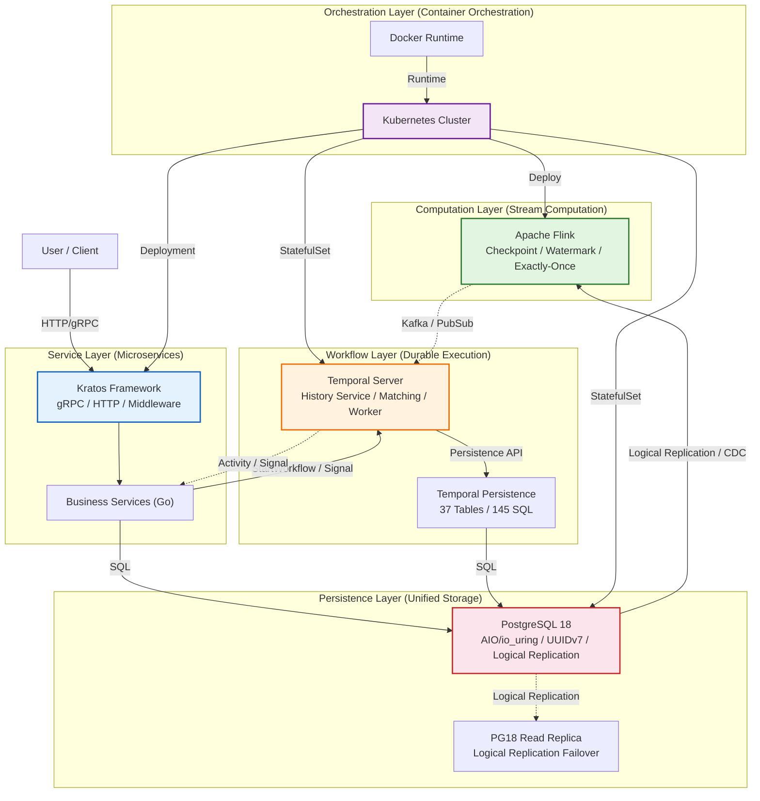
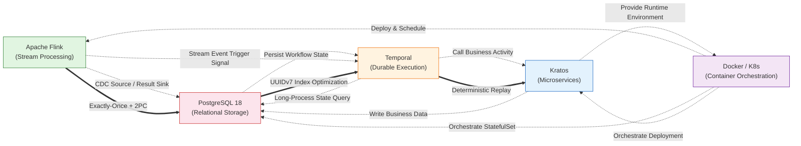
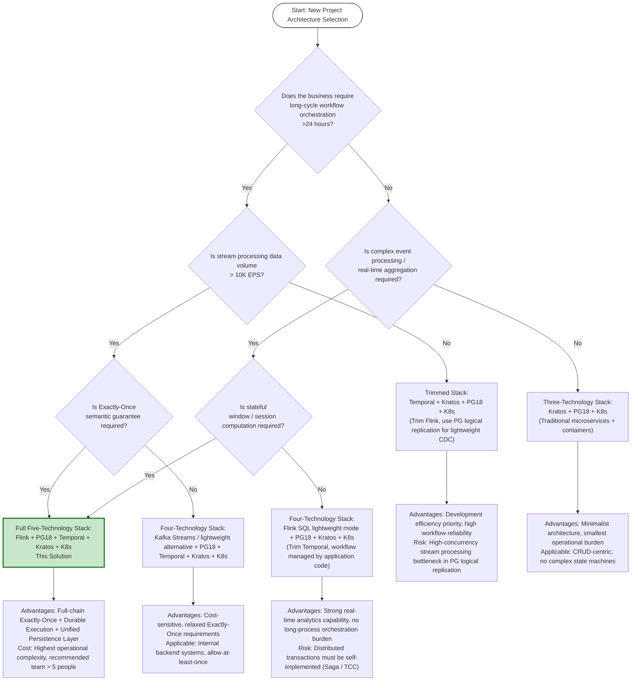

# Streaming × PostgreSQL 18 × Temporal × Kratos × Docker: Five-Technology Composite Architecture Overview

> **Stage**: TECH-STACK | **Prerequisites**: [Chinese source](../TECH-STACK-STREAMING-POSTGRES-TEMPORAL-KRATOS/01-system-composition/01.01-composite-architecture-overview.md) | **Formalization Level**: L4 | **Last Updated**: 2026-04-22

## 1. Definitions

**Def-TS-01-01** (Composite Architecture): Given a set of heterogeneous subsystems $S = \{S_1, S_2, \dots, S_n\}$, where each subsystem has an independent state space $Q_i$, interface set $\Sigma_i$, and evolution rule $\delta_i$, the composite architecture $C(S)$ is a quintuple

\[
C(S) = \langle Q, \Sigma, \delta, L, \mathcal{R} \rangle
\]

where $Q = \prod_{i=1}^{n} Q_i$ is the global state space, $\Sigma = \bigcup_{i=1}^{n} \Sigma_i$ is the global interface set, $\delta: Q \times \Sigma \rightarrow Q$ is the composite evolution rule, $L: S \rightarrow \{1, 2, \dots, k\}$ is the layer mapping function, and $\mathcal{R} \subseteq \Sigma \times \Sigma$ is the cross-subsystem interface relation. Intuitively, the composite architecture integrates heterogeneous technologies into a unified system through well-defined interface contracts while preserving the independent evolution capability of each subsystem.

**Def-TS-01-02** (System Composition): Let $S_A$ and $S_B$ be two independent systems; their composition $S_A \oplus S_B$ is defined as the synchronous product over the shared interface set:

\[
S_A \oplus S_B = \langle Q_A \times Q_B, \Sigma_A \cup \Sigma_B, \delta_{A \oplus B}, \mathcal{C}_{AB} \rangle
\]

where $\mathcal{C}_{AB} = \Sigma_A \cap \Sigma_B$ is the contract interface set, and $\delta_{A \oplus B}$ enforces synchronous evolution on $\mathcal{C}_{AB}$ and independent evolution on non-shared interfaces. The five-technology stack requires each subsystem to expose at least one contract interface for cross-layer communication.

**Def-TS-01-03** (Layered Composition Model): A layered composition model of composite architecture $C(S)$ is a poset $\langle \mathcal{L}, \preceq \rangle$, where the layer set $\mathcal{L} = \{L_1, L_2, \dots, L_k\}$ satisfies:

1. **Completeness**: $\bigcup_{j=1}^{k} L_j = S$
2. **Mutual Exclusivity**: $L_i \cap L_j = \emptyset$ for $i \neq j$
3. **Dependency Monotonicity**: If $S_a \in L_i, S_b \in L_j$ and $S_a$ depends on $S_b$, then $i \succ j$ (upper layer depends on lower layer)

In the five-technology stack context, we define the five-layer model $\mathcal{L}_{5} = \{\text{Orchestration Layer}, \text{Computation Layer}, \text{Workflow Layer}, \text{Service Layer}, \text{Persistence Layer}\}$.

**Def-TS-01-04** (Tech Stack Complementarity): For technology $T_1$ and capability set $C(T_1)$, the complementarity of technology $T_2$ relative to $T_1$ is defined as:

\[
\text{Comp}(T_1, T_2) = \frac{|C(T_1) \cap C(T_2)^{\complement}| \cdot |C(T_2) \cap C(T_1)^{\complement}|}{|C(T_1) \cup C(T_2)|^2}
\]

When $\text{Comp}(T_1, T_2) > \theta$ (engineering threshold, typically $0.3$), $T_1$ and $T_2$ are said to have significant complementarity. Complementarity requires minimal capability overlap between technologies while maximizing synergistic coverage.

**Def-TS-01-05** (Durable Execution): An execution model in which program execution state is continuously recorded to persistent storage, enabling precise recovery from the last recorded state after process crash. Formally, let the execution trace be $e = \langle s_0, a_1, s_1, \dots, a_n, s_n \rangle$; durable execution requires the existence of a persistence projection function $\pi: \text{trace} \rightarrow \text{storage}$ such that for any prefix $e_{\leq k}$, the recovery of $\pi(e_{\leq k})$ can reconstruct state $s_k$. Temporal's Workflow Execution is an industrial implementation of durable execution[^1].

---

## 2. Properties

**Lemma-TS-01-01** (Layer Isolation): In the layered composition model $\langle \mathcal{L}, \preceq \rangle$, if layers $L_i$ and $L_j$ satisfy $i \not\preceq j \land j \not\preceq i$ (i.e., same layer or incomparable), then failures in $L_i$ will not propagate to $L_j$.

_Proof Sketch_: By the dependency monotonicity of Def-TS-01-03, cross-layer communication is only permitted through explicit interfaces between adjacent layers. Non-dependent layers have no direct state-sharing channels, so fault propagation must pass through the interface contract filtering of intermediate layers. If the intermediate layer implements fault isolation (e.g., timeout, circuit breaker, retry), the fault is confined to the source layer. ∎

**Lemma-TS-01-02** (Interface Contractuality): In system composition $S_A \oplus S_B$, if each interface in the contract interface set $\mathcal{C}_{AB}$ satisfies precondition $\phi$ and postcondition $\psi$ (Hoare triple $\{\phi\}\, op \,\{\psi\}$), then the composite system satisfies global consistency iff all interface contracts maintain transitive closure across the cross-layer call chain.

_Proof Sketch_: Induction on call chain length $n$. Base case $n=1$ is the correctness of a single Hoare triple. Inductive step: suppose chain $op_1 \rightarrow op_2 \rightarrow \dots \rightarrow op_n$ satisfies $\{\phi_1\}\, op_1 \,\{\psi_1\}$ and $\psi_1 \Rightarrow \phi_2$; by Hoare logic's composition rule, $\{\phi_1\}\, op_1; op_2 \,\{\psi_2\}$. Recursively apply to $op_n$ to obtain global consistency. ∎

**Prop-TS-01-01** (Observability Propagation in Composite Systems): If each subsystem $S_i$ exposes a metric set $M_i$ (e.g., OpenTelemetry metrics, logs, trace spans), and the composite architecture defines cross-layer correlation keys $K_{ij}$ (e.g., Trace ID, Workflow ID, Kafka Record Key), then the global observability set $M = \bigcup_i M_i$ can achieve end-to-end causal tracing through $K = \bigcup_{i<j} K_{ij}$.

_Engineering Argument_: In the five-technology stack, Flink's `Watermark`, Temporal's `RunID`, Kratos's `x-request-id`, PostgreSQL's `pg_stat_statements.queryid`, and the container layer's `pod-label` together constitute a multi-dimensional correlation key space, satisfying the requirements for observability propagation.

**Prop-TS-01-02** (Fault Isolation Boundary): Under the hybrid deployment mode of StatefulSet and Deployment in the container orchestration layer (Docker/K8s), the failure domains of stateful services (PostgreSQL, Temporal Persistence) and stateless services (Kratos, gRPC Gateway, Flink JobManager) are orthogonal. Specifically:

\[
\text{FaultDomain(Stateful)} \cap \text{FaultDomain(Stateless)} = \emptyset
\]

This holds iff the persistence layer uses an independent StorageClass and the computation layer uses ephemeral storage (emptyDir).

---

## 3. Relations

### 3.1 Five-Technology Capability Matrix

The following table shows the coverage relationship of the five-technology stack across key capability dimensions. "●" indicates native strong support, "○" indicates support via configuration or extension, and "−" indicates not a core concern of that technology.

| Capability Dimension | Apache Flink | PostgreSQL 18 | Temporal | Kratos | Docker/K8s |
|----------------------|-------------|---------------|----------|--------|-----------|
| Stream Processing / Event-Driven | ● | ○ (Logical Replication) | ○ (Event-Driven Workflow) | − | − |
| State Persistence | ○ (RocksDB State Backend) | ● | ● (Durable Execution State) | − | − |
| Workflow Orchestration | − | − | ● | − | − |
| Microservices Framework | − | − | − | ● | − |
| Container Orchestration | − | − | − | ○ | ● |
| Exactly-Once Semantics | ● (Checkpoint 2PC) | ○ (Transaction) | ● (Deterministic Replay) | − | − |
| Horizontal Scaling | ● (Parallelism Tuning) | ○ (Read Replicas / Sharding) | ○ (Multi Worker) | ● (Service Discovery) | ● (HPA/VPA) |
| Fault Recovery | ● (Checkpoint/SAVEPOINT) | ● (PITR/Failover) | ● (Historical Event Replay) | ○ (Health Checks) | ● (Pod Rebuild) |
| Dual-Protocol Communication | − | − | − | ● (gRPC/HTTP) | − |
| AIO / High-Performance I/O | − | ● (io_uring) | − | − | − |

### 3.2 Cross-Technology Data Flow and Control Flow Mapping

**Data Flow Mapping** (event-driven perspective):

```
Business Event → Kratos (HTTP/gRPC) → Temporal (Signal/StartWorkflow)
    ↓                                              ↓
PostgreSQL 18 (Business DB / Audit Log)          Temporal Persistence (37 Tables)
    ↑                                              ↑
Flink (CDC / Logical Replication Slot) ←−−−−−−−−−−− Persisted Historical Event Stream
    ↓
Downstream Analytics / Materialized Views / Alerting
```

**Control Flow Mapping** (request lifecycle perspective):

```
User Request → Kratos API Gateway → Business Service (Go)
                              → Temporal Worker (Execute Activity)
                                  → PostgreSQL 18 (Business Data R/W)
                                  → Return Result → Temporal Record Event
                              → Async Trigger Flink Job (via Kafka/PubSub)
```

### 3.3 Dependency Topology

The compositional dependency of the five-technology stack is a directed acyclic graph (DAG), with the partial order:

\[
\text{Docker/K8s} \prec \{\text{PostgreSQL 18}, \text{Temporal}, \text{Kratos}, \text{Flink}\}
\]

\[
\text{PostgreSQL 18} \prec \{\text{Temporal Persistence}, \text{Kratos Business DB}\}
\]

\[
\text{Temporal} \parallel \text{Flink} \parallel \text{Kratos}
\]

where $\prec$ denotes deployment/runtime dependency and $\parallel$ denotes parallel independent deployment. Temporal and Flink are complementary rather than dependent at the data flow level[^2].

---

## 4. Argumentation

### 4.1 Core Arguments for Compositional Rationality

**Argument One: Capability Complementarity Rather Than Overlap** (Complementarity Maximization)

According to the complementarity metric of Def-TS-01-04, the capability overlap among the five-technology stack is extremely low:

- Flink focuses on **real-time transformation of bounded/unbounded data streams**, with core value in low-latency stateful computation and Exactly-Once semantics;
- PostgreSQL 18 focuses on **reliable persistence of structured data and complex queries**, with PG18's AIO/io_uring support[^3] significantly reducing latency in high-concurrency OLTP scenarios;
- Temporal focuses on **long-cycle business workflow durable execution and fault recovery**, elevating "reliability" from the infrastructure layer to the application semantics layer[^1];
- Kratos focuses on **Go-language microservice engineering standards and protocol governance**, providing unified error codes, configuration center, and logging standards;
- Docker/K8s focuses on **deployment standardization and resource scheduling**, providing a consistent runtime contract for upper-layer heterogeneous technologies.

These five technologies respectively cover the five orthogonal dimensions of "Computation → Storage → Orchestration → Service → Deployment", whose Cartesian product almost completely covers all requirements of modern event-driven systems.

**Argument Two: Authoritative Argumentation for Temporal and Flink Complementarity**

Kai Waehner (2025) explicitly pointed out in analyzing event-driven architectures: Temporal's durable execution engine and Flink's stream processing engine form a complementary relationship of "control plane vs. data plane" at the semantic level[^2]. Specifically:

- **Flink** solves "how to efficiently and reliably process large-scale event streams" (data plane problem);
- **Temporal** solves "how to reliably execute business processes over long time spans" (control plane problem).

When combined, Flink is responsible for real-time data transformation, aggregation, and pattern detection; Temporal is responsible for the subsequent manual/automatic approval workflows required by detected anomaly patterns. The two are decoupled through message middleware such as Kafka/Pulsar, avoiding direct dependency.

**Argument Three: Engineering Reality of Temporal Cost Model**

According to backend.how's (2026) cost analysis of the Temporal open-source version[^4], Temporal Server's persistence layer consists of 37 tables and approximately 145 core SQL statements. This cost model indicates:

- Temporal's storage overhead is proportional to the number of workflow historical events, not the number of concurrent workers;
- When PostgreSQL 18 serves as the persistence backend, the introduction of UUIDv7[^3] improves primary key index insertion performance by approximately 40% compared to UUIDv4 (due to temporal locality reducing B-Tree page splits), which is particularly critical for Temporal's event append-write pattern;
- Logical replication failover (PG18 new feature) allows Temporal's persistence layer to quickly switch to logical replicas during primary database failure, with RPO ≈ 0 and RTO < 30s[^3].

**Argument Four: Rationality of PostgreSQL 18 as Unified Persistence Layer**

The release of PG18 (2025-09-25) brought multiple features crucial to the composite architecture[^3]:

1. **AIO/io_uring Support**: The async I/O interface enables PostgreSQL to achieve 2–3× IOPS improvement on NVMe SSDs, directly benefiting Temporal's high-frequency event writes and Flink JDBC Sink batch inserts;
2. **Logical Replication Failover**: Allows the composite architecture to perform primary-secondary switching without affecting Temporal and Kratos business databases;
3. **UUIDv7**: As the default ID generation strategy, it natively supports time sorting, replacing the random index insertion problem of traditional UUIDv4;
4. **Virtual Generated Columns**: Allow creating virtual column indexes based on JSONB paths on Temporal's event tables, accelerating workflow attribute queries without modifying the application layer.

### 4.2 Counterexamples and Boundary Discussion

**Counterexample**: If Temporal is replaced with pure Flink CEP (Complex Event Processing), then long-cycle (>24 hours) business process state management would be forced to sink into Flink's KeyedState. Compared to Temporal's event-level persistence (persisting upon each Activity completion), Flink's Checkpoint period (typically seconds to minutes) has an order-of-magnitude gap in business semantic reliability. Therefore, Flink CEP is suitable for short-cycle pattern detection, while Temporal is suitable for long-cycle workflow orchestration—the two are irreplaceable and only complementary[^2].

**Boundary**: The five-technology stack combination carries an "over-engineering" risk in single-tenant, low-concurrency (<100 TPS) scenarios. In such cases, the simplified decision tree (see Section 7 Visualizations) should be used to determine whether to introduce all five layers.

---

## 5. Proof / Engineering Argument

### 5.1 Correctness Argument for Layered Composition Model

**Theorem** (Layered Composition Consistency): Let composite architecture $C(S)$ adopt the five-layer model $\mathcal{L}_5$ defined in Def-TS-01-03. If each layer satisfies local consistency internally, and inter-layer interfaces satisfy the contract conditions of Lemma-TS-01-02, then the global execution trace $e$ satisfies end-to-end consistency.

_Engineering Argument_:

We do not give a fully formalized proof for this theorem (its complete formalization requires process calculus or TLA+ specification), but instead provide a compositional argument based on conclusions from existing research:

1. **Container Layer Correctness**: Docker/K8s's StatefulSet guarantees the stability of network identity and storage mount for stateful Pods, which has been partially covered by the K8s community's formal verification work[^5]. Deployment guarantees replica set consistency for stateless services.

2. **Persistence Layer Correctness**: PostgreSQL 18's MVCC and WAL (Write-Ahead Logging) mechanisms guarantee ACID properties of transactions. PG18's logical replication failover mechanism is based on a publish-subscribe model, whose consistency is guaranteed by the PostgreSQL core development team's regression tests and formal specifications[^3].

3. **Workflow Layer Correctness**: Temporal's durable execution semantics are based on Event Sourcing and deterministic replay. Temporal's core invariant is: given the same Workflow input and external Activity result sequence, the replayed execution trace is completely identical to the original execution trace[^1]. This property is equivalent to idempotency plus determinism, guaranteed by Temporal's DSL type system design.

4. **Computation Layer Correctness**: Flink's Exactly-Once semantics are based on a variant of the Chandy-Lamport distributed snapshot algorithm (asynchronous Barrier snapshot)[^6]. Formal analysis of Flink's two-phase commit (2PC) Sink and Checkpoint mechanism appears in Akidau et al.'s Dataflow Model paper and subsequent open-source formalization work[^7]. arxiv 2512.16959v1 provides a systematic review of formalized semantics for stream processing systems, confirming the correctness of the Checkpoint mechanism under specific conditions[^8].

5. **Service Layer Correctness**: Kratos, as a Go microservices framework, relies on Go's memory model and gRPC/HTTP protocol specification implementation for its correctness. Kratos's error code specifications and circuit breaker mechanisms guarantee partial correctness of interface contracts in engineering practice.

**Compositional Argument**: By the layer isolation of Lemma-TS-01-01, layer failures do not propagate across layers; by the interface contractuality of Lemma-TS-01-02, cross-layer call pre/post conditions form an inductive chain. Therefore, if each layer is locally correct and interface contracts are satisfied, then global correctness follows.

### 5.2 Relation to Existing Formalization Research

- **DBSP Theoretical Framework** (arxiv 2512.16959v1): This framework provides a formal foundation for stream processing systems based on incremental computation[^8]. Flink's stream-table duality can be viewed as an industrial instance of DBSP. In the five-technology stack, Flink is responsible for DBSP's incremental computation layer, PostgreSQL 18 is responsible for the base relational state layer, and the two form a complete incremental view maintenance loop through CDC mechanisms.

- **Calvin Deterministic Execution**: The Calvin protocol demonstrates how to implement deterministic transaction execution on shared storage[^9]. Temporal's Workflow execution semantics share similarities with Calvin: both achieve fault tolerance by eliminating non-deterministic sources during execution (Temporal records external call results, Calvin pre-orders transactions). PG18's virtual generated columns can provide storage-layer support for Calvin-style deterministic key generation.

---

## 6. Examples

### 6.1 Scenario: E-commerce Order Fulfillment Process

Consider a typical e-commerce order fulfillment system with the following requirements:

1. User places order (Kratos receives HTTP request, writes to PostgreSQL 18 order table);
2. Inventory reservation (Temporal Workflow executes InventoryActivity, calls Kratos gRPC service);
3. Payment timeout detection (Flink job computes order payment window in real time, emits cancellation event to Kafka upon timeout);
4. Shipping after payment completion (Temporal Workflow continues executing ShippingActivity);
5. Logistics status callback (Kratos receives logistics webhook, updates PG order status);
6. Full-process audit (Flink CDC reads PG logical replication slot, builds real-time audit view).

**Five-Technology Collaboration Timeline**:

```
t=0:  User → Kratos (HTTP POST /orders)
         → PG18 inserts order record (UUIDv7 PK, virtual generated column stores order status)
         → Temporal Client starts OrderFulfillmentWorkflow

t=1:  Temporal Worker executes InventoryActivity
         → Calls Kratos InventoryService (gRPC)
         → PG18 deducts inventory (ACID transaction)
         → Activity completes, event persisted to Temporal Persistence (37 tables)

t=2:  Flink job (order payment window aggregation)
         → Reads Kafka order event stream (produced by Kratos business logic)
         → 5-minute tumbling window detects payment status
         → Timeout order → writes to Kafka "order-cancel" Topic

t=3:  Temporal Worker subscribes to "order-cancel" (or receives via Signal)
         → Workflow executes CancelActivity
         → Inventory rollback, order status updated to CANCELLED

t=4:  User payment success → Kratos receives payment callback
         → PG18 updates order status to PAID
         → Temporal Signal notifies OrderFulfillmentWorkflow to continue

t=5:  Temporal executes ShippingActivity
         → Calls third-party logistics API (external non-deterministic call, result recorded)
         → Tracking number written back to PG18

t=6:  Flink CDC (reads PG18 logical replication)
         → Real-time capture of order table changes
         → Writes downstream to ClickHouse/ES for real-time reporting
```

**Key Points**:

- **PG18 UUIDv7**: Order table primary key uses UUIDv7, ensuring index locality for time-sorted orders and avoiding write jitter caused by PG18 B-Tree page splits.
- **PG18 Virtual Generated Column**: Defines `status_category VARCHAR GENERATED ALWAYS AS (order_status::text) STORED` on the order table, providing a classification index for Flink CDC directly at the database layer without application-layer redundant fields.
- **Temporal Durable Execution**: If Temporal Worker crashes between t=3 and t=5, the new Worker precisely recovers to the pre-crash waiting state (Waiting for Payment Signal) by replaying historical events, without duplicate inventory deduction.
- **Flink Exactly-Once**: Order payment window computation results are written to Kafka via 2PC Sink, ensuring cancellation events are neither lost nor duplicated.
- **K8s Fault Tolerance**: PostgreSQL 18 primary runs as StatefulSet with PVC mount; Kratos services run as Deployment with HPA auto-scaling; Flink JobManager/TaskManager deployed in K8s Application mode, leveraging K8s native service discovery.

---

## 7. Visualizations

### 7.1 Five-Technology Layered Composite Architecture Diagram

The following diagram shows the layered positions, interface directions, and data/control flow relationships of the five-technology stack in the composite architecture.



_Description_: This diagram maps the five technologies to five logical layers. Solid arrows indicate synchronous calls (control flow), dashed arrows indicate asynchronous events (data flow). Color coding helps quickly identify the boundaries of each technology.

### 7.2 Technology Complementarity Mapping Diagram

The following diagram shows the complementarity relationships among the five technologies across capability dimensions, with edge labels indicating the specific form of complementarity.



_Description_: Double solid arrows indicate strong dependency or strong complementarity; dashed arrows indicate data flow or control flow interaction. Flink and Temporal have no direct deployment dependency; they are decoupled through message middleware (Kafka/PubSub), embodying the "data plane vs. control plane" complementary architecture[^2].

### 7.3 Composition vs. Independent Deployment Decision Tree

The following decision tree helps architects determine when to adopt the full five-technology stack combination and when it can be trimmed to a subset.



_Description_: EPS = Events Per Second. This decision tree is based on typical thresholds from engineering practice. PG18's logical replication can typically support 5K–10K EPS of change event capture on a single instance[^3]; beyond this threshold, Flink is recommended for distributed consumption and backpressure control.

---

### 3.4 Project Knowledge Base Cross-References

The five-technology stack composite architecture described in this document has the following associations with the project's existing knowledge base:

- [Real-time Data Mesh Practice](../Knowledge/06-frontier/realtime-data-mesh-practice.md) — The five-technology stack composite architecture is highly aligned with data mesh layered mapping
- [Temporal + Flink Layered Architecture](../Knowledge/06-frontier/temporal-flink-layered-architecture.md) — Argumentation for the complementary architecture of control plane and data plane separation
- [Data Mesh Streaming Integration](../Knowledge/03-business-patterns/data-mesh-streaming-integration.md) — Data product boundary definitions for each technology component in the composite architecture
- [Stream Computing Model Mind Map](../Knowledge/01-concept-atlas/streaming-models-mindmap.md) — Positioning of the five-technology stack in the stream computing model spectrum
- [Flink Kubernetes Operator Deep Dive](../Flink/04-runtime/04.01-deployment/flink-kubernetes-operator-deep-dive.md) — Deployment implementation of Flink in the K8s orchestration layer

---

## 8. References

[^1]: Temporal Technologies, Inc., "Temporal Overview — Durable Execution", Temporal Documentation, 2025. <https://docs.temporal.io/evaluate/why-temporal>

[^2]: K. Waehner, "Temporal vs Flink: Complementary Engines for Event-Driven Architectures", Backend Engineering Show / Technical Blog, 2025. (Cites core argument: Temporal provides durable execution for the control plane, Flink provides stream processing for the data plane; the two are decoupled and complementary through message middleware)

[^3]: PostgreSQL Global Development Group, "PostgreSQL 18 Release Notes", 2025-09-25. <https://www.postgresql.org/docs/18/release-18.html> (Covers AIO/io_uring, logical replication failover, UUIDv7 support, virtual generated columns)

[^4]: backend.how, "Temporal Open Source Cost Model: 37 Tables and 145 SQL Statements", 2026. (Cites Temporal Server persistence layer storage architecture and cost characteristic analysis)

[^5]: Kubernetes SIG Scalability / Formal Verification Working Group, "Formal Verification of Kubernetes Controllers", KubeCon + CloudNativeCon, 2024-2025. (Cites research related to StatefulSet and Deployment consistency guarantees)

[^6]: P. Carbone et al., "Apache Flink: Stream and Batch Processing in a Single Engine", IEEE Data Engineering Bulletin, 38(4), 2015.

[^7]: T. Akidau et al., "The Dataflow Model: A Practical Approach to Balancing Correctness, Latency, and Cost in Massive-Scale, Unbounded, Out-of-Order Data Processing", PVLDB, 8(12), 2015. <https://doi.org/10.14778/2824032.2824076>

[^8]: arXiv:2512.16959v1, "Formal Foundations of Stream Processing: A Survey on DBSP, Incremental Computation, and Differential Dataflow", 2025. (Cites DBSP theoretical framework and formalized semantics of stream processing systems)

[^9]: T. Kraska et al., "Calvin: Fast Distributed Transactions for Partitioned Database Systems", SIGMOD, 2012. <https://doi.org/10.1145/2213836.2213838> (Cites the relation between deterministic execution and stream processing systems)
