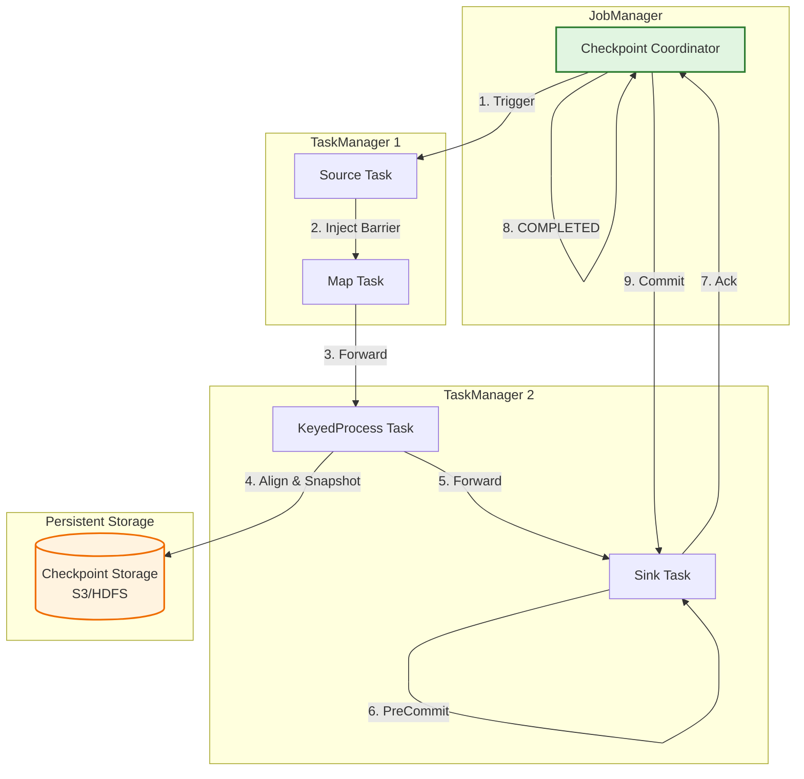
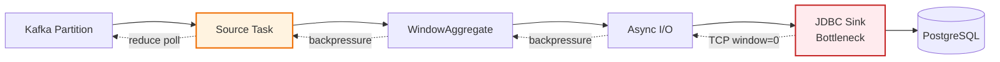

# Apache Flink Stream Processing Fault Tolerance Deep Dive

> **Stage**: TECH-STACK | **Prerequisites**: [Chinese source](../TECH-STACK-STREAMING-POSTGRES-TEMPORAL-KRATOS/02-component-deep-dive/02.04-flink-streaming-resilience.md) | **Formalization Level**: L3-L4 | **Last Updated**: 2026-04-22

## 1. Definitions

**Def-T-02-04-01** [Checkpoint — Distributed Consistent Snapshot]
Checkpoint is a **globally consistent state collection** periodically captured by Flink through the distributed snapshot algorithm, containing local states of stateful operators \(S_i\) and read offsets of data sources \(O_j\). Formally, let the job graph be \(G = (V, E)\); a successful Checkpoint \(C_k\) is:
\[C_k = \left(\bigcup_{v \in V} S_v^{(k)}, \bigcup_{s \in \text{Sources}} O_s^{(k)}\right)\]
where all \(S_v^{(k)}\) and \(O_s^{(k)}\) correspond to the same logical time point — the instantaneous state when barrier \(b_k\) arrives at each operator.

---

**Def-T-02-04-02** [Barrier — Checkpoint Barrier]
Barrier is a **special control event** injected by the Checkpoint Coordinator into the Source, propagating along the data flow, dividing the infinite data stream into pre-checkpoint and post-checkpoint logical intervals. Let the data stream be \(R = (r_1, r_2, \dots)\); after injecting \(b_k\):
\[R = R_{< b_k} \oplus b_k \oplus R_{> b_k}\]
\(R_{< b_k}\)'s processing results are included in the current snapshot, while \(R_{> b_k}\) is only visible to subsequent snapshots.

---

**Def-T-02-04-03** [Exactly-Once Semantics — End-to-End Exactly-Once Processing]
Exactly-Once semantics requires each input record to be processed exactly once on the end-to-end path, and the result is visible to external systems exactly once. This must be satisfied at three layers simultaneously:

1. **Engine Layer**: Internal state transitions are not re-applied due to fault recovery;
2. **Source Layer**: Supports repeatable reading (e.g., Kafka offset rewind);
3. **Sink Layer**: Supports idempotent writing or two-phase commit (2PC).

Formally, let the input record set be \(I\) and the processing function be \(f\). Exactly-Once requires:
\[\forall r \in I, \quad \text{visible output}\{f(r)\} = 1\]

---

**Def-T-02-04-04** [Asynchronous State Snapshot]
Asynchronous state snapshot is a **non-blocking state persistence mechanism** executed after the barrier arrives. Through copy-on-write or log-structured techniques, a lightweight view of the state is created, then asynchronously written to external storage (HDFS/S3) without blocking normal processing. Let the state be \(S(t)\); at moment \(t_c\):

1. **Synchronous Phase**: \(\Delta t_{sync} \approx 0\), establishing state reference;
2. **Asynchronous Phase**: Serializing \(S(t_c)\) and writing to persistent storage, while normal processing continues.

---

**Def-T-02-04-05** [Backpressure — Reverse Pressure Propagation Mechanism]
Backpressure is a **flow control signal that propagates from downstream to upstream level by level** when the downstream consumption rate is lower than the upstream production rate. Flink implements it through Netty watermark mechanism: when the local buffer pool is exhausted, the network layer stops reading TCP data, causing the upstream sending window to block. Let operator \(v_i\)'s output rate be \(\lambda_{out}^{(i)}\) and downstream \(v_j\)'s processing rate be \(\lambda_{proc}^{(j)}\); if \(\lambda_{out}^{(i)} > \lambda_{proc}^{(j)}\), backpressure propagates along \(v_j \to v_i\) until steady state \(\lambda_{out}^{(i)} = \min \lambda_{proc}^{(j)}\).

---

**Def-T-02-04-06** [RocksDB Incremental Checkpoint]
RocksDB incremental checkpoint **only persists state data that has changed since the last checkpoint (new SST files)**. Let the full checkpoint contain SST collection \(\mathcal{F}_{full}\); the \(k\)-th incremental checkpoint only needs to upload:
\[\mathcal{F}_{\Delta}^{(k)} = \{f \in \mathcal{F}^{(k)} \mid f \notin \mathcal{F}^{(k-1)} \lor \text{modified}(f)\}\]
Significantly reducing I/O and network overhead, suitable for TB-level large-state scenarios.

## 2. Properties

**Lemma-T-02-04-01** [Checkpoint Consistency]
Let all Source operators receive barrier \(b_k\) at \(t_0\), and all channels satisfy FIFO. Then the Checkpoint \(C_k\) generated after all operators complete alignment is **causally consistent**.

_Derivation Sketch_: By the Chandy-Lamport distributed snapshot algorithm[^1], if the barrier propagates along all channels and operators only forward \(b_k\) downstream after receiving \(b_k\) from all input channels, the snapshot corresponds to a **consistent cut** of the distributed system. No causal message exists from post-checkpoint to pre-checkpoint on this cut, hence \(C_k\) is a valid global state.

---

**Lemma-T-02-04-02** [Barrier Alignment Semantic Guarantee]
In exactly-once mode, an operator \(v\) with \(m \geq 1\) input channels must **receive \(b_k\) from all \(m\) input channels** before forwarding \(b_k\) downstream and including \(S_v\) in \(C_k\).

_Derivation Sketch_: Suppose \(b_k\) is forwarded after receiving only partial barriers; then a pre-checkpoint record \(r\) on some lagging channel would be processed after the snapshot. If a fault occurs and rolls back to \(C_k\), \(r\) would be lost (source offset has advanced but result not included in snapshot), violating at-least-once. The full-alignment strategy ensures all pre-checkpoint results are reflected in the state, and all post-checkpoint records are not duplicated.

## 3. Relations

### 3.1 Flink Checkpoint and Kafka Offset

In the Flink + Kafka exactly-once pipeline, Kafka Consumer offset and Flink Checkpoint form a **coupled transaction**:

- Kafka Source stores the current offset \(o_p\) of each partition as operator state, persistently saved with the Checkpoint to external storage;
- When the job recovers from \(C_k\), Source reads \(\{o_p^{(k)}\}\) and executes `seek()` to reset the consumption position;
- The successful commit of a Checkpoint is equivalent to the atomic commit of offsets — both advance or retreat simultaneously.

> **Key Point**: Flink disables Kafka auto-commit; offsets are stored in Checkpoint rather than `__consumer_offsets`, ensuring precise recovery even when Kafka broker fails.

### 3.2 Flink Checkpoint and PostgreSQL Replication Slot Progress

In the Flink CDC scenario (Debezium Source + PostgreSQL logical decoding):

- Flink saves PostgreSQL's **LSN (Log Sequence Number)** as operator state into the Checkpoint;
- Only when the Checkpoint succeeds does Flink send `flush_lsn` acknowledgment to PG, allowing recycling of WAL segments earlier than that LSN;
- Checkpoint acts as the "distributed transaction coordinator" for PG replication progress — preventing data loss and WAL bloat.

## 4. Argumentation

### 4.1 Mapping of Chandy-Lamport Distributed Snapshot Algorithm in Flink

Flink Checkpoint directly stems from the Chandy-Lamport algorithm[^1]:

| Chandy-Lamport | Flink Implementation |
|----------------|----------------------|
| Process | Task on TaskManager |
| Channel | TCP connection composed of NetworkBuffer |
| Marker | Checkpoint Barrier |
| Local Snapshot | Operator state (KeyedState / OperatorState) |
| Global Snapshot | Completed Checkpoint |

Flink's key engineering optimizations: **asynchronous snapshot** (avoids blocking data flow) and **incremental snapshot** (only uploads changed SSTs).

### 4.2 Barrier Injection and Alignment Flow

1. **Trigger**: Checkpoint Coordinator sends `TriggerCheckpoint` to all Sources;
2. **Inject**: Source inserts \(b_k\) into the data stream, freezing current offset/LSN;
3. **Propagate**: \(b_k\) reaches downstream input buffer via Netty;
4. **Align**: Multi-input operator caches post-barrier data from channels that arrived first, waiting for \(b_k\) from all channels;
5. **Snapshot**: After alignment, triggers local state snapshot, asynchronously uploads, and reports state handle;
6. **Complete**: After all operators report, Coordinator marks Checkpoint as **COMPLETED**.

> **Alignment Overhead**: In backpressure or data skew scenarios, a severely lagging channel causes post-barrier data from other channels to accumulate in the buffer, triggering OOM. Flink 1.11+'s **Unaligned Checkpoint** incorporates in-flight data into the snapshot, avoiding alignment wait.

### 4.3 State Backend Selection

| State Backend | Storage Medium | Snapshot Method | Applicable Scale | Latency |
|---------------|----------------|-----------------|------------------|---------|
| MemoryStateBackend | JVM Heap | Synchronous full | < several MB | Extremely low |
| FsStateBackend | JVM Heap + FS | Asynchronous full | < tens of GB | Low |
| RocksDBStateBackend | Local RocksDB | Asynchronous incremental | TB level | Medium |

**RocksDBStateBackend** stores state in off-heap disk, unaffected by JVM GC; incremental checkpoints make it the **preferred choice for large-state production environments**.

### 4.4 Exactly-Once vs At-Least-Once

Flink engine internally supports exactly-once natively. End-to-end exactly-once requires Source and Sink collaboration:

| Semantics | Source Requirement | Sink Requirement |
|-----------|-------------------|------------------|
| At-Least-Once | Supports replay | Idempotent or duplicate-acceptable |
| Exactly-Once | Supports seek/rewind | Two-phase commit (2PC) or idempotent |

Flink's **TwoPhaseCommitSinkFunction** provides a standard 2PC framework: `preCommit` flushes pre-committed state at Checkpoint boundary; `commit` makes it externally visible after global Checkpoint completion; `abort` is called on Checkpoint failure.

### 4.5 Backpressure Propagation Mechanism

Flink backpressure is based on **Credit-based flow control** and **Netty watermark**:

1. Downstream sends credit (amount of data receivable) to upstream;
2. When downstream buffer is full, credit drops to 0;
3. Upstream Netty detects the peer is not writable, `channel.write()` blocks;
4. Upstream operator accumulates records, exhausts its own credit, and continues propagating upstream.

Key monitoring metrics: `backPressuredTimeMsPerSecond`, `outPoolUsage`, `inPoolUsage`.

### 4.6 Restart Strategies

| Strategy | Config Key | Behavior | Applicable Scenario |
|----------|-----------|----------|---------------------|
| Fixed Delay | `fixed-delay` | Restart after fixed delay, at most \(n\) times | Occasional network jitter |
| Failure Rate | `failure-rate` | At most \(n\) failures within time window | Frequent but recoverable failures |
| Exponential Delay | `exponential-delay` | Delay grows exponentially, with jitter and cap | Downstream intermittently unavailable |
| No Restarts | `none` | Stop after failure | Debugging/testing |

### 4.7 Regional Fault Recovery

Checkpoints should be stored in cross-region redundant storage (S3 CRR, multi-datacenter HDFS, GCS/OSS) to prevent single-region disasters. Flink 1.12+'s **Local Recovery** retains state copies on local disk; upon restart, local recovery is preferred, and remote is only used when local is unavailable, significantly shortening recovery time.

## 5. Proof / Engineering Argument

### 5.1 Theorem: Barrier Alignment Algorithm Guarantees Exactly-Once Semantics

**Thm-T-02-04-01** [Barrier Alignment Implies Exactly-Once]
Let job graph \(G = (V, E)\) satisfy: (1) all edges are FIFO channels; (2) all operators forward \(b_k\) only after receiving \(b_k\) from all input channels, complete local state persistence, and all pre-checkpoint results are fully reflected while post-checkpoint results are not reflected in the snapshot. Then recovery based on \(C_k = \bigcup_v S_v^{(k)}\) guarantees exactly-once semantics.

---

**Proof Sketch** (L5):

**Property A (No Loss)**: Let \(r \in R_{<b_k}\). By FIFO, \(r\) arrives at any operator \(v\) before \(b_k\). According to condition (2), \(v\) has incorporated \(r\)'s processing result into \(S_v^{(k)}\) before the snapshot. After system recovers from \(C_k\), \(r\)'s result already exists in the state; Source recovers from \(O_s^{(k)}\) and reads after \(b_k\), but \(r\)'s result is not lost.

Formal: \(\forall r \in R_{<b_k}, \; r \text{'s update to } S_v \subseteq S_v^{(k)} \implies \text{result}(r) \in O_{vis}\).

**Property B (No Duplication)**: Let \(r' \in R_{>b_k}\). By alignment condition, \(r'\) cannot be processed as a pre-checkpoint record, and \(C_k\) does not contain any result of \(r'\). During recovery, Source re-consumes from \(O_s^{(k)}\) (the position of \(b_k\)), and \(r'\) is processed for the first time and only once.

Formal: \(\forall r' \in R_{>b_k}, \; r' \notin R_{<b_k} \land O_s^{(recover)} = O_s^{(k)} \implies \text{result}(r') \text{ appears exactly once}\).

**End-to-End Extension**: Source's seek capability and atomic binding of offsets guarantee no loss or duplication of inputs; Sink's 2PC protocol (`preCommit` at Checkpoint time, `commit` after global completion, `abort` on failure) guarantees that externally visible state changes are atomically synchronized with Checkpoint completion events.

\[\square\]

> **Unaligned Checkpoint Extension**: Incorporate channel in-flight data \(B_e\) into global state \(C_k^{(unaligned)} = (\bigcup_v S_v^{(k)}, \bigcup_e B_e^{(k)}, \bigcup_s O_s^{(k)})\). During recovery, channel data is restored first, then operator state, maintaining causal consistency.

## 6. Examples

### 6.1 Checkpoint and RocksDB Incremental Configuration

```java
StreamExecutionEnvironment env =
    StreamExecutionEnvironment.getExecutionEnvironment();

// Trigger Checkpoint every 60 seconds
env.enableCheckpointing(60000);
env.getCheckpointConfig().setCheckpointingMode(
    CheckpointingMode.EXACTLY_ONCE
);
env.getCheckpointConfig().setCheckpointTimeout(600000);
env.getCheckpointConfig().setMinPauseBetweenCheckpoints(30000);
env.getCheckpointConfig().setExternalizedCheckpointCleanup(
    ExternalizedCheckpointCleanup.RETAIN_ON_CANCELLATION
);

// RocksDB incremental checkpoint
EmbeddedRocksDBStateBackend rocksDb =
    new EmbeddedRocksDBStateBackend(true); // true = incremental
env.setStateBackend(rocksDb);
env.getCheckpointConfig().setCheckpointStorage(
    new FileSystemCheckpointStorage("s3://my-bucket/flink-checkpoints/")
);

// Fixed delay restart strategy
env.setRestartStrategy(
    RestartStrategies.fixedDelayRestart(10, Time.seconds(10))
);
```

### 6.2 End-to-End Exactly-Once: Kafka Source + JDBC XA Sink

```java
KafkaSource<String> source = KafkaSource.<String>builder()
    .setBootstrapServers("kafka:9092")
    .setTopics("input-events")
    .setGroupId("flink-exactly-once")
    .setStartingOffsets(OffsetsInitializer.earliest())
    .setValueOnlyDeserializer(new SimpleStringSchema())
    .build();

JdbcExactlyOnceSink<String> sink = JdbcExactlyOnceSink.sink(
    "INSERT INTO events (id, payload) VALUES (?, ?)",
    (ps, event) -> { ps.setString(1, event.id); ps.setString(2, event.payload); },
    JdbcExecutionOptions.builder().withMaxRetries(0).build(),
    new JdbcConnectionOptions.JdbcConnectionOptionsBuilder()
        .withUrl("jdbc:postgresql://pg:5432/db")
        .withDriverName("org.postgresql.Driver")
        .build(),
    () -> new PGXADataSource()
);

env.fromSource(source, WatermarkStrategy.noWatermarks(), "Kafka")
   .addSink(sink)
   .name("PostgreSQL XA Sink");
```

### 6.3 Backpressure Monitoring and Tuning

**Prometheus Configuration**:

```yaml
metrics.reporters: prom
metrics.reporter.prom.class: org.apache.flink.metrics.prometheus.PrometheusReporter
metrics.reporter.prom.port: 9249
```

**Key PromQL**:

```promql
# Operator backpressure time ratio
flink_taskmanager_job_task_backPressuredTimeMsPerSecond

# Output buffer pool high usage (>0.8 indicates bottleneck)
flink_taskmanager_job_task_buffers_outPoolUsage > 0.8
```

**Tuning Measures**:

| Symptom | Root Cause | Remedy |
|---------|-----------|--------|
| Single operator 100% backpressure | Complex aggregation bottleneck | Increase parallelism, optimize algorithm, async I/O |
| Uniform full-chain backpressure | Insufficient Sink throughput | Batch writing, connection pool expansion, increase Sink parallelism |
| Checkpoint timeout | State too large or I/O bottleneck | Enable incremental Checkpoint, use SSD |
| Kafka Lag growth | Consumption < Production | Increase Source parallelism (\(\leq\) partition count) |

**Async I/O to Eliminate Backpressure**:

```java
DataStream<Result> result = AsyncDataStream.unorderedWait(
    inputStream,
    new AsyncDatabaseRequest(),
    1000, TimeUnit.MILLISECONDS, 100
);
```

## 7. Visualizations

### Figure 1: Flink Checkpoint Flow



### Figure 2: Backpressure Propagation Chain



> **Figure Note**: Red node is the backpressure origin (JDBC Sink writes slowly causing buffer full). Yellow dashed lines indicate backpressure propagation direction (opposite to data flow). Source eventually reduces `poll()` frequency to achieve self-throttling.

### 3.3 Project Knowledge Base Cross-References

The Flink fault tolerance mechanisms described in this document relate to the existing project knowledge base as follows:

- [Checkpoint Mechanism Deep Dive](../Flink/02-core/checkpoint-mechanism-deep-dive.md) — Complete implementation of Chandy-Lamport distributed snapshots in Flink
- [Backpressure and Flow Control](../Flink/02-core/backpressure-and-flow-control.md) — Engineering details of Credit-based flow control and Netty watermark mechanism
- [Exactly-Once Semantics Deep Dive](../Flink/02-core/exactly-once-semantics-deep-dive.md) — Formal analysis and engineering constraints of end-to-end Exactly-Once
- [State Backends Deep Comparison](../Flink/02-core/state-backends-deep-comparison.md) — Selection criteria for RocksDB / Memory / FsStateBackend

## 8. References

[^1]: K. M. Chandy and L. Lamport, "Distributed Snapshots: Determining Global States of Distributed Systems," ACM TOCS, 3(1), pp. 63-75, 1985. <https://doi.org/10.1145/214451.214456>
