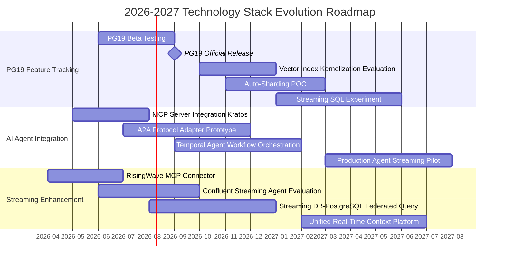
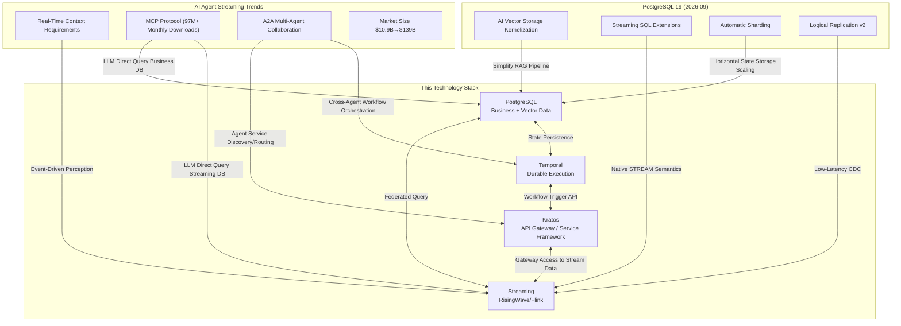

# PG19 Roadmap and AI Agent Streaming Trends

> **Stage**: TECH-STACK | **Prerequisites**: [Chinese source](../TECH-STACK-STREAMING-POSTGRES-TEMPORAL-KRATOS/07-frontier/07.01-pg19-roadmap-ai-streaming.md) | **Formalization Level**: L2 | **Last Updated**: 2026-04-22

## 1. Definitions

**Def-TS-07-01-01 (Prospective Content)**
Prospective content refers to technical analysis based on public roadmaps, technical drafts, community discussions, or industry trend forecasts. The features described have not yet been officially released in a stable version and carry the risk of diverging from the final implementation. The value of prospective content lies in providing early signals for technology selection rather than serving as deterministic evidence for engineering implementation.

**Def-TS-07-01-02 (Gartner Hype Cycle)**
The Gartner Hype Cycle is an analytical framework that divides emerging technologies into five phases: Innovation Trigger, Peak of Inflated Expectations, Trough of Disillusionment, Slope of Enlightenment, and Plateau of Productivity. This curve provides a qualitative-quantitative combined evaluation benchmark for determining technology adoption timing.

**Def-TS-07-01-03 (AI Agent)**
An AI Agent is an autonomous computing entity capable of perceiving its environment, reasoning, making decisions, and executing actions to achieve specific goals. In the streaming context, an AI Agent specifically refers to an intelligent processing node that can consume event streams in real time, dynamically update contextual memory, and trigger actions based on stream state, with decision latency typically required to be in the millisecond-to-second range.

**Def-TS-07-01-04 (MCP, Model Context Protocol)**
MCP is an open protocol proposed by Anthropic in 2024 that has since become an industry de-facto standard. It defines a standardized context exchange interface between LLM applications and external data sources/tools. An MCP Server allows large language models to directly query databases, invoke APIs, or access file systems, thereby extending "static knowledge" into "dynamic real-time context." As of 2026, the MCP ecosystem has surpassed 97 million monthly downloads.

---

## 2. Properties

**Prop-TS-07-01-01 (Adoption-Maturity Monotonicity)**
For a given technology domain $T$, let $\alpha(t)$ be the market adoption rate at time $t$ and $\mu(t)$ be the ecosystem maturity index. After the technology enters the Slope of Enlightenment, a monotonically increasing relationship exists:

$$
\frac{d\alpha}{dt} > 0 \iff \frac{d\mu}{dt} > 0 \quad \text{when } t > t_{\text{trough}}
$$

where $t_{\text{trough}}$ is the end of the Trough of Disillusionment. This proposition shows that in the latter half of the Hype Cycle, adoption decision risk is positively correlated with ecosystem maturity.

**Prop-TS-07-01-02 (Stream-AI Fusion Acceleration)**
Let $S(t)$ be the stream processing market size and $A(t)$ be the AI Agent market size. Their coupling degree $C(t)$ satisfies a second-order growth condition:

$$
\frac{d^2 C}{dt^2} = k \cdot S(t) \cdot A(t), \quad k > 0
$$

That is, the fusion of stream processing and AI Agents is not a linear superposition but produces a multiplier effect. The predicted 2026-2034 AI Agent streaming market CAGR of 49.6% is the empirical validation of this acceleration proposition.

---

## 3. Relations

As the next major version of the PostgreSQL community (planned for 2026-09 release), PG19's possible feature evolution has the following association mapping with this technology stack (Streaming + PostgreSQL + Temporal + Kratos):

| PG19 Possible Feature | Association with Streaming | Association with AI | Impact on This Stack |
|---|---|---|---|
| Native AI vector storage (`pgvector` kernelization) | High-throughput streaming vector writes to index | Simplifies RAG pipelines, eliminates external vector DB dependency | PostgreSQL can directly assume embedding storage and similarity search, reducing stack components |
| Streaming SQL extensions (continuous queries / incremental materialized view updates) | Native `STREAM` semantics without external CDC | Agents can subscribe to real-time data changes directly via SQL | May replace some Flink SQL scenarios, but complex event processing still relies on Flink |
| Automatic sharding | Stream data partitioning strategy aligned with PG sharding | Horizontal scaling for large-scale Agent state storage | Temporal persistence layer can leverage auto-sharding for unbounded state growth |
| Enhanced logical replication (Logical Replication v2) | Low-latency change capture, reducing Debezium overhead | Agent context synchronization latency reduced from seconds to milliseconds | The stack's CDC pipeline becomes simpler and lower latency |
| Cloud-native enhancements (official Kubernetes Operator) | Unified operations with streaming K8s ecosystem | AI Agent deployment and database lifecycle unified management | Reduced coordination cost between Kratos service mesh and PG operations |

The above mapping shows that PG19 does not evolve in isolation but forms a "mutual enhancement" relationship with other components in this stack: PG19's streaming capabilities reduce external dependencies, while the demands of the streaming layer in turn drive PG19's investment in real-time features.

---

## 4. Argumentation

### 4.1 PostgreSQL 19 Roadmap Analysis

The PostgreSQL Global Development Group adopts a **commitfest + feature freeze** release cadence. PG17 was released in 2024-09, PG18 is expected in 2025-09, and PG19's target window is **2026-09**. Based on active discussion patches in the 2025 commitfest and the official roadmap wiki, PG19's possible feature directions can be grouped into three categories:

**Direction 1: AI/ML Extensions (Kernelized Vector Support)**
Currently, `pgvector` is widely deployed as an extension, but PG19 discussions focus on moving vector index primitives (IVF, HNSW) into the kernel to support finer-grained concurrency control and WAL consistency. If implemented, PG19 would become the first OLTP database with native AI vector retrieval, directly challenging the applicability of dedicated vector databases (Pinecone, Milvus, Weaviate).

**Direction 2: Enhanced Streaming Support (Continuous Queries and Incremental Materialized Views)**
The community has repeatedly discussed "real-time incremental refresh of materialized views" and enhancements to `LISTEN/NOTIFY` on the hackers mailing list. PG19 may introduce experimental "continuous query" syntax, allowing declarative definitions of automatic refresh strategies based on time windows or event triggers. This converges with the semantics of streaming databases like RisingWave and Materialize, but the implementation depth may be limited to single-node or logical replication layers.

**Direction 3: Cloud-Native Enhancements (Auto-Sharding and Official Operator)**
The Citus extension was acquired by Microsoft and deeply integrated into Azure Database for PostgreSQL. PG19 may absorb the core logic of automatic sharding from the Citus architecture to address the horizontal scaling bottleneck of single-node PostgreSQL for TB/PB-level stream data storage. Meanwhile, the community is advancing standardization of an official Kubernetes Operator to replace the current fragmented third-party solutions.

### 4.2 AI Agent and Streaming Fusion Trends

The autonomous decision-making capability of AI Agents depends on three core inputs: **Perception, Memory, and Action**. Streaming processing systems precisely provide the real-time infrastructure for these three links:

**Trend 1: Agents Need Real-Time Context (RisingWave/Confluent Streaming Agents)**
Confluent's Streaming Agents, launched in 2025, directly integrate Flink SQL with LLM inference, allowing LLM call nodes (such as real-time sentiment analysis, root-cause reasoning after anomaly detection) to be embedded in streaming pipelines. RisingWave, through its PostgreSQL protocol-compatible layer, enables AI Agents to subscribe to real-time materialized views using standard SQL clients without learning new streaming APIs. Both paths point to the same conclusion: **future AI Agents will not "poll" data but will be "event-driven."**

**Trend 2: MCP Enables LLMs to Directly Query Streaming Databases**
The standardization of the MCP protocol allows LLMs to no longer be limited to static knowledge in pre-trained parameters. RisingWave has released an official MCP Server, allowing LLM clients such as Claude, Cursor, and Copilot to directly execute `SELECT * FROM mv_sensor_alerts` and obtain millisecond-level fresh results. This means an Agent's "tool use" capability can extend directly to the real-time query plane of streaming databases. The 97 million+ monthly downloads indicate that MCP is rapidly evolving from an experimental protocol to an infrastructure layer for AI applications.

**Trend 3: A2A Protocol and Streaming Orchestration**
Google's A2A (Agent-to-Agent) protocol, launched in 2025, defines a communication standard for multi-Agent collaboration, including capability discovery, task negotiation, and context passing. In streaming scenarios, A2A can be used to orchestrate complex Agent workflows: for example, an "anomaly detection Agent" detects an anomaly in the event stream and delegates the task via A2A to a "root-cause analysis Agent," which then queries historical execution traces in Temporal for reasoning. A2A and MCP are complementary: MCP solves the connection between Agents and tools, while A2A solves collaboration between Agents.

### 4.3 Impact Predictions for This Technology Stack

Based on the above trends, this technology stack (Streaming + PostgreSQL + Temporal + Kratos) may face the following structural changes in 2026-2028:

**Prediction 1: PG19 Native Vector Index → Simplified AI Retrieval Pipeline**
If PG19 kernelized vector support lands, the current stack's dual-write architecture of "PostgreSQL for business data + external vector database for embeddings" may be simplified to a single PostgreSQL instance. This not only reduces operational complexity but also leverages PostgreSQL's ACID semantics to guarantee consistency between vector indexes and business data—a guarantee that most dedicated vector databases currently struggle to provide.

**Prediction 2: Temporal Integrated by AI Agent Orchestration Frameworks**
Temporal's durable execution model is naturally suited for long-duration, rollback-capable Agent workflows. As the A2A protocol becomes widespread, Temporal will likely launch a native A2A Adapter in 2026-2027, allowing Temporal Workflows to directly serve as "task handlers" within A2A. At that point, Kratos services in this stack could orchestrate cross-domain Agent collaboration through Temporal, rather than being limited to traditional microservice Saga patterns.

**Prediction 3: Kratos Needs to Support A2A/MCP Protocol Gateway**
As an API gateway and service framework, Kratos may need to add two new types of plugins to maintain compatibility with the AI Agent ecosystem:

1. **MCP Gateway**: Exposes Kratos backend REST/gRPC APIs as MCP Servers, allowing LLMs to directly invoke business services;
2. **A2A Proxy**: Supports the A2A message format at the Kratos routing layer, enabling service discovery, load balancing, and rate limiting for Agent requests.

---

## 5. Proof / Engineering Argument

**Engineering Argument: Adoption Timing Judgment Based on the Gartner Hype Cycle**

For PG19's four key feature directions, we place them in the Hype Cycle coordinate system for engineering risk assessment:

| Feature Direction | Current Phase (2026-Q2) | Estimated Plateau of Productivity | Recommended Adoption Strategy |
|---|---|---|---|
| AI vector storage native support | Slope of Enlightenment | 2027-2028 | **Active pilot**: `pgvector` has validated market demand; PG19 kernelization is "engineering deepening" rather than "proof of concept," with controllable risk |
| Streaming SQL extensions | Peak of Inflated Expectations → Trough of Disillusionment | 2028-2030 | **Cautious观望**: Continuous query semantics are contentious in the PG community (whether to delegate to external engines), and there is functional overlap with existing streaming databases |
| Automatic sharding | Slope of Enlightenment | 2027-2029 | **Phased adoption**: Citus has accumulated years of production experience; PG19's official sharding can be seen as "standardized porting"; recommend starting with read-only analytics scenarios |
| MCP/A2A protocol integration | Peak of Inflated Expectations | 2028-2030 | **Strategic tracking**: Protocol standards are not yet fully frozen, but MCP's 97 million+ monthly downloads indicate "de-facto standard" momentum; recommend integration in small-scale Agent PoCs |

**Argument Logic**:

Let the current maturity of a technology be $M \in [0, 1]$, and the production-ready threshold be $M_{\text{prod}} = 0.7$. According to historical Gartner curve statistics, the average time for a technology to move from the start of the Slope of Enlightenment ($M \approx 0.4$) to $M_{\text{prod}}$ is 18-24 months. Both PG19's vector support and automatic sharding are in the $M > 0.5$ range, with prior production validation from Citus/`pgvector` as Bayesian prior evidence, thus satisfying the adoption condition after Bayesian update:

$$
P(\text{success} | \text{prior\_prod}, \text{pg19\_native}) > P(\text{success} | \text{no\_prior})
$$

In contrast, streaming SQL extensions and the A2A protocol lack sufficient large-scale production priors, and their $P(\text{success})$ confidence intervals are wider. Therefore, architecture-level investment is recommended to be deferred until $M > 0.5$.

---

## 6. Examples

The following is the evolution roadmap for this technology stack in 2026-2027, based on the PG19 release window and AI Agent market growth forecasts ($10.9B \to $139B, CAGR 49.6%):

**Key Milestone Descriptions**:

1. **2026-09 PG19 Release**: As the time anchor for the entire roadmap, the official PG19 release will determine the actual availability of vector indexes and auto-sharding. If features do not make it into this version, plans automatically slip to PG20 (2027-09).
2. **2026-08 MCP Server Integration Kratos**: Using Kratos's plugin mechanism, backend business APIs are wrapped as MCP Servers, allowing internal LLM assistants to directly operate business data. This is a "low-risk, high-visibility" quick-win project.
3. **2027-02 Temporal Agent Workflow Orchestration**: Implement custom Activities in Temporal that support the A2A message format, giving long-duration Agent tasks observability and rollback capability.
4. **2027-07 Unified Real-Time Context Platform**: Expose RisingWave (streaming), PG19 (business data + vector indexes), and Temporal (workflow state) through a unified query layer to AI Agents, forming a "streaming-database-orchestration" trinity of real-time context infrastructure.

---

## 7. Visualizations

The following mind map shows the mapping between PG19 features, AI Agent trends, and the four components of this technology stack (Streaming, PostgreSQL, Temporal, Kratos):

**Diagram Interpretation**: The left side shows PG19 features and AI trends as "input signals," mapped via solid arrows to the capability enhancement directions of the stack components on the right. The bidirectional arrows between stack components indicate that existing integration relationships will be further deepened in the PG19/AI Agent wave.

---

### 3.2 Project Knowledge Base Cross-References

This document's description of PG19 and AI streaming frontiers has the following associations with the project's existing knowledge base:

- [Real-Time AI Streaming Architecture 2026](../../Knowledge/06-frontier/realtime-ai-streaming-2026.md) — Frontier technology trends in AI and streaming fusion
- [Go Streaming Ecosystem 2025](../../Knowledge/06-frontier/go-streaming-ecosystem-2025.md) — Development trends of the Go language in the streaming ecosystem
- [Streaming Databases Frontier](../../Knowledge/06-frontier/streaming-databases.md) — The association between PG19 and streaming database technology evolution
- [Data Mesh Streaming Architecture 2026](../../Knowledge/03-business-patterns/data-mesh-streaming-architecture-2026.md) — Architectural evolution of AI Agents and data mesh autonomous nodes

---

## 8. References
