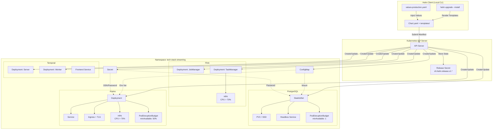
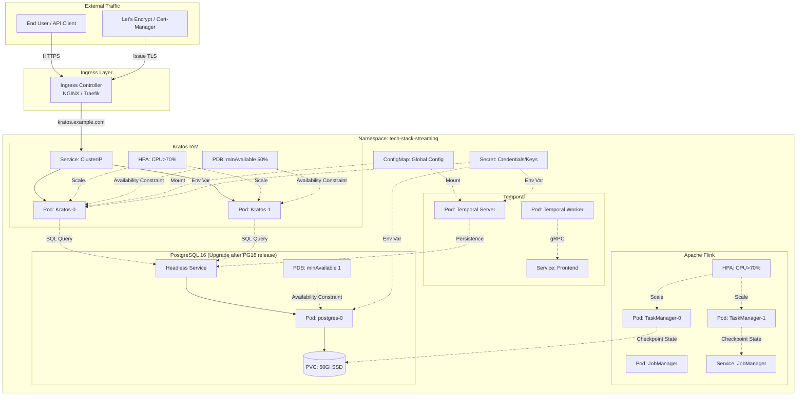

# Kubernetes + Helm Charts Production Deployment

> **Stage**: TECH-STACK | **Prerequisites**: [Chinese source](../TECH-STACK-STREAMING-POSTGRES-TEMPORAL-KRATOS/05-deployment/05.02-kubernetes-helm-deployment.md) | **Formalization Level**: L2-L4 | **Last Updated**: 2026-04-22

## 1. Definitions

**Def-TS-05-02-01 (Helm Chart)**
> A Helm Chart is a collection of Kubernetes resource templates and configuration parameters, organized in a directory structure containing `Chart.yaml` (metadata), `values.yaml` (default values), `templates/` (K8s manifests rendered by Go templates), and optional dependency declarations. A Chart serves as a reusable deployment unit, supporting version management and dependency nesting.

Intuitively, a Helm Chart is similar to a software package in an operating system (such as `.deb` or `.rpm`), but its installation target is not the file system, rather the cluster state maintained by the Kubernetes API Server. Helm 3 removed the server-side component Tiller; all operations interact directly with the API Server through local kubeconfig, reducing the RBAC attack surface.

**Def-TS-05-02-02 (Helm Release)**
> A Helm Release is an instantiated object of a Chart in a specific Kubernetes cluster and Namespace. A Release is uniquely identified by its name; Helm stores its state (release revision) in the target Namespace via Secret (default) or ConfigMap, to support upgrade rollback and history tracking.

The Release state model includes stages such as `unknown`, `deployed`, `uninstalled`, `superseded`, `failed`, `uninstalling`, `pending-install`, `pending-upgrade`, `pending-rollback`. Each `helm upgrade` generates a new revision; old revisions are marked as `superseded`.

**Def-TS-05-02-03 (Values)**
> Values are external configuration data injected into Helm Chart templates, organized in YAML key-value structure. Values sources in descending priority are: command line `--set` / `--set-file`, user-defined values files (`-f`), and Chart built-in `values.yaml`. Templates reference Values through the `{{ .Values.<key> }}` syntax.

The Values mechanism achieves separation of configuration and templates, allowing the same Chart to be reused across development, testing, and production environments, with only differentiated Values files controlling resource specifications, image versions, and external endpoints.

**Def-TS-05-02-04 (Template)**
> A Template is a Go text/template file located in the Chart `templates/` directory, usually with `.yaml` extension. During the rendering phase, Helm injects Values into templates, executes control flow (`if`, `range`, `with`) and pipeline functions (`default`, `b64enc`, `quote`, etc.), and outputs valid Kubernetes manifests submitted to the API Server.

Helm also provides built-in objects such as `.Release`, `.Chart`, `.Capabilities`, `.Template`, allowing templates to be aware of runtime cluster environments and their own metadata.

**Def-TS-05-02-05 (Ingress)**
> Ingress is a Kubernetes API resource used to route cluster external HTTP/HTTPS traffic to internal Services. Ingress itself does not directly handle traffic; it requires an Ingress Controller (such as NGINX Ingress Controller, Traefik, HAProxy) for implementation. Ingress supports configuration based on hostname, path, TLS termination, and backend protocol.

In production environments, Ingress is typically paired with Cert-Manager, automatically issuing and rotating TLS certificates through Let's Encrypt or a private CA, to achieve secure access for external traffic.

## 2. Properties

**Lemma-TS-05-02-01 (Helm Release Atomic Upgrade)**
> If a Helm Release upgrade operation (`helm upgrade`) returns successfully, then all new versions of K8s resource objects managed by that Release in the target Namespace have been persisted through the API Server; if the upgrade fails, the Release state is marked as `failed`, and it will not automatically roll back to the previous version (unless the `--atomic` flag is explicitly specified).

*Derivation*: Helm 3 upgrade logic is executed client-side, divided into the following steps:

1. Read the current Release's latest revision;
2. Render manifests based on the new Chart and Values;
3. Send update requests to the API Server through 3-way strategic merge patch;
4. Wait for resource creation/update results;
5. Record the new revision as a Secret (or ConfigMap).

API Server updates for individual resources are atomic, but cross-resource collections are not transactional. Therefore Helm provides the `--atomic` option: when any resource update fails, it automatically rolls back to the previous successful revision. Without `--atomic`, successfully written resources remain in the new state, failed resources retain the old state, and the cluster is in a partial upgrade state.

**Lemma-TS-05-02-02 (Determinism of Values Priority Override)**
> Given the same key path `k`, if multiple Values sources exist, Helm selects values according to fixed priority, and the output is deterministic, unaffected by template file loading order.

*Derivation*: Helm's Values merge adopts a deep override strategy. The priority chain is:

```
--set > --values (-f) > parent chart values > subchart values > chart default values
```

Since the YAML key space is a tree structure and same-layer key overrides are unambiguous, the final merged result is unique.

## 3. Relations

Helm Chart and Kubernetes resource objects have a **template instantiation** relationship:

| Helm Chart Component | Mapping Target | Relationship Type |
|---|---|---|
| `Chart.yaml` | No direct K8s resource | Package metadata, used for dependency resolution and repository indexing |
| `values.yaml` | No direct K8s resource | Configuration data source, referenced during template rendering |
| `templates/*.yaml` | Pod, Deployment, Service, Ingress, ConfigMap, Secret, StatefulSet, etc. | One-to-many template instantiation |
| Helm Release Secret | `sh.helm.release.v1.<name>.v<N>` Secret | State persistence |
| `templates/_helpers.tpl` | No direct K8s resource | Named templates (partials), included and reused by other templates |

Specifically, a Chart's `templates/` directory typically outputs the following resource collection:

- **Deployment / StatefulSet**: Workload controllers, defining Pod templates and replica strategies;
- **Service**: In-cluster service discovery and load balancing;
- **ConfigMap / Secret**: Configuration externalization and sensitive information injection;
- **Ingress**: External traffic entry;
- **PersistentVolumeClaim**: Storage declarations for stateful workloads;
- **PodDisruptionBudget**: Availability assurance strategies;
- **HorizontalPodAutoscaler**: Elastic scaling strategies.

Helm's dependency management (`dependencies` in `Chart.yaml`) allows a parent Chart to nest sub-Charts (such as Bitnami PostgreSQL Chart, Temporal Helm Chart), achieving parameter passthrough through global Values or dependency aliases, forming a **composite deployment** relationship.

## 4. Argumentation

### 4.1 K8s Resource Design for the Five-Technology Stack

This technology stack includes Streaming (Flink), PostgreSQL, Temporal, Kratos, and supporting infrastructure. The resource model design for each component is as follows:

| Component | Controller Type | Storage Requirement | Service Type | Key Configuration |
|---|---|---|---|---|
| PostgreSQL 16 | StatefulSet | PVC (SSD) | Headless Service | `minAvailable: 1`, single-node or primary-replica (upgrade after PG18 release) |
| Flink JobManager | Deployment | None / Checkpoint PVC | ClusterIP | Operator or native Deployment |
| Flink TaskManager | Deployment | None | ClusterIP | HPA triggered at CPU > 70% |
| Temporal Server | Deployment | PVC (Persistence) | ClusterIP / Headless | Community Helm Chart multi-service split |
| Temporal Worker | Deployment | None | ClusterIP | Communicates with Temporal Server via gRPC |
| Kratos | Deployment | None | ClusterIP + Ingress | `minAvailable: 50%`, HPA CPU > 70% |

Namespace is uniformly `tech-stack-streaming`, facilitating centralized management of NetworkPolicy and RBAC.

### 4.2 StatefulSet: PostgreSQL 16

PostgreSQL, as a stateful service, must satisfy:

1. **Stable network identity**: Through Headless Service (`clusterIP: None`), each Pod is provided with resolvable DNS records (e.g., `postgres-0.postgres.tech-stack-streaming.svc.cluster.local`);
2. **Stable storage**: Each Pod template mounts an independent `PersistentVolumeClaim`, dynamically provisioned by StorageClass with SSD backend;
3. **Ordered deployment and scaling**: `podManagementPolicy: OrderedReady` ensures the primary node starts first;
4. **Minimum availability guarantee**: `PodDisruptionBudget` sets `minAvailable: 1`, ensuring at least one replica is available during rolling updates or node eviction.

```yaml
# Snippet: PostgreSQL StatefulSet core fields
spec:
  serviceName: postgres-headless
  replicas: 1
  podManagementPolicy: OrderedReady
  template:
    spec:
      containers:
        - name: postgres
          image: postgres:16-alpine  # Upgrade after PG18 official image release
          volumeMounts:
            - name: data
              mountPath: /var/lib/postgresql/data
  volumeClaimTemplates:
    - metadata:
        name: data
      spec:
        accessModes: ["ReadWriteOnce"]
        storageClassName: "standard-ssd"  # Or default StorageClass
        resources:
          requests:
            storage: 50Gi
```

### 4.3 Deployment: Flink JobManager / TaskManager, Kratos, Temporal Worker

Stateless services adopt the Deployment controller:

- **Flink JobManager**: Responsible for cluster coordination and scheduling. If using Flink Kubernetes Operator, it is managed through the `FlinkDeployment` CRD; if using native Deployment, the REST (`8081`) and Blob Server ports need to be exposed.
- **Flink TaskManager**: Actually executes computing tasks, with high resource consumption, requiring HPA to automatically scale replica count based on CPU utilization.
- **ORY Kratos**: Identity and Access Management (IAM) service, stateless, dependent on PostgreSQL for data persistence. Needs to expose HTTP (4433) and Admin (4434) ports.

> **Naming Note**: The Helm Chart here uses `oryd/kratos`, the IAM solution in the ORY ecosystem; it is a completely different project from the [Go-Kratos](https://go-kratos.dev/) microservices framework used in the Docker Compose stack, despite the same name. Please do not confuse them.

- **Temporal Worker**: Business workflow execution unit, connecting to Temporal Frontend Service via gRPC.

The `strategy` of Deployment defaults to `RollingUpdate`; `maxUnavailable` and `maxSurge` need to be reasonably set to avoid service interruption.

### 4.4 Helm Chart Structure

This deployment adopts the Umbrella Chart pattern; the top-level Chart aggregates each subsystem:

```
tech-stack-streaming/
├── Chart.yaml
├── values.yaml
├── values-production.yaml
├── templates/
│   ├── _helpers.tpl
│   ├── namespace.yaml
│   ├── postgres/
│   │   ├── statefulset.yaml
│   │   ├── service-headless.yaml
│   │   ├── pdb.yaml
│   │   └── secret.yaml
│   ├── flink/
│   │   ├── deployment-jobmanager.yaml
│   │   ├── deployment-taskmanager.yaml
│   │   ├── service-jobmanager.yaml
│   │   └── hpa-taskmanager.yaml
│   ├── temporal/
│   │   └── (references community sub-chart)
│   ├── kratos/
│   │   ├── deployment.yaml
│   │   ├── service.yaml
│   │   ├── ingress.yaml
│   │   ├── pdb.yaml
│   │   └── hpa.yaml
│   └── configmap-global.yaml
└── charts/
    └── temporal-0.50.0.tgz   # Community Temporal Helm Chart
```

`Chart.yaml` example:

```yaml
apiVersion: v2
name: tech-stack-streaming
description: Helm chart for streaming + postgres + temporal + kratos stack
type: application
version: 1.0.0
appVersion: "2026.04"
dependencies:
  - name: temporal
    version: 0.50.0
    repository: https://temporalio.github.io/helm-charts
    condition: temporal.enabled
```

### 4.5 Configuration Externalization (ConfigMap / Secret)

Production environments prohibit hard-coding configuration into container images. The following externalization strategy is adopted:

- **ConfigMap**: Stores non-sensitive configurations, such as database connection pool parameters, Flink parallelism, Temporal namespace, Kratos public URL;
- **Secret**: Stores sensitive information, such as PostgreSQL passwords, Kratos encryption keys, TLS certificate private keys, OAuth2 Client Secret. Secret data is stored in Base64 encoding; it is recommended to enable etcd encryption (`EncryptionConfiguration`) or external secret management (such as External Secrets Operator + Azure Key Vault).

Configuration is injected into containers through environment variables or mounted volumes:

```yaml
envFrom:
  - configMapRef:
      name: {{ include "tech-stack.fullname" . }}-global
env:
  - name: DSN
    valueFrom:
      secretKeyRef:
        name: {{ include "tech-stack.fullname" . }}-postgres
        key: dsn
```

### 4.6 Ingress + TLS Configuration

External traffic enters the cluster through Ingress; only Kratos public API and Flink REST API (optional) need to be exposed:

```yaml
apiVersion: networking.k8s.io/v1
kind: Ingress
metadata:
  name: {{ include "tech-stack.fullname" . }}-kratos
  annotations:
    cert-manager.io/cluster-issuer: "letsencrypt-prod"
    nginx.ingress.kubernetes.io/ssl-redirect: "true"
spec:
  ingressClassName: nginx
  tls:
    - hosts:
        - kratos.example.com
      secretName: kratos-tls
  rules:
    - host: kratos.example.com
      http:
        paths:
          - path: /
            pathType: Prefix
            backend:
              service:
                name: {{ include "tech-stack.fullname" . }}-kratos
                port:
                  number: 4433
```

TLS certificates are automatically issued and renewed by Cert-Manager. For inter-service communication, it is recommended to enable Service Mesh (such as Linkerd or Istio) to implement mTLS, replacing plaintext intra-cluster communication.

### 4.7 HPA (Horizontal Pod Autoscaler) Configuration

HPA automatically adjusts Deployment replica count based on observed metrics. In this stack, Flink TaskManager and Kratos enable HPA:

```yaml
apiVersion: autoscaling/v2
kind: HorizontalPodAutoscaler
metadata:
  name: {{ include "tech-stack.fullname" . }}-kratos
spec:
  scaleTargetRef:
    apiVersion: apps/v1
    kind: Deployment
    name: {{ include "tech-stack.fullname" . }}-kratos
  minReplicas: 2
  maxReplicas: 10
  metrics:
    - type: Resource
      resource:
        name: cpu
        target:
          type: Utilization
          averageUtilization: 70
  behavior:
    scaleUp:
      stabilizationWindowSeconds: 60
      policies:
        - type: Percent
          value: 100
          periodSeconds: 60
    scaleDown:
      stabilizationWindowSeconds: 300
      policies:
        - type: Percent
          value: 10
          periodSeconds: 60
```

`scaleDown.stabilizationWindowSeconds: 300` prevents frequent scaling down caused by traffic jitter. Flink TaskManager's HPA needs to coordinate with Flink's dynamic parallelism adjustment mechanism to avoid state reassignment anomalies caused by relying solely on replica count.

### 4.8 PodDisruptionBudget Guarantees Minimum Available Replicas

PDB limits the number of unavailable Pods caused by voluntary disruptions (such as node draining, Deployment rolling updates):

```yaml
# PostgreSQL PDB
apiVersion: policy/v1
kind: PodDisruptionBudget
metadata:
  name: {{ include "tech-stack.fullname" . }}-postgres
spec:
  minAvailable: 1
  selector:
    matchLabels:
      app.kubernetes.io/component: postgres
---
# Kratos PDB
apiVersion: policy/v1
kind: PodDisruptionBudget
metadata:
  name: {{ include "tech-stack.fullname" . }}-kratos
spec:
  minAvailable: 50%
  selector:
    matchLabels:
      app.kubernetes.io/component: kratos
```

`minAvailable: 50%` means that at any moment at least half of Kratos Pods must be in Ready state. If replica count is 2, then 1 can be interrupted simultaneously; if replica count is 4, then 2 can be interrupted simultaneously. This strategy needs to be jointly verified with HPA scaling (see Section 5).

## 5. Proof / Engineering Argument

**Prop-TS-05-02-01 (PDB + HPA Availability Guarantee During Rolling Update)**
> Let Deployment `D` be simultaneously constrained by PDB `P` and HPA `H`. If initial replica count `replicas = r ≥ 2`, PDB requires `minAvailable = m`, and HPA target CPU utilization `U_target = 70%`. Then during rolling update, as long as node resources are sufficient and HPA has not triggered emergency scale-down, the number of available Pods always satisfies `available ≥ max(m, ceil(r/2))` (when m is a percentage, take the integer).

*Engineering Argument*:

1. **PDB Constraint Boundary**
   PDB takes effect through the Kubernetes Eviction API. `kubectl drain` or Deployment `RollingUpdate` queries the PDB status with the API Server before executing Pod termination. If terminating this Pod would cause `available < minAvailable`, the eviction request is suspended (`429 Too Many Requests`) until the condition is satisfied.
   For Kratos, `minAvailable: 50%` when replica count `r` is even is equivalent to `maxUnavailable = r/2`; when `r` is odd it is equivalent to `maxUnavailable = floor(r/2)`. Thus PDB directly constrains the upper bound of simultaneous interruptions during rolling update.

2. **HPA and Rolling Update Temporal Relationship**
   The HPA controller calculates desired replica count based on Pod average CPU from the Metrics Server every 15 seconds (default). During rolling update, old Pods in `Terminating` state are still counted in current replica count but no longer provide effective load capacity; new Pods need to pass the readiness probe before being considered `available`.
   If load remains unchanged while service capacity decreases, average CPU rises, and HPA tends to **scale up** rather than scale down. Therefore HPA typically does not generate conflicting scale-down requests with PDB during rolling updates; instead, it may improve availability by increasing replica count.

3. **Joint Safety Condition**
   Define the joint safety condition:

   ```
   Let r_current = current Deployment spec.replicas
   Let m_abs   = absolute value of PDB minAvailable (if percentage, compute ceil(r_current * ratio))
   Let u_max   = RollingUpdate maxUnavailable
   ```

   The necessary condition for safe rolling update is:

   ```
   u_max ≤ r_current - m_abs
   ```

   If `u_max` defaults to 25% and PDB requires 50%, then `u_max = ceil(r_current * 0.25) ≤ floor(r_current * 0.5)` holds for all `r_current ≥ 2`. Therefore the default Deployment strategy and `minAvailable: 50%` are compatible.

4. **Risk Boundary: Node-level Involuntary Disruption**
   PDB only takes effect for **voluntary disruption**. Pod failures caused by node failures, kubelet crashes, or network partitions are involuntary disruptions, which PDB cannot prevent. In this case high availability depends on multi-replica cross-node/cross-AZ distribution (`podAntiAffinity` and `topologySpreadConstraints`).

In summary, reasonable configuration of PDB and HPA can ensure that services maintain a quorum of available replicas during routine operations (upgrades, node maintenance); HPA's scale-up tendency further reduces the risk of insufficient capacity during rolling updates.

## 6. Examples

### 6.1 Helm values.yaml (Production Environment)

```yaml
# values-production.yaml
# Namespace configuration
namespace:
  name: tech-stack-streaming
  labels:
    environment: production
    app.kubernetes.io/managed-by: Helm

# PostgreSQL configuration
postgres:
  enabled: true
  image:
    repository: postgres
    tag: "16-alpine"  # Upgrade after PG18 official image release
  replicas: 1
  resources:
    requests:
      memory: "2Gi"
      cpu: "1000m"
    limits:
      memory: "4Gi"
      cpu: "2000m"
  persistence:
    enabled: true
    size: 50Gi
    storageClass: "standard-ssd"
  pdb:
    minAvailable: 1
  service:
    type: ClusterIP
    port: 5432

# Flink configuration (native Deployment mode)
flink:
  enabled: true
  jobmanager:
    image: flink:1.20-scala_2.12
    replicas: 1
    resources:
      requests:
        memory: "2Gi"
        cpu: "1000m"
    service:
      type: ClusterIP
      ports:
        rest: 8081
        blob: 6124
  taskmanager:
    image: flink:1.20-scala_2.12
    replicas: 2
    resources:
      requests:
        memory: "4Gi"
        cpu: "2000m"
    hpa:
      enabled: true
      minReplicas: 2
      maxReplicas: 20
      targetCPUUtilizationPercentage: 70
      behavior:
        scaleUp:
          stabilizationWindowSeconds: 60
        scaleDown:
          stabilizationWindowSeconds: 300

# Temporal configuration (references community sub-chart parameters)
temporal:
  enabled: true
  server:
    replicaCount: 2
  cassandra:
    enabled: false
  postgresql:
    enabled: true
    host: "postgres-headless.tech-stack-streaming.svc.cluster.local"
    port: 5432
    database: temporal
    user: temporal
    existingSecret: "tech-stack-streaming-postgres"
  elasticsearch:
    enabled: true

# Kratos configuration (ORY Kratos IAM — Note: different project from Go-Kratos microservices framework despite same name)
kratos:
  enabled: true
  image:
    repository: oryd/kratos
    tag: "v1.3.0"
  replicas: 2
  resources:
    requests:
      memory: "512Mi"
      cpu: "250m"
    limits:
      memory: "1Gi"
      cpu: "500m"
  config:
    dsn: "postgres://kratos:{{ .Values.kratos.config.secrets.dbPassword }}@postgres-headless:5432/kratos?sslmode=disable"
    secrets:
      dbPassword:
        existingSecret:
          name: tech-stack-streaming-postgres
          key: kratos-password
  ingress:
    enabled: true
    className: nginx
    hosts:
      - host: kratos.example.com
        paths:
          - path: /
            pathType: Prefix
    tls:
      - secretName: kratos-tls
        hosts:
          - kratos.example.com
  hpa:
    enabled: true
    minReplicas: 2
    maxReplicas: 10
    targetCPUUtilizationPercentage: 70
  pdb:
    minAvailable: 50%
```

### 6.2 Key K8s Manifest Template Snippets

**Kratos Deployment Template (with configuration externalization and probes)**

```yaml
# templates/kratos/deployment.yaml
apiVersion: apps/v1
kind: Deployment
metadata:
  name: {{ include "tech-stack.fullname" . }}-kratos
  namespace: {{ .Values.namespace.name }}
  labels:
    {{- include "tech-stack.labels" . | nindent 4 }}
    app.kubernetes.io/component: kratos
spec:
  replicas: {{ .Values.kratos.replicas }}
  strategy:
    type: RollingUpdate
    rollingUpdate:
      maxUnavailable: 25%
      maxSurge: 25%
  selector:
    matchLabels:
      {{- include "tech-stack.selectorLabels" . | nindent 6 }}
      app.kubernetes.io/component: kratos
  template:
    metadata:
      labels:
        {{- include "tech-stack.selectorLabels" . | nindent 8 }}
        app.kubernetes.io/component: kratos
    spec:
      containers:
        - name: kratos
          image: "{{ .Values.kratos.image.repository }}:{{ .Values.kratos.image.tag }}"
          imagePullPolicy: IfNotPresent
          command: ["kratos"]
          args: ["serve", "--config", "/etc/config/kratos.yaml"]
          ports:
            - name: public
              containerPort: 4433
              protocol: TCP
            - name: admin
              containerPort: 4434
              protocol: TCP
          livenessProbe:
            httpGet:
              path: /health/alive
              port: admin
            initialDelaySeconds: 10
            periodSeconds: 10
          readinessProbe:
            httpGet:
              path: /health/ready
              port: admin
            initialDelaySeconds: 5
            periodSeconds: 5
          resources:
            {{- toYaml .Values.kratos.resources | nindent 12 }}
          volumeMounts:
            - name: config
              mountPath: /etc/config
              readOnly: true
            - name: secrets
              mountPath: /etc/secrets
              readOnly: true
          envFrom:
            - configMapRef:
                name: {{ include "tech-stack.fullname" . }}-global
      volumes:
        - name: config
          configMap:
            name: {{ include "tech-stack.fullname" . }}-kratos-config
        - name: secrets
          secret:
            secretName: {{ include "tech-stack.fullname" . }}-kratos-secrets
```

**Flink TaskManager HPA Template**

```yaml
# templates/flink/hpa-taskmanager.yaml
{{- if .Values.flink.taskmanager.hpa.enabled }}
apiVersion: autoscaling/v2
kind: HorizontalPodAutoscaler
metadata:
  name: {{ include "tech-stack.fullname" . }}-flink-taskmanager
  namespace: {{ .Values.namespace.name }}
spec:
  scaleTargetRef:
    apiVersion: apps/v1
    kind: Deployment
    name: {{ include "tech-stack.fullname" . }}-flink-taskmanager
  minReplicas: {{ .Values.flink.taskmanager.hpa.minReplicas }}
  maxReplicas: {{ .Values.flink.taskmanager.hpa.maxReplicas }}
  metrics:
    - type: Resource
      resource:
        name: cpu
        target:
          type: Utilization
          averageUtilization: {{ .Values.flink.taskmanager.hpa.targetCPUUtilizationPercentage }}
  behavior:
    scaleUp:
      stabilizationWindowSeconds: {{ .Values.flink.taskmanager.hpa.behavior.scaleUp.stabilizationWindowSeconds }}
      policies:
        - type: Percent
          value: 100
          periodSeconds: 60
    scaleDown:
      stabilizationWindowSeconds: {{ .Values.flink.taskmanager.hpa.behavior.scaleDown.stabilizationWindowSeconds }}
      policies:
        - type: Percent
          value: 10
          periodSeconds: 60
{{- end }}
```

## 7. Visualizations

### 7.1 Helm Chart Structure Diagram

The following diagram shows the hierarchical structure of the Umbrella Chart, Values flow, and template rendering path:



### 7.2 K8s Resource Topology Diagram

The following diagram shows the runtime topology, traffic paths, and storage dependencies of the five-technology stack in Kubernetes:



### 3.2 Project Knowledge Base Cross-References

The Helm production deployment described in this document relates to the following entries in the project knowledge base:

- [Flink Kubernetes Deployment Guide](../Flink/04-runtime/04.01-deployment/kubernetes-deployment.md) — Flink deployment modes on K8s and Helm Chart integration
- [Flink Kubernetes Operator Deep Dive](../Flink/04-runtime/04.01-deployment/flink-kubernetes-operator-deep-dive.md) — Production-grade Flink Operator automated deployment and lifecycle management
- [Flink Deployment Operations Complete Guide](../Flink/04-runtime/04.01-deployment/flink-deployment-ops-complete-guide.md) — Operations best practices for Flink deployment in K8s environments
- [High Availability Patterns](../Knowledge/07-best-practices/07.06-high-availability-patterns.md) — High availability configuration in Helm deployment and PDB/HPA collaborative design

## 8. References
