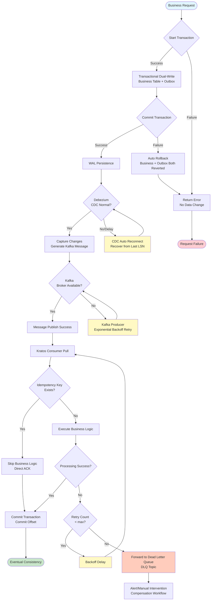

# Outbox Pattern: PostgreSQL 18 Transactions + Kratos Event Publishing

> **Stage**: TECH-STACK | **Prerequisites**: [Chinese source](../TECH-STACK-STREAMING-POSTGRES-TEMPORAL-KRATOS/03-integration/03.03-outbox-pattern-pg18-kratos.md) | **Formalization Level**: L3-L4 | **Last Updated**: 2026-04-22

## 1. Definitions

This section establishes strict formal definitions of the Outbox pattern in the PostgreSQL 18 + Kratos technology stack, laying the conceptual foundation for subsequent property derivation, engineering arguments, and example verification.

**Def-TS-03-03-01 Outbox Pattern (Outbox Pattern)**

The Outbox pattern is a reliability pattern that guarantees atomic publication of database state changes and corresponding domain events. Let business service \(S\)'s state space be \(\mathcal{X}\), and domain event space be \(\mathcal{E}\). When the service executes a local transaction \(t: \mathcal{X} \to \mathcal{X} \times \mathcal{E}\), traditional "write database then send message" or "send message then write database" approaches cannot guarantee atomicity between the write operation and message publication.

The Outbox pattern introduces an intermediate table \(O\) (Outbox table), persisting events and business data changes within the same local transaction:

$$
\forall x \in \mathcal{X},\ e \in \mathcal{E}.\quad t_{\text{outbox}}(x) = \text{commit}\left( \text{update}(x),\ \text{insert}(O, e) \right)
$$

where \(\text{update}(x)\) is the business table change, and \(\text{insert}(O, e)\) is the Outbox table event insertion. Both share the same database transaction boundary, naturally satisfying Atomicity. Subsequently, CDC (Change Data Capture) asynchronously reads Outbox table changes and forwards events to the message bus (e.g., Kafka), achieving a decoupled architecture of "transactional persistence, asynchronous publication outside transaction".

> Intuitive explanation: The Outbox pattern is like "write a draft first, then deliver uniformly" — business operations and event records are first atomically committed inside the database, ensuring events are never lost; message bus delivery is asynchronously handled by an independent CDC process. Even if the message middleware is temporarily unavailable, events safely reside in the database awaiting retry.

**Def-TS-03-03-02 Transactional Dual-Write (Transactional Dual-Write)**

Transactional dual-write refers to the operation pattern of simultaneously executing business data updates and Outbox event insertions within a single database transaction. Formally, let the business table collection be \(\mathcal{T} = \{ T_1, T_2, \ldots, T_m \}\), and the Outbox table be \(O\). The transactional dual-write operation \(\tau\) is defined as:

$$
\tau = \text{BEGIN};\ \bigcup_{i=1}^{m} \Delta T_i;\ \text{insert}(O, e);\ \text{COMMIT}
$$

where \(\Delta T_i\) is the DML operation on table \(T_i\), and \(e\) is the corresponding domain event. The key property of transactional dual-write is that \(\tau\)'s atomicity is guaranteed by the database's ACID semantics: either all operations in \(\tau\) are successfully persisted, or all are rolled back; there is no intermediate state of "business data updated but event not recorded".

> Intuitive explanation: Transactional dual-write is the core implementation means of the Outbox pattern. It reduces the "dual-write problem" (simultaneously updating the database and sending messages) from a "cross-system distributed operation" to a "local transaction operation within the same database", thereby reusing mature database transaction mechanisms to solve the atomicity challenge.

**Def-TS-03-03-03 At-Least-Once Delivery (At-Least-Once Delivery)**

At-least-once delivery means the messaging system guarantees each message is processed by the target consumer at least once. Formally, let message \(m\)'s delivery sequence be \(\{ d_1, d_2, \ldots \}\), and \(m\)'s acknowledgment (ACK) sequence be \(\{ a_1, a_2, \ldots \}\). At-least-once delivery requires:

$$
\forall m \in \mathcal{M}.\quad \text{commit}(m) \implies \exists a_i.\ \text{process}(d_i) \land \text{ack}(a_i)
$$

That is, once message \(m\) is committed by the producer, there must exist at least one successful delivery and consumption acknowledgment. This semantics allows duplicate delivery, i.e., \(\exists i \neq j.\ d_i = d_j\); therefore, consumers must be designed to be idempotent.

In the Outbox + CDC architecture, at-least-once delivery is cascaded through the following links: PG18 transaction commit guarantees event persistence \(\to\) Debezium WAL read guarantees event capture \(\to\) Kafka replica mechanism guarantees event no-loss \(\to\) consumer explicit ACK guarantees consumption acknowledgment.

**Def-TS-03-03-04 Idempotent Consumer (Idempotent Consumer)**

An idempotent consumer is a consumer implementation that can safely process duplicate messages without producing side effects. Let the consumer's business processing function be \(f: \mathcal{E} \to \mathcal{Y}\), where \(\mathcal{E}\) is the input event space and \(\mathcal{Y}\) is the output result space. \(f\) satisfies idempotency if and only if:

$$
\forall e \in \mathcal{E}.\quad f(e) \cong f(f(e)) \cong f^n(e)
$$

where \(\cong\) denotes business semantic equivalence (not requiring byte-level consistency, but requiring business state consistency). In engineering, idempotent consumers are typically implemented through uniqueness constraints (e.g., `idempotency_key` + database unique index): before processing an event, check whether the key already exists; if it exists, directly return the already-processed result, skipping repeated execution of business logic.

**Def-TS-03-03-05 Message Deduplication (Message Deduplication)**

Message deduplication is a technical mechanism to identify and eliminate duplicate messages in the message delivery chain. Let message \(m\) carry deduplication key \(k = \text{dedup_key}(m)\), and the deduplication state space be \(\mathcal{D}\) (e.g., database table or cache). The deduplication operator \(\delta\) is defined as:

$$
\delta(m) = \begin{cases}
\text{process}(m) & \text{if } k \notin \mathcal{D} \\
\text{skip}(m) & \text{if } k \in \mathcal{D}
\end{cases}
$$

In the PG18 + Kratos technology stack, message deduplication is typically implemented by the consumer side through PG18 uniqueness constraints (`UNIQUE(idempotency_key)`). When a duplicate message attempts to insert an already-existing `idempotency_key`, it triggers a uniqueness conflict; the consumer catches this conflict and treats it as idempotent success, thereby sinking deduplication semantics to the database layer and avoiding the introduction of additional distributed locks or external cache dependencies.

## 2. Properties

From the above definitions, the core reliability properties of the Outbox pattern in the PG18 + Kratos technology stack can be directly derived.

**Lemma-TS-03-03-01 Transaction Atomicity Guarantees Event No-Loss**

Let the PG18 local transaction be \(\tau\); its ACID atomicity guarantees that \(\tau\)'s commit status is a binary value \(s \in \{ \text{committed}, \text{aborted} \}\). The Outbox event \(e\)'s insertion operation \(\text{insert}(O, e)\) is a sub-operation of \(\tau\); therefore:

$$
s = \text{committed} \implies e \in O \quad \land \quad s = \text{aborted} \implies e \notin O
$$

That is, event \(e\) is persisted to the Outbox table if and only if the business transaction successfully commits. Since Debezium CDC only reads WAL records of committed transactions (under PG18 `REPLICA IDENTITY` configuration), event \(e\) must be captured by Debezium and forwarded to Kafka. Thus:

$$
\text{business commit} \implies \text{event in Outbox} \implies \text{event captured by CDC} \implies \text{event published to Kafka}
$$

Therefore, as long as the business transaction successfully commits, the corresponding domain event will never be lost. QED.

**Lemma-TS-03-03-02 Idempotency Guarantees Duplicate Consumption with No Side Effects**

Let the consumer processing function be \(f\), and event \(e\)'s deduplication key be \(k_e\). The consumer side maintains an already-processed key set \(\mathcal{D}\), whose consistency is guaranteed by PG18 `UNIQUE` constraints. When duplicate event \(e'\) arrives (\(\text{dedup_key}(e') = k_e \in \mathcal{D}\)), the consumer's attempt to insert \(k_e\) triggers a `23505 unique_violation` exception. After catching the exception, the consumer returns success (semantically equivalent to \(f(e') = f(e)\)); therefore:

$$
\forall n \geq 1.\quad f^n(e) \cong f(e)
$$

That is, regardless of how many times the event is consumed, the system's final state is business-semantically equivalent to consuming it only once. QED.

**Prop-TS-03-03-01 Outbox + CDC + Idempotent Consumer Achieves Eventual Consistency**

Let the system initial state be \(S_0\), and business operation sequence \(\langle o_1, o_2, \ldots, o_n \rangle\) produce the desired final state \(S_n^*\). In the Outbox architecture, each operation \(o_i\) produces event \(e_i\); events are asynchronously propagated to consumers via CDC; consumer \(c_j\) processes events and updates read models or triggers downstream operations.

By Lemma-TS-03-03-01, all committed business operations' corresponding events must be published; by Lemma-TS-03-03-02, all consumers safely process duplicate events. Therefore, there exists finite time \(T\) such that all consumers complete processing all published events, and the system state converges to \(S_n^*\). Formally:

$$
\exists T < \infty.\quad \forall t \geq T.\quad S_t = S_n^*
$$

This is the definition of eventual consistency. QED.

## 3. Relations

The Outbox pattern is not the only solution to the "message publishing under distributed transactions" problem. This section systematically compares it with 2PC, Saga, and Local Message Table, clarifying their respective applicable boundaries.

### 3.1 Outbox vs. Two-Phase Commit (2PC)

| Dimension | Outbox Pattern | 2PC (Two-Phase Commit) |
|-----------|---------------|------------------------|
| Atomicity Guarantee | Single-database local transaction | Cross-resource distributed atomic commit |
| Coordinator Dependency | None (database is coordinator) | Requires global transaction coordinator (TM) |
| Performance Characteristics | Equivalent to single-transaction write, no extra network RTT | Two-phase voting + locking, high latency, low throughput |
| Fault Tolerance | Database crash recovery guarantees consistency | Coordinator single-point failure may cause in-doubt transactions |
| Applicable Scenario | Microservices with single database + message bus | Strongly consistent transactions across heterogeneous databases |

**Relationship Conclusion**: Outbox is a lightweight alternative to 2PC in the "single database + asynchronous message" scenario. When business transactions and message publishing can share the same database, Outbox avoids 2PC's coordinator complexity and performance overhead; only when business data is distributed across multiple heterogeneous databases is 2PC or Saga needed.

### 3.2 Outbox vs. Saga Pattern

| Dimension | Outbox Pattern | Saga Pattern |
|-----------|---------------|--------------|
| Consistency Model | Eventual consistency (strong consistency within transaction + asynchronous eventual consistency) | Eventual consistency (compensation mechanism) |
| Failure Handling | CDC retry + consumer idempotency | Explicit compensating transactions (Compensation) |
| Semantic Complexity | Low: dual-write within same transaction suffices | High: requires defining forward operation and compensation operation pairs |
| Business Process Intrusion | Low: only add Outbox table insertion | High: requires splitting business into compensable steps |
| Applicable Scenario | Event-driven microservices "write DB + publish event" | Long-transaction cross-service orchestration (e.g., order-inventory-payment chain) |

**Relationship Conclusion**: Outbox solves the problem of "how a single service reliably publishes events externally"; Saga solves the problem of "how multiple services coordinate long transactions". The two can be combined in complex business: each local transaction within a Saga adopts the Outbox pattern to publish domain events, ensuring events are not lost within a single service while the Saga coordinator manages cross-service consistency.

### 3.3 Outbox vs. Local Message Table (Local Message Table)

The local message table is an alternative implementation of the Outbox pattern when CDC infrastructure is lacking. Its basic idea is the same as Outbox: write business data and message records within the same transaction; the difference is that the message table is read by application-layer polling and actively sent to the message bus, rather than being captured by CDC from WAL changes.

| Dimension | Outbox + CDC | Local Message Table + Polling |
|-----------|-------------|------------------------------|
| Event Latency | Low: WAL stream real-time capture (millisecond-level) | High: depends on polling interval (second-level) |
| System Coupling | Low: CDC is independent of business application | High: polling logic is embedded in application process |
| Resource Overhead | Low: WAL sequential read, no extra queries | High: polling generates periodic database query load |
| Implementation Complexity | Medium: requires deploying Debezium/Kafka Connect | Low: pure application-layer implementation |
| Ordering Guarantee | Strong: WAL order is event order | Weak: polling order may be affected by concurrent inserts |

**Relationship Conclusion**: The local message table is a degenerate implementation of the Outbox pattern, suitable for short-term transition or when CDC infrastructure is not yet ready. In the PG18 + Kafka technology stack, Debezium provides mature, low-latency, low-coupling CDC capabilities; therefore, the Outbox + CDC solution is recommended.

## 4. Argumentation

### 4.1 Why Outbox is Needed: Avoiding the Atomicity Problem of "Publish-then-Write-Database"

In microservices architecture, after completing a business operation, a service typically needs to publish domain events to the message bus to notify other services. Common naive implementations have two forms:

1. **Write database first, then send message**:

   ```
   BEGIN; UPDATE orders SET status='PAID'; COMMIT;
   kafkaProducer.send(OrderPaidEvent); // May fail!
   ```

   Risk: Database transaction has committed, but message sending fails (Kafka temporarily unavailable, network partition, application crash). Downstream services never receive `OrderPaidEvent`; the system enters an inconsistent state.

2. **Send message first, then write database**:

   ```
   kafkaProducer.send(OrderPaidEvent); // Send succeeds
   BEGIN; UPDATE orders SET status='PAID'; ROLLBACK; // Business failure!
   ```

   Risk: Message has been sent, but database transaction is rolled back. Downstream services receive the event and execute operations (e.g., deduct inventory), while the upstream service has not actually completed payment, leading to data inconsistency.

The Outbox pattern eliminates both risks above through **transactional dual-write**, bringing both operations into the same atomic boundary. Regardless of whether CDC subsequently succeeds in capturing or whether Kafka is available, events in committed transactions will never be lost; if the transaction is rolled back, events are not recorded either, and downstream will not receive false events.

### 4.2 PG18 Implementation: Writing Business Table + Outbox Table Within Same Transaction

PostgreSQL 18 provides complete local transaction semantics and WAL infrastructure, making it an ideal carrier for the Outbox pattern. In Kratos services, use `database/sql`'s `BeginTx` to manually manage transactions, ensuring business updates and Outbox insertions share the same transaction boundary.

Core implementation points:

- Outbox table primary key uses **UUIDv7**, naturally guaranteeing time ordering, avoiding index page splitting and WAL amplification caused by UUIDv4 random inserts.
- Utilize PG18 **virtual generated columns** (`GENERATED ALWAYS AS ... VIRTUAL`) to create indexes for derived fields such as `aggregate_type` on the Outbox table, accelerating CDC filtering and queries.
- Configure table-level `REPLICA IDENTITY FULL`, ensuring Debezium can capture complete row data of Outbox table inserts.

### 4.3 Debezium CDC Captures Outbox Table Changes to Kafka

Debezium PostgreSQL Connector continuously reads PG18 WAL streams through logical decoding slots (Logical Decoding Slot). When the Outbox table is inserted, Debezium captures change records and converts them to Kafka Connect structs.

With the **Debezium Outbox Event Router** (`io.debezium.transforms.outbox.EventRouter`), the CDC stream can automatically complete the following transformations:

- Map Outbox table's `aggregate_type` + `aggregate_id` to Kafka message Key, ensuring events for the same aggregate are consumed in order.
- Map `event_type` to Kafka message Header or Topic routing key.
- Map `payload` as Kafka message body (Value), supporting JSON/Avro serialization.

This transformation occurs inside the Kafka Connect process, completely transparent to the business service, achieving the decoupling of "business only writes to Outbox, message format is uniformly routed by CDC layer".

### 4.4 Kratos Consumer Consumes Kafka Events and Executes Business Logic

Kratos services, as Kafka consumers, subscribe to Outbox event topics via clients such as `sarama` or `segmentio/kafka-go`. Consumer processing follows the standard idempotent pattern:

1. Parse Kafka message, extract `idempotency_key` (typically composed of `aggregate_type:aggregate_id:event_type:created_at` or generated as UUIDv7).
2. Start local database transaction.
3. Attempt to insert `idempotency_key` into the idempotency table (with `UNIQUE` constraint).
4. If insertion succeeds, execute business logic (update read model, call downstream services, etc.).
5. Commit transaction; if any step fails, roll back transaction and do not commit Kafka Offset, triggering retry.
6. If insertion triggers uniqueness conflict, the event has already been processed; directly commit Kafka Offset (skip business logic).

### 4.5 Composite Resilience: Four-Layer Defense Design

The complete chain of Outbox + CDC + Kafka + Kratos consumer achieves end-to-end resilience through four layers of defense:

**Layer 1: Transaction Atomicity Guarantees "At-Least-Once" Publication**
Guaranteed by PG18 ACID transactions. As long as the business operation commits, the event must enter the Outbox table; as long as the event is in the table, Debezium must capture it. This is the cornerstone of the entire chain's reliability.

**Layer 2: Consumer Idempotency Design**
Consumers achieve idempotency through `idempotency_key` + database uniqueness constraints. Even if Kafka redelivers the same message due to rebalancing, client restart, etc., the consumer's processing result is always semantically consistent.

**Layer 3: Duplicate Message Deduplication (idempotency key + PG18 uniqueness constraint)**
Deduplication does not rely on external cache (e.g., Redis), but directly utilizes PG18's unique index. This design eliminates additional failure points such as cache invalidation and network partition, unifying deduplication semantics with business data storage.

**Layer 4: Kafka DLQ for Failed Messages**
For true business processing failures (non-idempotency conflicts, non-network jitter), consumers configure `max.retries` and Dead Letter Queue (DLQ). Messages exceeding the retry threshold are forwarded to a DLQ topic, handled manually or automatically by operations or compensation workflows, avoiding blocking the main consumption chain.

## 5. Proof / Engineering Argument

**Thm-TS-03-03-01 Outbox + CDC + Idempotent Consumer Achieves Eventual Consistency Correctness**

**Theorem Statement**: Under the following assumptions, the distributed system composed of the Outbox pattern, Debezium CDC, and idempotent consumers satisfies eventual consistency:

- **A1** (Database Persistence): PG18 committed transaction data changes are recoverable after database crash (WAL persistence).
- **A2** (CDC Completeness): Debezium logical decoding slots can read all committed transaction WAL records, without omission or duplication (advancing by LSN order).
- **A3** (Message Bus Persistence): Kafka is configured with `acks=all` and `min.insync.replicas >= 2`, guaranteeing committed messages are not lost during Broker failure.
- **A4** (Consumer Idempotency): Consumers achieve idempotent processing through `idempotency_key` and database uniqueness constraints.
- **A5** (Progress Traceability): Kafka Consumer Group Offset commit shares the same local transaction with business processing, or Offset is asynchronously committed after business transaction commit.

**Proof**:

We prove the system satisfies eventual consistency's two core conditions: (1) **No Omission**: all committed business operations' corresponding events are eventually processed by all relevant consumers; (2) **Convergence**: after consumer processing completes, the system state converges to a state semantically consistent with the operation sequence.

**Step 1: No Omission**

Let the business service successfully commit transaction \(\tau\) at time \(t_0\), containing business update \(\Delta x\) and Outbox insertion \(e\).

By **A1**, \(\tau\)'s WAL records have been persisted to disk. When Debezium reads WAL at time \(t_1 > t_0\), **A2** guarantees \(e\) is captured and converted to Kafka message \(m_e\). After Kafka Producer sends \(m_e\), **A3** guarantees \(m_e\) is persisted in the Kafka cluster.

Consumer \(c\) pulls \(m_e\) at time \(t_2 > t_1\). If \(c\) successfully processes \(m_e\) (idempotency table insertion succeeds + business logic executes + transaction commits), then \(m_e\) is consumed. If processing fails (e.g., application crash), Kafka Offset is not committed; \(c\) re-consumes \(m_e\) after rebalancing. By **A4**, even if \(m_e\) is redelivered multiple times, the processing result is semantically consistent.

Therefore, as long as \(\tau\) commits, \(e\) must be processed. No omission is proven.

**Step 2: Convergence**

Let the business operation sequence be \(\langle o_1, o_2, \ldots, o_n \rangle\); each operation \(o_i\) updates business state and produces event \(e_i\) within the local transaction. By Step 1, all \(e_i\) are eventually processed by consumers.

When consumer processes \(e_i\), either: (a) first processing, executes business logic and updates consumer local state \(s_i\); (b) duplicate processing, **A4** skips business logic, local state remains \(s_i\) unchanged.

Therefore, the consumer local state sequence is a monotonically evolving sequence \(\langle s_0, s_1, \ldots, s_n \rangle\), where \(s_i\) is only determined by the first processed \(e_i\). Since the total number of events is finite (\(n < \infty\)), there exists finite time \(T\) such that all events are processed, and consumer state converges to \(s_n\).

\(s_n\) is semantically consistent with operation sequence \(\langle o_1, \ldots, o_n \rangle\), because each \(e_i\) is atomically produced by \(o_i\) within the same transaction; \(e_i\)'s business semantics fully correspond to \(o_i\)'s side effects. Convergence is proven.

**Conclusion**: By no omission and convergence, the system satisfies eventual consistency. QED.

**Engineering Notes**:

- In assumption **A5**, if Offset commit is separated from business transaction (business transaction committed first, then Offset committed asynchronously), there is an extremely small probability duplicate consumption window (business processed but Offset not committed when consumer crashes). This window is covered by consumer idempotency (**A4**), not affecting eventual consistency, only adding one meaningless duplicate processing.
- In assumption **A2**, Debezium logical decoding slot's advance position (confirmed_flush_lsn) is persisted in PG18 `pg_replication_slots` system table; Debezium process recovers from this LSN after restart, guaranteeing no omission and no duplication.

## 6. Examples

This section provides a complete engineering example: an end-to-end Outbox pattern implementation based on Kratos + PG18 + Debezium + Kafka.

### 6.1 Outbox Table Structure (PG18)

```sql
-- Outbox table definition: using UUIDv7 primary key to guarantee time ordering
CREATE EXTENSION IF NOT EXISTS "uuid-ossp";

CREATE TABLE IF NOT EXISTS outbox_events (
    id UUID PRIMARY KEY DEFAULT uuid_generate_v7(),
    aggregate_type VARCHAR(128) NOT NULL,
    aggregate_id VARCHAR(256) NOT NULL,
    event_type VARCHAR(256) NOT NULL,
    payload JSONB NOT NULL,
    created_at TIMESTAMPTZ NOT NULL DEFAULT NOW(),

    -- PG18 virtual generated column: for fast index and filter based on event_type
    event_category VARCHAR(64)
        GENERATED ALWAYS AS (payload->>'category') VIRTUAL,

    -- Support aggregate query and CDC routing
    CONSTRAINT uk_outbox_aggregate UNIQUE (aggregate_type, aggregate_id, event_type, created_at)
);

-- Time-ordered index: CDC reads by time window, operations cleans historical data
CREATE INDEX idx_outbox_created_at ON outbox_events(created_at);

-- Event type index: supports fast filter by category
CREATE INDEX idx_outbox_event_category ON outbox_events(event_category)
    WHERE event_category IS NOT NULL;

-- Idempotency table: used for consumer-side deduplication
CREATE TABLE IF NOT EXISTS idempotency_keys (
    idempotency_key VARCHAR(512) PRIMARY KEY,
    processed_at TIMESTAMPTZ NOT NULL DEFAULT NOW(),
    event_id UUID REFERENCES outbox_events(id)
);

-- REPLICA IDENTITY FULL ensures Debezium captures complete row data
ALTER TABLE outbox_events REPLICA IDENTITY FULL;
```

### 6.2 Transactional Dual-Write in Kratos Service

```go
package order

import (
    "context"
    "database/sql"
    "fmt"
    "time"

    "github.com/go-kratos/kratos/v2/log"
    "github.com/google/uuid"
)

// OutboxEvent Outbox event struct
type OutboxEvent struct {
    ID            uuid.UUID
    AggregateType string
    AggregateID   string
    EventType     string
    Payload       []byte
    CreatedAt     time.Time
}

// OrderRepository order repository
type OrderRepository struct {
    db  *sql.DB
    log *log.Helper
}

// PayOrder pay order: transactional dual-write of business table + Outbox table
func (r *OrderRepository) PayOrder(ctx context.Context, orderID string, amount int64) error {
    tx, err := r.db.BeginTx(ctx, &sql.TxOptions{Isolation: sql.LevelReadCommitted})
    if err != nil {
        return fmt.Errorf("begin tx: %w", err)
    }
    // Ensure transaction rollback (if not committed)
    defer func() {
        if err != nil {
            if rbErr := tx.Rollback(); rbErr != nil {
                r.log.Errorf("tx rollback failed: %v", rbErr)
            }
        }
    }()

    // 1. Update business table: order status changes to PAID
    const updateOrderSQL = `
        UPDATE orders
        SET status = 'PAID', paid_at = NOW(), updated_at = NOW()
        WHERE id = $1 AND status = 'PENDING'
        RETURNING id
    `
    var updatedID string
    if err = tx.QueryRowContext(ctx, updateOrderSQL, orderID).Scan(&updatedID); err != nil {
        if err == sql.ErrNoRows {
            return fmt.Errorf("order not found or already paid: %s", orderID)
        }
        return fmt.Errorf("update order: %w", err)
    }

    // 2. Build domain event
    payload := fmt.Sprintf(`{"order_id":"%s","amount":%d,"paid_at":"%s"}`,
        orderID, amount, time.Now().UTC().Format(time.RFC3339))

    event := OutboxEvent{
        ID:            uuid.Must(uuid.NewV7()),
        AggregateType: "order",
        AggregateID:   orderID,
        EventType:     "OrderPaid",
        Payload:       []byte(payload),
        CreatedAt:     time.Now().UTC(),
    }

    // 3. Write to Outbox table within same transaction
    const insertOutboxSQL = `
        INSERT INTO outbox_events (id, aggregate_type, aggregate_id, event_type, payload, created_at)
        VALUES ($1, $2, $3, $4, $5, $6)
    `
    _, err = tx.ExecContext(ctx, insertOutboxSQL,
        event.ID, event.AggregateType, event.AggregateID,
        event.EventType, event.Payload, event.CreatedAt)
    if err != nil {
        return fmt.Errorf("insert outbox: %w", err)
    }

    // 4. Commit transaction: business update and event record are atomically persisted
    if err = tx.Commit(); err != nil {
        return fmt.Errorf("commit tx: %w", err)
    }

    r.log.Infof("order paid and outbox event written: order=%s, event=%s", orderID, event.ID)
    return nil
}
```

### 6.3 Debezium Capture Configuration (Outbox Event Router)

```json
{
  "name": "pg18-outbox-connector",
  "config": {
    "connector.class": "io.debezium.connector.postgresql.PostgresConnector",
    "database.hostname": "postgres18",
    "database.port": "5432",
    "database.user": "debezium",
    "database.password": "${secrets:debezium:password}",
    "database.dbname": "orders_db",
    "database.server.name": "pg18",

    "plugin.name": "pgoutput",
    "slot.name": "debezium_outbox_slot",
    "publication.name": "dbz_publication",
    "publication.autocreate.mode": "filtered",
    "table.include.list": "public.outbox_events",

    "transforms": "outbox",
    "transforms.outbox.type": "io.debezium.transforms.outbox.EventRouter",
    "transforms.outbox.route.by.field": "aggregate_type",
    "transforms.outbox.route.topic.replacement": "${routedByValue}.events",
    "transforms.outbox.table.field.event.id": "id",
    "transforms.outbox.table.field.event.key": "aggregate_id",
    "transforms.outbox.table.field.event.type": "event_type",
    "transforms.outbox.table.field.event.timestamp": "created_at",
    "transforms.outbox.table.fields.additional.placement": "aggregate_id:envelope:key,event_type:header:event_type",

    "key.converter": "org.apache.kafka.connect.json.JsonConverter",
    "key.converter.schemas.enable": "false",
    "value.converter": "org.apache.kafka.connect.json.JsonConverter",
    "value.converter.schemas.enable": "false",

    "tombstones.on.delete": "false",
    "poll.interval.ms": "100"
  }
}
```

Configuration notes:

- `table.include.list` restricts capture to the `outbox_events` table only, avoiding full CDC overhead.
- `transforms.outbox.type` enables the Debezium official Outbox Event Router, automatically mapping Outbox rows to standard Kafka message format.
- `route.by.field` routes topics by `aggregate_type`, e.g., `order.events`, `inventory.events`.
- `additional.placement` puts `aggregate_id` into Kafka Key and `event_type` into Header, facilitating downstream consumer routing and filtering.

### 6.4 Kratos Consumer Idempotent Processing

```go
package consumer

import (
    "context"
    "database/sql"
    "encoding/json"
    "fmt"
    "time"

    "github.com/IBM/sarama"
    "github.com/go-kratos/kratos/v2/log"
)

// OrderPaidEvent payment event struct
type OrderPaidEvent struct {
    OrderID string `json:"order_id"`
    Amount  int64  `json:"amount"`
    PaidAt  string `json:"paid_at"`
}

// EventConsumer Kafka consumer
type EventConsumer struct {
    db  *sql.DB
    log *log.Helper
}

// ConsumeClaim sarama ConsumerGroupHandler interface implementation
func (c *EventConsumer) ConsumeClaim(session sarama.ConsumerGroupSession, claim sarama.ConsumerGroupClaim) error {
    for msg := range claim.Messages() {
        if err := c.processMessage(session.Context(), msg); err != nil {
            c.log.Errorf("process message failed: key=%s, err=%v", string(msg.Key), err)
            // Do not commit Offset, triggering retry; after threshold exceeded, route to DLQ (handled by external interceptor)
            continue
        }
        session.MarkMessage(msg, "")
    }
    return nil
}

// processMessage idempotent message processing
func (c *EventConsumer) processMessage(ctx context.Context, msg *sarama.ConsumerMessage) error {
    // Extract idempotency key: aggregate_type + aggregate_id + event_type + timestamp hash
    idempotencyKey := fmt.Sprintf("%s:%s:%d", string(msg.Key), string(msg.Topic), msg.Offset)

    tx, err := c.db.BeginTx(ctx, &sql.TxOptions{Isolation: sql.LevelReadCommitted})
    if err != nil {
        return fmt.Errorf("begin tx: %w", err)
    }
    defer func() {
        if err != nil {
            _ = tx.Rollback()
        }
    }()

    // 1. Attempt to insert idempotency key: utilize PG18 UNIQUE constraint for atomic deduplication
    const insertIdempotencySQL = `
        INSERT INTO idempotency_keys (idempotency_key, processed_at)
        VALUES ($1, NOW())
        ON CONFLICT (idempotency_key) DO NOTHING
        RETURNING idempotency_key
    `
    var returnedKey string
    err = tx.QueryRowContext(ctx, insertIdempotencySQL, idempotencyKey).Scan(&returnedKey)

    if err == sql.ErrNoRows {
        // Unique conflict: message already processed, commit transaction and treat as success
        c.log.Infof("duplicate message skipped: %s", idempotencyKey)
        return tx.Commit()
    }
    if err != nil {
        return fmt.Errorf("insert idempotency key: %w", err)
    }

    // 2. First processing: parse event and execute business logic (e.g., update read model, notify logistics system)
    var event OrderPaidEvent
    if err = json.Unmarshal(msg.Value, &event); err != nil {
        return fmt.Errorf("unmarshal event: %w", err)
    }

    const updateReadModelSQL = `
        INSERT INTO order_read_model (order_id, status, amount, paid_at, updated_at)
        VALUES ($1, 'PAID', $2, $3, NOW())
        ON CONFLICT (order_id) DO UPDATE SET
            status = EXCLUDED.status,
            amount = EXCLUDED.amount,
            paid_at = EXCLUDED.paid_at,
            updated_at = NOW()
    `
    paidAt, _ := time.Parse(time.RFC3339, event.PaidAt)
    _, err = tx.ExecContext(ctx, updateReadModelSQL, event.OrderID, event.Amount, paidAt)
    if err != nil {
        return fmt.Errorf("update read model: %w", err)
    }

    c.log.Infof("message processed: order=%s, amount=%d", event.OrderID, event.Amount)

    // 3. Commit transaction: idempotency key and business update are atomically persisted
    if err = tx.Commit(); err != nil {
        return fmt.Errorf("commit tx: %w", err)
    }
    return nil
}

// Setup / Cleanup satisfy sarama.ConsumerGroupHandler interface
func (c *EventConsumer) Setup(_ sarama.ConsumerGroupSession) error   { return nil }
func (c *EventConsumer) Cleanup(_ sarama.ConsumerGroupSession) error { return nil }
```

## 7. Visualizations

### 7.1 Outbox Pattern Data Flow

The following Mermaid diagram shows the complete data flow from Kratos business service transactional dual-write, to Debezium CDC capture, to Kafka delivery, and to Kratos consumer idempotent processing.

```mermaid
graph LR
    subgraph KratosService["Kratos Business Service"]
        A[Business Operation<br/>BEGIN] --> B[Update Business Table]
        B --> C[Insert Outbox Table]
        C --> D[COMMIT]
    end

    subgraph PostgreSQL18["PostgreSQL 18"]
        D --> E[WAL Log Persistence]
        E --> F[Logical Decoding Slot<br/>pgoutput]
    end

    subgraph CDC["Debezium CDC"]
        F --> G[Read WAL Changes]
        G --> H[Outbox Event Router]
        H --> I[Convert to Kafka Message]
    end

    subgraph MessageBus["Kafka Message Bus"]
        I --> J[Topic: order.events]
        J --> K[Consumer Group]
    end

    subgraph Consumer["Kratos Consumer"]
        K --> L[Extract idempotency_key]
        L --> M{Processed?}
        M -->|No| N[Execute Business Logic]
        M -->|Yes| O[Skip/ACK]
        N --> P[Commit Transaction]
        O --> P
        P --> Q[Commit Offset]
    end

    style KratosService fill:#e1f5fe
    style PostgreSQL18 fill:#fff3e0
    style CDC fill:#e8f5e9
    style MessageBus fill:#fce4ec
    style Consumer fill:#f3e5f5
```



### 7.2 Failure Recovery Flow

The following flowchart shows the recovery mechanisms for failures at each link in the Outbox chain, covering transaction rollback, CDC delay, consumer retry, and DLQ fallback.



### 3.3 Project Knowledge Base Cross-References

The Outbox pattern described in this document relates to the existing project knowledge base as follows:

- [Flink CDC Debezium Integration Guide](../Flink/05-ecosystem/05.01-connectors/04.04-cdc-debezium-integration.md) — Technical details of Debezium reading WAL to implement Outbox event delivery
- [Flink CDC 3.0 Data Integration](../Flink/05-ecosystem/05.01-connectors/flink-cdc-3.0-data-integration.md) — End-to-end integration of CDC pipeline and Outbox pattern
- [Transactional Stream Processing Deep Dive](../Knowledge/06-frontier/transactional-stream-processing-deep-dive.md) — Comparison of Outbox with Saga/2PC at the transaction semantics level
- [Data Mesh Streaming Integration](../Knowledge/03-business-patterns/data-mesh-streaming-integration.md) — Outbox as a data mesh event publishing primitive

## 8. References
