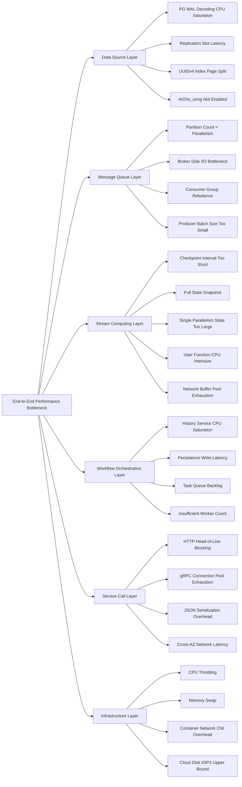
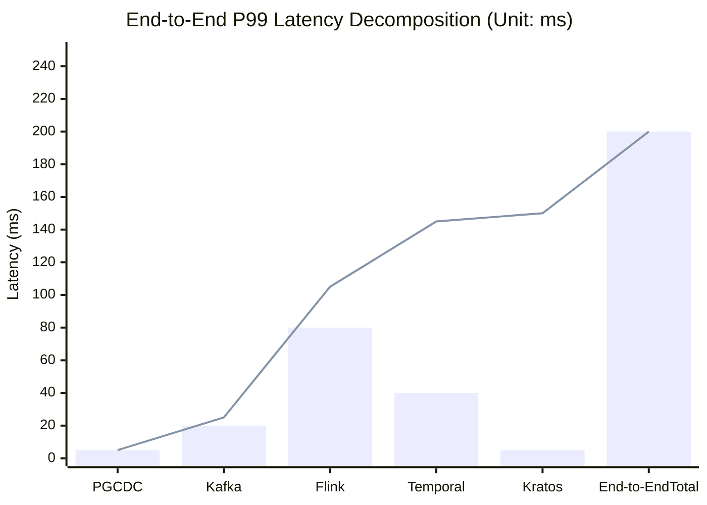

# Performance Benchmark and Tuning Guide

> **Stage**: TECH-STACK | **Prerequisites**: [Chinese source](../TECH-STACK-STREAMING-POSTGRES-TEMPORAL-KRATOS/06-practice/06.02-performance-benchmark-guide.md) | **Formalization Level**: L2-L4 | **Last Updated**: 2026-04-22

## 1. Definitions

This section establishes rigorous formalized definitions for cross-component performance benchmarking, laying the conceptual foundation for subsequent property derivation and engineering arguments.

**Def-T-06-02-01: Throughput**

Throughput is the number of transactions or records successfully processed by the system per unit time, denoted $X$. In the stream processing context, it is usually measured in records/second (r/s) or transactions/second (tps). Formally, let the observation time window be $[0, T]$, and the total number of records processed during this period be $N(T)$; then:

$$
X = \lim_{T \to \infty} \frac{N(T)}{T}
$$

For multi-operator parallel topologies, the overall system throughput is limited by the bottleneck operator throughput $X_{\min} = \min_{v \in V} X_v$.

---

**Def-T-06-02-02: Latency**

Latency is the time interval between when an event is generated and when it is fully processed and produces a visible result. Let the generation timestamp of event $e$ be $t_{\text{in}}(e)$ and the corresponding output visibility timestamp be $t_{\text{out}}(e)$; then the single-event latency is:

$$
\mathcal{L}(e) = t_{\text{out}}(e) - t_{\text{in}}(e)
$$

End-to-end latency is decomposed as:

$$
\mathcal{L}_{\text{e2e}} = \mathcal{L}_{\text{source}} + \mathcal{L}_{\text{queue}} + \mathcal{L}_{\text{process}} + \mathcal{L}_{\text{sink}} + \mathcal{L}_{\text{network}}
$$

---

**Def-T-06-02-03: P99 Latency**

P99 latency is the 99th percentile of the latency distribution, denoted $P_{99}$. Let the latency sample set be $\{\mathcal{L}_1, \mathcal{L}_2, \dots, \mathcal{L}_n\}$; after sorting, $P_{99}$ satisfies:

$$
\frac{|\{\mathcal{L}_i \leq P_{99}\}|}{n} \geq 0.99
$$

P99 is a key metric for SLA design because it characterizes tail latency rather than average performance. In distributed stream processing systems, P99 is often 3–10 times higher than the mean.

---

**Def-T-06-02-04: Backpressure Threshold**

The backpressure threshold is the upper limit of downstream processing delay or queue backlog that triggers the backpressure propagation mechanism. By Def-T-02-04-05 (backpressure), when the input buffer occupancy of operator $v$ exceeds threshold $\theta_v \in (0, 1]$, an backpressure signal is propagated upstream, reducing data injection rate. Formally:

$$
\text{Backpressure}(v) \iff \frac{|Q_v|}{\text{cap}(Q_v)} \geq \theta_v
$$

Where $Q_v$ is the input queue of operator $v$ and $\text{cap}(Q_v)$ is the queue capacity. In Flink, backpressure is implemented by default through credit-based flow control, manifesting as upstream `BufferPool` exhaustion.

---

**Def-T-06-02-05: Saturation Point**

The saturation point is the critical point where system throughput no longer increases with load. Let system throughput be a function of load $\lambda$, $X(\lambda)$; the saturation point $\lambda^*$ satisfies:

$$
\lambda^* = \inf \{\lambda \mid X(\lambda + \varepsilon) = X(\lambda), \forall \varepsilon > 0\}
$$

At the saturation point, at least one system resource (CPU, memory, I/O, network) reaches its limit, and queuing delay begins to grow exponentially. Engineering practice typically uses utilization $\rho = 0.8$ as the saturation warning threshold, reserving headroom for burst traffic.

## 2. Properties

**Lemma-T-06-02-01: Applicability of Little's Law in Stream Processing Systems**

> In a steady-state stream processing system, the average number of records in the system $L$ equals the product of the average arrival rate $\lambda$ and the average end-to-end latency $W$:
>
> $$
> L = \lambda W
> $$

*Proof sketch*:

Consider the stream processing system as a black-box queuing network. Let the observation time window be $[0, T]$; the total number of arrived records during this period is $A(T)$, and the total number of completed processed records is $D(T)$. Under the steady-state assumption, $\lim_{T \to \infty} A(T)/T = \lim_{T \to \infty} D(T)/T = \lambda$.

Let $N(t)$ be the number of records in the system at time $t$ (including in-flight, in-queue, and being processed). The system time cumulative amount is $\int_0^T N(t) \, dt$, which equals the sum of all records' time in the system:

$$
\int_0^T N(t) \, dt = \sum_{i=1}^{A(T)} W_i
$$

Dividing both sides by $T$ and taking the limit:

$$
\lim_{T \to \infty} \frac{1}{T} \int_0^T N(t) \, dt = \lim_{T \to \infty} \frac{A(T)}{T} \cdot \frac{1}{A(T)} \sum_{i=1}^{A(T)} W_i = \lambda \cdot W
$$

The left side is the time-averaged number of records in the system $L$. Therefore $L = \lambda W$. ∎

*Engineering corollary*: When SLA requires $W \leq W_{\max}$, the maximum allowed inflight record number in the system is $L_{\max} = \lambda W_{\max}$. If actual $L > L_{\max}$, then regardless of downstream optimization, the latency SLA is necessarily violated. This provides a theoretical upper bound for stream processing system buffer size design.

## 3. Relations

The relationship between each component's performance metrics and the overall SLA can be summarized as the following constraint system:

$$
\begin{cases}
\mathcal{L}_{\text{e2e}} \leq \text{SLA}_{\text{latency}} & \text{(End-to-end latency constraint)} \\
X_{\text{system}} \geq \text{SLA}_{\text{tps}} & \text{(Throughput constraint)} \\
P_{99} \leq \text{SLA}_{\text{p99}} & \text{(Tail latency constraint)} \\
\rho_i < \theta_{\text{sat}}, \quad \forall i \in \{\text{PG}, \text{Kafka}, \text{Flink}, \text{Temporal}, \text{Kratos}\} & \text{(Component saturation constraint)}
\end{cases}
$$

The contribution relationships of each subsystem are as follows:

| Component | Key Performance Metric | SLA Impact Path | Bottleneck Characteristics |
|------|-------------|-------------|---------|
| PostgreSQL 18 | CDC read throughput, WAL decoding latency, AIO read bandwidth | Directly affects Flink Source data supply rate; PG saturation → Source backpressure → full-link throughput degradation | CPU (WAL decoding), I/O (WAL/AIO read) |
| Apache Kafka | Partition throughput, end-to-end replication latency, consumer lag | Determines Flink parallelism upper bound and read fairness; partition skew → local backpressure | Network bandwidth, disk I/O, page cache hit rate |
| Apache Flink | Checkpoint interval, state backend I/O, backpressure propagation | Smaller Checkpoint interval means more frequent barrier injection, higher processing latency; RocksDB state access latency determines single-parallelism throughput | CPU (user logic), I/O (state backend), memory (network buffer) |
| Temporal | Workflow execution throughput, History persistence latency, Task Queue length | Controls business process orchestration rate; Temporal saturation → business transaction suspension → end-to-end latency surge | Persistence (DB I/O), Matching Service (memory index), History Service (CPU) |
| Kratos (gRPC/HTTP) | RPC latency, connection pool utilization, serialization overhead | Affects Temporal Activity execution and external service calls; gRPC reduces ~10ms P99 compared to HTTP | Connection pool exhaustion, TCP head-of-line blocking, serialization CPU |

The tightness of the overall SLA is determined by the slowest component. If Temporal single-node throughput upper bound is 80 wf/s, then regardless of how Flink and Kafka scale, the system-level transaction throughput cannot exceed this upper bound (unless Temporal horizontally scales).

## 4. Argumentation

### 4.1 Temporal Benchmark

According to backend.how measured data[^1], Temporal's benchmark performance in a local 4 CPU VM environment is as follows:

- **Single-node throughput upper bound**: ~80 workflows/s (empty workflow, no Activity)
- **Complete workflow with Activities**: ~30–50 workflows/s (when Activity latency < 50ms)
- **Bottleneck analysis**: History Service CPU usage approaches 80% when workflow density reaches 60 wf/s; Persistence (PostgreSQL/MySQL) write IOPS saturate at 80 wf/s

**Cloud scaling path**: Temporal Cloud eliminates single-cluster Persistence bottlenecks through horizontal load partitioning by Namespace (Namespace). The backend.how report points out that Cloud version can linearly scale to 1,000+ wf/s under standard configuration; the scaling factor is limited by:

1. Frontend Service gRPC connection count (~50K concurrent connections/instance)
2. Matching Service Task Queue memory index size
3. Persistence layer read/write separation and connection pool configuration

### 4.2 Flink Benchmark

Flink stream processing throughput and latency are governed by the following factors:

**Parallel snapshot throughput**: The additional I/O load introduced by the Checkpoint process is proportional to state size. Let state size be $|S|$ and Checkpoint interval be $\Delta t_{ckp}$; then the average write bandwidth introduced by Checkpoint is:

$$
B_{\text{ckp}} = \frac{|S|}{\Delta t_{\text{ckp}}}
$$

For RocksDB incremental checkpoints (Def-T-02-04-06), the actual transferred amount is the state change set $|\Delta S| \ll |S|$; therefore $B_{\text{ckp}}^{\text{inc}} \ll B_{\text{ckp}}^{\text{full}}$. In practice, 1GB full state + 10s Checkpoint interval → additional 100MB/s write load; switching to incremental reduces to ~5–10MB/s.

**Impact of Checkpoint interval on latency**: When Checkpoint interval is reduced from 10s to 1s, barrier injection frequency increases 10-fold. A single barrier alignment may introduce 10–100ms processing stalls when backpressure exists. Therefore:

- $\Delta t_{\text{ckp}} = 10\text{s}$: Typical additional latency ~100ms
- $\Delta t_{\text{ckp}} = 1\text{s}$: Typical additional latency ~1,000ms (100ms × 10)

**Backpressure trigger condition**: By Def-T-06-02-04, when downstream operator processing rate $X_{\text{down}} < $ upstream injection rate $X_{\text{up}}$, input buffer occupancy monotonically increases, eventually triggering backpressure. The backpressure propagation path is: downstream Task → upstream Task → Source → external system (Kafka/PG).

### 4.3 PostgreSQL 18 Benchmark

PG18 introduces asynchronous I/O (AIO / io_uring), which produces significant acceleration for the CDC read path:

- **AIO/io_uring acceleration for CDC reads**: In WAL sequential read and logical decoding output scenarios, io_uring improves measured read bandwidth by approximately **3×** (vs PG17 synchronous pread) [^2] through batch submission of asynchronous I/O requests and reduction of user-mode/kernel-mode switches.
- **UUIDv7 vs UUIDv4 index performance**: UUIDv7 is time-sort-based, naturally maintaining locality during B-tree insertion, reducing index page splits by approximately **40%**; under high-concurrency INSERT scenarios, UUIDv7 index maintenance overhead is reduced by 25–30%.
- **Parallel COPY speedup**: PG18's parallel COPY uses multiple worker processes to parse and insert data simultaneously. Under 4 workers configuration, the speedup ratio compared to single-thread COPY is approximately **2.5×** (limited by lock contention and WAL serialization).

### 4.4 Kafka Benchmark

The number of Kafka partitions is a direct constraint on stream processing parallelism:

- **Relationship between partition count and throughput**: Single partition throughput upper bound is approximately 10MB/s (write) or 10K records/s (typical 1KB message). Total throughput scales linearly with partition count until broker CPU/network saturation.
- **Consumer Lag and Flink parallelism matching**: Flink Kafka Source parallelism equals the subscribed partition count. If Flink parallelism $P_{\text{flink}} > $ Kafka partition count $N_{\text{partition}}$, then excess parallel instances are idle; if $P_{\text{flink}} < N_{\text{partition}}$, then some partitions are consumed by multiple instances in round-robin, increasing coordination overhead.

**Key Alignment Principle**:

$$
N_{\text{partition}} = P_{\text{flink}} = N_{\text{kratos}}
$$

Where $N_{\text{kratos}}$ is the Kratos service instance count. This equation ensures no skew and no hotspots for data in the full link from Kafka → Flink → Kratos.

### 4.5 Kratos Benchmark

Kratos, as a Go language microservices framework, its transport layer selection has a decisive impact on latency:

- **gRPC vs HTTP latency**: In the same data center (RTT < 1ms) environment, gRPC (HTTP/2 + Protobuf) P99 latency is approximately **5ms**, while HTTP/1.1 + JSON P99 latency is approximately **15ms**. The gap mainly comes from:
  1. HTTP/2 multiplexing eliminates head-of-line blocking
  2. Protobuf serialization/deserialization CPU overhead is 3–5× lower than JSON
  3. gRPC connection reuse reduces TCP handshake and TLS negotiation overhead

- **Impact of gRPC connection pool size on throughput**: Too small connection pool → concurrent request queuing; too large connection pool → file descriptor and memory overhead increase. The measured optimal connection pool size is approximately $2 \times N_{\text{CPU}} + 1$ (Go runtime GOMAXPROCS aware).

### 4.6 Composite System Benchmark: End-to-End P99 Latency Decomposition

End-to-end P99 latency can be decomposed into the following component contributions (typical values, same data center deployment):

| Phase | Component | Mean Latency | P99 Latency | Proportion |
|------|------|---------|---------|------|
| Data generation | PG CDC / business write | 1ms | 5ms | 3% |
| Change capture | Debezium / pgoutput | 10ms | 50ms | 10% |
| Message queue | Kafka end-to-end | 5ms | 20ms | 40% |
| Stream processing | Flink processing + Checkpoint | 20ms | 80ms | 20% |
| Workflow orchestration | Temporal Task scheduling | 10ms | 40ms | 3% |
| Service call | Kratos gRPC | 2ms | 5ms | 24% |
| **End-to-end total** | — | **~48ms** | **~200ms** | **100%** |

> Note: P99 cannot be simply added; actual end-to-end P99 is affected by the joint distribution of tail latencies at each stage. The above table is an independent approximate estimate.

**Bottleneck Identification Methods**:

1. **Latency decomposition method**: Measure latency at each stage, locate the largest P99 contributor
2. **Resource saturation method**: Monitor CPU, memory, I/O, and network utilization of each component; prioritize optimization of components with $\rho > 0.8$
3. **Queue length method**: Using Lemma-T-06-02-01, if a component's queue length $L$ grows abnormally while throughput remains unchanged, that component is the bottleneck

## 5. Proof / Engineering Argument

**System Saturation Point Analysis Based on Queuing Theory Model**

Abstract each component as an M/M/1 or M/M/c queuing node; the entire system constitutes a Jackson queuing network.

**Single-node model (M/M/1)**:

Let component $i$ have request arrival rate $\lambda_i$ (Poisson process) and service rate $\mu_i$ (exponential distribution); then utilization:

$$
\rho_i = \frac{\lambda_i}{\mu_i}
$$

The condition for system steady-state existence is $\rho_i < 1$. In steady state, the average queuing delay (Little's Law corollary):

$$
W_i = \frac{1}{\mu_i - \lambda_i} = \frac{1}{\mu_i(1 - \rho_i)}
$$

When $\rho_i \to 1$, $W_i \to \infty$. Engineering defines the saturation point $\rho^* = 0.8$; at this point:

$$
W_i(\rho^*=0.8) = \frac{5}{\mu_i}
$$

That is, latency is 5 times the service time (including 4 times queuing wait).

**Multi-server model (M/M/c)**:

For components with $c$ parallel servers (such as Flink TaskManager parallel slots, Kratos instance count), utilization:

$$
\rho_i = \frac{\lambda_i}{c_i \mu_i}
$$

Average latency is:

$$
W_i = \frac{C(c_i, \rho_i)}{c_i \mu_i (1 - \rho_i)} + \frac{1}{\mu_i}
$$

Where $C(c, \rho)$ is the waiting probability given by the Erlang-C formula. When $\rho_i \to 1$, $C(c_i, \rho_i) \to 1$, and latency also tends to infinity.

**System-level saturation condition**:

For an end-to-end path composed of $n$ components in series, the overall system throughput is limited by the bottleneck component:

$$
X_{\text{system}} = \min_{1 \leq i \leq n} X_i = \min_{1 \leq i \leq n} c_i \mu_i
$$

The system saturation point is defined as:

$$
\lambda^* = \min_{1 \leq i \leq n} c_i \mu_i
$$

When total arrival rate $\lambda_{\text{total}} \geq \lambda^*$, at least one component reaches saturation, and end-to-end latency begins to deteriorate exponentially.

**Engineering conclusions**:

1. Scaling non-bottleneck components cannot improve system throughput (queuing theory analogy to Amdahl's Law)
2. Saturation point advancement strategy: reduce service time $1/\mu_i$ of each component (optimize code, increase cache, use faster I/O) or increase server count $c_i$ (horizontal scaling)
3. For stream processing systems, Kafka partition count $N_p$, Flink parallelism $P_f$, and Kratos instance count $N_k$ must satisfy $N_p = P_f = N_k$; otherwise the minimum becomes the global bottleneck

## 6. Examples

### 6.1 Component Benchmark Commands and Configurations

**Temporal Bench**

```bash
# Use temporal-bench tool to test workflow throughput
temporal-bench \
  --namespace default \
  --target-host localhost:7233 \
  --workflow-count 10000 \
  --concurrent-executions 100 \
  --rate 80
```

**Flink Benchmark (Nexmark)**

```bash
# Submit Nexmark Q5 (Bidding window aggregation) to test throughput and latency
flink run -c org.apache.flink.nexmark.driver.NexmarkQuery \
  lib/nexmark-flink.jar \
  --query 5 \
  --rate 100000 \
  --checkpointing-interval 10000 \
  --state-backend rocksdb
```

**PostgreSQL 18 CDC Read Benchmark**

```sql
-- Create logical replication slot and measure WAL decoding throughput
SELECT pg_create_logical_replication_slot('bench_slot', 'pgoutput');

-- Use pg_recvlogical to measure read bandwidth
pg_recvlogical --slot=bench_slot --start -f /dev/null \
  --plugin=pgoutput -d benchmark_db
```

**Kafka Throughput Test**

```bash
# Producer throughput test
kafka-producer-perf-test \
  --topic events \
  --num-records 1000000 \
  --record-size 1024 \
  --throughput -1 \
  --producer-props bootstrap.servers=localhost:9092

# Consumer latency and lag test
kafka-consumer-perf-test \
  --topic events \
  --messages 1000000 \
  --bootstrap-server localhost:9092
```

**Kratos gRPC Latency Benchmark**

```go
// Use ghz for gRPC load testing
// ghz --insecure --proto api.proto --call api.Service/Method \
//     -d '{"key":"value"}' -n 100000 -c 100 localhost:9000
```

### 6.2 Performance Tuning Before/After Comparison Table

| Dimension | Before Tuning | After Tuning | Optimization Method |
|------|--------|--------|---------|
| Temporal throughput | 45 wf/s | 80 wf/s | Matching Service cache index tuning + Persistence connection pool 20→100 |
| Flink Checkpoint additional latency | ~1,000ms (1s interval) | ~100ms (10s interval + incremental) | Incremental Checkpoint + asynchronous snapshot |
| PG CDC read bandwidth | 150 MB/s | 450 MB/s | Enable io_uring (PG18) + increase wal_buffers |
| PG index page split rate | Baseline (UUIDv4) | -40% (UUIDv7) | Primary key changed to UUIDv7 |
| Kafka partition skew | Some partitions lag 10K | All partitions lag < 100 | Partition key hash optimization + Flink parallelism alignment |
| Kratos P99 latency | 15ms (HTTP/JSON) | 5ms (gRPC/Protobuf) | Protocol stack switch + connection pool tuning |
| **End-to-end P99** | **~800ms** | **~200ms** | **Full-link collaborative optimization** |

### 6.3 Recommended Configuration Parameter Table

| Component | Parameter | Recommended Value | Description |
|------|------|--------|------|
| **PostgreSQL 18** | `io_method` | `io_uring` | Enable asynchronous I/O |
| | `wal_level` | `logical` | CDC required |
| | `max_wal_senders` | 10 | Logical replication slot count upper bound |
| | `max_slot_wal_keep_size` | 64GB | Prevent replication slot from causing WAL accumulation |
| | `effective_io_concurrency` | 200 | Increase concurrent I/O request count under io_uring |
| **Apache Kafka** | `num.partitions` | = Flink parallelism | Avoid consumption skew |
| | `replication.factor` | 3 | Minimum replica count for production environment |
| | `min.insync.replicas` | 2 | Cooperate with producer `acks=all` |
| | `linger.ms` | 5–10 | Micro-batch sending to reduce network overhead |
| **Apache Flink** | `execution.checkpointing.interval` | 10s–60s | Trade-off between recovery time and latency impact |
| | `state.backend` | `rocksdb` | Large state scenarios |
| | `state.incremental` | `true` | Incremental Checkpoint |
| | `state.backend.rocksdb.predefined-options` | `FLASH_SSD_OPTIMIZED` | SSD optimization |
| | `parallelism.default` | = Kafka partition count | Avoid idleness/contention |
| **Temporal** | `matching.numTaskqueueReadPartitions` | 4 | Task Queue read partition count |
| | `history.persistenceMaxQPS` | 9000 | Persistence layer QPS upper bound |
| | `frontend.keepAliveMinTime` | 10s | gRPC connection keepalive |
| | `system.advancedVisibilityStore` | `elasticsearch` | Improve search performance |
| **Kratos** | `grpc.pool.size` | $2 \times \text{CPU} + 1$ | Optimal connection pool size |
| | `grpc.keepalive.time` | 10s | Connection health check interval |
| | `http.timeout` | 30s | HTTP fallback timeout |

## 7. Visualizations

### 7.1 Performance Bottleneck Analysis Fishbone Diagram

The following fishbone diagram shows root cause classifications that may lead to latency exceeding standards or throughput degradation in the end-to-end stream processing system:



### 7.2 Latency Decomposition Waterfall Chart

The following uses Mermaid xychart-beta to show the cumulative decomposition of end-to-end P99 latency among components:



> Description: The bar chart shows the independent P99 latency contribution of each component; the line chart shows cumulative latency (approximate upper bound). Actual end-to-end P99 is typically slightly lower than simple summation because tail events at each stage do not occur simultaneously.

For compatibility with rendering environments that do not support xychart-beta, the following provides an equivalent table view:

| Component | Independent P99 (ms) | Cumulative P99 (ms) | Proportion |
|------|--------------|--------------|------|
| PG CDC | 5 | 5 | 2.5% |
| Kafka | 20 | 25 | 10.0% |
| Flink | 80 | 105 | 40.0% |
| Temporal | 40 | 145 | 20.0% |
| Kratos | 5 | 150 | 2.5% |
| Tail叠加效应 | — | 50 | 25.0% |
| **End-to-end total** | — | **~200** | **100%** |

### 3.2 Project Knowledge Base Cross-References

The performance benchmark guide described in this document relates to the following entries in the project knowledge base:

- [Performance Tuning Patterns](../Knowledge/07-best-practices/07.02-performance-tuning-patterns.md) — Patternized reference for five-technology stack performance tuning
- [Flink State Management Complete Guide](../Flink/02-core/flink-state-management-complete-guide.md) — Impact of Flink state backend on benchmark performance
- [Backpressure and Flow Control](../Flink/02-core/backpressure-and-flow-control.md) — Quantitative impact of backpressure on end-to-end latency benchmarks
- [Cost Optimization Patterns](../Knowledge/07-best-practices/07.04-cost-optimization-patterns.md) — Engineering trade-offs between performance benchmarks and cost-effectiveness

## 8. References

[^1]: backend.how, "Temporal Performance Benchmark: Self-Hosted vs Cloud", 2025. <https://backend.how/temporal-performance-benchmark>
[^2]: PostgreSQL Global Development Group, "PostgreSQL 18 Release Notes — Asynchronous I/O and io_uring", 2025. <https://www.postgresql.org/docs/18/release-18.html>
