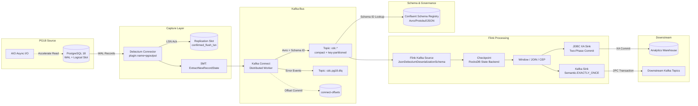
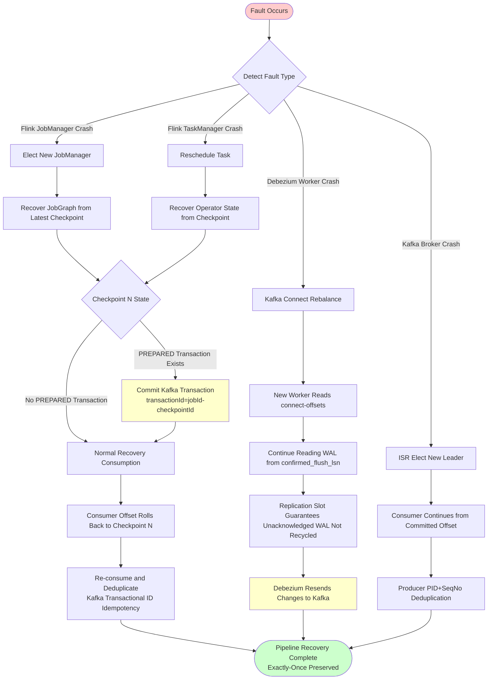

# PG18 → Debezium → Kafka → Flink Real-Time Pipeline Integration

> **Stage**: TECH-STACK | **Prerequisites**: [Chinese source](../TECH-STACK-STREAMING-POSTGRES-TEMPORAL-KRATOS/03-integration/03.01-pg18-cdc-kafka-flink-pipeline.md) | **Formalization Level**: L3-L4 | **Last Updated**: 2026-04-22

## 1. Definitions

**Def-TS-03-01-01 (CDC Pipeline)**

Let the source database state sequence be \( \{ D_t \}_{t \geq 0} \). A **CDC Pipeline** is a quadruple:

\[
\mathcal{P} = \langle \text{Source}, \text{Capture}, \text{Bus}, \text{Process} \rangle
\]

where Source is the PG18 instance; Capture is the Debezium Connector, reading WAL and outputting structured change events; Bus is the Kafka message bus; Process is the Flink stream processing engine. The pipeline function is a composite mapping:

\[
\Phi_{\mathcal{P}} : D_t \xrightarrow{C} \mathcal{E}_{\text{debezium}} \xrightarrow{K} \mathcal{E}_{\text{kafka}} \xrightarrow{F} \mathcal{O}_{\text{flink}}
\]

Each event carries change type \( \text{op} \in \{ c, u, d, r \} \), LSN, and transaction ID.

**Def-TS-03-01-02 (Schema Evolution)**

Let table \( T \)'s schema at \( t_1 \) be \( \text{Schema}(T, t_1) \), and at \( t_2 > t_1 \) be \( \text{Schema}(T, t_2) \). **Schema Evolution** is the process where the schema sequence evolves over time while satisfying compatibility:

\[
\forall t_1 < t_2, \forall r \in \text{Rows}(T, t_1): \text{deserialize}(\text{Schema}(T, t_2), \text{serialize}(\text{Schema}(T, t_1), r)) \neq \bot
\]

When using Avro with Confluent Schema Registry, compatibility is managed through schema version management[^1].

**Def-TS-03-01-03 (Initial Snapshot)**

**Initial Snapshot** is a consistent read of all existing data in the source database when the CDC pipeline starts, producing an initial state event set:

\[
\mathcal{E}_0 = \{ e_i \mid e_i.\text{op} = 'r' \land e_i.\text{after} \in D_{t_s} \land e_i.\text{lsn} = \text{snapshot_lsn} \}
\]

where `snapshot_lsn` is the anchor obtained via `pg_current_wal_lsn()` at snapshot start. After snapshot completion, the pipeline switches to incremental stream mode, processing WAL records with \( \text{LSN} > \text{snapshot_lsn} \).

**Def-TS-03-01-04 (Incremental Stream)**

**Incremental Stream** is the continuous real-time read stream of PG18 WAL after Initial Snapshot completes. Let the WAL record sequence be \( \{ w_k \}_{k > k_0} \), where \( k_0 \) corresponds to snapshot_lsn. The incremental stream event set is:

\[
\mathcal{E}_{\Delta} = \{ e_k \mid e_k = C(w_k) \land w_k.\text{lsn} > \text{snapshot_lsn} \}
\]

The incremental stream guarantees: events within the same partition/table are strictly monotonically increasing by LSN; changes of committed transactions appear as atomic units; breakpoint resume is achieved through the acknowledged consumption LSN.

**Def-TS-03-01-05 (Dead Letter Queue, DLQ)**

**DLQ** is a fault-tolerance mechanism in the CDC pipeline that isolates unprocessable events:

\[
\text{DLQ} = \{ e \mid e \in \mathcal{E}_{\text{in}} \land \text{process}(e) = \bot \land \text{retries} \geq \text{max_retries} \}
\]

In Kafka Connect, it is enabled via `errors.tolerance=all` and `errors.deadletterqueue.topic.name`; unprocessable events are routed to an independent Kafka topic, avoiding blocking the main consumption flow.

---

## 2. Properties

**Lemma-TS-03-01-01 (Pipeline Data Consistency)**

If the following are satisfied: (1) PG18 WAL persistence; (2) Debezium parses WAL in monotonically increasing LSN order; (3) Kafka maps the same key to a fixed partition, guaranteeing intra-partition ordering. Then the pipeline satisfies **source-sink order consistency**:

\[
\forall e_i, e_j \in \mathcal{E}_{\Delta}: e_i.\text{lsn} < e_j.\text{lsn} \implies \text{consume}(e_i) <_{\text{time}} \text{consume}(e_j)
\]

_Proof Sketch_: PG18 WAL's LSN is globally monotonically increasing. Debezium maintains the consumption position via replication slot and reads in order. Kafka partition ordering guarantees write order equals consumption order. By transitivity, source LSN order is fully propagated to the Flink consumer side. ∎

**Lemma-TS-03-01-02 (End-to-End Exactly-Once Necessary Conditions)**

End-to-end Exactly-Once requires that for any source change event \( e \), the Flink sink produces the corresponding side effect exactly once. The necessary conditions are:

1. **Source Replayable**: Replication slot retains WAL until Debezium acknowledges consumption (`confirmed_flush_lsn` advances);
2. **Transport Persistence**: Kafka `acks=all`, `min.insync.replicas >= 2`;
3. **Processing Determinism**: Flink operators have no external non-deterministic input; state is persisted via Checkpoint;
4. **Sink Idempotent or Transactional**: Supports two-phase commit (2PC) or idempotent writing based on primary key.

**Prop-TS-03-01-01 (Snapshot-Stream Handoff Consistency)**

Let Initial Snapshot obtain a consistent view at LSN \( L_s \), and the incremental stream starts from \( L_s + 1 \). If Debezium buffers changes in the interval \([L_s, L_{\text{switch}}]\) during snapshot, then at the switch moment:

\[
\mathcal{E}_0 \cup \mathcal{E}_{\Delta} \equiv D_{t_{\text{switch}}} \setminus D_{t_0}
\]

That is, the lossless union of snapshot and incremental stream equals all database changes from startup to the switch moment, guaranteeing no data gaps and no duplication.

---

## 3. Relations

### 3.1 Debezium and PG18 Replication Slot

Debezium establishes a 1:1 persistent session with PG18 through logical decoding and replication slot: the Connector reads `pgoutput`-produced logical changes via `pg_logical_slot_get_changes()`; periodically writes the processed maximum LSN back to the replication slot's `confirmed_flush_lsn`; PG18 only recycles older WAL after LSN advances. PG18 AIO reduces `pgoutput` read latency, improving large-scale snapshot throughput by approximately 15–30%[^2].

### 3.2 Debezium and Kafka Connect

Debezium runs as a Kafka Connect **Source Connector** in **Distributed Mode**: the Worker group shares state through three internal topics — `connect-configs`, `connect-offsets`, `connect-status`; tasks are automatically rebalanced upon failure. Debezium's consumption position (LSN) is written to the `connect-offsets` topic; Workers recover from the latest offset after restart; Kafka topics are automatically created by default according to `{server}.{database}.{schema}.{table}`.

### 3.3 Kafka and Flink CDC Connector

Flink consumes Debezium Envelopes through Kafka Source: in SQL, use `format = 'debezium-json'` for automatic parsing; in DataStream API, use `JsonDebeziumDeserializationSchema` to convert messages to `RowData`. Flink Checkpoint barriers are bound to Kafka consumer offsets; offsets are materialized when Checkpoint succeeds; the Consumer only commits offsets after Checkpoint completion, guaranteeing exactly-once semantics.

---

## 4. Argumentation

### 4.1 Pipeline Architecture

**Data Flow Path**: PG18 WAL → `pgoutput` logical decoding → Debezium captures and wraps as Envelope → Kafka Connect Distributed Worker batch-writes to Kafka → Flink Source consumes in partition order → Flink Processing (window/JOIN/CEP) → Kafka Sink (2PC) or JDBC XA Sink output. Message Key is the table primary key, ensuring changes to the same entity enter the same partition.

### 4.2 Data Consistency Guarantee at Integration Boundary

**Snapshot + Stream Handoff** is the most error-prone boundary of the CDC pipeline:

- **Initial Mode**: First executes `SELECT *` snapshot, then switches to WAL incremental stream. New changes during snapshot are buffered and appended in order after switching;
- **Exported Mode**: Uses `pg_export_snapshot()` to obtain a consistent snapshot ID, guaranteeing no phantom reads between snapshot read and stream read.

Consistency guarantee mechanisms: (1) At snapshot start, record `pg_current_wal_lsn()` as \( L_s \); after completion, request all changes with \( \text{LSN} > L_s \); (2) Changes from the same transaction are packaged via transaction metadata, allowing Flink to implement transaction-level consistency; (3) Flink generates Watermarks based on Debezium's `ts_ms`, handling out-of-order and delayed data.

### 4.3 Schema Evolution Handling Strategies

**Strategy 1: Avro + Confluent Schema Registry**

After PG18 DDL changes are detected by Debezium, the new schema v(N+1) is registered in the Registry. Kafka messages only carry schema ID; Consumers retrieve the corresponding schema from the Registry for deserialization.

| Change Type | Backward | Forward | Full |
|-------------|----------|---------|------|
| ADD COLUMN (nullable) | ✓ | ✓ | ✓ |
| ADD COLUMN (default) | ✓ | ✗ | ✗ |
| DROP COLUMN | ✗ | ✓ | ✗ |
| RENAME COLUMN | ✗ | ✗ | ✗ |
| TYPE WIDENING | ✓ | ✗ | ✗ |

Production recommendation: Set Registry compatibility policy to `BACKWARD` or `BACKWARD_TRANSITIVE`.

**Strategy 2: Single Message Transform (SMT)**

Through `ExtractNewRecordState`, strip the Debezium Envelope, retaining only the `after` state; combined with `AddFields` to inject operation type and LSN, simplifying downstream Flink parsing.

### 4.4 Composite Resilience Design

**Kafka DLQ**: Configure `errors.tolerance=all` and `errors.deadletterqueue.topic.name=pg18.cdc.dlq`; events with serialization failure, schema incompatibility, or SMT exceptions are routed to an independent topic, preserving original headers for troubleshooting and supporting backfill after repair.

**Flink Checkpoint and PG Replication Slot LSN Coordination**: Checkpoint interval recommended 10s–60s; barriers align operator states; Flink Kafka Consumer offset commit is bound to Checkpoint; after Checkpoint \( n \) succeeds, the offset is marked as safe; Debezium `heartbeat.interval.ms` ensures `confirmed_flush_lsn` is periodically advanced even when no data changes occur, preventing unlimited WAL growth.

**Failover Recovery**:

- Debezium Worker crash → Kafka Connect rebalances, recovers LSN from `connect-offsets`;
- Kafka Broker crash → ISR elects new leader, Consumer continues from committed offset;
- Flink TaskManager crash → Recovers state from Checkpoint (Exactly-once);
- Flink JobManager crash → HA mode recovers JobGraph (Exactly-once);
- PG18 primary-replica switch → Debezium reconnects to new primary via replication slot name.

### 4.5 PG18 AIO Acceleration of Debezium Read Performance

PG18 AIO improves Debezium in two aspects: (1) **Snapshot Phase**: Large-scale `SELECT *` pre-commit batch I/O reduces synchronous `pread` overhead, improving throughput by 20–40% on NVMe SSD; (2) **WAL Read Phase**: `io_uring` backend reduces latency jitter, enabling Debezium to keep up with higher WAL generation rates. Configuration key points: compile with `--with-liburing`, set `io_method = async`.

---

## 5. Proof / Engineering Argument

**Thm-TS-03-01-01 (End-to-End Exactly-Once Sufficient Conditions)**

Let CDC pipeline \( \mathcal{P} = \langle \text{PG18}, \text{Debezium}, \text{Kafka}, \text{Flink}, \text{Sink} \rangle \). If the following four groups of conditions are satisfied, then \( \mathcal{P} \) achieves end-to-end Exactly-Once:

**C1 (Source Replayable)**: PG18 replication slot `restart_lsn` and `confirmed_flush_lsn` are persistent; `wal_level = logical` and `max_slot_wal_keep_size` is sufficient, guaranteeing WAL is not prematurely recycled during Debezium recovery.

**C2 (Transport Exactly-Once Write)**: Kafka Producer `enable.idempotence=true`, `acks=all`, `retries=Integer.MAX_VALUE`; Topic `min.insync.replicas >= 2`.

**C3 (Processing State Consistency)**: Flink enables Checkpointing, state backend is RocksDB or incremental HDFS; Checkpoint mode `EXACTLY_ONCE`; operator state serialization is invariant.

**C4 (Sink Two-Phase Commit or Idempotent)**:

- **Kafka Sink**: `Semantic.EXACTLY_ONCE`, 2PC coordinates Kafka transaction with Flink Checkpoint; transaction IDs are named by `jobId-checkpointId`;
- **JDBC Sink**: XA transaction, `commit()` called at Checkpoint completion phase, `rollback()` called on Checkpoint failure;
- **Idempotent Sink**: `UPSERT` semantics based on business primary key.

**Proof** (by fault scenario case analysis):

_Scenario 1: Flink crashes between Checkpoint \( n \) and \( n+1 \)._ Flink recovers from Checkpoint \( n \), Kafka Consumer offset rolls back to \( n \). Kafka-confirmed messages are not lost; un-checkpointed messages are re-consumed. Operator state recovers to \( n \), processing is deterministic. At Sink side 2PC, already `PREPARED` transactions are committed after recovery; not `PREPARED` are rolled back. Transaction ID is bound to Checkpoint ID; Kafka transaction deduplication guarantees no duplicate writes.

_Scenario 2: Kafka Broker crashes after message write._ Producer idempotency (PID + Sequence Number) causes duplicate sends to be deduplicated by the broker. ISR mechanism guarantees committed messages are not lost after leader switch. Flink Consumer recovers from last committed offset, which corresponds to the moment of Checkpoint success, not losing checkpointed messages.

_Scenario 3: Debezium Worker crashes._ Kafka Connect Distributed reallocates the Task to a surviving Worker, reads LSN from `connect-offsets`, and continues reading PG18 WAL from `restart_lsn`. The replication slot retains unacknowledged WAL; changes are resent after recovery. Kafka-side idempotent Producer and Flink-side transactional/idempotent Sink jointly guarantee end-to-end no duplication.

In summary, C1–C4 are sufficient conditions for \( \mathcal{P} \) end-to-end Exactly-Once. ∎

---

## 6. Examples

### 6.1 Debezium Connector JSON Configuration

```json
{
  "name": "pg18-inventory-connector",
  "config": {
    "connector.class": "io.debezium.connector.postgresql.PostgresConnector",
    "tasks.max": "1",
    "database.hostname": "pg18-primary.internal",
    "database.port": "5432",
    "database.user": "debezium",
    "database.password": "${secrets:debezium:db_password}",
    "database.dbname": "inventory",
    "database.server.name": "pg18",
    "plugin.name": "pgoutput",
    "slot.name": "debezium_slot_01",
    "publication.name": "dbz_publication",
    "snapshot.mode": "initial",
    "snapshot.isolation.mode": "repeatable_read",
    "tombstones.on.delete": "true",
    "decimal.handling.mode": "string",
    "heartbeat.interval.ms": "10000",
    "heartbeat.action.query": "INSERT INTO debezium_heartbeat (id, ts) VALUES (1, NOW()) ON CONFLICT (id) DO UPDATE SET ts=EXCLUDED.ts;",
    "table.include.list": "public.orders,public.customers",
    "transforms": "unwrap",
    "transforms.unwrap.type": "io.debezium.transforms.ExtractNewRecordState",
    "transforms.unwrap.drop.tombstones": "false",
    "transforms.unwrap.delete.handling.mode": "rewrite",
    "key.converter": "io.confluent.connect.avro.AvroConverter",
    "key.converter.schema.registry.url": "http://schema-registry:8081",
    "value.converter": "io.confluent.connect.avro.AvroConverter",
    "value.converter.schema.registry.url": "http://schema-registry:8081",
    "errors.tolerance": "all",
    "errors.deadletterqueue.topic.name": "cdc.pg18.dlq",
    "errors.deadletterqueue.context.headers.enable": "true"
  }
}
```

`plugin.name=pgoutput` uses PG built-in logical decoding; `heartbeat.action.query` forcibly advances `confirmed_flush_lsn` for low-frequency change tables; `ExtractNewRecordState` outputs flattened records to simplify downstream consumption.

### 6.2 Flink CDC SQL Definition

```sql
CREATE TABLE orders_cdc (
  id BIGINT,
  customer_id BIGINT,
  order_date TIMESTAMP_LTZ(3),
  total_amount DECIMAL(18, 2),
  status STRING,
  __op STRING METADATA FROM 'value.op' VIRTUAL,
  __ts_ms TIMESTAMP_LTZ(3) METADATA FROM 'value.source.ts_ms' VIRTUAL,
  WATERMARK FOR order_date AS order_date - INTERVAL '5' SECOND,
  PRIMARY KEY (id) NOT ENFORCED
) WITH (
  'connector' = 'kafka',
  'topic' = 'cdc.pg18.inventory.public.orders',
  'properties.bootstrap.servers' = 'kafka-1:9092,kafka-2:9092,kafka-3:9092',
  'properties.group.id' = 'flink-pg18-orders-consumer',
  'properties.isolation.level' = 'read_committed',
  'scan.startup.mode' = 'group-offsets',
  'format' = 'debezium-json'
);

CREATE TABLE orders_analytics (
  id BIGINT,
  customer_id BIGINT,
  order_date TIMESTAMP_LTZ(3),
  total_amount DECIMAL(18, 2),
  status STRING,
  last_updated TIMESTAMP_LTZ(3),
  PRIMARY KEY (id) NOT ENFORCED
) WITH (
  'connector' = 'jdbc',
  'url' = 'jdbc:postgresql://analytics-pg:5432/warehouse',
  'table-name' = 'orders_analytics',
  'username' = 'flink',
  'driver' = 'org.postgresql.Driver'
);

INSERT INTO orders_analytics
SELECT id, customer_id, order_date, total_amount, status,
       COALESCE(__ts_ms, CURRENT_TIMESTAMP) AS last_updated
FROM orders_cdc
WHERE __op IN ('c', 'u', 'r');
```

### 6.3 Kafka Topic Partition Strategy

```bash
kafka-topics.sh --create \
  --topic cdc.pg18.inventory.public.orders \
  --partitions 8 \
  --replication-factor 3 \
  --config cleanup.policy=compact \
  --config min.insync.replicas=2 \
  --bootstrap-server kafka-1:9092

kafka-topics.sh --create \
  --topic cdc.pg18.dlq \
  --partitions 4 \
  --replication-factor 3 \
  --config retention.ms=604800000 \
  --bootstrap-server kafka-1:9092
```

Debezium uses the table primary key as the message key, ensuring changes to the same entity enter the same partition; changelog topics enable `compact` policy to retain the latest value per key, supporting Flink `upsert-kafka` connector; partition count recommended ≥ Flink parallelism.

---

## 7. Visualizations

### 7.1 End-to-End Pipeline Architecture



### 7.2 Fault Recovery Flow



---

### 3.4 Project Knowledge Base Cross-References

The CDC pipeline integration described in this document relates to the existing project knowledge base as follows:

- [Flink CDC Debezium Integration Guide](../Flink/05-ecosystem/05.01-connectors/04.04-cdc-debezium-integration.md) — In-depth configuration of Debezium as the CDC capture layer
- [Flink CDC 3.0 Data Integration](../Flink/05-ecosystem/05.01-connectors/flink-cdc-3.0-data-integration.md) — End-to-end data integration framework for CDC pipelines
- [End-to-End Exactly-Once](../Flink/02-core/exactly-once-end-to-end.md) — Complete argument for end-to-end consistency of CDC pipelines
- [Checkpoint Mechanism Deep Dive](../Flink/02-core/checkpoint-mechanism-deep-dive.md) — Implementation of Flink Checkpoint coupled with Kafka Offset transactional semantics

---

## 8. References

[^1]: Debezium Documentation, "PostgreSQL Connector", 2025. <https://debezium.io/documentation/reference/stable/connectors/postgresql.html>
[^2]: Apache Flink Documentation, "Kafka Connector", "Exactly-Once Semantics", 2025. <https://nightlies.apache.org/flink/flink-docs-stable/docs/connectors/datastream/kafka/>
