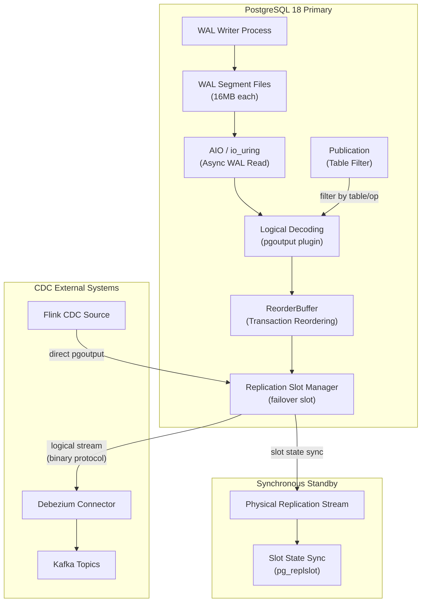
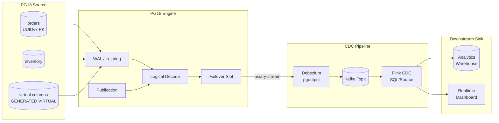

# PostgreSQL 18 CDC and Logical Replication Deep Dive

> **Stage**: TECH-STACK | **Prerequisites**: [Chinese source](../TECH-STACK-STREAMING-POSTGRES-TEMPORAL-KRATOS/02-component-deep-dive/02.01-postgresql-18-cdc-deep-dive.md) | **Formalization Level**: L4 | **Last Updated**: 2026-04-22

## 1. Definitions

**Def-T-02-01: Logical Replication**

Logical replication is a replication mechanism in PostgreSQL based on logical decoding (Logical Decoding). It parses change records in the Write-Ahead Log (WAL) and converts them into database logical operations (`INSERT`, `UPDATE`, `DELETE`), then propagates the change stream to downstream nodes or external systems through a publish/subscribe (Publication/Subscription) model.

The core difference from physical replication is: logical replication transmits **logical tuple changes** rather than **physical page mirrors**, thus supporting heterogeneous replication scenarios across platforms, versions, and architectures, and can also serve as the underlying data source for Change Data Capture (CDC).

Formally, let the database state sequence be $S_0, S_1, \dots, S_n$, and the WAL sequence be $W = \langle w_1, w_2, \dots, w_n \rangle$, where each $w_i$ is the set of WAL records produced by transaction $T_i$. The logical decoding function $\mathcal{D}$ maps physical WAL to a logical change stream:

$$
\mathcal{D}: W \to \mathcal{C} = \langle c_1, c_2, \dots, c_m \rangle
$$

where $c_j \in \{\text{INSERT}(r), \text{UPDATE}(r, r'), \text{DELETE}(r)\}$, and $r$ represents a relation tuple.

---

**Def-T-02-02: Logical Decoding**

Logical decoding is a WAL consumption interface provided by PostgreSQL, allowing external processes to deserialize binary WAL records into readable logical change events through output plugins (Output Plugin). PG's built-in decoding plugins include `pgoutput` (native logical replication protocol), `test_decoding` (for debugging), and community plugins such as `wal2json`.

Let the output plugin be $\mathcal{P}$; then the complete logical decoding process can be formalized as:

$$
\text{LogicalDecoding}(\text{slot}, \mathcal{P}) = \mathcal{P}(\mathcal{D}(W[\text{slot.lsn} \dots \text{current_lsn}]))
$$

where `slot.lsn` is the LSN confirmed as consumed by the replication slot, determining the decoding start position.

---

**Def-T-02-03: Write-Ahead Log (WAL)**

WAL is the core mechanism in PostgreSQL guaranteeing crash recovery and replication consistency. All data modification operations must be sequentially written to WAL files before being written to shared buffers. WAL is organized in fixed-size segment files (default 16MB), and each record is associated with a unique Log Sequence Number (LSN), defined as:

$$
\text{LSN} = (\text{segment_id}, \text{page_offset}, \text{record_offset})
$$

WAL logically constitutes a **strict total order** log stream: for any two records $w_i$ and $w_j$, if $i < j$, then $\text{LSN}(w_i) < \text{LSN}(w_j)$.

---

**Def-T-02-04: Replication Slot**

A replication slot is a persistent cursor established on the WAL consumption side in PostgreSQL, used to track the log position confirmed by downstream consumers and prevent WAL segments from being cleaned before being consumed. Replication slots are divided into two categories:

- **Physical Replication Slot**: Used for streaming physical replication, tracking byte-level WAL offsets.
- **Logical Replication Slot**: Used for logical decoding, additionally maintaining transaction snapshots and output plugin states.

Let the logical replication slot be $\sigma = \langle \text{name}, \text{plugin}, \text{confirmed_lsn}, \text{restart_lsn} \rangle$, where $\text{confirmed_lsn}$ is the progress explicitly confirmed by the consumer, and $\text{restart_lsn}$ is the minimum LSN from which decoding can safely restart.

PG18 introduces the **failover slot** mechanism, which synchronizes replication slot state to persistent storage on physical standby databases, enabling seamless recovery of logical replication slots on promoted nodes after primary database failover.

---

**Def-T-02-05: Publication**

A publication is a database object in logical replication used to define the **change capture scope**. A publication can bind one or more tables, and finely control the types of captured events (`INSERT`, `UPDATE`, `DELETE`, `TRUNCATE`). The publication can be formalized as:

$$
\text{Publication} = \langle \text{name}, \{T_1, T_2, \dots, T_k\}, \{e_1, e_2, \dots, e_m\}, \text{publish_via_partition_root} \rangle
$$

where $T_i$ are target relations and $e_j \in \{\text{INSERT}, \text{UPDATE}, \text{DELETE}, \text{TRUNCATE}\}$. During logical decoding, only changes within the scope of some publication are output to downstream.

---

**Def-T-02-06: PG18 Virtual Generated Column**

The virtual generated column introduced in PG18 is a **derived column that occupies no physical storage**, whose value is declared through `GENERATED ALWAYS AS (expression) VIRTUAL` and computed at read time. The association between virtual generated columns and CDC is: logical decoding can include them in change events, so downstream systems do not need to repeat derived logic while avoiding storage layer bloat.

Formally, let the base table be $R(A_1, A_2, \dots, A_n)$, and the virtual generated column be $A_v = f(A_{i_1}, \dots, A_{i_k})$; then the event output by logical decoding is:

$$
\text{INSERT}(R) \to (A_1 = v_1, \dots, A_n = v_n, A_v = f(v_{i_1}, \dots, v_{i_k}))
$$

---

**Def-T-02-07: PG18 Async I/O (AIO / io_uring)**

PG18 introduces an asynchronous I/O framework based on Linux `io_uring`, used for non-blocking reading of WAL files and table heap data. Traditional synchronous reads are limited by the context switching overhead of `read()` system calls in WAL scanning scenarios; `io_uring` batches I/O operations through submission-completion queues (Submission/Completion Queue), significantly reducing kernel round-trip latency.

Let synchronous read latency be $t_{sync}$, `io_uring` batch submission latency be $t_{async}$, and batch size be $b$; then the speedup upper bound is:

$$
\eta = \frac{b \cdot t_{sync}}{t_{async}} \le 3 \quad \text{(PG18 measured peak)}
$$

---

## 2. Properties

**Lemma-T-02-01: WAL Monotonicity**

For any database execution trace, the LSN sequence of WAL constitutes a strictly monotonically increasing sequence:

$$
\forall i, j \in \mathbb{N}^+: i < j \implies \text{LSN}(w_i) < \text{LSN}(w_j)
$$

*Proof.* WAL writes are sequentially appended to segment files by a single WAL Writer process, and LSN allocation uses a global atomic counter. The `xl_prev` field of each WAL record points to the previous record's LSN, forming a linked list structure. Since the counter is monotonically increasing and segment files rotate in order, the total order of LSN is proven. $\square$

---

**Lemma-T-02-02: Replication Slot Progress Consistency**

Let the confirmed LSN of logical replication slot $\sigma$ be $l_{confirmed}$; then PostgreSQL guarantees that WAL segments with LSN $< l_{confirmed}$ will not be recycled, and downstream consumers receive events in LSN order:

$$
\forall e_i, e_j \in \mathcal{C}: \text{LSN}(e_i) < \text{LSN}(e_j) \implies \text{delivery\_order}(e_i) < \text{delivery\_order}(e_j)
$$

*Proof.* The `confirmed_lsn` of the replication slot is persisted to system catalogs through the `pg_replication_slots` view. The WAL cleanup process (WAL Archiver / `pg_checkpoint`) checks all active slots' `restart_lsn` before removing segment files, allowing deletion only when the segment's maximum LSN $<$ all `restart_lsn`. Logical decoding output plugins sort events by transaction commit order (`CommitLSN`), and PG's `ReorderBuffer` maintains transaction-level causal order during decoding, so event delivery satisfies LSN total order. $\square$

---

**Lemma-T-02-03: Failover Slot Persistence (PG18 Failover Slot)**

For PG18 logical replication slots with `failover = true`, after their state $S_{slot}$ is synchronized to synchronous standby persistent storage, in a primary database failover scenario:

$$
\text{promoted\_standby}.\text{restart\_lsn} \ge \text{old\_primary}.\text{confirmed\_lsn}
$$

That is, the replication slot restart LSN on the promoted node is not lower than the LSN last confirmed by the consumer on the old primary.

*Proof.* PG18 synchronizes logical replication slot metadata (`slot_name`, `plugin`, `restart_lsn`, `confirmed_lsn`, `snapshot`) to the standby's `pg_replslot` directory through the physical replication stream. The synchronous standby `fsync`s slot state to local disk when applying WAL. When the primary crashes and triggers failover, the promoted standby loads locally persisted slot state, and its `restart_lsn` is at least equal to the last synchronized value before failure. Since synchronous replication guarantees this value $\ge$ the consumer-confirmed value, no confirmed event is lost. $\square$

---

## 3. Relations

### 3.1 PG18 CDC → Debezium

Debezium's PostgreSQL Connector is an open-source CDC framework built on top of PG logical decoding. Its architectural relationship is as follows:

| Layer | PG18 Component | Debezium Corresponding Layer |
|-------|----------------|------------------------------|
| Storage Engine | WAL / Heap | Invisible, managed by PG kernel |
| Decoding Layer | `pgoutput` / Logical Decoding | `PostgresConnector` calls `pg_recvlogical` via JDBC |
| Protocol Layer | Replication Slot + Publication | `slot.name` + `publication.name` configuration |
| Serialization | Logical Tuple Change | Converted to Debezium Envelope (`before`, `after`, `source`, `op`) |
| Transport Layer | Streaming Replication Protocol | Kafka Connect Framework → Kafka Topic |

Debezium's `pgoutput` plugin has been the default option since PG10, directly reusing PG's native binary protocol and avoiding the text parsing overhead of `wal2json`. PG18's `io_uring` acceleration indirectly improves Debezium's initial snapshot and WAL catch-up performance in high-throughput scenarios.

### 3.2 PG18 CDC → Flink CDC Connector

Flink CDC Connector (taking `flink-connector-postgres-cdc` as an example) encapsulates streaming reads and Flink `DeserializationSchema` on top of Debezium:

```
PG18 WAL → Logical Decoding (pgoutput) → Debezium Engine → Flink CDC Source → DataStream/Table API
```

Key mapping relationships:

- **Snapshot Phase**: Flink CDC first executes `SELECT *` consistency snapshot; PG18's parallel `COPY` optimization (through `parallel_workers` partitioned scan) can shorten snapshot time to $1/n$ of the sequential version.
- **Streaming Phase**: After snapshot completion, it automatically switches to logical replication slot consumption, using Lemma-T-02-02's progress consistency to guarantee `exactly-once` semantics.
- **Schema Evolution**: The introduction of PG18 virtual generated columns allows CDC events to carry derived fields, and downstream Flink SQL can directly consume them without additional `Calc` nodes.

### 3.3 UUIDv7 Primary Key and Stream Processing Affinity

PG18 natively supports UUIDv7 (RFC 9562), whose 48-bit time prefix causes primary keys to cluster by temporal locality in B-tree indexes. For CDC scenarios, this means:

- **Reduced page splits**: Sequential insertion reduces random I/O, and WAL generation rate is more stable.
- **Accelerated time-range queries**: When downstream partitions by time window, UUIDv7 can be directly used as an implicit timestamp.
- **Simplified conflict detection**: In distributed write scenarios, UUIDv7 monotonicity reduces the probability of CDC event out-of-order.

## 4. Argumentation

### 4.1 AIO / io_uring Accelerated WAL Reading

PG18's asynchronous I/O framework provides core benefits to CDC in two scenarios:

**Scenario A: Initial Snapshot**

When logical replication is established, if the table already has historical data, a consistency snapshot must be executed first. PG18 batches heap page read requests through `io_uring`, and measured sequential scan performance on NVMe SSDs improves by up to 3×. Its engineering principle is:

- Traditional `read()` produces one user-kernel mode switch each time;
- `io_uring` batches $N$ read requests into the SQ (Submission Queue), triggered by a single `io_uring_enter` system call;
- Completion events are batch-recycled through the CQ (Completion Queue), reducing interrupt processing overhead.

For Debezium's `snapshot.mode = initial` configuration, this means TB-level table historical data loading time is shortened from hours to minutes.

**Scenario B: WAL Catch-up**

When CDC consumers recover after interruption, they need to scan from `restart_lsn` to the current LSN. PG18's `io_uring` supports readahead batch submission of WAL segment files, significantly reducing catch-up latency in high-concurrency write scenarios.

### 4.2 Logical Replication Failover (Failover Slot)

Before PG17, logical replication slots only existed in primary memory and local disk; after primary failure, the promoted standby could not inherit logical slots, forcing CDC pipelines to re-execute full snapshots, causing minute- to hour-level interruption.

PG18's failover slot solves this pain point:

1. **Creation Syntax**:

   ```sql
   SELECT pg_create_logical_replication_slot(
       'cdc_slot', 'pgoutput',
       failover => true
   );
   ```

2. **Synchronization Mechanism**: Slot state is sent to synchronous standbys as a special message type through the physical replication stream.

3. **Promotion Recovery**: After `pg_ctl promote`, the new primary automatically activates the persisted logical slot; Debezium/Flink CDC only needs to reconnect to resume from the breakpoint.

### 4.3 UUIDv7 Primary Key Optimization

Traditional UUIDv4's completely random distribution causes frequent B-tree index page splits, generating large amounts of `FULL PAGE IMAGE` (FPI) records in WAL and amplifying log volume. UUIDv7's time-sorting characteristic transforms random writes into approximately sequential writes:

- Index page utilization increases from ~60% (v4) to ~90% (v7)
- WAL volume decreases by approximately 20-30% (depending on write pattern)
- CDC downstream receives event sequences with greater temporal locality, facilitating window aggregation

### 4.4 Virtual Generated Column (VIRTUAL)

PG18's virtual generated columns are not stored in heap files, but computed on-the-fly during tuple decoding. Their value in CDC pipelines is:

```sql
CREATE TABLE orders (
    id uuid PRIMARY KEY DEFAULT gen_random_uuid_v7(),
    amount DECIMAL,
    tax_rate DECIMAL,
    total_tax DECIMAL GENERATED ALWAYS AS (amount * tax_rate) VIRTUAL
);
```

- **Zero storage overhead**: Base table does not bloat, backup and physical replication are unaffected.
- **CDC event enrichment**: Events output by logical decoding contain the `total_tax` field; downstream does not need to repeat business logic.
- **RETURNING OLD/NEW enhancement**: PG18 supports `UPDATE ... RETURNING OLD.*, NEW.*`; CDC events can carry complete before-and-after row images in a single shot, including old and new values of virtual columns.

### 4.5 Parallel COPY Accelerated Snapshot

PG18 enhances the parallel execution capability of the `COPY` command, allowing multi-worker scans by partition or page range:

```sql
COPY (SELECT * FROM large_table) TO PROGRAM 'cdc-snapshot-pipe' WITH (FORMAT BINARY, PARALLEL 4);
```

For Debezium's `snapshot.mode = parallel`, this feature can improve consistency snapshot throughput to 2-4× single-threaded performance while maintaining MVCC snapshot isolation semantics.

### 4.6 `max_slot_wal_keep_size` and Backpressure Governance

When CDC consumers lag, replication slots may prevent WAL cleanup, causing disk exhaustion. PG18 recommends explicit configuration:

```sql
ALTER SYSTEM SET max_slot_wal_keep_size = '100GB';
```

When slot lag causes retained WAL to exceed the threshold, PostgreSQL actively disconnects the replication connection; the consumer triggers reconnection and has the opportunity to recover from snapshot. This mechanism is the **backpressure** final defense line of the CDC pipeline.

## 5. Proof / Engineering Argument

**Thm-T-02-01: PG18 Failover Logical Replication Non-Loss Property**

> In a PG18 cluster with synchronous replication and failover slot enabled, if the primary fails irrecoverably at time $t_f$, downstream CDC consumer $C$ will not lose any events confirmed as consumed before $t_f$ when recovering connection after failover.

*Engineering Argument.*

Let primary $P$ and synchronous standby $S$ form a replication group, and $C$ consumes the change stream through logical replication slot $\sigma$. The argument is divided into three invariants:

**Invariant 1 (Confirmation Persistence)**: $C$ sends `keepalive` to $P$ for each batch of consumed events, carrying `confirmed_lsn = l_c`. $P$ persists $l_c$ to $\sigma$'s system catalog and propagates it to $S$ through the synchronous replication protocol. Since synchronous replication semantics require $S$ to `fsync` corresponding WAL and applied state to local disk before confirming transactions, at any time $t$, the slot confirmation position $l_S(t)$ persisted on $S$ satisfies $l_S(t) \ge l_c(t - \delta)$, where $\delta$ is the network round-trip delay.

**Invariant 2 (Pre-Failure Boundary)**: Let the failure time be $t_f$, and $C$'s last confirmed LSN be $l_c(t_f^-)$. By Invariant 1, $S$ has already persisted $l_S \ge l_c(t_f^-)$ before $t_f$.

**Invariant 3 (Promotion Recovery)**: When $S$ is promoted to new primary $P'$, it loads local `pg_replslot` directory slot state, recovering $\sigma'$ with $\sigma'.\text{restart_lsn} = l_S$. After $C$ reconnects, it requests consumption starting from $l_c(t_f^-)$; since $l_S \ge l_c(t_f^-)$ and WAL segments before $l_S$ have not been cleaned (Lemma-T-02-02), $P'$ can locate and decode all events after this LSN.

In summary, the first event LSN after $C$'s recovery is $\ge l_c(t_f^-) + 1$, meaning no confirmed event is lost. $\square$

---

**Cor-T-02-01: Worst-Case Loss Upper Bound Under Asynchronous Replication**

If the cluster adopts asynchronous replication, let the replication lag from primary to standby be $\Delta_{async}$; then the worst-case loss event upper bound after failover is the events in interval $(l_c(t_f^-) - \Delta_{async}, l_c(t_f^-)]$ that have not been synchronized to the standby. Production environment CDC recommends always configuring `synchronous_commit = remote_apply` to eliminate this window.

## 6. Examples

### 6.1 Debezium Connector Configuration Example

```json
{
  "name": "postgres-cdc-connector",
  "config": {
    "connector.class": "io.debezium.connector.postgresql.PostgresConnector",
    "database.hostname": "pg18-primary.internal",
    "database.port": "5432",
    "database.user": "debezium",
    "database.password": "${secrets.debezium_password}",
    "database.dbname": "production",
    "database.server.name": "pg18_prod",

    "plugin.name": "pgoutput",
    "slot.name": "debezium_cdc_slot",
    "slot.drop.on.stop": "false",
    "publication.name": "dbz_publication",
    "publication.autocreate.mode": "filtered",

    "snapshot.mode": "initial",
    "snapshot.max.threads": "4",
    "tombstones.on.delete": "true",

    "table.include.list": "public.orders,public.inventory,public.customers",
    "column.include.list": "public.orders.id,public.orders.amount,public.orders.total_tax",

    "key.converter": "org.apache.kafka.connect.json.JsonConverter",
    "value.converter": "org.apache.kafka.connect.json.JsonConverter",
    "transforms": "unwrap",
    "transforms.unwrap.type": "io.debezium.transforms.ExtractNewRecordState",
    "transforms.unwrap.drop.tombstones": "false",
    "transforms.unwrap.delete.handling.mode": "rewrite"
  }
}
```

**Configuration Key Points**:

- `plugin.name = pgoutput`: Uses PG native binary protocol, avoiding JSON serialization overhead.
- `slot.name`: Consistent with PG18 failover slot name, automatically reused after failover.
- `publication.name`: Needs to be pre-created in PG as `CREATE PUBLICATION dbz_publication FOR TABLE ...`.
- `snapshot.max.threads = 4`: Cooperates with PG18 parallel `COPY` to improve initial snapshot speed.

### 6.2 PG18 Publication and Slot Creation

```sql
-- Step 1: Create publication including virtual generated columns
CREATE PUBLICATION dbz_publication
FOR TABLE orders, inventory, customers
WITH (publish = 'insert, update, delete', publish_via_partition_root = true);

-- Step 2: Create failover logical replication slot
SELECT pg_create_logical_replication_slot(
    'debezium_cdc_slot',
    'pgoutput',
    failover => true
);

-- Step 3: View slot status
SELECT slot_name, plugin, slot_type, active,
       restart_lsn, confirmed_flush_lsn,
       failover
FROM pg_replication_slots
WHERE slot_name = 'debezium_cdc_slot';
```

### 6.3 Flink CDC SQL Example

```sql
-- Create CDC table, directly consuming logical decoding events
CREATE TABLE orders_cdc (
    id STRING,
    amount DECIMAL(18, 2),
    tax_rate DECIMAL(5, 4),
    total_tax DECIMAL(18, 2),  -- PG18 virtual generated column, automatically enriched
    op STRING METADATA FROM 'value.op',
    ts TIMESTAMP(3) METADATA FROM 'value.source.ts_ms',
    PRIMARY KEY (id) NOT ENFORCED
) WITH (
    'connector' = 'postgres-cdc',
    'hostname' = 'pg18-primary.internal',
    'port' = '5432',
    'username' = 'flink_cdc',
    'password' = '***',
    'database-name' = 'production',
    'table-name' = 'public.orders',
    'slot-name' = 'flink_cdc_slot',
    'debezium.plugin.name' = 'pgoutput',
    'debezium.snapshot.mode' = 'initial',
    'debezium.publication.name' = 'flink_publication',
    'debezium.publication.autocreate.mode' = 'filtered'
);

-- Real-time aggregation of virtual generated column enriched data
CREATE VIEW order_tax_summary AS
SELECT
    TUMBLE_START(ts, INTERVAL '1' MINUTE) AS window_start,
    COUNT(*) AS order_count,
    SUM(amount) AS total_amount,
    SUM(total_tax) AS total_tax_collected
FROM orders_cdc
WHERE op IN ('c', 'u')  -- Only count inserts and updates
GROUP BY TUMBLE(ts, INTERVAL '1' MINUTE);
```

### 6.4 RETURNING OLD/NEW Enrichment Example

```sql
-- PG18 supports capturing OLD/NEW row images in trigger or logical decoding context
CREATE OR REPLACE FUNCTION enrich_cdc()
RETURNS TRIGGER AS $$
BEGIN
    -- Logical decoding automatically captures OLD and NEW, no manual management needed
    RETURN NEW;
END;
$$ LANGUAGE plpgsql;

-- Downstream Debezium event will contain:
-- {
--   "op": "u",
--   "before": { "id": "xxx", "amount": 100.00, "total_tax": 10.00 },
--   "after":  { "id": "xxx", "amount": 120.00, "total_tax": 12.00 },
--   "source": { "version": "18.0", "lsn": 123456789 }
-- }
```

## 7. Visualizations

### 7.1 PG18 Logical Replication Internal Architecture

The following diagram shows the core components of PostgreSQL 18 logical replication and their data flow:



### 7.2 CDC Pipeline Data Flow

The following diagram shows the end-to-end CDC data flow from PG18 to downstream analytics systems:



### 3.4 Project Knowledge Base Cross-References

The PG18 CDC mechanism described in this document has the following associations with the project's existing knowledge base:

- [Flink CDC Debezium Integration Guide](../Flink/05-ecosystem/05.01-connectors/04.04-cdc-debezium-integration.md) — CDC pipeline docking details between Debezium and Flink
- [Flink CDC 3.0 Data Integration](../Flink/05-ecosystem/05.01-connectors/flink-cdc-3.0-data-integration.md) — End-to-end data integration capabilities of Flink CDC 3.0
- [Flink CDC 3.6.0 Guide](../Flink/05-ecosystem/05.01-connectors/flink-cdc-3.6.0-guide.md) — Latest features and configuration of CDC Connector
- [Transactional Stream Processing Deep Dive](../Knowledge/06-frontier/transactional-stream-processing-deep-dive.md) — Formal association between CDC and transaction semantics

## 8. References
