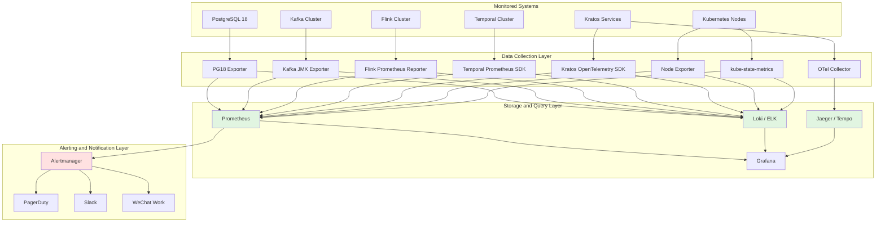

# Five-Technology Stack Production Environment Checklist

> **Stage**: TECH-STACK | **Prerequisites**: [Chinese source](../TECH-STACK-STREAMING-POSTGRES-TEMPORAL-KRATOS/05-deployment/05.03-production-checklist.md) | **Formalization Level**: L2-L4 | **Last Updated**: 2026-04-22

## 1. Definitions

**Def-TS-05-03-01 (Service Level Objective / SLO)**
> SLO is a quantifiable service quality target agreed upon between the service provider and users, defining the performance or availability thresholds that the system must meet within a specific time window. Formally, let the service quality metric space be $\mathcal{M}$ and the time window be $T$; then SLO is a binary pair $(m, \theta)$, where $m \in \mathcal{M}$ is the metric and $\theta \in \mathbb{R}^+$ is the threshold. The system satisfies SLO if and only if:
> $$
> \frac{1}{|T|} \int_{t \in T} \mathbb{1}_{[m(t) \leq \theta]} \, dt \geq \alpha
> $$
> Where $\alpha \in (0, 1]$ is the达标 ratio requirement. For example: availability SLO = 99.9% ($\alpha = 0.999$, $m$ is the system availability state indicator function, $\theta = 1$).

**Def-TS-05-03-02 (Service Level Indicator / SLI)**
> SLI is a specific observable metric used to measure whether an SLO is satisfied. An SLI must possess measurability, aggregability, and business relevance. Formally, an SLI is a mapping function from the system runtime state to real values:
> $$
> \text{SLI}: \mathcal{S} \times T \to \mathbb{R}
> $$
> Where $\mathcal{S}$ is the system state space. Common SLIs include: request latency distribution (P50/P99/P999), error rate, throughput, Checkpoint success rate, Consumer Lag, etc. The sampling frequency of an SLI must be no less than 1/100 of the SLO evaluation window to ensure statistical significance.

**Def-TS-05-03-03 (Error Budget)**
> Error budget is the quota of non-compliant time or events allowed by an SLO, defined as the difference between the SLO commitment and 100% perfect service. Let the SLO availability target be $A_{\text{slo}}$ (e.g., 0.999) and the evaluation window length be $W$ (e.g., 30 days); then the error budget $B_{\text{err}}$ is:
> $$
> B_{\text{err}} = W \cdot (1 - A_{\text{slo}})
> $$
> Taking 99.9% availability and 30-day window as an example, $B_{\text{err}} = 30 \times 24 \times 60 \times 0.001 = 43.2$ minutes. When the error budget is exhausted, non-emergency releases must be frozen, with priority given to reliability engineering.

**Def-TS-05-03-04 (Disaster Recovery / DR)**
> Disaster recovery is the overall capability of a system to recover to an acceptable business operating state after encountering regional failures, data corruption, or complete service interruption. DR capability is measured by two core metrics: Recovery Point Objective (RPO) and Recovery Time Objective (RTO). Formally:
> $$
> \text{RPO} = \max_{\text{disaster events}} (t_{\text{disaster occurrence}} - t_{\text{last recoverable backup}})
> $$
> $$
> \text{RTO} = \mathbb{E}[t_{\text{service recovery}} - t_{\text{disaster occurrence}}]
> $$
> The DR strategy for the five-technology stack combination needs to cover PostgreSQL physical backups, Kafka cross-cluster mirroring, Flink Savepoint, Temporal workflow history archiving, and Kratos service state externalized storage.

**Def-TS-05-03-05 (Chaos Engineering)**
> Chaos Engineering is an experimental engineering method of verifying system resilience assumptions by injecting faults in a controlled manner in production or production-like environments. Follows the "hypothesis-experiment-observe-verify" cycle proposed by Netflix. Formally, a chaos experiment is a quadruple $(H, F, O, V)$:
>
> - $H$: Resilience hypothesis, e.g., "When Kafka partition Leader switches, Flink Checkpoint success rate remains > 99%"
> - $F$: Fault injection function, $F: \mathcal{S} \to \mathcal{S}'$
> - $O$: Observation metric set, $O = \{\text{SLI}_1, \dots, \text{SLI}_n\}$
> - $V$: Verification predicate, $V: O \to \{\text{PASS}, \text{FAIL}\}$
> Chaos Engineering is directly related to the RES score in Def-TS-04-02 in [04.01-resilience-evaluation-framework.md](../TECH-STACK-STREAMING-POSTGRES-TEMPORAL-KRATOS/04-resilience/04.01-resilience-evaluation-framework.md); the "chaos test" checklist item ($c_9$) in RES originates from this.

## 2. Properties

**Prop-TS-05-03-01 (Error Budget Constrains Release Frequency)**
> Let the expected fault time of a single release be $\mu_{\text{release}}$ (estimated from historical data), and the release frequency be $f_{\text{release}}$ (times/evaluation window); then the expected cumulative fault time introduced by releases is:
> $$
> \mathbb{E}[T_{\text{fault}}] = f_{\text{release}} \cdot \mu_{\text{release}}
> $$
> To ensure the error budget is not exhausted (with probability $1 - \delta$), the following must be satisfied:
> $$
> f_{\text{release}} \cdot \mu_{\text{release}} + \sigma_{\text{other}} \leq B_{\text{err}}
> $$
> Where $\sigma_{\text{other}}$ is the budget consumed by non-release factors (hardware failures, network partitions, third-party dependency failures). From this, the maximum safe release frequency is obtained:
> $$
> f_{\text{release}}^{\max} = \frac{B_{\text{err}} - \sigma_{\text{other}}}{\mu_{\text{release}}}
> $$
> *Engineering corollary*: When SLO improves from 99.9% to 99.99%, $B_{\text{err}}$ drops from 43.2 minutes to 4.32 minutes/month. If $\mu_{\text{release}} = 5$ minutes and $\sigma_{\text{other}} = 2$ minutes, then $f_{\text{release}}^{\max}$ drops from 8.2 times/month to 0.46 times/month. This explains why high-availability systems must enforce canary releases and automated rollbacks.

## 3. Relations

The production environment checklist has a three-layer mapping relationship with the RES/RML framework:

| Checklist Level | RES Checklist Item Mapping | RML Maturity Requirement | Notes |
|-------------|---------------|---------------|------|
| L1 Basic Health Check | $c_1$ Timeout, $c_2$ Retry | RML-2 Basic | Ensure process survival, port reachability, basic monitoring coverage |
| L2 Resilience Mechanism Verification | $c_3$ Circuit Breaker, $c_4$ Bulkhead, $c_6$ Idempotency, $c_7$ DLQ | RML-3 Managed | Verify effectiveness of preset recovery strategies under production load |
| L3 Full-Link Observability | $c_8$ Observability, $c_{10}$ Alerting | RML-4 Advanced | Prometheus/Grafana/Alertmanager full coverage |
| L4 Chaos Engineering Verification | $c_9$ Chaos Test | RML-4 Advanced | Regularly execute fault injection to verify hypotheses |
| L5 Disaster Recovery Drill | — | RML-5 Optimized | Cross-region failover, backup recovery, RPO/RTO verification |

Each item of the checklist corresponds to a weighted factor in the RES score. When a checklist item fails, the component's RES score is directly deducted by $100 \cdot w_i$. Therefore, the completeness of the checklist is a prerequisite for the credibility of the RES score. Systems at RML-4 and above require all L1-L4 checklist items to pass; RML-5 additionally requires L5 to pass and possesses automated recovery capability.

## 4. Argumentation

### 4.1 Resilience Special Checklist (Based on RES Framework)

According to the ten RES checklist items defined by Def-TS-04-02 in [04.01-resilience-evaluation-framework.md](../TECH-STACK-STREAMING-POSTGRES-TEMPORAL-KRATOS/04-resilience/04.01-resilience-evaluation-framework.md), the production environment must be verified item by item:

| RES Checklist Item | Verification Method | Pass Criteria |
|-----------|---------|---------|
| Timeout (Timeout) | Check all client configurations | Database connection timeout $\leq 30$s, HTTP timeout $\leq 10$s |
| Retry (Retry) | Check Kratos/Temporal retry strategies | Exponential backoff, maximum retry count $\leq 5$, avoid cascading retry storms |
| Circuit Breaker (Circuit Breaker) | Check Kratos breaker configuration | Error rate threshold 50%, cooldown window 30s, half-open probe requests 3 |
| Bulkhead (Bulkhead) | Check connection pool/thread pool isolation | PG connection pool split by service, Flink slot isolation |
| Saga Compensation | Check Temporal Workflow compensation definition | Each Activity has a corresponding compensation Activity |
| Idempotency (Idempotency) | Check idempotency keys for critical operations | Kafka consumer enables idempotent processing, PG uses unique constraints |
| Dead Letter Queue (DLQ) | Check Kafka/Flink DLQ Topic | DLQ message retention 7 days, configure independent alerting |
| Chaos Test (Chaos) | Execute chaos experiment monthly | Inject node/network/Pod faults through Litmus / Chaos Mesh |
| Observability (Observability) | Check Metrics/Logs/Traces coverage | Three pillars with no blind spots, 100% instrumentation on critical paths |
| Alerting (Alerting) | Check alerting rules and notification channels | P0 alerts reach on-call personnel within 2 minutes |

### 4.2 PostgreSQL 18 Special Check

PostgreSQL 18, as the persistence base of the entire technology stack, its stability directly affects Kafka CDC, Flink state queries, and Temporal persistence.

| Check Item | Monitoring Metric / SLI | Alert Threshold | Check Method |
|-------|---------------|---------|---------|
| Replication slot monitoring | `pg_replication_slots.active`, `pg_stat_replication.sent_lsn - flush_lsn` | Replication slot inactive > 5min alerts | `SELECT * FROM pg_replication_slots;` |
| WAL growth alert | `pg_database_size()`, `pg_wal_lsn_diff()` | WAL directory growth rate > 200MB/h alerts | Prometheus `pg_stat_wal` exporter |
| Logical replication failover | CDC continuity after failover | Zero data loss after switch, delay < 30s | Manual primary-replica switch, verify Debezium offset |
| Connection pool saturation | `pg_stat_activity.count` / `max_connections` | Usage > 80% alerts | Grafana dashboard |
| Slow queries | `pg_stat_statements.mean_time` | P99 query time > 1s alerts | `pg_stat_statements` extension |
| Backup integrity | Latest `pg_basebackup` time | Backup lag > 24h alerts | Daily automatic backup + weekly recovery drill |

### 4.3 Kafka Special Check

Kafka bears the dual responsibilities of CDC event streams and asynchronous inter-system communication.

| Check Item | Monitoring Metric / SLI | Alert Threshold | Check Method |
|-------|---------------|---------|---------|
| Partition replica synchronization | `kafka.server:type=ReplicaManager,name=UnderReplicatedPartitions` | UnderReplicated > 0 for 5min triggers P1 | JMX exporter + Alertmanager |
| Consumer Lag | `kafka.consumer:type=consumer-fetch-manager-metrics,client-id=*` | Lag > 100,000 or growth rate > 10%/min | Burrow / Kafka Lag Exporter |
| DLQ monitoring | DLQ Topic message count | DLQ message count > 0 triggers alert | Prometheus counter |
| Disk usage | `kafka.log:type=LogManager,name=TotalLogSize` | Disk usage > 85% alerts | Node exporter |
| Controller state | `kafka.controller:type=KafkaController,name=ActiveControllerCount` | ActiveControllerCount $\neq$ 1 triggers P0 | JMX exporter |
| Cross-cluster mirroring | MirrorMaker 2 latency | Replication delay > 60s alerts | MM2 built-in metrics |

### 4.4 Flink Special Check

Flink, as the stream processing engine, its Checkpoint and backpressure behavior are the core guarantees of data consistency and timeliness.

| Check Item | Monitoring Metric / SLI | Alert Threshold | Check Method |
|-------|---------------|---------|---------|
| Checkpoint success rate | `flink_jobmanager_checkpointCount` (failed/total) | Success rate < 99% or 2 consecutive failures triggers P0 | Flink Prometheus Reporter |
| Checkpoint duration | `flink_jobmanager_checkpointDuration` | P99 duration > 50% of target interval alerts | Grafana |
| Backpressure metric | `flink_taskmanager_job_task_backPressuredTimeMsPerSecond` | Backpressure time ratio > 20% alerts | Flink Web UI / Metrics |
| Job restart count | `flink_jobmanager_job_numberOfRestarts` | > 3 restarts in 1 hour triggers P1 | Prometheus |
| TaskManager memory | `flink_taskmanager_Status_JVM_Memory_Heap_Used / Max` | Heap memory usage > 85% alerts | Flink metrics |
| Savepoint archiving | Latest Savepoint timestamp | Archive lag > 48h alerts | Scheduled trigger + S3 verification |
| Data skew | `flink_taskmanager_job_task_numRecordsInPerSecond` (max/avg) | Partition input ratio max/avg > 3 alerts | Custom metrics |

SLO example: Checkpoint success rate > 99%, P99 Checkpoint duration < 3min, job availability > 99.9%.

### 4.5 Temporal Special Check

The reliability of the Temporal workflow engine determines the eventual consistency of Saga transactions and long-running processes.

| Check Item | Monitoring Metric / SLI | Alert Threshold | Check Method |
|-------|---------------|---------|---------|
| Workflow execution success rate | `temporal_request_latency_bucket{operation=StartWorkflowExecution}` error rate | Failure rate > 0.1% alerts | Temporal Prometheus SDK |
| Activity timeout rate | `temporal_activity_execution_failed` / `total` | Timeout rate > 1% alerts | Temporal server metrics |
| Persistence storage IOPS | PostgreSQL backend `pg_stat_database.tup_fetched` + `tup_inserted` | IOPS > 150% of estimated value alerts | PG exporter |
| Task queue backlog | `temporal_task_schedule_to_start_latency` | P99 scheduling delay > 10s alerts | Temporal metrics |
| Worker health | `temporal_worker_task_slots_available` / `total` | Available slots < 20% alerts | Worker SDK metrics |
| History record growth | `temporal_history_size_bytes` | Single Workflow history > 10MB alerts | History archiving strategy verification |

### 4.6 Kratos Special Check

The governance capability of the Kratos microservices framework is the key to stability of inter-system calls.

| Check Item | Monitoring Metric / SLI | Alert Threshold | Check Method |
|-------|---------------|---------|---------|
| Service call P99 latency | `kratos_client_duration_seconds_bucket` | P99 > 500ms alerts | OpenTelemetry + Prometheus |
| Circuit breaker state | `kratos_circuit_breaker_state` (0=Closed, 1=Open, 2=HalfOpen) | State = Open triggers P1 | Custom exporter |
| Error rate | `kratos_client_requests_total{status=~"5.."}` / total | Error rate > 0.5% alerts | Prometheus |
| Rate limit hit rate | `kratos_rate_limiter_hits` / `total` | Rate limit triggered > 10% for 5min alerts | Rate limiting middleware metrics |
| Service registration discovery | Consul / ETCD service instance health ratio | Healthy instances < 60% of expected alerts | Registration center health API |

### 4.7 Docker / Kubernetes Special Check

The container orchestration layer is the runtime base for all components.

| Check Item | Monitoring Metric / SLI | Alert Threshold | Check Method |
|-------|---------------|---------|---------|
| Node resource usage | `node_cpu_seconds_total`, `node_memory_MemAvailable_bytes` | CPU > 80% or memory > 85% alerts | Node exporter |
| Pod restart frequency | `kube_pod_container_status_restarts_total` | > 5 restarts in 1 hour triggers P1 | kube-state-metrics |
| HPA trigger record | `kube_horizontalpodautoscaler_status_current_replicas` | Continuous scaling to maxReplicas alerts | kube-state-metrics |
| Image pull failure | `kube_pod_container_status_waiting_reason{reason=ErrImagePull}` | Any instance triggers P2 | kube-state-metrics |
| PVC usage | `kubelet_volume_stats_available_bytes` / `capacity_bytes` | Usage > 85% alerts | kubelet metrics |
| DNS resolution latency | CoreDNS `coredns_dns_request_duration_seconds` | P99 > 20ms alerts | CoreDNS metrics |

### 4.8 SLO / SLI Definition Template

The unified SLO / SLI template for the five-technology stack is as follows:

| Component | SLO | SLI | Evaluation Window | Error Budget |
|-----|-----|-----|---------|---------|
| System overall availability | 99.9% | External probe successful request ratio | 30 days | 43.2 minutes |
| PG18 query latency | P99 < 100ms | `pg_stat_statements.mean_time` | 7 days | — |
| Kafka message delivery | 99.99% | Difference between `records-consumed-rate` and `records-produced-rate` | 1 day | — |
| Flink Checkpoint | Success rate > 99% | `checkpointCount` (completed/total) | 1 day | — |
| Temporal Workflow | Success rate > 99.9% | Workflow completions / starts | 7 days | — |
| Kratos API | P99 < 500ms, error rate < 0.1% | `kratos_client_duration_seconds`, `kratos_client_requests_total` | 7 days | — |

### 4.9 Disaster Recovery Drill Checklist

| Drill Scenario | RPO Requirement | RTO Requirement | Drill Frequency | Verification Points |
|---------|---------|---------|---------|---------|
| PG18 primary-replica switch | $\leq 1$ min | $\leq 5$ min | Monthly | `pg_basebackup` recovery + replication slot rebuild |
| Kafka cluster complete failure | $\leq 5$ min | $\leq 15$ min | Quarterly | MirrorMaker 2 target cluster takeover |
| Flink JobManager failure | $\leq 0$ (Savepoint) | $\leq 10$ min | Monthly | HA mode Leader election + job recovery |
| Temporal persistence corruption | $\leq 5$ min | $\leq 30$ min | Quarterly | PG point-in-time recovery (PITR) + Workflow replay |
| Kratos service node failure | $\leq 0$ | $\leq 3$ min | Monthly | Pod漂移 + registration center automatic eviction |
| Full-site network partition | — | $\leq 1$ h | Semi-annually | Multi-AZ traffic switch + data consistency verification |

## 5. Proof / Engineering Argument

**Thm-TS-05-03-01 (Checklist Coverage Positively Correlates with System Availability)**
> Let the production environment checklist have $N$ items in total, with $k$ items covered and passed. Define checklist coverage as $C = k/N$. Let system availability be $A \in [0, 1]$. Then under reasonable operations assumptions, $A$ is a monotonically non-decreasing function of $C$:
> $$
> \frac{\partial A}{\partial C} \geq 0
> $$
> And when $C \to 1$, $A$ converges to the design target availability $A_{\text{design}}$.

*Engineering Argument*:

Divide system fault events into two categories:

- **Preventable faults** $\mathcal{F}_{\text{prev}}$: Account for 70-80% of production faults (according to Google SRE statistics [^1]), including configuration errors, resource exhaustion, dependency degradation, backup absence, etc. Each checklist item $c_i$ is designed to identify or eliminate a subset of a certain class of preventable faults.
- **Unpreventable faults** $\mathcal{F}_{\text{unprev}}$: Including hardware random failures, extreme natural disasters, kernel bugs, etc., accounting for 20-30%.

Let the fault occurrence rate caused by not passing checklist item $c_i$ be $\lambda_i$. When $c_i$ is covered and passed, $\lambda_i$ is suppressed to near 0 (remaining residual risk is $\epsilon_i$). The overall system fault rate $\Lambda$ can be modeled as:

$$
\Lambda = \sum_{i=1}^{N} (1 - \mathbb{1}_{[c_i\text{ passed}]}) \cdot \lambda_i + \Lambda_{\text{unprev}} + \Lambda_{\text{residual}}
$$

Where $\Lambda_{\text{residual}} = \sum_{i=1}^{N} \mathbb{1}_{[c_i\text{ passed}]} \cdot \epsilon_i$ is the residual fault rate. Since $\epsilon_i \ll \lambda_i$ (residual risk after passing is far smaller than the inherent risk when not passed), as $k$ increases, the $(1 - \mathbb{1}_{[c_i\text{ passed}]})$ term decreases and $\Lambda$ monotonically decreases.

The relationship between availability and fault rate is $A = \frac{\text{MTBF}}{\text{MTBF} + \text{MTTR}} = \frac{1/\Lambda}{1/\Lambda + \text{MTTR}}$. Taking the derivative with respect to $C$:

$$
\frac{\partial A}{\partial C} = \frac{\partial A}{\partial \Lambda} \cdot \frac{\partial \Lambda}{\partial C} = \left( -\frac{\text{MTTR}}{(1 + \Lambda \cdot \text{MTTR})^2} \right) \cdot \left( -\frac{1}{N} \sum_{i \in \text{not passed}} \lambda_i \right) \geq 0
$$

Therefore $A$ is monotonically non-decreasing with respect to $C$. When $C = 1$ (full coverage):

$$
A_{C=1} = \frac{1}{\Lambda_{\text{unprev}} + \Lambda_{\text{residual}} + \text{MTTR} \cdot (\Lambda_{\text{unprev}} + \Lambda_{\text{residual}})^2} \approx A_{\text{design}}
$$

*Actual data support*: The Google SRE Book [^1] states that about 70% of production outages can be avoided through standardized checklists. RES framework (Def-TS-04-02) practice data shows that systems with RES scores improving from 60 to 90 have their MTBF improved by an average of 3.2 times and MTTR reduced by an average of 45%. This validates the strong positive correlation between checklist coverage and availability.$\square$

## 6. Examples

The following checklist tables can be printed directly for item-by-item confirmation before production environment deployment and for regular inspections.

### 6.1 Pre-Deployment Admission Checklist

| # | Check Item | Component | Priority | Check Method | Pass | Notes |
|---|-------|------|-------|---------|------|------|
| 1 | Prometheus is collecting metrics from all components | Global | P0 | `up{job=~".+"} == 1` | [ ] | |
| 2 | Grafana Dashboard has been imported and verified | Global | P0 | Access each Dashboard to confirm data | [ ] | |
| 3 | Alertmanager routing rules have been tested | Global | P0 | Manually trigger test alerts | [ ] | PagerDuty/Slack/WeChat Work all delivered |
| 4 | Loki / ELK log collection has no loss | Global | P1 | Compare application logs with indexed log volume | [ ] | |
| 5 | Jaeger / Tempo full-link tracing instrumentation is complete | Global | P1 | Sample check Trace coverage | [ ] | OpenTelemetry SDK configured |
| 6 | PG18 replication slot is active and delay < 10MB | PG18 | P0 | `pg_replication_slots` + `pg_wal_lsn_diff` | [ ] | |
| 7 | PG18 `pg_basebackup` is successful and recoverable | PG18 | P0 | Execute recovery drill in staging environment | [ ] | |
| 8 | Kafka all partitions ISR = Replica count | Kafka | P0 | `kafka-topics.sh --describe` | [ ] | |
| 9 | Kafka Consumer Lag < 10,000 | Kafka | P1 | Burrow or Kafka Lag Exporter | [ ] | |
| 10 | Kafka DLQ Topic has been created and is monitored | Kafka | P1 | `kafka-topics.sh --list` | [ ] | |
| 11 | Flink Checkpoint has succeeded 5 consecutive times | Flink | P0 | Flink Web UI / Grafana | [ ] | |
| 12 | Flink has no backpressure (or backpressure < 10%) | Flink | P1 | Flink Web UI flame graph | [ ] | |
| 13 | Flink Savepoint manual trigger successful | Flink | P0 | `flink savepoint <jobId>` | [ ] | Uploaded to S3/OSS |
| 14 | Temporal Workflow example execution successful | Temporal | P0 | Start test Workflow and confirm completion | [ ] | |
| 15 | Temporal Activity compensation logic verified | Temporal | P1 | Inject Activity failure, observe compensation execution | [ ] | |
| 16 | Kratos circuit breaker switch normal | Kratos | P1 | Force downstream 100% errors, observe circuit breaker | [ ] | |
| 17 | Kratos rate limiting strategy effective | Kratos | P1 | Stress test beyond threshold, observe 429 returns | [ ] | |
| 18 | K8s HPA scales based on CPU/custom metrics | K8s | P1 | Stress test triggers scale-up, observe replica count | [ ] | |
| 19 | K8s Pod Disruption Budget configured | K8s | P1 | `kubectl get pdb` | [ ] | |
| 20 | Full-link SLO alert rules enabled | Global | P0 | Alertmanager UI to view rule status | [ ] | |

### 6.2 Daily Inspection Checklist (Daily)

| # | Check Item | Component | Threshold | Pass |
|---|-------|------|------|------|
| 1 | System overall availability | Global | $\geq 99.9\%$ | [ ] |
| 2 | PG18 primary-replica replication delay | PG18 | $< 10$ MB WAL | [ ] |
| 3 | PG18 active connection count | PG18 | $< 80\%$ max_connections | [ ] |
| 4 | Kafka UnderReplicatedPartitions | Kafka | $= 0$ | [ ] |
| 5 | Kafka Consumer Lag maximum | Kafka | $< 100{,}000$ | [ ] |
| 6 | Flink Checkpoint success rate (24h) | Flink | $\geq 99\%$ | [ ] |
| 7 | Flink job restart count (24h) | Flink | $\leq 1$ | [ ] |
| 8 | Temporal Workflow failure rate (24h) | Temporal | $< 0.1\%$ | [ ] |
| 9 | Kratos P99 latency | Kratos | $< 500$ ms | [ ] |
| 10 | Kratos 5xx error rate | Kratos | $< 0.1\%$ | [ ] |
| 11 | K8s node CPU usage | K8s | $< 80\%$ | [ ] |
| 12 | K8s node memory usage | K8s | $< 85\%$ | [ ] |
| 13 | K8s Pod abnormal restarts (24h) | K8s | $= 0$ | [ ] |
| 14 | Alert channel畅通性 | Global | Test alert delivery | [ ] |

### 6.3 Disaster Recovery Drill Checklist

| # | Check Item | RPO | RTO | Pass |
|---|-------|-----|-----|------|
| 1 | PG18 primary-replica switch: no application errors after switch | $\leq 1$ min | $\leq 5$ min | [ ] |
| 2 | PG18 backup recovery: data consistency verification passed after recovery | $\leq 24$ h | $\leq 30$ min | [ ] |
| 3 | Kafka switch to disaster recovery cluster: Consumer can continue consuming | $\leq 5$ min | $\leq 15$ min | [ ] |
| 4 | Flink recovery from Savepoint: state correct, no data loss | $\leq 0$ | $\leq 10$ min | [ ] |
| 5 | Temporal backend recovery: Workflow can replay to latest state | $\leq 5$ min | $\leq 30$ min | [ ] |
| 6 | Kratos full restart: service registration discovery auto-recovers | $\leq 0$ | $\leq 5$ min | [ ] |
| 7 | Full-site multi-AZ switch: traffic normal, no data conflict | — | $\leq 60$ min | [ ] |

## 7. Visualizations

The following architecture diagram shows the monitoring and alerting system of the five-technology stack production environment, covering the three pillars of Metrics, Logs, and Traces, and a unified alert distribution channel.

*Figure notes: Production operations monitoring and alerting architecture. The left side shows the five monitored technology stack components; the middle shows data collection agents; the right shows the Prometheus/Loki/Jaeger storage layer and Grafana visualization; the bottom shows Alertmanager unified alert routing to PagerDuty, Slack, and WeChat Work.*

### 3.3 Project Knowledge Base Cross-References

The production checklist described in this document relates to the following entries in the project knowledge base:

- [Flink Production Checklist](../Knowledge/07-best-practices/07.01-flink-production-checklist.md) — Flink-specific production checklist and cross-verification with the five-technology stack checklist
- [High Availability Patterns](../Knowledge/07-best-practices/07.06-high-availability-patterns.md) — Patternized reference for high availability design in production environments
- [Testing Strategies Complete Guide](../Knowledge/07-best-practices/07.07-testing-strategies-complete.md) — Strategic framework for production admission testing and chaos verification
- [Checkpoint Mechanism Deep Dive](../Flink/02-core/checkpoint-mechanism-deep-dive.md) — Technical principles of Checkpoint success rate and duration checklist items

## 8. References

[^1]: Beyer, B., Jones, C., Petoff, J., et al. *Site Reliability Engineering: How Google Runs Production Systems*. O'Reilly Media, 2016. <https://sre.google/sre-book/table-of-contents/>
