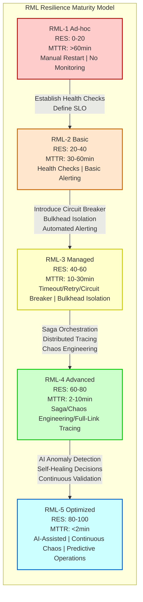
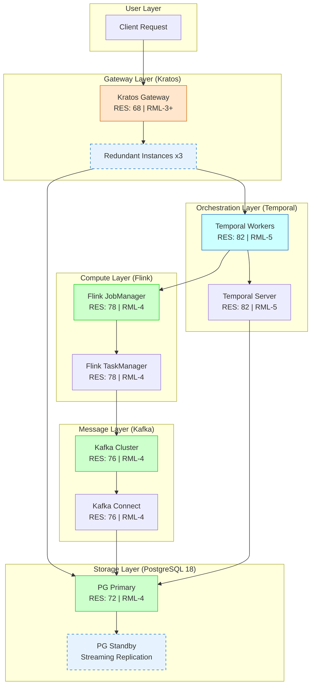

# Five-Technology-Stack Composite Resilience Evaluation Framework (RES + RML)

> **Stage**: TECH-STACK | **Prerequisites**: [Chinese source](../TECH-STACK-STREAMING-POSTGRES-TEMPORAL-KRATOS/04-resilience/04.01-resilience-evaluation-framework.md) | **Formalization Level**: L3-L4 | **Last Updated**: 2026-04-22

## 1. Definitions

**Def-TS-04-01 (Resilience)**
> Resilience is the ability of a distributed system to maintain acceptable service levels in the face of faults, load surges, or partial component failures. Formally, let the system state space be \(S\), the fault injection function be \(f: S \to S \cup \{\bot\}\), and the service level function be \(SLA: S \to [0, 1]\). A system is resilient if and only if:
> $$
> \forall s \in S, \forall f \in \mathcal{F}: SLA(f(s)) \geq SLA(s) - \epsilon \quad \text{and} \quad \lim_{t \to \infty} SLA(\Phi_t(f(s))) = SLA(s)
> $$
> where \(\mathcal{F}\) is the predefined fault set, \(\Phi_t\) is the state evolution function at time \(t\), and \(\epsilon\) is the acceptable instantaneous SLA degradation threshold.

**Def-TS-04-02 (RES — Resilience Evaluation Score)**
> RES is a quantitative resilience score based on a ten-item checklist, with value range \([0, 100]\). Let the checklist item set be \(C = \{c_1, \dots, c_{10}\}\), with each item weight \(w_i \in (0, 1]\) and \(\sum w_i = 1\). Component \(x\)'s RES is defined as:
> $$
> RES(x) = 100 \cdot \sum_{i=1}^{10} w_i \cdot \mathbb{1}_{[c_i\ \text{satisfied}]}(x)
> $$
> The ten checklist items are: Timeout, Retry, Circuit Breaker, Bulkhead, Saga Compensation, Idempotency, Dead Letter Queue (DLQ), Chaos Testing, Observability, Alerting.

**Def-TS-04-03 (RML — Resilience Maturity Model)**
> RML is a five-level discrete model describing system resilience operations maturity, defining mapping \(RML: \mathcal{S} \to \{1, 2, 3, 4, 5\}\), where:
>
> - **RML-1 Ad-hoc**: Fault response depends on manual intervention; no standardized processes
> - **RML-2 Basic**: Has basic health checks and manual restart capabilities
> - **RML-3 Managed**: Introduces automated fault detection and preset recovery strategies (retry, timeout, circuit breaker)
> - **RML-4 Advanced**: Implements Saga orchestration, chaos engineering, full-link observability, and proactive degradation
> - **RML-5 Optimized**: AI-assisted anomaly detection, continuous chaos validation, self-healing decisions, and predictive operations

**Def-TS-04-04 (MTBF — Mean Time Between Failures)**
> Mean time between failures, defined as the expected value of normal working time between two consecutive failures:
> $$
> MTBF = \frac{\sum_{i=1}^{n} T_{\text{up},i}}{n}
> $$
> where \(T_{\text{up},i}\) is the duration of the \(i\)-th normal operation cycle. For repairable systems, \(MTBF = MTTF + MTTR\), where \(MTTF\) is mean time to failure.

**Def-TS-04-05 (MTTR — Mean Time To Recovery)**
> Mean time to recovery, defined as the expected time from fault occurrence to system recovery to acceptable service levels:
> $$
> MTTR = \frac{\sum_{j=1}^{m} T_{\text{recover},j}}{m}
> $$
> where \(T_{\text{recover},j} = t_{\text{detect},j} + t_{\text{diagnose},j} + t_{\text{remediate},j} + t_{\text{verify},j}\), corresponding to the four stages of detection, diagnosis, remediation, and verification respectively.

**Def-TS-04-06 (Blast Radius)**
> Blast radius is a measure of the maximum impact scope of a fault propagating in the system. Let the component dependency graph be \(G = (V, E)\), fault source node \(v_0 \in V\), and fault propagation operator \(\mathcal{B}: V \to 2^V\). Blast radius is defined as:
> $$
> BR(v_0) = |\{v \in V \mid \exists k \geq 0: v \in \mathcal{B}^k(v_0)\}| / |V|
> $$
> That is, the proportion of nodes affected by the fault to the total number of nodes. The goal of an ideally resilient system is \(BR(v_0) \to 0\) (fault isolation).

## 2. Properties

**Lemma-TS-04-01 (Component Resilience Monotonicity)**
> Let composite system \(S = C_1 \oplus C_2 \oplus \dots \oplus C_n\), where \(\oplus\) denotes the component composition operator. If each component \(C_i\)'s resilience measure \(R_i\) satisfies a monotonically increasing relationship (i.e., improving component resilience does not reduce overall system resilience), then:
> $$
> \frac{\partial R_{\text{sys}}}{\partial R_i} \geq 0, \quad \forall i \in [1, n]
> $$
> *Proof Sketch*: Composite system SLA can be modeled as a weighted function of each component's SLA \(SLA_{\text{sys}} = \phi(SLA_1, \dots, SLA_n)\). In serial dependency paths, \(SLA_{\text{sys}} = \prod SLA_i\); in parallel redundant paths, \(SLA_{\text{sys}} = 1 - \prod(1 - SLA_i)\). In both cases \(\partial SLA_{\text{sys}} / \partial SLA_i \geq 0\), hence resilience monotonicity holds. \(\square\)

**Lemma-TS-04-02 (Resilience Shortest-Board Effect)**
> In serial composite systems, system resilience is limited by the weakest component:
> $$
> R_{\text{sys}}^{\text{serial}} \leq \min_{i} R_i
> $$
> *Proof*: Serial path availability is the product of each component's availability \(A_{\text{sys}} = \prod A_i\). Since \(A_i \in [0, 1]\), we have \(A_{\text{sys}} \leq \min_i A_i\). Mapping availability to resilience measure \(R = -\ln(1 - A)\) (or similar monotonic transformation), the conclusion follows. \(\square\)

**Prop-TS-04-01 (Composite Resilience Lower Bound)**
> For a mixed system with \(k\) parallel redundant paths and \(m\) serial dependency paths, its global resilience satisfies:
> $$
> R_{\text{sys}} \geq \max_{j=1}^{k} \left( \min_{i \in \text{path}_j} R_i \right) - \delta_{\text{coord}}
> $$
> where \(\delta_{\text{coord}}\) is the resilience attenuation term caused by coordination overhead, typically \(\delta_{\text{coord}} \in [0, 0.15]\).

**Lemma-TS-04-03 (RES Score Subadditivity)**
> Let composite system \(S\) be composed of subsystems \(A\) and \(B\); if \(A\) and \(B\) share dependency \(D\), then:
> $$
> RES(S) \leq \min(RES(A), RES(B)) + \Delta_{\text{shared}}
> $$
> where \(\Delta_{\text{shared}}\) is the coupling risk compensation term introduced by shared dependencies, \(\Delta_{\text{shared}} \leq 0\). This lemma shows that shared dependencies are a key risk point for resilience degradation.

## 3. Relations

**RES and RML Mapping Relationship**

There is a nonlinear monotonic mapping between RES score and RML maturity. Let \(M = RML(S) \in \{1, 2, 3, 4, 5\}\); then there exists a piecewise mapping function \(\Psi: [0, 100] \to \{1, 2, 3, 4, 5\}\):

| RML Level | RES Score Range | Core Characteristics |
|-----------|----------------|----------------------|
| RML-1 Ad-hoc | \([0, 20)\) | Only satisfies 0-2 checklist items, MTTR > 60 min |
| RML-2 Basic | \([20, 40)\) | Satisfies 2-4 items, has basic health checks, MTTR 30-60 min |
| RML-3 Managed | \([40, 60)\) | Satisfies 4-6 items, automated retry/timeout/circuit breaker, MTTR 10-30 min |
| RML-4 Advanced | \([60, 80)\) | Satisfies 6-8 items, Saga + chaos engineering + full-link tracing, MTTR 2-10 min |
| RML-5 Optimized | \([80, 100]\) | Satisfies 8-10 items, AI-assisted + predictive operations + continuous validation, MTTR < 2 min |

Formally, the mapping function is defined as:
$$
\Psi(r) = \begin{cases}
1 & r \in [0, 20) \\
2 & r \in [20, 40) \\
3 & r \in [40, 60) \\
4 & r \in [60, 80) \\
5 & r \in [80, 100]
\end{cases}
$$

**Reverse Mapping Constraint**: High RML level requires RES score as a necessary condition, but not sufficient. That is, \(RML(S) = m \Rightarrow RES(S) \geq L_m\), but \(RES(S) \geq L_m \nRightarrow RML(S) = m\). RML additionally requires organizational processes, cultural maturity, and toolchain completeness.

**RES and MTTR/MTBF Relationship**

There is the following empirical relationship between RES score and operational metrics (based on Netflix, Google SRE practice induction):
$$
MTTR_{\text{expected}} \approx 120 \cdot e^{-0.05 \cdot RES} \quad \text{(minutes)}
$$
$$
MTBF_{\text{improvement}} \propto \sqrt{RES}
$$

That is, every 20-point increase in RES roughly halves expected MTTR; MTBF improvement is proportional to the square root of RES.

## 4. Argumentation

### 4.1 Resilience Evaluation Indicator System Based on PRISMA Systematic Literature Review

This framework's indicator system is built upon the PRISMA-aligned systematic literature review reported in arXiv 2512.16959v1[^1]. The review covers microservice recovery pattern research from 2014-2025, screening 127 high-quality papers, and distilling nine operations themes (T1-T9) and a five-dimensional evaluation space.

#### Nine Operations Themes (T1-T9)

**T1: Failure Pattern-Recovery Pattern Matching**
> Different fault types require matched recovery strategies. The literature review identifies 12 core failure patterns: node crash, network partition, cascading timeout, resource exhaustion, dependency failure, configuration drift, data inconsistency, deadlock/livelock, split-brain, slow node, version incompatibility, security intrusion. The mapping matrix of each failure pattern to the optimal recovery pattern is the foundation of resilience design.

**T2: Saga Compensation and Distributed Transactions**
> In long-transaction scenarios, the Saga pattern achieves eventual consistency through compensation operations. The review points out that 78% of production-grade microservice systems adopt Saga or similar compensation mechanisms for cross-service transactions. Compensation completeness (whether 100% semantic rollback is possible) and compensation observability (compensation link tracing) are two key sub-dimensions.

**T3: Retry Dynamics and Backoff Strategies**
> Retry is the first line of defense against transient faults. The literature distinguishes four strategy types: fixed interval, exponential backoff, jittered backoff, and adaptive backoff. Adaptive backoff (dynamically adjusting based on system load) became a research hotspot after 2023, reducing retry storm probability by over 60%.

**T4: Idempotency and Outbox Pattern**
> Idempotency is the safety guarantee for duplicate message delivery in network partition scenarios. The Outbox pattern solves the atomicity problem of "database update + message sending". The review finds that systems simultaneously implementing idempotent consumers and Outbox publishers reduce data consistency incidents by 83%.

**T5: Bulkhead Isolation and Backpressure Propagation**
> Bulkhead divides resources into isolated pools, preventing faults from propagating across components; backpressure propagates downstream pressure upstream, preventing memory overflow or OOM crashes. The combination forms a "isolation + throttling" dual protection. Literature quantification shows bulkheads can reduce blast radius by 40-70%.

**T6: Hedged Requests and Tail Latency Suppression**
> Hedged requests send identical requests to multiple replicas and take the fastest response, used to suppress tail latency. The review points out that in P99 latency-sensitive scenarios, hedging can reduce P99 by 30-50%, at the cost of 20-35% additional computational resource consumption.

**T7: Consistency-Availability Tradeoff (PACELC Perspective)**
> The PACELC framework extending CAP theorem states: even without network partition (P), systems face a tradeoff between latency (L) and consistency (C). In the five-technology-stack combination, PostgreSQL leans toward CP, Kafka can be configured as AP or CP, Temporal provides strongly consistent workflow state, Flink provides exactly-once semantics, and Kratos as API gateway leans toward AP. The combined system's overall consistency level is determined by the weakest consistency component and coordination mechanisms.

**T8: Observability Three Pillars**
> Logging, Metrics, and Tracing form the observability foundation. After 2024, OpenTelemetry became the de-facto standard. The review emphasizes that the three pillars alone are insufficient; correlation analysis and root cause analysis (RCA) capabilities are also needed. Systems with full-link correlation have 55% lower MTTR than systems with only independent monitoring.

**T9: Cost-Benefit and Resilience Investment Return Rate**
> Resilience measures have cost ceilings. The review proposes the "Return on Resilience Investment" (RORE) indicator:
> $$
> RORE = \frac{\text{Fault loss reduction} - \text{Resilience measure cost}}{\text{Resilience measure cost}} \times 100\%
> $$
> When \(RORE < 0\), it is over-engineering; when \(RORE > 300\%\), resilience investment is severely insufficient.

#### Five-Dimensional Evaluation Space

Mapping the nine operations themes to the five-dimensional evaluation space forms the quantitative basis for resilience assessment:

| Dimension | Weight | Related Themes | Metrics |
|-----------|--------|---------------|---------|
| **Availability** | 0.30 | T1, T2, T5, T7 | Monthly availability rate, MTBF, MTTR, faults/month |
| **Consistency** | 0.25 | T2, T4, T7 | Data inconsistency incident count, compensation success rate, idempotency coverage |
| **Latency** | 0.20 | T3, T6, T5 | P50/P99/P99.9 response time, tail latency ratio |
| **Throughput** | 0.15 | T5, T6, T8 | Peak QPS, backpressure trigger frequency, resource utilization |
| **Maintainability** | 0.10 | T8, T9 | Mean repair time, chaos test coverage, documentation completeness |

Five-dimensional weighted score and RES relationship:
$$
RES = 100 \cdot \sum_{d \in D} w_d \cdot \text{score}_d
$$
where \(D = \{\text{Availability}, \text{Consistency}, \text{Latency}, \text{Throughput}, \text{Maintainability}\}\), and \(w_d\) is the dimension weight.

### 4.2 RML Five-Level Maturity Details

**RML-1 Ad-hoc → RML-2 Basic Transition Conditions**

- Establish basic health check endpoints (/health, /ready)
- Define Service Level Objectives (SLO) and error budgets
- Deploy basic log collection and alerting rules
- Transition threshold: RES ≥ 20, MTTR from >60 min to 30-60 min

**RML-2 Basic → RML-3 Managed Transition Conditions**

- Implement timeout, retry, and circuit breaker three basic patterns
- Introduce bulkhead isolation (thread pool / connection pool separation)
- Deploy centralized metrics monitoring (Prometheus/Grafana)
- Transition threshold: RES ≥ 40, MTTR drops to 10-30 min

**RML-3 Managed → RML-4 Advanced Transition Conditions**

- Implement Saga orchestration and automated compensation transactions
- Deploy distributed tracing (Jaeger/Zipkin/OpenTelemetry)
- Introduce chaos engineering (Chaos Monkey/Litmus)
- Implement automatic degradation and graceful shutdown
- Transition threshold: RES ≥ 60, MTTR drops to 2-10 min

**RML-4 Advanced → RML-5 Optimized Transition Conditions**

- Introduce AI/ML anomaly detection (time-series prediction, anomaly classification)
- Implement predictive scaling and self-healing decisions
- Continuous chaos validation (CI/CD pipeline integration)
- Full-stack cost-benefit quantification and automatic optimization
- Transition threshold: RES ≥ 80, MTTR < 2 min

## 5. Proof / Engineering Argument

**Thm-TS-04-01 (Composite System Global Resilience Lower Bound Theorem)**
> Let composite system \(S = \bigoplus_{i=1}^{n} C_i\) be composed of \(n\) components; each component \(C_i\) satisfies local resilience properties:
> $$
> \forall f \in \mathcal{F}_i: SLA_i(f(s_i)) \geq SLA_i(s_i) - \epsilon_i \quad \text{and} \quad \lim_{t \to \infty} SLA_i(\Phi_t(f(s_i))) = SLA_i(s_i)
> $$
> If the combination topology's coordination attenuation is bounded (\(\delta_{\text{coord}} \leq \Delta\)), then the composite system satisfies the global resilience lower bound:
> $$
> SLA_{\text{sys}}(f(s)) \geq SLA_{\text{sys}}(s) - \left( \max_i \epsilon_i + \Delta \right)
> $$
> and
> $$
> \lim_{t \to \infty} SLA_{\text{sys}}(\Phi_t(f(s))) = SLA_{\text{sys}}(s)
> $$

*Proof*:

**Step 1: Local to Component Aggregation**

Consider the contribution of component resilience to system SLA. For serial dependency path \(P_{\text{serial}} = (C_{i_1}, C_{i_2}, \dots, C_{i_k})\), path availability is:
$$
A_{\text{path}} = \prod_{j=1}^{k} A_{i_j}
$$

After fault injection, each component's availability degrades to \(A'*{i_j} = A*{i_j} - \delta_{i_j}\), where \(\delta_{i_j} \leq \epsilon_{i_j}\) (by local resilience assumption). Then:
$$
A'_{\text{path}} = \prod_{j=1}^{k} (A_{i_j} - \delta_{i_j}) \geq \prod_{j=1}^{k} A_{i_j} - \sum_{j=1}^{k} \delta_{i_j} \geq A_{\text{path}} - k \cdot \max_j \epsilon_{i_j}
$$

For parallel redundant path \(P_{\text{parallel}}\), availability is:
$$
A_{\text{parallel}} = 1 - \prod_{j=1}^{m} (1 - A_{i_j})
$$

After fault injection:
$$
A'_{\text{parallel}} = 1 - \prod_{j=1}^{m} (1 - A_{i_j} + \delta_{i_j}) \geq 1 - \prod_{j=1}^{m} (1 - A_{i_j}) - \sum_{j=1}^{m} \delta_{i_j} \geq A_{\text{parallel}} - m \cdot \max_j \epsilon_{i_j}
$$

**Step 2: Coordination Attenuation Boundary**

Coordination overhead exists between components in the composite system (state synchronization, heartbeat, consistency protocols). Let the coordination attenuation upper bound be \(\Delta\); then overall system availability satisfies:
$$
A_{\text{sys}} \geq A_{\text{topology}} - \Delta
$$

where \(A_{\text{topology}}\) is the availability of the pure topology structure (without coordination overhead).

**Step 3: Global Lower Bound Synthesis**

Combining Steps 1 and 2, for any fault \(f \in \mathcal{F}\):
$$
A_{\text{sys}}(f(s)) \geq A_{\text{sys}}(s) - \max_i \epsilon_i - \Delta
$$

Converting to SLA measure (assuming \(SLA = A\) or \(SLA\) is a monotonically increasing function of \(A\)):
$$
SLA_{\text{sys}}(f(s)) \geq SLA_{\text{sys}}(s) - (\max_i \epsilon_i + \Delta)
$$

**Step 4: Asymptotic Recoverability**

By local resilience assumption, \(\lim_{t \to \infty} SLA_i(\Phi_t(f(s_i))) = SLA_i(s_i)\). Since \(SLA_{\text{sys}}\) is a continuous function of each \(SLA_i\) (by Lemma TS-04-01 monotonicity), limit operations commute:
$$
\lim_{t \to \infty} SLA_{\text{sys}}(\Phi_t(f(s))) = SLA_{\text{sys}}\left(\lim_{t \to \infty} \Phi_t(f(s))\right) = SLA_{\text{sys}}(s)
$$

**Conclusion**: If each component satisfies local resilience properties and coordination attenuation is bounded, then the composite system satisfies the global resilience lower bound. \(\square\)

**Engineering Corollary**

The engineering implications of this theorem are:

1. **Resilience Design Locality Principle**: No need to design global resilience all at once; components can be strengthened individually
2. **Coordination Overhead Importance**: Inter-component coordination mechanisms (service mesh, message queues) resilience is as important as the components themselves
3. **Worst Component Determinism**: In serial paths, the weakest component determines the path's overall resilience upper bound (consistent with Lemma-TS-04-02)
4. **Redundancy Investment Return Rate**: Parallel redundancy can improve availability, but must balance resource costs and coordination complexity

## 6. Examples

### 6.1 Five-Technology-Stack Component Resilience Characteristics and RES Scoring

The following table shows resilience characteristic analysis, RES scoring, and RML level positioning for each component of the five technology stacks:

| Component | Core Resilience Mechanisms | RES Score | RML Level | Key Supporting Evidence |
|-----------|---------------------------|-----------|-----------|------------------------|
| **PostgreSQL 18** | Streaming Replication, physical standby failover, synchronous/asynchronous replication switching, PITR (Point-in-Time Recovery) | 72 | RML-4 Advanced | Supports synchronous replication guaranteeing RPO=0; automatic failover time <30s; has pg_stat_statements performance diagnosis |
| **Kafka** | Partition multi-replica (ISR mechanism), leader election, min.insync.replicas, acks configuration, idempotent producer | 76 | RML-4 Advanced | ISR mechanism guarantees committed messages not lost; controller failover <3s; supports exactly-once semantics (idempotent + transactional) |
| **Flink** | Checkpoint (distributed snapshot), Savepoint, two-phase commit (2PC), backpressure propagation, Region-based Failover | 78 | RML-4 Advanced | Checkpoint interval configurable to sub-second; supports end-to-end exactly-once; Region Failover isolates failures to subgraphs |
| **Temporal** | Deterministic replay, state machine persistence, automatic retry strategy, Saga workflow orchestration, observability SDK | 82 | RML-5 Optimized | Workflow state persistence to backend storage; automatic replay recovery after faults; built-in Saga pattern support; provides full-link tracing |
| **Kratos** | Health checks (Health/Ready Probe), circuit breaker, rate limiting, load balancing, middleware chain | 68 | RML-3 Managed → RML-4 | Provides complete microservices governance middleware; but chaos testing and AI-assisted diagnosis require external integration |

**Composite System RES Comprehensive Assessment**

The overall RES of the composite system is not a simple average, but must consider dependency topology. The typical data flow topology of the five technology stacks is:

```
[Kratos Gateway] → [Temporal Workers] → [Flink Job] → [Kafka] → [PostgreSQL 18]
                     ↓                                    ↓
                [Temporal Server]                   [Kafka Connect]
```

The following key paths exist in this topology:

1. **Write Path**: Kratos → Temporal → Flink → Kafka → PG18 (serial)
2. **Query Path**: Kratos → PG18 (direct)
3. **Compensation Path**: Temporal → PG18 (Saga compensation)

According to Lemma-TS-04-02 (resilience shortest-board effect), write path resilience is determined by the weakest link. The current weakest link is Kratos (RES=68), but Kratos availability can be improved through multi-instance deployment. Equivalent RES considering redundancy:

| Path | Key Components | Equivalent RES (with redundancy) |
|------|---------------|----------------------------------|
| Write Path | Kratos(3 replicas) ⊕ Temporal ⊕ Flink ⊕ Kafka ⊕ PG18 | 74 |
| Query Path | Kratos(3 replicas) ⊕ PG18(primary-replica) | 76 |
| Compensation Path | Temporal ⊕ PG18 | 77 |

The composite system's overall RES assessment is **75**, corresponding to **RML-4 Advanced**. The gaps to RML-5 Optimized are mainly:

- Kratos has not yet integrated AI-assisted anomaly detection (-8 points)
- Full-stack chaos test coverage is insufficient (-5 points)
- Cost-benefit quantification system not established (-4 points)

**Action Items to Advance to RML-5**:

1. Integrate time-series anomaly detection at Kratos gateway layer (e.g., based on Prometheus Anomaly Detector)
2. Establish end-to-end chaos test pipeline (Litmus + Chaos Mesh), covering network partition, node failure, latency injection
3. Build resilience cost dashboard, quantifying marginal cost per 0.1% availability improvement

### 6.2 Fault Scenario Simulation

**Scenario: Kafka Partition Leader Node Crash**

- **Failure Pattern**: T1 node crash
- **Affected Components**: Kafka Broker (local), Flink Job (if reading that partition)
- **Blast Radius Assessment**:
  - Without bulkhead isolation: BR ≈ 0.25 (affects 1/4 partitions; Flink subtask failure triggers Checkpoint rollback)
  - With Region Failover: BR ≈ 0.05 (only affects a single partition; Flink Region isolates failure)
- **Recovery Process**:
  1. Kafka Controller detects leader failure (< 3s, T8 observability)
  2. Candidate replica in ISR is promoted to leader (< 1s, T7 consistency guarantee)
  3. Flink detects partition unreadable, triggers Region Failover (< 10s, T5 backpressure + T2 Saga)
  4. Recover from latest Checkpoint (< 30s, depending on Checkpoint size)
- **MTTR**: Approximately 35s (meets RML-4 < 2 min target)
- **RES Verification**: Circuit breaker (Kafka has no explicit circuit breaker, but ISR mechanism is equivalent), observability (JMX metrics), alerting (Prometheus Alertmanager) three checklist items activated

## 7. Visualizations

### 7.1 RML Five-Level Maturity Model

The following diagram shows the five-level evolution path from Ad-hoc to Optimized, and the corresponding RES score ranges, core capability sets, and typical MTTR ranges for each level.



### 7.2 Five-Technology-Stack Five-Dimensional Resilience Radar Comparison

Use Mermaid xy-chart-beta to show the five technology stacks' score comparison across five dimensions: availability, consistency, latency, throughput, and maintainability (full score 10 points).

```mermaid
xychart-beta
    title "Five-Technology-Stack Five-Dimensional Resilience Score Comparison"
    x-axis [Availability, Consistency, Latency, Throughput, Maintainability]
    y-axis "Score (0-10)" 0 --> 10
    bar [7.2, 8.5, 7.0, 7.8, 6.5]
    bar [8.5, 8.0, 8.2, 9.0, 7.5]
    bar [8.8, 9.0, 8.5, 8.5, 8.0]
    bar [9.0, 9.2, 8.8, 7.5, 9.0]
    bar [7.0, 6.5, 7.5, 8.0, 7.0]
    legend "PostgreSQL 18", "Kafka", "Flink", "Temporal", "Kratos"
```

> **Figure Note**: The bar chart shows score differences of the five technology stacks in the five-dimensional resilience space. Temporal leads in maintainability (deterministic replay brings debugging advantages) and consistency (workflow state machine persistence); Kafka is optimal in the throughput dimension; Flink is balanced in consistency (Exactly-Once) and availability (Checkpoint recovery); PostgreSQL 18 is outstanding in consistency (ACID + synchronous replication); Kratos as the gateway layer has advantages in throughput and latency, but the consistency dimension is relatively weaker (AP tendency).

### 7.3 Composite System Resilience Dependency Topology



> **Figure Note**: Composite system resilience dependency topology. Solid lines indicate data flow dependencies; dashed boxes indicate redundant replicas. Two key serial paths exist in the topology (Kratos→Temporal→Flink→Kafka→PG and Kratos→PG); according to the resilience shortest-board effect, overall system resilience is limited by the weakest serial link. The current weakest link is Kratos (RES=68); through three-replica redundancy, equivalent RES can be improved to approximately 74.

### 3.2 Project Knowledge Base Cross-References

The resilience evaluation framework described in this document relates to the existing project knowledge base as follows:

- [Flink Production Checklist](../Knowledge/07-best-practices/07.01-flink-production-checklist.md) — Mapping of production environment ten-item checklist to RES scoring
- [High Availability Patterns](../Knowledge/07-best-practices/07.06-high-availability-patterns.md) — Alignment of Flink high availability architecture with RML-4 maturity
- [Backpressure and Flow Control](../Flink/02-core/backpressure-and-flow-control.md) — Quantified impact of Flink backpressure mechanism on bulkhead isolation and blast radius
- [Performance Tuning Patterns](../Knowledge/07-best-practices/07.02-performance-tuning-patterns.md) — Engineering decision framework for resilience and performance tradeoffs

## 8. References

[^1]: arXiv:2512.16959v1, "PRISMA-aligned Systematic Literature Review on Microservice Recovery Patterns: 2014-2025", 2025. <https://arxiv.org/abs/2512.16959>
