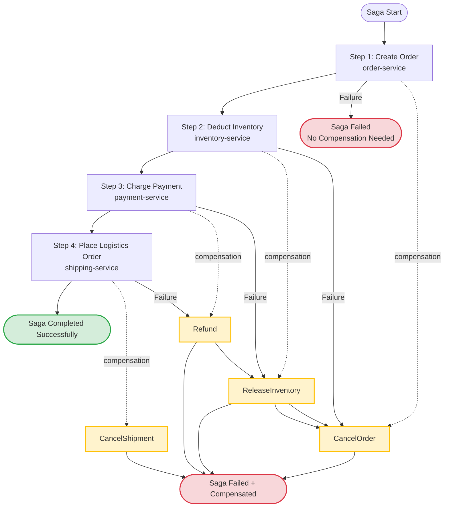
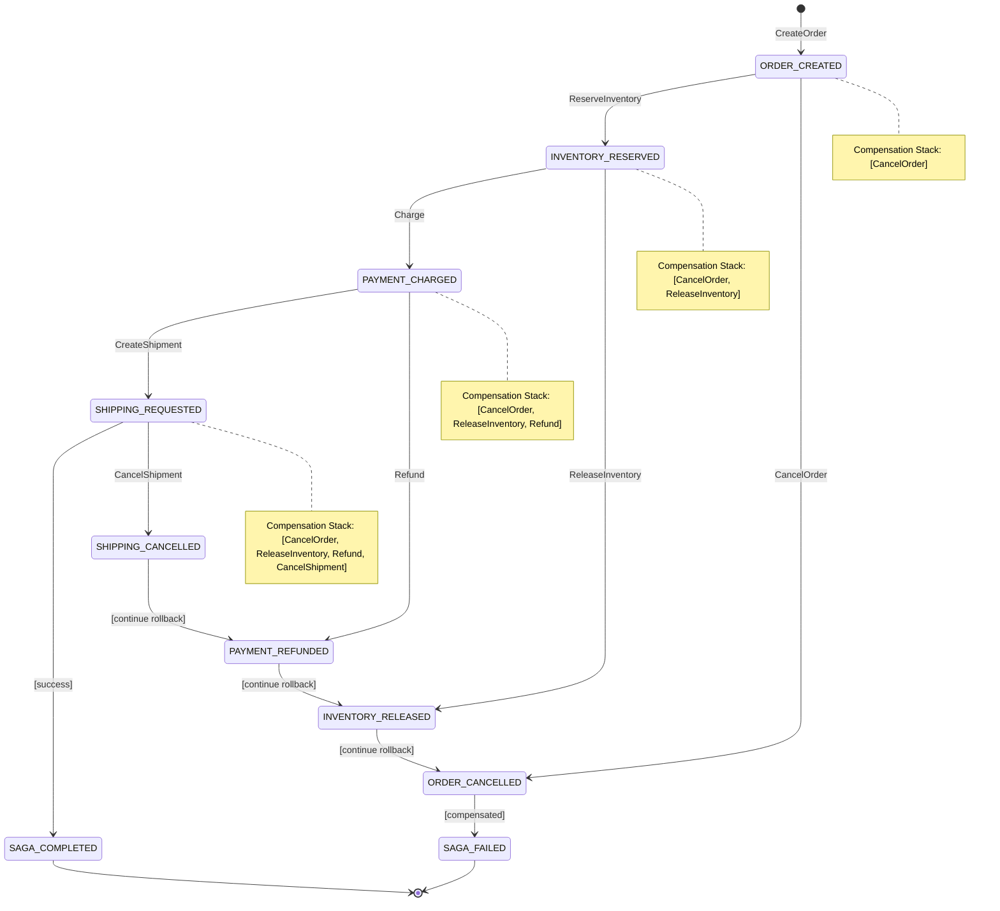

# Saga Distributed Transactions: Temporal Orchestration + Kratos Activity Execution

> **Stage**: TECH-STACK | **Prerequisites**: [Chinese source](../TECH-STACK-STREAMING-POSTGRES-TEMPORAL-KRATOS/03-integration/03.04-saga-pattern-temporal-kratos.md) | **Formalization Level**: L3-L4 | **Last Updated**: 2026-04-22

## 1. Definitions

This section establishes strict formal definitions of the Saga distributed transaction pattern in the Temporal + Kratos technology stack, laying the conceptual foundation for subsequent property derivation, engineering arguments, and example verification.

**Def-T-03-04-01 Saga Pattern (Saga Pattern)**

The Saga pattern is a distributed transaction pattern for managing data consistency across multiple services. It decomposes a long-lived transaction (LLT) into a series of local transactions \(T = \langle t_1, t_2, \ldots, t_n \rangle\), where each local transaction \(t_i\) executes only within a single service boundary and updates that service's database. For each local transaction \(t_i\), define its corresponding compensating transaction \(c_i\), satisfying \(c_i \circ t_i = \text{id}\) (restoring to the state before \(t_i\) execution at the business semantics level). If some \(t_k\) in the sequence fails, the Saga executes the compensation sequence \(C = \langle c_{k-1}, c_{k-2}, \ldots, c_1 \rangle\) to undo the effects of already-succeeded local transactions.

Formally, let a Saga be a pair \(\mathcal{S} = (T, C)\), where \(T = \langle t_1, \ldots, t_n \rangle\) is the forward transaction sequence and \(C = \langle c_1, \ldots, c_n \rangle\) is the corresponding compensation transaction sequence. The Saga execution semantics is:

$$
\text{exec}(\mathcal{S}) = \begin{cases}
t_n \circ \cdots \circ t_1 & \text{if } \forall i \in [1,n].\ t_i\ \text{succeeds} \\
c_{k-1} \circ \cdots \circ c_1 & \text{if } t_k\ \text{fails}, k > 1 \\
\text{noop} & \text{if } t_1\ \text{fails}
\end{cases}
$$

> Intuitive explanation: Saga abandons ACID isolation, exchanging explicit compensation mechanisms for availability and partition tolerance. It is not a database-level atomic commit protocol, but an application-layer consistency protocol.

**Def-T-03-04-02 Orchestration Saga (Orchestration Saga)**

Orchestration Saga is controlled by a central orchestrator that centrally manages the Saga execution order. The orchestrator maintains a Saga state machine, calling each participating service's forward operations in a predefined order; when a step failure is detected, the orchestrator actively triggers compensation operations for already-executed steps. Formally, let the orchestrator be a state machine \(\mathcal{O} = (Q, \Sigma, \delta, q_0, F)\), where \(Q\) is the state set (e.g., `ORDER_CREATED`, `INVENTORY_RESERVED`, `PAYMENT_CHARGED`, `SHIPPING_REQUESTED`), \(\Sigma\) is the event alphabet (service responses: success/failure/timeout), \(\delta: Q \times \Sigma \to Q \cup \{q_{comp}\}\) is the state transition function, and \(q_{comp}\) is the composite state entering the compensation chain.

In the Temporal technology stack, Temporal Workflow naturally assumes the orchestrator role: Workflow code defines the Saga state machine, Workflow history (History) persists the Saga's global state, and Temporal Server guarantees the orchestrator's own high availability and durable execution (see Def-T-02-02-01).

> Intuitive explanation: Orchestration Saga is like a symphony conductor — musicians (services) are only responsible for playing their own parts; when to start, when to stop, and how to remedy errors are all uniformly scheduled by the conductor (Workflow). This contrasts sharply with Choreography Saga (each service autonomously decides via event broadcast).

**Def-T-03-04-03 Compensation Transaction (Compensation)**

A compensation transaction is a business operation used to semantically undo the effects of a committed local transaction. Unlike database physical rollback (Rollback), compensation transactions execute reverse operations at the business level (e.g., the compensation for deducting inventory is restoring inventory; the compensation for charging is refunding). Formally, let service \(S_i\)'s state space be \(\mathcal{X}_i\); local transaction \(t_i: \mathcal{X}_i \to \mathcal{X}_i\) transfers state from \(x\) to \(x'\). Then compensation transaction \(c_i: \mathcal{X}_i \to \mathcal{X}_i\) must satisfy:

$$
\forall x \in \mathcal{X}_i.\quad \text{business\_equiv}(c_i(t_i(x)), x)
$$

where \(\text{business\_equiv}\) denotes business equivalence relation (not requiring byte-level state consistency, only business semantic equivalence). Compensation transaction \(c_i\) itself is also a local transaction; once committed, it cannot be physically rolled back. Therefore, compensation operations must have **eventual consistency** semantic guarantees.

> Intuitive explanation: Compensation is not "turning back time", but "doing the opposite". If a shipment has already been sent to the user, compensation is not turning the shipment back, but triggering a return process. Compensation transactions must be business-understandable, auditable, and have clear business semantics.

**Def-T-03-04-04 Idempotency (Idempotency)**

Idempotency is the property that an operation produces the same effect (at the business semantic level) when executed once and when executed multiple times. Formally, let activity \(\alpha\) be a function from request space \(\mathcal{R}\) to response space \(\mathcal{Y}\); \(\alpha\) satisfies idempotency if and only if:

$$
\forall r \in \mathcal{R}.\quad \alpha(r) \cong \alpha(\alpha(r)) \cong \alpha^n(r)
$$

where \(\cong\) denotes externally observable state equivalence. In the Saga context, idempotency is implemented through **idempotency keys**: each activity request carries a unique key \(k = \text{idempotency\_key}(r)\); the service side maintains an already-processed key set \(K_{processed}\); if \(k \in K_{processed}\), it directly returns the cached result without repeating business logic execution.

> Intuitive explanation: Temporal's deterministic replay (Def-T-02-02-05) ensures the Workflow does not "accidentally" duplicate activity scheduling, but network timeouts, Worker failures, and Temporal Server failover may still cause actual duplicate activity execution. Idempotency is the last line of defense against duplicate execution, and a necessary condition for Saga correctness.

**Def-T-03-04-05 Activity (Activity) — Saga Context**

In the Saga orchestration context, an activity is a remote procedure call issued by the orchestrator (Temporal Workflow) to a participating service (Kratos microservice), encapsulating a single Saga step (forward or compensation). Let activity \(\alpha_{saga}\) be a quintuple:

$$
\alpha_{saga} = (\text{svc}, \text{op}, \text{params}, \tau, \kappa)
$$

where \(\text{svc}\) is the target Kratos service identifier, \(\text{op} \in \{\text{forward}, \text{compensate}\}\) is the operation type, \(\text{params}\) is the request parameters, \(\tau\) is the timeout configuration (`StartToCloseTimeout`, `ScheduleToCloseTimeout`), and \(\kappa\) is the idempotency key. Activities are executed by Temporal Workers; Workers initiate calls to Kratos services via gRPC/HTTP clients; call results (success/failure/timeout) are asynchronously returned to the Workflow through Temporal Server's event mechanism.

> Intuitive explanation: Activities in Saga are "atomic operation units" that cross the runtime boundary between Temporal and Kratos. Forward activities advance Saga state; compensation activities rollback Saga state; both have symmetrical calling interfaces.

---

## 2. Properties

From the above definitions, three core runtime properties of Saga in the Temporal + Kratos architecture can be directly derived.

**Lemma-T-03-04-01 Saga Compensation Convergence Lemma (Compensation Convergence Lemma)**

*Premise*: Let Saga \(\mathcal{S} = (T, C)\) contain \(n\) forward steps; each compensation transaction \(c_i\) satisfies:

1. \(c_i\) itself terminates in finite time (finiteness);
2. \(c_i\)'s execution does not depend on other compensation transactions not yet completed (independence);
3. \(c_i\) is idempotently retryable on the Kratos service side (idempotency, Def-T-03-04-04).

*Proposition*: If the Saga fails at step \(k\) (\(1 < k \leq n\)), then the compensation sequence \(C_{<k} = \langle c_{k-1}, c_{k-2}, \ldots, c_1 \rangle\) must converge to a globally consistent state in finite time, i.e., the effects of all already-executed forward steps are semantically undone.

*Proof Sketch*:

- **Step 1 (Finite Sequence)**: \(C_{<k}\) has length \(k-1\), which is finite (\(k \leq n\) and \(n\) is a finite constant).
- **Step 2 (Item-wise Convergence)**: By premise 1, each \(c_i\) terminates in finite time. By Temporal's retry policy (see §4.4), if \(c_i\) fails due to transient faults, Temporal will reschedule \(c_i\) after exponential backoff. Since \(c_i\) is idempotent (premise 3), retry does not change the convergence result. Therefore each \(c_i\) completes with probability 1 in finite expected time.
- **Step 3 (Global Convergence)**: By premise 2, compensation transactions have no data dependencies and can be executed serially in reverse order. The orchestrator (Temporal Workflow) calls compensation activities one by one in order \(k-1, k-2, \ldots, 1\); the next compensation is only started after the previous one completes. Therefore the total execution time upper bound of \(C_{<k}\) is \(\sum_{i=1}^{k-1} \mathbb{E}[T_{c_i}]\), which is finite.
- **Step 4 (Consistency)**: By Def-T-03-04-03, each \(c_i\) semantically undoes \(t_i\)'s effect. Therefore after \(C_{<k}\) completes, for each service \(S_j\), its state satisfies the business equivalence relation \(\text{business\_equiv}\) with the state before Saga startup. ∎

**Prop-T-03-04-01 Idempotency Guarantees Saga Eventual Consistency Proposition (Idempotency Guarantees Eventual Consistency)**

*Premise*: Let all forward activities \(t_i\) and compensation activities \(c_i\) of the Saga satisfy idempotency (Def-T-03-04-04), and Temporal Server's History persistence satisfies reliability assumptions (Lemma-T-02-02-01).

*Proposition*: Regardless of how Worker failures, network partitions, service timeouts, and other fault scenarios are combined, the Saga's externally observable net effect satisfies eventual consistency — i.e., the system eventually converges to one of the following two states: (a) all forward steps succeed, global business state is consistent with Saga success semantics; or (b) the compensation sequence is fully executed, global business state is business-equivalent to the state before Saga startup.

*Argument*:

- Temporal Workflow's deterministic replay (Def-T-02-02-05) ensures the orchestrator state is precisely recovered after faults, without losing Saga execution progress or re-sending already-confirmed activity requests.
- However, activity requests may still duplicate across the network boundary (e.g., request was sent but response was lost; Temporal retries and resends).
- By the idempotency premise, Kratos services ensure duplicate requests do not produce additional side effects through idempotency key deduplication.
- Combined with Lemma-T-03-04-01 (compensation convergence), forward success completes all \(T\); forward failure completes finite compensation sequence \(C_{<k}\); the two are mutually exclusive and exhaustive.
- Therefore Saga does not have inconsistent intermediate states caused by "partial compensation" or "duplicate forward", and must eventually converge to (a) or (b). ∎

**Lemma-T-03-04-02 Saga Isolation Relaxation Lemma (Saga Isolation Relaxation Lemma)**

*Premise*: Let Saga \(\mathcal{S}\) execute across services \(S_1, \ldots, S_n\); each local transaction \(t_i\) satisfies ACID within \(S_i\) (isolation level \(I_i\)).

*Proposition*: Saga globally does not satisfy database-level isolation (Isolation). Specifically, there exist interleaved execution sequences where Saga's intermediate states are visible to external queries, causing **lost update**, **dirty read**, or **fuzzy read** anomalies.

*Proof Sketch*:

- Let the Saga contain \(t_1\): deduct inventory, \(t_2\): charge payment. After \(t_1\) commits and before \(t_2\) executes, external queries can observe the intermediate state of "inventory deducted but payment not charged".
- If \(t_2\) fails and triggers \(c_1\) (restore inventory), then external queries first observe inventory decrease, then observe inventory recovery — this is a typical non-repeatable read anomaly.
- This property is the fundamental difference between Saga pattern and 2PC: 2PC guarantees global isolation through global locks during the Prepare phase; Saga exchanges availability and performance for isolation. ∎

---

## 3. Relations

This section establishes comparative relationships between the Saga pattern and other distributed transaction solutions (2PC, TCC, local message table), providing decision-making basis for technology selection.

### 3.1 Saga vs Two-Phase Commit (2PC)

| Dimension | 2PC | Orchestration Saga (Temporal) |
|-----------|-----|------------------------------|
| **Consistency Model** | Strong consistency (atomic commit) | Eventual consistency (compensation rollback) |
| **Isolation** | Global isolation (locking during Prepare phase) | No global isolation (Lemma-T-03-04-02) |
| **Availability** | Low (coordinator single-point blocking; participants unavailable after Prepare cause transaction suspension) | High (coordinator HA guaranteed by Temporal Server; service failures do not affect other steps) |
| **Durability Guarantee** | Depends on transaction logs | Depends on Temporal History + compensation transactions |
| **Business Intrusion** | Low (database protocol layer implementation) | High (compensation logic must be written for each business operation) |
| **Applicable Scenario** | Short transactions, homogeneous databases, strong consistency requirements | Long transactions, heterogeneous services, high availability requirements |

**Relationship Conclusion**: 2PC is a database-layer atomicity protocol; Saga is an application-layer consistency protocol. In microservices architecture, service boundaries usually span heterogeneous storage (PostgreSQL, Redis, third-party payment gateways), making 2PC's XA protocol difficult to penetrate service boundaries, while Saga's compensation mechanism naturally adapts to service interface calls.

### 3.2 Saga vs TCC (Try-Confirm-Cancel)

| Dimension | TCC | Orchestration Saga (Temporal) |
|-----------|-----|------------------------------|
| **Resource Reservation** | Try phase reserves resources (e.g., freezing inventory); Confirm phase confirms; Cancel phase releases | No reservation phase; forward operations commit directly |
| **Consistency Strength** | Stronger than Saga (reservation phase prevents resources from being used by other transactions) | Weaker (no reservation, intermediate states visible) |
| **Implementation Complexity** | High (each service must implement Try/Confirm/Cancel three interfaces) | Medium (each service must implement forward + compensation two interfaces) |
| **Business Intrusion** | Extremely high (must modify business model to support resource reservation) | High (must implement compensation logic, but no need to modify core data model) |
| **Coordinator** | Usually requires self-built TCC coordinator | Temporal Workflow is a production-grade coordinator |

**Relationship Conclusion**: TCC can be viewed as an enhanced variant of Saga, trading stronger isolation for the introduction of a resource reservation phase. If the business model can naturally support reservation semantics (e.g., inventory freezing, pre-authorization), TCC is a better choice; otherwise Saga's implementation cost is significantly lower than TCC.

### 3.3 Saga vs Local Message Table (Transactional Outbox)

| Dimension | Local Message Table | Orchestration Saga (Temporal) |
|-----------|--------------------|------------------------------|
| **Core Mechanism** | Write events to Outbox table in business database, in same local transaction; forwarded to message queue by poller | Central orchestrator directly calls service interfaces; triggers compensation on failure |
| **Coupling Mode** | Asynchronous decoupling (via message queue) | Synchronous/semi-synchronous call (Temporal Activity waits for service response) |
| **Failure Handling** | Depends on message queue retry and consumer idempotency | Depends on Temporal retry, timeout, and compensation mechanisms |
| **Visibility** | Low (message consumption state scattered in each service's local event logs) | High (Saga global state is centrally recorded in Temporal History) |
| **Compensation Capability** | Weak (usually only supports retry, not cross-service rollback) | Strong (explicit compensation chain, supports semantic undo) |

**Relationship Conclusion**: The local message table solves the "reliable event delivery between services" problem; Saga solves the "cross-service long transaction consistency" problem. The two can complement each other: within Saga's forward steps, the local message table can be used to deliver domain events to the event bus, achieving atomicity of Saga state changes and event publication.

### 3.4 Relationship with PostgreSQL 18 Local Transactions

Saga is a **cross-service transaction coordination protocol**, while PG18 local transactions are **single-service data consistency protocols**. Their relationship is hierarchical inclusion:

- Each Saga step (forward or compensation) guarantees ACID within a Kratos service through PG18 local transactions.
- Saga compensates for PG18 transactions' inability to cross service boundaries at the application layer through compensation mechanisms. Saga does not replace PG18, but is built on top of PG18.
- **Boundary Clarity**: PG18 transaction boundaries are database connections; Saga boundaries are Temporal Workflow executions. A Saga step can contain multiple PG18 transactions, but a single PG18 transaction cannot span multiple Kratos services.
- **CDC Observation**: PG18's logical decoding (Logical Decoding) can capture local transaction changes corresponding to each Saga step, delivering change events to Kafka/Flink, achieving Saga execution observability and audit tracing.

---

## 4. Argumentation

### 4.1 Why Choose Orchestration Saga (Temporal Workflow as Orchestrator) Rather Than Choreography Saga

Choreography Saga achieves coordination through event broadcasting: after service A completes its operation, it publishes an event; service B listens to the event and executes the next step; on failure, compensation events are propagated in reverse. Its problems include:

1. **Circular Dependency Risk**: Each Saga participant must subscribe to upstream events and publish downstream events, leading to complex implicit dependency graphs between services, easily forming circular dependencies.
2. **State Visibility Absence**: Saga global state is scattered in each service's local event logs, making it impossible to answer simple queries like "what step is order #12345 currently at in the Saga".
3. **Compensation Order Ambiguity**: When multiple steps fail simultaneously, event propagation in choreography makes it difficult to guarantee strict reverse-order execution of compensation.
4. **Testing Difficulty**: Requires setting up the complete event bus and all participating services to perform integration testing.

Orchestration Saga solves the above problems through Temporal Workflow:

1. **Dependency Unidirectionalization**: Kratos services only need to expose forward/compensation gRPC interfaces, without perceiving the Saga's existence or subscribing to any events. Saga flow logic is completely encapsulated in Workflow code.
2. **State Centralization**: Temporal History is the single source of truth (Single Source of Truth) for the Saga; the real-time status of any Saga instance can be queried through Temporal Web UI, `tctl` CLI, or SDK.
3. **Compensation Order Strictification**: Workflow code explicitly controls compensation execution order (`for i := k-1; i >= 0; i--`), unaffected by network timing or event disorder.
4. **Testability**: Workflow code can be fully simulated in unit tests through Temporal Test Environment, without starting real Kratos services.

### 4.2 Temporal Workflow Orchestrates Cross-Kratos-Service Saga: Forward Steps + Compensation Steps

The core pattern of Temporal Workflow orchestrating Saga is the **Command-Compensation Pair**:

```go
// Forward step: call Kratos service to execute business operation
err := workflow.ExecuteActivity(ctx, ReserveInventory, params).Get(ctx, &result)
if err != nil {
    // Enter compensation chain
    for i := len(compensations) - 1; i >= 0; i-- {
        _ = workflow.ExecuteActivity(ctx, compensations[i], compensationParams[i]).Get(ctx, nil)
    }
    return err
}
// Record compensation function for subsequent failure calls
compensations = append(compensations, ReleaseInventory)
compensationParams = append(compensationParams, params)
```

Key points of this pattern:

- **Compensation Stack**: Workflow maintains a compensation function stack `compensations`; each successfully executed forward step pushes its compensation function onto the stack.
- **Reverse Pop**: On failure, pops and executes compensation functions in LIFO order, ensuring later-executed forward steps are undone first.
- **Determinism**: Due to Workflow's deterministic replay (Def-T-02-02-05), compensation stack contents are precisely recovered after Worker failure, without omission or duplicate compensation.

### 4.3 Activity Calling Kratos gRPC/HTTP API Design

Kratos microservices expose dual-protocol gRPC/HTTP interfaces (guaranteed by `kratos proto`-generated `*.pb.go` and `*.pb.validate.go`). Design points for Temporal Activity calling Kratos services via gRPC client:

**Interface Contract**:

```protobuf
service InventoryService {
  rpc ReserveInventory(ReserveRequest) returns (ReserveReply);
  rpc ReleaseInventory(ReleaseRequest) returns (ReleaseReply);
}

message ReserveRequest {
  string order_id = 1;
  string sku = 2;
  int32 quantity = 3;
  string idempotency_key = 4;  // Idempotency key
}
```

**Activity Implementation**:

```go
func ReserveInventory(ctx context.Context, req *inventoryv1.ReserveRequest) (*inventoryv1.ReserveReply, error) {
    // Inject gRPC conn (via dependency injection or global client)
    client := inventoryv1.NewInventoryServiceClient(grpcConn)
    // Propagate Temporal Activity context (including deadline) to gRPC
    ctx, cancel := context.WithTimeout(ctx, 5*time.Second)
    defer cancel()
    return client.ReserveInventory(ctx, req)
}
```

**Idempotency Key Propagation**:

- Workflow layer generates a globally unique `saga_id` for each Saga instance (typically using order number or UUID).
- Each Activity request's idempotency key format is `{saga_id}:{step_index}:{direction}`, e.g., `ORD-2026-001:0:forward`.
- Kratos service receives `x-idempotency-key` in gRPC metadata / HTTP header, and maintains an `idempotency_keys` table in PostgreSQL for deduplication.

### 4.4 Composite Resilience: Compensation Transaction Idempotency Design, Partial Failure Rollback Strategy, Timeout and Retry Strategy, Dead Letter Queue

**Compensation Transaction Idempotency Design**:
Compensation transactions themselves must be idempotent, because Temporal may reschedule compensation Activities in the following scenarios:

- Compensation request has been sent to the Kratos service and executed successfully, but the response was lost on the way back to Temporal (network partition).
- Temporal Server crashes before receiving `ActivityTaskCompleted`; after restart, the compensation Activity is re-enqueued.

Kratos service-side idempotency implementation:

```sql
-- PG18 idempotency key table
CREATE TABLE idempotency_keys (
    key VARCHAR(255) PRIMARY KEY,
    status VARCHAR(20) NOT NULL,  -- 'processing', 'completed', 'failed'
    response JSONB,
    created_at TIMESTAMPTZ DEFAULT NOW(),
    expires_at TIMESTAMPTZ DEFAULT NOW() + INTERVAL '24 hours'
);
-- Compensation operation: first check idempotency key; if exists, directly return cached result
```

**Partial Failure Rollback Strategy**:
When a Saga contains multiple parallel branches (e.g., after order creation, inventory deduction and coupon redemption can execute in parallel), there are two strategies for handling partial failures:

1. **All-or-Nothing**: Any branch failure triggers compensation of all executed branches. Suitable for strong consistency requirements.
2. **Partial Rollback with Degradation**: Non-critical branch failures are logged and the Saga continues (e.g., points gift failure does not affect the main order flow). Suitable for weak consistency requirements.

Temporal Workflow implements parallel branches via `workflow.Go` and waits for any failure via `selector.Select(ctx)`:

```go
selector := workflow.NewSelector(ctx)
selector.AddFuture(inventoryFuture, func(f workflow.Future) {
    if err := f.Get(ctx, nil); err != nil {
        failfast = true
    }
})
selector.AddFuture(couponFuture, func(f workflow.Future) {
    if err := f.Get(ctx, nil); err != nil {
        failfast = true
    }
})
selector.Select(ctx)
```

**Timeout and Retry Strategy**:
Temporal provides fine-grained timeout configuration; recommended strategies for Saga scenarios:

| Timeout Type | Configuration Recommendation | Semantic Description |
|--------------|------------------------------|----------------------|
| `StartToCloseTimeout` | Forward: 5-30s (based on business complexity); Compensation: 10-60s (compensation usually more complex) | Maximum time from Activity start to completion |
| `ScheduleToCloseTimeout` | Forward: 60s; Compensation: 300s | Maximum time from Activity scheduling to completion (including queue wait) |
| `ScheduleToStartTimeout` | 30s | Maximum wait time from Activity scheduling to actual execution start |

Retry policy (exponential backoff):

```go
retryPolicy := &temporal.RetryPolicy{
    InitialInterval:    1 * time.Second,
    BackoffCoefficient: 2.0,
    MaximumInterval:    30 * time.Second,
    MaximumAttempts:    5,
    NonRetryableErrorTypes: []string{"InvalidArgument", "NotFound"},
}
```

- Exponential backoff avoids thundering herd on the failing service.
- `NonRetryableErrorTypes` excludes business errors (e.g., insufficient inventory); such errors should not be retried, but should directly trigger the compensation chain.

**Dead Letter Queue (DLQ)**:
When a compensation transaction itself fails and retries are exhausted, the Saga enters an **uncompensable state**. At this point, failure information should be delivered to the dead letter queue for human or automated operations to intervene:

```go
if compensationErr != nil {
    // Retries exhausted
    _ = workflow.ExecuteActivity(ctx, SendToDLQ, DLQEntry{
        SagaID:      sagaID,
        StepIndex:   i,
        Error:       compensationErr.Error(),
        Timestamp:   workflow.Now(ctx),
    }).Get(ctx, nil)
    return fmt.Errorf("saga %s compensation failed at step %d: %w", sagaID, i, compensationErr)
}
```

DLQ consumers can integrate with PagerDuty / OpsGenie to trigger alerts, or integrate with automated repair scripts (e.g., batch refunds after reconciliation).

### 4.5 Relationship with PG18 Transactions

The relationship between Saga and PG18 local transactions is a **protocol-level relationship**:

- **PG18 transactions** guarantee data consistency (ACID) within a single Kratos service. Forward step \(t_i\) and compensation step \(c_i\) are both standard PG18 transactions within Kratos.
- **Saga** guarantees cross-service consistency at the application layer through compensation protocols. Saga does not replace PG18, but is built on top of PG18.
- **Boundary Clarity**: PG18 transaction boundaries are database connections; Saga boundaries are Temporal Workflow executions. A Saga step can contain multiple PG18 transactions, but a single PG18 transaction cannot span multiple Kratos services.
- **CDC Observation**: PG18's logical decoding (Logical Decoding) can capture local transaction changes corresponding to each Saga step, delivering change events to Kafka/Flink, achieving Saga execution observability and audit tracing.

---

## 5. Proof / Engineering Argument

**Thm-T-03-04-01 Saga Finite Compensation Eventual Consistency Theorem (Finite Compensation Eventual Consistency Theorem)**

*Premise*:

1. Let Saga \(\mathcal{S} = (T, C)\) contain a finite number of forward steps \(n \in \mathbb{N}\).
2. Each compensation transaction \(c_i \in C\) satisfies:
   - (P1) **Termination**: \(c_i\) completes in finite expected time;
   - (P2) **Idempotency**: \(c_i\) is idempotent (Def-T-03-04-04);
   - (P3) **Semantic Correctness**: \(c_i\) semantically undoes \(t_i\)'s effect (Def-T-03-04-03).
3. Temporal Server's persistent storage (PostgreSQL) satisfies reliability assumptions (Lemma-T-02-02-01).
4. Temporal Worker's Activity execution satisfies "at-least-once delivery, at-most-once semantic commit" (guaranteed by Server's task deduplication and Workflow deterministic replay, Prop-T-02-02-01).

*Proposition*: Under any fault scenario, the Saga's externally observable global state must eventually converge to one of the following two final states:

- **Success Final State** \(S_{success}\): All forward steps \(t_1, \ldots, t_n\) succeed;
- **Failure Final State** \(S_{failed}\): There exists \(k \in [1, n]\) such that \(t_k\) fails, and compensation sequence \(c_{k-1}, \ldots, c_1\) all succeed.

*Proof*:

**Case A: All Forward Steps Succeed**

If \(\forall i \in [1,n].\ t_i\) succeeds, then by Saga execution semantics (Def-T-03-04-01), the orchestrator completes the Saga after executing \(t_n\). By Temporal's durable execution guarantee (Def-T-02-02-01), once the `ActivityTaskCompleted` event is written to History and storage-acknowledged, the event will not be lost. Therefore all \(t_i\)'s semantic effects persist in each service's PG18 database; global state is \(S_{success}\). This case obviously converges. ∎

**Case B: Forward Step Failure Exists**

Let \(k\) be the index of the first failed forward step (guaranteed unique by orchestrator's sequential execution). We need to prove compensation sequence \(C_{<k}\) must converge.

- **Step 1 (Compensation Sequence Finiteness)**: \(C_{<k} = \langle c_{k-1}, c_{k-2}, \ldots, c_1 \rangle\) has length \(k-1 < n\), which is finite (premise 1).

- **Step 2 (Single-Step Compensation Convergence)**: Consider arbitrary \(c_i \in C_{<k}\). By premise 2-(P1), \(c_i\) completes in finite expected time. If \(c_i\) fails due to transient faults (network timeout, service temporarily unavailable), Temporal's retry policy (exponential backoff) reschedules \(c_i\) in finite time. By premise 2-(P2), \(c_i\) is idempotent, so repeated execution does not change the convergence result. By premise 4, Temporal guarantees at-most-once semantic commit of \(c_i\) (completed activities are not re-executed during replay). Therefore \(c_i\) completes with probability 1 in finite expected time.

- **Step 3 (Full Sequence Compensation Convergence)**: The orchestrator serially schedules compensation activities in order \(i = k-1, k-2, \ldots, 1\). By Step 2, each \(c_i\)'s completion time expectation is finite; by serial execution, total completion time expectation is \(\sum_{i=1}^{k-1} \mathbb{E}[T_{c_i}] < \infty\). Therefore \(C_{<k}\) completes in finite expected time.

- **Step 4 (Final State Consistency)**: By premise 2-(P3), each \(c_i\) semantically undoes \(t_i\). Therefore after \(C_{<k}\) completes, for each service \(S_j\), its state satisfies \(\text{business\_equiv}\) with the state before Saga startup. Global state is \(S_{failed}\). ∎

**Case C: Compensation Itself Fails**

If some \(c_i\) fails due to business errors (e.g., refund interface returns "order not found") or non-transient technical faults, Temporal retries will exhaust `MaximumAttempts`. At this point the Saga enters an **uncompensable state**, not satisfying the above final state. But by engineering practice (§4.4 dead letter queue), such scenarios are explicitly captured and delivered to DLQ for human intervention. From a formal perspective, we declare this premise as an **engineering assumption**: compensation transaction design should guarantee all business-compensable scenarios are covered; uncompensable scenarios belong to business design defects rather than protocol defects. ∎

In summary, under premises 1-4 and compensable coverage, Saga must converge to \(S_{success}\) or \(S_{failed}\), satisfying eventual consistency. ∎

**Engineering Corollary**: This theorem shows that Saga's eventual consistency does not depend on network-synchronized clocks, global locks, or blocking protocols, but only on finite steps, idempotent compensation, and reliable persistence. This makes Saga extremely applicable in distributed systems across regions, clouds, and heterogeneous storage.

---

## 6. Examples

This section provides a complete Saga example: an e-commerce order creation flow. This Saga contains four forward steps: order creation → inventory deduction → payment charging → logistics order placement, each with corresponding compensation logic.

### 6.1 Business Scenario Definition

| Step | Forward Operation | Compensation Operation | Service |
|------|------------------|----------------------|---------|
| 1 | Create order (status=pending payment) | Cancel order (status=cancelled) | order-service |
| 2 | Deduct inventory | Restore inventory | inventory-service |
| 3 | Charge payment | Refund | payment-service |
| 4 | Place logistics order | Cancel logistics order | shipping-service |

### 6.2 Kratos Service Interface Definition

```protobuf
// api/order/v1/order.proto
service OrderService {
  rpc CreateOrder(CreateOrderRequest) returns (CreateOrderReply);
  rpc CancelOrder(CancelOrderRequest) returns (CancelOrderReply);
}

message CreateOrderRequest {
  string order_id = 1;
  string user_id = 2;
  repeated OrderItem items = 3;
  string idempotency_key = 4;
}

// api/inventory/v1/inventory.proto
service InventoryService {
  rpc ReserveInventory(ReserveRequest) returns (ReserveReply);
  rpc ReleaseInventory(ReleaseRequest) returns (ReleaseReply);
}

// api/payment/v1/payment.proto
service PaymentService {
  rpc Charge(ChargeRequest) returns (ChargeReply);
  rpc Refund(RefundRequest) returns (RefundReply);
}

// api/shipping/v1/shipping.proto
service ShippingService {
  rpc CreateShipment(CreateShipmentRequest) returns (CreateShipmentReply);
  rpc CancelShipment(CancelShipmentRequest) returns (CancelShipmentReply);
}
```

### 6.3 Temporal Workflow Implementation

```go
package saga

import (
    "fmt"
    "time"

    "go.temporal.io/sdk/workflow"
    "go.temporal.io/sdk/temporal"

    orderv1 "github.com/example/shop/api/order/v1"
    inventoryv1 "github.com/example/shop/api/inventory/v1"
    paymentv1 "github.com/example/shop/api/payment/v1"
    shippingv1 "github.com/example/shop/api/shipping/v1"
)

// OrderSagaInput is the Saga input parameter
type OrderSagaInput struct {
    OrderID   string
    UserID    string
    Items     []*orderv1.OrderItem
}

// OrderSagaResult is the Saga output result
type OrderSagaResult struct {
    Success      bool
    OrderID      string
    ShipmentID   string
    ErrorMessage string
}

// compensation records compensation function and its parameters
type compensation struct {
    Name string
    Fn   interface{}
    Args interface{}
}

// OrderSagaWorkflow is the Temporal Workflow implementation of the order Saga
func OrderSagaWorkflow(ctx workflow.Context, input OrderSagaInput) (*OrderSagaResult, error) {
    // Workflow options: global retry policy
    ao := workflow.ActivityOptions{
        StartToCloseTimeout: 30 * time.Second,
        RetryPolicy: &temporal.RetryPolicy{
            InitialInterval:    1 * time.Second,
            BackoffCoefficient: 2.0,
            MaximumInterval:    30 * time.Second,
            MaximumAttempts:    5,
            NonRetryableErrorTypes: []string{
                "InvalidArgument",
                "AlreadyExists",
                "FailedPrecondition",
            },
        },
    }
    ctx = workflow.WithActivityOptions(ctx, ao)

    sagaID := input.OrderID
    var compensations []compensation

    // --- Step 1: Create order ---
    createOrderReq := &orderv1.CreateOrderRequest{
        OrderId:        input.OrderID,
        UserId:         input.UserID,
        Items:          input.Items,
        IdempotencyKey: fmt.Sprintf("%s:0:forward", sagaID),
    }
    var createOrderResp orderv1.CreateOrderReply
    if err := workflow.ExecuteActivity(ctx, CreateOrderActivity, createOrderReq).Get(ctx, &createOrderResp); err != nil {
        return &OrderSagaResult{Success: false, OrderID: input.OrderID, ErrorMessage: err.Error()}, err
    }
    // Record compensation
    compensations = append(compensations, compensation{
        Name: "CancelOrder",
        Fn:   CancelOrderActivity,
        Args: &orderv1.CancelOrderRequest{
            OrderId:        input.OrderID,
            IdempotencyKey: fmt.Sprintf("%s:0:compensate", sagaID),
        },
    })

    // --- Step 2: Deduct inventory ---
    // Aggregate inventory request (simplified example: assume all items from same warehouse)
    var sku string
    var qty int32
    if len(input.Items) > 0 {
        sku = input.Items[0].Sku
        qty = input.Items[0].Quantity
    }
    reserveReq := &inventoryv1.ReserveRequest{
        OrderId:        input.OrderID,
        Sku:            sku,
        Quantity:       qty,
        IdempotencyKey: fmt.Sprintf("%s:1:forward", sagaID),
    }
    var reserveResp inventoryv1.ReserveReply
    if err := workflow.ExecuteActivity(ctx, ReserveInventoryActivity, reserveReq).Get(ctx, &reserveResp); err != nil {
        // Trigger compensation chain
        if compErr := runCompensations(ctx, compensations); compErr != nil {
            return nil, fmt.Errorf("saga failed and compensation also failed: %w", compErr)
        }
        return &OrderSagaResult{Success: false, OrderID: input.OrderID, ErrorMessage: err.Error()}, err
    }
    compensations = append(compensations, compensation{
        Name: "ReleaseInventory",
        Fn:   ReleaseInventoryActivity,
        Args: &inventoryv1.ReleaseRequest{
            OrderId:        input.OrderID,
            Sku:            sku,
            Quantity:       qty,
            IdempotencyKey: fmt.Sprintf("%s:1:compensate", sagaID),
        },
    })

    // --- Step 3: Charge payment ---
    // Calculate total price (simplified)
    var totalAmount int64 = 10000 // Unit: cents
    chargeReq := &paymentv1.ChargeRequest{
        OrderId:        input.OrderID,
        UserId:         input.UserID,
        Amount:         totalAmount,
        Currency:       "CNY",
        IdempotencyKey: fmt.Sprintf("%s:2:forward", sagaID),
    }
    var chargeResp paymentv1.ChargeReply
    if err := workflow.ExecuteActivity(ctx, ChargeActivity, chargeReq).Get(ctx, &chargeResp); err != nil {
        if compErr := runCompensations(ctx, compensations); compErr != nil {
            return nil, fmt.Errorf("saga failed and compensation also failed: %w", compErr)
        }
        return &OrderSagaResult{Success: false, OrderID: input.OrderID, ErrorMessage: err.Error()}, err
    }
    compensations = append(compensations, compensation{
        Name: "Refund",
        Fn:   RefundActivity,
        Args: &paymentv1.RefundRequest{
            OrderId:        input.OrderID,
            TransactionId:  chargeResp.TransactionId,
            Amount:         totalAmount,
            IdempotencyKey: fmt.Sprintf("%s:2:compensate", sagaID),
        },
    })

    // --- Step 4: Place logistics order ---
    shipReq := &shippingv1.CreateShipmentRequest{
        OrderId:        input.OrderID,
        UserId:         input.UserID,
        Address:        "Beijing Haidian District...",
        IdempotencyKey: fmt.Sprintf("%s:3:forward", sagaID),
    }
    var shipResp shippingv1.CreateShipmentReply
    if err := workflow.ExecuteActivity(ctx, CreateShipmentActivity, shipReq).Get(ctx, &shipResp); err != nil {
        if compErr := runCompensations(ctx, compensations); compErr != nil {
            return nil, fmt.Errorf("saga failed and compensation also failed: %w", compErr)
        }
        return &OrderSagaResult{Success: false, OrderID: input.OrderID, ErrorMessage: err.Error()}, err
    }
    compensations = append(compensations, compensation{
        Name: "CancelShipment",
        Fn:   CancelShipmentActivity,
        Args: &shippingv1.CancelShipmentRequest{
            ShipmentId:     shipResp.ShipmentId,
            IdempotencyKey: fmt.Sprintf("%s:3:compensate", sagaID),
        },
    })

    // Saga completed successfully
    return &OrderSagaResult{
        Success:    true,
        OrderID:    input.OrderID,
        ShipmentID: shipResp.ShipmentId,
    }, nil
}

// runCompensations executes compensation chain in LIFO order
func runCompensations(ctx workflow.Context, comps []compensation) error {
    // Compensation uses looser policy: longer timeout, more retries
    compensateAO := workflow.ActivityOptions{
        StartToCloseTimeout: 60 * time.Second,
        RetryPolicy: &temporal.RetryPolicy{
            InitialInterval:    2 * time.Second,
            BackoffCoefficient: 2.0,
            MaximumInterval:    60 * time.Second,
            MaximumAttempts:    10, // More compensation retries
        },
    }
    ctx = workflow.WithActivityOptions(ctx, compensateAO)

    for i := len(comps) - 1; i >= 0; i-- {
        c := comps[i]
        if err := workflow.ExecuteActivity(ctx, c.Fn, c.Args).Get(ctx, nil); err != nil {
            // Compensation failed: deliver to dead letter queue
            _ = workflow.ExecuteActivity(ctx, SendToDLQActivity, DLQEntry{
                SagaID:    "", // Obtain from context or parameters
                StepName:  c.Name,
                Error:     err.Error(),
                Timestamp: workflow.Now(ctx),
            }).Get(ctx, nil)
            return fmt.Errorf("compensation %s failed: %w", c.Name, err)
        }
    }
    return nil
}
```

### 6.4 Kratos Service-Side Idempotency Implementation (Activity Layer)

```go
package activity

import (
    "context"
    "fmt"

    orderv1 "github.com/example/shop/api/order/v1"
    "github.com/example/shop/app/order/service/internal/service"
)

// CreateOrderActivity is the Temporal Activity implementation
type CreateOrderActivity struct {
    orderSvc *service.OrderService // Kratos injected business service
}

func (a *CreateOrderActivity) CreateOrder(ctx context.Context, req *orderv1.CreateOrderRequest) (*orderv1.CreateOrderReply, error) {
    // Call Kratos internal OrderService (idempotency logic already encapsulated)
    return a.orderSvc.CreateOrder(ctx, req)
}
```

Kratos `OrderService` internal idempotency implementation:

```go
package service

import (
    "context"
    "errors"

    "github.com/go-kratos/kratos/v2/log"
)

type OrderService struct {
    repo        *data.OrderRepo
    idempotency *data.IdempotencyRepo
    log         *log.Helper
}

func (s *OrderService) CreateOrder(ctx context.Context, req *orderv1.CreateOrderRequest) (*orderv1.CreateOrderReply, error) {
    // 1. Idempotency check
    if cached, err := s.idempotency.Get(ctx, req.IdempotencyKey); err == nil && cached != nil {
        s.log.Infof("idempotency hit: key=%s", req.IdempotencyKey)
        return cached.Response, nil
    }

    // 2. Record idempotency key as processing (prevent concurrent duplicate execution)
    if err := s.idempotency.Set(ctx, req.IdempotencyKey, "processing", nil); err != nil {
        return nil, err
    }

    // 3. Execute business logic (within PG18 local transaction)
    order, err := s.repo.Create(ctx, req)
    if err != nil {
        _ = s.idempotency.Set(ctx, req.IdempotencyKey, "failed", nil)
        return nil, err
    }

    // 4. Cache response and mark completed
    resp := &orderv1.CreateOrderReply{OrderId: order.ID, Status: order.Status}
    _ = s.idempotency.Set(ctx, req.IdempotencyKey, "completed", resp)

    return resp, nil
}
```

### 6.5 Worker Registration and Startup

```go
package main

import (
    "log"

    "go.temporal.io/sdk/client"
    "go.temporal.io/sdk/worker"

    "github.com/example/shop/app/saga"
)

func main() {
    c, err := client.Dial(client.Options{
        HostPort: "localhost:7233",
    })
    if err != nil {
        log.Fatalln("unable to create Temporal client", err)
    }
    defer c.Close()

    w := worker.New(c, "order-saga-queue", worker.Options{})

    // Register Workflow
    w.RegisterWorkflow(saga.OrderSagaWorkflow)

    // Register Activities
    w.RegisterActivity(saga.CreateOrderActivity)
    w.RegisterActivity(saga.CancelOrderActivity)
    w.RegisterActivity(saga.ReserveInventoryActivity)
    w.RegisterActivity(saga.ReleaseInventoryActivity)
    w.RegisterActivity(saga.ChargeActivity)
    w.RegisterActivity(saga.RefundActivity)
    w.RegisterActivity(saga.CreateShipmentActivity)
    w.RegisterActivity(saga.CancelShipmentActivity)
    w.RegisterActivity(saga.SendToDLQActivity)

    if err := w.Run(worker.InterruptCh()); err != nil {
        log.Fatalln("unable to start Worker", err)
    }
}
```

---

## 7. Visualizations

### 7.1 Saga Execution Flow and Compensation Chain

The following diagram shows the complete execution flow of orchestration Saga, including the success path and the compensation rollback path on failure.



**Description**: Green nodes indicate success final state; red nodes indicate failure final state; yellow nodes indicate compensation operations. Solid arrows indicate forward execution paths; dashed arrows indicate corresponding compensation capabilities for each step; thick solid arrows indicate the compensation chain actually triggered on failure. Compensation strictly follows LIFO order: if Step 3 fails, first execute Refund (undo Step 3), then execute ReleaseInventory (undo Step 2), and finally execute CancelOrder (undo Step 1).

### 7.2 Success/Failure State Machine

The following diagram shows the Saga state machine maintained inside Temporal Workflow, including forward state transitions and rollback state transitions on failure.



**Description**: In the state machine, each forward transition pushes the corresponding compensation operation onto the compensation stack. When any forward transition fails, the state machine enters the rollback path, popping and executing compensation operations from the compensation stack in LIFO order until returning to the initial state or entering the `SAGA_FAILED` final state. Temporal's deterministic replay guarantees this state machine is precisely recovered after Worker failure.

---

### 3.5 Project Knowledge Base Cross-References

The Saga distributed transaction pattern described in this document relates to the existing project knowledge base as follows:

- [Transactional Stream Processing Deep Dive](../Knowledge/06-frontier/transactional-stream-processing-deep-dive.md) — Formal comparison of Saga with 2PC/TCC and other transaction patterns
- [Temporal + Flink Layered Architecture](../Knowledge/06-frontier/temporal-flink-layered-architecture.md) — Collaboration between control-plane workflow orchestration and data-plane stream processing
- [High Availability Patterns](../Knowledge/07-best-practices/07.06-high-availability-patterns.md) — High availability design of Saga compensation in production environments
- [Data Mesh Streaming Integration](../Knowledge/03-business-patterns/data-mesh-streaming-integration.md) — Relationship between Saga transaction boundaries and data product autonomy

## 8. References


---

*Document completion date: 2026-04-22 | Version: v1.0 | Status: Production*
