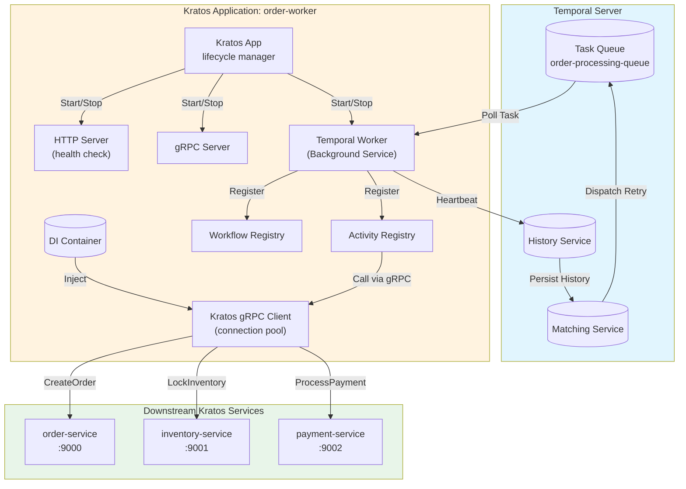

# Temporal Worker and Kratos Microservices Integration Practice

> **Stage**: TECH-STACK | **Prerequisites**: [Chinese source](../TECH-STACK-STREAMING-POSTGRES-TEMPORAL-KRATOS/03-integration/03.02-temporal-kratos-worker-integration.md) | **Formalization Level**: L3-L4 | **Last Updated**: 2026-04-22

## 1. Definitions

This section provides strict formal definitions of the core concepts involved in Temporal Worker and Kratos microservices integration, laying the conceptual foundation for subsequent property derivation and engineering arguments.

**Def-T-03-01 (Temporal Worker)**

A Temporal Worker is a long-running process entity responsible for pulling Tasks (including Workflow Tasks and Activity Tasks) from a Task Queue designated by the Temporal Server, and executing the corresponding Workflow or Activity implementations locally. Formally, let the Temporal Server's Task Queue be queue \(Q\), and the Worker set be \(W = \{w_1, w_2, \dots, w_n\}\). Then Worker \(w_i\)'s behavior can be described as a process that cyclically executes the following operations:

$$
\text{Poll}(Q) \rightarrow \text{Execute}(t) \rightarrow \text{Respond}(r)
$$

where \(\text{Poll}(Q)\) denotes long-polling Task \(t\) from queue \(Q\), \(\text{Execute}(t)\) denotes executing the Task locally, and \(\text{Respond}(r)\) denotes returning the execution result \(r\) (success, failure, or Heartbeat) to the Temporal Server. The Worker's semantic guarantee is at-least-once execution: if Task \(t\) is Polled but Respond is not received within the specified timeout, the Server re-enqueues \(t\).

**Def-T-03-02 (Activity)**

An Activity is the basic work unit in a Temporal Workflow that produces side effects on external systems or performs long-running computations. Unlike deterministic Workflow functions, Activities may contain non-deterministic operations (e.g., I/O, calling external APIs, accessing databases). Formally, an Activity is a function mapping \(A: C \times I \rightarrow O \cup \{\bot\}\), where \(C\) is the Activity context (containing `activity.Context`, Heartbeat channel, etc.), \(I\) is the input parameter space, \(O\) is the output space, and \(\bot\) denotes execution failure or timeout. The Activity execution semantics require idempotency: for any input \(i \in I\), multiple executions of \(A(c, i)\) should produce effects equivalent to a single execution at the business level.

**Def-T-03-03 (Task Queue)**

A Task Queue is a logical queue abstraction provided by the Temporal Server, used to decouple Task producers (Workflow scheduler) from consumers (Worker). Task Queue \(Q\) supports two types of Tasks: Workflow Task (triggered by Workflow state machine) and Activity Task (triggered by `ExecuteActivity` call). Formally, \(Q\) is a first-in-first-out (FIFO) queue whose state transitions satisfy:

$$
Q_{t+1} =
\begin{cases}
Q_t \cup \{task\}, & \text{if } \text{Enqueue}(task) \\
Q_t \setminus \{task\}, & \text{if } \text{Poll}() = task \land \text{Accept}(task) \\
Q_t, & \text{otherwise}
\end{cases}
$$

Task Queues are isolated by namespace; Workers subscribe to specific queues by specifying `TaskQueueName`.

**Def-T-03-04 (Heartbeat)**

Heartbeat is a periodic liveness signal sent by a long-running Activity to the Temporal Server. Let the maximum allowed no-signal time for an Activity be \(\tau_h\) (`HeartbeatTimeout`), and the actual Heartbeat send time sequence be \(\{h_1, h_2, \dots, h_k\}\). Then the Heartbeat semantic guarantee is: if for current time \(t\), \(t - \max(\{h_i\}) > \tau_h\), the Server judges the Activity execution as failed and triggers timeout handling (retry or failure). Formally, define the liveness predicate:

$$
\text{Alive}(t) \iff t - \max(\{h_i \mid h_i \leq t\}) \leq \tau_h
$$

Heartbeat also carries progress information payload \(p\), allowing the Workflow to query Activity execution progress via `GetHeartbeatDetails`.

**Def-T-03-05 (Sticky Execution)**

Sticky Execution is a caching mechanism introduced by Temporal to optimize Workflow Task execution latency. After Worker \(w\) first executes a Task for a Workflow Execution, the Server marks that Workflow's execution state (Workflow State, including command history and executed Events) as "Sticky" and associates it with \(w\). Subsequent Tasks for that Workflow are preferentially routed to \(w\)'s Sticky Task Queue (an in-memory private queue), avoiding full-history Event pull from the Server. Formally, let Workflow Execution \(e\)'s state be \(S_e\), and Worker \(w\)'s Sticky cache be \(C_w\). Then:

$$
\text{Route}(e) =
\begin{cases}
\text{StickyQueue}(w), & \text{if } S_e \in C_w \\
\text{OriginalQueue}(Q), & \text{otherwise}
\end{cases}
$$

If \(w\) crashes causing \(C_w\) loss, the Server automatically falls back to OriginalQueue for rescheduling, guaranteeing execution continuity.

---

## 2. Properties

Based on the above definitions, we derive key properties of Temporal Worker in the Kratos microservices context.

**Lemma-T-03-01 (Fairness of Task Redistribution After Worker Crash)**

Let Task Queue \(Q\) have \(m\) pending Activity Tasks, and Worker set be \(W = \{w_1, \dots, w_n\}\). If Worker \(w_i\) crashes at time \(t_c\), its currently executing Task set is \(T_i = \{t_{i1}, \dots, t_{ik}\}\). Then for any \(t_j \in T_i\), the Server re-places it at the tail of \(Q\) within \(\tau_s\) (`ScheduleToStartTimeout`). At this point, remaining Workers \(W' = W \setminus \{w_i\}\) compete for \(t_j\) via long-polling. Since Temporal Go SDK's Poll implementation is based on uniform random distribution (Server-side Round-Robin weighted), the probability that \(t_j\) is obtained by any \(w_l \in W'\) satisfies:

$$
P(w_l \text{ gets } t_j) = \frac{\text{capacity}(w_l)}{\sum_{w \in W'} \text{capacity}(w)}
$$

where \(\text{capacity}(w)\) is the concurrency slot count configured for Worker \(w\) (`MaxConcurrentActivityExecutionSize`). When all Workers have the same configuration, \(P(w_l \text{ gets } t_j) = \frac{1}{|W'|}\), i.e., task redistribution satisfies uniform fairness.

*Proof Sketch*: Temporal Server's matching engine (Matching Service) uses partitioned Task Queue implementation; each partition independently matches Tasks to Workers. Workers register with the matching engine via `PollActivityTaskQueue` long-polling requests; when a Task is available, the Server assigns it to waiting Workers on a first-come-first-served (FCFS) basis. After Worker crash, its unacknowledged long connections disconnect; the Server re-marks unfinished Tasks as available in the corresponding Task Partition and re-enters the matching flow. Since the matching engine does not maintain Worker-Task affinity (except for Sticky Workflow Tasks), redistributed Tasks are uniformly distributed among all healthy Workers. \(\square\)

**Prop-T-03-02 (Heartbeat Progress Recoverability)**

Let Activity \(A\) start execution at time \(t_0\), send Heartbeat with progress state \(p_1\) at time \(t_1\), and crash at time \(t_2 > t_1\). The Temporal Server detects timeout at \(t_2 + \tau_h\), triggering Activity retry. The new Activity execution \(A'\) can obtain the last recorded progress \(p_1\) via `activity.GetHeartbeatDetails(ctx)`. Then \(A'\) can continue execution from state \(p_1\) rather than from the beginning, satisfying:

$$
\text{Progress}(A') \geq \text{Progress}(A, t_1)
$$

*Proof Sketch*: Temporal Server persistently stores each Heartbeat's Details payload into the Workflow Execution Event History. When an Activity is retried due to timeout or failure, the Server carries the `lastHeartbeatDetails` field in the dispatched Activity Task. The Activity implementation deserializes this payload via the SDK-provided `GetHeartbeatDetails`, achieving breakpoint resume. This mechanism is guaranteed atomically by the Server: Heartbeat persistence and Task timeout judgment are completed in the same transaction. \(\square\)

**Prop-T-03-03 (Activity Idempotency and Side-Effect Consistency)**

Let Activity \(A\) produce side effect \(S\) on the Kratos microservice (e.g., creating an order, updating status), and \(A\) uses a business-layer idempotency key \(k\). Then for any multiple executions of \(A\) (including retries, duplicate executions caused by Worker migration), the side effect satisfies:

$$
\forall n \geq 1, \quad S(A(c, i, k), n) = S(A(c, i, k), 1)
$$

That is, the side effect of the \(n\)-th execution is indistinguishable from the first execution at the business level.

---

## 3. Relations

This section establishes the hosting relationship and interaction mapping between Temporal Worker and Kratos microservices.

**Temporal Worker and Kratos Service Hosting Relationship**

In the Kratos microservices architecture, the Temporal Worker is not an independently deployed process, but a hosted component within the Kratos `App` lifecycle. Their relationship can be formally described as the following hierarchy:

```
Kratos Application (App)
├── HTTP Server (transport/http)
├── gRPC Server (transport/grpc)
├── Background Services (registry.Registrar)
│   └── Temporal Worker (worker.Worker)
│       ├── Workflow Registry
│       └── Activity Registry
└── Dependency Injection Container
```

Specific mapping relationships are as follows:

| Kratos Component | Temporal Component | Relationship Description |
|------------------|-------------------|--------------------------|
| `App` (Lifecycle Management) | `worker.Worker` | Hosting: Worker is registered as a Background Service in Kratos App, starts with App startup, and stops gracefully with App shutdown |
| `transport/grpc.Client` | Inside Activity Implementation | Dependency Injection: Activity functions obtain configured gRPC clients through Kratos DI container to call other Kratos services |
| `log.Helper` | `zap.Logger` (Temporal SDK) | Log Bridging: Kratos log interface is adapted to Temporal SDK's logger interface for unified log output |
| `config.Value` | Client/Worker Configuration | Unified Configuration: Temporal connection parameters and timeout configurations are read from Kratos unified configuration center (e.g., etcd, consul) |

**Execution Flow Relationship**

There is an essential difference between Workflow execution semantics and Kratos service call semantics: Workflow is a deterministic state machine, while Kratos gRPC calls are side-effect operations. The boundary is clear: Workflow functions only orchestrate logic (conditional branches, timers, sub-Workflows, Activity calls), and all side-effect operations must be encapsulated in Activities. Activities serve as the bridge between the Temporal world and the Kratos world, internally communicating with external services via Kratos gRPC/HTTP clients.

---

## 4. Argumentation

### 4.1 Starting Temporal Worker Inside Kratos Service

The standard initialization flow for integrating Temporal Worker in a Kratos microservice contains four steps: creating Temporal Client, defining Workflow and Activity, registering to Worker, and starting Worker as a background service.

**Step 1: Initialize Temporal Client**

Temporal Client is the entry point for communicating with Temporal Server, responsible for initiating Workflow execution, sending Signals, querying state, etc. In a Kratos service, the Client should be created during application initialization and injected into the DI container:

```go
import (
    "go.temporal.io/sdk/client"
)

type TemporalClient struct {
    client.Client
}

func NewTemporalClient(cfg *conf.Temporal) (client.Client, error) {
    c, err := client.NewClient(client.Options{
        HostPort:  cfg.HostPort,      // e.g., "localhost:7233"
        Namespace: cfg.Namespace,     // e.g., "default"
        Logger:    NewTemporalLogger(), // Adapt Kratos logger
    })
    if err != nil {
        return nil, err
    }
    return c, nil
}
```

Client creation is a heavyweight operation (establishing gRPC connection, namespace resolution); singleton mode should be guaranteed, injected via Kratos's Provider mechanism.

**Step 2: Register Workflow and Activity**

Workers register Go functions to internal reflection tables via `RegisterWorkflow` and `RegisterActivity`. Registration must be completed before `worker.Start()`:

```go
w := worker.New(temporalClient, taskQueueName, worker.Options{
    MaxConcurrentActivityExecutionSize:     100,
    MaxConcurrentWorkflowTaskExecutionSize: 50,
    WorkerActivitiesPerSecond:              100.0,
})

// Register Workflow
w.RegisterWorkflow(MyWorkflow)

// Register Activity — supports struct method registration for dependency injection
activitySet := &Activities{KratosClient: kratosGrpcClient}
w.RegisterActivity(activitySet)
```

**Step 3: Wrap Worker as Kratos Background Service**

Kratos's `registry.Registrar` interface allows registration of custom background services. Wrapping Temporal Worker to align lifecycles:

```go
type TemporalWorker struct {
    worker worker.Worker
}

func (w *TemporalWorker) Start(ctx context.Context) error {
    return w.worker.Start()
}

func (w *TemporalWorker) Stop(ctx context.Context) error {
    w.worker.Stop()
    return nil
}
```

In `main.go`, register via `app.Append`:

```go
app.Append(&TemporalWorker{worker: w})
```

When Kratos receives termination signals (SIGTERM/SIGINT), it sequentially calls `Stop` methods of all registered services. Worker's `Stop` gracefully closes the Poll loop, waiting for executing Tasks to complete (subject to `GracefulShutdownTimeout` limit).

### 4.2 Activity Calling Kratos gRPC/HTTP API Client Configuration

When Activities internally call Kratos services, they should reuse Kratos's transport clients rather than using bare `net/http` or `google.golang.org/grpc`.

**gRPC Client Configuration**

```go
import (
    "github.com/go-kratos/kratos/v2/transport/grpc"
)

func NewKratosGRPCClient(cfg *conf.Client) (pb.MyServiceClient, error) {
    conn, err := grpc.DialInsecure(
        context.Background(),
        grpc.WithEndpoint(cfg.Endpoint),
        grpc.WithTimeout(cfg.Timeout),
        grpc.WithMiddleware(
            recovery.Recovery(),
            tracing.Client(),
            logging.Client(),
        ),
    )
    if err != nil {
        return nil, err
    }
    return pb.NewMyServiceClient(conn), nil
}
```

Key configuration items:

- **Connection Pool**: gRPC is based on HTTP/2 multiplexing; a single connection can carry high concurrency. Kratos gRPC client maintains a connection pool by default; tune via `grpc.WithOptions(grpc.WithKeepaliveParams(...))`.
- **Timeout**: Activity's `StartToCloseTimeout` should be greater than the sum of gRPC call timeout and total retry time, avoiding Activity timeout while underlying gRPC is still blocking.
- **Retry**: Recommended to configure retry policy in Kratos client middleware layer (e.g., `retry.Client()`) rather than manually retrying in the Activity layer, to unify backoff behavior for all outbound calls.

### 4.3 Composite Resilience Design

**Activity Timeout Strategy**

Temporal provides two core timeout parameters:

- `StartToCloseTimeout`: Maximum allowed time from when an Activity Task is pulled by a Worker to when the Activity execution completes (or sends the last Heartbeat). Suitable for most Activities.
- `ScheduleToCloseTimeout`: Total time limit from when an Activity is scheduled (Workflow initiates `ExecuteActivity`) to when the Activity finally completes, including all retry waiting time. Suitable for scenarios with strict end-to-end time limits.
- `ScheduleToStartTimeout`: Maximum waiting time from when an Activity is scheduled to when it is actually pulled by a Worker. Used to detect insufficient Worker resources or Task Queue configuration errors.

Typical configuration pattern:

```go
ao := workflow.ActivityOptions{
    StartToCloseTimeout:    30 * time.Minute,
    ScheduleToCloseTimeout: 2 * time.Hour,
    HeartbeatTimeout:       2 * time.Minute,
    RetryPolicy: &temporal.RetryPolicy{
        InitialInterval:    time.Second,
        BackoffCoefficient: 2.0,
        MaximumInterval:    time.Minute,
        MaximumAttempts:    5,
        NonRetryableErrorTypes: []string{"InvalidArgument", "PermissionDenied"},
    },
}
ctx = workflow.WithActivityOptions(ctx, ao)
```

**Heartbeat Mechanism Prevents Long-Running Activities from Being Killed**

For Activities whose execution time may exceed several minutes (e.g., batch data processing, large file upload, complex report generation), the Heartbeat mechanism must be enabled. Activity implementations should call `activity.RecordHeartbeat` at loops or阶段性 milestones:

```go
func (a *Activities) ProcessLargeBatch(ctx context.Context, batchID string) error {
    items, err := a.repo.GetBatchItems(batchID)
    if err != nil {
        return err
    }

    for i, item := range items {
        // Process single item
        if err := a.processItem(item); err != nil {
            return err
        }

        // Send Heartbeat every 10 items or every 30 seconds
        if i%10 == 0 {
            activity.RecordHeartbeat(ctx, Progress{Processed: i, Total: len(items)})
        }
    }

    activity.RecordHeartbeat(ctx, Progress{Processed: len(items), Total: len(items)})
    return nil
}
```

Heartbeat trigger frequency should satisfy: \(f_h > \frac{1}{\tau_h / 2}\), i.e., send interval is less than half the Heartbeat timeout, to cope with single Heartbeat loss caused by network jitter.

**Automatic Task Rescheduling After Worker Crash**

When a Worker process crashes due to OOM, node failure, or deployment rolling update, its executing Activity Task is re-placed into the Task Queue after `StartToCloseTimeout` expires (if no Heartbeat received) or `HeartbeatTimeout` expires (if Heartbeat is enabled). Due to Activity idempotency guarantee (see below), new Worker instances can safely re-execute the Activity without causing business data inconsistency.

Rescheduling latency upper bound is \(\max(\tau_{stc}, \tau_h) + \tau_{retry\_wait}\), where \(\tau_{stc}\) is `StartToCloseTimeout`, \(\tau_h\) is `HeartbeatTimeout`, and \(\tau_{retry\_wait}\) is the backoff wait time calculated by the Retry Policy.

**Activity Idempotency Guarantee**

Idempotency is the key to preventing side effects when tasks are re-executed after Worker crash recovery. In the Kratos microservices context, typical patterns for implementing idempotency:

1. **Business-layer idempotency key**: The Workflow generates a globally unique idempotency key when calling the Activity (e.g., `workflowID + runID + activityID + attempt`); the Activity passes this key to downstream Kratos services. Downstream services maintain an `idempotency_keys` table in the database; already-processed keys directly return cached results.
2. **State Machine Validation**: Downstream services maintain an entity state machine, only executing state transitions when the current state is the expected predecessor state. Duplicate calls detecting the state already at the target state are treated as success.
3. **Temporal Native Retry Identifier**: Activities can obtain current retry count via `activity.GetInfo(ctx).Attempt`, combining with business logic for special handling (e.g., first attempt creates resource, retry queries whether resource already exists).

---

## 5. Proof / Engineering Argument

**Argument Goal**: Heartbeat mechanism guarantees correct liveness detection for long-running Activities.

**Theorem (Heartbeat Liveness Detection Correctness)**: Let Activity \(A\) have Heartbeat enabled, its `HeartbeatTimeout` be \(\tau_h\), and the actual crash time of Activity be \(t_c\). Then Temporal Server detects \(A\) as failed and triggers retry at time \(t_d\), satisfying:

$$
t_c < t_d \leq t_c + \tau_h + \epsilon
$$

where \(\epsilon\) is the Server-side timeout check polling period (typically less than 5 seconds). And if \(A\) is running normally and continuously sends Heartbeat before \(t_c\), the Server will not misjudge \(A\) as failed before \(t_c\).

*Proof*:

1. **Normal Execution Case (No Misjudgment)**: Let \(A\) run normally in interval \([t_0, t]\), and Heartbeat time sequence \(\{h_1, h_2, \dots, h_k\}\) satisfies \(\forall i, h_{i+1} - h_i \leq \tau_h / 2\) (per engineering convention, send frequency is half the timeout). For any check time \(t_c^{check}\), Server computes \(\Delta = t_c^{check} - h_{\max}\), where \(h_{\max} = \max(\{h_i \mid h_i \leq t_c^{check}\})\). Since \(h_{\max} \geq t_c^{check} - \tau_h / 2\), we have \(\Delta \leq \tau_h / 2 < \tau_h\), so liveness predicate \(\text{Alive}(t_c^{check})\) is true, and Server does not trigger timeout. \(\square\)

2. **Crash Detection Case (Timely Detection)**: Let \(A\) crash at time \(t_c\), after which no more Heartbeats are sent. Let \(h_{last}\) be the last Heartbeat that successfully reached the Server before crash. Then \(t_c - h_{last} \leq \tau_h / 2\) (guaranteed by normal execution send frequency). The Server's timeout checker polls with period \(\epsilon\), marking timeout when polling to \(t\) satisfying \(t - h_{last} > \tau_h\). The earliest timeout detection time is:

$$
t_d = \min \{t \mid t > h_{last} + \tau_h, t = n\epsilon, n \in \mathbb{N}\}
$$

Therefore:

$$
t_d - t_c < (h_{last} + \tau_h + \epsilon) - t_c \leq \tau_h + \epsilon
$$

And obviously \(t_d > t_c\) (impossible to be detected before crash). \(\square\)

1. **Retry Safety**: By Activity idempotency assumption (Prop-T-03-03), retry execution \(A'\) is equivalent to original execution at the business level. By Heartbeat progress recoverability (Prop-T-03-02), \(A'\) can obtain the last progress state, avoiding repeating completed work. Therefore, Heartbeat-triggered retry does not break system consistency. \(\square\)

---

## 6. Examples

### 6.1 Kratos Service Starting Temporal Worker

The following example shows how a complete Kratos service integrates Temporal Worker, including Client initialization, Worker registration, Background Service wrapping, and application startup.

```go
package main

import (
    "context"
    "os"
    "time"

    "github.com/go-kratos/kratos/v2"
    "github.com/go-kratos/kratos/v2/log"
    "github.com/go-kratos/kratos/v2/registry"
    "github.com/go-kratos/kratos/v2/transport/grpc"
    "github.com/go-kratos/kratos/v2/transport/http"

    "go.temporal.io/sdk/activity"
    "go.temporal.io/sdk/client"
    "go.temporal.io/sdk/worker"
    "go.temporal.io/sdk/workflow"
)

// ============ Configuration ============
type TemporalConfig struct {
    HostPort   string
    Namespace  string
    TaskQueue  string
}

// ============ Temporal Client Provider ============
func NewTemporalClient(cfg *TemporalConfig, logger log.Logger) (client.Client, error) {
    c, err := client.NewClient(client.Options{
        HostPort:  cfg.HostPort,
        Namespace: cfg.Namespace,
        Logger:    NewZapAdapter(logger),
    })
    if err != nil {
        return nil, err
    }
    return c, nil
}

// ============ Activities ============
type Activities struct {
    grpcClient OrderServiceClient
}

func NewActivities(conn *grpc.ClientConn) *Activities {
    return &Activities{
        grpcClient: NewOrderServiceClient(conn),
    }
}

// ProcessOrderActivity demonstrates a long-running Activity with Heartbeat
func (a *Activities) ProcessOrderActivity(ctx context.Context, orderID string) error {
    logger := activity.GetLogger(ctx)
    info := activity.GetInfo(ctx)
    idempotencyKey := info.WorkflowExecution.ID + "-" + info.ActivityID

    // Send initial Heartbeat
    activity.RecordHeartbeat(ctx, map[string]interface{}{"stage": "init", "orderID": orderID})

    // Stage 1: Create order (call Kratos gRPC service)
    activity.RecordHeartbeat(ctx, map[string]interface{}{"stage": "creating_order"})
    resp, err := a.grpcClient.CreateOrder(ctx, &CreateOrderRequest{
        OrderId:        orderID,
        IdempotencyKey: idempotencyKey,
    })
    if err != nil {
        logger.Error("CreateOrder failed", "error", err)
        return err
    }
    logger.Info("Order created", "orderID", resp.OrderId)

    // Stage 2: Simulate long processing (e.g., inventory locking, payment callback)
    activity.RecordHeartbeat(ctx, map[string]interface{}{"stage": "processing", "progress": 50})
    time.Sleep(30 * time.Second) // Simulate long operation

    // Stage 3: Confirm order
    activity.RecordHeartbeat(ctx, map[string]interface{}{"stage": "confirming"})
    _, err = a.grpcClient.ConfirmOrder(ctx, &ConfirmOrderRequest{
        OrderId:        orderID,
        IdempotencyKey: idempotencyKey + "-confirm",
    })
    if err != nil {
        return err
    }

    activity.RecordHeartbeat(ctx, map[string]interface{}{"stage": "completed", "progress": 100})
    return nil
}

// ============ Workflow ============
func OrderWorkflow(ctx workflow.Context, orderID string) error {
    ao := workflow.ActivityOptions{
        StartToCloseTimeout: 10 * time.Minute,
        HeartbeatTimeout:    1 * time.Minute,
        RetryPolicy: &temporal.RetryPolicy{
            InitialInterval:    time.Second,
            BackoffCoefficient: 2.0,
            MaximumInterval:    time.Minute,
            MaximumAttempts:    3,
        },
    }
    ctx = workflow.WithActivityOptions(ctx, ao)

    var activities Activities
    err := workflow.ExecuteActivity(ctx, activities.ProcessOrderActivity, orderID).Get(ctx, nil)
    return err
}

// ============ Temporal Worker Service ============
type TemporalWorkerService struct {
    worker worker.Worker
}

func NewTemporalWorkerService(
    c client.Client,
    cfg *TemporalConfig,
    activities *Activities,
) *TemporalWorkerService {
    w := worker.New(c, cfg.TaskQueue, worker.Options{
        MaxConcurrentActivityExecutionSize:     10,
        MaxConcurrentWorkflowTaskExecutionSize: 5,
    })

    w.RegisterWorkflow(OrderWorkflow)
    w.RegisterActivity(activities)

    return &TemporalWorkerService{worker: w}
}

func (s *TemporalWorkerService) Start(ctx context.Context) error {
    return s.worker.Start()
}

func (s *TemporalWorkerService) Stop(ctx context.Context) error {
    s.worker.Stop()
    return nil
}

// ============ Main ============
func main() {
    logger := log.NewStdLogger(os.Stdout)

    cfg := &TemporalConfig{
        HostPort:  "localhost:7233",
        Namespace: "default",
        TaskQueue: "order-processing-queue",
    }

    // Initialize Temporal Client
    temporalClient, err := NewTemporalClient(cfg, logger)
    if err != nil {
        log.Fatal(err)
    }
    defer temporalClient.Close()

    // Initialize Kratos gRPC client (calling downstream services)
    conn, err := grpc.DialInsecure(
        context.Background(),
        grpc.WithEndpoint("order-service:9000"),
    )
    if err != nil {
        log.Fatal(err)
    }

    activities := NewActivities(conn)
    workerSvc := NewTemporalWorkerService(temporalClient, cfg, activities)

    // Create Kratos App
    app := kratos.New(
        kratos.Name("order-worker"),
        kratos.Version("v1.0.0"),
        kratos.Server(
            http.NewServer(), // Optional: provide health check HTTP interface
        ),
        kratos.Registrar(registry.NewInMemoryRegistry()),
    )

    // Register Temporal Worker as background service
    app.Append(workerSvc)

    // Start and graceful shutdown
    if err := app.Run(); err != nil {
        log.Fatal(err)
    }
}
```

### 6.2 Heartbeat Breakpoint Resume Example

The following code shows how an Activity recovers progress using Heartbeat Details after a crash:

```go
func (a *Activities) BatchImportActivity(ctx context.Context, batchID string) error {
    var progress BatchProgress
    if activity.HasHeartbeatDetails(ctx) {
        if err := activity.GetHeartbeatDetails(ctx, &progress); err == nil {
            // Resume from last progress
            log.Printf("Resuming from offset %d", progress.Processed)
        }
    }

    items, err := a.repo.GetBatchItems(batchID, progress.Processed)
    if err != nil {
        return err
    }

    for i, item := range items {
        if err := a.processItem(item); err != nil {
            return err
        }
        progress.Processed++

        if i%100 == 0 {
            activity.RecordHeartbeat(ctx, progress)
        }
    }

    return nil
}
```

---

## 7. Visualizations

The following diagrams show the hosting relationship and data flow between Temporal Worker and Kratos microservices.

**Temporal Worker and Kratos Service Relationship Diagram**

This diagram shows how Kratos Application hosts Temporal Worker, and how Worker executes Activities by calling downstream Kratos gRPC services.



---

### 3.2 Project Knowledge Base Cross-References

The Temporal-Kratos integration described in this document relates to the existing project knowledge base as follows:

- [Temporal + Flink Layered Architecture](../Knowledge/06-frontier/temporal-flink-layered-architecture.md) — Integration patterns of control-plane workflow and microservices execution layer
- [Transactional Stream Processing Deep Dive](../Knowledge/06-frontier/transactional-stream-processing-deep-dive.md) — Formal associations between Activity execution and distributed transactions
- [High Availability Patterns](../Knowledge/07-best-practices/07.06-high-availability-patterns.md) — Worker high availability and task queue load balancing design patterns
- [Data Mesh Streaming Integration](../Knowledge/03-business-patterns/data-mesh-streaming-integration.md) — Boundary division between workflow orchestration and data product autonomy

---

## 8. References
