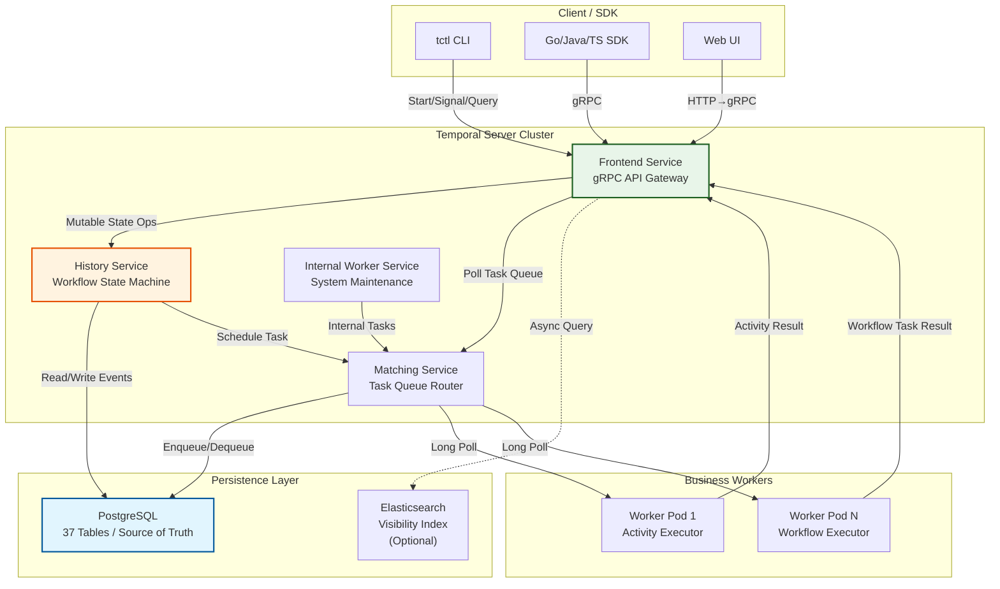
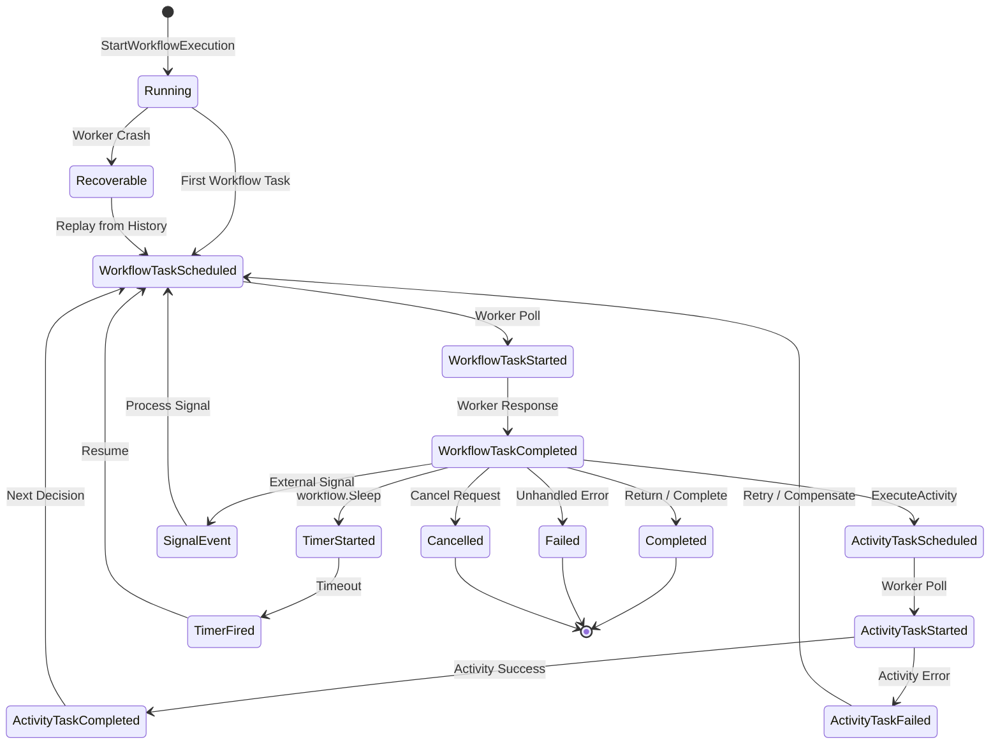

# Temporal Durable Execution Engine Complete Guide

> **Stage**: TECH-STACK | **Prerequisites**: [Chinese source](../TECH-STACK-STREAMING-POSTGRES-TEMPORAL-KRATOS/02-component-deep-dive/02.02-temporal-workflow-engine-guide.md) | **Formalization Level**: L4 | **Last Updated**: 2026-04-22

## 1. Definitions

This section establishes strict formalized definitions for the Temporal durable execution engine, laying the conceptual foundation for subsequent property derivation and engineering argumentation.

**Def-T-02-02-01 Durable Execution**

Durable execution is a computational model in which program execution state is continuously recorded to an external storage system, enabling execution to be precisely resumed from the interruption point at any moment after interruption, without restarting from the beginning. Formally, let the workflow execution sequence be the event sequence $E = \langle e_1, e_2, \ldots, e_n \rangle$; durable execution requires the existence of a persistence function $\Phi: E \to S$, where $S$ is the persistent storage state, such that for any prefix $E_{\leq k}$, the execution context can be reconstructed through $\Phi^{-1}(S_k)$ and execution can continue from $e_{k+1}$.

> Intuitive explanation: Durable execution "overflows" process state from volatile memory to the database, making the process lifecycle transcend the lifecycle of a single compute node. Temporal engineers this idea into a horizontally scalable distributed service.

**Def-T-02-02-02 Workflow**

In Temporal semantics, a workflow is a deterministic state machine, uniquely identified by the triplet of workflow type (Workflow Type), workflow ID (Workflow ID), and run ID (Run ID). Let $\mathcal{W}$ be the workflow definition; $\mathcal{W}: \Sigma \times E \to \Sigma \times A$ is the state transition function, where $\Sigma$ is the workflow state space, $E$ is the input event set, and $A$ is the executable activity (Activity) set. Each step of workflow execution must be driven by external events, and the state transition function itself must be a pure function (no side effects, no external dependencies).

> Intuitive explanation: A workflow is the codified expression of a business process. In Temporal, workflow code is written by developers, but execution semantics are strictly controlled by the Temporal Server—the Server decides when to call the workflow function, when to replay history, and when to schedule activities.

**Def-T-02-02-03 Activity**

An activity is an operational unit that may produce side effects during workflow execution, encapsulating all non-deterministic computations and external system interactions. Let activity $\alpha$ be a pair $\alpha = (f, \tau)$, where $f$ is the activity implementation function (may contain I/O, network requests, database writes, etc.), and $\tau$ is the timeout configuration (Start-to-Close Timeout / Schedule-to-Close Timeout). Activities are actually executed by Worker processes, and their execution results are returned to the Temporal Server through an asynchronous callback mechanism, thereby driving the workflow state machine forward.

> Intuitive explanation: Activities are the boundary between workflows and the "real world." All non-deterministic operations—calling external APIs, reading and writing databases, generating random numbers—must be encapsulated in activities. Workflow code itself can only orchestrate activities and cannot directly execute side effects.

**Def-T-02-02-04 Event Sourcing**

Event sourcing is a persistence pattern in which the current state of a system is not stored directly, but indirectly derived by storing the sequence of events that led to state changes. Let the system state be $S_n$ and the event sequence be $\langle e_1, \ldots, e_n \rangle$; then there exists a fold function $\text{fold}: (S_0, \langle e_1, \ldots, e_n \rangle) \to S_n$, such that $S_n = \text{fold}(S_0, \langle e_1, \ldots, e_n \rangle)$. Temporal's History (historical event stream) is the engineering implementation of event sourcing: every `WorkflowExecutionStarted`, `ActivityTaskScheduled`, `ActivityTaskCompleted`, etc. event recorded in History together constitutes the complete provenance chain of workflow state.

> Intuitive explanation: Temporal does not store "which step the workflow is currently executing," but stores "what events have occurred from startup to now." When reconstructing state, Temporal replays these events to the workflow code in order, and the workflow code makes the same decisions based on the events, thereby recovering to the logical state before interruption.

**Def-T-02-02-05 Deterministic Replay**

Deterministic replay is the core mechanism of Temporal durable execution, requiring workflow code to produce exactly the same execution path and activity scheduling decisions under the same historical event sequence input. Formally, let workflow code be program $P$ and historical event sequence be $H$; then replay correctness requires:

$$\forall P, H. \quad \text{Execute}(P, H) \equiv \text{Replay}(P, H)$$

where $\text{Execute}$ is the first execution, $\text{Replay}$ is the replay execution, and $\equiv$ means the two produce identical activity scheduling sequences, timer setting sequences, and external signal response sequences. To guarantee this property, the Temporal SDK injects replay logic into workflow code through an interceptor mechanism: when the workflow function is called, the SDK checks whether it is currently in replay mode; if so, it does not obtain results from actual activity execution, but reads the already recorded results from History and injects them into the workflow context.

> Intuitive explanation: Deterministic replay is Temporal's "time travel" magic. When a Worker crashes and is taken over by a new Worker, the new Worker does not need to know the execution progress of its predecessor; it only needs to read History and replay events in order, and the workflow code will automatically recover to the decision point before the crash.

---

## 2. Properties

From the above definitions, three core runtime properties of Temporal workflows can be directly derived.

**Lemma-T-02-02-01 Workflow Durability Lemma**

*Premise*: Let workflow $W$'s historical event sequence $H$ be persisted to storage system $S$ (e.g., PostgreSQL), and $S$ satisfies the reliability assumption of persistent storage (data is not lost after write acknowledgment).

*Proposition*: Workflow $W$'s execution state is fault-tolerant to Worker process failures. That is, if a Worker crashes during execution of $W$, $W$'s execution can be recovered and continue on any other Worker, without losing already completed semantics.

*Proof Sketch*: By Def-T-02-02-01 (durable execution), every event of $H$ is mapped to $S$ by $\Phi$ immediately after it is produced. Worker crash will not cause already confirmed data in $S$ to be lost (storage reliability assumption). When a new Worker takes over, through Def-T-02-02-05 (deterministic replay), workflow state is reconstructed from $H$ and execution continues. Since the replay produces an activity scheduling sequence completely identical to that before the crash, the semantic effects of already completed activities will not be repeated (activity idempotency is guaranteed by the business layer, see Prop-T-02-02-01). ∎

**Prop-T-02-02-01 Workflow Idempotency Proposition**

*Premise*: Let activity $\alpha$ itself satisfy idempotency (i.e., multiple executions produce the same system state effect), and Temporal Server's `ActivityTaskCompleted` event appears at most once in History (guaranteed by the Server's task deduplication mechanism).

*Proposition*: The entire workflow $W$'s net effect on external systems is idempotent. That is, no matter how many times $W$ is replayed or how many times Worker failover occurs, the state change sequence observed by external systems is exactly the same as a single fault-free sequential execution.

*Argument*: Workflow code itself has no side effects (Def-T-02-02-02). All side effects are encapsulated in activities (Def-T-02-02-03). During replay, the return values of already completed activities are directly read from History, and actual activity re-execution is not triggered (Def-T-02-02-05). Therefore, the actual number of activity executions equals the unique occurrence count of `ActivityTaskCompleted` events in History, and will not increase due to replay. Combined with the activity idempotency assumption, the entire workflow's net effect is idempotent. ∎

**Lemma-T-02-02-02 Workflow Recoverability Lemma**

*Premise*: Let at least one Frontend instance, one History instance, and one Matching instance survive in the Temporal Server cluster, and the PostgreSQL storage layer is available.

*Proposition*: For any executing workflow $W$, as long as its History is complete in storage, $W$'s execution can continue after Server component failure recovery, and satisfies the exactly-once semantic boundary (at least one activity execution, at most one semantic commit).

*Proof Sketch*: Frontend is a stateless gRPC endpoint, and failure can be switched to a surviving instance by the load balancer. History service is responsible for maintaining the workflow state machine lifecycle; its state is entirely carried by the `executions` and `history_node` tables in PostgreSQL (see §4.2), and the failed instance recovers state from storage after restart. Matching service is responsible for task queue routing; its queue state is persisted by the `tasks` table. Workers obtain tasks through long polling from Matching; Worker failure does not affect Server state. Since History is the sole authoritative source of the state machine, any component can reconstruct a consistent state from PostgreSQL after restart, and workflow execution can continue. ∎

---

## 3. Relations

This section establishes the complementary and collaborative relationships between Temporal and the stream computing ecosystem (Kafka/Flink) and persistent storage (PostgreSQL).

### 3.1 Temporal and Kafka/Flink: Control Flow and Data Flow Orthogonal Complementarity

Temporal and Kafka/Flink constitute a classic **control plane–data plane separation** pattern at the architecture level[^1].

| Dimension | Kafka / Flink | Temporal |
|-----------|--------------|----------|
| Core Abstraction | Event Stream / Data Stream | Workflow / State Machine |
| Primary Function | High-throughput, low-latency data transmission and stateful computation | Long-cycle, complex-state business process orchestration and reliable execution |
| Time Scale | Milliseconds ~ seconds processing latency | Seconds ~ years execution cycle |
| Fault Semantics | At-least-once / Exactly-once (Checkpoint) | Durable Execution + Deterministic Replay |
| State Type | Stream processing operator state (window, aggregation) | Business process state (order lifecycle, approval chain) |

**Complementarity Argument**: Kafka processes event streams but does not understand the business causal relationships between events; Flink performs stateful computation on stream data but does not natively support cross-day/cross-week long-cycle transaction Saga. Temporal exactly fills this gap: it uses events in Kafka as external Signals (Signal) or activity trigger sources for workflows, uses Flink computation results as activity inputs, and itself focuses on ensuring reliable advancement of multi-step business processes[^2]. For example, an e-commerce order fulfillment process can be orchestrated by Temporal (place order → deduct inventory → pay → ship → confirm receipt), while the order event stream is carried by Kafka and real-time risk control is computed by Flink—the three form a complete chain of "Flink senses real-time risk → Kafka transmits event → Temporal orchestrates fulfillment action."

### 3.2 Temporal and PostgreSQL: Storage Foundation of Event Sourcing

Temporal Server uses PostgreSQL (or MySQL/Cassandra/SQLite) as its **sole source of truth (Source of Truth)**. Unlike systems that only use databases as message queues or caches, Temporal's PostgreSQL Schema is the physical implementation of the workflow state machine[^3].

Temporal creates **37 core tables** in PostgreSQL, covering:

- **Namespaces and Metadata**: `namespaces`, `cluster_metadata`
- **Execution Instances**: `executions` (workflow execution records), `execution_visibility` (visibility index)
- **Historical Events**: `history_node` (event blob stored by node shard), `history_tree` (history tree index)
- **Task Queues**: `tasks` (timed and transfer tasks), `task_queues` (queue metadata)
- **Shard Management**: `shards` (History service shard mapping, supporting horizontal scaling)
- **Signals and Queries**: `signals_requested`, `buffered_events`

The essence of this design is **transforming the distributed state machine problem into a relational database transaction problem**. Each state transition of the History service corresponds to one or more SQL transactions, using PostgreSQL's ACID semantics to guarantee atomicity and orderliness of event writes. In other words, Temporal's distributed consistency is not maintained among Server nodes through consensus algorithms (such as Raft), but is implemented by sinking to PostgreSQL's row-level locks and transaction isolation levels.

---

## 4. Argumentation

### 4.1 Temporal Server Core Architecture

Temporal Server adopts a microservices-style architecture, composed of four core services[^4]:

**Frontend Service**
Frontend is Temporal's unified gRPC endpoint to the outside, exposing all client operation interfaces: start workflow (`StartWorkflowExecution`), send signal (`SignalWorkflowExecution`), query workflow state (`QueryWorkflow`), poll tasks (`PollWorkflowTaskQueue` / `PollActivityTaskQueue`). Frontend itself does not maintain workflow state; it is a stateless proxy layer responsible for request routing, authentication and authorization, rate limiting, and input validation, and forwards requests to History or Matching services.

**History Service**
History is Temporal's "brain," responsible for maintaining the complete lifecycle of the workflow state machine. Each workflow execution instance is hash-mapped to a logical shard (Shard), and each shard is responsible for a specific History instance. History service processes all operations that change workflow state: scheduling workflow tasks, recording activity completion, processing timer triggers, managing external signals. Its core data structure is Mutable State (mutable state)—an in-memory workflow state cache that is periodically synchronized to PostgreSQL.

**Matching Service**
Matching is responsible for task queue enqueue and dequeue scheduling. When History decides that a workflow task or activity task needs to be executed, it adds the task to the corresponding task queue in Matching; Workers request tasks from Matching through long polling (Long Poll), and Matching distributes tasks to available Workers. Matching implements persistent queues through PostgreSQL's `tasks` table, guaranteeing that tasks are not lost after Server restart.

**Worker Service**
Worker Service is Temporal Server's internal system-level Worker, executing internal workflows required by the Server itself, such as scheduled archiving of historical data, scanning timeout tasks, and executing system-level compensation operations. It is conceptually homologous to user-written business Workers, but runs in kernel mode.

### 4.2 PostgreSQL Persistence Deep Dive: 37 Tables and 145 SQL Cost Model

According to backend.how's deep source code拆解 of Temporal Server 1.2x version[^3], a typical 3-Activity workflow execution generates approximately **145 SQL statements** at the PostgreSQL level, involving **37 core tables**. The following is a breakdown by execution phase:

**Phase One: Workflow Startup (~25 SQL)**

- `INSERT INTO executions` — Create workflow execution record
- `INSERT INTO history_node` × 3 — Write `WorkflowExecutionStarted`, `WorkflowTaskScheduled`, `WorkflowTaskStarted` events
- `UPDATE shards` — Acquire shard lock (optimistic concurrency control)
- `INSERT INTO tasks` — Register first workflow task with Matching
- Visibility index updates, namespace validation, duplicate startup detection, and other auxiliary queries

**Phase Two: Workflow Task Execution and Activity Scheduling (~45 SQL)**

- `UPDATE executions` — Update Mutable State (pending task list)
- `INSERT INTO history_node` × N — Record `WorkflowTaskCompleted`, `ActivityTaskScheduled` events
- `INSERT INTO tasks` — Create activity tasks for each activity
- Worker polling `SELECT ... FOR UPDATE` — Matching dequeue tasks

**Phase Three: Activity Completion and Subsequent Advancement (~50 SQL)**

- `UPDATE executions` — Merge activity results into Mutable State
- `INSERT INTO history_node` × N — Record `ActivityTaskStarted`, `ActivityTaskCompleted`, `WorkflowTaskScheduled` events
- If subsequent activities exist, repeat Phase Two scheduling logic
- Timer management (e.g., activity retry backoff) involves `timer_tasks` table insertion

**Phase Four: Workflow Completion (~25 SQL)**

- `UPDATE executions` — Mark workflow status as Completed
- `INSERT INTO history_node` — Write `WorkflowExecutionCompleted` event
- `DELETE FROM tasks` — Clean up pending tasks
- Visibility index updates, archiving triggers, etc.

**Storage Cost**: Each workflow execution's History event sequence, after protobuf serialization, averages approximately **19 KB** storage space (3-Activity scenario). Among them, the `history_node` table accounts for the absolute majority (approximately 70%), the `executions` table stores Mutable State snapshots (approximately 15%), and the remainder is task queue and index overhead.

**Performance Inference**: A single-node PostgreSQL (4 vCPU, SSD) under standard OLTP load can support Temporal Server to approximately **80 workflows/s** startup throughput. This value is limited by PostgreSQL write lock contention and History service shard concurrency, rather than Frontend gRPC processing capacity. For linear scaling, it is necessary to increase History shard count and expand PostgreSQL read-write separation or sharded architecture.

### 4.3 Applicable and Inapplicable Scenarios

**Highly Applicable Scenarios**

- **Long-cycle Saga transactions**: Order fulfillment, financial transfers, insurance claims across multiple microservices, with cycles ranging from minutes to months.
- **Human-in-the-loop processes**: Approval workflows requiring human clicks of "approve" or "reject," which Temporal's Signal mechanism naturally supports for external human event injection.
- **Complex retry and compensation**: When downstream services are unstable, Temporal provides exponential backoff retry, timeout control, and graceful degradation (e.g., switching to backup activity implementation).
- **Timed and cron tasks**: More reliable than traditional cron—Temporal guarantees cron workflow will not miss execution, and execution history is traceable.

**Inapplicable or Cautiously Evaluated Scenarios**

- **Ultra-high-frequency short transactions**: Millisecond-level, tens of thousands per second pure computation pipelines. Temporal's persistence overhead (145 SQL / workflow) makes its cost too high in ultra-high-frequency scenarios.
- **Stateless batch processing**: If business logic does not require cross-step state retention or fault recovery, traditional message queues (Kafka/RabbitMQ) are simpler and more efficient.
- **Strong real-time consistency requirements**: Temporal guarantees "eventual completion" rather than "real-time response." Workflow task scheduling involves database transactions and Worker polling, with inherent latency in the 10ms ~ hundreds of ms range.
- **Highly non-deterministic computation**: If the core logic of the workflow is essentially machine learning inference, Monte Carlo simulation, or other irreversible random processes, the deterministic replay assumption is difficult to satisfy.

---

## 5. Proof / Engineering Argument

### 5.1 Deterministic Replay Correctness Argument

**Theorem (Deterministic Replay Correctness)**: Let workflow code $P$ satisfy Temporal SDK's determinism constraints (no direct I/O, no `time.Now()`, no random number generation, no global mutable state), and $H$ be the complete History event sequence of this workflow instance. Then for any prefix $H_{\leq k}$ of $H$, the set of pending activities $A_{replay}$ produced by replay execution $\text{Replay}(P, H_{\leq k})$ and the set $A_{orig}$ produced by first execution $\text{Execute}(P, H_{\leq k})$ satisfy $A_{replay} = A_{orig}$.

**Engineering Argument**:

The Temporal SDK (taking Go SDK as an example) implements deterministic replay through the Workflow Scheduler. This scheduler intercepts all non-pure operations in the workflow coroutine:

1. **Activity Execution Interception**: When workflow code calls `workflow.ExecuteActivity`, the SDK checks whether it is currently in replay mode. If so, the SDK looks up the corresponding `ActivityTaskScheduled` / `ActivityTaskCompleted` event pair at the matching sequence position in History, and directly injects the already recorded result (return value or error) into the workflow coroutine's Channel, without initiating an actual activity scheduling request to the Temporal Server.

2. **Timer Interception**: `workflow.Sleep` or `workflow.Timer` is immediately skipped in replay mode—the SDK reads the `TimerFired` event from history and directly resumes coroutine execution.

3. **Side Effect Interception**: For scenarios that indeed require non-deterministic computation (e.g., generating UUID), the SDK provides the `workflow.SideEffect` API. During first execution, the Side Effect computation result is recorded into History's `MarkerRecorded` event; during replay, it is directly read from the Marker, ensuring result consistency.

4. **Randomness and Time Interception**: The SDK provides `workflow.Now()` (returning workflow start time or history-recorded time) as a replacement for `time.Now()`, and provides a deterministic random source as a replacement for `math/rand`.

**Correctness Boundary**: If developers violate determinism constraints—for example, directly calling HTTP APIs or reading global variables in workflow functions—then replay correctness guarantees fail. The Temporal SDK provides runtime detection in some scenarios (such as Go SDK's `workflowcheck` static analysis tool), but thorough safety relies on code review and engineering standards.

### 5.2 Cost Model Analysis

Based on the PostgreSQL拆解 data from §4.2, establish single-node Temporal Server throughput and cost model.

**Model Assumptions**:

- Workflow average contains 3 Activities, 1 timer, and 1 Signal interaction.
- Each workflow produces 145 SQL statements, averaging 19 KB storage.
- Single-node PostgreSQL configuration: 4 vCPU, 16 GB RAM, SSD (10k IOPS).
- History service shard count: 512 (default configuration).

**Throughput Inference**:
PostgreSQL's write bottleneck mainly lies in random writes to the `history_node` table and row-level lock contention on the `shards` table. On a 4 vCPU node, PostgreSQL can sustainably process approximately **12,000 TPS** (simple OLTP, including fsync). Temporal's 145 SQL / workflow contains approximately 60% writes/updates and 40% reads. Let effective write transaction rate be 7,000 TPS; then:

$$\text{Throughput} = \frac{7{,}000 \, \text{TPS}}{145 \times 0.6} \approx 80 \, \text{workflows/s}$$

This value is basically consistent with Temporal official benchmarks and backend.how's measured data[^3][^5].

**Scaling Path**: If throughput needs to be improved, the following engineering means can be adopted:

1. **Vertical Scaling**: Upgrade PostgreSQL node specifications (CPU/IOPS) to linearly improve single-machine throughput.
2. **Horizontal History Scaling**: Increase History service instance count, with more shards, reducing single-shard lock contention.
3. **Storage Separation**: Offload `history_node` large object storage to object storage (S3/GCS), with PostgreSQL retaining only indexes, reducing write pressure.
4. **Batch Processing Optimization**: For highly homogeneous activities, use Temporal's Batch API to aggregate execution and amortize SQL overhead.

---

## 6. Examples

### 6.1 Go SDK Order Processing Saga Example

The following example shows a typical e-commerce order processing Saga workflow, implemented using the Temporal Go SDK. This workflow contains inventory deduction, payment deduction, and logistics creation three activities, and executes compensation operations (rollback inventory, refund) when any activity fails.

```go
package app

import (
    "time"
    "go.temporal.io/sdk/workflow"
)

// OrderInput is the workflow input parameter
type OrderInput struct {
    OrderID   string
    UserID    string
    ProductID string
    Quantity  int
    Amount    float64
}

// OrderResult is the workflow output result
type OrderResult struct {
    OrderID   string
    Status    string // "completed" | "compensated"
    ShipmentID string
}

// OrderProcessingWorkflow implements order processing Saga orchestration
func OrderProcessingWorkflow(ctx workflow.Context, input OrderInput) (OrderResult, error) {
    // Set common activity options: timeout and retry policy
    ao := workflow.ActivityOptions{
        StartToCloseTimeout: 30 * time.Second,
        RetryPolicy: &temporal.RetryPolicy{
            InitialInterval:    time.Second,
            BackoffCoefficient: 2.0,
            MaximumInterval:    time.Minute,
            MaximumAttempts:    3,
        },
    }
    ctx = workflow.WithActivityOptions(ctx, ao)

    // Saga compensation recorder: records successful activities for compensation upon failure
    var compensations []func() error
    defer func() {
        if err := recover(); err != nil {
            // Execute compensation in reverse order
            for i := len(compensations) - 1; i >= 0; i-- {
                _ = compensations[i]()
            }
        }
    }()

    // Step 1: Deduct inventory
    var inventoryRes InventoryResult
    err := workflow.ExecuteActivity(ctx, ReserveInventory, ReserveInput{
        ProductID: input.ProductID,
        Quantity:  input.Quantity,
    }).Get(ctx, &inventoryRes)
    if err != nil {
        return OrderResult{OrderID: input.OrderID, Status: "failed"}, err
    }
    compensations = append(compensations, func() error {
        return workflow.ExecuteActivity(ctx, ReleaseInventory, ReleaseInput{
            ReservationID: inventoryRes.ReservationID,
        }).Get(ctx, nil)
    })

    // Step 2: Payment deduction
    var paymentRes PaymentResult
    err = workflow.ExecuteActivity(ctx, ChargePayment, PaymentInput{
        UserID: input.UserID,
        Amount: input.Amount,
    }).Get(ctx, &paymentRes)
    if err != nil {
        // Trigger defer compensation: release inventory
        panic(err)
    }
    compensations = append(compensations, func() error {
        return workflow.ExecuteActivity(ctx, RefundPayment, RefundInput{
            TransactionID: paymentRes.TransactionID,
        }).Get(ctx, nil)
    })

    // Step 3: Create logistics order
    var shipmentRes ShipmentResult
    err = workflow.ExecuteActivity(ctx, CreateShipment, ShipmentInput{
        OrderID: input.OrderID,
        Address: input.Address,
    }).Get(ctx, &shipmentRes)
    if err != nil {
        // Trigger defer compensation: refund + release inventory
        panic(err)
    }

    return OrderResult{
        OrderID:    input.OrderID,
        Status:     "completed",
        ShipmentID: shipmentRes.ShipmentID,
    }, nil
}
```

**Code Explanation**:

1. `workflow.WithActivityOptions` configures timeout and exponential backoff retry for activities, ensuring automatic recovery when downstream services experience transient failures.
2. `workflow.ExecuteActivity` returns a Future; `.Get(ctx, &result)` blocks waiting for activity completion—at the underlying level, this is implemented through workflow coroutine suspend/resume, and no OS thread is occupied during suspension.
3. Compensation logic implements reverse-order compensation through `defer` + closure slice, satisfying the Saga pattern's compensation order requirement (later executed, earlier compensated).
4. All business side effects (inventory, payment, logistics) are encapsulated in activities; workflow code is only responsible for orchestration and decision-making, satisfying determinism constraints.

---

## 7. Visualizations

### 7.1 Temporal Server Core Architecture Diagram

The following architecture diagram shows the interaction relationships among Temporal Server's four major services, PostgreSQL persistence layer, and business Workers.



**Figure Description**: Frontend acts as a stateless gRPC gateway receiving all client requests; History is the state machine authority, directly interacting with PostgreSQL to maintain Mutable State; Matching is responsible for task queue routing, and Workers obtain tasks through long polling. Elasticsearch is an optional component providing workflow search and visibility index, and does not carry core state.

### 7.2 Workflow Execution State Machine

The following state diagram shows the complete state transition process of a workflow instance from startup to completion, and the replay recovery path.



**Figure Description**: Workflow execution is event-driven, and state transitions are irreversible (except for the Recoverable path). `ActivityTaskFailed` can trigger retry or compensation decisions, `TimerStarted` supports delayed execution, and `SignalEvent` allows external systems to asynchronously inject events. After Worker crash, the new Worker recovers from the `Recoverable` state through deterministic replay to the decision point after the most recent `WorkflowTaskCompleted` event, and continues advancing the state machine.

---

### 3.3 Project Knowledge Base Cross-References

The Temporal durable execution engine described in this document has the following associations with the project's existing knowledge base:

- [Temporal + Flink Layered Architecture](../Knowledge/06-frontier/temporal-flink-layered-architecture.md) — Authoritative argumentation for the complementary architecture of control plane and data plane separation
- [Transactional Stream Processing Deep Dive](../Knowledge/06-frontier/transactional-stream-processing-deep-dive.md) — Formal association between durable execution and deterministic transactions
- [High Availability Patterns](../Knowledge/07-best-practices/07.06-high-availability-patterns.md) — High availability design of Temporal workflow engine in production environments
- [Data Mesh Streaming Integration](../Knowledge/03-business-patterns/data-mesh-streaming-integration.md) — Relationship between workflow orchestration and data product boundaries

---

## 8. References

[^1]: Temporal.io Documentation, "What is Temporal?", 2025. <https://docs.temporal.io/temporal>

[^2]: Kai Waehner, "Apache Kafka vs Temporal — Complementing Event Streaming with Durable Execution", 2024. <https://www.kai-waehner.de/blog/>

[^3]: backend.how, "Temporal Server PostgreSQL Persistence Deep Dive — 37 Tables, 145 SQL Statements per Workflow", 2026. <https://backend.how/temporal-postgresql-persistence>

[^4]: Temporal.io Documentation, "Temporal Server Architecture", 2025. <https://docs.temporal.io/clusters>

[^5]: Temporal.io Blog, "Temporal Performance Benchmarks and Scaling Best Practices", 2025. <https://temporal.io/blog>
