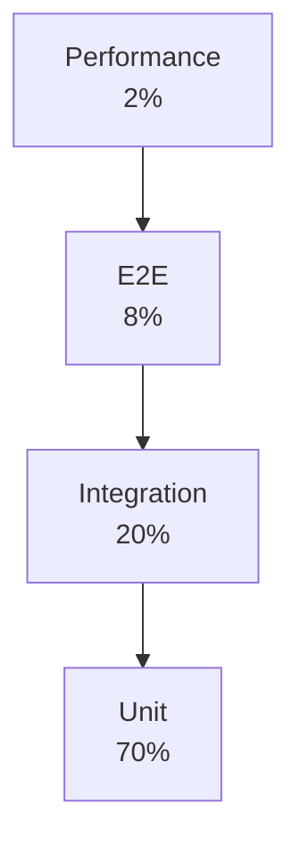

# Flink Testing Strategies Complete Guide

> **Stage**: Knowledge/07-best-practices | **Prerequisites**: [Production Checklist](flink-production-checklist.md) | **Formal Level**: L4
>
> Testing pyramid for stream processing: unit, integration, end-to-end, and performance testing.

---

## 1. Definitions

**Def-K-07-07: Stream Processing Testing Pyramid**

$$
\text{TestingPyramid} = \langle \text{Unit}, \text{Integration}, \text{E2E}, \text{Performance} \rangle
$$

Layer ratio: **Unit (70%) > Integration (20%) > E2E (8%) > Performance (2%)**

**Def-K-07-08: TestHarness**

Flink tool for testing DataStream API in local environment:

$$
\text{TestHarness} = \langle \text{Environment}, \text{Operator}, \text{StateBackend}, \text{TimeService} \rangle
$$

**Def-K-07-09: Deterministic Testing**

$$
\text{Deterministic}(T) \iff \forall i, c: T(i, c) \equiv T(i, c)
$$

**Def-K-07-10: MiniCluster**

Lightweight cluster for full Flink runtime simulation in single JVM.

---

## 2. Properties

**Prop-K-07-07: Test Isolation**

$$
\forall t_1, t_2 \in \text{Tests}: \text{State}(t_1) \cap \text{State}(t_2) = \emptyset
$$

**Prop-K-07-08: Time Controllability**

Flink TestHarness enables manual watermark and processing time advancement.

---

## 3. Relations

- **with Production Checklist**: Tests validate checklist items before deployment.
- **with CI/CD**: Automated tests gate production deployments.

---

## 4. Argumentation

**Testing Layer Comparison**:

| Layer | Speed | Scope | Tool |
|-------|-------|-------|------|
| Unit | Fast | Single operator | TestHarness |
| Integration | Medium | Multiple operators | MiniCluster |
| E2E | Slow | Full pipeline | Docker Compose |
| Performance | Very slow | Full pipeline | Benchmark cluster |

---

## 5. Engineering Argument

**Determinism in Stream Testing**: Event Time processing is deterministic (same input → same output), making it testable. Processing Time is non-deterministic and should be mocked in tests.

---

## 6. Examples

```java
// Unit test with TestHarness
@Test
public void testWindowAggregate() throws Exception {
    KeyedOneInputStreamOperatorTestHarness<String, Event, Result> harness =
        new KeyedOneInputStreamOperatorTestHarness<>(
            new WindowAggregateFunction(),
            Event::getKey,
            Types.STRING);

    harness.open();
    harness.processElement(new Event("key1", 100, 1000L));
    harness.processElement(new Event("key1", 200, 2000L));
    harness.processWatermark(new Watermark(5000L));

    assertThat(harness.extractOutputValues())
        .containsExactly(new Result("key1", 300));
}
```

---

## 7. Visualizations

**Testing Pyramid**:



---

## 8. References
