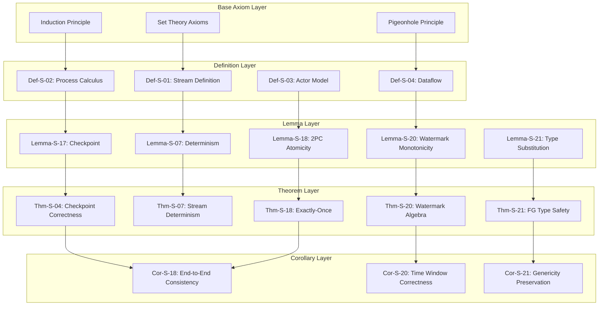
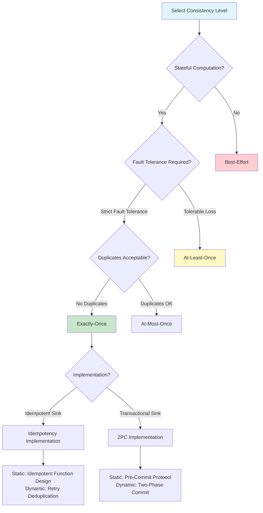
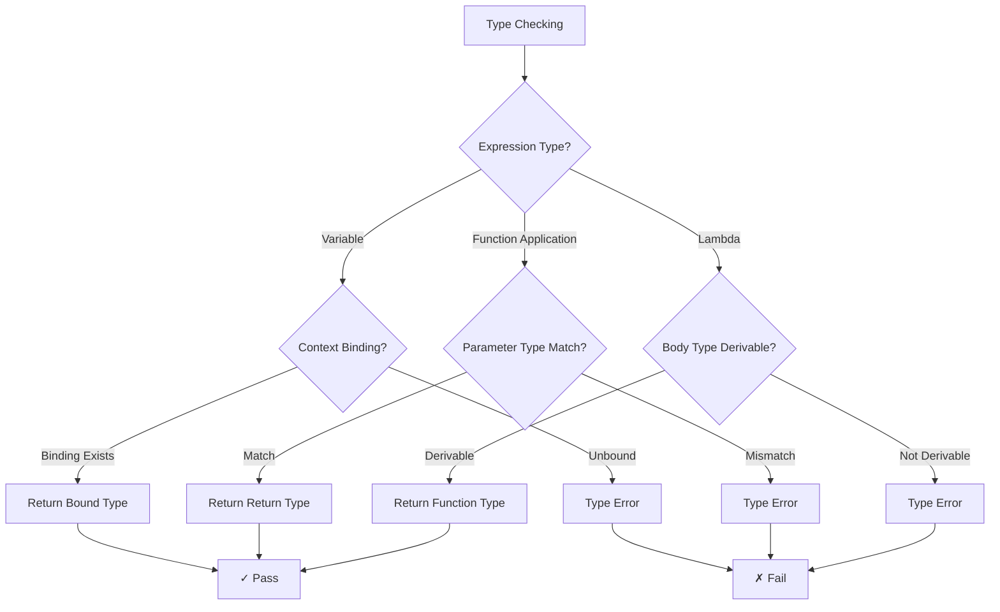
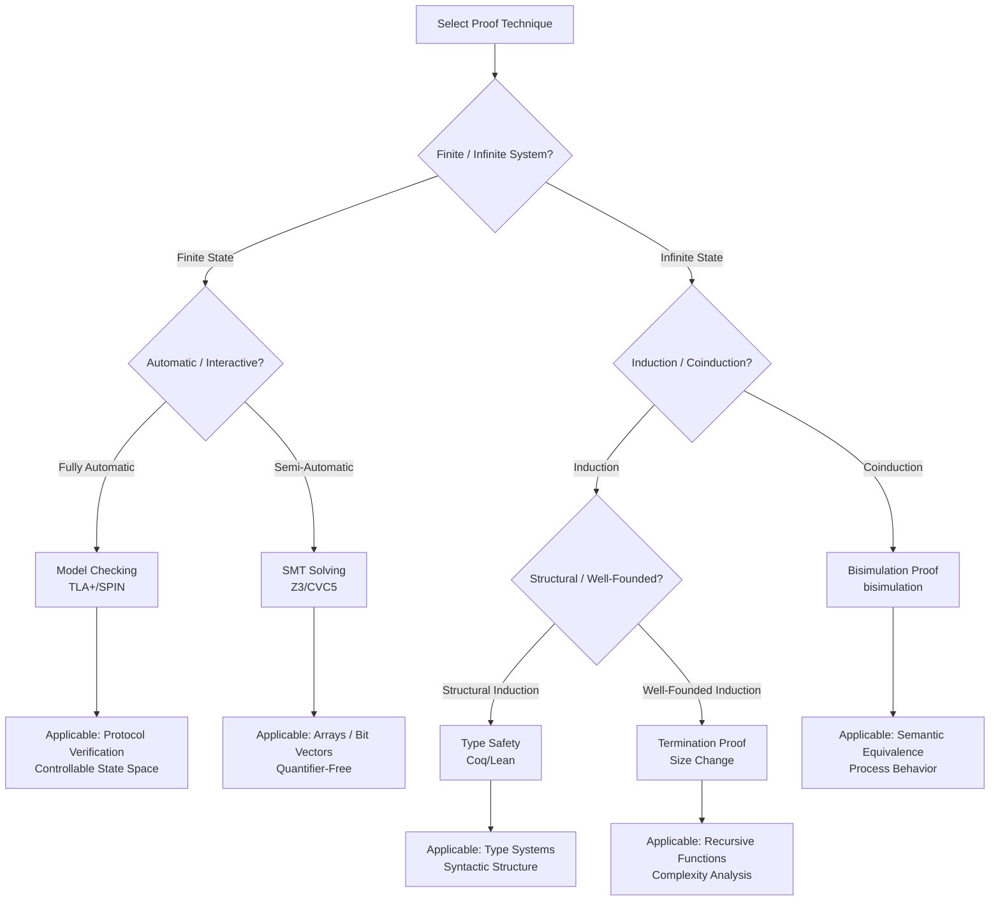

# Theorem Dependency Network and Inference Decision Tree: Complete Map of Formal Elements

> **Stage**: Struct/03-relationships | **Prerequisites**: [03.07-three-layer-relationship-comprehensive.md](./03.07-three-layer-relationship-comprehensive.md), [Struct/Key-Theorem-Proof-Chains.md](../Key-Theorem-Proof-Chains.md) | **Formalization Level**: L5-L6

---

## 1. Definitions

### Def-S-17-01: Theorem Dependency Graph

**Definition**: A theorem dependency graph $\mathcal{G}_{dep} = (V_{Thm}, E_{dep})$ is a directed acyclic graph, where:

- $V_{Thm}$ = the set of all theorems, lemmas, and propositions
- $E_{dep} \subseteq V_{Thm} \times V_{Thm}$ = dependency relation edges; $(t_1, t_2) \in E_{dep}$ means the proof of $t_2$ depends on $t_1$

### Def-S-17-02: Inference Decision Tree

**Definition**: An inference decision tree $\mathcal{T}_{inf}$ is a rooted tree in which each node represents a decision condition or inference rule, and leaf nodes represent decidable conclusions.

### Def-S-17-03: Proof Chain Completeness

**Definition**: A proof chain $C = (t_0, t_1, \ldots, t_n)$ is complete if and only if:
$$\forall i \in [1, n], \exists j < i : (t_j, t_i) \in E_{dep}$$

That is, every theorem depends on some preceding theorem in the chain.

---

## 2. Properties

### Prop-S-17-01: Acyclicity of the Dependency Graph

**Proposition**: A well-formed theorem dependency graph is acyclic.
$$\mathcal{G}_{dep} \text{ is well-formed} \implies \nexists \text{ cycle in } \mathcal{G}_{dep}$$

**Proof**: If a cycle $t_1 \to t_2 \to \ldots \to t_n \to t_1$ existed, then the proof of $t_1$ would depend on itself, violating the well-foundedness of proofs.

### Prop-S-17-02: Bounded Hierarchical Dependency Depth

**Proposition**: The maximum depth of theorem dependencies in this project satisfies $d_{max} \leq 6$.

### Prop-S-17-03: Base Theorem Coverage

**Proposition**: Every non-base theorem can be traced back to the base axiom/definition set $\mathcal{A}_0$:
$$\forall t \in V_{Thm} \setminus \mathcal{A}_0, \exists \text{ path } p : \mathcal{A}_0 \leadsto t$$

---

## 3. Relations

### Relation 1: Core Theorem Dependency Network

| Theorem | Dependent Lemmas/Theorems | Application Domain |
|---------|---------------------------|--------------------|
| Thm-S-18-01 (Exactly-Once) | Lemma-S-18-01, Lemma-S-18-02, Lemma-S-18-03 | Flink Fault Tolerance |
| Thm-S-04-01 (Checkpoint Correctness) | Lemma-S-17-01, Lemma-S-17-02 | Distributed Snapshots |
| Thm-S-07-01 (Determinism) | Lemma-S-07-82, Lemma-S-07-92 | Stream Semantics |
| Thm-S-08-01 (Consistency Hierarchy) | Prop-S-08-01, Prop-S-08-02 | Consistency Theory |
| Thm-S-20-01 (Watermark Algebra) | Lemma-S-20-01~04 | Temporal Semantics |
| Thm-S-21-01 (FG Type Safety) | Lemma-S-21-27~37 | Type Theory |
| Thm-S-23-01 (Choreography Confluence) | Lemma-S-23-01, Lemma-S-23-36~41 | Session Types |

### Relation 2: Proof Technique Classification Mapping

| Proof Technique | Applicable Theorem Type | Representative Theorem |
|-----------------|------------------------|------------------------|
| Structural Induction | Type Safety | Thm-S-21-01 |
| Bisimulation Argument | Semantic Equivalence | Thm-S-04-02 |
| Invariant Proof | Correctness | Thm-S-18-01 |
| Proof by Contradiction | Undecidability | Thm-S-05-02 |
| Constructive Proof | Existence | Thm-S-15-01 |
| Model Checking | Finite State | Prop-S-17-03 |

---

## 4. Argumentation

### Argument 1: Why a Theorem Dependency Network is Needed

In a formalized knowledge base, theorems do not exist in isolation. Understanding dependency relations is essential for:

1. **Learning Path Planning**: Beginners should study theorems in dependency order rather than browsing randomly.
2. **Impact Analysis**: When modifying a lemma, all theorems that depend on it must be reassessed.
3. **Automated Verification**: The dependency graph can guide the verification order of proof assistants.
4. **Knowledge Completeness Checking**: A theorem with no dependency source may be "dangling" and needs a foundational supplement.

### Argument 2: Engineering Value of the Inference Decision Tree

The inference decision tree transforms abstract theoretical judgments into actionable decision workflows:

- **Type Checking**: Given an expression, determine whether its type is well-formed.
- **Consistency Selection**: Given a business scenario, select an appropriate consistency level.
- **Fault-Tolerance Strategy**: Given a failure model, select the optimal recovery strategy.
- **Scheduling Decision**: Given resource constraints, select a task assignment strategy.

---

## 5. Proof / Engineering Argument

### Thm-S-17-01: Dependency Graph Transitive Closure Theorem

**Theorem**: The transitive closure $E_{dep}^+$ of the theorem dependency graph preserves all direct and indirect dependency relations:
$$(t_i, t_j) \in E_{dep}^+ \iff t_j \text{ directly or indirectly depends on } t_i$$

**Proof**:

1. Base step: $(t_i, t_j) \in E_{dep} \implies (t_i, t_j) \in E_{dep}^+$ (direct dependency)
2. Inductive step: If $(t_i, t_k) \in E_{dep}^+$ and $(t_k, t_j) \in E_{dep}$, then $(t_i, t_j) \in E_{dep}^+$ (transitivity)
3. By acyclicity, closure computation necessarily terminates.

### Thm-S-17-02: Inference Decision Tree Completeness

**Theorem**: For any decidable stream-processing property $P$, there exists an inference decision tree $\mathcal{T}_P$ such that:
$$\forall x, \mathcal{T}_P(x) \downarrow \implies \mathcal{T}_P(x) = \text{True} \iff x \models P$$

---

## 6. Examples

### Example 1: Exactly-Once Correctness Proof Chain

```
Base Axioms
  -> Def-S-18-01 (Exactly-Once Semantics)
    -> Def-S-18-03 (2PC Protocol)
      -> Lemma-S-18-02 (2PC Atomicity)
        -> Thm-S-18-01 (Flink Exactly-Once Correctness)
          -> Cor-S-18-01 (End-to-End Consistency)
```

### Example 2: Type Safety Proof Chain

```
Base Definitions
  -> Def-S-21-01 (FG Syntax)
    -> Def-S-21-02 (FG Typing Rules)
      -> Lemma-S-21-27 (Method Resolution Completeness)
        -> Lemma-S-21-34 (Type Substitution)
          -> Thm-S-21-01 (FG Type Safety)
            -> Thm-S-21-02 (FGG Extended Type Safety)
```

---

## 7. Visualizations

### 7.1 Overall Theorem Dependency Network



### 7.2 Consistency Selection Inference Decision Tree



### 7.3 Type System Inference Decision Tree



### 7.4 Formal Method Selection Decision Matrix

```mermaid
quadrantChart
    title Formal Method Selection Matrix
    x-axis Low Expressiveness --> High Expressiveness
    y-axis Low Automation --> High Automation
    quadrant-1 High Expressiveness + High Automation: Model Checking + Symbolic Execution
    quadrant-2 Low Expressiveness + High Automation: Type Checking + Static Analysis
    quadrant-3 Low Expressiveness + Low Automation: Manual Proof
    quadrant-4 High Expressiveness + Low Automation: Theorem Prover
    "TLA+ Model Checking": [0.7, 0.8]
    "Coq/Lean Theorem Proving": [0.9, 0.3]
    "Java Type System": [0.4, 0.9]
    "Iris Separation Logic": [0.8, 0.4]
    "SAT/SMT Solving": [0.5, 0.8]
    "Alloy Relation Analysis": [0.6, 0.7]
    "Manual Invariant Proof": [0.6, 0.2]
    "Flink SQL Static Analysis": [0.3, 0.9]
```

### 7.5 Proof Technique Applicability Tree



---

## 8. References


---

*Document version: v1.0 | Translation date: 2026-04-24*
