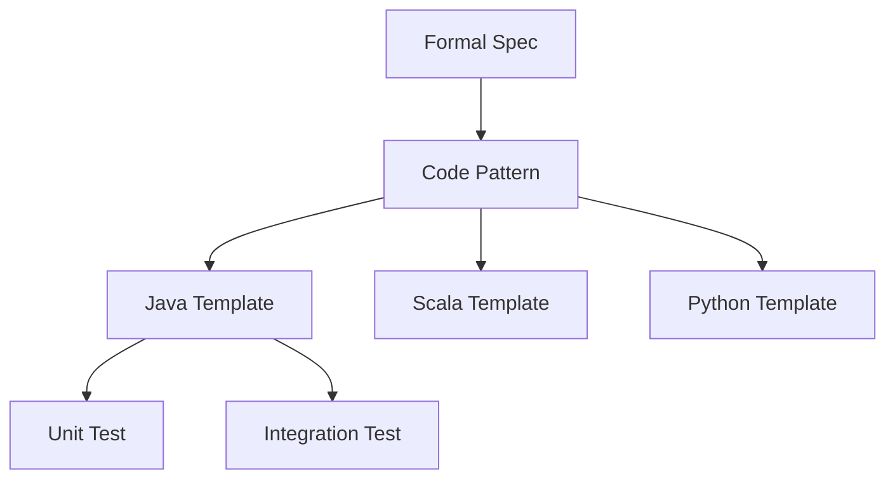

# Theory-to-Code Pattern Language

> **Stage**: Knowledge/05-mapping-guides | **Prerequisites**: [Deterministic Semantics](../../Struct/02-properties/02.01-determinism-in-streaming.md) | **Formal Level**: L4-L5
>
> Formal-to-code patterns: deterministic operators, watermark generators, checkpointed state, and 2PC sinks.

---

## 1. Definitions

**Def-K-05-04: Formal-to-Code Pattern**

Five-tuple $P = (F, C, M, V, I)$:

- $F$ = formal specification
- $C$ = code template
- $M$ = mapping correctness proof
- $V$ = verification strategy
- $I$ = instantiation examples

**Def-K-05-05: Pattern Instantiation**

Applying a pattern to a concrete problem by substituting domain-specific types and logic.

**Def-K-05-06: Pattern Composition**

Combining multiple patterns while preserving individual correctness guarantees.

---

## 2. Properties

**Lemma-K-05-03: Pattern Transitivity**

If $P_1$ and $P_2$ are correct, their composition $P_1 \circ P_2$ is correct if interfaces match.

**Lemma-K-05-04: Composition Closure**

Well-formed pattern compositions remain within the pattern language.

**Lemma-K-05-05: Code Equivalence Preservation**

Refactoring within a pattern preserves semantic equivalence.

---

## 3. Relations

**Theory-to-Code Mapping Matrix**:

| Formal Concept | Code Pattern | Language |
|----------------|-------------|----------|
| Deterministic operator | Pure function + KeyBy | Java/Scala/Python |
| Watermark generator | TimestampAssigner | Java/Scala/Python |
| Checkpointed state | CheckpointedFunction | Java/Scala |
| 2PC sink | TwoPhaseCommitSinkFunction | Java/Scala |

---

## 4. Argumentation

**Pattern Correctness Framework**:

1. Formal specification has known properties
2. Code template implements the specification
3. Verification strategy confirms equivalence
4. Instantiation preserves correctness

**Anti-Pattern Detection**:

- Non-deterministic operations in keyed context
- Mutable shared state across parallel instances
- Unbounded state growth without TTL

---

## 5. Engineering Argument

**Verification Strategy**: Each pattern includes:

- Unit tests with TestHarness
- Integration tests with MiniCluster
- Property-based tests for invariants

---

## 6. Examples

**Deterministic Operator Pattern (Java)**:

```java
// Formal: f: (K, V) → V' where f is pure
public class DeterministicMap
    extends RichMapFunction<Event, Result> {
    @Override
    public Result map(Event value) {
        // Pure function: no side effects, no external state
        return new Result(value.getKey(), compute(value));
    }

    private int compute(Event e) {
        // Deterministic: same input → same output
        return e.getValue() * 2;
    }
}
```

**Watermark Generator Pattern (Java)**:

```java
// Formal: W(t) = max{τ(e)} - delay for e processed by t
WatermarkStrategy.<Event>forBoundedOutOfOrderness(
    Duration.ofSeconds(5))
    .withTimestampAssigner((event, ts) -> event.getEventTime());
```

---

## 7. Visualizations

**Pattern Hierarchy**:



---

## 8. References
