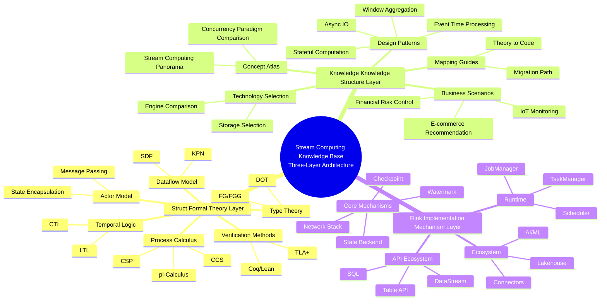
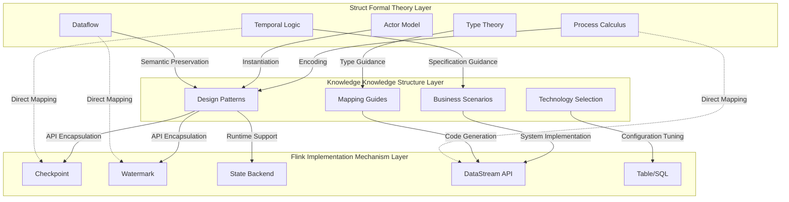
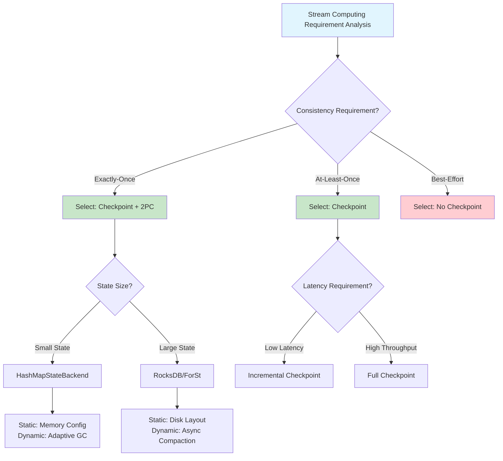
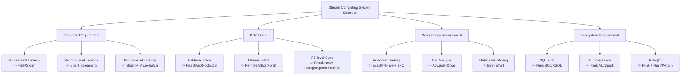

# Comprehensive Three-Layer Relationship: Struct / Knowledge / Flink

> **Stage**: Struct/03-relationships | **Prerequisites**: [03.05-cross-model-mappings.md](../Struct/03-relationships/03.05-cross-model-mappings.md), [Knowledge/05-mapping-guides/struct-to-flink-mapping.md](../Knowledge/05-mapping-guides/struct-to-flink-mapping.md) | **Formalization Level**: L3-L5

---

## 1. Definitions

### Def-S-16-01: Knowledge Hierarchy Triad

**Definition**: The three-layer architecture of this project's knowledge base is defined as an ordered triad $\mathcal{H} = (\mathcal{S}, \mathcal{K}, \mathcal{F})$, where:

- $\mathcal{S}$ = Struct/ Formal Theory Layer (rigorous proofs, theorems, definitions)
- $\mathcal{K}$ = Knowledge/ Knowledge Structure Layer (design patterns, business modeling, technology selection)
- $\mathcal{F}$ = Flink/ Implementation Mechanism Layer (concrete system architecture, APIs, runtime)

**Hierarchy Relation Axiom**:
$$\mathcal{S} \prec \mathcal{K} \prec \mathcal{F}$$

This denotes a partial order where formal rigor decreases and engineering realizability increases.

### Def-S-16-02: Cross-Layer Mapping

**Definition**: A cross-layer mapping $\Phi_{L_i \to L_j}: L_i \to L_j$ is a structure-preserving function that transforms concepts, theorems, or patterns from layer $i$ into corresponding entities in layer $j$.

### Def-S-16-03: Static-Dynamic Mechanism Pair

**Definition**: A static-dynamic mechanism pair $(M_{static}, M_{dynamic})$ describes the realization mapping of a theoretical model across two dimensions: static structure (compile-time / configuration-time) and dynamic behavior (runtime).

---

## 2. Properties

### Prop-S-16-01: Three-Layer Completeness

**Proposition**: The triad $\mathcal{H}$ is complete with respect to the description of modern stream processing systems, i.e.:
$$\forall \text{streaming system } S, \exists s \in \mathcal{S}, k \in \mathcal{K}, f \in \mathcal{F} : S \cong \Phi_{\mathcal{S}\to\mathcal{F}}(s) \land S \approx \Phi_{\mathcal{K}\to\mathcal{F}}(k)$$

### Prop-S-16-02: Decreasing Mapping Fidelity

**Proposition**: The fidelity of cross-layer mappings decreases as the inter-layer distance increases:
$$\text{Fidelity}(\Phi_{\mathcal{S}\to\mathcal{K}}) > \text{Fidelity}(\Phi_{\mathcal{K}\to\mathcal{F}}) > \text{Fidelity}(\Phi_{\mathcal{S}\to\mathcal{F}})$$

### Prop-S-16-03: Static-Dynamic Consistency

**Proposition**: For any theoretical model $T$, its static realization $T_{static}$ and dynamic realization $T_{dynamic}$ satisfy:
$$T_{static} \cap T_{dynamic} = T_{core} \neq \emptyset$$

That is, static and dynamic realizations share a non-empty core semantics.

---

## 3. Relations

### Relation 1: Struct → Knowledge — Theory to Pattern Mapping

| Struct Theoretical Concept | Knowledge Design Pattern | Mapping Type |
|---------------------------|--------------------------|--------------|
| Actor Model | Async IO Dimension Table Association Pattern | Direct Instantiation |
| CSP Channel | Side Output Pattern | Structural Isomorphism |
| Dataflow Graph | Window Aggregation Pattern | Semantic Preservation |
| π-Calculus | CEP Complex Event Pattern | Behavioral Equivalence |
| Session Types | Stateful Computation Pattern | Type-Guided |

### Relation 2: Knowledge → Flink — Pattern to Implementation Mapping

| Knowledge Design Pattern | Flink Implementation Mechanism | Mapping Type |
|-------------------------|-------------------------------|--------------|
| Event Time Processing Pattern | Watermark + Window | Direct Implementation |
| Checkpoint Recovery Pattern | Checkpoint + Savepoint | Native System Support |
| Async IO Enrichment Pattern | AsyncFunction | API Encapsulation |
| Stateful Computation Pattern | KeyedState + StateBackend | Runtime Support |
| Side Output Pattern | SideOutput | API Encapsulation |

### Relation 3: Struct → Flink — Theory to System Direct Mapping

| Struct Theory | Flink Mechanism | Mapping Fidelity |
|--------------|-----------------|------------------|
| Chandy-Lamport | Checkpoint Algorithm | High |
| 2PC Protocol | Flink 2PC Sink | High |
| Watermark Algebra | Watermark Generation / Propagation | Medium |
| Process Calculus | JobGraph / ExecutionGraph | Medium |
| Actor Model | TaskManager / Actor-style Execution | Low–Medium |

---

## 4. Argumentation

### Argument 1: Why a Three-Layer Architecture Is Necessary

The central tension faced by a stream-processing knowledge base is **rigor** vs. **practicality**.

- The **Struct** layer addresses the questions of *what* and *why it is correct*, providing an unshakable theoretical foundation.
- The **Knowledge** layer addresses the questions of *how* and *best practices*, providing reusable engineering wisdom.
- The **Flink** layer addresses the question of *how to concretely implement*, providing directly actionable system knowledge.

A single layer cannot satisfy all readers: researchers need rigorous proofs, engineers need pattern guides, and developers need API documentation.

### Argument 2: Inevitable Information Loss in Cross-Layer Mapping

The mapping from formal definitions to engineering realizations necessarily entails information loss:

1. **Abstraction-level loss**: From process calculus to Java code, the level of abstraction drops by 3–4 orders of magnitude.
2. **Non-determinism concretization**: Non-deterministic choices in theory must be resolved into deterministic strategies in implementation.
3. **Ideal-assumption violation**: Theoretical assumptions (e.g., infinite memory, reliable network) are relaxed in practice.

The degree of information loss can be quantified by mapping fidelity (see Prop-S-16-02).

---

## 5. Proof / Engineering Argument

### Thm-S-16-01: Three-Layer Consistency Theorem

**Theorem**: For any stream-processing property $P$, if the correctness of $P$ is proved at the Struct layer, then there exist a Knowledge-layer pattern $M_P$ and a Flink-layer implementation $I_P$ such that:

$$\Phi_{\mathcal{S}\to\mathcal{K}}(P) = M_P \land \Phi_{\mathcal{K}\to\mathcal{F}}(M_P) = I_P \implies I_P \models P$$

**Proof Sketch**:

1. By the construction of $\Phi_{\mathcal{S}\to\mathcal{K}}$, $M_P$ preserves the core semantic invariant of $P$.
2. By the construction of $\Phi_{\mathcal{K}\to\mathcal{F}}$, $I_P$ is a semantics-preserving instantiation of $M_P$.
3. By transitivity, $I_P$ satisfies the core invariant of $P$.
4. Considering the approximation error $\epsilon$ introduced at the implementation layer, it is necessary to verify that $|P(I_P) - P| \leq \epsilon_{acceptable}$.

### Thm-S-16-02: Static-Dynamic Equivalence Theorem

**Theorem**: For any stream-processing operator $\mathcal{O}$, its static type system $Type_S(\mathcal{O})$ and dynamic execution semantics $Exec_D(\mathcal{O})$ satisfy type safety:

$$\Gamma \vdash \mathcal{O} : \tau \implies \forall t, Exec_D(\mathcal{O}, t) \in \llbracket \tau \rrbracket$$

---

## 6. Examples

### Example 1: Three-Layer Mapping of Exactly-Once Semantics

| Layer | Entity | Core Content |
|-------|--------|--------------|
| Struct | Theorem Thm-S-18-01 | Formal proof of Flink Exactly-Once correctness |
| Knowledge | Pattern pattern-checkpoint-recovery | Design guide for checkpoint and recovery patterns |
| Flink | Implementation 2PC Sink + Checkpoint | Concrete API usage and configuration parameters |

### Example 2: Three-Layer Mapping of the Watermark Mechanism

| Layer | Entity | Core Content |
|-------|--------|--------------|
| Struct | Lemma Lemma-S-09-01 | Proof of Watermark monotonicity |
| Knowledge | Pattern pattern-event-time-processing | Best practices for event-time processing |
| Flink | Implementation WatermarkStrategy | `assignTimestampsAndWatermarks` API |

---

## 7. Visualizations

### 7.1 Mind Map of the Three-Layer Architecture



### 7.2 Cross-Layer Mapping Diagram



### 7.3 Static-Dynamic Mechanism Mapping Matrix

```mermaid
quadrantChart
    title Static-Dynamic Mechanism Mapping Matrix
    x-axis Low Dynamicity --> High Dynamicity
    y-axis Low Static Constraint --> High Static Constraint
    quadrant-1 High Static & High Dynamic: Compile-time Optimization + Runtime Adaptation
    quadrant-2 Low Static & High Dynamic: Pure Runtime Mechanism
    quadrant-3 Low Static & Low Dynamic: Configuration Parameters
    quadrant-4 High Static & Low Dynamic: Type System
    "Type Checking": [0.9, 0.2]
    "Operator Chain Optimization": [0.8, 0.7]
    "Watermark Generation": [0.3, 0.6]
    "Checkpoint Scheduling": [0.5, 0.8]
    "Backpressure Control": [0.2, 0.9]
    "State Backend Selection": [0.7, 0.3]
    "Memory Management": [0.6, 0.7]
    "Network Transmission": [0.4, 0.8]
```

### 7.4 Theory-to-Implementation Decision Tree



### 7.5 Scenario Tree: Stream Computing System Selection



---

## 8. References

---

*Document version: v1.0 | Translation date: 2026-04-24*
