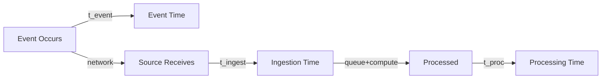

# Time Semantics Deep Dive

> **Stage**: Knowledge/01-concept-atlas | **Prerequisites**: [Stream Processing Fundamentals](stream-processing-fundamentals.md) | **Formal Level**: L3-L4
>
> Event Time, Processing Time, Ingestion Time, and total latency decomposition.

---

## 1. Definitions

**Def-K-02-01: Time Domain**

$$
\mathbb{T} = \{ \mathbb{T}_{event}, \mathbb{T}_{proc}, \mathbb{T}_{ingest} \}
$$

**Def-K-02-02: Event Time**

When the event occurred in the physical world:

$$
t_{event}: E \rightarrow \mathbb{T}_{event}
$$

Objective and immutable.

**Def-K-02-03: Processing Time**

When the event is processed by the operator:

$$
t_{proc}: E \times Op \rightarrow \mathbb{T}_{proc}
$$

Subjective and relative to execution environment.

**Def-K-02-04: Ingestion Time**

When the event enters the stream processing system:

$$
t_{ingest}: E \rightarrow \mathbb{T}_{ingest}
$$

**Def-K-02-05: Total Latency**

$$
\Delta t_{total}(e) = t_{proc}(e) - t_{event}(e) = \Delta t_{network} + \Delta t_{queue} + \Delta t_{compute}
$$

**Def-K-02-06: Out-of-Orderness**

Maximum deviation between event time and processing order:

$$
\text{OoO}(S) = \max_{e_i, e_j \in S} |t_{event}(e_i) - t_{event}(e_j)| \text{ where } i < j \land t_{event}(e_i) > t_{event}(e_j)
$$

---

## 2. Properties

**Prop-K-02-01: Time Ordering**

$$
t_{event}(e) \leq t_{ingest}(e) \leq t_{proc}(e)
$$

**Prop-K-02-02: Determinism**

Event Time processing is deterministic; Processing Time is non-deterministic.

---

## 3. Relations

- **with Windowing**: Window triggers depend on time semantics choice.
- **with Watermark**: Watermark bridges Event Time and Processing Time.

---

## 4. Argumentation

**Time Semantics Selection**:

| Requirement | Event Time | Processing Time |
|-------------|-----------|-----------------|
| Determinism | ✓ | ✗ |
| Latency | Higher | Lower |
| Correctness | Strong | Weak |
| Use case | Analytics | Monitoring |

---

## 5. Engineering Argument

**Latency Budget Allocation**: For P99 < 1s requirement:
- Network: 50ms
- Queue: 100ms
- Compute: 800ms
- Buffer: 50ms
- Total: 1s

---

## 6. Examples

```java
// Event Time with watermark
stream.assignTimestampsAndWatermarks(
    WatermarkStrategy.<MyEvent>forBoundedOutOfOrderness(Duration.ofSeconds(5))
        .withTimestampAssigner((event, ts) -> event.getEventTime()));
```

---

## 7. Visualizations

**Time Semantics Comparison**:


---

## 8. References

[^1]: T. Akidau et al., "The Dataflow Model", PVLDB, 8(12), 2015.
[^2]: Apache Flink Documentation, "Time Semantics", 2025.
