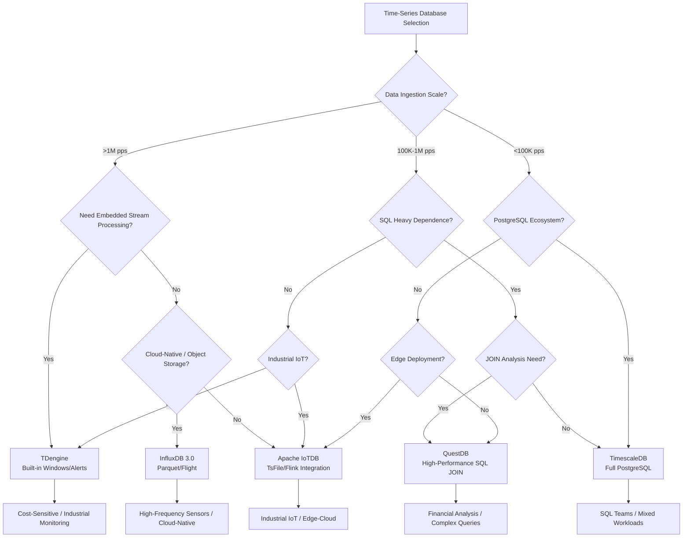

> **Status**: 🔮 Forward-Looking Content | **Risk Level**: Medium | **Last Updated**: 2026-04-23
>
> Product features of time-series databases described in this document are based on publicly available information; please refer to each vendor's official release for specific version features.

---

# Time-Series Databases and Stream Processing: Deep Integration Comparison

> **Stage**: Knowledge/06-frontier | **Prerequisites**: [streaming-databases.md](./streaming-databases.md), [Flink/01-concepts/flink-dataflow-model.md](../../Flink/01-concepts/flink-dataflow-model.md), [Knowledge/04-technology-selection/engine-selection-guide.md](../04-technology-selection/engine-selection-guide.md) | **Formalization Level**: L3-L4

---

## 1. Definitions

### Def-K-TS-01: Time-Series Database Stream Processing Integration (时序数据库流处理集成)

Time-series database stream processing integration refers to the **deep coupling or loosely coupled combination of time-series data storage systems with stream computing capabilities**, forming a unified technical system that supports continuous ingestion, real-time computation, and persistent storage of time-series data streams.

**Formal Definition**:
Let time-series database stream processing integration be a sextuple $\mathcal{TSI} = \langle \mathcal{T}, \mathcal{S}, \mathcal{P}, \mathcal{I}, \mathcal{W}, \mathcal{C} \rangle$, where:

- $\mathcal{T} = \{T_1, \ldots, T_n\}$: set of time-series data streams, $T_i = \langle (t_1, v_1), (t_2, v_2), \ldots \rangle$
- $\mathcal{S}$: storage engine, responsible for persistence, compression, and indexing
- $\mathcal{P}$: processing engine, executing continuous computation
- $\mathcal{I}$: integration interface layer, defining data exchange protocols
- $\mathcal{W} = \{\text{tumbling}, \text{sliding}, \text{session}, \text{state}, \text{count}, \text{event}\}$: window semantics
- $\mathcal{C}$: consistency protocol, $c \in \{\text{at-least-once}, \text{exactly-once}, \text{strong}\}$

**Core Constraint**: $\forall T_i \in \mathcal{T}, \forall t: \text{Ingested}(T_i, \leq t) \subseteq \text{Queryable}(\mathcal{S}, t + \Delta_{\text{visible}})$

| Dimension | Traditional TSDB | Stream-Processing-Integrated TSDB |
|-----------|------------------|-----------------------------------|
| Computation Mode | Batch queries | Continuous queries + incremental computation |
| Window Support | None / simple ranges | Event windows, session windows, state windows |
| Latency | Seconds to minutes | Milliseconds to seconds |

---

### Def-K-TS-02: Stream Processing Integration Patterns (流处理集成模式)

Stream processing integration patterns describe the **architectural topology classification** of how time-series databases combine with stream computing capabilities, divided into four basic patterns:

**Formal Description**: Let the integration pattern be a mapping $\mathcal{M}: \mathcal{P} \times \mathcal{S} \rightarrow \{\text{Mode-1}, \text{Mode-2}, \text{Mode-3}, \text{Mode-4}\}$:

1. **Mode 1 — External Stream Engine Write**: $\mathcal{P}_{\text{ext}} \xrightarrow{\text{stream}} \mathcal{S}_{\text{ts}}$, the stream engine runs as an independent process, and results are written to the time-series DB via Sink.
2. **Mode 2 — Embedded Stream Processing**: $\mathcal{P}_{\text{emb}} \sqsubseteq \mathcal{S}_{\text{ts}}$, the time-series DB internally integrates a stream processing engine.
3. **Mode 3 — Bidirectional Integration**: $\mathcal{P}_{\text{ext}} \xleftrightarrow{\text{CDC/stream}} \mathcal{S}_{\text{ts}}$, the stream engine both writes results and reads time-series data via CDC.
4. **Mode 4 — Unified Query Layer**: $\mathcal{Q}_{\text{fed}} \circ (\mathcal{P}_{\text{ext}} \cup \mathcal{S}_{\text{ts}}) \rightarrow \mathcal{R}$, providing a unified SQL interface through Trino/Presto.

| Factor | Mode-1 | Mode-2 | Mode-3 | Mode-4 |
|--------|--------|--------|--------|--------|
| Complexity | High | Low | Very High | High |
| Latency | Medium-High | Low | Medium | High |
| Flexibility | Extremely High | Medium | High | Medium |

---

### Def-K-TS-03: Time-Series Data Ingestion Throughput (时序数据摄入吞吐量)

Time-series data ingestion throughput is measured in **data points per second (pps)**. Let the data points arriving within $\Delta t$ be $\mathcal{D}(\Delta t)$. Then:

$$\Theta_{\text{ingest}}(\mathcal{S}, \Delta t) = \frac{|\mathcal{D}(\Delta t)|}{\Delta t} \quad [\text{pps}]$$

| System | Write Throughput | Compression Ratio | Storage Format | Write Optimization |
|--------|-----------------|-------------------|----------------|--------------------|
| InfluxDB 3.0 | Millions of pps | ~10:1 | Parquet | Arrow Flight[^1] |
| TDengine | Millions of pps | ~10:1 | Columnar compression | Super table batching[^2] |
| TimescaleDB | Hundreds of thousands of pps | ~3-4:1 | PG + column store | COPY protocol[^3] |
| Apache IoTDB | Millions of pps | ~10:1 | TsFile | Pipeline write[^4] |
| QuestDB | Millions of pps | ~5:1 | Partitioned columnar | Memory mapping[^5] |

---

## 2. Properties

### Prop-K-TS-01: Trade-off Between Integration Pattern and End-to-End Latency

**Statement**: Let the latency of integration pattern $\mathcal{M}$ be $L(\mathcal{M})$, operational complexity be $C_{\text{ops}}(\mathcal{M})$, and computational flexibility be $F_{\text{calc}}(\mathcal{M})$. Then:

$$L(\mathcal{M}) \cdot C_{\text{ops}}(\mathcal{M}) \cdot \frac{1}{F_{\text{calc}}(\mathcal{M})} \geq K$$

**Argument**: Mode-1 has medium-high $L$ (network transfer), high $C_{\text{ops}}$ (dual systems), extremely high $F_{\text{calc}}$ (full Flink); Mode-2 has low $L$ (local processing), low $C_{\text{ops}}$ (single system), medium $F_{\text{calc}}$ (no CEP/ML); Mode-3 has medium $L$ (bidirectional sync), very high $C_{\text{ops}}$; Mode-4 has high $L$ (federation layer), high $C_{\text{ops}}$.

**Corollary**: There does not exist an integration pattern that simultaneously achieves extremely low latency, extremely low operational complexity, and extremely high computational flexibility.

---

### Lemma-K-TS-01: Functional Coverage Equivalence Between Embedded and External Stream Engines

**Statement**: Let the standard time-series analysis operation set be $\mathcal{O}_{\text{ts}} = \{\text{aggregation}, \text{window}, \text{filter}, \text{Join}, \text{downsampling}\}$, and the extended operation set be $\mathcal{O}_{\text{ext}} = \{\text{CEP}, \text{Async I/O}, \text{ML Inference}\}$. Then:

$$\mathcal{O}_{\text{ts}} \subseteq \mathcal{F}_{\text{emb}} \cap \mathcal{F}_{\text{ext}} \quad \text{and} \quad \mathcal{O}_{\text{ext}} \subseteq \mathcal{F}_{\text{ext}}, \; \mathcal{O}_{\text{ext}} \not\subseteq \mathcal{F}_{\text{emb}}$$

**Proof Sketch**: TDengine supports state/session/count/event windows[^2]; InfluxDB 3.0 supports SQL window functions through DataFusion[^1]; Flink SQL natively supports various windows. However, CEP requires NFA state machines, Async I/O requires external callbacks, and ML Inference requires model serving—time-series databases do not directly support these, while Flink fully supports them.

**Conclusion**: Pure time-series analysis embedded stream processing is sufficient to replace external engines; complex event recognition is irreplaceable by external engines.

---

## 3. Relations

### 3.1 Architectural Relationship Between Time-Series Databases and Stream Processing Engines

- **Mode-1**: The most common production deployment; Flink handles complex ETL, and the time-series DB handles high-throughput persistence.
- **Mode-2**: Evolution direction for time-series DBs, reducing system complexity and latency.
- **Mode-3**: Important pattern in industrial IoT; IoTDB and Flink implement a "store-while-compute" closed loop.
- **Mode-4**: Suitable for analytical workloads; Trino provides unified access to stream results and time-series historical data.

### 3.2 Positioning of Time-Series Databases in the Data Stream Ecosystem

| System Type | Core Capability | Complementary Systems | Competitive Boundary |
|-------------|-----------------|----------------------|----------------------|
| Time-Series Database (TSDB) | High-throughput write + time-range query | Flink, Grafana | Streaming database |
| Stream Processing Engine (Flink) | Complex event processing + Exactly-Once | TSDB, Kafka | Streaming database |
| Streaming Database (RisingWave) | Materialized views + ad-hoc query | Flink, TSDB | Traditional OLAP |

### 3.3 Formal Comparison of Five Time-Series Databases

| Feature | InfluxDB 3.0 | TDengine | TimescaleDB | Apache IoTDB | QuestDB |
|---------|-------------|----------|-------------|--------------|---------|
| **Technology Stack** | Flight+DataFusion+Arrow+Parquet | Super table+columnar store | PostgreSQL+Hypertable | TsFile+pipe model | Partitioned columnar+SIMD |
| **Stream Processing** | No built-in | Built-in full stream processing | No built-in | Flink native integration | No built-in |
| **Window Types** | SQL window functions | State/session/count/event windows | SQL window functions | No built-in | SQL window functions |
| **SQL Compatibility** | InfluxQL + SQL | SQL-like | Full PostgreSQL | SQL-like | ANSI SQL |
| **Typical Throughput** | Millions of pps | Millions of pps | Hundreds of thousands of pps | Millions of pps | Millions of pps |
| **Compression Ratio** | ~10:1 | ~10:1 | ~3-4:1 | ~10:1 | ~5:1 |
| **Edge Support** | Edge replication+Timestream | Edge compute edition | No | Edge-cloud collaboration | No |
| **Best Scenario** | High-frequency sensors+cloud-native | Extreme cost sensitivity | SQL-heavy analytics | Industrial IoT | Financial time-series+JOIN |

---

## 4. Argumentation

### 4.1 Technology Selection Decision Matrix

| Business Scenario | Recommended Pattern | Primary Database | Secondary Database |
|-------------------|--------------------|--------------------|--------------------|
| High-frequency industrial sensors (>1M pps) | Mode-1/Mode-2 | InfluxDB 3.0 | TDengine |
| SQL-heavy analytics team | Mode-1+Mode-4 | TimescaleDB | QuestDB |
| Extreme cost sensitivity | Mode-2 | TDengine | Apache IoTDB |
| Edge+cloud hybrid deployment | Mode-1/Mode-3 | InfluxDB 3.0 | Apache IoTDB |
| Industrial IoT closed loop | Mode-3 | Apache IoTDB | TDengine |
| Real-time alerting+lightweight aggregation | Mode-2 | TDengine | InfluxDB 3.0 |
| Financial time-series JOIN analysis | Mode-4 | QuestDB | TimescaleDB |

### 4.2 Cost-Benefit Analysis

| System | Storage Cost Factor | Operational Cost Factor | TCO Estimate |
|--------|--------------------|-------------------------|--------------|
| InfluxDB 3.0 (Cloud) | 0.1x (Parquet) | 0.3x (managed) | **0.4x** |
| TDengine (Self-hosted) | 0.1x (high compression) | 0.2x (single system) | **0.3x** |
| TimescaleDB (Cloud) | 0.3x (columnar) | 0.5x (PG ecosystem) | **0.8x** |
| InfluxDB OSS 1.x | 1.0x (baseline) | 1.0x (baseline) | **1.0x** |
| Apache IoTDB (Self-hosted) | 0.1x (TsFile) | 0.4x (Flink integration) | **0.5x** |

Key finding: InfluxDB 3.0 based on Parquet and object storage can reduce storage costs by approximately 90%[^1]; Mode-2 eliminates the independent operational cost of a Flink cluster, yielding significant TCO advantages at small-to-medium scale.

### 4.3 Consistency Model Boundary Discussion

| System | Write Consistency | Stream Processing Consistency | Cross-Node Consistency |
|--------|-------------------|------------------------------|------------------------|
| InfluxDB 3.0 | Eventual consistency | Depends on external engine | Strong consistency (metadata) |
| TDengine | Strong consistency (Raft) | At-least-once / exactly-once | Strong consistency |
| TimescaleDB | ACID | Depends on external engine | Strong consistency |
| Apache IoTDB | Session-level consistency | Flink exactly-once | Eventual consistency |
| QuestDB | ACID (single-node) | Depends on external engine | Strong consistency |

**Boundary Case**: InfluxDB 3.0 Flight SQL writes and object storage have an inconsistency window of <1s, making it unsuitable for financial trading; TDengine cross-super-table transactions are not supported, so complex financial transactions require caution.

---

## 5. Proof / Engineering Argument

### 5.1 Mode 1: External Stream Engine → TSDB Engineering Argument

**Proposition**: In scenarios requiring CEP or ML inference, Mode-1 (Flink → TSDB) is the only architecture that satisfies functional completeness.

**Argument**: Let the requirement be $\mathcal{R} = \mathcal{R}_{\text{basic}} \cup \mathcal{R}_{\text{advanced}}$. According to Lemma-K-TS-01, $\mathcal{R}_{\text{advanced}} \not\subseteq \mathcal{F}_{\text{emb}}$, so an architecture relying solely on embedded stream processing cannot satisfy the requirements. Mode-1 fully supports $\mathcal{R}_{\text{advanced}}$ through Flink CEP library, ML connectors, and Async I/O operators; guarantees exactly-once semantics through checkpointing; and the time-series DB's high throughput ($\geq 10^6$ pps) does not constitute a bottleneck.

**Conclusion**: Mode-1 is a sufficient and necessary architecture for complex time-series analysis scenarios.

### 5.2 Mode 2: Embedded Stream Processing Engineering Argument

**Proposition**: In scenarios with data scale $N < 10^8$ points/day and computational requirements $\mathcal{R} \subseteq \mathcal{O}_{\text{ts}}$, the TCO of Mode-2 is at least 40% lower than Mode-1.

**Cost Model**: Mode-1 cost $C_1 = C_{\text{flink}} + C_{\text{tsdb}} + C_{\text{network}} + C_{\text{ops}}$; Mode-2 cost $C_2 = C_{\text{tsdb}}' + C_{\text{ops}}'$. Flink cluster annual cost is approximately $15K–$50K, and dual-system operations require an additional 0.5–1 FTE; Mode-2 single system only requires 0.2–0.3 FTE. Therefore $C_2 / C_1 \leq 0.6$.

TDengine's built-in state windows, session windows, count windows, event windows, and event-driven stream processing[^2] cover 80% of industrial monitoring scenarios without requiring Flink.

### 5.3 Complementarity Argument for Mode 3 and Mode 4

**Proposition**: Mode-3 and Mode-4 are complementary in complex data pipelines, and their combined use can achieve a complete "compute-store-query" closed loop.

Let the industrial pipeline be $\mathcal{Pipeline} = \langle \text{ingestion}, \text{cleansing}, \text{storage}, \text{analysis}, \text{feedback} \rangle$. Mode-3 is responsible for ingestion→cleansing (Flink reads IoTDB TsFile) and analysis→feedback (Flink writes back to IoTDB); Mode-4 is responsible for cross-source unified analysis (Trino federated query over Flink results and IoTDB historical data). The combination satisfies:

$$\mathcal{Pipeline}_{\text{complete}} = \text{Mode-3}(\mathcal{P}_{\text{calc}}, \mathcal{S}_{\text{ts}}) \oplus \text{Mode-4}(\mathcal{Q}_{\text{fed}}, \mathcal{S}_{\text{ts}} \cup \mathcal{V}_{\text{stream}})$$

---

## 6. Examples

### 6.1 Case 1: InfluxDB 3.0 + Flink High-Frequency Industrial Monitoring

**Scenario**: An automobile manufacturer monitors 50,000 welding robots at 5 million pps.

**Architecture** (Mode-1): `Sensors → MQTT → Flink CEP → InfluxDB 3.0 → Grafana`

Flink CEP detects abnormal conditions by identifying 3 consecutive current overlimits (>250A); InfluxDB 3.0 writes at high throughput via Arrow Flight, automatically compressing to Parquet. Results: peak 5.2M pps, point queries < 50ms, storage cost reduced by 92%[^1], end-to-end anomaly detection < 2s.

### 6.2 Case 2: TDengine Embedded Stream Processing for Smart Grid Analysis

**Scenario**: A provincial power grid monitors 100,000 smart meters, with load forecasting and anomaly detection.

**Architecture** (Mode-2): `Meters → MQTT → TDengine → Embedded Stream Compute → Alerting`

Core configuration: 1-minute session window average load, voltage sag event window (`EVENT_WINDOW START voltage < 198.0 END voltage > 198.0`). Results: 3.5M pps (5 nodes), stream compute average 200ms, compression 10:1, TSBS queries 6.3–426.3x faster than InfluxDB[^2].

### 6.3 Case 3: IoTDB + Flink CDC Bidirectional Industrial Data Integration

**Scenario**: A steel plant's complete closed loop of "ingestion → preprocessing → analysis → control command issuance".

**Architecture** (Mode-3 + Mode-4): Edge IoTDB → TsFile sync → Cloud IoTDB ↔ Flink CDC → Trino federated query. Flink CDC consumes real-time changes in <1s; Trino federated query <3s; edge-cloud closed-loop control <10s.

---

## 7. Visualizations

### 7.1 Architecture Comparison of Four Integration Patterns

```mermaid
graph TB
    subgraph "Mode-1: External Stream Engine → TSDB"
        M1_Flink[Flink/Spark<br/>Complex Compute]
        M1_Kafka[Kafka/Pulsar]
        M1_TSDB[InfluxDB/TimescaleDB<br/>Persistent Storage]
        M1_Flink -->|Sink Connector| M1_TSDB
        M1_Kafka --> M1_Flink
    end

    subgraph "Mode-2: Embedded Stream Processing"
        M2_Source[Data Sources]
        M2_TSDB[TDengine<br/>Storage+Compute Unified]
        M2_MV[Materialized Views]
        M2_Alert[Alert Output]
        M2_Source --> M2_TSDB
        M2_TSDB -->|Embedded Stream Compute| M2_MV
        M2_TSDB -->|Subscription Push| M2_Alert
    end

    subgraph "Mode-3: Bidirectional Integration"
        M3_Flink[Apache Flink]
        M3_IoTDB[Apache IoTDB<br/>TsFile]
        M3_Ctrl[Control Commands]
        M3_Flink <-->|CDC / TsFile| M3_IoTDB
        M3_Flink --> M3_Ctrl
    end

    subgraph "Mode-4: Unified Query Layer"
        M4_Trina[Trino/Presto<br/>Federated Query]
        M4_Quest[QuestDB]
        M4_Influx[InfluxDB]
        M4_Kafka[Kafka Topic]
        M4_Trina --> M4_Quest
        M4_Trina --> M4_Influx
        M4_Trina --> M4_Kafka
    end
```

**Comparison Notes**: Mode-1 is suitable for complex computation, Mode-2 for rapid deployment, Mode-3 for industrial closed-loop control, and Mode-4 for unified analytical queries.

### 7.2 Time-Series Database Selection Decision Tree

---

## 8. References

[^1]: InfluxData, "InfluxDB 3.0 Architecture: Flight, DataFusion, Arrow, Parquet", InfluxData Blog, 2024-2025. <https://www.influxdata.com/blog/why-influxdb-3-0/>

[^2]: TDengine, "TDengine 3.0 Documentation: Stream Processing", 2025. <https://docs.tdengine.com/3.0/develop/stream/>

[^3]: TimescaleDB, "TimescaleDB 2.15 Release Notes: pgvector and AI Semantic Search", 2025. <https://www.timescale.com/blog>

[^4]: Apache IoTDB, "IoTDB-Flink Integration: TsFile Connector and CDC", Apache IoTDB Documentation, 2025. <https://iotdb.apache.org/UserGuide/latest/API/Flink-Connector.html>

[^5]: QuestDB, "QuestDB SQL Reference: Time-Series JOINs and SIMD Optimization", QuestDB Documentation, 2025. <https://questdb.io/docs/>
