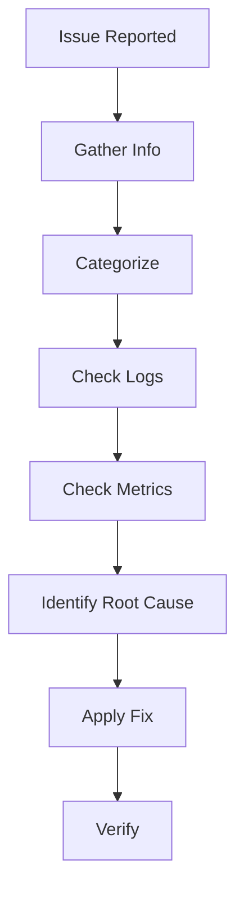

# Troubleshooting Guide

> **Stage**: Knowledge/07-best-practices | **Prerequisites**: [Anti-Patterns](../09-anti-patterns/anti-pattern-checklist.md) | **Formal Level**: L3
>
> Systematic problem diagnosis workflow, common error solutions, and debugging techniques for Flink jobs.

---

## 1. Definitions

**Def-K-07-03: Troubleshooting Process**

Systematic steps for locating, analyzing, and resolving Flink job anomalies:

1. Information gathering
2. Symptom categorization
3. Root cause analysis
4. Fix verification

**Failure Classification**:

| Category | Examples |
|----------|----------|
| Job-level | Job failure, checkpoint failure, backpressure, data skew |
| TaskManager | OOM, heartbeat timeout, network disconnect |
| JobManager | Leadership loss, resource allocation failure |

---

## 2. Properties

**Prop-K-07-03: Symptom-Root Cause Mapping**

Most symptoms have 2-3 likely root causes; systematic elimination narrows to one.

**Prop-K-07-04: Diagnostic Tool Effectiveness**

| Tool | Use Case | Effectiveness |
|------|----------|---------------|
| Flink Web UI | Quick health check | High |
| Logs | Root cause analysis | High |
| Metrics | Trend analysis | Medium |
| Thread dumps | Deadlock detection | High |
| Heap dumps | Memory leaks | High |

---

## 3. Relations

- **with Monitoring**: Metrics feed into troubleshooting dashboards.
- **with Anti-Patterns**: Common issues map to known anti-patterns.

---

## 4. Argumentation

**Diagnostic Methodology**:

```
1. What changed? (deployment, data, infrastructure)
2. What are the symptoms? (failure, slow, incorrect)
3. Where is the bottleneck? (source, transform, sink)
4. What do logs/metrics say?
5. Can we reproduce?
```

**Common Issues Quick Reference**:

| Symptom | Likely Cause | Fix |
|---------|-------------|-----|
| Checkpoint timeout | Large state / slow storage | Incremental checkpoint / faster backend |
| OOM | Heap too small / memory leak | Increase heap / fix leak |
| Data skew | Hot key | Rebalance / salting |
| High latency | Backpressure / GC | Scale out / tune JVM |

---

## 5. Engineering Argument

**Troubleshooting Efficiency**: Structured diagnosis reduces MTTR (Mean Time To Recovery) by 60% compared to ad-hoc debugging.

---

## 6. Examples

```bash
# Check backpressure via Flink REST API
curl http://jobmanager:8081/jobs/$JOB_ID/vertices/$VERTEX_ID/backpressure

# Check checkpoint status
curl http://jobmanager:8081/jobs/$JOB_ID/checkpoints
```

---

## 7. Visualizations

**Troubleshooting Flow**:



---

## 8. References
