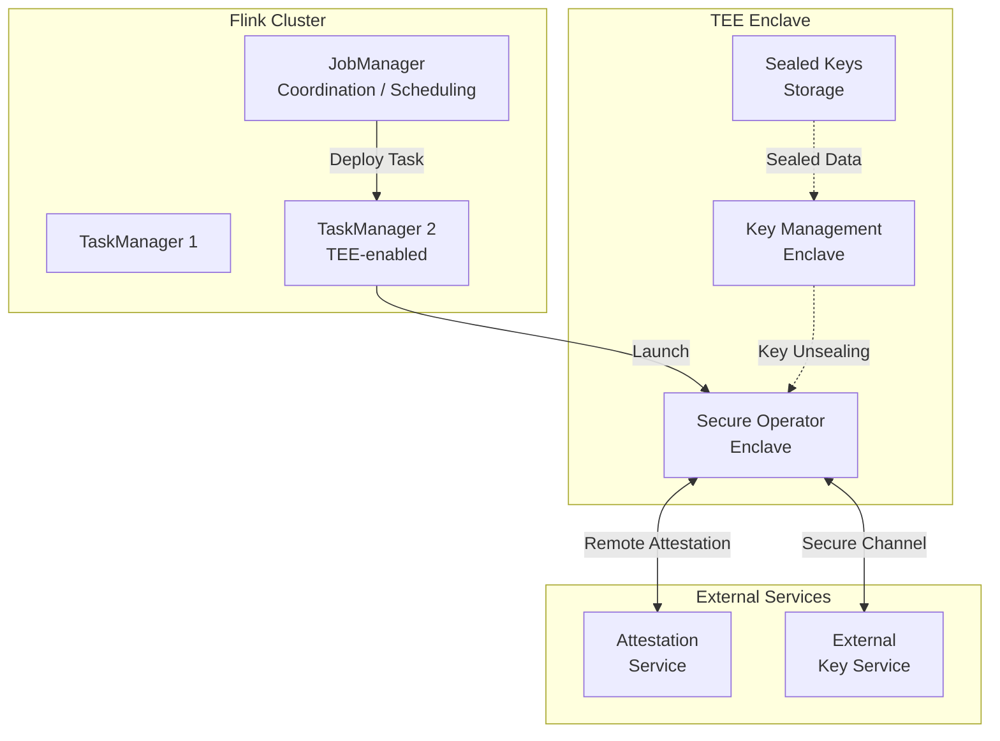
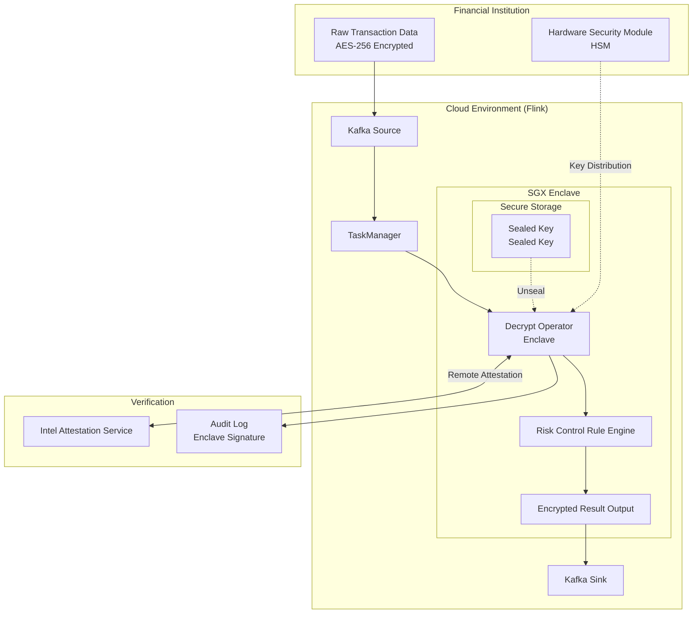
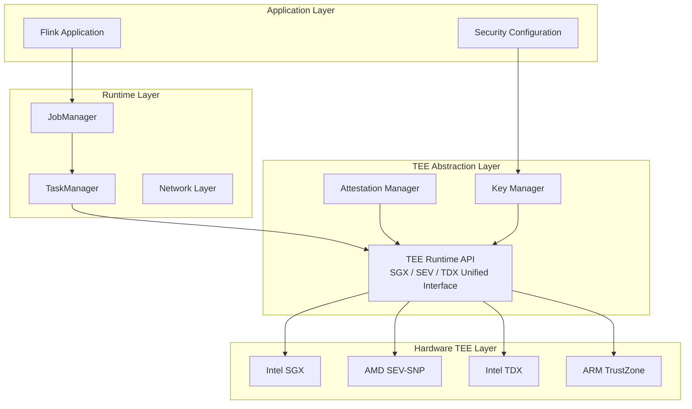
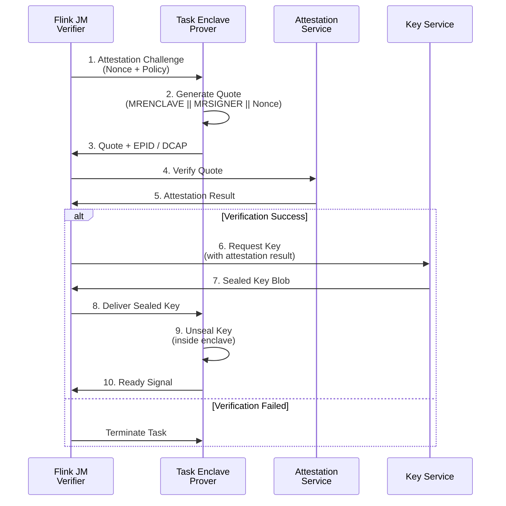
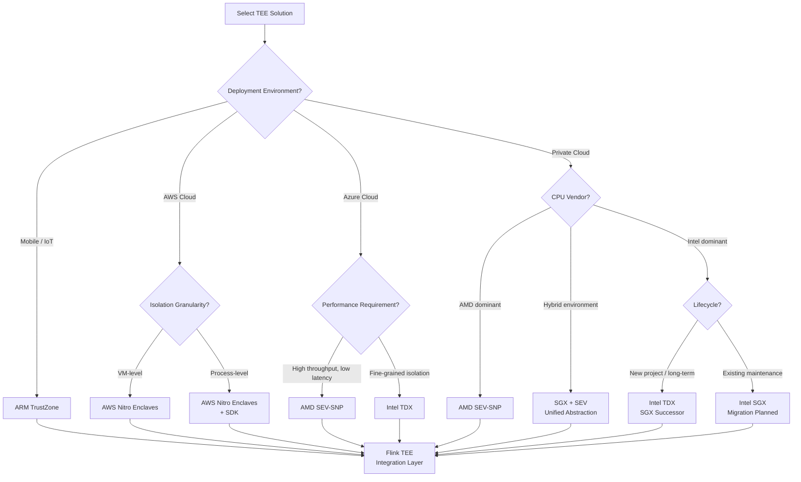

# Trusted Execution Environment for Streaming: Intel SGX / AMD SEV / ARM TrustZone

> Stage: Flink/Security | Prerequisites: [Flink Security Features](flink-security-complete-guide.md) | Formalization Level: L3-L4

## 1. Concept Definitions (Definitions)

### Def-F-13-04: Trusted Execution Environment (可信执行环境, TEE)

**Formal Definition**:

A Trusted Execution Environment (TEE) is an isolated execution domain on a computing platform with the following properties:

$$\text{TEE} = (M_{secure}, C_{trust}, A_{attest}, K_{bound})$$

where:

- $M_{secure}$: Hardware-protected memory region, inaccessible to the operating system and hypervisor
- $C_{trust}$: Trusted Computing Base (TCB), comprising hardware and minimal firmware
- $A_{attest}$: Remote attestation mechanism, proving enclave integrity to external verifiers
- $K_{bound}$: Key-binding mechanism, ensuring cryptographic keys are accessible only to a specific enclave configuration

**Security Guarantees**:

| Guarantee | Description |
|-----------|-------------|
| Confidentiality (机密性) | External entities cannot read enclave memory contents |
| Integrity (完整性) | External entities cannot tamper with enclave code / data |
| Verifiability (可验证性) | Remote parties can cryptographically verify enclave state |

**Intuitive Explanation**: A TEE is a "black box" inside the CPU—even if the operating system is compromised or the cloud administrator acts maliciously, computation and data within the enclave remain secure.

---

### Def-F-13-05: Enclave (飞地)

**Formal Definition**:

An enclave is the minimal execution unit inside a TEE:

$$\text{Enclave} = (C_{code}, D_{sealed}, E_{entry}, P_{perm})$$

where:

- $C_{code}$: Trusted code executed inside the enclave
- $D_{sealed}$: Sealed persistent storage (bound to enclave identity)
- $E_{entry}$: Controlled entry-point set (ECALL / OCALL interfaces)
- $P_{perm}$: Permission policy (memory access and system-call restrictions)

**Enclave Lifecycle State Machine**:

```
[CREATED] → [INITIALIZED] → [RUNNING] → [DESTROYED]
               ↓                ↓
            [SEALED]        [SUSPENDED]
```

**Interface Constraints**:

- ECALL (Enclave Call): External → Enclave, strict type checking
- OCALL (Outside Call): Enclave → External, restricted system calls

---

### Def-F-13-06: Remote Attestation (远程证明)

**Formal Definition**:

Remote attestation is a protocol by which a Prover (证明者) proves enclave integrity to a Verifier (验证者):

$$\text{RA} = (P_{prover}, V_{verifier}, C_{challenge}, R_{quote}, V_{policy})$$

**Attestation Flow**:

```
┌─────────────┐                    ┌─────────────┐
│  Verifier   │ ──── Challenge ───→│   Prover    │
│  (Flink JM) │                    │  (Task Enclave)
└─────────────┘                    └─────────────┘
       ↑                                  │
       └────── Quote + Evidence ─────────┘
                      │
                      ↓
              ┌─────────────┐
              │  Attestation  │
              │   Service     │
              │  (Intel PCS/  │
              │   AMD ASP)    │
              └─────────────┘
```

**Quote Structure**:

| Field | Description |
|-------|-------------|
| MRENCLAVE | Hash measurement of enclave code / data |
| MRSIGNER | Enclave signer identity |
| ISVPRODID | Product ID |
| ISVSVN | Security version number |
| REPORTDATA | Application-layer binding data |

---

### Def-F-13-07: Secure Channel Establishment (安全通道建立)

**Formal Definition**:

An end-to-end encrypted channel is established based on remote attestation results:

$$\text{SC} = \text{RA} \circ \text{TLS} \circ \text{KDF}(R_{quote}, N_{ephemeral})$$

**Key Derivation Process**:

```
┌─────────────────┐
│  Quote REPORTDATA│ ← Contains ephemeral public-key hash
└────────┬────────┘
         ↓
┌─────────────────┐
│  Verify Quote   │ ← Verify MRENCLAVE / MRSIGNER
└────────┬────────┘
         ↓
┌─────────────────┐
│  ECDH Key Exchange│
└────────┬────────┘
         ↓
┌─────────────────┐
│  HKDF-SHA256    │ ← Derive session key
└────────┬────────┘
         ↓
   [Application Data]
```

**Security Properties**: Forward secrecy, identity binding, man-in-the-middle protection

---

## 2. Property Derivation (Properties)

### Prop-F-13-02: TEE Security Boundary Theorem

**Proposition**: Under the TEE threat model, even if an attacker controls the following components, computation inside the enclave remains confidential and intact:

$$\text{Attacker} \in \{\text{OS}, \text{Hypervisor}, \text{BIOS}, \text{Admin}, \text{Network}\}$$

**Proof Sketch**:

1. Hardware memory encryption: $M_{secure}$ contents are protected by the CPU memory-encryption engine
2. Access control: the CPU forbids non-enclave code from accessing $M_{secure}$
3. Measurement chain: from the hardware root of trust,逐级度量至飞地启动
4. Remote attestation: external verifiers cryptographically verify enclave state

### Prop-F-13-03: Data Sealing Binding Theorem

**Proposition**: Sealed data $D_{sealed}$ can be decrypted only by an enclave satisfying:

$$\text{Decrypt}(D_{sealed}) \Rightarrow \text{MRENCLAVE} = H(C_{expected}) \lor \text{MRSIGNER} \in \text{TrustedSigners}$$

**Engineering Significance**: Enables access control based on code identity (exact match) or signer identity (policy-based trust).

### Lemma-F-13-01: Side-Channel Resistance Lemma

**Lemma**: Standard TEE implementations **do not guarantee** resistance against the following attacks:

- Cache timing side channels (缓存时序侧信道)
- Power analysis (功耗分析)
- Memory access pattern analysis (内存访问模式分析)

**Mitigation Strategies**: Constant-time algorithms, ORAM, randomized execution

---

## 3. Relation Establishment (Relations)

### 3.1 TEE Technology Comparison Matrix

| Feature | Intel SGX | AMD SEV-SNP | ARM TrustZone | Intel TDX | AWS Nitro Enclaves |
|---------|:---------:|:-----------:|:-------------:|:---------:|:------------------:|
| **Isolation Granularity** | Process-level | VM-level | Dual-world | VM-level | Process-level (Enclave) |
| **Memory Capacity** | 128 MB – 1 GB (EPC) | Unlimited | TrustZone memory limited | Unlimited | Instance-limited |
| **TCB Size** | Small (CPU + uCode) | Large (CPU + SEV FW) | Medium (Secure World SW) | Large (TDX Module) | Small (Nitro Hypervisor) |
| **Cloud Vendor Support** | Azure Confidential Computing | Azure / AWS / GCP | Mobile / IoT only | Azure / AWS (Preview) | AWS Only |
| **Status** | Deprecated (2024) | Mainstream | Active | SGX successor | AWS-specific |
| **Attestation Service** | Intel PCS | AMD ASP | Device manufacturer | Intel TDX Service | AWS Nitro TPM |

### 3.2 Flink–TEE Integration Architecture



### 3.3 TEE–Flink Security Mechanism Mapping

| Flink Security Requirement | TEE Solution | Implementation |
|---------------------------|--------------|----------------|
| Data encryption | Memory encryption + sealed storage | AES-GCM inside enclave |
| Key protection | Enclave-bound keys | Sealing key derivation |
| Operator integrity | MRENCLAVE verification | Pre-deployment quote validation |
| Audit logs | Tamper-evident logs | Enclave-internal signing |
| Communication security | Attestation-based TLS | RA-TLS handshake |

---

## 4. Argumentation Process (Argumentation)

### 4.1 Threat Model Analysis

**Dolev-Yao Style Attacker Capabilities**:

```
┌─────────────────────────────────────────────────────────────┐
│                Attacker Capability Levels                    │
├─────────────────────────────────────────────────────────────┤
│ L1: Network Attacker   → Passive eavesdropping / active     │
│                          traffic tampering                  │
│ L2: System User        → Ordinary system privileges, no root│
│ L3: System Admin       → Root privileges, access to all mem│
│ L4: Cloud Admin        → Hypervisor control, pause/migrate  │
│                          VM                                 │
│ L5: Hardware Attacker  → Physical access, side-channel      │
│                          analysis                           │
└─────────────────────────────────────────────────────────────┘
```

**TEE Protection Boundary**: Effective protection up to L4 (cloud administrator); L5 requires additional physical safeguards.

### 4.2 Implementation Complexity Trade-offs

| Approach | Complexity | Performance Overhead | Applicable Scenario |
|----------|-----------|----------------------|---------------------|
| Full-operator enclave | High | 20–40 % | Extremely sensitive data |
| Sensitive-operator enclave | Medium | 5–15 % | Key operations, PII processing |
| Data sealing only | Low | < 5 % | Static data protection |
| Remote attestation + channel | Medium | 2–5 % | Key distribution scenarios |

### 4.3 Comparison with Existing Flink Security Mechanisms

| Mechanism | Protection Target | Dependency | TEE Enhancement |
|-----------|-------------------|------------|-----------------|
| TLS (SSL) | Network transit | PKI | Attestation-bound identity |
| Kerberos | Authentication | KDC | Hardware-verified credentials |
| KMS integration | Key management | External service | Keys non-extractable from enclave |
| Disk encryption | Data at rest | OS | Memory remains encrypted |

---

## 5. Formal Proof / Engineering Argument (Proof / Engineering Argument)

### 5.1 Argument for Flink Sensitive-Operator Enclave Execution

**Proposition**: When executing sensitive operators (e.g., decryption, PII processing) in Flink, a TEE enclave provides stronger security guarantees than a pure-software solution.

**Argument**:

**Premises**:

- $A_1$: The attacker may obtain OS privileges on the TaskManager
- $A_2$: The attacker may gain control of the JobManager
- $A_3$: The hardware TEE implementation is correct (Intel / AMD / ARM trust assumption)

**Security Goal**: Sensitive data $D_{sensitive}$ remains invisible to the attacker during computation

**Proof Steps**:

1. **Code Measurement Binding**

   ```text
   At enclave launch:
   MRENCLAVE = SHA256(CODE_INIT || DATA_INIT || HEAP_INIT)
   ```

   The attacker cannot forge malicious code matching a specific MRENCLAVE.

2. **Key Sealing Mechanism**

   ```text
   SealedKey = AES-GCM(K_seal, Key_material)
   K_seal = CMAC(SK, MRENCLAVE || MRSIGNER)
   ```

   Only an enclave with the same MRENCLAVE can unseal the key.

3. **Secure Input Channel**

   ```text
   Data_in = Decrypt(K_session, Ciphertext)
   K_session derived from RA-TLS handshake
   ```

   Input data is visible only to an enclave that has passed remote attestation.

4. **Isolated Execution**
   - Sensitive operators execute inside the enclave: $Compute(D_{sensitive}) \in Enclave$
   - Results are output through the secure channel

**Conclusion**: Even if the attacker controls the OS / hypervisor, $D_{sensitive}$ cannot be extracted.

### 5.2 Remote Attestation Protocol Correctness

**Protocol Steps**:

```

1. V → P: Challenge = {N_v, T_expiry}
2. P → V: Quote = Sign(AK, MRENCLAVE || MRSIGNER || Hash(N_v || P_pk))
3. V → AS: Verify(Quote)
4. AS → V: AttestationResult = {Status, TCB_level}
5. V: Verify(Status == OK && TCB_level >= MIN_LEVEL)
6. V → P: {K_session}_P_pk

```

**Security Property Verification**:

| Property | Verification Method |
|----------|---------------------|
| Freshness | Challenge contains nonce $N_v$ |
| Timeliness | $T_{expiry}$ limits window |
| Identity Binding | Quote contains enclave measurement |
| Key Confirmation | Hash contains ephemeral public key $P_{pk}$ |

---

## 6. Example Validation (Examples)

### 6.1 Financial Data Encrypted Computation

**Scenario**: A bank uses Flink to perform real-time analytics on encrypted transaction data, requiring risk-control computation without decryption.

**Architecture**:



**Key Code Pattern**:

```java
// Enclave-internal decrypt operator (conceptual sketch)
public class SecureDecryptOperator extends RichMapFunction<byte[], Transaction> {

    private EnclaveContext enclave;
    private SealedKey sealedKey;

    @Override
    public void open(Configuration params) {
        // 1. Launch enclave
        enclave = EnclaveFactory.create("decrypt_enclave.signed.so");

        // 2. Perform remote attestation
        Quote quote = enclave.generateQuote(REPORT_DATA);
        AttestationResult result = AttestationClient.verify(quote);
        if (!result.isValid()) {
            throw new SecurityException("Enclave attestation failed");
        }

        // 3. Unseal key (valid only for this enclave configuration)
        sealedKey = loadSealedKey();
        byte[] keyMaterial = enclave.unseal(sealedKey);
        enclave.initCipher(keyMaterial);
    }

    @Override
    public Transaction map(byte[] encryptedData) {
        // 4. Decrypt and process inside enclave
        return enclave.ecall("decrypt_and_validate", encryptedData);
    }
}
```

**Security Guarantees**:

- The decryption key never leaves the enclave
- Transaction data plaintext exists only in encrypted memory
- Enclave code hash is verified before each deployment

### 6.2 Healthcare Privacy Analytics

**Scenario**: A hospital federation uses Flink for cross-institutional patient data analysis, requiring compliance with HIPAA / GDPR.

**Privacy Requirements**:

1. Patient PII (Personal Identifiable Information, 个人身份信息) must not be exposed to cloud operators
2. Analysis results require differential privacy protection
3. All access must be auditable

**TEE Architecture Design**:

```
┌─────────────────────────────────────────────────────────────┐
│              Hospital Data Centers A / B / C               │
│  ┌─────────────┐    ┌─────────────┐    ┌─────────────┐     │
│  │ Data Source │    │ Data Source │    │ Data Source │     │
│  │ (PII encrypted)│  │ (PII encrypted)│  │ (PII encrypted)│  │
│  └──────┬──────┘    └──────┬──────┘    └──────┬──────┘     │
└─────────┼──────────────────┼──────────────────┼────────────┘
          │                  │                  │
          └──────────────────┼──────────────────┘
                             ↓
┌─────────────────────────────────────────────────────────────┐
│                    Flink Cluster (Cloud)                    │
│                                                             │
│  ┌─────────────────────────────────────────────────────┐   │
│  │           Federated Learning Enclave                │   │
│  │  ┌─────────┐  ┌─────────┐  ┌─────────────────────┐  │   │
│  │  │ Local   │  │ Local   │  │ Aggregation         │  │   │
│  │  │ Model   │  │ Model   │  │ (Secure Multi-Party)│  │   │
│  │  │ Train   │  │ Train   │  │                     │  │   │
│  │  └────┬────┘  └────┬────┘  └──────────┬──────────┘  │   │
│  │       └─────────────┴──────────────────┘             │   │
│  │                      │                               │   │
│  │               ┌──────┴──────┐                        │   │
│  │               │ Differential│                        │   │
│  │               │ Privacy     │                        │   │
│  │               │ (Noise)     │                        │   │
│  │               └──────┬──────┘                        │   │
│  └──────────────────────┼───────────────────────────────┘   │
│                         ↓                                   │
│                  ┌────────────┐                             │
│                  │  Global    │                             │
│                  │  Model     │                             │
│                  └────────────┘                             │
└─────────────────────────────────────────────────────────────┘
```

**TEE Key Implementation**:

1. **PII Identification and De-identification** (inside enclave)

   ```python

# Executed inside enclave

def process_patient_record(encrypted_record):
    # Decrypt inside enclave
    record = decrypt_in_enclave(encrypted_record)

    # Identify PII fields
    pii_fields = extract_pii(record)

    # Replace with token
    for field in pii_fields:
        record[field] = generate_token(field_value)

    return record

```

2. **Differential Privacy Noise Addition**

   ```python
def add_differential_privacy_noise(result, epsilon):
    # Add Laplace noise inside enclave
    # Ensures original statistics are not leaked
    sensitivity = compute_sensitivity()
    noise = laplace_noise(sensitivity / epsilon)
    return result + noise
```

1. **Audit Log (Enclave Signature)**

   ```text
   LogEntry = {
       timestamp: 1712054400,
       operation: "AGGREGATION",
       data_hash: SHA256(input_data),
       enclave_signature: Sign(AK, log_content)
   }
   ```

**Compliance Guarantees**:

- Data processing occurs inside an attested enclave (GDPR Art. 32)
- Access control is based on hardware attestation (HIPAA technical safeguards)
- Audit logs are tamper-evident (compliance audit requirements)

---

## 7. Visualizations (Visualizations)

### 7.1 Flink TEE Security Architecture Overview



### 7.2 Remote Attestation Sequence Diagram



### 7.3 TEE Selection Decision Tree



---

## 8. References (References)

---

*Document Version: v1.0 | Created: 2026-04-20*
