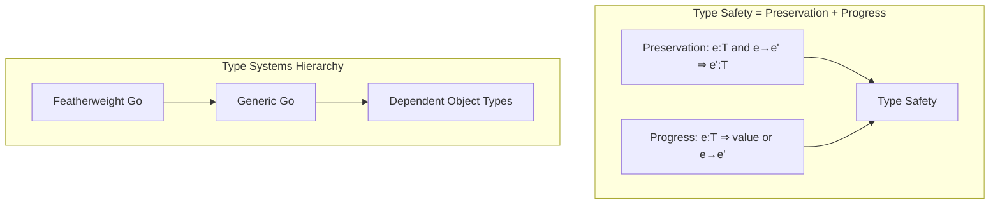

# Type Safety Derivation

> **Stage**: Struct | **Prerequisites**: [Actor Model Formalization](actor-model-formalization.md), [CSP Formalization](csp-formalization.md) | **Formalization Level**: L3
> **Translation Date**: 2026-04-21

## Abstract

This document formalizes type safety for core computational constructs in the Actor-CSP unified model, covering Featherweight Go (FG), Featherweight Generic Go (FGG), and Dependent Object Types (DOT).

---

## 1. Definitions

### 1.1 Type Safety

**Type safety** guarantees that well-typed programs do not get stuck:

$$\text{TypeSafe}(P) \triangleq \forall P': P \to^* P' \Rightarrow (P' \text{ is a value}) \lor (\exists P'': P' \to P'')$$

Equivalently, type safety = **Preservation** + **Progress**.

### 1.2 Featherweight Go (FG)

FG is a minimal core of Go with:

- Structs and interfaces
- Method declarations
- Structural subtyping

**Syntax** (simplified):

```
t ::=                         // types
    t_name                  // named type
    struct { f: t }         // struct type
    interface { m: sig }    // interface type

v ::=                         // values
    struct { f = v }        // struct literal

e ::=                         // expressions
    v                       // value
    e.f                     // field access
    e.m(e)                  // method call
```

### 1.3 Featherweight Generic Go (FGG)

FGG extends FG with parametric polymorphism:

```
t ::= ... | t_name[t, ...]   // instantiated generic type

// Type parameter bounds
interface { m[T any]: sig }
```

### 1.4 Dependent Object Types (DOT)

DOT supports path-dependent types:

```
t ::= ... | x.L               // path-dependent type (type member L of object x)

// { z => T^z }               // recursive self type
```

---

## 2. Properties

### 2.1 FG Subtyping

FG subtyping is structural:

$$\frac{\forall m \in I_2: m \in I_1 \land \text{sig}_1(m) = \text{sig}_2(m)}{I_1 <: I_2}$$

An interface $I_1$ is a subtype of $I_2$ if $I_1$ implements all methods of $I_2$ with compatible signatures.

### 2.2 FGG Generic Properties

- **Type substitution**: Replacing type parameters with concrete types preserves well-typedness.
- **Bounds satisfaction**: Substituted types must satisfy parameter bounds.

### 2.3 DOT Path Dependency

Path-dependent types enable types to refer to values:

```scala
// Scala-like syntax
trait Config { type Output }
def process(c: Config): c.Output  // return type depends on argument value
```

---

## 3. Relations to Actor/CSP

### 3.1 FG and Actor/CSP

- **FG structs** model Actor states
- **FG interfaces** model message protocols (type-safe message passing)
- **Method calls** model synchronous communication (CSP-style)

### 3.2 FGG and Generic Messages

- **Type parameters** enable generic message containers: `Message[T]`
- **Bounds** ensure message handlers accept only supported types

### 3.3 DOT and Path-Dependent Types

- **Path-dependent types** model actor references whose capabilities depend on creation context
- **Recursive self types** model actor protocols that reference the actor's own type

---

## 4. Key Lemmas

### Lemma-S-02-03 (Substitution Lemma)

If $\Gamma, x: T_1 \vdash e: T_2$ and $\Gamma \vdash v: T_1$, then:

$$\Gamma \vdash [x \mapsto v]e: T_2$$

### Lemma-S-02-04 (Inversion)

If $\Gamma \vdash e.f: T$, then $e$ has a struct type with field $f: T$.

### Lemma-S-02-05 (Canonical Forms)

If $\Gamma \vdash v: \text{struct}\{\ldots\}$, then $v = \text{struct}\{f_1 = v_1, \ldots\}$.

---

## 5. Type Safety Theorem

### Thm-S-02-03 (Preservation)

If $\Gamma \vdash e: T$ and $e \to e'$, then $\Gamma \vdash e': T$.

**Proof Sketch.** By case analysis on evaluation rules:

- Field access: substitution preserves typing (Substitution Lemma)
- Method call: method body well-typed by method declaration

### Thm-S-02-04 (Progress)

If $\Gamma \vdash e: T$, then either $e$ is a value or $\exists e': e \to e'$.

**Proof Sketch.** By case analysis on expression form:

- Values: already terminal
- Field access: Canonical Forms guarantees struct value
- Method call: receiver is a value with the required method

### Thm-S-02-05 (Type Safety)

If $\vdash e: T$, then evaluation of $e$ does not get stuck.

**Proof.** Direct from Preservation + Progress. ∎

---

## 6. Examples

### 6.1 Type Derivation Tree

```
Γ ⊢ e: struct{count: int}        Γ ⊢ struct{count: int} <: struct{count: int}
-----------------------------------------(T-Field)
Γ ⊢ e.count: int
```

### 6.2 Type Assertion Failure (Counterexample)

```go
// Invalid: interface does not implement required method
var x interface{ Write([]byte) } = struct{}{}  // Type error!
```

---

## 7. Visualizations



---

## 8. References
